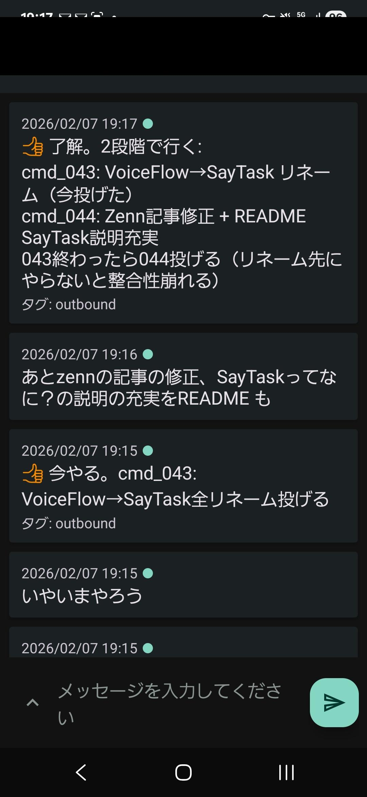
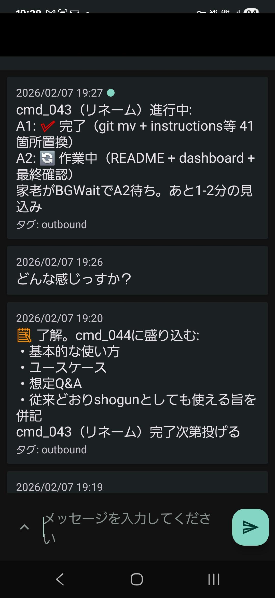
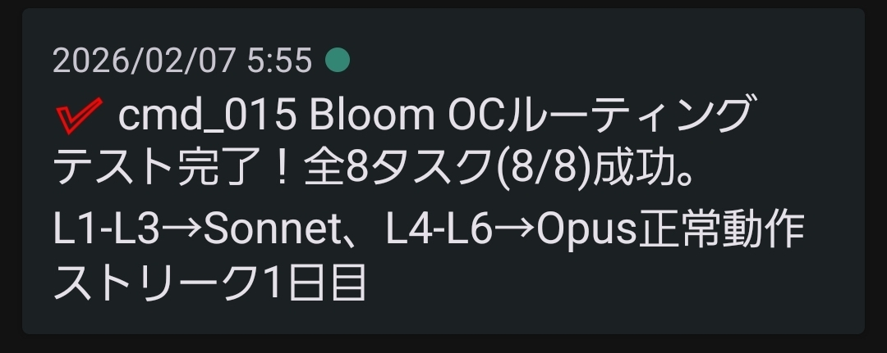
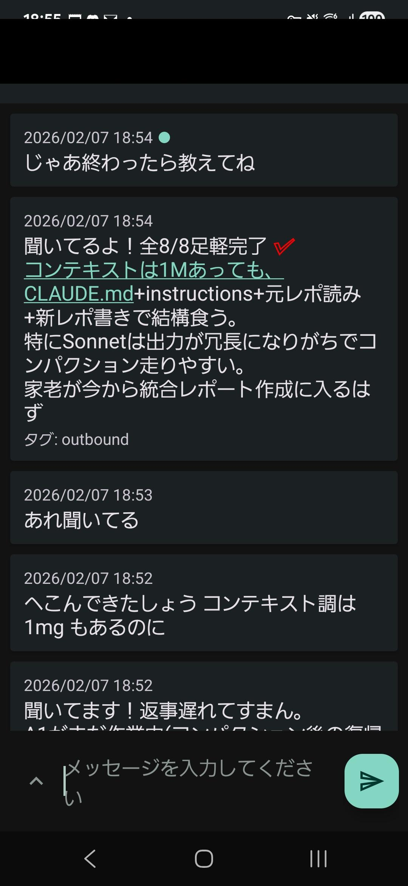
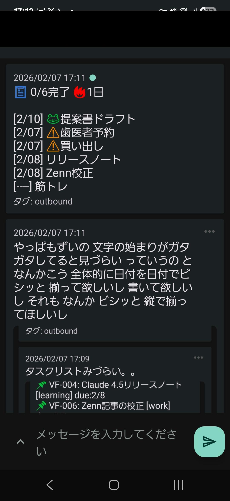
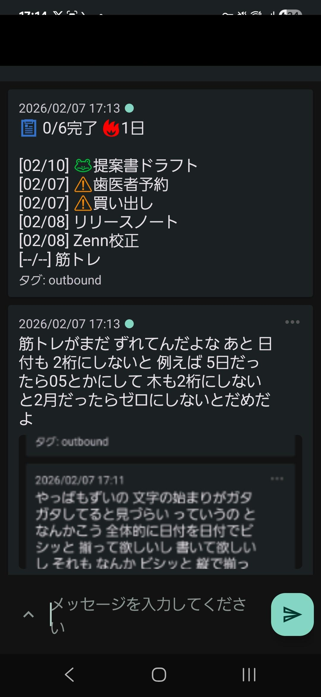

<div align="center">

# multi-agent-shogun

**Command your AI army like a feudal warlord.**

Run 10 AI coding agents in parallel through a Sengoku hierarchy: **Claude Code, OpenAI Codex, GitHub Copilot, and Kimi Code** coordinated by YAML, tmux, and event-driven mailboxes.

**Talk coding, not vibe coding. Speak from your terminal, phone, or Android companion app.**

[](https://github.com/simokitafresh/multi-agent-shogun)
[](https://opensource.org/licenses/MIT)
[](https://github.com/simokitafresh/multi-agent-shogun)
[-2d7d46?style=flat-square)](https://github.com/simokitafresh/multi-agent-shogun)
[]()

[English](README.md) | [日本語](README_ja.md)

</div>

<!-- <p align="center">
  
</p> -->

<p align="center"><i>One Karo coordinating 8 ninja in the live Opus4 + Codex4 formation — real session, no mock data.</i></p>

---

## What is this?

**multi-agent-shogun** is a multi-agent development platform for real work, not toy demos. The current live formation is:

- Shogun + Karo on **Claude Code / Opus**
- Sasuke, Kirimaru, Hayate, Saizo on **Codex / gpt-5.4**
- Kagemaru, Hanzo, Kotaro, Tobisaru on **Claude Code / Opus**

**Why use it?**
- One command launches **10 agents** and returns control immediately
- Workers coordinate through **YAML + tmux**, not expensive API orchestration
- The repo includes a **GATE pipeline**, **lesson cycle**, **pending-decision system**, and **cmd chronicle**
- Remote control is built in through **ntfy**, **Tailscale/Termux/mosh**, and the **Android companion app**
- Zero wait time — give your next order while tasks run in the background
- AI remembers your preferences across sessions (Memory MCP for Shogun)
- Real-time progress on a dashboard and `queue/karo_snapshot.txt`

```
        You (上様 / The Lord)
             │
             ▼  Give orders
      ┌─────────────┐
      │   SHOGUN    │  ← Receives your command, delegates instantly
      └──────┬──────┘
             │  YAML + tmux
      ┌──────▼──────┐
      │    KARO     │  ← Distributes tasks to workers
      └──────┬──────┘
             │
    ┌─┬─┬─┬─┴─┬─┬─┬─┐
    │1│2│3│4│5│6│7│8│  ← 8 workers execute in parallel
    └─┴─┴─┴─┴─┴─┴─┴─┘
          NINJA
```

---

## Live Operating Record

| Metric | Current value |
|---|---|
| GATE CLEAR | 465 / 467 (99.6%) |
| CLEAR streak | 295 consecutive wins (`cmd_357` to `cmd_660`) |
| Commands issued | 665+ |
| Lesson injection rate | 75.1% |
| Lesson effectiveness | 70.3% |

The numbers above come from the current `dashboard.md` battle metrics and reflect this local installation, not the upstream fork.

---

## Why Shogun?

Most multi-agent frameworks burn API tokens on coordination. Shogun doesn't.

| | Claude Code `Task` tool | LangGraph | CrewAI | **multi-agent-shogun** |
|---|---|---|---|---|
| **Architecture** | Subagents inside one process | Graph-based state machine | Role-based agents | Feudal hierarchy via tmux |
| **Parallelism** | Sequential (one at a time) | Parallel nodes (v0.2+) | Limited | **8 independent agents** |
| **Coordination cost** | API calls per Task | API + infra (Postgres/Redis) | API + CrewAI platform | **Zero** (YAML + tmux) |
| **Observability** | Claude logs only | LangSmith integration | OpenTelemetry | **Live tmux panes** + dashboard |
| **Skill discovery** | None | None | None | **Bottom-up auto-proposal** |
| **Setup** | Built into Claude Code | Heavy (infra required) | pip install | Shell scripts |

### What makes this different

**Zero coordination overhead** — Agents talk through YAML files on disk. The only API calls are for actual work, not orchestration. Run 8 agents and pay only for 8 agents' work.

**Full transparency** — Every agent runs in a visible tmux pane. Every instruction, report, and decision is a plain YAML file you can read, diff, and version-control. No black boxes.

**Battle-tested hierarchy** — The Shogun → Karo → Ninja chain of command prevents conflicts by design: clear ownership, dedicated files per agent, event-driven communication, no polling.

---

## What Makes This Fork Different

| Capability | What it means in this repo |
|---|---|
| **7-layer knowledge system** | System rules, role instructions, project core, project lessons, live YAML state, Vercel-style context indexes, and Memory MCP each have a distinct home |
| **Vercel-style context** | `context/*.md` is an index layer; deep investigations move into `docs/research/` and are linked back instead of duplicated |
| **Lesson cycle** | Lessons are injected into tasks, referenced during work, scored after GATE, and auto-deprecated when they stop helping |
| **GATE system** | `cmd_complete_gate.sh`, `gate_cmd_state.sh`, and `gate_lesson_health.sh` block false-done reports and stale operational state |
| **Karo snapshot** | `queue/karo_snapshot.txt` rebuilds real-time formation state after recovery or compaction |
| **Pending decisions** | `queue/pending_decisions.yaml` tracks unresolved rulings that still need a human or Shogun decision |
| **Cmd chronicle** | `context/cmd-chronicle.md` keeps the recent command history cheap to reload |
| **Android companion** | `android/` ships a Kotlin + Jetpack Compose app for SSH control, dashboard viewing, and ntfy-driven mobile workflows |

---

## Why CLI (Not API)?

Most AI coding tools charge per token. Running 8 Opus-grade agents through the API costs **$100+/hour**. CLI subscriptions flip this:

| | API (Per-Token) | CLI (Flat-Rate) |
|---|---|---|
| **8 agents × Opus** | ~$100+/hour | ~$200/month |
| **Cost predictability** | Unpredictable spikes | Fixed monthly bill |
| **Usage anxiety** | Every token counts | Unlimited |
| **Experimentation budget** | Constrained | Deploy freely |

**"Use AI recklessly"** — With flat-rate CLI subscriptions, deploy 8 agents without hesitation. The cost is the same whether they work 1 hour or 24 hours. No more choosing between "good enough" and "thorough" — just run more agents.

### Multi-CLI Support

Shogun isn't locked to one vendor. The system supports 4 CLI tools, each with unique strengths:

| CLI | Key Strength | Default Model |
|-----|-------------|---------------|
| **Claude Code** | Battle-tested tmux integration, Memory MCP, dedicated file tools (Read/Write/Edit/Glob/Grep) | Claude Opus 4.6 |
| **OpenAI Codex** | Sandbox execution, JSONL structured output, `codex exec` headless mode | gpt-5.4 |
| **GitHub Copilot** | Built-in GitHub MCP, 4 specialized agents (Explore/Task/Plan/Code-review), `/delegate` to coding agent | Provider-managed |
| **Kimi Code** | Free tier available, strong multilingual support | Kimi k2 |

A unified instruction build system generates CLI-specific instruction files from shared templates:

```
instructions/
├── common/              # Shared rules (all CLIs)
├── cli_specific/        # CLI-specific tool descriptions
│   ├── claude_tools.md  # Claude Code tools & features
│   └── copilot_tools.md # GitHub Copilot CLI tools & features
└── roles/               # Role definitions (shogun, karo, ninja)
    ↓ build
CLAUDE.md / AGENTS.md / copilot-instructions.md  ← Generated per CLI
```

One source of truth, zero sync drift. Change a rule once, all CLIs get it.

---

## Bottom-Up Skill Discovery

This is the feature no other framework has.

As ninja execute tasks, they **automatically identify reusable patterns** and propose them as skill candidates. The Karo aggregates these proposals in `dashboard.md`, and you — the Lord — decide what gets promoted to a permanent skill.

```
Ninja finishes a task
    ↓
Notices: "I've done this pattern 3 times across different projects"
    ↓
Reports in YAML:  skill_candidate:
                     found: true
                     name: "api-endpoint-scaffold"
                     reason: "Same REST scaffold pattern used in 3 projects"
    ↓
Appears in dashboard.md → You approve → Skill created in .claude/commands/
    ↓
Any agent can now invoke /api-endpoint-scaffold
```

Skills grow organically from real work — not from a predefined template library. Your skill set becomes a reflection of **your** workflow.

---

## Quick Start

### Windows (WSL2)

<table>
<tr>
<td width="60">

**Step 1**

</td>
<td>

📥 **Download the repository**

[Download ZIP](https://github.com/simokitafresh/multi-agent-shogun/archive/refs/heads/main.zip) and extract to `C:\tools\multi-agent-shogun`

*Or use git:* `git clone https://github.com/simokitafresh/multi-agent-shogun.git C:\tools\multi-agent-shogun`

</td>
</tr>
<tr>
<td>

**Step 2**

</td>
<td>

🖱️ **Run `install.bat`**

Right-click → "Run as Administrator" (if WSL2 is not installed). Sets up WSL2 + Ubuntu automatically.

</td>
</tr>
<tr>
<td>

**Step 3**

</td>
<td>

🐧 **Open Ubuntu and run** (first time only)

```bash
cd /mnt/c/tools/multi-agent-shogun
./first_setup.sh
```

</td>
</tr>
<tr>
<td>

**Step 4**

</td>
<td>

✅ **Deploy!**

```bash
./shutsujin_departure.sh
```

</td>
</tr>
</table>

#### First-time only: Authentication

After `first_setup.sh`, run these commands once to authenticate:

```bash
# 1. Apply PATH changes
source ~/.bashrc

# 2. OAuth login + Bypass Permissions approval (one command)
claude --dangerously-skip-permissions
#    → Browser opens → Log in with Anthropic account → Return to CLI
#    → "Bypass Permissions" prompt appears → Select "Yes, I accept" (↓ to option 2, Enter)
#    → Type /exit to quit
```

This saves credentials to `~/.claude/` — you won't need to do it again.

#### Daily startup

Open an **Ubuntu terminal** (WSL) and run:

```bash
cd /mnt/c/tools/multi-agent-shogun
./shutsujin_departure.sh
```

| Scenario | Command | What happens |
|----------|---------|-------------|
| **Continue from yesterday** | `./shutsujin_departure.sh` | Queues, dashboard, and reports are preserved. Command numbers continue |
| **Fresh start** | `./shutsujin_departure.sh -c` | All task queues, reports, inbox, and dashboard reset to blank. Previous data auto-backed up to `logs/backup_YYYYMMDD_HHMMSS/` |

After launch, connect to the session:

```bash
tmux attach-session -t shogun    # or alias: csm
# Ctrl+A → 0  Shogun (give commands here)
# Ctrl+A → 1  Workers (watch agents work)
```

### 📱 Mobile Access (Command from anywhere)

Control your AI army from your phone in two ways:

- **Terminal route**: Tailscale + Termux + `mosh` or `ssh`
- **App route**: the Android companion in [`android/`](android/) using SSH/JSch plus ntfy push

#### Option A: Termux + Tailscale + mosh

1. Install the clients
   - Android: Tailscale, Termux from F-Droid, optional ntfy app
   - WSL/Ubuntu host: Tailscale, `openssh-server`, `mosh`
2. Prepare the host
   ```bash
   sudo apt update
   sudo apt install -y openssh-server mosh
   sudo service ssh start
   tailscale ip -4
   whoami
   tmux ls
   ```
3. Connect from Termux
   ```sh
   pkg update
   pkg install openssh mosh
   mosh youruser@your-tailscale-ip -- tmux attach -t shogun
   ```
4. Fallback when UDP is blocked
   ```sh
   ssh youruser@your-tailscale-ip -t 'tmux attach -t shogun'
   ```
5. Work inside tmux
   - `Ctrl+A` then `0` opens the Shogun window
   - `Ctrl+A` then `1` opens the agents window
   - `Ctrl+A` then `d` detaches without stopping the agents

#### Where to find the values

| Value | Command on the host | Current example in this repo |
|---|---|---|
| Tailscale IPv4 | `tailscale ip -4` | `100.75.173.26` |
| SSH username | `whoami` | `simokitafresh` |
| Project path | `pwd` | `/mnt/c/tools/multi-agent-shogun` |
| tmux session name | `tmux ls` | `shogun` |
| tmux prefix | `tmux show-options -gqv prefix` | `C-a` |
| Android APK | [Download](https://github.com/simokitafresh/multi-agent-shogun/releases/download/v4.2/shogun-companion.apk) | `shogun-companion.apk` |

#### Why mosh

- Handles mobile packet loss and IP changes better than plain SSH
- Keeps the terminal usable while switching between Wi-Fi and cellular
- Leaves the tmux session untouched, so the agents keep running even if the phone disconnects

#### Troubleshooting

| Problem | Check |
|---|---|
| `mosh` cannot connect | Confirm `mosh-server` exists on the host and UDP is not blocked |
| SSH works but tmux does not attach | Run `tmux ls` and use the exact session name it prints |
| The Android app opens but the wrong panes appear | Recheck the tmux session names and project path in [`android/README.md`](android/README.md) |
| ntfy works but the Android app terminal does not | The app uses SSH/JSch, not mosh |
| Termux packages are missing or outdated | Install Termux from F-Droid, not the deprecated Play Store build |

#### Option B: Android companion app

The repo now includes a mobile client in [`android/`](android/):

- **Kotlin + Jetpack Compose + Material 3**
- **4 tabs**: Shogun, Agents, Dashboard, Settings
- **SSH/JSch** for live tmux control
- **ntfy** for push notifications
- **Download APK: [`shogun-companion.apk`](https://github.com/simokitafresh/multi-agent-shogun/releases/download/v4.2/shogun-companion.apk)**

See [`android/README.md`](android/README.md) for screen-by-screen setup.

---

<details>
<summary>🐧 <b>Linux / macOS</b> (click to expand)</summary>

### First-time setup

```bash
# 1. Clone
git clone https://github.com/simokitafresh/multi-agent-shogun.git ~/multi-agent-shogun
cd ~/multi-agent-shogun

# 2. Make scripts executable
chmod +x *.sh

# 3. Run first-time setup
./first_setup.sh
```

### Daily startup

```bash
cd ~/multi-agent-shogun
./shutsujin_departure.sh
```

</details>

---

<details>
<summary>❓ <b>What is WSL2? Why is it needed?</b> (click to expand)</summary>

### About WSL2

**WSL2 (Windows Subsystem for Linux)** lets you run Linux inside Windows. This system uses `tmux` (a Linux tool) to manage multiple AI agents, so WSL2 is required on Windows.

### If you don't have WSL2 yet

No problem! Running `install.bat` will:
1. Check if WSL2 is installed (auto-install if not)
2. Check if Ubuntu is installed (auto-install if not)
3. Guide you through next steps (running `first_setup.sh`)

**Quick install command** (run PowerShell as Administrator):
```powershell
wsl --install
```

Then restart your computer and run `install.bat` again.

</details>

---

<details>
<summary>📋 <b>Script Reference</b> (click to expand)</summary>

| Script | Purpose | When to run |
|--------|---------|-------------|
| `install.bat` | Windows: WSL2 + Ubuntu setup | First time only |
| `first_setup.sh` | Install tmux, Node.js, required CLIs, and Memory MCP config | First time only |
| `shutsujin_departure.sh` | Create tmux sessions + launch the mixed CLI formation + load instructions + start ntfy listener | Daily |

### What `install.bat` does automatically:
- ✅ Checks if WSL2 is installed (guides you if not)
- ✅ Checks if Ubuntu is installed (guides you if not)
- ✅ Shows next steps (how to run `first_setup.sh`)

### What `shutsujin_departure.sh` does:
- ✅ Creates tmux sessions (`shogun:main` + `shogun:agents`)
- ✅ Launches the current mixed formation from `config/settings.yaml`
- ✅ Auto-loads instruction files for each agent
- ✅ Resets queue files for a fresh state
- ✅ Starts ntfy listener for phone notifications (if configured)

**After running, all agents are ready to receive commands!**

</details>

---

<details>
<summary>🔧 <b>Manual Requirements</b> (click to expand)</summary>

If you prefer to install dependencies manually:

| Requirement | Installation | Notes |
|-------------|-------------|-------|
| WSL2 + Ubuntu | `wsl --install` in PowerShell | Windows only |
| Set Ubuntu as default | `wsl --set-default Ubuntu` | Required for scripts to work |
| tmux | `sudo apt install tmux` | Terminal multiplexer |
| Node.js v20+ | `nvm install 20` | Required for MCP servers |
| Claude Code CLI | `curl -fsSL https://claude.ai/install.sh \| bash` | Official Anthropic CLI (native version recommended; npm version deprecated) |

</details>

---

### After Setup

Whichever option you chose, **10 AI agents** are automatically launched:

| Agent | Role | Count |
|-------|------|-------|
| 🏯 Shogun | Supreme commander — receives your orders | 1 |
| 📋 Karo | Manager — distributes tasks | 1 |
| ⚔️ Ninja | Workers — execute tasks in parallel | 8 |

One tmux session is created with two windows:
- `shogun:main` — connect here to give commands (Window 0)
- `shogun:agents` — workers running in the background (Window 1, switch with `Ctrl+A → 1`)

---

## How It Works

### Step 1: Connect to the Shogun

After running `shutsujin_departure.sh`, all agents automatically load their instructions and are ready.

Open a new terminal and connect:

```bash
tmux attach-session -t shogun
```

### Step 2: Give your first order

The Shogun is already initialized — just give a command:

```
Research the top 5 JavaScript frameworks and create a comparison table
```

The Shogun will:
1. Write the task to a YAML file
2. Notify the Karo (manager)
3. Return control to you immediately — no waiting!

Meanwhile, the Karo distributes tasks to ninja workers for parallel execution.

### Step 3: Check progress

Open `dashboard.md` in your editor for a real-time status view:

```markdown
## In Progress
| Worker | Task | Status |
|--------|------|--------|
| Sasuke | Research React | Running |
| Kirimaru | Research Vue | Running |
| Hayate | Research Angular | Completed |
```

### Detailed flow

```
You: "Research the top 5 MCP servers and create a comparison table"
```

The Shogun writes the task to `queue/shogun_to_karo.yaml` and wakes the Karo. Control returns to you immediately.

The Karo breaks the task into subtasks:

| Worker | Assignment |
|--------|-----------|
| Sasuke | Research Notion MCP |
| Kirimaru | Research GitHub MCP |
| Hayate | Research Playwright MCP |
| Kagemaru | Research Memory MCP |
| Hanzo | Research Sequential Thinking MCP |

All 5 ninja research simultaneously. You can watch them work in real time:

<!-- <p align="center">
  
</p> -->

Results appear in `dashboard.md` as they complete.

---

## Key Features

### ⚡ 1. Parallel Execution

One command spawns up to 8 parallel tasks:

```
You: "Research 5 MCP servers"
→ 5 ninja start researching simultaneously
→ Results in minutes, not hours
```

### 🔄 2. Non-Blocking Workflow

The Shogun delegates instantly and returns control to you:

```
You: Command → Shogun: Delegates → You: Give next command immediately
                                       ↓
                       Workers: Execute in background
                                       ↓
                       Dashboard: Shows results
```

No waiting for long tasks to finish.

### 🧠 3. Cross-Session Memory (Memory MCP)

Your AI remembers your preferences:

```
Session 1: Tell it "I prefer simple approaches"
            → Saved to Memory MCP

Session 2: AI loads memory on startup
            → Stops suggesting complex solutions
```

### 📡 4. Event-Driven (Zero Polling)

Agents communicate through file-based mailbox (inbox_write.sh + inbox_watcher.sh). **No polling loops wasting API calls.**

**Two-Layer Architecture (nudge-only delivery):**

- **Layer 1: File Persistence**
  - `inbox_write.sh` writes messages to `queue/inbox/{agent}.yaml` with flock (exclusive lock)
  - Full message content stored in YAML — guaranteed persistence
  - Multiple agents can write simultaneously (flock serializes writes)

- **Layer 2: Nudge Delivery**
  - `inbox_watcher.sh` detects file changes via `inotifywait` (kernel event, not polling)
  - Watcher sends a short 1-line nudge via `send-keys` (timeout 5s) to wake the agent
  - Agent reads its own inbox file and processes unread messages
  - **No full message via send-keys** — only a wake-up signal

- **Zero CPU**: Watcher blocks on `inotifywait` until file modification event (CPU 0% while idle)

### 📸 5. Screenshot Integration

VSCode's Claude Code extension lets you paste screenshots to explain issues. This CLI system provides the same capability:

```yaml
# Set your screenshot folder in config/settings.yaml
screenshot:
  path: "/mnt/c/Users/YourName/Pictures/Screenshots"
```

```
# Just tell the Shogun:
You: "Check the latest screenshot"
You: "Look at the last 2 screenshots"
→ AI instantly reads and analyzes your screen captures
```

**Windows tip:** Press `Win + Shift + S` to take screenshots. Set the save path in `settings.yaml` for seamless integration.

Use cases:
- Explain UI bugs visually
- Show error messages
- Compare before/after states

### 📁 6. Context and Knowledge (7-Layer Architecture)

This repo does not rely on one giant prompt. Durable knowledge is split into seven layers:

| Layer | Location | Purpose |
|---|---|---|
| 1. System rules | `AGENTS.md`, `CLAUDE.md` | Global safety rules, recovery routing, and shared operating constraints |
| 2. Role instructions | `instructions/generated/*.md` | Shogun, Karo, and Ninja procedures |
| 3. Project core | `config/projects.yaml`, `projects/<id>.yaml` | Project metadata, paths, and core rules |
| 4. Project lessons | `projects/<id>/lessons.yaml` | Reusable mistakes, fixes, and heuristics |
| 5. Live ops YAML | `queue/`, `tasks/`, `reports/` | Active commands, inboxes, task state, and reports |
| 6. Context index | `context/*.md`, `docs/research/*.md` | Vercel-style retrieval: summaries stay in `context/`, details live in `docs/research/` |
| 7. Memory MCP | `memory/shogun_memory.jsonl` | Lord preferences and Shogun-only long-term memory |

This design enables:
- Any ninja can recover by reloading files instead of replaying the whole conversation
- Knowledge survives agent swaps, `/clear`, and `/new`
- Retrieval cost stays low because summaries point to deeper docs instead of duplicating them

#### Vercel-style context

`context/*.md` is the index layer. Deep investigations move into `docs/research/` and are linked back from the context file. Compression without a backlink is treated as data loss.

#### Lesson cycle

Lessons are not static notes. They are injected into tasks, referenced during work, scored after GATE, and auto-deprecated when they stop helping. That loop is what keeps the knowledge base from turning into prompt sludge.

#### Recovery after `/clear` or `/new`

Working context is disposable. Durable knowledge lives in the layers above, so an agent can recover by reloading rules, task YAML, and project context instead of replaying the full conversation.

### 📱 7. Phone Notifications (ntfy)

Two-way communication between your phone and the Shogun — no SSH, no Tailscale, no server needed.

| Direction | How it works |
|-----------|-------------|
| **Phone → Shogun** | Send a message from the ntfy app → `ntfy_listener.sh` receives it via streaming → Shogun processes automatically |
| **Karo → Phone (direct)** | When Karo updates `dashboard.md`, it sends push notifications directly via `scripts/ntfy.sh` — **Shogun is bypassed** (Shogun is for human interaction, not progress reporting) |

```
📱 You (from bed)          🏯 Shogun
    │                          │
    │  "Research React 19"     │
    ├─────────────────────────►│
    │    (ntfy message)        │  → Delegates to Karo → Ninja work
    │                          │
    │  "✅ cmd_042 complete"   │
    │◄─────────────────────────┤
    │    (push notification)   │
```

**Setup:**
1. Add `ntfy_topic: "shogun-yourname"` to `config/settings.yaml`
2. Install the [ntfy app](https://ntfy.sh) on your phone and subscribe to the same topic
3. `shutsujin_departure.sh` automatically starts the listener — no extra steps

**Notification examples:**

| Event | Notification |
|-------|-------------|
| Command completed | `✅ cmd_042 complete — 5/5 subtasks done` |
| Task failed | `❌ subtask_042c failed — API rate limit` |
| Action required | `🚨 Action needed: approve skill candidate` |
| Streak update | `🔥 3-day streak! 12/12 tasks today` |

Free, no account required, no server to maintain. Uses [ntfy.sh](https://ntfy.sh) — an open-source push notification service.

> **⚠️ Security:** Your topic name is your password. Anyone who knows it can read your notifications and send messages to your Shogun. Choose a hard-to-guess name and **never share it publicly** (e.g., in screenshots, blog posts, or GitHub commits).

**Verify it works:**

```bash
# Send a test notification to your phone
bash scripts/ntfy.sh "Test notification from Shogun 🏯"
```

If your phone receives the notification, you're all set. If not, check:
- `config/settings.yaml` has `ntfy_topic` set (not empty, no extra quotes)
- The ntfy app on your phone is subscribed to **the exact same topic name**
- Your phone has internet access and ntfy notifications are enabled

**Sending commands from your phone:**

1. Open the ntfy app on your phone
2. Tap your subscribed topic
3. Type a message (e.g., `Research React 19 best practices`) and send
4. `ntfy_listener.sh` receives it, writes to `queue/ntfy_inbox.yaml`, and wakes the Shogun
5. The Shogun reads the message and processes it through the normal Karo → Ninja pipeline

Any text you send becomes a command. Write it like you'd talk to the Shogun — no special syntax needed.

**Manual listener start** (if not using `shutsujin_departure.sh`):

```bash
# Start the listener in the background
nohup bash scripts/ntfy_listener.sh &>/dev/null &

# Check if it's running
pgrep -f ntfy_listener.sh

# View listener logs (stderr output)
bash scripts/ntfy_listener.sh  # Run in foreground to see logs
```

The listener automatically reconnects if the connection drops. `shutsujin_departure.sh` starts it automatically on deployment — you only need manual start if you skipped the deployment script.

**Troubleshooting:**

| Problem | Fix |
|---------|-----|
| No notifications on phone | Check topic name matches exactly in `settings.yaml` and ntfy app |
| Listener not starting | Run `bash scripts/ntfy_listener.sh` in foreground to see errors |
| Phone → Shogun not working | Verify listener is running: `pgrep -f ntfy_listener.sh` |
| Messages not reaching Shogun | Check `queue/ntfy_inbox.yaml` — if message is there, Shogun may be busy |
| "ntfy_topic not configured" error | Add `ntfy_topic: "your-topic"` to `config/settings.yaml` |
| Duplicate notifications | Normal on reconnect — Shogun deduplicates by message ID |
| Changed topic name but no notifications | The listener must be restarted: `pkill -f ntfy_listener.sh && nohup bash scripts/ntfy_listener.sh &>/dev/null &` |

**Real-world notification screenshots:**

<p align="center">
  
  &nbsp;&nbsp;
  
</p>
<p align="center"><i>Left: Bidirectional phone ↔ Shogun communication · Right: Real-time progress report from ninja</i></p>

<p align="center">
  
  &nbsp;&nbsp;
  
</p>
<p align="center"><i>Left: Command completion notification · Right: All 8 ninja completing in parallel</i></p>

> *Note: Topic names shown in screenshots are examples. Use your own unique topic name.*

#### SayTask Notifications

Behavioral psychology-driven motivation through your notification feed:

- **Streak tracking**: Consecutive completion days counted in `saytask/streaks.yaml` — maintaining streaks leverages loss aversion to sustain momentum
- **Eat the Frog** 🐸: The hardest task of the day is marked as the "Frog." Completing it triggers a special celebration notification
- **Daily progress**: `12/12 tasks today` — visual completion feedback reinforces the Arbeitslust effect (joy of work-in-progress)

### 🖼️ 8. Pane Border Task Display

Each tmux pane shows the agent's current task directly on its border:

```
┌ sasuke (Codex) VF requirements ─────┬ hayate (Codex) API research ────────┐
│                                      │                                     │
│  Working on SayTask requirements     │  Researching REST API patterns      │
│                                      │                                     │
├ kirimaru (Codex) ───────────────────┼ kagemaru (Opus) DB schema design ───┤
│                                      │                                     │
│  (idle — waiting for assignment)     │  Designing database schema          │
│                                      │                                     │
└──────────────────────────────────────┴─────────────────────────────────────┘
```

- **Working**: `sasuke (Codex) VF requirements` — agent name, model, and task summary
- **Idle**: `sasuke (Codex)` — model name only, no task
- Updated automatically by the Karo when assigning or completing tasks
- Glance at all 9 panes to instantly know who's doing what

### 🔊 9. Shout Mode (Battle Cries)

When a ninja completes a task, it shouts a personalized battle cry in the tmux pane — a visual reminder that your army is working hard.

```
┌ sasuke (Codex) ──────────────┬ kirimaru (Codex) ─────────────┐
│                               │                               │
│  ⚔️ sasuke、先陣切った！      │  🔥 kirimaru、二番槍の意地！  │
│  八刃一志！                   │  八刃一志！                   │
│  ❯                            │  ❯                            │
└───────────────────────────────┴───────────────────────────────┘
```

**How it works:**

The Karo writes an `echo_message` field in each task YAML. After completing all work (report + inbox notification), the ninja runs `echo` as its **final action**. The message stays visible above the `❯` prompt.

```yaml
# In the task YAML (written by Karo)
task:
  task_id: subtask_001
  description: "Create comparison table"
  echo_message: "🔥 sasuke、先陣を切って参る！八刃一志！"
```

**Shout mode is the default.** To disable (saves API tokens on the echo call):

```bash
./shutsujin_departure.sh --silent    # No battle cries
./shutsujin_departure.sh             # Default: shout mode (battle cries enabled)
```

Silent mode sets `DISPLAY_MODE=silent` as a tmux environment variable. The Karo checks this when writing task YAMLs and omits the `echo_message` field.

---

## 🗣️ SayTask — Task Management for People Who Hate Task Management

### What is SayTask?

**Task management for people who hate task management. Just speak to your phone.**

**Talk Coding, not Vibe Coding.** Speak your tasks, AI organizes them. No typing, no opening apps, no friction.

- **Target audience**: People who installed Todoist but stopped opening it after 3 days
- Your enemy isn't other apps — it's doing nothing. The competition is inaction, not another productivity tool
- Zero UI. Zero typing. Zero app-opening. Just talk

> *"Your enemy isn't other apps — it's doing nothing."*

### How it Works

1. Install the [ntfy app](https://ntfy.sh) (free, no account needed)
2. Speak to your phone: *"dentist tomorrow"*, *"invoice due Friday"*
3. AI auto-organizes → morning notification: *"here's your day"*

```
 🗣️ "Buy milk, dentist tomorrow, invoice due Friday"
       │
       ▼
 ┌──────────────────┐
 │  ntfy → Shogun   │  AI auto-categorize, parse dates, set priorities
 └────────┬─────────┘
          │
          ▼
 ┌──────────────────┐
 │   tasks.yaml     │  Structured storage (local, never leaves your machine)
 └────────┬─────────┘
          │
          ▼
 📱 Morning notification:
    "Today: 🐸 Invoice due · 🦷 Dentist 3pm · 🛒 Buy milk"
```

### Before / After

| Before (v1) | After (v2) |
|:-----------:|:----------:|
|  |  |
| Raw task dump | Clean, organized daily summary |

> *Note: Topic names shown in screenshots are examples. Use your own unique topic name.*

### Use Cases

- 🛏️ **In bed**: *"Gotta submit the report tomorrow"* — captured before you forget, no fumbling for a notebook
- 🚗 **While driving**: *"Don't forget the estimate for client A"* — hands-free, eyes on the road
- 💻 **Mid-work**: *"Oh, need to buy milk"* — dump it instantly and stay in flow
- 🌅 **Wake up**: Today's tasks already waiting in your notifications — no app to open, no inbox to check
- 🐸 **Eat the Frog**: AI picks your hardest task each morning — ignore it or conquer it first

### FAQ

**Q: How is this different from other task apps?**
A: You never open an app. Just speak. Zero friction. Most task apps fail because people stop opening them. SayTask removes that step entirely.

**Q: Can I use SayTask without the full Shogun system?**
A: SayTask is a feature of Shogun. Shogun also works as a standalone multi-agent development platform — you get both capabilities in one system.

**Q: What's the Frog 🐸?**
A: Every morning, AI picks your hardest task — the one you'd rather avoid. Tackle it first (the "Eat the Frog" method) or ignore it. Your call.

**Q: Is it free?**
A: Everything is free and open-source. ntfy is free too. No account, no server, no subscription.

**Q: Where is my data stored?**
A: Local YAML files on your machine. Nothing is sent to the cloud. Your tasks never leave your device.

**Q: What if I say something vague like "that thing for work"?**
A: AI does its best to categorize and schedule it. You can always refine later — but the point is capturing the thought before it disappears.

### SayTask vs cmd Pipeline

Shogun has two complementary task systems:

| Capability | SayTask (Voice Layer) | cmd Pipeline (AI Execution) |
|---|:-:|:-:|
| Voice input → task creation | ✅ | — |
| Morning notification digest | ✅ | — |
| Eat the Frog 🐸 selection | ✅ | — |
| Streak tracking | ✅ | ✅ |
| AI-executed tasks (multi-step) | — | ✅ |
| 8-agent parallel execution | — | ✅ |

SayTask handles personal productivity (capture → schedule → remind). The cmd pipeline handles complex work (research, code, multi-step tasks). Both share streak tracking — completing either type of task counts toward your daily streak.

---

## Model Settings

| Agent | Default Model | Thinking | Rationale |
|-------|--------------|----------|-----------|
| Shogun | Opus | **Enabled (high)** | Strategic discussions, research, and policy design require deep reasoning. Use `--shogun-no-thinking` to disable for relay-only mode |
| Karo | Opus | Enabled | Task distribution requires careful judgment |
| Sasuke, Kirimaru, Hayate, Saizo | Codex | Enabled | Fast implementation and repo-local execution |
| Kagemaru, Hanzo, Kotaro, Tobisaru | Opus | Enabled | Deep review, research, and higher-ambiguity tasks |

The Shogun serves as the Lord's strategic advisor — not just a task relay. Strategic discussions, research analysis, and policy design are Bloom's Taxonomy Level 4–6 (analysis, evaluation, creation), requiring Thinking mode enabled. For relay-only use, disable with `--shogun-no-thinking`.

### Current Formation

| Role Group | Current CLI / Model | Notes |
|------------|---------------------|-------|
| Shogun, Karo | Claude Code / Opus | Strategic control path |
| Sasuke, Kirimaru, Hayate, Saizo | Codex / gpt-5.4 | Codex squad |
| Kagemaru, Hanzo, Kotaro, Tobisaru | Claude Code / Opus | Opus squad |

The current rotation has been in place since 2026-02-27. Routing is based on CLI capabilities and task fit.

### Bloom's Taxonomy Task Classification

Tasks are classified using Bloom's Taxonomy to optimize model assignment:

| Level | Category | Description | Model |
|-------|----------|-------------|-------|
| L1 | Remember | Recall facts, copy, list | Codex |
| L2 | Understand | Explain, summarize, paraphrase | Codex |
| L3 | Apply | Execute procedures, implement known patterns | Codex |
| L4 | Analyze | Compare, investigate, deconstruct | Opus |
| L5 | Evaluate | Judge, critique, recommend | Opus |
| L6 | Create | Design, build, synthesize new solutions | Opus |

The Karo assigns each subtask a Bloom level and routes it to the appropriate agent profile. Routine repository work tends toward Codex, while deeper reasoning and ambiguous investigation stay with Opus.

### Task Dependencies (blockedBy)

Tasks can declare dependencies on other tasks using `blockedBy`:

```yaml
# queue/tasks/kirimaru.yaml
task:
  task_id: subtask_010b
  blockedBy: ["subtask_010a"]  # Waits for sasuke's task to complete
  description: "Integrate the API client built by subtask_010a"
```

When a blocking task completes, the Karo automatically unblocks dependent tasks and assigns them to available ninja. This prevents idle waiting and enables efficient pipelining of dependent work.

---

## Philosophy

> "Don't execute tasks mindlessly. Always keep 'fastest × best output' in mind."

The Shogun System is built on five core principles:

| Principle | Description |
|-----------|-------------|
| **Autonomous Formation** | Design task formations based on complexity, not templates |
| **Parallelization** | Use subagents to prevent single-point bottlenecks |
| **Research First** | Search for evidence before making decisions |
| **Continuous Learning** | Don't rely solely on model knowledge cutoffs |
| **Triangulation** | Multi-perspective research with integrated authorization |

These principles are documented in detail: **[docs/philosophy.md](docs/philosophy.md)**

---

## Design Philosophy

### Why a hierarchy (Shogun → Karo → Ninja)?

1. **Instant response**: The Shogun delegates immediately, returning control to you
2. **Parallel execution**: The Karo distributes to multiple ninja simultaneously
3. **Single responsibility**: Each role is clearly separated — no confusion
4. **Scalability**: Adding more ninja doesn't break the structure
5. **Fault isolation**: One ninja failing doesn't affect the others
6. **Unified reporting**: Only the Shogun communicates with you, keeping information organized

### Why Mailbox System?

1. **State persistence**: YAML files provide structured communication that survives agent restarts
2. **No polling needed**: `inotifywait` is event-driven (kernel-level), reducing API costs to zero during idle
3. **No interruptions**: Prevents agents from interrupting each other or your input
4. **Easy debugging**: Humans can read inbox YAML files directly to understand message flow
5. **No conflicts**: `flock` (exclusive lock) prevents concurrent writes — multiple agents can send simultaneously without race conditions
6. **Guaranteed delivery**: File write succeeded = message will be delivered. No delivery verification needed, no false negatives, no 1.5h hangs from send-keys failures
7. **Nudge-only delivery**: `send-keys` transmits only a short wake-up signal (timeout 5s), not full message content. Agents read from their inbox files themselves. Eliminates send-keys transmission failures (character corruption, 1.5h hangs) that plagued the old "send full message" approach.

### Agent Identification (@agent_id)

Each pane has a `@agent_id` tmux user option (e.g., `karo`, `sasuke`). While `pane_index` can shift when panes are rearranged, `@agent_id` is set at startup by `shutsujin_departure.sh` and never changes.

Agent self-identification:
```bash
tmux display-message -t "$TMUX_PANE" -p '#{@agent_id}'
```
The `-t "$TMUX_PANE"` is required. Omitting it returns the active pane's value (whichever pane you're focused on), causing misidentification.

Model names are stored as `@model_name` and current task summaries as `@current_task` — both displayed in the `pane-border-format`. Even if Claude Code overwrites the pane title, these user options persist.

### Why only the Karo updates dashboard.md

1. **Single writer**: Prevents conflicts by limiting updates to one agent
2. **Information aggregation**: The Karo receives all ninja reports, so it has the full picture
3. **Consistency**: All updates pass through a single quality gate
4. **No interruptions**: If the Shogun updated it, it could interrupt the Lord's input

---

## Skills

No skills are included out of the box. Skills emerge organically during operation — you approve candidates from `dashboard.md` as they're discovered.

Invoke skills with `/skill-name`. Just tell the Shogun: "run /skill-name".

### Skill Philosophy

**1. Skills are not committed to the repo**

Skills in `.claude/commands/` are excluded from version control by design:
- Every user's workflow is different
- Rather than imposing generic skills, each user grows their own skill set

**2. How skills are discovered**

```
Ninja notices a pattern during work
    ↓
Appears in dashboard.md under "Skill Candidates"
    ↓
You (the Lord) review the proposal
    ↓
If approved, instruct the Karo to create the skill
```

Skills are user-driven. Automatic creation would lead to unmanageable bloat — only keep what you find genuinely useful.

---

## MCP Setup Guide

MCP (Model Context Protocol) servers extend Claude's capabilities. Here's how to set them up:

### What is MCP?

MCP servers give Claude access to external tools:
- **Notion MCP** → Read and write Notion pages
- **GitHub MCP** → Create PRs, manage issues
- **Memory MCP** → Persist memory across sessions

### Installing MCP Servers

Add MCP servers with these commands:

```bash
# 1. Notion - Connect to your Notion workspace
claude mcp add notion -e NOTION_TOKEN=your_token_here -- npx -y @notionhq/notion-mcp-server

# 2. Playwright - Browser automation
claude mcp add playwright -- npx @playwright/mcp@latest
# Note: Run `npx playwright install chromium` first

# 3. GitHub - Repository operations
claude mcp add github -e GITHUB_PERSONAL_ACCESS_TOKEN=your_pat_here -- npx -y @modelcontextprotocol/server-github

# 4. Sequential Thinking - Step-by-step reasoning for complex problems
claude mcp add sequential-thinking -- npx -y @modelcontextprotocol/server-sequential-thinking

# 5. Memory - Cross-session long-term memory (recommended!)
# ✅ Auto-configured by first_setup.sh
# To reconfigure manually:
claude mcp add memory -e MEMORY_FILE_PATH="$PWD/memory/shogun_memory.jsonl" -- npx -y @modelcontextprotocol/server-memory
```

### Verify installation

```bash
claude mcp list
```

All servers should show "Connected" status.

---

## Real-World Use Cases

This system manages **all white-collar tasks**, not just code. Projects can live anywhere on your filesystem.

### Example 1: Research sprint

```
You: "Research the top 5 AI coding assistants and compare them"

What happens:
1. Shogun delegates to Karo
2. Karo assigns:
   - Sasuke: Research GitHub Copilot
   - Kirimaru: Research Cursor
   - Hayate: Research Claude Code
   - Kagemaru: Research Codeium
   - Hanzo: Research Amazon CodeWhisperer
3. All 5 research simultaneously
4. Results compiled in dashboard.md
```

### Example 2: PoC preparation

```
You: "Prepare a PoC for the project on this Notion page: [URL]"

What happens:
1. Karo fetches Notion content via MCP
2. Kirimaru: Lists items to verify
3. Hayate: Investigates technical feasibility
4. Kagemaru: Drafts a PoC plan
5. All results compiled in dashboard.md — meeting prep done
```

---

## Configuration

### Language

```yaml
# config/settings.yaml
language: ja   # Samurai Japanese only
language: en   # Samurai Japanese + English translation
```

### Screenshot integration

```yaml
# config/settings.yaml
screenshot:
  path: "/mnt/c/Users/YourName/Pictures/Screenshots"
```

Tell the Shogun "check the latest screenshot" and it reads your screen captures for visual context. (`Win+Shift+S` on Windows.)

### ntfy (Phone Notifications)

```yaml
# config/settings.yaml
ntfy_topic: "shogun-yourname"
```

Subscribe to the same topic in the [ntfy app](https://ntfy.sh) on your phone. The listener starts automatically with `shutsujin_departure.sh`.

---

## Advanced

<details>
<summary><b>Script Architecture</b> (click to expand)</summary>

```
┌─────────────────────────────────────────────────────────────────────┐
│                    First-Time Setup (run once)                       │
├─────────────────────────────────────────────────────────────────────┤
│                                                                     │
│  install.bat (Windows)                                              │
│      │                                                              │
│      ├── Check/guide WSL2 installation                              │
│      └── Check/guide Ubuntu installation                            │
│                                                                     │
│  first_setup.sh (run manually in Ubuntu/WSL)                        │
│      │                                                              │
│      ├── Check/install tmux                                         │
│      ├── Check/install Node.js v20+ (via nvm)                      │
│      ├── Check/install Claude Code CLI (native version)             │
│      │       ※ Proposes migration if npm version detected           │
│      └── Configure Memory MCP server                                │
│                                                                     │
├─────────────────────────────────────────────────────────────────────┤
│                    Daily Startup (run every day)                     │
├─────────────────────────────────────────────────────────────────────┤
│                                                                     │
│  shutsujin_departure.sh                                             │
│      │                                                              │
│      ├──▶ Create tmux session                                       │
│      │         • "shogun" session                               │
│      │           Window 0: main (Shogun, 1 pane)                    │
│      │           Window 1: agents (Karo + 8 Ninja, 3x3 grid)       │
│      │                                                              │
│      ├──▶ Reset queue files and dashboard                           │
│      │                                                              │
│      └──▶ Launch the mixed CLI formation                            │
│                                                                     │
└─────────────────────────────────────────────────────────────────────┘
```

</details>

<details>
<summary><b>shutsujin_departure.sh Options</b> (click to expand)</summary>

```bash
# Default: Full startup (tmux sessions + mixed CLI launch)
./shutsujin_departure.sh

# Session setup only (no CLI launch)
./shutsujin_departure.sh -s
./shutsujin_departure.sh --setup-only

# Clean task queues (preserves command history)
./shutsujin_departure.sh -c
./shutsujin_departure.sh --clean

# Battle formation: All ninja on Opus (max capability, higher cost)
./shutsujin_departure.sh -k
./shutsujin_departure.sh --kessen

# Silent mode: Disable battle cries (saves API tokens on echo calls)
./shutsujin_departure.sh -S
./shutsujin_departure.sh --silent

# Full startup + open Windows Terminal tabs
./shutsujin_departure.sh -t
./shutsujin_departure.sh --terminal

# Shogun relay-only mode: Disable Shogun's thinking (cost savings)
./shutsujin_departure.sh --shogun-no-thinking

# Show help
./shutsujin_departure.sh -h
./shutsujin_departure.sh --help
```

</details>

<details>
<summary><b>Common Workflows</b> (click to expand)</summary>

**Normal daily use:**
```bash
./shutsujin_departure.sh          # Launch everything
tmux attach-session -t shogun # Connect (Window 0 = Shogun)
# Ctrl+A → 1 to see workers
```

**Debug mode (manual control):**
```bash
./shutsujin_departure.sh -s       # Create session only

# Manually launch Claude Code on specific agents
tmux send-keys -t shogun:main 'claude --dangerously-skip-permissions' Enter
tmux send-keys -t shogun:agents.1 'claude --dangerously-skip-permissions' Enter
```

**Restart after crash:**
```bash
# Kill existing session
tmux kill-session -t shogun

# Fresh start
./shutsujin_departure.sh
```

</details>

<details>
<summary><b>Convenient Aliases</b> (click to expand)</summary>

Running `first_setup.sh` automatically adds these aliases to `~/.bashrc`:

```bash
alias csst='cd /mnt/c/tools/multi-agent-shogun && ./shutsujin_departure.sh'
alias csm='tmux attach-session -t shogun'  # Connect to session (Ctrl+A → 0/1 to switch windows)
```

To apply aliases: run `source ~/.bashrc` or restart your terminal (PowerShell: `wsl --shutdown` then reopen).

</details>

---

## File Structure

<details>
<summary><b>Click to expand file structure</b></summary>

```
multi-agent-shogun/
│
│  ┌──────────────── Setup Scripts ────────────────────┐
├── install.bat               # Windows: First-time setup
├── first_setup.sh            # Ubuntu/Mac: First-time setup
├── shutsujin_departure.sh    # Daily deployment (auto-loads instructions)
│  └──────────────────────────────────────────────────┘
│
├── instructions/             # Agent behavior definitions
│   ├── shogun.md             # Shogun instructions
│   ├── karo.md               # Karo instructions
│   ├── ashigaru.md           # Ninja instructions
│   └── cli_specific/         # CLI-specific tool descriptions
│       ├── claude_tools.md   # Claude Code tools & features
│       └── copilot_tools.md  # GitHub Copilot CLI tools & features
│
├── scripts/                  # Utility scripts
│   ├── inbox_write.sh        # Write messages to agent inbox
│   ├── inbox_watcher.sh      # Watch inbox changes via inotifywait
│   ├── ntfy.sh               # Send push notifications to phone
│   └── ntfy_listener.sh      # Stream incoming messages from phone
│
├── config/
│   ├── settings.yaml         # Language, ntfy, and other settings
│   └── projects.yaml         # Project registry
│
├── projects/                 # Project details (excluded from git, contains confidential info)
│   └── <project_id>.yaml    # Full info per project (clients, tasks, Notion links, etc.)
│
├── queue/                    # Communication files
│   ├── shogun_to_karo.yaml   # Shogun → Karo commands
│   ├── ntfy_inbox.yaml       # Incoming messages from phone (ntfy)
│   ├── inbox/                # Per-agent inbox files
│   │   ├── shogun.yaml       # Messages to Shogun
│   │   ├── karo.yaml         # Messages to Karo
│   │   └── {ninja_name}.yaml  # Messages to each ninja (sasuke, kirimaru, hayate, kagemaru, hanzo, saizo, kotaro, tobisaru)
│   ├── tasks/                # Per-worker task files
│   └── reports/              # Worker reports
│
├── saytask/                  # Behavioral psychology-driven motivation
│   └── streaks.yaml          # Streak tracking and daily progress
│
├── templates/                # Report and context templates
│   ├── integ_base.md         # Integration: base template
│   ├── integ_fact.md         # Integration: fact-finding
│   ├── integ_proposal.md     # Integration: proposal
│   ├── integ_code.md         # Integration: code review
│   ├── integ_analysis.md     # Integration: analysis
│   └── context_template.md   # Universal 7-section project context
│
├── memory/                   # Memory MCP persistent storage
├── dashboard.md              # Real-time status board
└── CLAUDE.md                 # System instructions (auto-loaded)
```

</details>

---

## Project Management

This system manages not just its own development, but **all white-collar tasks**. Project folders can be located outside this repository.

### How it works

```
config/projects.yaml          # Project list (ID, name, path, status only)
projects/<project_id>.yaml    # Full details for each project
```

- **`config/projects.yaml`**: A summary list of what projects exist
- **`projects/<id>.yaml`**: Complete details (client info, contracts, tasks, related files, Notion pages, etc.)
- **Project files** (source code, documents, etc.) live in the external folder specified by `path`
- **`projects/` is excluded from git** (contains confidential client information)

### Example

```yaml
# config/projects.yaml
projects:
  - id: client_x
    name: "Client X Consulting"
    path: "/mnt/c/Consulting/client_x"
    status: active

# projects/client_x.yaml
id: client_x
client:
  name: "Client X"
  company: "X Corporation"
contract:
  fee: "monthly"
current_tasks:
  - id: task_001
    name: "System Architecture Review"
    status: in_progress
```

This separation lets the Shogun System coordinate across multiple external projects while keeping project details out of version control.

---

## Troubleshooting

<details>
<summary><b>Using npm version of Claude Code CLI?</b></summary>

The npm version (`npm install -g @anthropic-ai/claude-code`) is officially deprecated. Re-run `first_setup.sh` to detect and migrate to the native version.

```bash
# Re-run first_setup.sh
./first_setup.sh

# If npm version is detected:
# ⚠️ npm version of Claude Code CLI detected (officially deprecated)
# Install native version? [Y/n]:

# After selecting Y, uninstall npm version:
npm uninstall -g @anthropic-ai/claude-code
```

</details>

<details>
<summary><b>MCP tools not loading?</b></summary>

MCP tools are lazy-loaded. Search first, then use:
```
ToolSearch("select:mcp__memory__read_graph")
mcp__memory__read_graph()
```

</details>

<details>
<summary><b>Agents asking for permissions?</b></summary>

Agents should start with `--dangerously-skip-permissions`. This is handled automatically by `shutsujin_departure.sh`.

</details>

<details>
<summary><b>Workers stuck?</b></summary>

```bash
tmux attach-session -t shogun
# Ctrl+B then 0-8 to switch panes
```

</details>

<details>
<summary><b>Agent crashed?</b></summary>

**Do NOT use `csm` alias to restart inside an existing tmux session.** This alias attaches to a tmux session, so running it inside an existing tmux pane causes session nesting — your input breaks and the pane becomes unusable.

**Correct restart methods:**

```bash
# Method 1: Run claude directly in the pane
claude --model opus --dangerously-skip-permissions

# Method 2: Karo force-restarts via respawn-pane (also fixes nesting)
tmux respawn-pane -t shogun:main -k 'claude --model opus --dangerously-skip-permissions'
```

**If you accidentally nested tmux:**
1. Press `Ctrl+B` then `d` to detach (exits the inner session)
2. Run `claude` directly (don't use `csm`)
3. If detach doesn't work, use `tmux respawn-pane -k` from another pane to force-reset

</details>

---

## tmux Quick Reference

| Command | Description |
|---------|-------------|
| `tmux attach -t shogun` | Connect to the session |
| `Ctrl+A` then `0` | Switch to Shogun window |
| `Ctrl+A` then `1` | Switch to workers window |
| `Ctrl+B` then `0`–`8` | Switch panes (within workers window) |
| `Ctrl+B` then `d` | Detach (agents keep running) |
| `tmux kill-session -t shogun` | Stop all agents |

### Mouse Support

`first_setup.sh` automatically configures `set -g mouse on` in `~/.tmux.conf`, enabling intuitive mouse control:

| Action | Description |
|--------|-------------|
| Mouse wheel | Scroll within a pane (view output history) |
| Click a pane | Switch focus between panes |
| Drag pane border | Resize panes |

Even if you're not comfortable with keyboard shortcuts, you can switch, scroll, and resize panes using just the mouse.

---

## Current Highlights

- **Opus4 + Codex4 formation** — active since 2026-02-27, dispatched by CLI fit and round-robin assignment from `config/settings.yaml`
- **GATE-first operations** — `cmd_complete_gate.sh`, `gate_cmd_state.sh`, and `gate_lesson_health.sh` protect against false completion, stale delegation, and low-value lessons
- **Knowledge operations** — the 7-layer knowledge map, `queue/karo_snapshot.txt`, `queue/pending_decisions.yaml`, and `context/cmd-chronicle.md` keep recovery and audits cheap
- **Mobile surface** — ntfy push, the Android companion app, and Termux/mosh access let you run the army away from the desk

---

## Contributing

Issues and pull requests are welcome.

- **Bug reports**: Open an issue with reproduction steps
- **Feature ideas**: Open a discussion first
- **Skills**: Skills are personal by design and not included in this repo

## Credits

Based on [Claude-Code-Communication](https://github.com/Akira-Papa/Claude-Code-Communication) by Akira-Papa.

## License

[MIT](LICENSE)

---

<div align="center">

**One command. Eight agents. Zero coordination cost.**

⭐ Star this repo if you find it useful — it helps others discover it.

</div>
