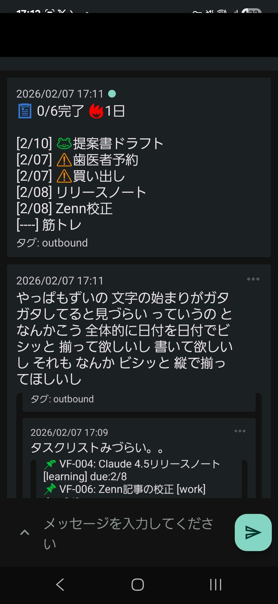
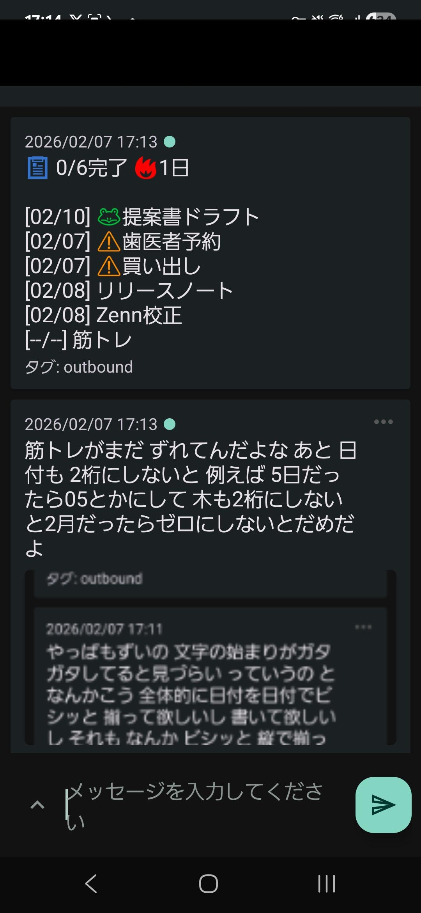

<div align="center">

# multi-agent-shogun

**AIコーディング軍団統率システム — Multi-CLI対応**

*戦国軍制で9体のAIエージェントを並列運用 — **Claude Code / OpenAI Codex** をYAML・tmux・イベント駆動メールボックスで統率*

**Talk Coding — Vibe Codingではなく、ターミナル・スマホ・Androidコンパニオンから指揮する**

[](https://github.com/simokitafresh/multi-agent-shogun)
[](https://opensource.org/licenses/MIT)
[](https://github.com/simokitafresh/multi-agent-shogun)
[]()

[English](README.md) | [日本語](README_ja.md)

</div>

<!-- <p align="center">
  
</p> -->

<p align="center"><i>家老1体が config/settings.yaml の現行混成編成を統率 — 実際の稼働画面、モックデータなし</i></p>

---

## これは何？

**multi-agent-shogun** は、1 人の人間（殿）が tmux 上の **9 体の CLI エージェント**（将軍 1・家老 1・軍師 1・忍者 6）を、YAML ファイルとファイル監視だけで指揮し、結果を二値で検証し、失敗を教訓・ゲート・テストへ還流させて自動成長させる戦国式のマルチエージェント基盤です。API ではなく各社の CLI（Claude Code / Codex CLI）をそのまま並べ、CLI ごとに固有の hook・gate を持つ multi-CLI 構成です。

### 陣形（2026-08-27、`config/settings.yaml` が唯一の正本）

| 役割 | window / pane | CLI・モデル | 何をするか |
|---|---|---|---|
| **殿**（あなた） | 端末 | 人間 | 指示と裁定。将軍と対話し、dashboard / artifact を自分で見る |
| **将軍** shogun | `main` | Claude Code（Fable 5） | 殿の指示を cmd（YAML）に起票し品質ゲートを通して家老へ委任。30 分ごとに一次確認・つまり解消・戦況 artifact 更新。コードの深掘り調査はせず偵察 cmd で委任 |
| **家老** karo | `agents` pane 1 | Codex（gpt-5.6-sol） | cmd を task に分解し忍者へ配備。報告を受けて GATE を回し、converge / push（1 commit ずつ）。hotfix / ci_fix は将軍 cmd なしで自立配備 |
| **軍師** gunshi | `agents` pane 2 | Claude Code（Opus 4.6, 1M） | cmd 草案と報告 YAML の一次レビュー（SG7 プロトコル）。LGTM → 家老 ACCEPT、FAIL → 差戻し。idle 時は分析を永続化し、将軍の自己検査（洗脳チェック）を第三者検証 |
| **忍者 ×6** hayate / kagemaru / hanzo / saizo / kotaro / tobisaru | `agents` pane 3-8 | Codex（gpt-5.6-luna high） | task YAML の受入条件を最高品質で遂行。task worktree で隔離作業 → scope commit → 報告 YAML。記憶の連続性なし（毎回 /clear） |

```
        殿（あなた）
          │ 日本語で指示
          ▼
   ┌──────────────┐        ┌──────────────┐
   │   将軍 SHOGUN │──cmd──▶│   家老 KARO   │
   │  起票・委任・  │        │ 分解・配備・   │
   │  30分loop      │        │ GATE・push    │
   └──────────────┘        └──────┬───────┘
          ▲                        │ task YAML + inbox nudge
          │ レビュー結果            ▼
   ┌──────────────┐     ┌─┬─┬─┬─┬─┬─┐
   │  軍師 GUNSHI  │◀────│1│2│3│4│5│6│  忍者 NINJA ×6（task worktree で隔離）
   │  SG7 レビュー  │報告 └─┴─┴─┴─┴─┴─┘
   └──────────────┘
   鎖: 殿→将軍→家老→忍者（分岐なし）。同じ鎖を学びが逆向きに還流する（lesson_candidate→教訓→gate→test）
```

**なぜ使うのか**
- 1 つの指示で 9 体が動き、すぐ制御が戻る。報告→レビュー→GATE→通知まで人手ゼロ
- エージェント間通信は **YAML + inotify**。API オーケストレーション費用を増やさない（定額 CLI サブスク）
- **cmd 品質ゲート（82 check）・二段レビュー・GATE・reflux・教訓淘汰**を内蔵し、失敗が次回の環境に埋め込まれる
- **三層記憶**（記憶DB / セマンティック索引 / Obsidian 因果）で `/clear` 後も前より強い状態で再開する
- ntfy・Android アプリ・戦況 artifact で外出先から指揮できる

---

## 現在の運用実績

| 指標 | 値（2026-08-27 実測） | 一次ソース |
|---|---|---|
| 発令 cmd 数 | 4,410（cmd_4409 / 4410 が本日起票） | `queue/shogun_to_karo.yaml` の採番 |
| GATE CLEAR | 累計 412 件（BLOCK→再提出→CLEAR を含む）、本日 51 件 / BLOCK 14 件 | `logs/gate_metrics.log`（931 行） |
| git 履歴 | 16,555 commit（2026-02-09 初 commit〜） | `git log` |
| `git status` | 84ms（ext4。移設前の 9p では 60〜120 秒） | `docs/research/ext4_speed_rebaseline_20260827.md` |
| 配備 1 件（deploy_task） | 23 秒（移設前 199〜397 秒） | `logs/deploy_task.log` |
| cmd e2e（配備→GATE CLEAR）中央値 | 31 分（うち人手レビュー往復 4〜16 分） | `logs/gate_metrics.log` |
| hook 1 回の中央値（全 hook） | 90ms（移設前 183ms、n=6,633 / 22,419） | `logs/defense_overhead.jsonl` |
| 教訓 / スキル / テスト | lessons 3 系統（将軍・家老・軍師）+ PJ 別、skills 41、bats 242 ファイル | `projects/infra/`, `skills/`, `tests/unit/` |


---

## なぜ Shogun なのか？

多くのマルチエージェントフレームワークは、連携のために API トークンを消費します。Shogun は違います。

| | Claude Code `Task` ツール | LangGraph | CrewAI | **multi-agent-shogun** |
|---|---|---|---|---|
| **アーキテクチャ** | 1 プロセス内のサブエージェント | グラフベースの状態機械 | ロールベースエージェント | tmux 上の 9 体（将軍・家老・軍師・忍者 6）の階層構造 |
| **並列性** | 逐次実行 | 並列ノード（v0.2+） | 限定的 | **忍者 6 体が task worktree で独立実行** |
| **連携コスト** | Task ごとに API コール | API + インフラ（Postgres/Redis） | API + CrewAI プラットフォーム | **ゼロ**（YAML + inotify、定額 CLI） |
| **品質保証** | なし | なし | なし | **cmd 品質ゲート 82 check → 軍師レビュー → 家老 GATE → CI** |
| **学習** | なし | なし | なし | **三層学習ループ**（教訓→ゲート→テストへ還流、reflux 自動配備） |
| **記憶** | セッション内 | 外部ストア | 外部ストア | **三層記憶**（記憶DB / セマンティック索引 / Obsidian 因果） |
| **可観測性** | Claude のログのみ | LangSmith 連携 | OpenTelemetry | **ライブ tmux ペイン** + 陣形図 + 戦況 artifact + ntfy |
| **セットアップ** | Claude Code 内蔵 | 重い（インフラ必要） | pip install | `first_setup.sh` 1 本（Linux/WSL2、ext4） |

### 他のフレームワークとの違い

**連携コストゼロ** — エージェント間の通信はディスク上の YAML ファイルと inotify の nudge。API コールは実際の作業にのみ使われ、オーケストレーションには使われない。

**完全な透明性** — すべてのエージェントが見える tmux ペインで動作し、すべての指示・報告・判断・ゲート結果がプレーンな YAML / log。読んで、diff して、バージョン管理できる。

**実戦で鍛えた階層構造** — 殿→将軍→家老→忍者の鎖と、鎖の脇に立つ軍師（レビュー専任）。役割ごとの専用ファイル、イベント駆動通信、二値の受入条件、そして失敗を環境に埋め込む成長ループ。2026-02 の初 commit から 16,000 commit 超の実運用で磨かれた（数値は「現在の運用実績」）。

---

## この fork の独自性

上流（`yohey-w/multi-agent-shogun`）は「tmux 上で複数の Claude Code を YAML で指揮する」骨格を提供した。この fork はそこに **品質ゲート・学習ループ・三層記憶・計測器・multi-CLI** を積み、2026-02 から 16,000 commit 超の実運用（自分自身の開発と外部プロジェクト）で鍛えた。5 本柱で示す。

### 1. 指揮系統 — 鎖 + 軍師

| 何が違う | 実装 | 根拠 |
|---|---|---|
| 4 役（将軍・家老・軍師・忍者）。**軍師**はレビュー専任で鎖の外に立つ | `instructions/{shogun,karo,gunshi,ashigaru}.md`、SG7 レビュープロトコル | 作る側（家老）と検分する側（軍師）を分けた結果、家老の「自分の配備を自分で通す」偏りが消えた |
| 鎖は命令の道であり学びの還流路 | 報告 YAML の `lesson_candidate` → 家老 → 教訓 → gate / fixture | 鎖を迂回した実例: 2026-07-26 に BLOCK 回避で type を変えた家老の指示 9 通が自動既読化され 1 通も届かず 40 分停止 |
| 将軍はコードを掘らない（F008） | 偵察 cmd で忍者に委任、将軍は起票と裁定 | 将軍の CTX を判断に温存し、深掘りは隔離された忍者が現物で行う |
| 殿への操作押し返し禁止・可逆なら自走 | stop hook が他者依存フレーズを BLOCK、可逆行動は裁可待ちなし | 殿の時間を奪わない（殿裁定 2026-05-27 / 07-10） |

### 2. 品質ゲート — 起票から CLEAR まで人手ゼロ

| 段階 | 実装 | 二値性 |
|---|---|---|
| 起票 | `cmd_skeleton.sh` → `cmd_save.sh --preflight` → `cmd_save.sh` → `cmd_delegate.sh`。**82 check**（品質問答 q1-q12、AC の yes/no 化、パス実在、テスト契約、DB restore 契約、environment_change） | BLOCK は「次の cmd で BLOCK されない環境変更」を要求＝成長ループの入口 |
| 配備 | `deploy_task.sh`: task YAML に教訓・関連概念を push 注入、**task worktree** で隔離、10 分契約（estimated_minutes） | 配備 receipt に wall 秒 |
| 報告 | `gate_report_format.sh` が整形し verdict を導出。偵察は finding 必須・commit 免除 | `binary_checks` 全 yes → PASS |
| レビュー | 軍師 SG7 precheck → LGTM / FAIL | review_log に判定と accuracy |
| GATE | `cmd_complete_gate.sh`（commit 祖先・blob parity・CI readiness・context 鮮度）→ CLEAR → archive → idle | `gate_metrics.log` に e2e / deploy / work / finalize 秒 |
| CI | bats 242 ファイルを shard 実行、SKIP=FAIL、timing ledger、receipt 必須。孤児テスト検知と回収 | GREEN でなければ push 保留 |

### 3. 学習ループ — 失敗を環境へ埋め込む

- **三層学習ループ**（個・対・全）: 二値計測 → 知見還流 → 次サイクル強化。原則「削るな、速くしろ」（gate を減らさず速くする）。
- **reflux**: `queue/insights.yaml` の気づきを `ninja_monitor` が idle 忍者へ自動配備（600 秒計時、dirty-guard、fail-closed marker）。
- **教訓のライフサイクル**: `lesson_candidate` → `lesson_write` → task へ push 注入 → 効果計測 → 淘汰（RETIRE）。ロール別 `projects/infra/lessons_{shogun,karo,gunshi}.yaml`。
- **deepdive 追体験**: 殿との「なぜ」の全過程を `memory/deepdive_*.md` に全文で残し、起動時に Phase 単位で replay（receipt 記録）。結論だけ読むと同じ間違いに戻るため。
- **洗脳チェック**: 早期終了・検証スキップ・他者依存・先送りなど 8 パターンを自己検査し、軍師が第三者検証。

### 4. 記憶 — 三層記憶と /clear=強くてニューゲーム

- 記憶DB（SQLite/FTS5、対話・裁定・knowledge・復帰点）／セマンティック索引（概念・alias）／Obsidian 因果ネットワーク（`[[リンク]]` と `origin`）。
- hook が作業前に三層 preflight を注入し、殿への応答に `[MEM:]` 引用を強制。新知識は三層へ貫通。
- `/clear` で CTX 0% に戻っても、知識基盤（CLAUDE.md・instructions・教訓・記憶DB・runbook）が残るので前より強く再開する。忍者は毎回 /clear（記憶の連続性なし）を前提に設計。

### 5. 運用基盤 — 計測・multi-CLI・安全弁・可搬性

- **計測器の常設**: `defense_overhead.jsonl`（全 hook の wall）、`gate_metrics.log`、deploy receipt、pre_push ledger、publish phase 計装。速度改善は必ず before/after（例: 9p→ext4 で git status 60〜120 秒→84ms、配備 199〜397 秒→23 秒）。
- **multi-CLI**: Claude Code と Codex を CLI 固有の hook（`.claude/hooks/` 23 本、`.codex/hooks.json`）で運用し、成果基準だけ共通化。`/shogun-cli-switch` で作業中 pane に触れず編成切替。指示書は 4 CLI 向けに自動生成。
- **安全弁**: Tier1 絶対禁止（D001-D009）、YAML dump 禁止、DB 直接接続 BLOCK、指揮官の直書き commit 禁止、歴史修正禁止（created_at は SSOT）。
- **可搬性**: `first_setup.sh`（冪等）→ 初回認証 → `shutsujin_departure.sh`。ext4 移設 runbook と relocate / cutover / rollback script。
- **殿インターフェース**: `dashboard.md`、戦況 artifact、ntfy、Android コンパニオン（Kotlin + Compose、SSH 制御・音声入力）、gist 共有。

---

## なぜCLI（APIではなく）？

多くの AI コーディングツールはトークン従量課金です。9 体の Opus 級エージェントを API 経由で動かすと **$100+/時間**。CLI の定額サブスクはこれを逆転させます。

| | API（従量課金） | CLI（定額制） |
|---|---|---|
| **9 エージェント × Opus 級** | ~$100+/時間 | 月額固定（Claude + ChatGPT の 2 サブスク） |
| **コスト予測性** | 予測不能なスパイク | 月額固定 |
| **使用時の心理** | 1 トークンが気になる | 使い放題 |
| **実験の余地** | 制約あり | 自由に投入（「実験ファースト」が原則） |

**「AI を使い倒す」思想** — 定額 CLI サブスクなら、6 体の忍者を気兼ねなく投入できる。1 時間稼働でも 24 時間稼働でもコストは同じ。「まあまあ」ではなく「徹底的に」が既定になる。上限に当たったときは `/usage` の reset か device-auth によるアカウント切替（Codex）で復帰する。

### Multi-CLI 対応

特定ベンダーに依存しない。指示書は共有テンプレートから **4 つの CLI 向けに自動生成**され（`bash scripts/build_instructions.sh`）、本番編成（2026-08-27）は Claude Code + Codex の 2 つで運用している。

| CLI | 特徴 | 本番での使用 |
|-----|------|-----------------|
| **Claude Code** | tmux 統合の実績、Memory MCP、専用ファイルツール（Read/Write/Edit/Glob/Grep）、hook で構造型の安全弁 | 将軍（Fable 5）・軍師（Opus 4.6, 1M） |
| **OpenAI Codex** | サンドボックス実行、`.codex/hooks.json`（exit 2 = BLOCK）、device-auth、`codex exec` ヘッドレス | 家老（gpt-5.6-sol）・忍者 6（gpt-5.6-luna） |
| **GitHub Copilot** | GitHub MCP 組込、特化エージェント、`/delegate` | 指示書を生成済み（`.github/copilot-instructions.md`）、本番編成外 |
| **Kimi Code** | 無料プランあり、多言語 | 指示書を生成済み、本番編成外 |

```
instructions/
├── common/              # 共通ルール（全 CLI 共通）
├── cli_specific/        # CLI 固有のツール説明（claude / codex / copilot / kimi）
├── roles/               # ロール定義（将軍・家老・軍師・忍者）
└── generated/           # ビルド結果（{cli}-{role}.md × 4 CLI × 4 役）
    ↓ bash scripts/build_instructions.sh
CLAUDE.md / AGENTS.md / .github/copilot-instructions.md
```

原則（multi-CLI 大原則）: 共通化するのは成果の評価基準（二値 AC・報告契約）だけ。hook・gate・起動方法は CLI ごとに別実装し、同じ実行機構を共用しない。ルールの変更は `instructions/roles/` の 1 箇所。

---

## ボトムアップスキル発見

忍者はタスクを遂行する中で **再利用可能なパターンを発見** し、報告 YAML の `skill_candidate` として提案します。家老がレビューし、採用されたものは `skills/{name}/SKILL.md` に正本として置かれ、Claude Code / Codex の両 CLI から `/{name}` で呼べます（2026-08-27 時点で 41 本）。

```
忍者がタスクを完了
    ↓
気づき: 「このパターン、3 つのプロジェクトで同じことをした」
    ↓
報告 YAML:  skill_candidate:
              found: true
              name: "api-endpoint-scaffold"
              reason: "3 プロジェクトで同じ REST スキャフォールドパターンを使用"
    ↓
軍師レビュー → 家老が skills/api-endpoint-scaffold/SKILL.md を作成（description に TRIGGER / DO NOT TRIGGER 必須）
    ↓
全エージェントが /api-endpoint-scaffold を呼び出し可能に。skill_execution_log で使用実績を計測
```

同じ経路で `lesson_candidate`（教訓）と `decision_candidate`（裁定が要る事項）も上がります。スキルも教訓も実際の作業から有機的に増え、使われないものは淘汰されます。

---

## 🚀 クイックスタート

> 2026-08-27 時点の現物（`first_setup.sh` / `shutsujin_departure.sh` / `config/settings.yaml`）から書き起こした手順。対応環境は **WSL2(Ubuntu) または Native Linux**（`first_setup.sh` の環境判定はこの 2 つ。macOS は冒頭コメントに記載があるだけで未検証、対応外として扱う）。リポジトリは必ず **ext4 上（`~/` 配下など）** に置く。Windows ドライブ（`/mnt/c/...`）は 9p ファイルシステム経由で `git status` が 60〜120 秒かかり、実用にならない（実測は「主な特徴」の速度表）。

### Step 1: 前提ツール

| ツール | 用途 | 確認 |
|---|---|---|
| git, tmux, jq, curl, flock, timeout, setsid, crontab | 基盤 | `first_setup.sh` が確認し、不足分は apt で補完を試みる |
| node/npm（nvm 推奨）, python3 | Claude Code / Codex CLI、ゲート群 | 同上 |
| gh（GitHub CLI）, inotify-tools, bats | CI 確認、inbox 監視、テスト | 同上 |

Windows の場合は先に WSL2 + Ubuntu を入れる（`install.bat` は WSL2/Ubuntu の有無を案内する補助 script）。以降は全て WSL2 の Ubuntu 側で行う。

### Step 2: 取得（git clone または ZIP）

```bash
# A. git（通常）
git clone https://github.com/<owner>/multi-agent-shogun.git ~/multi-agent-shogun

# B. ZIP（GitHub に入れない環境）
#   GitHub の「Code → Download ZIP」を ext4 上に展開し、展開先で:
git init && git add -A && git commit -m "import" && git remote add origin https://github.com/<owner>/multi-agent-shogun.git
```

ZIP には `.git` が無い。ゲート群は git を前提にするため、B では上の 1 行で最小のリポジトリを作る。

### Step 3: 初回セットアップ

```bash
cd ~/multi-agent-shogun
bash first_setup.sh        # 依存・venv・Codex CLI・config・ディレクトリ・Memory MCP を冪等に確認/補完
source ~/.bashrc           # PATH 反映
```

- 対話は「ネイティブ版をインストールしますか? [Y/n]」の 1 問のみ。
- `config/settings.yaml` は **無い場合だけ** 最小設定を生成し、既存は保持する。ntfy トピック・使用 CLI・モデルは `config/settings.yaml` を直接編集する（対話入力は無い）。
- 所要時間はネットワークとインストール量に依存する。

### Step 4: 初回認証（初回のみ・各自のアカウントで）

```bash
# Claude Code（pinned 版 ~/bin/claude を使う）
~/bin/claude --dangerously-skip-permissions
#   → ブラウザで OAuth ログイン → "Bypass Permissions" は「Yes, I accept」を選択 → /exit
claude auth status            # loggedIn=True を確認

# Codex CLI（スマホ完結の device-auth。アカウント側で「デバイスコード認証」を有効化しておく）
codex login --device-auth
codex login status            # "Logged in using ChatGPT" を確認
```

家族など別の利用者は、それぞれ自分の Anthropic / ChatGPT アカウントで入る。認証情報は `~/.claude` と `~/.codex/auth.json` に置かれ、リポジトリには入らない。

### Step 5: 出陣

```bash
./shutsujin_departure.sh
```

tmux セッション `shogun` に window **`main`**（将軍）と **`agents`**（家老・軍師・忍者 6 = 8 pane）を作り、inbox watcher・ninja_monitor・ntfy などのデーモンを起動する。window 番号は tmux の `base-index` 設定で 0/1 または 1/2 になるため、切替は **名前** で行う。CLI の起動確認は最大 30 秒。

```bash
tmux attach -t shogun
# Ctrl+A → w でウィンドウ一覧、または Ctrl+A → :select-window -t main / agents
```

### Step 6: 最初の 1 コマンド

将軍 pane に日本語で指示する（例: `readme を読んで現状を報告せよ`）。将軍が cmd を起票し家老へ委任、忍者が task worktree で作業して報告 YAML を提出、軍師レビュー→家老 GATE→CLEAR→ntfy 通知、の順に進む。

### 📱 Android アプリ（任意）

SSH 経由で tmux を操作し音声入力できるコンパニオンアプリが `android/` にある。接続先は `whoami` / `pwd` の値をアプリの設定に入れる（Tailscale 経由なら `tailscale ip -4` の値）。詳細は `android/README_ja.md`。

---

## 📖 基本的な使い方

### Step 1: 将軍に接続

`./shutsujin_departure.sh` の後、全エージェントは自分の指示書（`CLAUDE.md` / `AGENTS.md` + `instructions/generated/*.md`）を読み、起動ゲート（三層記憶の健全性・未読 inbox・deepdive 追体験）を通って待機します。

```bash
tmux attach -t shogun          # window main = 将軍、window agents = 家老・軍師・忍者
```

### Step 2: 最初の命令を出す

将軍 pane に日本語で書くだけです。

```
JavaScript フレームワーク上位 5 つを調査して比較表を作成せよ
```

将軍は (1) 三層記憶を検索し、(2) `queue/shogun_to_karo.yaml` に cmd を起票して品質ゲート（82 check）を通し、(3) 家老へ委任して即座に制御を返します。あなたは待ちません。

### Step 3: 鎖が回る

```
家老   cmd を task に分解 → deploy_task.sh で忍者へ配備（教訓・関連概念を注入、task worktree で隔離）
忍者   受入条件を遂行 → scope commit → 報告 YAML（binary_checks は yes/no）
軍師   報告を SG7 でレビュー → LGTM / FAIL
家老   ACCEPT → cmd_complete_gate.sh（commit 祖先・CI・context 鮮度）→ GATE CLEAR → archive → 忍者 idle
通知   ntfy でスマホへ「GATE CLEAR」。将軍は掲示板・gate_metrics で突合し、戦況 artifact を更新
```

### Step 4: 進捗を確認

- `queue/karo_snapshot.txt` — 陣形図（`ninja_monitor` が機械生成。誰が何を、CTX 何 %、いつから）
- `dashboard.md` — 殿が自分で見る戦況（家老が更新）
- `queue/bulletin_board.yaml` — 家老・軍師から将軍への報告チャネル
- `logs/gate_metrics.log` — cmd ごとの e2e / deploy / work / finalize 秒
- 戦況 artifact（claude.ai）— 将軍が 30 分ごとに再公開するタスクマップ

### 詳細なフロー（例）

```
あなた: 「トップ 5 の MCP サーバを調査して比較表を作成せよ」
```

将軍が cmd_XXXX を起票 → 家老がサブタスクへ分解:

| 忍者 | 割当内容 |
|------|----------|
| Hayate | Playwright MCP 調査 |
| Kagemaru | Memory MCP 調査 |
| Hanzo | Sequential Thinking MCP 調査 |
| Saizo | Notion MCP 調査 |
| Kotaro | GitHub MCP 調査 |

5 体が同時に調査を開始し、tmux でリアルタイムに見えます。偵察 cmd は finding（観測・結果・根拠パス）を必須にし、commit は免除。報告が揃うと軍師→家老→GATE CLEAR→ntfy の順に進み、比較表は報告 YAML と `docs/research/` に残ります。

---

## 🔗 鎖・三層学習ループ・三層記憶

### 鎖（指揮の一本道）

殿 → 将軍 → 家老 → 忍者。分岐なし、迂回なし。将軍は決め、家老は仕切り、忍者は遂げ、軍師はレビューする。**鎖は命令の道であると同時に学びの還流路**で、忍者の `lesson_candidate` が家老を経て教訓→ゲート→テスト fixture に入る。鎖を迂回すると指示が消え、同時に学びも消える（正本: `CLAUDE.md` 先頭、`instructions/*.md`）。

### 三層学習ループ

全ての作業に「①実行 → ②二値計測 → ③知見還流 → 次サイクル強化」を回す。スコープが三層ある。

| 層 | スコープ | 実装 |
|---|---|---|
| 個 | ロール内 | AC ごとの `binary_checks`（yes/no）、洗脳 8 パターン自己検査、起動時の deepdive 追体験（Phase 単位 replay と receipt） |
| 対 | 忍者+家老 / 家老+軍師 | 報告 YAML → 軍師 SG7 レビュー → 家老 GATE の往復、rework 率の計測 |
| 全 | 鎖全体 | reflux（`queue/insights.yaml` の気づきを idle 忍者へ自動配備）、教訓の淘汰、`gate_metrics` の日次 before/after、CI GREEN 維持 |

`/clear` は「強くてニューゲーム」。会話のコンテキストが 0 に戻っても、知識基盤（`CLAUDE.md`・`instructions/`・教訓・記憶DB・runbook）が残るので、次は前より強い状態で再開する。原則は「削るな、速くしろ」— ゲートを減らすのではなく、品質を保ったまま速くする（正本: `context/growth-loop.md`、`docs/research/three-layer-learning-loop-auto-growth-asis-tobe-5w1h_20260707.md`）。

### 三層記憶

| 層 | 実体 | 入口 |
|---|---|---|
| 記憶DB | SQLite `data/multi_agent_shogun_memory.db`（対話・裁定・knowledge・復帰点 `session_save_*`、FTS5） | `bash scripts/memory_db_query.sh --search "<語>"` / 書込み `scripts/memory_db_knowledge_write.sh` |
| セマンティック索引 | `context/semantic-map.md` + `docs/semantic-index/index.md`（概念・alias・discussion） | `bash scripts/semantic_search.sh "<query>"` |
| Obsidian 因果ネットワーク | `[[リンク]]` と `origin: "[[発端]] -> [[原因]] -> [[結果]]"`（教訓・報告・cmd に必須） | `.cache/causal_index.tsv`、`/three-layer-penetrate` |

契約: 作業の前に三層を検索する（hook が preflight を自動注入）。殿への応答には `[MEM: …]` の引用タグを付ける（欠落は stop hook が止める）。新しい知識は三層すべてへ貫通させる（正本: `context/memory-db-schema.md`、`docs/research/semantic_index_design.md`）。

---

## ✨ 主な特徴

2026-08-27 時点の現物ベース。旧版（2026-02〜03）にあった「send-keys で指示」「Claude 単一」「手動で結果確認」は全て置き換わっている。

1. **mailbox 通信** — `scripts/inbox_write.sh <to> "<msg>" <type> <from> <action>`。flock 付き YAML に永続化し、`inbox_watcher.sh`（inotify）が `inboxN` の短い nudge だけを送る。エージェントは tmux send-keys を呼ばない。確認プロンプト検知で nudge 抑止、Codex 配達検証、未読が続けば再 nudge。
2. **cmd 起票ゲート** — `cmd_skeleton.sh` → `cmd_save.sh --preflight` → `cmd_save.sh` → `cmd_delegate.sh`。82 の check 関数（品質問答 q1-q12、AC の二値性、パス実在、テスト契約、environment_change）で BLOCK/WARN。BLOCK は「次の cmd で BLOCK されないよう環境へ埋め込む」成長ループの入口。
3. **配備と隔離** — `deploy_task.sh` が task YAML を生成し、関連教訓と関連概念を push 注入、忍者を **task worktree**（ext4 上、再起動でも消えない）で隔離する。配備 23 秒。
4. **報告契約** — `gate_report_format.sh` が報告 YAML を整形し verdict を導出（`binary_checks` 全 yes → PASS）。偵察 cmd は finding 必須・commit 免除。`lesson_candidate` / `decision_candidate` / `origin` を構造化。
5. **二段レビュー → GATE** — 軍師 SG7 precheck/LGTM → 家老 ACCEPT → `cmd_complete_gate.sh`（commit 祖先・blob parity・CI readiness・context freshness）→ CLEAR → archive → 忍者 idle。`gate_metrics.log` に e2e/deploy/work/finalize 秒を記録。
6. **監視デーモン** — `ninja_monitor.sh`: 陣形図生成、STALL/ghost/UNACTIONED 検知、CTX 監視と自動 /clear・respawn、reflux 自動配備、Codex の model/effort が設定と違えば WARN。`daemon_watchdog` が watcher/monitor を自動再起動。
7. **multi-CLI** — Claude Code（`.claude/hooks/` 23 本、pinned 2.1.87 = `~/bin/claude`）と Codex（`.codex/hooks.json`、exit 2 = BLOCK）を CLI ごとに別実装で同じ成果基準へ。`/shogun-cli-switch` で CLI/model を idle pane だけ respawn して切替。編成の唯一の正は `config/settings.yaml`。
8. **スキル 41 本** — `skills/*/SKILL.md` を正本に両 CLI で共用。description に TRIGGER / DO NOT TRIGGER 必須。
9. **CoDD** — Coherence-Driven Development（おしお氏作）。spec → 設計書 → generate → validate → measure。bash script のリファクタは `/codd-refactor` で計測→設計→実装→再計測。
10. **テスト** — bats 242 ファイル。`run_tests.sh task|file|affected` の選択実行が原則（全量 2,454 秒 vs 選択数秒）。CI は shard 実行+受領書、SKIP=FAIL、timing ledger で shard 割当。孤児テスト検知と回収。contract test だけ残す default-delete ポリシー。
11. **計測器の常設** — `logs/defense_overhead.jsonl`（全 hook の wall）、`gate_metrics.log`、pre_push ledger、deploy receipt、publish phase 計装。「計測器を名指す → 直す → 一段深く計測する → 計測器は本番に残す」のらせん。
12. **三層記憶 + deepdive 追体験** — 起動時に `gate_*_startup.sh` が Memory 健全度・未読・未決裁定・deepdive receipt を一括チェック。結論だけ読むと同じ間違いに戻るため、過程の全文を Phase 単位で追体験する。
13. **殿インターフェース** — `dashboard.md`（殿が自分で見る）、戦況 artifact（将軍が 30 分ごとに再公開）、ntfy（スマホ通知）、Android アプリ、gist 共有（新規作成は明示フラグ必須 = 歴史修正防止）。
14. **安全弁** — Tier1 絶対禁止（`rm -rf` 系、`push --force`、`reset --hard`、`kill`、プロファイル無しの headless Chrome ほか）、Tier2 停止報告、YAML dump 禁止 hook、DB 直接接続 BLOCK、指揮官の `git commit` 直書き禁止（`ninja_scope_commit.sh`）、歴史修正禁止。
15. **外部プロジェクト管理** — `config/projects.yaml` + `projects/{id}.yaml`（git-ignored の核心知識）+ `context/{project}.md`（索引層）+ `docs/research/*.md`（詳細層）。
16. **ext4 移設 runbook** — `scripts/migrate_to_ext4_{relocate,cutover,rollback}.sh` と `docs/research/9p_root_fix_runbook_20260827.md`。Windows ドライブから ext4 へ安全に移す手順と、移設後の副作用の突合表。

### 速度（2026-08-27 実測、`docs/research/ext4_speed_rebaseline_20260827.md`）

| 指標 | 9p(/mnt/c) | ext4(/home) |
|---|---|---|
| git status | 60〜120 秒 | 84ms |
| cmd publish | 3,770ms | 227ms |
| scope_commit git_commit / scope_sync | 9,487 / 5,846ms | 173 / 73ms |
| 配備 1 件 | 199〜397 秒 | 23 秒 |
| hook 1 回の中央値（全 hook） | 183ms | 90ms |

---

## 🗣️ SayTask — タスク管理が嫌いな人のためのタスク管理

### SayTaskとは？

**タスク管理が嫌いな人のためのタスク管理。スマホに話しかけるだけ。**

**Talk Coding — Vibe Codingではない。** タスクを話すだけで、AIが整理する。入力なし、アプリを開かない、摩擦ゼロ。

- **ターゲット**: Todoistをインストールしたけど3日で開かなくなった人
- あなたの敵は他のアプリじゃない。何もしないこと。競合は他の生産性ツールではなく、無行動
- UIゼロ。入力ゼロ。アプリを開く動作ゼロ。ただ話すだけ

> *「あなたの敵は他のアプリじゃない。何もしないことだ。」*

### 仕組み

1. [ntfyアプリ](https://ntfy.sh)をインストール（無料、アカウント不要）
2. スマホに話しかける: *「歯医者 明日」*、*「請求書 金曜まで」*
3. AIが自動整理 → 朝に通知: *「今日の予定です」*

```
 🗣️ 「牛乳買う、歯医者 明日、請求書 金曜まで」
       │
       ▼
 ┌──────────────────┐
 │  ntfy → 将軍     │  AIが自動分類、日付解析、優先度設定
 └────────┬─────────┘
          │
          ▼
 ┌──────────────────┐
 │   tasks.yaml     │  構造化ストレージ（ローカル、端末外に出ない）
 └────────┬─────────┘
          │
          ▼
 📱 朝の通知:
    「今日: 🐸 請求書期限 · 🦷 歯医者3時 · 🛒 牛乳買う」
```

### 変更前／変更後

| 変更前（v1） | 変更後（v2） |
|:-----------:|:----------:|
|  |  |
| 生のタスクダンプ | きれいに整理された日次サマリ |

> *注: スクリーンショットに表示されているトピック名は例です。自分専用のトピック名を使用してください。*

### ユースケース

- 🛏️ **ベッドの中**: *「明日レポート提出しないと」* — 忘れる前にキャプチャ、ノート探さなくていい
- 🚗 **運転中**: *「クライアントAの見積もり忘れないで」* — ハンズフリー、前を見たまま
- 💻 **仕事中**: *「あ、牛乳買わないと」* — 即座にダンプしてフローに戻る
- 🌅 **起床時**: 今日のタスクが既に通知で待っている — アプリを開かない、受信トレイ確認不要
- 🐸 **Eat the Frog**: AIが毎朝一番大変なタスクを選ぶ — 無視してもいいし、最初に倒してもいい

### FAQ

**Q: 他のタスクアプリと何が違う？**
A: アプリを開かない。ただ話すだけ。摩擦ゼロ。多くのタスクアプリは、人々が開かなくなるから失敗する。SayTaskはそのステップ自体を取り除いた。

**Q: Shogunシステム全体なしでSayTaskだけ使える？**
A: SayTaskはShogunの機能の一部。Shogunはスタンドアロンのマルチエージェント開発プラットフォームとしても機能する — 1つのシステムで両方の機能が手に入る。

**Q: 🐸 Frogって何？**
A: 毎朝、AIがあなたの一番大変なタスクを選ぶ — 避けたいやつ。最初に倒す（「Eat the Frog」方式）か無視するか。あなた次第。

**Q: 無料？**
A: すべて無料でオープンソース。ntfyも無料。アカウント不要、サーバ不要、サブスクリプション不要。

**Q: データはどこに保存される？**
A: ローカルのYAMLファイル。クラウドには何も送信されない。タスクは端末の外に出ない。

**Q: 「仕事のあれ」みたいに曖昧なことを言ったら？**
A: AIがベストを尽くして分類・スケジュールする。後で修正もできる — でもポイントは、忘れる前に思考をキャプチャすること。

### SayTask vs cmdパイプライン

将軍システムには2つの補完的なタスクシステムがある：

| 機能 | SayTask（音声レイヤー） | cmdパイプライン（AI実行） |
|---|:-:|:-:|
| 音声入力 → タスク作成 | ✅ | — |
| 朝の通知ダイジェスト | ✅ | — |
| Eat the Frog 🐸 選定 | ✅ | — |
| ストリーク追跡 | ✅ | ✅ |
| AI実行タスク（複数ステップ） | — | ✅ |
| 忍者 6 体の並列実行 | — | ✅ |

SayTaskは個人の生産性を担当（キャプチャ → スケジュール → リマインド）。cmdパイプラインは複雑な作業を担当（リサーチ、コード、複数ステップのタスク）。両者はストリーク追跡を共有し、どちらのタスクを完了してもデイリーストリークにカウントされる。

---

## 🧠 モデル設定

編成の正本は `config/settings.yaml`（CLI・モデル・effort・launch_cmd）と `config/cli_profiles.yaml`。README の表は 2026-08-27 時点の値であり、切替は `/shogun-cli-switch`（idle pane だけ respawn し、作業中の pane は触らない）で行う。

| エージェント | CLI / モデル | effort | 理由 |
|---|---|---|---|
| 将軍 | Claude Code / Fable 5 | low（settings）| 殿との対話・cmd 起票・全体判断。深掘り調査はしない |
| 家老 | Codex / gpt-5.6-sol | medium | 分解・配備・GATE の判断を速く回す |
| 軍師 | Claude Code / Opus 4.6（1M context） | high | レビューは長文（cmd 全文+報告 YAML）を読むため 1M が要る |
| 忍者 ×6 | Codex / gpt-5.6-luna | high | 実装・計測・偵察。モデル名は忍者 launch_cmd に固定せず settings から継承 |

原則（殿裁定 2026-08-27）: モデルを cmd で名指ししない（配備は家老の判断）。作業中の pane は respawn しない。Codex は `~/.codex/config.toml` の trust とモデルを `codex_config_apply_agent` が respawn 経路で適用し、pane 表示が settings と違えば `ninja_monitor` が WARN を出す。

### 混成の考え方

- **Claude 主・Codex 従**（multi-CLI 大原則）: 評価基準（二値 AC・報告契約）だけを共通化し、hook・gate・起動方法は CLI ごとに別実装。協議不調時は Claude 側の契約を正とする。
- **切替は編成単位**: 家老を Claude に、忍者を全員 Codex に、などの切替は `/shogun-cli-switch` の 1 コマンド。過去の編成履歴は `context/training-cycle.md`。
- **上限・更新プロンプト**: Codex の利用上限や「Update available」プロンプトで pane が止まると watcher が nudge を抑止する。解除は可逆操作（選択肢を確認してから送出）。

---

## 🧭 核心思想（Philosophy）

> **「脳死で依頼をこなすな。最速×最高のアウトプットを常に念頭に置け。」**

将軍システムは5つの核心原則に基づいて設計されている：

| 原則 | 説明 |
|------|------|
| **自律陣形設計** | テンプレートではなく、タスクの複雑さに応じて陣形を設計 |
| **並列化** | サブエージェントを活用し、単一障害点を作らない |
| **リサーチファースト** | 判断の前にエビデンスを探す |
| **継続的学習** | モデルの知識カットオフだけに頼らない |
| **三角測量** | 複数視点からのリサーチと統合的オーソライズ |

詳細: **[docs/philosophy.md](docs/philosophy.md)**

---

## 🎯 設計思想

### なぜ階層構造（殿→将軍→家老→忍者 + 軍師）なのか

1. **即座の応答**: 将軍は即座に委譲し、あなたに制御を返す
2. **並列実行**: 家老が複数の忍者に同時分配
3. **単一責任**: 各役割が明確に分離され、混乱しない
4. **スケーラビリティ**: 忍者を増やしても構造が崩れない
5. **障害分離**: 1体の忍者が失敗しても他に影響しない
6. **人間への報告一元化**: 将軍だけが人間とやり取りするため、情報が整理される
7. **レビューの分離（軍師）**: 家老は配備と GATE、軍師は cmd 草案と報告のレビューに専念する。作る側と検分する側を分けることで、家老の「自分の配備を自分で通す」偏りを消す。軍師は鎖の外（Claude, 1M context）に立ち、将軍の自己検査も第三者検証する
8. **鎖は還流路でもある**: 忍者の lesson_candidate が家老→教訓→gate→test へ戻る。鎖を迂回すると指示も学びも消える

### なぜメールボックスシステムなのか

1. **状態の永続化**: YAMLファイルで構造化通信し、エージェント再起動にも耐える
2. **ポーリング不要**: `inotifywait`はイベント駆動（カーネルレベル）なので、アイドル時のAPIコストゼロ
3. **割り込み防止**: エージェント同士やあなたの入力への割り込みを防止
4. **デバッグ容易**: 人間がinbox YAMLファイルを直接読んでメッセージフローを把握できる
5. **競合回避**: `flock`（排他ロック）で同時書き込みを防止 — 複数エージェントが同時送信してもレースコンディションなし
6. **配信保証**: ファイル書き込み成功 = メッセージ配信保証。到達確認不要、偽陰性なし、send-keys失敗による1.5時間ハングもなし
7. **nudge-only配信**: `send-keys`は短い起床通知のみ送信（timeout 5s）、メッセージ全文は送らない。エージェントが自分でinboxファイルをRead。旧方式（メッセージ全文をsend-keys送信）で発生した文字化け・1.5時間ハング等の配信障害を根絶。

### エージェント識別（@agent_id）

各ペインに `@agent_id` というtmuxユーザーオプションを設定（例: `karo`, `gunshi`, `hayate`）。`pane_index` はペイン再配置でズレるが、`@agent_id` は `shutsujin_departure.sh` が起動時に固定設定するため変わらない。

エージェントの自己識別:
```bash
tmux display-message -t "$TMUX_PANE" -p '#{@agent_id}'
```
`-t "$TMUX_PANE"` が必須。省略するとアクティブペイン（操作中のペイン）の値が返り、誤認識の原因になる。

モデル名は `@model_name`、現在のタスクの要約は `@current_task` として保存され、いずれも `pane-border-format` で常時表示されます。Claude Codeがペインタイトルを上書きしても、これらのユーザーオプションは消えません。

### なぜ dashboard.md は家老のみが更新するのか

1. **単一更新者**: 競合を防ぐため、更新責任者を1人に限定
2. **情報集約**: 家老は全忍者の報告を受ける立場なので全体像を把握
3. **一貫性**: すべての更新が1つの品質ゲートを通過
4. **割り込み防止**: 将軍が更新すると、殿の入力中に割り込む恐れあり

---

## 🛠️ スキル

共有スキルは `skills/{name}/SKILL.md` を正本に、Claude Code / Codex の両 CLI から `/{name}` で呼べます（2026-08-27 時点で 41 本）。ユーザー固有スキルは `.claude/skills/` または `~/.codex/skills/` に置き、リポジトリにはコミットしません。

### スキルの思想

**1. 正本は 1 つ、CLI は複数** — `skills/` を正本とし、CLI ごとの配置は symlink/生成で追従する（multi-CLI 大原則）。description には TRIGGER / DO NOT TRIGGER / ロール制限（将軍専用・家老専用・忍者専用）を必ず書き、誤発火を防ぐ。殿の直接指示はロール制限に優先する。

**2. 取得の手順（ボトムアップ）**

```
忍者が作業中にパターンを発見 → 報告 YAML の skill_candidate
    ↓
軍師レビュー → 家老が skills/{name}/SKILL.md を作成
    ↓
skill_execution_log で使用実績を計測 → 使われないものは淘汰
```

**3. 主なスキル（役割別）** — 将軍: `/dream`（三層記憶整理）`/lesson-sort` `/shogun-teire` `/shogun-clear-prep` `/x-research` `/weekly-report`／家老: `/cmd-complete` `/dashboard-update` `/karo-direct` `/recon-dual`／軍師: `/review-bundle` `/gate-sync` `/idle-persist`／忍者: `/report-write` `/ninja-commit` `/verdict-check`／共通: `/shogun-cli-switch` `/codd` `/codd-refactor` `/three-layer-penetrate` `/db-check`

---

## 🔌 MCPセットアップガイド

MCP（Model Context Protocol）サーバはClaudeの機能を拡張します。セットアップ方法：

### MCPとは？

MCPサーバはClaudeに外部ツールへのアクセスを提供します：
- **Notion MCP** → Notionページの読み書き
- **GitHub MCP** → PR作成、Issue管理
- **Memory MCP** → セッション間で記憶を保持

### MCPサーバのインストール

以下のコマンドでMCPサーバを追加：

```bash
# 1. Notion - Notionワークスペースに接続
claude mcp add notion -e NOTION_TOKEN=your_token_here -- npx -y @notionhq/notion-mcp-server

# 2. Playwright - ブラウザ自動化
claude mcp add playwright -- npx @playwright/mcp@latest
# 注意: 先に `npx playwright install chromium` を実行してください

# 3. GitHub - リポジトリ操作
claude mcp add github -e GITHUB_PERSONAL_ACCESS_TOKEN=your_pat_here -- npx -y @modelcontextprotocol/server-github

# 4. Sequential Thinking - 複雑な問題を段階的に思考
claude mcp add sequential-thinking -- npx -y @modelcontextprotocol/server-sequential-thinking

# 5. Memory - セッション間の長期記憶（推奨！）
# ✅ first_setup.sh で自動設定済み
# 手動で再設定する場合:
claude mcp add memory -e MEMORY_FILE_PATH="$PWD/memory/shogun_memory.jsonl" -- npx -y @modelcontextprotocol/server-memory
```

### インストール確認

```bash
claude mcp list
```

全サーバが「Connected」ステータスで表示されるはずです。

---

## 🌍 実用例

### 例1: 調査タスク

```
あなた: 「AIコーディングアシスタント上位5つを調査して比較せよ」

実行される処理:
1. 将軍が cmd を起票（品質ゲート 82 check）→ 家老に委任
2. 家老が task に分解して割り当て（task worktree で隔離）:
   - Saizo: GitHub Copilotを調査
   - Kotaro: Cursorを調査
   - Hayate: Claude Codeを調査
   - Kagemaru: Codeiumを調査
   - Hanzo: Amazon CodeWhispererを調査
3. 5体の忍者が同時に調査
4. 各忍者が報告 YAML（finding 必須）を提出 → 軍師レビュー → 家老 GATE CLEAR → ntfy 通知
5. 比較表は報告 YAML と docs/research/ に残り、dashboard.md に要約
```

### 例2: PoC準備

```
あなた: 「このNotionページのプロジェクトでPoC準備: [URL]」

実行される処理:
1. 家老がMCP経由でNotionコンテンツを取得
2. Kotaro: 確認すべき項目をリスト化
3. Hayate: 技術的な実現可能性を調査
4. Kagemaru: PoC計画書を作成
5. 報告 YAML → 軍師 → 家老 GATE → dashboard.md に要約、会議の準備完了
```

---

## ⚙️ 設定

### 言語設定

```yaml
# config/settings.yaml
language: ja   # 日本語のみ
language: en   # 日本語 + 英訳併記
```

### スクリーンショット連携

```yaml
# config/settings.yaml
screenshot:
  path: "/mnt/c/Users/あなたの名前/Pictures/Screenshots"
```

将軍に「最新のスクショを見ろ」と伝えるだけで、スクリーンキャプチャを読み取って分析します。（Windowsでは `Win+Shift+S`）

### ntfy（スマホ通知）

```yaml
# config/settings.yaml
ntfy_topic: "shogun-yourname"
```

スマホの [ntfyアプリ](https://ntfy.sh) で同じトピックをサブスクライブしてください。リスナーは `shutsujin_departure.sh` で自動起動します。

---

## 🛠️ 上級者向け

<details>
<summary><b>スクリプトアーキテクチャ</b>（クリックで展開）</summary>

```
┌─────────────────────────────────────────────────────────────────────┐
│                      初回セットアップ（1回だけ実行）                   │
├─────────────────────────────────────────────────────────────────────┤
│                                                                     │
│  install.bat (Windows)                                              │
│      │                                                              │
│      ├── WSL2のチェック/インストール案内                              │
│      └── Ubuntuのチェック/インストール案内                            │
│                                                                     │
│  first_setup.sh (Ubuntu/WSLで手動実行)                               │
│      │                                                              │
│      ├── tmuxのチェック/インストール                                  │
│      ├── Node.js v20+のチェック/インストール (nvm経由)                │
│      ├── Claude Code CLIのチェック/インストール（ネイティブ版）       │
│      │       ※ npm版検出時はネイティブ版への移行を提案                │
│      └── Memory MCPサーバー設定                                      │
│                                                                     │
├─────────────────────────────────────────────────────────────────────┤
│                      毎日の起動（毎日実行）                           │
├─────────────────────────────────────────────────────────────────────┤
│                                                                     │
│  shutsujin_departure.sh                                             │
│      │                                                              │
│      ├──▶ tmuxセッションを作成                                       │
│      │         • "shogun"セッション（1ペイン）                        │
│      │         • "shogun"セッション（9ペイン、3x3グリッド）        │
│      │                                                              │
│      ├──▶ キューファイルとダッシュボードをリセット                     │
│      │                                                              │
│      └──▶ 現行の混成CLI編成を起動                                    │
│                                                                     │
└─────────────────────────────────────────────────────────────────────┘
```

</details>

<details>
<summary><b>shutsujin_departure.sh オプション</b>（クリックで展開）</summary>

```bash
# デフォルト: フル起動（tmuxセッション + 混成CLI起動）
./shutsujin_departure.sh

# セッションセットアップのみ（CLI起動なし）
./shutsujin_departure.sh -s
./shutsujin_departure.sh --setup-only

# タスクキューをクリア（指令履歴は保持）
./shutsujin_departure.sh -c
./shutsujin_departure.sh --clean

# 決戦の陣: 全忍者をOpusで起動（最大能力・高コスト）
./shutsujin_departure.sh -k
./shutsujin_departure.sh --kessen

# サイレントモード: 戦国エコーを無効化（echoのAPIトークン節約）
./shutsujin_departure.sh -S
./shutsujin_departure.sh --silent

# フル起動 + Windows Terminalタブを開く
./shutsujin_departure.sh -t
./shutsujin_departure.sh --terminal

# 将軍中継専用モード: 将軍のThinkingを無効化（コスト節約）
./shutsujin_departure.sh --shogun-no-thinking

# ヘルプを表示
./shutsujin_departure.sh -h
./shutsujin_departure.sh --help
```

</details>

<details>
<summary><b>よく使うワークフロー</b>（クリックで展開）</summary>

**通常の毎日の使用：**
```bash
./shutsujin_departure.sh          # 全て起動
tmux attach-session -t shogun     # 接続してコマンドを出す
```

**デバッグモード（手動制御）：**
```bash
./shutsujin_departure.sh -s       # セッションのみ作成

# 特定のエージェントでClaude Codeを手動起動
tmux send-keys -t shogun:0 'claude --dangerously-skip-permissions' Enter
tmux send-keys -t shogun:2.1 'claude --dangerously-skip-permissions' Enter
```

**クラッシュ後の再起動：**
```bash
# 既存セッションを終了
tmux kill-session -t shogun
tmux kill-session -t shogun

# 新しく起動
./shutsujin_departure.sh
```

</details>

<details>
<summary><b>便利なエイリアス</b>（クリックで展開）</summary>

`first_setup.sh` を実行すると、以下のエイリアスが `~/.bashrc` に自動追加されます：

```bash
alias csst='cd /home/simokitafresh/multi-agent-shogun && ./shutsujin_departure.sh'
alias css='tmux attach-session -t shogun'      # 将軍ウィンドウの起動
alias csm='tmux attach-session -t shogun'  # 家老・忍者ウィンドウの起動
```

※ エイリアスを反映するには `source ~/.bashrc` を実行するか、PowerShellで `wsl --shutdown` してからターミナルを開き直してください。

</details>

---

## 📁 ファイル構成

<details>
<summary><b>クリックでファイル構成を展開</b></summary>

```
multi-agent-shogun/
│
├── first_setup.sh            # 初回セットアップ（Linux/WSL2、冪等）
├── shutsujin_departure.sh    # 毎日の起動（tmux 2 window + 9 agent + daemon）
├── install.bat               # Windows: WSL2/Ubuntu の案内（旧・補助）
│
├── CLAUDE.md / AGENTS.md     # 恒久ルール（Claude / Codex 同期・非一本化）
├── instructions/             # 役割別ルール
│   ├── shogun.md karo.md gunshi.md ashigaru.md   # 将軍・家老・軍師・忍者
│   ├── roles/ common/ cli_specific/             # 生成元（4 CLI）
│   └── generated/            # build_instructions.sh の出力（{cli}-{role}.md）
│
├── config/
│   ├── settings.yaml         # 編成の正本（CLI・モデル・effort・launch_cmd・ntfy）
│   ├── cli_profiles.yaml     # CLI ごとの起動プロファイル
│   └── projects.yaml         # 外部プロジェクト一覧
├── projects/                 # プロジェクト核心知識（git 追跡外、機密含む）
│
├── queue/                    # 通信・状態（全て YAML）
│   ├── shogun_to_karo.yaml   # 将軍の cmd（起票→pending→delegated→completed）
│   ├── tasks/{agent}.yaml    # 家老が配備する task
│   ├── reports/              # 忍者の報告 YAML（binary_checks / finding / lesson_candidate）
│   ├── inbox/{agent}.yaml    # mailbox（flock、watcher が nudge）
│   ├── bulletin_board.yaml   # 家老・軍師 → 将軍の報告チャネル
│   ├── insights.yaml         # 気づき（reflux の元）
│   ├── pending_decisions.yaml# 未裁定事項
│   ├── karo_snapshot.txt     # 陣形図（ninja_monitor が生成）
│   └── archive/              # 完了 cmd / report の退避
│
├── scripts/ (243)            # 起票・配備・監視・ゲート・計測
│   ├── cmd_skeleton.sh cmd_save.sh cmd_delegate.sh   # cmd 起票ゲート
│   ├── deploy_task.sh + deploy_task/                  # 配備（task worktree 隔離）
│   ├── inbox_write.sh inbox_watcher.sh inbox_mark_read.sh
│   ├── ninja_monitor.sh daemon_watchdog.sh            # 監視・自動 /clear・reflux
│   ├── cmd_complete_gate.sh gates/ (58)               # GATE と起動ゲート
│   ├── ninja_scope_commit.sh run_tests.sh             # scope commit / 選択テスト
│   ├── memory_db_query.sh memory_db_knowledge_write.sh semantic_search.sh   # 三層記憶
│   ├── migrate_to_ext4_{relocate,cutover,rollback}.sh # ext4 移設
│   ├── ntfy.sh ntfy_listener.sh gist_share.sh         # 殿インターフェース
│   └── lib/                  # 共通ライブラリ
├── skills/ (41)              # 両 CLI 共用スキル（{name}/SKILL.md）
├── .claude/hooks/ (23) .codex/hooks.json   # CLI 固有 hook
│
├── tests/unit/ (242 bats)    # 契約テスト（選択実行・shard CI）
├── context/                  # 索引層（growth-loop / semantic-map / infrastructure / {project}）
├── docs/research/ (1000+)    # 詳細層（runbook・計測・設計書）
├── docs/dashboard/           # 戦況 artifact の HTML 正本
├── memory/                   # deepdive_*.md（追体験原本）・dialogue_*.md（研究日誌）
├── data/multi_agent_shogun_memory.db   # 記憶DB（SQLite / FTS5）
├── logs/                     # gate_metrics / defense_overhead / deploy_task ほか
├── saytask/                  # SayTask（streaks.yaml）
├── android/                  # Android コンパニオンアプリ
└── dashboard.md              # 殿が自分で見る戦況（家老が更新）
```

</details>

---

## 📂 プロジェクト管理

このシステムは自身の開発だけでなく、**全てのホワイトカラー業務**を管理・実行する。プロジェクトのフォルダはこのリポジトリの外にあってもよい。

### 仕組み

```
config/projects.yaml          # プロジェクト一覧（ID・名前・パス・ステータスのみ）
projects/<project_id>.yaml    # 各プロジェクトの詳細情報
```

- **`config/projects.yaml`**: どのプロジェクトがあるかの一覧（サマリのみ）
- **`projects/<id>.yaml`**: そのプロジェクトの全詳細（クライアント情報、契約、タスク、関連ファイル、Notionページ等）
- **プロジェクトの実ファイル**（ソースコード、設計書等）は `path` で指定した外部フォルダに配置
- **`projects/` はGit追跡対象外**（クライアントの機密情報を含むため）

### 例

```yaml
# config/projects.yaml
projects:
  - id: my_client
    name: "クライアントXコンサルティング"
    path: "~/work/client_x"   # ext4 上の任意パス
    status: active

# projects/my_client.yaml
id: my_client
client:
  name: "クライアントX"
  company: "X株式会社"
contract:
  fee: "月額"
current_tasks:
  - id: task_001
    name: "システムアーキテクチャレビュー"
    status: in_progress
```

この分離設計により、将軍システムは複数の外部プロジェクトを横断的に統率しつつ、プロジェクトの詳細情報はバージョン管理の対象外に保つことができる。

---

## 🔧 トラブルシューティング

<details>
<summary><b>全体が遅い — git status に 1 分かかる？</b></summary>

リポジトリが Windows ドライブ（`/mnt/c/...`、9p ファイルシステム）上にあります。`git` / `flock` / `stat` が全て RPC になり、実測で `git status` 60〜120 秒・D-state プロセスが出ます。ext4（例: `~/multi-agent-shogun`）へ移してください。手順と script は `docs/research/9p_root_fix_runbook_20260827.md` と `scripts/migrate_to_ext4_{relocate,cutover,rollback}.sh`。移設後の `git status` は 84ms です。

</details>

<details>
<summary><b>Codex の pane が「Update available」や利用上限で止まっている？</b></summary>

確認プロンプトが開いている間は watcher が nudge を抑止するため、エージェントが idle に見えます。`tmux capture-pane` で pane を確認し、選択肢を選んでから 2 回目の capture で確認し、Enter を送る（可逆な手順）で解除します。利用上限は `/usage` の reset か device-auth によるアカウント切替で復帰し、その後 `ninja_monitor` が idle pane を respawn します。

</details>

<details>
<summary><b>npm版のClaude Code CLIを使っている？</b></summary>

npm版（`npm install -g @anthropic-ai/claude-code`）は公式で非推奨（deprecated）になりました。`first_setup.sh` を再実行すると、npm版を検出してネイティブ版への移行を提案します。

```bash
# first_setup.sh を再実行
./first_setup.sh

# npm版が検出されると以下のメッセージが表示される:
# ⚠️ npm版 Claude Code CLI が検出されました（公式非推奨）
# ネイティブ版をインストールしますか? [Y/n]:

# Y を選択後、npm版をアンインストール:
npm uninstall -g @anthropic-ai/claude-code
```

</details>

<details>
<summary><b>MCPツールが動作しない？</b></summary>

MCPツールは「遅延ロード」方式で、最初にロードが必要です：

```
# 間違い - ツールがロードされていない
mcp__memory__read_graph()  ← エラー！

# 正しい - 先にロード
ToolSearch("select:mcp__memory__read_graph")
mcp__memory__read_graph()  ← 動作！
```

</details>

<details>
<summary><b>エージェントが権限を求めてくる？</b></summary>

`--dangerously-skip-permissions` 付きで起動していることを確認：

```bash
claude --dangerously-skip-permissions --system-prompt "..."
```

</details>

<details>
<summary><b>ワーカーが停止している？</b></summary>

ワーカーのペインを確認：
```bash
tmux attach-session -t shogun
# Ctrl+B の後に数字でペインを切り替え
```

</details>

<details>
<summary><b>将軍やエージェントが落ちた？（Claude Codeプロセスがkillされた）</b></summary>

**`css` 等のtmuxセッション起動エイリアスを使って再起動してはいけません。** これらのエイリアスはtmuxセッションを作成するため、既存のtmuxペイン内で実行するとセッションがネスト（入れ子）になり、入力が壊れてペインが使用不能になります。

**正しい再起動方法：**

```bash
# 方法1: ペイン内でclaudeを直接実行
claude --model opus --dangerously-skip-permissions

# 方法2: 家老がrespawn-paneで強制再起動（ネストも解消される）
tmux respawn-pane -t shogun:2.1 -k 'claude --model opus --dangerously-skip-permissions'
```

**誤ってtmuxをネストしてしまった場合：**
1. `Ctrl+B` の後 `d` でデタッチ（内側のセッションから離脱）
2. その後 `claude` を直接実行（`css` は使わない）
3. デタッチが効かない場合は、別のペインから `tmux respawn-pane -k` で強制リセット

</details>

---

## 📚 tmux クイックリファレンス

| コマンド | 説明 |
|----------|------|
| `tmux attach -t shogun` | 将軍に接続 |
| `tmux attach -t shogun` | ワーカーに接続 |
| `Ctrl+B` の後 `0-8` | ペイン間を切り替え |
| `Ctrl+B` の後 `d` | デタッチ（実行継続） |
| `tmux kill-session -t shogun` | 将軍セッションを停止 |
| `tmux kill-session -t shogun` | ワーカーセッションを停止 |

### 🖱️ マウス操作

`first_setup.sh` が `~/.tmux.conf` に `set -g mouse on` を自動設定するため、マウスによる直感的な操作が可能です：

| 操作 | 説明 |
|------|------|
| マウスホイール | ペイン内のスクロール（出力履歴の確認） |
| ペインをクリック | ペイン間のフォーカス切替 |
| ペイン境界をドラッグ | ペインのリサイズ |

キーボード操作に不慣れな場合でも、マウスだけでペインの切替・スクロール・リサイズが行えます。

---

## 現在のハイライト

- **2026-08-27 — リポジトリを Windows ドライブ（9p）から ext4 へ移設**: `git status` 60〜120 秒 → 84ms、配備 1 件 199〜397 秒 → 23 秒、cmd publish 3.8 秒 → 0.23 秒、hook 1 回の中央値 183 → 90ms。runbook: `docs/research/9p_root_fix_runbook_20260827.md`。
- **2 つの CLI の混成編成**: 将軍（Claude Fable 5）・軍師（Claude Opus 4.6, 1M）と、家老・忍者 6 の Codex gpt-5.6。`config/settings.yaml` が唯一の正本で、`/shogun-cli-switch` は作業中の pane に触れず切り替える。
- **全てを計測**: `defense_overhead.jsonl`（全 hook）、`gate_metrics.log`（cmd ごとの e2e/deploy/work/finalize）、deploy receipt、pre_push ledger。移設後に残る律速はファイルシステムではなく人手のレビュー往復（finalize 250〜960 秒）。
- **三層記憶が本番稼働**: 記憶DB（SQLite/FTS5）・セマンティック索引・Obsidian 因果。起動時 preflight と `[MEM:]` 引用契約を hook が強制。
- **可搬性の作業が進行中**: scripts/config からユーザー固有の絶対パスを除去（cmd_4409）、README を現物から書き直し隔離 clone / ZIP で再現検証（cmd_4410）。

---

## コントリビューション

Issue、Pull Requestを歓迎します。

- **バグ報告**: 再現手順を添えてIssueを作成してください
- **機能アイデア**: まずDiscussionで提案してください
- **スキル**: 共有スキルは `skills/`、個人スキルはリポジトリ外に分離します

## 🙏 クレジット

[Claude-Code-Communication](https://github.com/Akira-Papa/Claude-Code-Communication) by Akira-Papa をベースに開発。

---

## 📄 ライセンス

MIT License - 詳細は [LICENSE](LICENSE) を参照。

---

<div align="center">

**コマンド1つ。エージェント9体。連携コストゼロ。**

⭐ 役に立ったらスターをお願いします — 他の人にも見つけてもらえます。

</div>
