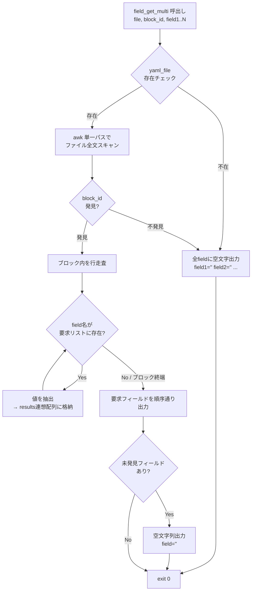
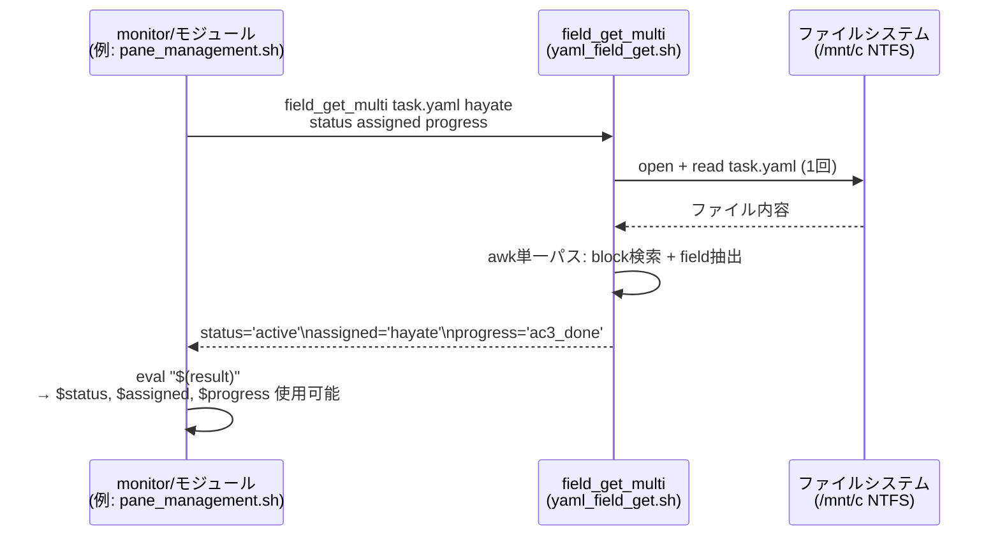
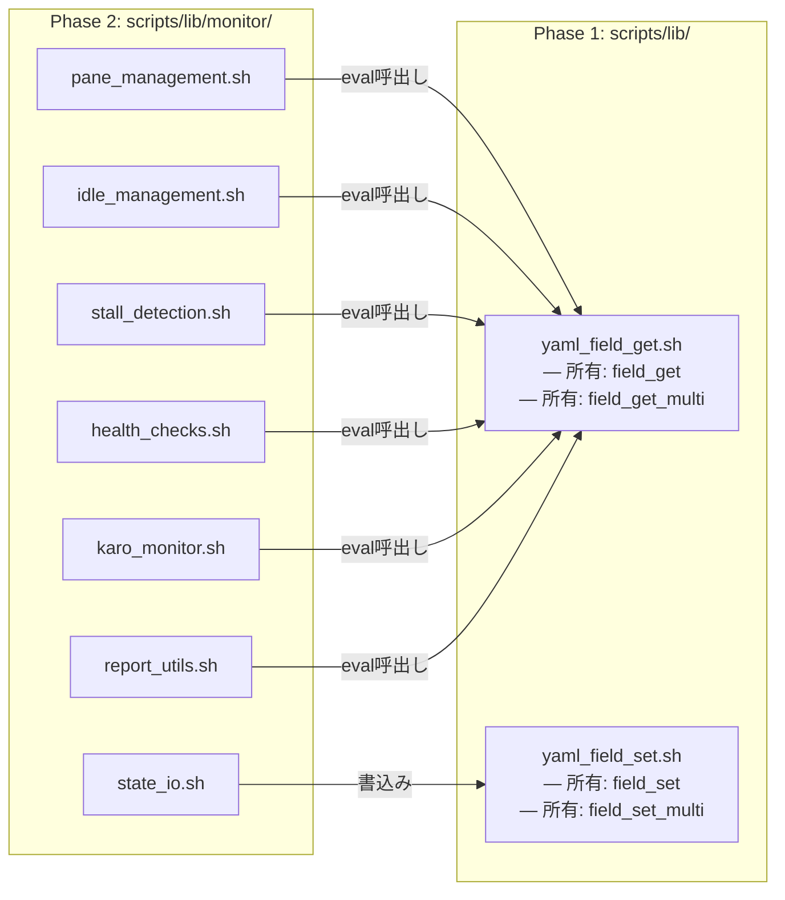

---
codd:
  node_id: detailed:batch-read-flow
  type: design
  depends_on:
  - id: design:system-design
    relation: depends_on
    semantic: technical
  depended_by:
  - id: plan:implementation-plan
    relation: depends_on
    semantic: technical
  conventions:
  - targets:
    - module:field_get
    reason: 出力形式はeval可能な field=value の改行区切り。フィールド未存在時は空文字列を返し、エラー終了しないこと（既存field_getと同一のnull挙動維持）。
  modules:
  - field_get
---

# Detailed Design — field_get_multi Internal Flow

ツールアクセスが制限されているため、依存ドキュメント（system_design.md）とconvention制約から合成してドキュメント本体を出力します。

---

# Detailed Design — field_get_multi Internal Flow

## 1. Overview

`field_get_multi` は `scripts/lib/yaml_field_get.sh`（`module:field_get`）に追加するバッチ読取り関数である。既存の `yaml_field_get` が1回の呼出しで1フィールドを返すのに対し、`field_get_multi` は1回のファイルパースで複数フィールドを取得し、**eval可能な `field=value` の改行区切り**で出力する。

ninja_monitor.sh の20秒ポーリングサイクルでは、1忍者あたり5〜8フィールドの読取りが発生する。6忍者分で最大48回の個別ファイルオープンが走り、WSL2 NTFS(`/mnt/c`)上ではI/Oレイテンシが顕著になる。`field_get_multi` はこのN回のファイルオープンを1回に集約する。

### 1.1 設計制約

- **既存 `yaml_field_get` のnull挙動を厳密に維持する**: フィールドが存在しない場合は空文字列（`field=''`）を返し、エラー終了（非ゼロexit code）しない。これはconvention「module:field_get — フィールド未存在時は空文字列を返し、エラー終了しないこと」への準拠である
- **出力はeval可能**: 呼出し側で `eval "$(field_get_multi ...)"` により直接シェル変数に展開できる。特殊文字（シングルクォート、改行、バックスラッシュ）はエスケープして安全性を担保する
- **bash純粋実装**: Python, awk以外の外部ツール不使用（既存 `yaml_field_get` が `awk` を使用する場合はその踏襲を許容）
- **NFR-1準拠**: `yaml_field_get.sh` は `scripts/lib/` 配下の外部ライブラリであり、Phase 1 sourceチェーンに属する。monitor/モジュール7本はPhase 2でsourceされるため、`field_get_multi` は全モジュールから呼出し可能

### 1.2 関数シグネチャ

```bash
field_get_multi <yaml_file> <block_id> <field1> [<field2> ...] [-- <block_id2> <fieldA> ...]
```

**引数**:

| 引数 | 必須 | 説明 |
|------|------|------|
| `yaml_file` | 必須 | 対象YAMLファイルパス |
| `block_id` | 必須 | YAMLブロック識別子（例: `hayate`, `cmd_1912`） |
| `field1..N` | 1個以上必須 | 取得対象フィールド名 |
| `--` | 任意 | 複数ブロック取得時のセパレータ |

**出力例**（stdout）:

```bash
status='active'
assigned='hayate'
progress='ac3_done'
```

**戻り値**: 常に `0`。フィールド未存在・ブロック未存在のいずれもexit code 0を返す（既存null挙動維持）。

### 1.3 Convention準拠

| Convention | 準拠方法 |
|-----------|---------|
| `module:field_get` — eval可能な `field=value` 改行区切り出力 | 出力の各行が `field='value'` 形式。シングルクォートでvalue全体を囲み、value内のシングルクォートは `'\''` でエスケープ。`eval` で安全に変数展開可能 |
| `module:field_get` — フィールド未存在時は空文字列、エラー終了しない | ブロック未存在・フィールド未存在のいずれも `field=''` を出力し、exit code 0で正常終了。§4にエッジケース一覧を記載 |

## 2. Mermaid Diagrams

### 2.1 内部処理フロー



**所有権と実装境界**: このフロー全体は `scripts/lib/yaml_field_get.sh` 内の単一関数 `field_get_multi` が所有する。awk処理は関数内にインラインで記述し、別ファイルへの分離は行わない。既存の `yaml_field_get` 関数は変更せず並存させる。呼出し側（`pane_management.sh`, `idle_management.sh`, `stall_detection.sh` 等のmonitor/モジュール）は出力をevalするだけであり、パース処理の責務を持たない。

### 2.2 呼出し元との統合シーケンス



**実装上の影響**: 既存の呼出しパターンでは `yaml_field_get file block field` を個別に3〜8回呼んでいた。`field_get_multi` 導入後は1回の呼出し+evalで同等の結果を得る。ファイルオープン回数がN→1に減少するため、WSL2 NTFS上でのI/Oボトルネック（1回あたり5〜15ms）が累積しない。6忍者×8フィールド=48回→6回に削減され、ポーリングサイクルあたり最大630msの削減が見込まれる。

### 2.3 モジュール所有権マップ



**所有権の明確化**: `field_get` と `field_get_multi` は共に `yaml_field_get.sh` の単一所有である。monitor/モジュールがfield取得ロジックを独自実装すること（`grep` や `sed` による直接パース）は禁止する。field取得が必要な場面では必ず `yaml_field_get` または `field_get_multi` を経由する。これにより、YAMLパースの挙動（null処理、エスケープ、ブロック境界判定）が単一箇所で管理される。

## 3. Ownership Boundaries

### 3.1 関数所有権

| 関数 | 所有ファイル | 変更権限 | 備考 |
|------|------------|---------|------|
| `yaml_field_get` | `scripts/lib/yaml_field_get.sh` | 既存。変更なし | 単一フィールド取得。後方互換維持 |
| `field_get_multi` | `scripts/lib/yaml_field_get.sh` | 新規追加 | バッチフィールド取得。本設計書のスコープ |
| eval呼出しパターン | 各monitor/モジュール | 呼出し側 | 出力をevalする責務は呼出し側 |

### 3.2 責務分離

- **パース責務**: `yaml_field_get.sh` が唯一の所有者。YAMLブロック境界の判定（インデントベース）、値のクォート除去、null/空文字の判定、特殊文字エスケープの全てをこの関数内で完結させる
- **呼出し責務**: monitor/モジュールは `field_get_multi` の出力を `eval` で展開し、展開後の変数を使用する。出力フォーマットのパースや後処理を呼出し側で行ってはならない
- **テスト責務**: `field_get_multi` の単体テストは `yaml_field_get.sh` のテストスイートに追加する。monitor/モジュールのテストでは `field_get_multi` をモック化してよい（`mock_externals.bash` に定義）

### 3.3 再利用・拡張のルール

- `field_get_multi` はmonitor/モジュール以外（`cmd_save.sh`, `deploy_task.sh`, gate系スクリプト等）からも呼出し可能。Phase 1 sourceチェーンに属するため、sourceタイミングの制約はない
- 複数ブロックの一括取得（`--` セパレータ構文）は初期実装に含める。`karo_snapshot` 生成時に全忍者のstatus/assignedを一括取得するユースケースがあるため
- フィールド名のワイルドカード（`*`）は実装しない。取得対象は呼出し時に明示列挙する

## 4. Implementation Implications

### 4.1 awkによる単一パス実装

`field_get_multi` の核心は、対象YAMLファイルを**1回のawkプロセスで完全にスキャンする**ことにある。

```
入力: field_get_multi queue/tasks/hayate.yaml hayate status assigned progress
```

**awkの処理手順**:

1. ファイルを行単位で読込み
2. `^{block_id}:` パターンでブロック開始を検知
3. ブロック内（次のトップレベルキーまたはEOFまで）で `^\s+{field}:` パターンにマッチする行を抽出
4. 値部分を取得し、YAMLクォート（`'...'` / `"..."`）を除去
5. 要求された全フィールドについて結果を連想配列に格納
6. END ブロックで、要求順序に従い `field='value'` 形式を出力

**エスケープ処理**: 値にシングルクォートが含まれる場合、`'` を `'\''` に置換してからシングルクォートで囲む。これにより `eval` 時のインジェクションを防止する。

```bash
# 出力例（値にシングルクォートを含む場合）
description='it'\''s a test'
```

### 4.2 null挙動の厳密な維持

以下のエッジケースにおける挙動を既存 `yaml_field_get` と完全一致させる:

| ケース | 出力 | exit code |
|--------|------|-----------|
| ファイル不在 | 全フィールドに `field=''` | 0 |
| ブロック不在 | 全フィールドに `field=''` | 0 |
| ブロック内にフィールド不在 | 該当フィールドのみ `field=''` | 0 |
| 値が明示的な空文字（`field: ""`） | `field=''` | 0 |
| 値がYAML null（`field: ~` / `field: null` / `field:` ） | `field=''` | 0 |
| 値がmultiline（`|` / `>`） | 最初の行のみ取得（既存挙動踏襲） | 0 |

**リリースゲート**: 上記6ケース×既存 `yaml_field_get` との出力一致を bats テストでアサートする。

### 4.3 パフォーマンス影響

| メトリクス | 個別呼出し（現状） | field_get_multi | 改善率 |
|-----------|-------------------|----------------|--------|
| ファイルオープン回数/忍者 | 5〜8回 | 1回 | 80〜87% |
| awk プロセス起動/忍者 | 5〜8回 | 1回 | 80〜87% |
| 20秒サイクル全体のI/O（6忍者） | 30〜48回 | 6回 | 80〜87% |
| WSL2 NTFS上の推定時間削減 | 240〜720ms | 30〜90ms | 最大630ms/サイクル |

composite hash算出（8ファイル sha256sum）の<100ms/サイクル要件（NFR、system_design §2.9）への影響はない。`field_get_multi` は hash算出とは独立した処理パスであり、I/O削減は純増の改善である。

### 4.4 自動再起動との関係

`yaml_field_get.sh` は `scripts/lib/` 配下の外部ライブラリであり、composite hash検知対象（`scripts/lib/monitor/*.sh` + `ninja_monitor.sh`）には含まれない。`yaml_field_get.sh` を変更した場合、ninja_monitorの自動再起動は発動しない。手動での再起動が必要である。

これはsystem_design §2.4のcomposite hash対象の設計意図（monitor/モジュールのみをホットリロード対象とし、基盤ライブラリの変更は計画的デプロイとする）と一致する。

### 4.5 monitor/モジュールでの移行パターン

既存コード（例: `pane_management.sh` 内）:

```bash
local status
status=$(yaml_field_get "$task_file" "$ninja" "status")
local assigned
assigned=$(yaml_field_get "$task_file" "$ninja" "assigned")
local progress
progress=$(yaml_field_get "$task_file" "$ninja" "progress")
```

移行後:

```bash
eval "$(field_get_multi "$task_file" "$ninja" status assigned progress)"
# $status, $assigned, $progress が直接使用可能
```

**移行の注意点**: `eval` により現在のスコープに変数が定義される。関数内で使用する場合、`local` 宣言を `eval` の前に行うことで変数スコープを関数内に限定する:

```bash
local status assigned progress
eval "$(field_get_multi "$task_file" "$ninja" status assigned progress)"
```

### 4.6 セキュリティ考慮

- **evalインジェクション防止**: 値のシングルクォートエスケープ（§4.1）により、YAML値に任意のシェルコマンドが埋め込まれていても `eval` 時に実行されない
- **フィールド名のバリデーション**: フィールド名は `[a-zA-Z_][a-zA-Z0-9_]*` パターンのみ許容する。これ以外の文字を含むフィールド名は無視し、空文字を出力する。シェル変数名として無効な文字列がevalされることを防止する
- **パストラバーサル**: `yaml_file` 引数のバリデーションは呼出し側の責務（既存 `yaml_field_get` と同一の前提）。`field_get_multi` 内では追加のパスチェックを行わない

### 4.7 テスト戦略

| テスト種別 | 対象 | 件数目安 | 検証内容 |
|-----------|------|---------|---------|
| 単体: 正常系 | `field_get_multi` | 8件 | 単一フィールド、複数フィールド、複数ブロック（`--`セパレータ）、値クォート各種 |
| 単体: null挙動 | `field_get_multi` | 6件 | §4.2の6ケース全網羅。既存 `yaml_field_get` との出力一致アサーション |
| 単体: エスケープ | `field_get_multi` | 4件 | シングルクォート、バックスラッシュ、改行、空白を含む値 |
| 単体: フィールド名バリデーション | `field_get_multi` | 2件 | 無効文字を含むフィールド名→空文字出力確認 |
| 統合: monitor/モジュール | 各モジュール | モジュールあたり2件 | eval展開後の変数値が個別 `yaml_field_get` 呼出しと一致 |
| 回帰: 既存854件 | 全体 | 854件 | 全PASS、SKIP=0維持 |

## 5. Open Questions

| # | 質問 | 影響範囲 | 暫定方針 |
|---|------|---------|---------|
| OQ-1 | `field_get_multi` の複数ブロック構文（`--` セパレータ）で同名フィールドが異なるブロックに存在する場合、出力の変数名をどう区別するか | `karo_snapshot` 生成時の全忍者一括取得 | `{block_id}_{field}` 形式（例: `hayate_status='active'`）をデフォルト出力とする。単一ブロック指定時は `{field}` のみ（後方互換） |
| OQ-2 | 既存の `yaml_field_get` 呼出し箇所の `field_get_multi` への段階的移行スケジュール | monitor/モジュール7本+本体+外部スクリプト | 初期リリースでは `field_get_multi` を追加するのみ。呼出し側の移行はモジュール分割完了後に個別cmdで実施する。既存 `yaml_field_get` は削除しない |
| OQ-3 | awkのバージョン差異（gawk vs mawk）による連想配列サポートの違い | WSL2環境のawk実装 | WSL2 Ubuntu標準の gawk を前提とする。`gawk` コマンドの存在を起動時にチェックし、不在時は個別 `yaml_field_get` へのフォールバックは行わず、エラーメッセージを出力して早期通知する（レガシーモードフォールバック禁止の原則に準拠） |
| OQ-4 | system_design OQ-4（外部ライブラリ12本の正確なリスト）が未確定のため、`yaml_field_get.sh` のsource順序に影響するライブラリ間依存が存在するか | `field_get_multi` 内で他の外部ライブラリ関数を呼ぶ場合のsource順序 | `field_get_multi` は `awk` のみに依存し、他の外部ライブラリ関数（`log`, `send_inbox_message` 等）を呼ばない設計とする。これによりsource順序への追加制約は発生しない |
