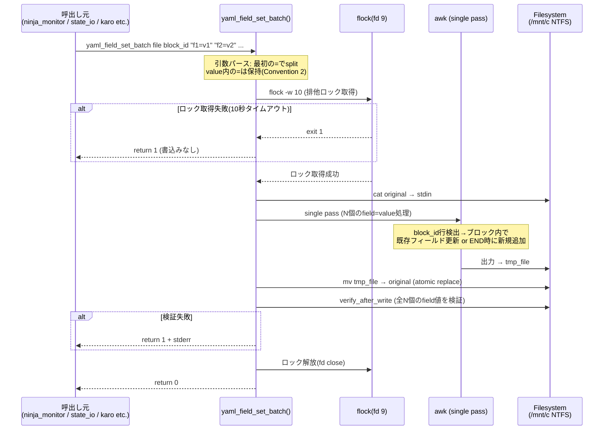
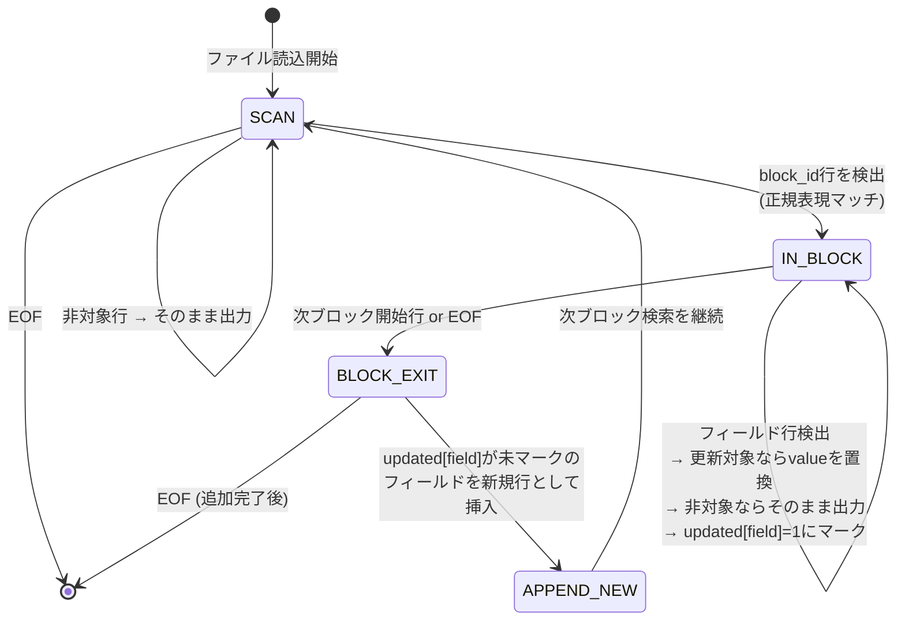

---
codd:
  node_id: detailed:batch-write-flow
  type: design
  depends_on:
  - id: design:system-design
    relation: depends_on
    semantic: technical
  depended_by:
  - id: plan:implementation-plan
    relation: depends_on
    semantic: technical
  conventions:
  - targets:
    - module:yaml_field_set
    reason: flock -w 10による排他ロック→単一awk pass→mv atomic replacement→verify_after_write。この順序は不変。awk内で既存フィールド更新と新規フィールド追加の両方を1
      passで処理すること。
  - targets:
    - module:yaml_field_set
    reason: 引数形式 field=value のパース時、value内の=文字をエスケープ処理すること（YAMLフィールド値に=を含むケースへの対応）。
  modules:
  - yaml_field_set
---

# Detailed Design — yaml_field_set_batch Internal Flow

## 1. Overview

`yaml_field_set_batch` は `scripts/lib/yaml_field_set.sh` 内に追加される関数であり、単一の YAML ファイルに対して複数フィールドを **1回のロック取得・1回の awk パス・1回の atomic mv** で書き込む。既存の `yaml_field_set` が 1呼出し=1フィールドであるのに対し、batch 版は N フィールドを一括処理することで、flock 取得回数を N→1 に削減し、I/O とロック競合を最小化する。

**呼出し形式**:

```bash
yaml_field_set_batch <file> <block_id> "field1=value1" "field2=value2" ...
```

**不変順序（Convention 1 — release-blocking）**:

| Step | 操作 | 失敗時の挙動 |
|------|------|-------------|
| 1 | `flock -w 10` による排他ロック取得 | タイムアウト → exit 1、書込み一切なし |
| 2 | 単一 `awk` パスで既存フィールド更新＋新規フィールド追加 | awk エラー → 一時ファイル削除、exit 1 |
| 3 | `mv` による atomic replacement（元ファイルを一時ファイルで置換） | mv 失敗 → 一時ファイル削除、exit 1 |
| 4 | `verify_after_write`（書込み後の内容検証） | 検証失敗 → stderr 出力、exit 1 |

この 4 ステップの順序は不変であり、いかなる最適化もこの順序を変更してはならない。

**Convention 2 準拠（= エスケープ — release-blocking）**: `field=value` 形式のパース時、最初の `=` のみをデリミタとして使用する。value 部分に `=` が含まれるケース（例: `url=https://example.com?a=1&b=2`）を正しく処理するため、awk 内で `index()` + `substr()` によるパースを行い、`split()` は使用しない。

**所有モジュール**: `scripts/lib/yaml_field_set.sh`（既存ファイルへの関数追加）。新規ファイル作成は不要。

## 2. Mermaid Diagrams

### 2.1 yaml_field_set_batch 内部フローシーケンス



**所有権と境界**: `yaml_field_set_batch` 関数は `scripts/lib/yaml_field_set.sh` の単一所有であり、他のモジュール（`state_io.sh`, `health_checks.sh` 等）はこの関数を呼出すのみで、ロック取得やawk処理を独自に再実装してはならない。system_design.md §2.2 の Source Chain により、`yaml_field_set.sh` は Phase 1（外部ライブラリ）としてモニターモジュールより先に source されるため、全モジュールから呼出し可能である。

### 2.2 awk 単一パス内部状態遷移



**実装境界**: awk スクリプトは `yaml_field_set_batch` 内部にヒアドキュメントとして埋込む。外部 awk ファイルへの分離は行わない。これは既存の `yaml_field_set` と同一パターンであり、source チェーンの複雑化を防ぐ。

awk パス内では以下の 2 つの処理を同時に行う:
- **既存フィールド更新**: ブロック内で `field:` パターンにマッチした行の value を置換し、`updated[]` 連想配列にマーク
- **新規フィールド追加**: ブロック終端（次ブロック開始行 or EOF）で `updated[]` に未マークのフィールドを `  field: value` 形式で挿入

### 2.3 ロック競合とリトライのタイミング図

```mermaid
gantt
    title flock 競合シナリオ（最悪ケース）
    dateFormat X
    axisFormat %s秒

    section Process A (state_io)
    flock取得          :a1, 0, 1
    awk pass           :a2, after a1, 2
    mv atomic          :a3, after a2, 1
    verify             :a4, after a3, 1
    flock解放          :a5, after a4, 0

    section Process B (batch write)
    flock待機(最大10秒) :b1, 0, 5
    flock取得           :b2, after b1, 1
    awk pass            :b3, after b2, 2
    mv atomic           :b4, after b3, 1
    verify              :b5, after b4, 1
    flock解放           :b6, after b5, 0
```



**実装上の帰結**: `flock -w 10` のタイムアウト 10 秒は、ninja_monitor の 20 秒ポーリングサイクル（system_design.md §2.1）の半分に設定されており、1 サイクル内でロック取得失敗→リトライが可能な設計である。batch 版は複数フィールドを 1 回のロックで書き込むため、従来の N 回ロック取得パターンに比べてロック競合の確率を `1/N` に低減する。

## 3. Ownership Boundaries

### 3.1 モジュール所有権

| コンポーネント | 所有ファイル | 責務 | 再実装禁止ルール |
|--------------|-------------|------|----------------|
| `yaml_field_set_batch()` | `scripts/lib/yaml_field_set.sh` | 複数フィールド一括書込みの唯一のエントリポイント | 他モジュールがflock+awk+mvの組合せを独自実装することを禁止 |
| `yaml_field_set()` | `scripts/lib/yaml_field_set.sh` | 単一フィールド書込み（既存。batch版の基盤） | batch版と同一ファイル内に共存。ロック・awk・mv・verify の共通ロジックは内部関数として共有可 |
| `verify_after_write()` | `scripts/lib/yaml_field_set.sh` | 書込み後検証。全フィールド値が期待通りか確認 | batch版はこの関数を N 個のフィールドに対してループ呼出し |
| 呼出し元（state_io, karo_monitor 等） | 各 `scripts/lib/monitor/*.sh` | yaml_field_set_batch の引数組立てと呼出し | awk直接実行やflock直接取得は禁止。必ず yaml_field_set_batch 経由 |

### 3.2 Source Chain 上の位置（NFR-1 準拠）

system_design.md §2.2 で定義された Phase 1 / Phase 2 の source 順序において、`yaml_field_set.sh` は Phase 1（外部ライブラリ）に属する。batch 関数の追加はこの位置を変更しない。

```
Phase 1: scripts/lib/yaml_field_set.sh  ← yaml_field_set_batch() はここに追加
Phase 2: scripts/lib/monitor/state_io.sh  ← batch() を呼出す側
         scripts/lib/monitor/karo_monitor.sh  ← batch() を呼出す側
```

Phase 2 モジュールが Phase 1 ライブラリの関数を呼出すのは、source 順序により常に安全である。

### 3.3 共有状態との関係

`yaml_field_set_batch` は共有グローバル変数（`NINJA_NAMES[]`, `STALL_COUNT[]` 等）を直接参照しない。入力は全て引数経由であり、出力はファイルシステムへの書込みのみである。これにより、bash 共有名前空間への副作用がゼロとなり、テスト時のモック注入が容易になる。

### 3.4 重複排除ルール

`yaml_field_set_batch` は `yaml_field_set.sh` 内に 1 回のみ定義される。system_design.md §2.6 の重複排除ポリシー（`grep + uniq -d` による CI 自動検証）の対象に含まれる。

## 4. Implementation Implications

### 4.1 awk ヒアドキュメント設計

単一 awk パスで N 個のフィールドを処理するため、awk に渡す変数は以下の形式とする:

```bash
# Convention 2 準拠: 最初の = のみでsplit
local -a fields=()
local -a values=()
for arg in "$@"; do
    local key="${arg%%=*}"        # 最初の=より左
    local val="${arg#*=}"         # 最初の=より右（残りの=は保持）
    fields+=("$key")
    values+=("$val")
done
```

awk 内部では `FIELD_COUNT`, `FIELDS[]`, `VALUES[]` を `-v` オプションまたは `BEGIN` ブロックで注入し、`updated[]` 連想配列でマーク管理する。

**= エスケープの具体例（Convention 2）**:

| 入力引数 | パース結果 field | パース結果 value |
|---------|-----------------|-----------------|
| `status=done` | `status` | `done` |
| `url=https://x.com?a=1` | `url` | `https://x.com?a=1` |
| `expr=x==y` | `expr` | `x==y` |
| `empty=` | `empty` | `` (空文字列) |

`${arg%%=*}` と `${arg#*=}` の bash パラメータ展開により、最初の `=` のみがデリミタとして機能し、value 内の `=` は一切変換されない。

### 4.2 atomic replacement の詳細

```bash
local tmp_file
tmp_file=$(mktemp "${file}.tmp.XXXXXX")
awk '...' "$file" > "$tmp_file"
mv "$tmp_file" "$file"
```

- `mktemp` は対象ファイルと同一ディレクトリに一時ファイルを作成する（同一ファイルシステム上での `mv` = atomic rename を保証）
- WSL2 NTFS 環境（`/mnt/c` 配下）でも `mv` は atomic であり、system_design.md §2.8 の互換性要件を満たす
- awk エラー時は `tmp_file` を削除してから exit する。孤立一時ファイルを残さない

### 4.3 verify_after_write の batch 対応

書込み後検証は全 N フィールドに対して実行する。1 フィールドでも期待値と異なれば exit 1 とする。

```bash
for i in "${!fields[@]}"; do
    local actual
    actual=$(yaml_field_get "$file" "$block_id" "${fields[$i]}")
    if [[ "$actual" != "${values[$i]}" ]]; then
        echo "verify_after_write FAILED: ${fields[$i]} expected='${values[$i]}' actual='$actual'" >&2
        return 1
    fi
done
```

**性能**: `yaml_field_get` は 1 呼出しにつき 1 回のファイル読込みを行うため、N フィールドで N 回の読込みが発生する。N は実用上 10 未満（state_io の write_karo_snapshot が最大ケース）であり、ファイルサイズも数KB以下のため、性能上の問題は発生しない。

### 4.4 flock スコープとファイルディスクリプタ

```bash
yaml_field_set_batch() {
    local file="$1" block_id="$2"
    shift 2
    # ... 引数パース ...

    (
        flock -w 10 9 || { echo "flock timeout: $file" >&2; return 1; }
        # awk pass → mv → verify (全てロック内)
    ) 9>"${file}.lock"
}
```

- ロックファイルは `${file}.lock`（対象ファイルと同一ディレクトリ）
- サブシェル `()` でスコープを限定し、サブシェル終了時に fd 9 が自動クローズ → ロック自動解放
- 既存の `yaml_field_set` と同一のロックファイル命名規則を使用するため、単体版と batch 版の同時実行でも排他制御が機能する

### 4.5 既存 yaml_field_set との互換性

batch 版の追加は既存の `yaml_field_set` の動作を一切変更しない。既存の呼出し元（CLAUDE.md で規定された `bash scripts/lib/yaml_field_set.sh <file> <block_id> <field> <value>` 形式）は引き続き動作する。

移行パス:
- **Phase 1**: batch 関数を追加。既存テスト 854 件全 PASS を確認
- **Phase 2**: `state_io.sh` の `write_karo_snapshot` 等、複数回 `yaml_field_set` を連続呼出ししている箇所を batch 版に置換（オプション。性能改善が必要な場合のみ）

### 4.6 エラーハンドリングと冪等性

| 障害ポイント | 挙動 | ファイル状態 |
|-------------|------|-------------|
| flock タイムアウト | return 1、書込みなし | 元ファイル不変 |
| awk 構文エラー / 入力不正 | tmp_file 削除、return 1 | 元ファイル不変 |
| mv 失敗（ディスク満杯等） | tmp_file 削除試行、return 1 | 元ファイル不変（mv は atomic — 部分書込みなし） |
| verify 失敗 | stderr 出力、return 1 | ファイルは更新済み（awk+mv 完了後の検証のため）。呼出し元が対処判断 |

verify 失敗時にはファイルが既に更新済みである点に注意が必要である。これは Convention 1 の不変順序（awk → mv → verify）に起因する。verify はデータ破損の早期検出が目的であり、ロールバック機構ではない。

### 4.7 Convention 準拠の明示的確認

| Convention | 要件 | 本設計での対応 |
|-----------|------|---------------|
| Convention 1: flock→awk→mv→verify 不変順序 | この順序は不変 | §2.1 シーケンス図で 4 ステップを順序明示。§4.4 でサブシェル内の実行順序をコードレベルで定義 |
| Convention 1: 単一 awk パスで更新＋追加 | 1 pass で既存更新と新規追加の両方 | §2.2 状態遷移図で IN_BLOCK→BLOCK_EXIT→APPEND_NEW のフローを定義。updated[] 連想配列によるマーク管理 |
| Convention 2: value 内の = エスケープ | field=value パース時に value 内の = を保持 | §4.1 で `${arg%%=*}` / `${arg#*=}` によるパースを定義。4 パターンの具体例で検証 |
| NFR-1: source 順序 | 外部ライブラリ → monitor モジュール | §3.2 で Phase 1 配置を明示 |
| system_design §2.8: WSL2 NTFS 互換 | /mnt/c 配下で動作 | §4.2 で同一ファイルシステム上の mv = atomic rename を保証 |

## 5. Open Questions

| # | 質問 | 影響範囲 | 暫定方針 |
|---|------|---------|---------|
| OQ-B1 | `write_karo_snapshot` が 1 回の呼出しで書き込むフィールド数の最大値は何か。verify ループの実行回数に影響する | verify_after_write の性能見積もり | 現行コードの `write_karo_snapshot` を精査し、最大フィールド数を確定する。10 未満であれば性能問題なし |
| OQ-B2 | batch 版と単体版が同一ロックファイル (`${file}.lock`) を共有するが、将来的に batch 版のみに統一するか、両方を永続的に併存させるか | API 表面積の管理。単体版は batch の N=1 ケースで代替可能 | 併存を維持。単体版は既存の呼出し箇所が多く、一括置換のリスクが高い。新規コードでは batch 版を推奨 |
| OQ-B3 | verify 失敗時のリカバリ戦略。現設計では mv 完了後の検出のみでロールバックしない | データ整合性の保証レベル | verify 失敗は awk ロジックのバグまたはファイルシステム障害を示す。呼出し元で return code を検査し、失敗時は ninja_monitor のログに出力して次サイクルでリトライする方針とする |
| OQ-B4 | awk ヒアドキュメント内で N 個のフィールド/値をどの形式で渡すか（`-v` 変数 vs 環境変数 vs awk の `ARGV`） | awk 実装の詳細。特殊文字（シングルクォート、バックスラッシュ）を含む value の安全な受け渡し | `-v` オプションで `FIELD_COUNT` とインデックス付き変数（`F1`, `F2`, ..., `V1`, `V2`, ...）を渡す方式を第一候補とする。特殊文字のエスケープ要件は抽出作業中に実ケースで検証する |
