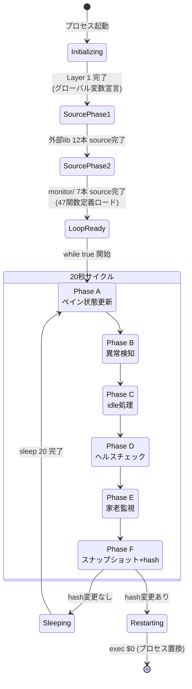
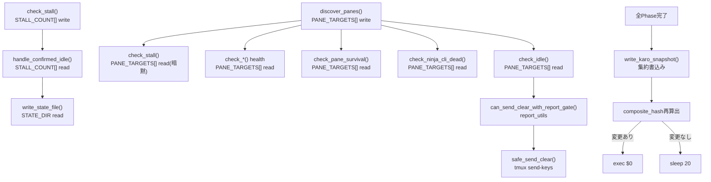

---
codd:
  node_id: detailed_design:dispatch-flow
  type: design
  depends_on:
  - id: detailed_design:module-ownership
    relation: depends_on
    semantic: technical
  - id: detailed_design:shared-state-model
    relation: depends_on
    semantic: technical
  depended_by:
  - id: plan:implementation-plan
    relation: depends_on
    semantic: technical
  conventions:
  - targets:
    - module:ninja_monitor
    reason: 'FR-2/FR-4: 20-second poll cycle dispatch order and function call sequence
      must be preserved exactly. Any reordering is a behavior change and release-blocking.'
  modules:
  - ninja_monitor
---

# Main Loop Dispatch Sequence

## 1. Overview

`ninja_monitor.sh` の主ループは20秒ポーリングサイクルで全監視関数をディスパッチする。本設計書は、7モジュール（`idle_management`, `stall_detection`, `health_checks`, `karo_monitor`, `pane_management`, `report_utils`, `state_io`）への分割後も、主ループ内の関数呼び出し順序・タイミング・制御フローを**一切変更しない**ことを保証するために、ディスパッチシーケンスの正確な仕様を定義する。

**コンベンション準拠（FR-2/FR-4: 20秒ポーリングサイクルのディスパッチ順序と関数呼び出しシーケンス）**: 主ループ内の関数呼び出し順序は現行 `ninja_monitor.sh` の `while true; do ... sleep 20; done` ブロック内に記述された順序と**完全一致**しなければならない。順序の入れ替え・関数の挿入・条件分岐の追加はすべて動作変更と見なし、リリースブロッキング違反となる。ディスパッチャは `ninja_monitor.sh` 本体に残留し（FR-2: 目標約500行）、各モジュールの関数を名前で直接呼び出す。呼び出しシグネチャ・戻り値・副作用はリファクタリング前後で同一とする（FR-4: ゼロ動作変更）。

主ループの構成は以下の3層から成る。

| 層 | 配置 | 内容 |
|----|------|------|
| Layer 1: 初期化 | `ninja_monitor.sh` 本体冒頭 ~150行 | グローバル変数宣言（`declare -A STALL_FIRST_SEEN` 等）、`NINJA_NAMES[]` 構築、`STATE_DIR`/`SCRIPT_DIR`/`LOG` 設定 |
| Layer 2: Source Chain | Phase 1（外部lib 12本）→ Phase 2（monitor/ 7本） | 関数定義のロード。トップレベル実行なし。順序は `state_io → report_utils → pane_management → idle_management → stall_detection → health_checks → karo_monitor` |
| Layer 3: 主ループ | `while true; do ... sleep 20; done` | 20秒サイクルでディスパッチ。composite hash検知による `exec` 再起動を含む |

ディスパッチ順序の根拠は**データ依存**にある。`pane_management::discover_panes` が `PANE_TARGETS[]` を更新し、後続の `idle_management::check_idle` と `health_checks::check_*` がその値を参照する。`stall_detection::check_stall` が `STALL_COUNT[]` を更新し、`idle_management::handle_confirmed_idle` がその値を読み取る。この因果関係が順序を規定しており、入れ替えはデータ不整合を引き起こす。

## 2. Mermaid Diagrams

### 2.1 20秒ポーリングサイクル ディスパッチシーケンス

```mermaid
sequenceDiagram
    participant ML as Main Loop<br/>(ninja_monitor.sh)
    participant PM as pane_management
    participant SD as stall_detection
    participant IM as idle_management
    participant HC as health_checks
    participant KM as karo_monitor
    participant RU as report_utils
    participant SIO as state_io

    Note over ML: while true; do

    rect rgb(230, 245, 255)
        Note over ML,PM: Phase A: ペイン状態の更新（データ供給）
        ML->>PM: discover_panes()
        PM-->>ML: PANE_TARGETS[] 更新済み
        ML->>PM: update_all_context_pct()
        PM-->>ML: 全忍者CTX%キャッシュ更新
        ML->>PM: check_model_names()
        PM-->>ML: モデル名キャッシュ更新
        ML->>PM: update_inbox_counts()
        PM-->>ML: inbox件数キャッシュ更新
    end

    rect rgb(255, 245, 230)
        Note over ML,SD: Phase B: 異常検知（状態書込み）
        ML->>SD: check_stall()
        SD-->>ML: STALL_FIRST_SEEN[]/STALL_NOTIFIED[]/STALL_COUNT[] 更新
        ML->>SD: check_report_done_idle_mismatch()
        SD-->>ML: 不整合検出→通知
        ML->>SD: check_stale_cmds()
        SD-->>ML: 長期未完了cmd検出
        ML->>SD: check_undeployed_cmds()
        Note over SD,RU: is_task_deployed() 呼出し
        SD->>RU: is_task_deployed()
        RU-->>SD: 配備状態
        SD-->>ML: 未配備cmd検出
    end

    rect rgb(230, 255, 230)
        Note over ML,IM: Phase C: idle処理（状態読取り→アクション）
        ML->>IM: check_idle() [各忍者ループ]
        Note over IM: STALL_COUNT[] 読取り<br/>PANE_TARGETS[] 読取り
        IM->>RU: can_send_clear_with_report_gate()
        RU-->>IM: gate判定結果
        IM->>SIO: write_state_file()
        SIO-->>IM: 状態書込み完了
        IM-->>ML: idle処理完了
    end

    rect rgb(255, 230, 230)
        Note over ML,HC: Phase D: ヘルスチェック
        ML->>HC: check_ntfy_listener_health()
        ML->>HC: check_inbox_watcher_health()
        ML->>HC: check_loop_health()
        ML->>HC: check_yaml_size()
        ML->>HC: run_cdp_cleanup()
        ML->>HC: run_lock_cleanup()
        ML->>HC: check_auto_archive()
        ML->>HC: check_lesson_health()
        ML->>HC: check_workaround_pattern()
        ML->>HC: check_gate_improvement()
    end

    rect rgb(245, 230, 255)
        Note over ML,KM: Phase E: 家老監視
        ML->>KM: check_karo_pending_cmd()
        ML->>KM: check_karo_pending()
        ML->>KM: check_karo_clear()
        ML->>KM: check_karo_idle_cycle()
    end

    rect rgb(255, 255, 230)
        Note over ML,SIO: Phase F: スナップショット書込み＋再起動判定
        ML->>PM: check_pane_survival()
        ML->>PM: check_ninja_cli_dead()
        ML->>PM: check_shogun_ctx()
        ML->>SIO: write_karo_snapshot()
        SIO-->>ML: snapshot書込み完了
        ML->>ML: composite_hash再算出
        Note over ML: hash変更 → exec $0 再起動
    end

    Note over ML: sleep 20; done
```

**ディスパッチ順序の根拠（データ依存チェーン）**:

- **Phase A → Phase B**: `discover_panes` が `PANE_TARGETS[]` を更新した後でなければ、`check_stall` が正確なペイン状態を参照できない。Phase A は全後続フェーズのデータ供給元である。
- **Phase B → Phase C**: `check_stall` が `STALL_COUNT[]` を更新した後でなければ、`check_idle` → `handle_confirmed_idle` が stall 累積回数に基づく正確な idle 判定を行えない。
- **Phase C → Phase D**: idle 処理で状態ファイルが更新された後に `run_lock_cleanup` が走ることで、idle 処理中のロックファイルを誤って削除しない。
- **Phase D → Phase E**: ヘルスチェックで異常が検出された場合、家老監視フェーズでその状態を反映した判定が可能になる。
- **Phase F（末尾）**: `write_karo_snapshot` は全フェーズの処理結果を集約して1サイクル分のスナップショットを生成するため、必ず末尾に配置する。composite hash 再算出→`exec` 再起動判定もサイクルの最終ステップである。

**FR-2/FR-4 の具体的保証**: 上図の関数呼び出し順序は現行 `ninja_monitor.sh` の主ループ内の記述順序と1対1で対応する。モジュール分割後も `ninja_monitor.sh` 本体にはこの呼び出しシーケンスがそのまま残留し、各関数名は bash 共有名前空間を通じて `scripts/lib/monitor/*.sh` の定義に解決される。関数名・引数・戻り値コードは不変であり、ディスパッチャ側のコードは関数の物理的配置先に依存しない。

### 2.2 ディスパッチャの状態遷移図



**状態遷移の不変条件**: Phase A〜F は必ずこの順序で逐次実行され、並列化・スキップ・条件付き省略は行わない。各 Phase 内の関数呼び出しも固定順序であり、条件分岐は関数内部でのみ発生する（ディスパッチャ側の `if` 文で呼び出し自体をスキップするパターンが現行コードに存在する場合は、そのまま維持する）。`exec` 再起動時はプロセスが完全に置換されるため、Initializing 状態に戻り全共有状態が再初期化される（shared_state_model.md §4.3 参照）。

### 2.3 データ依存 DAG



**DAG が示す不変量**: `discover_panes()` はグラフの根であり、他のすべてのペイン参照関数の前に実行されなければならない。`check_stall()` は `check_idle()` の前に実行されなければならない（`STALL_COUNT[]` の因果）。`write_karo_snapshot()` はグラフの葉であり、全監視関数の後に実行されなければならない。これらの依存関係がディスパッチ順序を規定し、順序変更は DAG 違反＝データ不整合＝FR-4 違反となる。

## 3. Ownership Boundaries

### 3.1 ディスパッチャ（ninja_monitor.sh 本体）の専権事項

ディスパッチャは以下の責務を排他的に所有する。7モジュールがこれらを代替・拡張することは禁止する。

| 責務 | 具体的コード | 禁止事項 |
|------|------------|---------|
| 主ループ制御 | `while true; do ... sleep 20; done` | モジュール内で独自のループ・sleep を持つこと |
| ディスパッチ順序の定義 | Phase A〜F の関数呼び出し列 | モジュールが他モジュールの関数をディスパッチ呼び出しすること（モジュール間の直接呼び出しは共有サービス利用に限定。§3.2参照） |
| composite hash 算出・比較 | `sha256sum ninja_monitor.sh scripts/lib/monitor/*.sh \| sha256sum` | モジュールが自身の変更検知を行うこと |
| `exec $0` 再起動判定 | hash 変更時の `exec` 発行 | モジュールがプロセス制御を行うこと |
| `POLL_INTERVAL` の管理 | `sleep $POLL_INTERVAL`（=20秒） | モジュールが sleep 間隔に介入すること |
| シグナルハンドラ | `trap` による SIGTERM/SIGINT 処理 | モジュールが独自の trap を設定すること |
| グローバル変数の宣言・初期化 | Layer 1: `declare -A`, `NINJA_NAMES=(...)` 等 | モジュール内での `declare`/`local` による共有変数シャドウイング（FR-3） |

### 3.2 モジュール関数の呼び出し分類

ディスパッチャからの呼び出しは2種類に分類される。

**Type 1: ディスパッチ呼び出し（ディスパッチャ→モジュール）**

主ループの `while true` ブロック内で直接呼び出される関数。呼び出し順序はディスパッチャが排他的に管理する。

| Phase | 呼び出し関数 | 所属モジュール |
|-------|------------|--------------|
| A | `discover_panes` | pane_management |
| A | `update_all_context_pct` | pane_management |
| A | `check_model_names` | pane_management |
| A | `update_inbox_counts` | pane_management |
| B | `check_stall` | stall_detection |
| B | `check_report_done_idle_mismatch` | stall_detection |
| B | `check_stale_cmds` | stall_detection |
| B | `check_undeployed_cmds` | stall_detection |
| C | `check_idle` | idle_management |
| C | `notify_idle_batch` | idle_management |
| D | `check_ntfy_listener_health` | health_checks |
| D | `check_inbox_watcher_health` | health_checks |
| D | `check_loop_health` | health_checks |
| D | `check_yaml_size` | health_checks |
| D | `run_cdp_cleanup` | health_checks |
| D | `run_lock_cleanup` | health_checks |
| D | `check_auto_archive` | health_checks |
| D | `check_lesson_health` | health_checks |
| D | `check_workaround_pattern` | health_checks |
| D | `check_gate_improvement` | health_checks |
| E | `check_karo_pending_cmd` | karo_monitor |
| E | `check_karo_pending` | karo_monitor |
| E | `check_karo_clear` | karo_monitor |
| E | `check_karo_idle_cycle` | karo_monitor |
| F | `check_pane_survival` | pane_management |
| F | `check_ninja_cli_dead` | pane_management |
| F | `check_shogun_ctx` | pane_management |
| F | `write_karo_snapshot` | state_io |

**Type 2: サービス呼び出し（モジュール→モジュール）**

モジュール関数内部から他モジュールの関数を呼び出すケース。ディスパッチャは関与しない。呼び出しは関数実行時に bash 名前空間で解決される。

| 呼出し元 | 呼出し先関数 | 所属モジュール | 用途 |
|---------|------------|--------------|------|
| idle_management | `can_send_clear_with_report_gate` | report_utils | clear送信前のgate判定 |
| idle_management | `check_and_update_done_task` | report_utils | task状態更新 |
| idle_management | `write_state_file` | state_io | idle状態の永続化 |
| stall_detection | `is_task_deployed` | report_utils | 配備確認 |

Type 2 呼び出しの順序はディスパッチャの管轄外であり、各モジュール関数の内部ロジックに従う。FR-4 により、これらの内部呼び出しパターンも現行コードと完全一致を維持する。

### 3.3 ディスパッチャ補助関数（本体残留）

主ループ制御に密結合し、モジュールへの抽出が不適切な関数群。module_ownership.md OQ-1 で示された残留候補の具体化。

| カテゴリ | 関数群（推定） | 残留理由 |
|---------|--------------|---------|
| 初期化 | `init_globals`, `parse_args`, `setup_signal_handlers` | 全モジュールの前提構築。Layer 1 の一部 |
| composite hash | `compute_composite_hash`, `check_restart_needed` | 主ループ制御フロー（`exec` 判定）に直結 |
| ディスパッチ補助 | `run_cycle`, `log_cycle_start`, `log_cycle_end` | 主ループの可読性維持。Phase A〜F の呼び出しを構造化 |
| source chain | Phase 1 + Phase 2 の `source` 文列 | 読込み順序の一元管理 |

これらの関数名は抽出作業中の call graph 確認後に確定する（OQ-1）。確定後に本設計書を更新し、ディスパッチシーケンス図（§2.1）との整合性を検証する。

### 3.4 tmux send-keys 発行とディスパッチ順序の関係

`tmux send-keys` を発行する2関数（`idle_management::safe_send_clear`, `karo_monitor::send_karo_clear`）はそれぞれ Phase C と Phase E に属する。Phase C が Phase E より先に実行されるため、忍者への `/clear` 送信が家老への `/clear` 送信より先に処理される。この順序は現行動作と同一であり変更しない。

## 4. Implementation Implications

### 4.1 ディスパッチ順序保全の検証戦略

FR-2/FR-4（20秒ポーリングサイクルのディスパッチ順序は動作変更であり release-blocking）を保証するため、以下の3層で検証する。

**層1: 静的検証（CI）**

```bash
# 主ループ内の関数呼び出し順序を抽出し、期待順序と diff する
# ninja_monitor.sh の while true ブロック内の関数呼び出しを行番号付きで列挙
sed -n '/while true/,/^done$/p' scripts/ninja_monitor.sh \
  | grep -oE '[a-z_]+\s*(' \
  | sed 's/\s*($//' \
  > /tmp/actual_dispatch_order.txt

# 期待順序ファイル（本設計書 §3.2 Type 1 テーブルから生成、tests/ 配下に配置）
diff tests/expected_dispatch_order.txt /tmp/actual_dispatch_order.txt
```

期待順序ファイル `tests/expected_dispatch_order.txt` は本設計書 §3.2 の Type 1 テーブルから自動生成し、テストフィクスチャとして管理する。順序が1行でも異なれば CI FAIL とする。

**層2: 動的検証（bats テスト）**

```bash
# 呼び出し順序トレースのbatsテスト概念
@test "dispatch order matches specification" {
  # 全モジュール関数をトレース付きモックに置換
  source tests/e2e/helpers/mock_globals.bash
  source tests/e2e/helpers/mock_externals.bash
  # 各関数をモック化し、呼び出し順をファイルに記録
  for func in discover_panes update_all_context_pct check_model_names ...; do
    eval "$func() { echo $func >> /tmp/call_trace.txt; }"
  done
  # 1サイクル分のディスパッチを実行（sleep をスタブ化）
  run_single_cycle
  # 呼び出し順序の検証
  diff tests/expected_dispatch_order.txt /tmp/call_trace.txt
}
```

**層3: 既存テスト回帰（854 bats）**

既存854テスト全 PASS・SKIP=0 がリリースゲート。ディスパッチ順序の変更は副作用の変化として既存テストで検出される。

### 4.2 Phase 境界とエラーハンドリング

各 Phase 内の関数がエラー（非0 return code）を返した場合の挙動は、現行 `ninja_monitor.sh` のコードに従う。ディスパッチャは以下のパターンのいずれかで処理する（FR-4 により変更なし）。

| パターン | 現行動作 | 分割後 |
|---------|---------|--------|
| エラー無視 | 関数の return code を検査しない。次の関数呼び出しに進む | 同一。ディスパッチャのコードは不変 |
| 条件付きスキップ | `if check_X; then handle_X; fi` の形式。check が非0なら handle をスキップ | 同一。ディスパッチャの `if` 文は不変 |
| ログ出力 | 関数内部で `log` を呼び、return する | 同一。関数内部のロジックは不変（FR-4） |

ディスパッチャレベルでの `set -e`（エラー即時終了）は使用しない。これは現行動作の維持である。

### 4.3 サイクルタイミングと性能制約

| 計測項目 | 現行値 | 分割後の期待値 | 検証方法 |
|---------|--------|--------------|---------|
| 1サイクルの実行時間 | <5秒（実測値は環境依存） | <5秒（関数呼び出しオーバーヘッドは無視可能） | `time` コマンドでの計測。5秒超過時はログ出力 |
| source chain 完了時間 | <500ms | <500ms（7ファイル追加。各ファイルは関数定義のみ） | 起動時の `date +%s%N` 差分 |
| composite hash 算出時間 | <100ms | <100ms（8ファイルの sha256sum） | 実測。100ms超過は警告 |
| `sleep 20` の実効間隔 | 20秒 + サイクル実行時間 | 同一 | 変更なし |

`POLL_INTERVAL=20` は `ninja_monitor.sh` 本体 Layer 1 で宣言され、主ループの `sleep $POLL_INTERVAL` で使用される。モジュールはこの値を変更しない（§3.1 禁止事項）。

### 4.4 `exec` 再起動時のディスパッチ復元

composite hash 変更検知による `exec $0` はプロセス全体を置換する。再起動後、ディスパッチャは以下の手順で状態を復元する。

1. Layer 1: グローバル変数を再宣言・再初期化（shared_state_model.md §4.3 参照）
2. Phase 1: 外部ライブラリ12本を再 source
3. Phase 2: monitor/ 7本を再 source（更新後のコードが読み込まれる）
4. 主ループ開始: 最初のサイクルで `discover_panes` が `PANE_TARGETS[]` を再構築

`STALL_FIRST_SEEN[]`, `STALL_NOTIFIED[]`, `STALL_COUNT[]` はリセットされる。これは現行動作と同一であり（現行の単一ファイル版でも `exec` で同じリセットが発生する）、モジュール分割による追加影響はない。

### 4.5 ディスパッチ順序変更の手順（将来の拡張時）

FR-2/FR-4 は本リファクタリングにおけるゼロ変更制約であり、将来的にディスパッチ順序を変更する場合は以下の手順を踏む。

1. 本設計書 §2.1 のシーケンス図と §3.2 の Type 1 テーブルを更新
2. `tests/expected_dispatch_order.txt` を更新
3. データ依存 DAG（§2.3）を再検証し、因果関係の破壊がないことを確認
4. 既存854 batsテスト + ディスパッチ順序テストを全 PASS
5. 別 cmd として発令（本リファクタリング cmd とは分離）

### 4.6 コンベンション準拠サマリ

| コンベンション | 準拠方法 |
|--------------|---------|
| **FR-2/FR-4: 20秒ポーリングサイクルのディスパッチ順序保全（release-blocking）** | §2.1 で Phase A〜F の完全なディスパッチシーケンスを図示。§2.3 で順序を規定するデータ依存 DAG を明示。§3.2 で Type 1 ディスパッチ呼び出しの全関数リストを固定。§4.1 で静的検証（CI）・動的検証（bats）・回帰テスト（854件）の3層で順序保全を自動検証。順序入れ替えは DAG 違反＝データ不整合＝release-blocking 違反 |
| **FR-2: 主ループ残留（目標500行）** | §3.1 でディスパッチャの専権事項を定義。§3.3 で残留関数カテゴリを列挙。Phase A〜F の呼び出し列 + 初期化 + source chain + composite hash + シグナルハンドラで約500行 |
| **FR-4: ゼロ動作変更** | §4.2 でエラーハンドリングパターンの不変性を保証。§4.4 で `exec` 再起動動作の同一性を確認。関数シグネチャ・戻り値・副作用は module_ownership.md §3.1 の一覧に従い不変 |
| **FR-3: 共有状態のコピー・シャドウ禁止** | §3.1 でディスパッチャが Layer 1 宣言を専権所有。§2.1 のシーケンス図で各 Phase のデータ読み書きを明示 |
| **Auto-Restart Hash**: composite hash は8ファイルカバー | §3.1 で composite hash 算出をディスパッチャ専権とし、§4.4 で再起動後の復元手順を規定 |

## 5. Open Questions

| # | 質問 | 影響範囲 | 暫定方針 |
|---|------|---------|---------|
| OQ-DF-1 | ディスパッチャの主ループ内で一部の関数呼び出しが `if` 文で条件付きになっているか（例: `if check_X; then handle_X; fi`）。条件分岐がある場合、Phase 内の呼び出し順序だけでなく条件式も固定する必要がある | §3.2 Type 1 テーブルの完全性。条件付きスキップがある場合、`expected_dispatch_order.txt` では表現できない | 抽出作業開始前に `sed -n '/while true/,/^done$/p' scripts/ninja_monitor.sh` で主ループの全行を列挙し、条件分岐構造を確認する。条件付き呼び出しが存在する場合、テスト戦略を「呼び出し順序の diff」から「トレースログの条件付きマッチング」に調整する |
| OQ-DF-2 | `run_cycle` のようなディスパッチ補助関数が現行コードに存在するか、それとも全呼び出しが主ループ直下にフラットに記述されているか | §3.3 の残留関数リストの確定。ディスパッチ補助関数が存在する場合、シーケンス図の粒度を調整する必要がある | 主ループの call graph を確認し、中間関数の有無を判定する。存在しない場合は §3.3 から該当エントリを削除し、全呼び出しがフラットであることを明記する |
| OQ-DF-3 | Phase A〜F の分割境界は本設計書で定義したものであり、現行コードにはコメント等による明示的な Phase 区分が存在しない可能性がある。実装時に Phase コメントを追加すべきか | 主ループの可読性。コメント追加は「ゼロ動作変更」に抵触しないが、diff のノイズになる | Phase 境界コメント（`# --- Phase A: ペイン状態更新 ---`）は動作に影響しないため追加可。ただし本リファクタリング cmd と同一 PR 内で行い、別 cmd 化は不要。追加しない場合も設計書の Phase 定義は有効 |
| OQ-DF-4 | §2.1 の Phase 順序は module_ownership.md §3.2 のクロスモジュール呼び出しマトリクスと shared_state_model.md §1.2 のアクセスパターンから推定した。現行コードの実際の順序と差異がある場合、本設計書と `expected_dispatch_order.txt` のどちらを正とするか | ディスパッチ順序検証の基準 | 現行コードが正（FR-4: ゼロ動作変更）。本設計書の Phase 順序と現行コードに差異が発見された場合、本設計書を現行コードに合わせて修正する。`expected_dispatch_order.txt` は現行コードから自動生成する |
