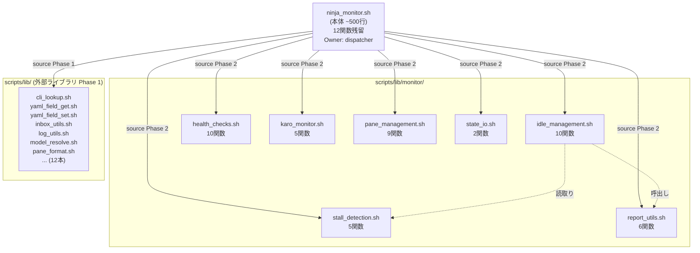
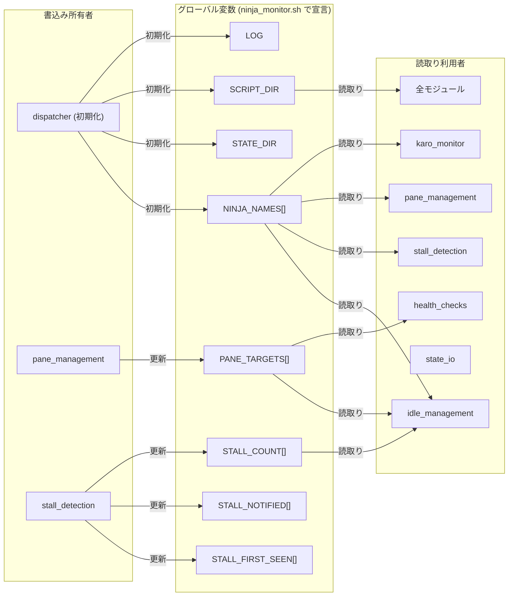

---
codd:
  node_id: detailed_design:module-ownership
  type: design
  depends_on:
  - id: design:system-design
    relation: depends_on
    semantic: technical
  depended_by:
  - id: test:test-strategy
    relation: depends_on
    semantic: technical
  - id: plan:implementation-plan
    relation: depends_on
    semantic: technical
  - id: operations:daemon-runbook
    relation: depends_on
    semantic: technical
  conventions:
  - targets:
    - module:idle_management
    - module:stall_detection
    - module:health_checks
    - module:karo_monitor
    - module:pane_management
    - module:report_utils
    - module:state_io
    reason: 'FR-1: Each module must contain exactly the functions listed in requirements.
      No function may appear in multiple modules (MECE). No function may be lost during
      extraction.'
  - targets:
    - module:ninja_monitor
    - module:idle_management
    - module:stall_detection
    - module:health_checks
    - module:karo_monitor
    - module:pane_management
    - module:report_utils
    - module:state_io
    reason: 'FR-4: Function signatures, return codes, and side effects must be identical
      pre- and post-refactoring. Zero behavior change.'
  modules:
  - idle_management
  - stall_detection
  - health_checks
  - karo_monitor
  - pane_management
  - report_utils
  - state_io
---

# Module Ownership Boundaries

## 1. Overview

ninja_monitor.sh（3,158行・59関数）を `scripts/lib/monitor/` 配下の7モジュールに純粋分割するリファクタリングにおいて、各モジュールの所有権境界を定義する。本設計書は「どの関数がどのモジュールに属するか」「どの共有状態を誰が読み書きするか」「モジュール間の呼び出し関係で守るべきルール」を網羅的に規定し、実装時の関数重複・責務漏れ・所有権の曖昧化を防止する。

**コンベンション準拠（FR-1: MECE関数配置）**: 59関数は厳密に1モジュールにのみ属する。複数モジュールへの重複定義を禁止し、CIで `grep -rh '^function \|^[a-z_]*()' scripts/lib/monitor/*.sh scripts/ninja_monitor.sh | sort | uniq -d` による自動検証を実施する。関数の欠落（抽出漏れ）も同様にCIで59関数の存在アサーションにより検出する。

**コンベンション準拠（FR-4: ゼロ動作変更）**: 関数シグネチャ（引数の数・位置・名前）、戻り値（return code）、副作用（ファイル書込み・tmuxコマンド発行・外部コマンド実行）は分割前後で完全同一とする。リファクタリングは関数の物理的移動のみであり、制御フロー・条件分岐・変数操作の変更は一切行わない。既存854 batsテスト全PASS・SKIP=0がリリースゲートとなる。

**コンベンション準拠（NFR-1: Source順序）**: 全7モジュールは外部ライブラリ `scripts/lib/*.sh`（12本）の後にsourceする。Phase 1（外部ライブラリ）→ Phase 2（monitor/モジュール）の順序を厳守し、行番号ベースのCIアサーションで検証する。

**コンベンション準拠（FR-2: 主ループ残留）**: 主ループディスパッチャは `ninja_monitor.sh` 本体に残留し、目標約500行とする。グローバル変数宣言・source文・20秒ポーリング主ループ・ディスパッチャ補助関数（約12関数）が本体の構成要素である。

**コンベンション準拠（Auto-Restart Hash）**: 自動再起動のcomposite hash検知は `ninja_monitor.sh` 本体 + `scripts/lib/monitor/*.sh`（7ファイル）の計8ファイルをカバーする。glob展開後のファイル数が7でない場合は警告を出力する。

## 2. Mermaid Diagrams

### 2.1 モジュール所有権マップ



**所有権の意味**: 各モジュールファイルはその中に定義される全関数の**唯一の所有者**である。関数の定義・修正・削除はそのモジュールファイル内でのみ行う。他モジュールの関数を呼び出すことは許容されるが、再定義・ラッパー関数の作成は禁止する。

**モジュール間呼び出しルール**: bashの共有名前空間により、source済みの全関数は名前で直接呼び出し可能である。モジュール間の呼び出しは暗黙的に発生するが、呼び出し元モジュールは呼び出し先モジュールの内部実装に依存してはならない（公開関数のシグネチャのみに依存する）。具体的には `idle_management.sh` が `report_utils.sh` の `can_send_clear_with_report_gate` を呼ぶケースが存在する。この依存により、Phase 2のsource順序では `report_utils.sh` を `idle_management.sh` より先にsourceすることが推奨される。

**再実装ドリフト防止**: 共有ユーティリティ（`write_state_file`, `write_karo_snapshot`, 報告ファイル解決系関数）は単一モジュールが所有する。他モジュールが同等の処理を必要とする場合、所有モジュールの関数を呼び出す。独自に類似関数を作成することを禁止する。

### 2.2 共有状態の読み書き所有権



**共有状態の所有権ルール**: グローバル変数の書込みは上図に示す所有者のみが行う。dispatcher（`ninja_monitor.sh` 本体）が初期化するスカラー変数（`STATE_DIR`, `SCRIPT_DIR`, `LOG`）およびインデックス配列（`NINJA_NAMES[]`）は初期化後に書き換えない。連想配列（`STALL_FIRST_SEEN[]`, `STALL_NOTIFIED[]`, `STALL_COUNT[]`）は `stall_detection` が唯一の書込み所有者であり、`idle_management` は `STALL_COUNT[]` を読取り専用で参照する。`PANE_TARGETS[]` は `pane_management` の `discover_panes` 関数が毎サイクル更新し、他モジュールは読取り専用で参照する。

### 2.3 Source Chain順序図

```mermaid
sequenceDiagram
    participant NM as ninja_monitor.sh
    participant P1 as Phase 1: scripts/lib/*.sh
    participant P2 as Phase 2: scripts/lib/monitor/*.sh
    participant ML as Main Loop

    NM->>NM: Layer 1: グローバル変数宣言 (~150行)
    NM->>P1: source cli_lookup.sh
    NM->>P1: source yaml_field_get.sh
    NM->>P1: source yaml_field_set.sh
    NM->>P1: source inbox_utils.sh
    NM->>P1: source log_utils.sh
    NM->>P1: source model_resolve.sh
    NM->>P1: source pane_format.sh
    Note over NM,P1: ... 12本完了
    NM->>P2: source state_io.sh
    NM->>P2: source report_utils.sh
    NM->>P2: source pane_management.sh
    NM->>P2: source idle_management.sh
    NM->>P2: source stall_detection.sh
    NM->>P2: source health_checks.sh
    NM->>P2: source karo_monitor.sh
    Note over NM,P2: 7モジュール完了
    NM->>ML: while true; do ... sleep 20; done
    ML->>ML: composite hash検知 → exec再起動
```

**Phase 2内部の順序根拠**: `state_io.sh` と `report_utils.sh` は他モジュールから呼び出される基盤関数を提供するため最初にsourceする。`pane_management.sh` は `PANE_TARGETS[]` を更新する `discover_panes` を提供し、`idle_management.sh` と `health_checks.sh` がこれを参照するため3番目にsourceする。`idle_management.sh` は `report_utils.sh` と `stall_detection.sh`（`STALL_COUNT[]`の読取り）に依存するが、`STALL_COUNT[]` は連想配列としてdispatcherが初期化済みのため、source順序ではなく実行時の値に依存する。`karo_monitor.sh` は他モジュールへの依存が最小のため末尾に配置する。

## 3. Ownership Boundaries

### 3.1 モジュール別関数所有権一覧

以下の表は59関数の完全な所有権マッピングである。各関数は厳密に1モジュールに帰属し、重複は存在しない（FR-1: MECE）。

#### idle_management.sh — 10関数

| 関数名 | 責務 | 外部依存（呼出し先） | 共有状態アクセス |
|--------|------|-------------------|----------------|
| `check_idle` | 忍者のidle状態を検知する | `yaml_field_get`（外部lib） | `NINJA_NAMES[]` 読取り |
| `safe_send_clear` | idle確認後に安全に `/clear` を送信する | `tmux send-keys`（外部cmd） | `PANE_TARGETS[]` 読取り |
| `handle_confirmed_idle` | idle確定時の処理フロー | `can_send_clear_with_report_gate`（report_utils） | `STALL_COUNT[]` 読取り |
| `handle_busy` | 忍者がbusy状態のときの処理 | — | — |
| `_handle_post_clear_pending` | clear送信後の後処理 | `write_state_file`（state_io） | `STATE_DIR` 読取り |
| `_handle_deploy_stall` | deploy-stall状態の処理 | — | `NINJA_NAMES[]` 読取り |
| `_handle_idle_notify` | idle通知のトリガー判定 | `send_inbox_message`（外部lib） | — |
| `_handle_auto_clear` | 自動clear送信の判定・実行 | `safe_send_clear`（自モジュール） | `PANE_TARGETS[]` 読取り |
| `notify_idle_batch` | idle忍者の一括通知 | `send_inbox_message`（外部lib） | `NINJA_NAMES[]` 読取り |
| `_cleanup_stale_keys` | 不要な状態キーの掃除 | — | 連想配列の stale key 削除 |

**所有権境界**: idle判定のトリガーからclear送信・通知までの全ライフサイクルを所有する。report_gateの判定自体は `report_utils` に委譲し、結果のみを受け取る。stall_detectionが管理する `STALL_COUNT[]` は読取り専用で参照し、書込みは行わない。

#### stall_detection.sh — 5関数

| 関数名 | 責務 | 外部依存 | 共有状態アクセス |
|--------|------|---------|----------------|
| `check_stall` | タスクstall状態を検知する | `yaml_field_get`（外部lib） | `STALL_FIRST_SEEN[]`, `STALL_NOTIFIED[]`, `STALL_COUNT[]` 読書き |
| `check_report_done_idle_mismatch` | report_done状態とidle状態の不整合を検出する | `yaml_field_get`（外部lib） | `NINJA_NAMES[]` 読取り |
| `list_pending_cmds` | 未完了cmdの一覧を生成する | `yaml_field_get`（外部lib） | — |
| `check_stale_cmds` | 長期未完了cmdを検出する | `list_pending_cmds`（自モジュール） | — |
| `check_undeployed_cmds` | 未配備cmdを検出する | `is_task_deployed`（report_utils） | — |

**所有権境界**: stall関連の3連想配列（`STALL_FIRST_SEEN[]`, `STALL_NOTIFIED[]`, `STALL_COUNT[]`）の唯一の書込み所有者である。cmd状態の問い合わせは `yaml_field_get` 経由で行い、タスク配備判定は `report_utils` の `is_task_deployed` に委譲する。

#### health_checks.sh — 10関数

| 関数名 | 責務 | 外部依存 | 共有状態アクセス |
|--------|------|---------|----------------|
| `check_ntfy_listener_health` | ntfy listenerプロセスの生存確認 | `pgrep`（外部cmd） | — |
| `check_inbox_watcher_health` | inbox_watcherプロセスの生存確認 | `pgrep`（外部cmd） | — |
| `check_lesson_health` | lessons.yamlの整合性チェック | `yaml_field_get`（外部lib） | — |
| `check_loop_health` | 主ループの健全性確認 | — | `LOG` 読取り |
| `check_workaround_pattern` | workaround頻発パターンの検知 | ファイル読取り | — |
| `check_gate_improvement` | gate改善提案の検出 | ファイル読取り | — |
| `check_yaml_size` | YAML肥大化の検知 | `stat`（外部cmd） | — |
| `run_cdp_cleanup` | CDPプロセス/ファイルのクリーンアップ | `pgrep`, `rm`（外部cmd） | — |
| `run_lock_cleanup` | ロックファイルのクリーンアップ | `rm`（外部cmd） | `STATE_DIR` 読取り |
| `check_auto_archive` | 自動アーカイブ条件の判定・実行 | `bash scripts/inbox_archive.sh`（外部script） | — |

**所有権境界**: インフラ健全性の監視とクリーンアップを所有する。ファイルシステム操作（stat, rm, pgrep）は直接実行する。`PANE_TARGETS[]` を読取る場合があるが書込みは行わない。WSL2 NTFS環境ではinotifyを使用せず、statベースのポーリングで動作する。

#### karo_monitor.sh — 5関数

| 関数名 | 責務 | 外部依存 | 共有状態アクセス |
|--------|------|---------|----------------|
| `check_karo_pending_cmd` | 家老の未処理cmd監視 | `yaml_field_get`（外部lib） | `NINJA_NAMES[]` 読取り |
| `check_karo_pending` | 家老のpending状態監視 | `yaml_field_get`（外部lib） | — |
| `check_karo_clear` | 家老のclear要否判定 | — | — |
| `send_karo_clear` | 家老への `/clear` 送信 | `tmux send-keys`（外部cmd） | — |
| `check_karo_idle_cycle` | 家老のidle_cycle監視 | — | `NINJA_NAMES[]` 読取り |

**所有権境界**: 家老エージェント固有の監視ロジックを所有する。忍者のidle管理とは独立しており、`idle_management` とは共有状態の読取り以外の依存を持たない。家老へのclear送信は本モジュールが唯一の実行者である。

#### pane_management.sh — 9関数

| 関数名 | 責務 | 外部依存 | 共有状態アクセス |
|--------|------|---------|----------------|
| `discover_panes` | tmuxペインの探索と `PANE_TARGETS[]` 更新 | `tmux list-panes`（外部cmd） | `PANE_TARGETS[]` 書込み, `NINJA_NAMES[]` 読取り |
| `check_pane_survival` | ペインの生存確認 | `tmux has-session`（外部cmd） | `PANE_TARGETS[]` 読取り |
| `check_ninja_cli_dead` | 忍者CLIの死活監視 | `tmux capture-pane`（外部cmd） | `PANE_TARGETS[]` 読取り |
| `update_context_pct` | 特定忍者のコンテキスト使用率を取得・更新 | `tmux capture-pane`（外部cmd） | `PANE_TARGETS[]` 読取り |
| `update_all_context_pct` | 全忍者のコンテキスト%一括更新 | `update_context_pct`（自モジュール） | `NINJA_NAMES[]` 読取り |
| `get_context_pct` | キャッシュされたコンテキスト%を返す | — | 内部キャッシュ読取り |
| `check_model_names` | 各忍者のモデル名を更新する | `tmux capture-pane`（外部cmd） | `PANE_TARGETS[]` 読取り |
| `update_inbox_counts` | 各忍者のinbox未読件数を更新する | `yaml_field_get`（外部lib） | `NINJA_NAMES[]` 読取り |
| `check_shogun_ctx` | 将軍ペインのコンテキスト使用率チェック | `tmux capture-pane`（外部cmd） | — |

**所有権境界**: `PANE_TARGETS[]` の唯一の書込み所有者である。tmuxペイン操作（list-panes, capture-pane, has-session）はすべて本モジュールが所有する。他モジュールはtmuxコマンドを直接発行せず、`PANE_TARGETS[]` の値を読取るか、本モジュールの関数を経由する（例外: `idle_management` の `safe_send_clear` と `karo_monitor` の `send_karo_clear` は `tmux send-keys` を直接発行する。これはペイン探索ではなくコマンド送信であり、`pane_management` の責務外である）。

#### report_utils.sh — 6関数

| 関数名 | 責務 | 外部依存 | 共有状態アクセス |
|--------|------|---------|----------------|
| `get_latest_report_file` | 最新の報告ファイルパスを返す | `ls`, `stat`（外部cmd） | — |
| `find_matching_report_file` | 条件に合致する報告ファイルを検索する | `ls`, `grep`（外部cmd） | — |
| `resolve_expected_report_file` | 期待される報告ファイルパスを解決する | — | — |
| `can_send_clear_with_report_gate` | report_gate判定（clear送信可否） | `get_latest_report_file`（自モジュール） | — |
| `check_and_update_done_task` | done状態のタスクを検出・更新する | `yaml_field_get`, `yaml_field_set`（外部lib） | — |
| `is_task_deployed` | タスクが配備済みかを判定する | `yaml_field_get`（外部lib） | — |

**所有権境界**: 報告ファイルの検索・解決・ゲート判定を所有する。報告ファイルの内容解析や状態更新に必要なYAML操作は外部ライブラリに委譲する。`idle_management` と `stall_detection` から呼び出される共有サービス的なモジュールであり、他モジュールが報告ファイル操作のロジックを独自に実装することを禁止する。

#### state_io.sh — 2関数

| 関数名 | 責務 | 外部依存 | 共有状態アクセス |
|--------|------|---------|----------------|
| `write_state_file` | 状態ファイルへのflock付き書込み | `flock`（外部cmd） | `STATE_DIR` 読取り |
| `write_karo_snapshot` | karo_snapshot.txtの生成・書込み | `flock`（外部cmd） | `STATE_DIR` 読取り, `NINJA_NAMES[]` 読取り |

**所有権境界**: ファイルシステムへの状態永続化を所有する。flock排他制御は本モジュール内でのみ実施し、他モジュールが状態ファイルを直接書き込むことを禁止する。karo_snapshotの生成に必要なデータは他モジュールの関数から取得するが、ファイルI/Oは本モジュールが一元管理する。WSL2 NTFS上でflockが動作することを前提とする。

#### ninja_monitor.sh 本体 — 約12関数（残留）

| カテゴリ | 関数例 | 残留理由 |
|---------|--------|---------|
| 初期化 | グローバル変数宣言、シグナルハンドラ設定 | 全モジュールの前提を構築する |
| composite hash | hash算出関数、変更検知ロジック | 自動再起動は主ループ制御に密結合 |
| ディスパッチャ補助 | 各モジュール関数の呼び出し順制御 | 主ループの可読性を維持する |
| source chain | Phase 1 + Phase 2のsource文 | 読込み順序を一元管理する |

**残留関数の確定方法**: OQ-1に記載の通り、抽出作業中にcall graphを確認し、主ループから直接呼ばれるdispatcher補助関数・初期化関数・シグナルハンドラを本体残留として確定する。

### 3.2 クロスモジュール呼び出しマトリクス

| 呼出し元 ＼ 呼出し先 | state_io | report_utils | pane_mgmt | idle_mgmt | stall_det | health_chk | karo_mon |
|---------------------|----------|-------------|-----------|-----------|-----------|------------|----------|
| **idle_management** | `write_state_file` | `can_send_clear_with_report_gate` | — | （自モジュール内） | — | — | — |
| **stall_detection** | — | `is_task_deployed` | — | — | （自モジュール内） | — | — |
| **health_checks** | — | — | — | — | — | （自モジュール内） | — |
| **karo_monitor** | — | — | — | — | — | — | （自モジュール内） |
| **pane_management** | — | — | （自モジュール内） | — | — | — | — |
| **report_utils** | — | （自モジュール内） | — | — | — | — | — |
| **state_io** | （自モジュール内） | — | — | — | — | — | — |

このマトリクスにより、モジュール間の依存方向は `idle_management → report_utils`, `idle_management → state_io`, `stall_detection → report_utils` の3本のみであることが確認できる。循環依存は存在しない。

### 3.3 tmux send-keys 発行権限

`tmux send-keys`（忍者・家老ペインへのコマンド送信）を発行する関数は以下に限定する:

| モジュール | 関数 | 対象 |
|-----------|------|------|
| `idle_management` | `safe_send_clear` | 忍者ペインへの `/clear` 送信 |
| `karo_monitor` | `send_karo_clear` | 家老ペインへの `/clear` 送信 |

`pane_management` はペインの探索・読取り（`list-panes`, `capture-pane`, `has-session`）のみを行い、`send-keys` は発行しない。この区分はペイン情報の取得（pane_management）とペインへの命令送信（idle_management, karo_monitor）の責務を明確に分離する。

## 4. Implementation Implications

### 4.1 関数抽出の実施手順

1. **抽出前スナップショット**: 既存854 batsテストを実行し、全PASS・SKIP=0を記録する
2. **モジュールファイル作成**: `scripts/lib/monitor/` ディレクトリを作成し、7つの `.sh` ファイルを配置する
3. **関数移動**: §3.1の所有権一覧に従い、各関数を `ninja_monitor.sh` から対象モジュールにカット＆ペーストする。関数本体の1文字も変更しない（FR-4）
4. **source chain構築**: `ninja_monitor.sh` にPhase 2のsource文を追加する。Phase 1の最終source文の後に配置する（NFR-1）
5. **composite hash更新**: hash算出式を `sha256sum scripts/ninja_monitor.sh scripts/lib/monitor/*.sh | sha256sum` に変更する
6. **抽出後テスト**: 既存854 batsテストを再実行し、全PASS・SKIP=0を確認する
7. **構造テスト追加**: 59関数の存在アサーション、重複検出、source順序検証のbatsテストを追加する

### 4.2 重複防止のCI検証

```bash
# 関数名の重複検出（CIで毎回実行）
grep -rh '^function \|^[a-z_][a-z_0-9]*()' \
  scripts/ninja_monitor.sh scripts/lib/monitor/*.sh \
  | sed 's/function //; s/()[[:space:]]*{.*//' \
  | sort | uniq -d
# 出力が空であることをアサート
```

```bash
# 59関数の存在確認（CIで毎回実行）
EXPECTED=59
ACTUAL=$(grep -rh '^function \|^[a-z_][a-z_0-9]*()' \
  scripts/ninja_monitor.sh scripts/lib/monitor/*.sh \
  | wc -l)
[[ "$ACTUAL" -ge "$EXPECTED" ]]
# 本体残留12関数を含め71以上が期待値（59抽出 + 12残留）
```

### 4.3 Source順序のCI検証

```bash
# Phase 1の最終行番号 < Phase 2の最初行番号を検証
LAST_P1=$(grep -n 'source scripts/lib/[^m]' scripts/ninja_monitor.sh | tail -1 | cut -d: -f1)
FIRST_P2=$(grep -n 'source scripts/lib/monitor/' scripts/ninja_monitor.sh | head -1 | cut -d: -f1)
[[ "$LAST_P1" -lt "$FIRST_P2" ]]
```

### 4.4 Composite Hash検知のカバレッジ

auto-restart hash検知が8ファイル（本体1 + モジュール7）をカバーすることを保証するCI検証:

```bash
# glob展開後のファイル数を検証
MODULE_COUNT=$(ls scripts/lib/monitor/*.sh 2>/dev/null | wc -l)
[[ "$MODULE_COUNT" -eq 7 ]]
```

ファイル数が7でない場合、ninja_monitor.shの起動時に `[WARN] Expected 7 monitor modules, found $MODULE_COUNT` を出力する。

### 4.5 テストフィクスチャの所有権

| フィクスチャファイル | 所有者 | 用途 |
|--------------------|-------|------|
| `tests/e2e/helpers/mock_globals.bash` | テスト基盤 | グローバル変数・連想配列のスタブ定義 |
| `tests/e2e/helpers/mock_externals.bash` | テスト基盤 | 外部ライブラリ関数（`yaml_field_get`, `log`, `send_inbox_message`, `tmux`）のモック |
| `tests/e2e/helpers/assert_functions.bash` | テスト基盤 | 関数存在・重複・source順序の検証ユーティリティ |
| `tests/e2e/helpers/setup_tmpdir.bash` | テスト基盤 | 一時ディレクトリの作成・クリーンアップ |

各モジュールの単体テスト（`tests/e2e/*.spec.bats`）は `mock_globals.bash` + `mock_externals.bash` をsource後に対象モジュールをsourceすることで、外部依存なしのテストを実現する。テストフィクスチャの修正は全モジュールテストに影響するため、変更時は全テストの再実行を必須とする。

### 4.6 WSL2 NTFS環境での注意事項

- `state_io.sh` の `flock` はWSL2のNTFSマウント上で動作するが、パフォーマンスはext4より低い。現行の20秒ポーリング間隔であれば問題ない
- `health_checks.sh` のファイルサイズ監視は `stat` コマンドを使用する。inotifyは使用不可（WSL2 NTFS制約）
- `pane_management.sh` のtmuxコマンドはWSL2ネイティブのtmuxを使用し、Windowsパスは介在しない

### 4.7 ロールバック計画

モジュール分割がテスト失敗を引き起こした場合、以下の手順でロールバックする:

1. `git checkout -- scripts/ninja_monitor.sh` で本体を復元
2. `rm -r scripts/lib/monitor/` でモジュールディレクトリを削除（プロジェクトツリー内のため安全）
3. 854 batsテストを再実行し、全PASS・SKIP=0を確認

ロールバックは関数を元の1ファイルに戻すだけで完了する。データ損失・状態破壊のリスクはない。

## 5. Open Questions

| # | 質問 | 影響範囲 | 暫定方針 |
|---|------|---------|---------|
| OQ-1 | 本体に残留する約12関数の正確なリストが未確定。主ループのcall graphを確認して初めて確定できる | ninja_monitor.sh の最終行数（500行目標への適合性）、§3.1の残留関数テーブルの完成 | 抽出作業開始前に `grep -n` で主ループ内の関数呼び出しを列挙し、7モジュールに属さない関数を残留候補として確定する。call graph確認後に本設計書を更新する |
| OQ-2 | Phase 2内部のsource順序が確定的か。§2.3で推奨順序を示したが、実際のモジュール間呼び出しパスを網羅的に検証していない | モジュール間呼び出しがsource順序に依存する場合、順序違反で実行時エラーが発生する | bashの共有名前空間では、関数は呼び出し時に定義済みであれば良い。全モジュールのsourceは主ループ開始前に完了するため、Phase 2内部の順序は理論上不問。ただし安全側に倒し、被呼出し側（state_io, report_utils）を先にsourceする |
| OQ-3 | `idle_management` の `safe_send_clear` と `karo_monitor` の `send_karo_clear` が `tmux send-keys` を直接発行する設計は、将来的にペイン操作を `pane_management` に集約する場合に変更が必要になる | tmux操作の一元管理 vs 現行動作の維持 | 本リファクタリングはゼロロジック変更が原則のため、現行の直接発行を維持する。将来の集約は別cmdで検討する |
| OQ-4 | 外部ライブラリ12本の正確なリストが未確定。`model_resolve.sh` と `pane_format.sh` は直近追加（commit 9008af1）であり、他に未把握のライブラリが存在する可能性がある | source chain Phase 1の完全性。不足するとPhase 2のモジュールで未定義関数エラーが発生する | `grep -E '^\s*source\s' scripts/ninja_monitor.sh` で現行のsource文を全列挙し、Phase 1リストを確定する。抽出作業開始前に実施する |
| OQ-5 | `_`プレフィックス関数（`_handle_post_clear_pending`, `_handle_deploy_stall`, `_handle_idle_notify`, `_handle_auto_clear`, `_cleanup_stale_keys`）はモジュール内プライベートの意図だが、bashには可視性制御がない。他モジュールからの誤呼び出しをどう防ぐか | 所有権境界の実行時強制 | bashにはprivate関数がないため、命名規約（`_`プレフィックス = モジュール内専用）をドキュメントとコードレビューで強制する。CIでの自動検出は `_`プレフィックス関数がモジュール外から呼ばれていないことを `grep` で検証する |
