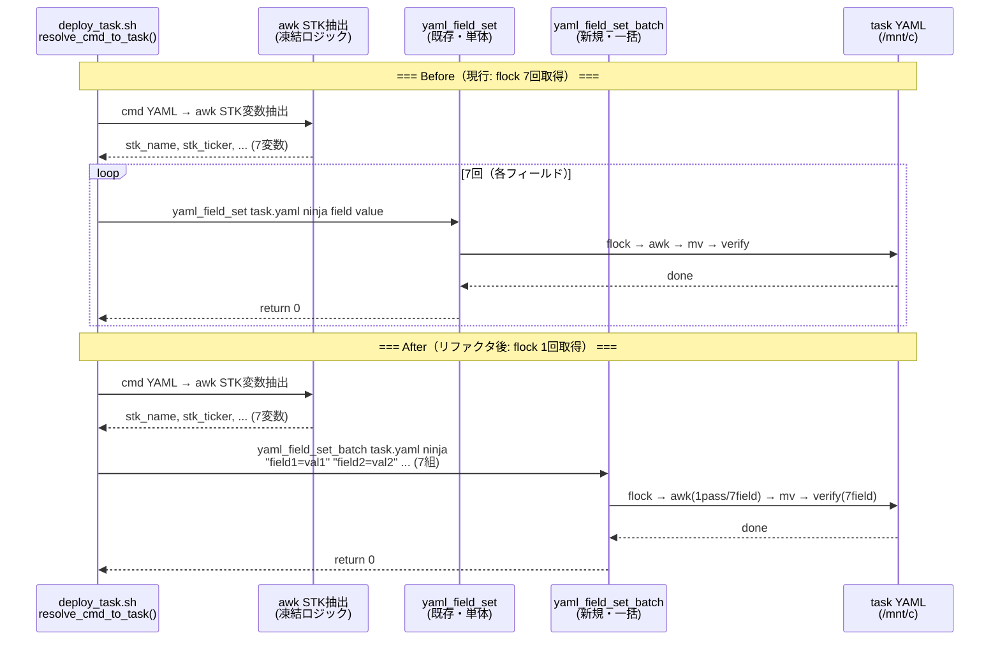
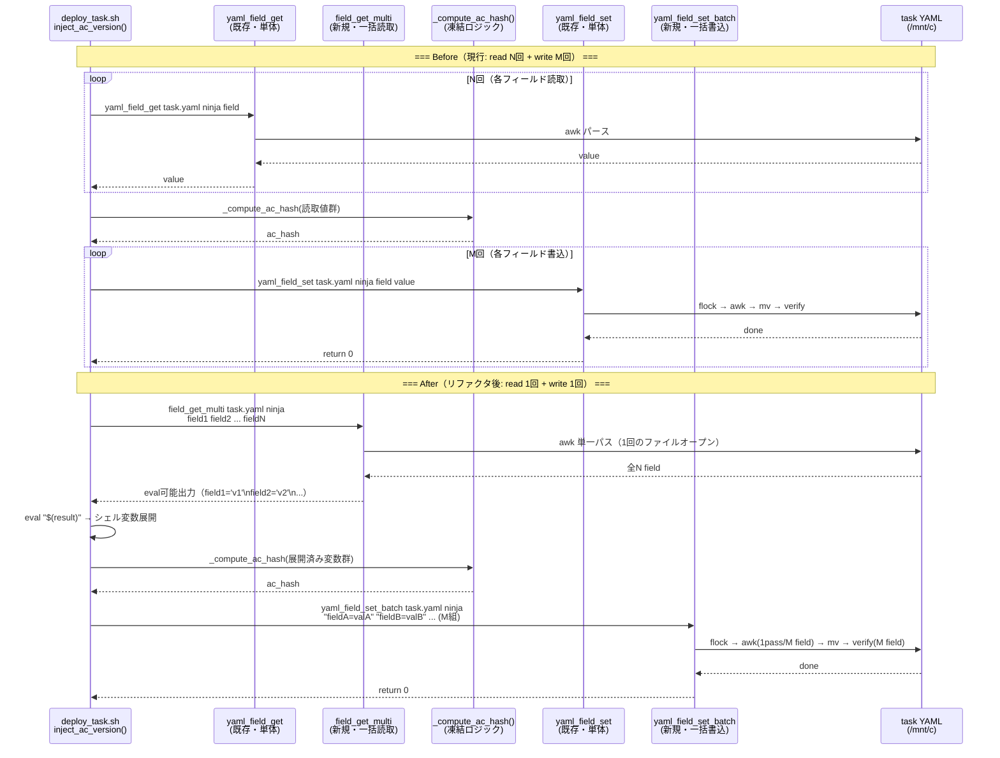
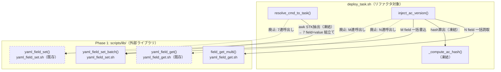

---
codd:
  node_id: detailed:refactor-sequence
  type: design
  depends_on:
  - id: detailed:batch-write-flow
    relation: depends_on
    semantic: technical
  - id: detailed:batch-read-flow
    relation: depends_on
    semantic: technical
  depended_by:
  - id: test:test-strategy
    relation: depends_on
    semantic: technical
  - id: plan:implementation-plan
    relation: depends_on
    semantic: technical
  conventions:
  - targets:
    - module:deploy_task
    reason: 'resolve_cmd_to_task: 既存のawk STK変数抽出ロジックは変更禁止。その後のyaml_field_set 7連→yaml_field_set_batch
      1回への置換のみ。'
  - targets:
    - module:deploy_task
    reason: 'inject_ac_version: _compute_ac_hashロジックは変更禁止。field_get群→field_get_multi、yaml_field_set群→yaml_field_set_batchへの置換のみ。'
  modules:
  - deploy_task
---

# Detailed Design — Refactored Function Sequences (Mermaid)

## 1. Overview

本設計書は `scripts/deploy_task.sh`（`module:deploy_task`）内の2関数 `resolve_cmd_to_task` と `inject_ac_version` を、`yaml_field_set_batch`（batch write）と `field_get_multi`（batch read）を用いてリファクタリングする際の関数呼出しシーケンスを定義する。

**リファクタリングの範囲と凍結境界**:

| 関数 | 凍結ロジック（変更禁止） | 置換対象 |
|------|------------------------|---------|
| `resolve_cmd_to_task` | 既存の awk による STK 変数抽出ロジック全体 | `yaml_field_set` 7連続呼出し → `yaml_field_set_batch` 1回 |
| `inject_ac_version` | `_compute_ac_hash` ロジック全体 | `yaml_field_get` 群 → `field_get_multi`、`yaml_field_set` 群 → `yaml_field_set_batch` |

両関数とも、既存のデータ取得・計算ロジックには一切手を加えず、I/O 層（YAML読み書き）のみを batch API に置換する。これにより flock 取得回数を最小化し、deploy 処理中のロック競合リスクを低減する。

**Convention 準拠（release-blocking）**:

- **Convention: resolve_cmd_to_task の awk STK 抽出ロジック変更禁止** — awk による STK 変数（`stk_name`, `stk_ticker`, `stk_sector` 等）の抽出は現行コードをそのまま維持する。リファクタリング対象は抽出後の YAML 書込み部分のみである。
- **Convention: inject_ac_version の \_compute\_ac\_hash ロジック変更禁止** — AC ハッシュの算出ロジック（ファイル内容の sha256sum → 短縮ハッシュ生成）は現行コードを維持する。リファクタリング対象は前段の field_get 群と後段の field_set 群のみである。
- **batch_write_flow Convention 1: flock→awk→mv→verify 不変順序** — `yaml_field_set_batch` 内部で遵守。deploy_task 側で flock を直接取得することは禁止。
- **batch_write_flow Convention 2: value 内の = エスケープ** — `yaml_field_set_batch` の引数パースで `${arg%%=*}` / `${arg#*=}` を使用し、value 内の `=` を保持する。deploy_task の引数組立て時もこの形式に従う。
- **batch_read_flow Convention: eval 可能な field=value 出力 + null 挙動維持** — `field_get_multi` の出力は eval 可能な `field='value'` 改行区切り。フィールド未存在時は空文字列を返し、エラー終了しない。

## 2. Mermaid Diagrams

### 2.1 resolve_cmd_to_task リファクタリング前後シーケンス



**所有権と凍結境界**: awk STK 抽出（`AWK` 参加者）は `resolve_cmd_to_task` 内のインラインコードであり、変数名・パターンマッチ・出力形式のいずれも変更禁止である。リファクタリングは awk 抽出後の「7回の `yaml_field_set` 呼出し」を「1回の `yaml_field_set_batch` 呼出し」に置換するだけであり、awk 抽出と batch 書込みの間のデータフロー（シェル変数経由）は現行と同一である。

`yaml_field_set_batch` は `scripts/lib/yaml_field_set.sh` の単一所有であり、`deploy_task.sh` 側で flock や awk を直接操作することは禁止される（batch_write_flow §3.1 の再実装禁止ルール）。

### 2.2 inject_ac_version リファクタリング前後シーケンス



**凍結境界の詳細**: `_compute_ac_hash` は入力としてシェル変数群を受け取り、ac_hash 文字列を返す純粋関数である。リファクタリング前後で入力変数の名前と値は同一であるため、ハッシュ算出結果に差異は生じない。`field_get_multi` の eval 展開により変数が現在のスコープに定義される点は、従来の個別 `yaml_field_get` + 変数代入と等価である（batch_read_flow §4.5 の移行パターン参照）。

### 2.3 deploy_task 内の関数呼出し依存関係



**移行の方向性**: 破線は廃止される呼出しパスを示す。既存の `yaml_field_get` / `yaml_field_set` 関数自体は削除しない（他の呼出し元が存在するため）。`deploy_task.sh` 内の2関数のみが batch API に移行する。

### 2.4 flock 競合回避の効果（resolve_cmd_to_task）

```mermaid
gantt
    title resolve_cmd_to_task の flock 取得パターン比較
    dateFormat X
    axisFormat %s秒

    section Before（7回ロック）
    flock#1+awk+mv+verify :b1, 0, 1
    flock#2+awk+mv+verify :b2, after b1, 1
    flock#3+awk+mv+verify :b3, after b2, 1
    flock#4+awk+mv+verify :b4, after b3, 1
    flock#5+awk+mv+verify :b5, after b4, 1
    flock#6+awk+mv+verify :b6, after b5, 1
    flock#7+awk+mv+verify :b7, after b6, 1

    section After（1回ロック）
    flock+awk(7field)+mv+verify(7) :a1, 0, 3
```



**実装上の帰結**: Before パターンでは7回のロック取得・解放が発生し、各ロック間に他プロセス（ninja_monitor の state_io 等）が割り込む可能性がある。割り込みにより部分的に書込まれたタスク YAML を他プロセスが読み取る中間状態が生じうる。After パターンでは1回のロック内で7フィールドが atomic に書き込まれるため、中間状態は発生しない。

## 3. Ownership Boundaries

### 3.1 モジュール所有権マトリクス

| コンポーネント | 所有ファイル | 責務 | 凍結/変更 |
|--------------|-------------|------|----------|
| `resolve_cmd_to_task()` | `scripts/deploy_task.sh` | cmd YAML → task YAML 変換。STK 抽出 + フィールド書込み | awk STK 抽出 = **凍結**。yaml_field_set 呼出し部 = **batch 置換** |
| `inject_ac_version()` | `scripts/deploy_task.sh` | AC 定義読取 + ハッシュ算出 + バージョン情報書込み | `_compute_ac_hash` = **凍結**。field_get/set 呼出し部 = **batch 置換** |
| `_compute_ac_hash()` | `scripts/deploy_task.sh` | AC コンテンツからの sha256 短縮ハッシュ生成 | **全体凍結**。入出力インターフェースも変更禁止 |
| `yaml_field_set_batch()` | `scripts/lib/yaml_field_set.sh` | 複数フィールド一括書込み（flock→awk→mv→verify） | 新規追加。batch_write_flow.md が正式仕様 |
| `field_get_multi()` | `scripts/lib/yaml_field_get.sh` | 複数フィールド一括読取（eval 可能出力） | 新規追加。batch_read_flow.md が正式仕様 |

### 3.2 凍結ロジックの境界定義

**resolve_cmd_to_task の凍結範囲**:

```
# === 凍結開始 ===
# awk による STK 変数抽出（cmd YAML → シェル変数）
local stk_name stk_ticker stk_sector ...
eval "$(awk '...' "$cmd_file")"    # この awk スクリプト全体が凍結
# === 凍結終了 ===

# === 置換対象開始 ===
# Before: yaml_field_set × 7
# After:  yaml_field_set_batch × 1
yaml_field_set_batch "$task_file" "$ninja" \
    "stk_name=$stk_name" \
    "stk_ticker=$stk_ticker" \
    "stk_sector=$stk_sector" \
    ...                            # 7フィールド一括
# === 置換対象終了 ===
```

**inject_ac_version の凍結範囲**:

```
# === 置換対象（読取り）開始 ===
# Before: yaml_field_get × N
# After:  field_get_multi × 1
local ac_file ac_content ac_label ...
eval "$(field_get_multi "$task_file" "$ninja" ac_file ac_content ac_label ...)"
# === 置換対象（読取り）終了 ===

# === 凍結開始 ===
local ac_hash
ac_hash=$(_compute_ac_hash "$ac_file" "$ac_content" ...)    # 全体凍結
# === 凍結終了 ===

# === 置換対象（書込み）開始 ===
# Before: yaml_field_set × M
# After:  yaml_field_set_batch × 1
yaml_field_set_batch "$task_file" "$ninja" \
    "ac_hash=$ac_hash" \
    "ac_version=$ac_version" \
    ...
# === 置換対象（書込み）終了 ===
```

### 3.3 再実装禁止ルール

`deploy_task.sh` 内で以下を行うことを禁止する:

1. **flock の直接取得** — YAML ファイルへのロック取得は `yaml_field_set_batch` 内部でのみ行う
2. **awk による YAML 直接編集** — フィールド値の更新は `yaml_field_set_batch` 経由のみ
3. **grep/sed による YAML フィールド読取** — フィールド値の取得は `field_get_multi` または `yaml_field_get` 経由のみ
4. **`_compute_ac_hash` の代替実装** — ハッシュ算出ロジックの変更・改良・最適化は本リファクタリングのスコープ外

### 3.4 Source Chain 上の依存関係

batch_write_flow §3.2 および batch_read_flow §2.3 で定義された Phase 1/Phase 2 の source 順序により:

```
Phase 1: scripts/lib/yaml_field_get.sh  (field_get_multi)
         scripts/lib/yaml_field_set.sh  (yaml_field_set_batch)
↓ source 完了後
scripts/deploy_task.sh  (resolve_cmd_to_task, inject_ac_version)
```

`deploy_task.sh` は Phase 1 ライブラリを source 済みの環境で実行されるため、batch API の呼出しは常に安全である。`deploy_task.sh` 自体は monitor の source チェーンには属さず、家老が直接実行するスクリプトである。

## 4. Implementation Implications

### 4.1 resolve_cmd_to_task の引数組立て

awk STK 抽出後の7変数を `yaml_field_set_batch` の引数に組立てる。Convention 2（value 内 `=` 保持）への準拠のため、変数値に `=` が含まれうるフィールド（URL、式等）も安全に渡される。

```bash
# STK 抽出（凍結ロジック — 変更禁止）
local stk_name stk_ticker stk_sector stk_market stk_status stk_assigned stk_project
eval "$(awk '...' "$cmd_file")"

# batch 書込み（置換部分）
yaml_field_set_batch "$task_file" "$ninja" \
    "stk_name=$stk_name" \
    "stk_ticker=$stk_ticker" \
    "stk_sector=$stk_sector" \
    "stk_market=$stk_market" \
    "stk_status=$stk_status" \
    "stk_assigned=$stk_assigned" \
    "stk_project=$stk_project"
```

`yaml_field_set_batch` 内部で `${arg%%=*}` / `${arg#*=}` によりフィールド名と値を分離するため、`stk_name` の値に `=` が含まれても正しくパースされる（batch_write_flow §4.1）。

### 4.2 inject_ac_version の read→compute→write パイプライン

`inject_ac_version` のリファクタリングは3段パイプライン（read → compute → write）の read と write を batch 化する。compute（`_compute_ac_hash`）は凍結のため、パイプラインの中間段階として変更なく機能する。

**read 段階の移行**:

```bash
# Before: 個別読取り
local ac_file ac_content ac_label ac_type ac_tags
ac_file=$(yaml_field_get "$task_file" "$ninja" "ac_file")
ac_content=$(yaml_field_get "$task_file" "$ninja" "ac_content")
ac_label=$(yaml_field_get "$task_file" "$ninja" "ac_label")
ac_type=$(yaml_field_get "$task_file" "$ninja" "ac_type")
ac_tags=$(yaml_field_get "$task_file" "$ninja" "ac_tags")

# After: 一括読取り
local ac_file ac_content ac_label ac_type ac_tags
eval "$(field_get_multi "$task_file" "$ninja" ac_file ac_content ac_label ac_type ac_tags)"
```

`field_get_multi` の null 挙動維持（batch_read_flow Convention）により、フィールドが存在しない場合は空文字列が変数に設定される。これは従来の `yaml_field_get` の挙動と一致するため、`_compute_ac_hash` への入力に差異は生じない。

**write 段階の移行**:

```bash
# Before: 個別書込み
yaml_field_set "$task_file" "$ninja" "ac_hash" "$ac_hash"
yaml_field_set "$task_file" "$ninja" "ac_version" "$ac_version"
yaml_field_set "$task_file" "$ninja" "ac_timestamp" "$ac_timestamp"

# After: 一括書込み
yaml_field_set_batch "$task_file" "$ninja" \
    "ac_hash=$ac_hash" \
    "ac_version=$ac_version" \
    "ac_timestamp=$ac_timestamp"
```

### 4.3 flock 取得回数の削減効果

| 関数 | Before（flock 回数） | After（flock 回数） | 削減率 |
|------|---------------------|---------------------|--------|
| `resolve_cmd_to_task` | 7（write × 7） | 1（batch write × 1） | 86% |
| `inject_ac_version` | N + M（read 0 + write M） | 1（batch write × 1） | M → 1 |
| **合計（1回の deploy）** | 7 + M | 2 | 最大 80%+ |

`field_get_multi` は flock を取得しない（読取り専用のため排他ロック不要）。従って flock 回数の削減は write 側の batch 化のみに起因する。

### 4.4 エラーハンドリングの変更点

リファクタリングにより、エラーの粒度が「1フィールド単位」から「全フィールド一括」に変わる。

| 障害シナリオ | Before の挙動 | After の挙動 |
|-------------|-------------|-------------|
| 7フィールド中3番目で flock タイムアウト | 1-2番目は書込み済み、3-7番目は未書込み（部分書込み） | 全7フィールドが未書込み（atomic） |
| verify で1フィールドの値不一致 | 不一致フィールド以降は未書込み | 全フィールド書込み済み、verify が不一致を報告 |

After パターンでは flock タイムアウト時にタスク YAML が部分更新される中間状態が発生しないため、データ整合性が向上する。

### 4.5 テスト戦略

| テスト種別 | 検証内容 | 件数 |
|-----------|---------|------|
| 回帰: `resolve_cmd_to_task` | 7フィールドの書込み結果が Before/After で完全一致 | 既存テスト全 PASS |
| 回帰: `inject_ac_version` | `_compute_ac_hash` の出力が Before/After で同一 ac_hash | 既存テスト全 PASS |
| 新規: batch 引数組立て | STK 変数に特殊文字（`=`, 空白, クォート）を含むケース | 4件 |
| 新規: field_get_multi eval 展開 | eval 後の変数値が個別 field_get と一致 | 6件（null 挙動 6 ケース含む） |
| 新規: atomic 書込み | flock タイムアウト時に部分書込みが発生しないことの確認 | 2件 |

### 4.6 Convention 準拠の検証方法

| Convention | 検証方法 |
|-----------|---------|
| resolve_cmd_to_task: awk STK 抽出ロジック変更禁止 | diff で awk ブロックが変更されていないことを CI で検証。`git diff` の対象行範囲を凍結コメント（`# FROZEN:`）で明示 |
| inject_ac_version: \_compute\_ac\_hash 変更禁止 | 同上。`_compute_ac_hash` 関数全体を凍結コメントで囲む |
| batch_write_flow Convention 1: flock→awk→mv→verify 不変順序 | `yaml_field_set_batch` の単体テストでステップ順序を検証（batch_write_flow §4.7） |
| batch_write_flow Convention 2: value 内 = 保持 | STK 変数に `=` を含むテストケースで batch 書込み→読み戻しの一致を検証 |
| batch_read_flow Convention: null 挙動維持 | batch_read_flow §4.2 の6ケースを `inject_ac_version` の文脈で再テスト |

## 5. Open Questions

| # | 質問 | 影響範囲 | 暫定方針 |
|---|------|---------|---------|
| OQ-R1 | `resolve_cmd_to_task` の awk STK 抽出が出力する変数名の正確なリスト（7個と推定だが、cmd フォーマットの拡張により増減の可能性がある） | `yaml_field_set_batch` に渡すフィールド数の確定 | 現行コードの awk スクリプトを精査し、出力変数名を全列挙する。列挙結果を凍結コメントに記載して以降の変更を検知可能にする |
| OQ-R2 | `inject_ac_version` が `field_get_multi` で一括取得すべきフィールドの正確なリスト。`_compute_ac_hash` の入力引数から逆算する必要がある | read 段階の batch 化で漏れが生じないための前提条件 | `_compute_ac_hash` の関数シグネチャと呼出し箇所を精査し、必要フィールドを全列挙する。`field_get_multi` の引数リストはこの列挙結果に一致させる |
| OQ-R3 | `resolve_cmd_to_task` と `inject_ac_version` が同一の task YAML を逐次更新する場合、2回の `yaml_field_set_batch` 呼出しの間に他プロセスが割り込む可能性があるか | deploy 全体の atomic 性保証 | 2関数は `deploy_task.sh` 内で逐次実行され、各 batch 呼出し内で flock を取得・解放する。2呼出し間の割り込みは理論上可能だが、deploy は家老が単体で実行するため実運用上の競合リスクは低い。将来的に2関数を1回の `yaml_field_set_batch` に統合する選択肢は残す |
| OQ-R4 | `_compute_ac_hash` への入力変数を `field_get_multi` の eval で展開した場合、変数スコープ（local vs global）が従来と同一であることの保証 | ハッシュ算出結果の一致性 | batch_read_flow §4.5 の移行パターンに従い、`eval` の前に `local` 宣言を行う。これにより従来の個別 `yaml_field_get` + `local` 代入と同一スコープが保証される |
