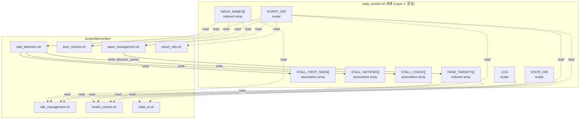
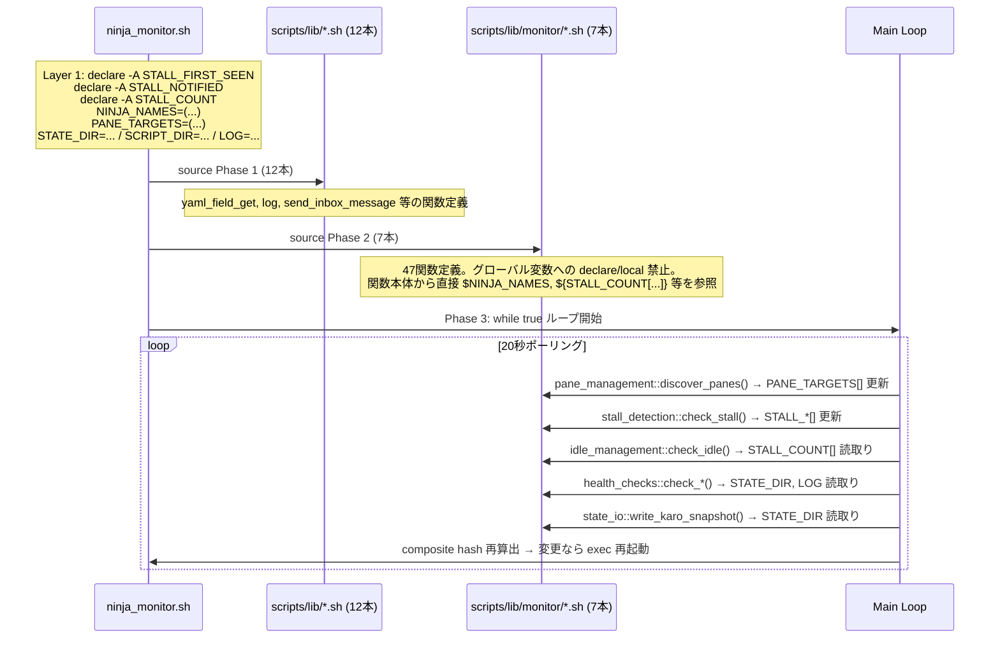
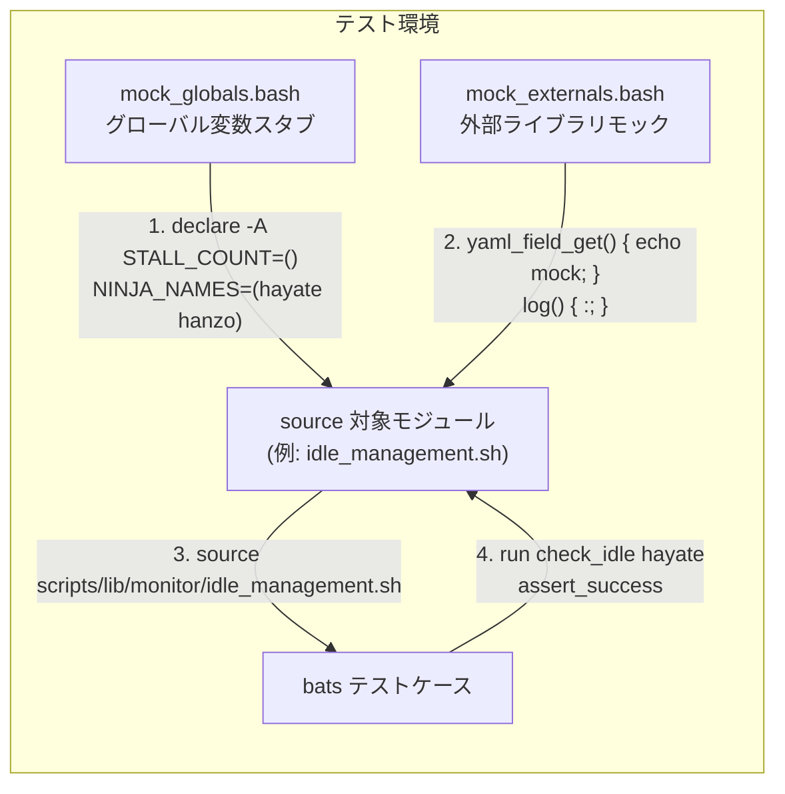

---
codd:
  node_id: detailed_design:shared-state-model
  type: design
  depends_on:
  - id: design:system-design
    relation: depends_on
    semantic: technical
  depended_by:
  - id: plan:implementation-plan
    relation: depends_on
    semantic: technical
  conventions:
  - targets:
    - module:idle_management
    - module:stall_detection
    - module:health_checks
    - module:karo_monitor
    - module:pane_management
    - module:report_utils
    - module:state_io
    reason: 'FR-3: All modules share global variables (NINJA_NAMES[], PANE_TARGETS[],
      STATE_DIR, etc.) and associative arrays (STALL_FIRST_SEEN[], etc.). No module
      may declare its own copy or shadow shared state.'
  modules:
  - ninja_monitor
  - idle_management
  - stall_detection
  - health_checks
  - karo_monitor
  - pane_management
  - report_utils
  - state_io
---

# Shared State Access Model

## 1. Overview

ninja_monitor.sh の7モジュール分割（`scripts/lib/monitor/` 配下）において、全モジュールが単一bash プロセス内の共有名前空間でグローバル変数・連想配列にアクセスする。本設計書は、どの変数がどのモジュールから読み書きされるか、宣言の一元管理ルール、シャドウイング防止の具体的制御、およびテスト時のモック戦略を定義する。

**FR-3 準拠（release-blocking）**: `idle_management.sh`, `stall_detection.sh`, `health_checks.sh`, `karo_monitor.sh`, `pane_management.sh`, `report_utils.sh`, `state_io.sh` の7モジュールは、グローバル変数 `NINJA_NAMES[]`, `PANE_TARGETS[]`, `STATE_DIR` 等および連想配列 `STALL_FIRST_SEEN[]`, `STALL_NOTIFIED[]`, `STALL_COUNT[]` 等を共有する。いかなるモジュールも自身のコピーを宣言したり、`local` や `declare` でシャドウしたりしてはならない。宣言は `ninja_monitor.sh` 本体 Layer 1（グローバル変数宣言ブロック、約150行）のみに存在し、モジュールは参照・更新のみを行う。

### 1.1 共有状態カタログ

本カタログは `ninja_monitor.sh` 本体 Layer 1 で宣言される全共有変数の完全なリストである。

| 変数名 | bash型 | 初期化場所 | 書込みモジュール | 読取りモジュール | 用途 |
|--------|--------|-----------|----------------|----------------|------|
| `NINJA_NAMES[]` | indexed array | dispatcher（起動時） | dispatcher（初期化のみ） | idle_management, stall_detection, pane_management, karo_monitor | 忍者名のマスターリスト。ループイテレーションの基盤 |
| `PANE_TARGETS[]` | indexed array | dispatcher（起動時） | pane_management（`discover_panes` で更新） | idle_management, health_checks | tmuxペインID→エージェントのマッピング |
| `STALL_FIRST_SEEN[]` | associative array | dispatcher（`declare -A`） | stall_detection | stall_detection | stall初回検知タイムスタンプ。キー=忍者名 |
| `STALL_NOTIFIED[]` | associative array | dispatcher（`declare -A`） | stall_detection | stall_detection | stall通知済みフラグ。二重通知防止 |
| `STALL_COUNT[]` | associative array | dispatcher（`declare -A`） | stall_detection | idle_management | stall累積カウント。idle判定の入力 |
| `STATE_DIR` | scalar | dispatcher（起動時） | dispatcher（初期化のみ） | state_io, health_checks | 状態ファイル格納ディレクトリパス（`/home/simokitafresh/multi-agent-shogun/queue/state/` 等） |
| `SCRIPT_DIR` | scalar | dispatcher（起動時） | dispatcher（初期化のみ） | 全7モジュール | スクリプトルートパス。相対パス解決の基点 |
| `LOG` | scalar | dispatcher（起動時） | dispatcher（初期化のみ） | health_checks | ログファイルパス |
| `POLL_INTERVAL` | scalar (=20) | dispatcher（起動時） | dispatcher（初期化のみ） | dispatcher（主ループ sleep） | ポーリング間隔秒数 |
| `COMPOSITE_HASH` | scalar | dispatcher（起動時算出） | dispatcher（毎サイクル再算出） | dispatcher（変更比較） | 自動再起動用。8ファイルの結合sha256sum |

### 1.2 アクセスパターン分類

共有状態へのアクセスは以下の3パターンに分類される。

1. **Init-Once / Read-Many（IORM）**: `NINJA_NAMES[]`, `STATE_DIR`, `SCRIPT_DIR`, `LOG`, `POLL_INTERVAL` — dispatcher が起動時に1回だけ書き込み、以降は全モジュールが読取り専用でアクセスする。最も安全なパターン。
2. **Single-Writer / Multi-Reader（SWMR）**: `PANE_TARGETS[]`（writer: pane_management）, `STALL_COUNT[]`（writer: stall_detection, reader: idle_management）— 書込み権限は1モジュールに限定。読取りは複数モジュールから行われる。
3. **Single-Writer / Single-Reader（SWSR）**: `STALL_FIRST_SEEN[]`, `STALL_NOTIFIED[]` — stall_detection のみが読み書きする。事実上モジュールローカルだが、FR-3 により宣言は dispatcher に置く。

## 2. Mermaid Diagrams

### 2.1 共有状態のオーナーシップとアクセスフロー



**オーナーシップの読み方**: 実線矢印（`-->`）は書込み権限を示す。点線矢印（`-.->`）は読取り専用アクセスを示す。全変数の `declare` / 初期値代入は `ninja_monitor.sh` 本体 Layer 1 のみに存在する。モジュール内での `declare`, `local`, `typeset` による同名変数の再宣言は FR-3 違反である。

`PANE_TARGETS[]` は SWMR パターンの代表例であり、`pane_management.sh` の `discover_panes` 関数が20秒ポーリングサイクルごとに更新し、`idle_management.sh` と `health_checks.sh` がペインID参照のために読み取る。書込み権限を `pane_management.sh` に限定することで、ペイン探索ロジックの分散を防止する。

### 2.2 Source Chain と共有状態ライフサイクル



**ライフサイクルの要点**: グローバル変数は Phase 3（主ループ）開始前に必ず宣言・初期化が完了している。Phase 2 の source 時点ではモジュール内の関数定義のみが実行され、トップレベルの変数操作は発生しない。これにより、source 順序に対する共有状態の依存が排除される。モジュールのトップレベル（関数定義の外）にグローバル変数を読み書きするコードを配置することは禁止する。

### 2.3 テスト時のモック注入フロー



**テスト境界**: `mock_globals.bash` が `ninja_monitor.sh` 本体 Layer 1 の役割を代替する。テスト時も各モジュールは自身でグローバル変数を宣言しないため、`mock_globals.bash` の内容が唯一の共有状態定義となる。これにより、テストフィクスチャとプロダクション間で FR-3 制約が一貫する。

## 3. Ownership Boundaries

### 3.1 宣言オーナーシップ（単一所有権の原則）

| 責務 | 唯一のオーナー | 禁止事項 |
|------|--------------|---------|
| 全グローバル変数の `declare` / 初期値代入 | `ninja_monitor.sh` 本体 Layer 1 | 7モジュールでの `declare`, `declare -A`, `declare -a`, `local`, `typeset` による同名変数の宣言 |
| `PANE_TARGETS[]` への書込み | `pane_management.sh` の `discover_panes` | 他モジュールからの `PANE_TARGETS[key]=value` 代入 |
| `STALL_FIRST_SEEN[]`, `STALL_NOTIFIED[]` への書込み | `stall_detection.sh` | 他モジュールからの代入・unset |
| `STALL_COUNT[]` への書込み | `stall_detection.sh` | 他モジュールからの代入（idle_management は読取りのみ） |
| `NINJA_NAMES[]`, `STATE_DIR`, `SCRIPT_DIR`, `LOG`, `POLL_INTERVAL` への書込み | dispatcher（起動時の初期化のみ） | 全モジュールからの再代入 |
| 外部ライブラリ関数（`yaml_field_get`, `log`, `send_inbox_message` 等）の定義 | `scripts/lib/*.sh`（Phase 1） | 7モジュール内での再定義・上書き |

### 3.2 シャドウイング防止の自動検証

FR-3 はリリースブロッキング制約であり、手動レビューのみに依存しない自動検証を実装する。

**CI 検証スクリプト（bats テスト内で実行）**:

```bash
# 検証1: モジュール内の declare/local/typeset による共有変数シャドウイング検出
SHARED_VARS="NINJA_NAMES|PANE_TARGETS|STALL_FIRST_SEEN|STALL_NOTIFIED|STALL_COUNT|STATE_DIR|SCRIPT_DIR|LOG|POLL_INTERVAL|COMPOSITE_HASH"
for module in scripts/lib/monitor/*.sh; do
  matches=$(grep -nE "^\s*(declare|local|typeset)\s+.*\b($SHARED_VARS)\b" "$module" || true)
  if [[ -n "$matches" ]]; then
    echo "FR-3 VIOLATION in $module: $matches"
    exit 1
  fi
done

# 検証2: 関数の重複定義検出（59関数が厳密に1ファイルに存在）
grep -hE '^\s*function\s+\w+|^\s*\w+\s*\(\)' scripts/ninja_monitor.sh scripts/lib/monitor/*.sh \
  | sed 's/[({].*//' | awk '{print $NF}' | sort | uniq -d | while read -r dup; do
    echo "DUPLICATE FUNCTION: $dup"
    exit 1
  done

# 検証3: モジュールのトップレベル（関数外）でのグローバル変数代入検出
for module in scripts/lib/monitor/*.sh; do
  # 関数定義の外にある代入文を検出（簡易的にインデントなし行を対象）
  awk '/^[a-zA-Z_]+\s*\(\)\s*\{/,/^\}/' "$module" > /tmp/inside_funcs
  grep -nE "^($SHARED_VARS)=" "$module" | while read -r line; do
    echo "TOP-LEVEL ASSIGNMENT in $module: $line"
    exit 1
  done
done
```

### 3.3 モジュール間の関数呼び出し境界

モジュール間で関数を直接呼び出すケースが存在する。bash の共有名前空間により全関数は定義後に名前で呼び出し可能だが、オーナーシップの明確化のため呼び出し関係を記録する。

| 呼出し元モジュール | 呼出し先関数 | 所属モジュール | 備考 |
|------------------|------------|--------------|------|
| idle_management | `can_send_clear_with_report_gate` | report_utils | idle→clear判定時にreport gate確認 |
| idle_management | `check_and_update_done_task` | report_utils | idle確認後のtask状態更新 |
| idle_management | `write_state_file` | state_io | idle状態のファイル永続化 |
| stall_detection | `is_task_deployed` | report_utils | stall検知時のtask配備確認 |
| karo_monitor | `write_state_file` | state_io | 家老状態のファイル永続化 |
| health_checks | `write_state_file` | state_io | 健全性チェック結果の永続化 |

これらの呼び出しは Phase 2 source 完了後にのみ発生する（主ループ内）。source 順序として、被呼出し側（`state_io.sh`, `report_utils.sh`）を先に source することで、万一モジュールのトップレベルで関数参照が発生した場合のリスクを排除する。system_design.md §2.2 で定義された source 順序はこの依存関係を反映している。

### 3.4 テストフィクスチャのオーナーシップ

| ファイル | 責務 | 変更権限 |
|---------|------|---------|
| `tests/e2e/helpers/mock_globals.bash` | 全グローバル変数のスタブ宣言。`ninja_monitor.sh` Layer 1 のミラー | Layer 1 と同期して更新。変数追加時は両方を変更 |
| `tests/e2e/helpers/mock_externals.bash` | `scripts/lib/*.sh` の関数モック定義 | Phase 1 ライブラリの関数シグネチャ変更時に更新 |
| `tests/e2e/helpers/assert_functions.bash` | FR-3 検証ユーティリティ（シャドウイング検出、重複関数検出） | 共有変数カタログ変更時に `SHARED_VARS` パターンを更新 |
| `tests/e2e/helpers/setup_tmpdir.bash` | テスト用一時ディレクトリの作成・破棄 | WSL2 NTFS パス互換性を維持 |

## 4. Implementation Implications

### 4.1 FR-3 の実装への影響

FR-3（共有状態のコピー・シャドウ禁止）は以下の具体的な実装制約を課す。

**モジュール関数内での変数スコープ**:
- 関数内で一時的に使用するローカル変数は `local` で宣言してよい。ただし、変数名が共有変数カタログ（§1.1）のいずれかと一致する場合は `local` 宣言禁止。異なる名前を使用する。
- 例: `local stall_key="..."` は許容される（`STALL_FIRST_SEEN` 等と名前が異なるため）。`local STALL_COUNT=...` は FR-3 違反。

**連想配列のキー操作**:
- 連想配列のキー追加・削除（`unset STALL_FIRST_SEEN[key]`）は書込み権限を持つモジュールのみが行う。
- `${!STALL_FIRST_SEEN[@]}`（キー列挙）は読取り操作であり、任意のモジュールから実行可能。

**新規グローバル変数の追加手順**:
1. `ninja_monitor.sh` 本体 Layer 1 に `declare` / 代入を追加
2. `tests/e2e/helpers/mock_globals.bash` に同一のスタブを追加
3. `tests/e2e/helpers/assert_functions.bash` の `SHARED_VARS` パターンに追加
4. 本設計書 §1.1 共有状態カタログを更新
5. §3.1 オーナーシップ表に書込み・読取りモジュールを記載

### 4.2 Source Chain 違反の防止（NFR-1 連動）

NFR-1（外部ライブラリの後にモジュールを source する）と FR-3 は相互補強の関係にある。

- NFR-1 が守られないと、モジュール関数が未定義の外部ライブラリ関数を呼び、`command not found` で失敗する
- FR-3 が守られないと、モジュール内の `declare -A` がdispatcher の連想配列を空で再初期化し、蓄積データが消失する

両方の違反を検出するため、`full-chain.system.bats` で以下を検証する:
1. source 順序: Phase 1 の最大行番号 < Phase 2 の最小行番号
2. source 完了後の共有変数存在: `declare -p STALL_FIRST_SEEN` が成功すること
3. 47関数全ての `type -t` が `function` を返すこと

### 4.3 Auto-Restart 時の共有状態リセット

composite hash 変更検知による `exec` 再起動時、プロセスが完全に置き換わるため全共有状態はゼロから再初期化される。

**影響を受ける状態と復元方針**:

| 変数 | exec 後の状態 | 復元方法 |
|------|-------------|---------|
| `NINJA_NAMES[]` | 再宣言（起動時ロジック） | 設定ファイルから再読込。データロスなし |
| `PANE_TARGETS[]` | 空 → 最初のサイクルで `discover_panes` が再構築 | 最大20秒のブランク。許容範囲 |
| `STALL_FIRST_SEEN[]` | 空 | stall タイマーがリセットされる。再起動直後は stall 検知に最大で閾値分の遅延が発生する |
| `STALL_NOTIFIED[]` | 空 | 既に通知済みの stall に対して再通知が発生する可能性がある |
| `STALL_COUNT[]` | 空 → 0 | idle_management の判定が一時的にリセットされる |
| `STATE_DIR`, `SCRIPT_DIR`, `LOG` | 再宣言 | 定数。影響なし |

`STALL_FIRST_SEEN[]` と `STALL_NOTIFIED[]` のリセットは既存動作と同一であり（現行の単一ファイル版でも exec 再起動で同じ影響が発生する）、モジュール分割による追加リスクはない。

### 4.4 WSL2 NTFS における state_io の書込み整合性

`state_io.sh` の `write_state_file` 関数は `STATE_DIR` 配下のファイルに状態を書き込む。WSL2 NTFS 上での動作制約:

- **flock**: NTFS マウント上でも動作する。既存の flock ベースの排他制御を維持する。モジュール分割後も flock の呼び出し元が `state_io.sh` に集約されるため、ロック管理の一貫性が向上する
- **stat ポーリング**: `health_checks.sh` がファイルの mtime を stat で取得してヘルスチェックを行う。inotify は NTFS 上で動作しないため、20秒ポーリングに依存する。この既存制約はモジュール分割で変更されない
- **パス解決**: 全モジュールが `SCRIPT_DIR`（絶対パス）を基点にファイルパスを構築する。モジュール内で `$0` や `BASH_SOURCE[0]` からの相対パス解決を行わない。`SCRIPT_DIR` を唯一の基点とすることで、source 先が `scripts/lib/monitor/` に移動しても影響を受けない

### 4.5 性能への影響

| 計測項目 | 閾値 | FR-3 との関係 |
|---------|------|--------------|
| source 完了時間 | <500ms（既存同等） | 7ファイル追加 source。各ファイルは関数定義のみ（トップレベル実行なし）。実測で数十ms の追加 |
| ポーリングサイクルあたりの共有変数アクセスコスト | 計測不要（bash 変数参照はメモリ内） | グローバル変数の直接参照は bash プロセス内のメモリアクセスであり、関数引数渡しと同等のコスト |
| composite hash 算出 | <100ms/サイクル | 8ファイル（本体+7モジュール）の sha256sum。実測で数ms |

### 4.6 コンベンション準拠サマリ

| コンベンション | 準拠方法 |
|--------------|---------|
| **FR-3**: 全モジュールが共有グローバル変数を使用。コピー・シャドウ禁止 | §1.1 で共有状態カタログを定義。§3.1 で宣言オーナーシップを `ninja_monitor.sh` Layer 1 に限定。§3.2 で CI 自動検証（grep + bats）を実装。§4.1 で関数内ローカル変数の命名制約を規定 |
| **NFR-1**: 外部ライブラリの後にモジュールを source | §2.2 sequence diagram で Phase 1→Phase 2 の厳密順序を図示。§4.2 で NFR-1 と FR-3 の相互補強を説明 |
| **FR-2**: 主ループディスパッチャは ninja_monitor.sh に残留（目標500行） | §1.1 で Layer 1（宣言）は本体に残留と明記。§3.1 で dispatcher の初期化専権を規定 |
| **Constraint**: Auto-restart は全モジュールファイルをカバー | §4.3 で exec 再起動時の共有状態リセットと復元方針を詳述 |

## 5. Open Questions

| # | 質問 | 影響範囲 | 暫定方針 |
|---|------|---------|---------|
| OQ-SS-1 | `STALL_FIRST_SEEN[]` / `STALL_NOTIFIED[]` は stall_detection のみが読み書きする SWSR パターンだが、将来的に他モジュールから参照ニーズが発生した場合、オーナーシップ表の更新手順をどう自動化するか | §3.1 オーナーシップ表の鮮度維持 | 共有状態カタログ（§1.1）と CI 検証スクリプト（§3.2）の `SHARED_VARS` パターンを同期する。変数追加時の4ステップ手順（§4.1）を遵守し、PR レビューでカタログ更新漏れを検出する |
| OQ-SS-2 | モジュール間の関数呼び出し（§3.3）は Phase 2 source 順序に暗黙依存する。モジュール追加時に依存グラフの循環が発生した場合の検出方法 | source chain の安定性 | 現在の7モジュール間に循環依存は存在しない（§3.3 の呼び出し表は DAG を形成）。モジュール追加時は `full-chain.system.bats` で全関数の `type -t` 検証を行い、source 順序エラーを検出する。循環が疑われる場合は関数を dispatcher に引き上げる |
| OQ-SS-3 | `mock_globals.bash` と `ninja_monitor.sh` Layer 1 の同期が手動である。宣言の乖離が発生した場合、テストが本番と異なる共有状態で実行される | テストの信頼性 | `full-chain.system.bats` のシステム統合テストが本番同等の source chain（mock なし）で59関数全ての呼び出し可能性を検証するため、乖離があればシステム統合テストで検出される。追加対策として、Layer 1 の `declare` 文と `mock_globals.bash` の `declare` 文を diff する CI ステップを実装する |
| OQ-SS-4 | system_design.md OQ-2 に関連: Phase 2 内部の source 順序は §3.3 の呼び出し関係から `state_io → report_utils → pane_management → idle_management → stall_detection → health_checks → karo_monitor` が妥当だが、抽出作業中の実際の call graph 確認で変更される可能性がある | モジュール間関数呼び出しの確実性 | 暫定順序を system_design.md §2.2 の通りとし、抽出作業中に `grep` で実際の cross-module call を全列挙して確定する。順序変更が必要な場合は本設計書 §3.3 と §2.2 sequence diagram を同時更新する |
