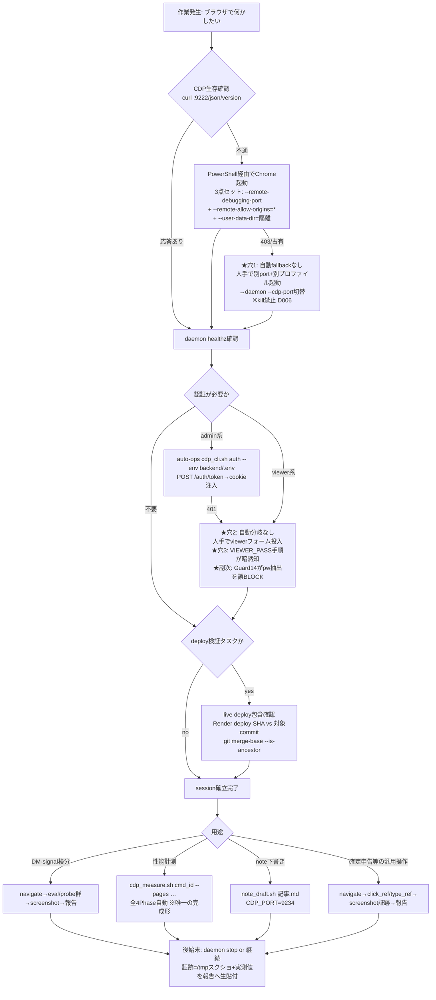
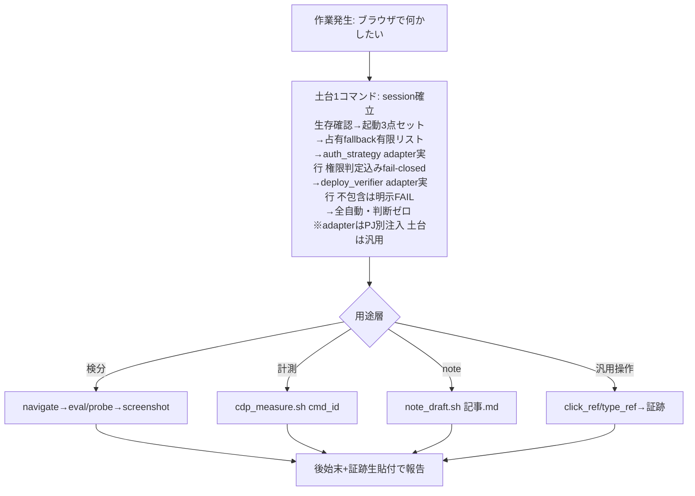

<!-- gist-master: 2b1c6268f865cb9b83cf5835a722c074 cdp-skill-flow-inventory-20260802.md -->
# CDP能力 AsIs/ToBe 5W1H設計書 v2.7 【CLOSED — T5検収 12/12 全PASS・工程1-4全GATE CLEAR】

作成: 2026-08-02 将軍 / **v2.4: 2026-08-04 01:30 工程2/3/4全GATE CLEARを反映(2=cmd_karo_cdp_phase2_ledger 8/2 19:58 CLEAR・3=cmd_karo_cdp_phase3_consumers 19:59 CLEAR(家老RC blt_194604→再提出LGTM)・4=cmd_karo_cdp_phase4_skill 20:15 CLEAR。T5系追加検収: endpoint_qualification 20:32 CLEAR / auth_dom_probe 20:39 FAIL受理=AC4 contract再実行未完走)。未クローズ理由=殿下知8/2 19:30『§T5検収AC12本を実走で全件判定』が未実施+auth_dom_probe FAIL 1件残存。8/2 20時以降は月次リターン障害対応でレーン凍結** / v2.3: 19:30 工程1全完了を反映(1a=cmd_4217契約schema・1b=cmd_4218 transport/session土台・1c=cmd_4219 auth/deploy_verifier adapter、全て同日GATE CLEAR)。未クローズ — 工程2(台帳修復・並行可)/3(consumer移行・依存1b-1c解消済みで着手可能)/4(スキル書換え・3依存)が未起票のため。工程4完了で本書CLOSED** / v2.2: 11:26 家老RC反映(adapter分離・権限非同値・AC6件追加・工程順序是正。blt_112450) / v2.1: 11:21 殿指摘「粒度が雑」→v1.1全詳細を情報量維持で再収載+軍師指摘反映(blt_112103 APPROVE) / v2.0: 11:16 AsIs/ToBe 5W1H形式へ転換 / v1.1: 11:08 構造ツリー+フローチャート追加 / v1.0: 10:53 全景inventory

> レビュー状態: 軍師=APPROVE(指摘2点反映済み) / 家老=RC→本v2.2で全指摘反映(独立性担保: 家老は軍師報告を参照せず現物査読。査読中のv2.1更新でT5-6に軍師指摘が混入した箇所は家老が独立根拠から除外して判定)

> **§0 CDPの本質(殿定義 2026-08-02 11:06・本設計の公理)**: CDPの本質は**PowerShellの操作**である。WSL2にGUIブラウザはなく、powershell.exe(WSL相互運用)でWindows側Chromeを起動しCDPポートを橋として操作することで、**LLMがブラウザを人間と同じように操作できる**。∴用途は本質的に無制限 — 確定申告の作業・noteの下書き・DM-signalの確認は全て同一能力の応用であり、DM-signal検分ツールと捉えるのは矮小化。土台の核=PowerShell経由のWindows側Chromeプロセス制御の確実性。そこが確実なら用途層は人間の手順の写像にすぎない。(knowledge:1e63577148dc2217)

## §META — 5W1H

| 項 | 内容 |
|---|---|
| WHY | 殿診断(10:50)が実証された: スキル品質が低く(4経路併記で単一契約でなく完走不能)、利用が強制されず(推薦発火0/4・直操作WARN阻止0/3)、教訓埋込みは意志依存で無効(LS098が存在したのに行動を変えなかった)。本日の実損=compare summary検分でスキル不使用の試行錯誤3回(9222素起動→403→D006接触→9223別port)+殿の指摘2回(「CDPはスキルを使う」「守れているか」)を要した |
| WHAT | CDP能力を「土台層(session確立)の一本化+用途層(薄い写像)」の二層へ再構成し、使うのが最も楽な唯一の道=自覚なき構造型強制にする |
| WHO | 設計=将軍(本書)。レビュー=家老・軍師の独立2系統(相互参照禁止)。実装=忍者(家老配備)。利用=全ロール |
| WHEN | 本書レビュー通過後、§工程表の順に1道具1CMDで起票 |
| WHERE | 正典=auto-ops(殿裁定11:01「本来はauto-opsが正しいやり方」)。本陣repoはprobe群(測定器)とスキル定義のみ残す |
| HOW | 新規開発でなく既存への一本化(速度3原則「既に存在するものより速いものはない」)。cdp_measure.shの型=全工程ワンコマンド・判断依存ゼロ(cmd_2268/cmd_2271事故の根因対処としてヘッダに設計意図が明記されている)を土台層へ写像 |

---

## §AsIs(2026-08-02実測 — 全て本日の一次証跡)

### A1. 資産の全景

| 層 | 実体 | 役割 | 所在 | 問題 |
|---|---|---|---|---|
| **スキル(入口)** | `/cdp-browse` — **CDP専用スキルはこの1本のみ** | ブラウザ起動・認証・遷移・スクショ・画面確認の標準フロー定義 | `skills/cdp-browse/SKILL.md` | 4経路併記(Python preflight/repo cdp_cli/auto-ops auth/直接WS)で「読めば完走する単一契約ではない」(家老調査) |
| 実行系A(本陣repo) | cdp daemon = `cdp_cli.sh`+`cdp_server.py` | navigate/eval/screenshot/snapshot/click/type等のCLI。daemonが接続を永続化 | `scripts/cdp/` | ensure_serverがChrome隔離起動・既存port不整合回復をせず、起動回復も認証も持たない不完全実装 |
| 実行系A(probe群) | `cdp_font_probe.py` `cdp_ed_probe.py` `cdp_card_probe.py` `cdp_tier_probe.py` `cdp_contrast_probe.py` `cdp_maxdisplay_probe.py` `cdp_benchmark.py`等 | UI検分の専用測定器(getComputedStyle/rect全数走査) | `scripts/cdp/` | 各probeが個別にCDP接続を張り土台を独自に半端に持つ |
| 実行系A(計測) | `cdp_measure.sh` | 性能計測ワンコマンド(詳細=A4) | `scripts/cdp/` | なし(完成形。本設計の型元) |
| 実行系A(note) | `note_draft.sh` | note.com下書き投稿(reCAPTCHA対応・CDP_PORT=9234契約) | `scripts/` | 独自port契約で土台と未統合 |
| 実行系B(auto-ops) | `cdp_cli.sh`(別実装) — start/navigate/eval/**auth**/perf/cleanup | DM-Signal認証(admin token→cookie)と性能測定の正典 | `/mnt/c/Python_app/auto-ops/scripts/cdp/` | 正典なのにスキルの主経路になっていない |
| 実行系B(測定) | `perf_measure.py` | 測定エンジン(cdp_measure.shの委譲先) | auto-ops `workflows/` | なし |
| **本質層** | `cdp_helper.py` — `ps_run()`=PowerShell実行wrapper+`launch_browser()` | WSL2→Windows側Chrome制御の橋(§0公理の実装) | `scripts/cdp/` | 各実装から独自に参照され一元化されていない |
| 言及のみ | karo-direct/lesson-sort/note-writer/sengoku-writer/weekly-report-writerのSKILL.md | 本文中でCDPに言及するだけ。CDP操作スキルではない | skills/ | — |

### A2. ファイル&フォルダー構造(現物)

```
【WSL2側】
/mnt/c/tools/multi-agent-shogun/            … 本陣repo
├── skills/cdp-browse/SKILL.md              … CDP専用スキル(入口定義・唯一の1本)
├── scripts/cdp/
│   ├── cdp_cli.sh                          … daemon薄CLI(navigate/eval/screenshot/snapshot/click/click_ref/type_ref/get_ref_text/healthz/stop)
│   ├── cdp_server.py                       … 常駐daemon(--cdp-portでChrome接続先変更可・token認証・接続情報を/tmp/cdp-server.jsonへ)
│   ├── cdp_helper.py                       … ★本質層: ps_run()=PowerShell実行wrapper+launch_browser(Windows側Chrome起動)+cdp_get(REST)
│   ├── cdp_measure.sh                      … 性能計測ワンコマンド(4Phase自動: A4参照)
│   ├── cdp_font_probe.py / cdp_ed_probe.py / cdp_card_probe.py
│   ├── cdp_tier_probe.py / cdp_contrast_probe.py / cdp_maxdisplay_probe.py
│   │                                       … UI検分の専用測定器群(getComputedStyle/rect全数走査)
│   ├── cdp_benchmark.py / cdp_benchmark.sh … ベンチマーク
│   └── cdp_dashboard_warm_cmd692.py        … dashboard warmup(個別用途)
├── scripts/note_draft.sh                   … note.com下書き投稿(CDP_PORT=9234契約・invisible reCAPTCHA対応)
└── /tmp/cdp-server.json                    … daemon接続情報(port/token/pid)

/mnt/c/Python_app/auto-ops/                 … auto-ops repo(測定・認証の正典)
├── scripts/cdp/cdp_cli.sh                  … 完結形CLI: start(起動内包)/navigate(--wait --screenshot)/eval(--tab --url-pattern)/auth(--env)/perf(--config --profile)/cleanup(--all)
└── workflows/perf_measure.py               … 性能測定エンジン(JSON+MD出力)

【Windows側(PowerShell経由で制御)】
C:\Program Files\Google\Chrome\Application\chrome.exe   … 実体ブラウザ
C:\temp\cdp_isolated_profile*               … 隔離プロファイル(殿の通常Chromeと分離=D009必須)
ポート: 9222(標準)/9223(占有時fallback実績2026-08-02)/9234(note_draft契約)/9400(daemon HTTP)
```

### A3. /cdp-browse の定義フロー(SKILL.md 8手順・現行全文要約)

1. `preflight_cdp_flow`でCDP確認。未応答なら隔離プロファイル自動起動に任せる。手動復旧時はWindows側Chrome/Edgeを隔離プロファイル+`--remote-allow-origins=*`付きで起動(ないとWebSocket接続が403になる。`--user-data-dir`は殿の通常Chromeセッションを汚さないため必須)
2. 認証が必要なサイトなら、対象PJの`projects/{project}.yaml`と`context/{project}.md`から認証方式と認証情報の参照先を確認
3. UIログインが正本のサイトでは`ui_login`を使い、フォーム入力・送信・ログイン後URLまたは画面要素まで確認
4. Cookie注入などPJ専用の認証helperが正本化されている場合はそのPJ contextの手順を優先。**DM-Signalは auto-ops `cdp_cli.sh auth --env <env>` が標準**
5. **修正後の本番検証タスクでは、navigate前にlive deployが対象commitを含むことを一次確認**(実装完了≠本番到達 LS-A09(34))。DM-SignalはRender deploy状態(FE=srv-d4ja8pp5pdvs739a5fsg)のdeploy commit SHAと対象commitの包含関係を`git merge-base --is-ancestor <対象> <deploy SHA>`で照合。未反映のまま画面検証すると旧UIを測って偽陰性/偽陽性になる
6. `navigate`で対象URLへ移動
7. `screenshot`で証跡を保存
8. スクリーンショットまたはAX snapshotを読んで、画面が期待状態かを報告

### A4. cdp_cli.sh と cdp_measure.sh の対比(道具箱と工程まるごと)

| | cdp_cli.sh(2実装) | cdp_measure.sh |
|---|---|---|
| 粒度 | 1操作=1コマンド(組み立ては使う者任せ) | 業務1件まるごと(組み立て済み) |
| 本陣repo版 | daemon経由の汎用操作のみ。「手」だけで起動回復も認証も持たない | — |
| auto-ops版 | start(起動内包)/auth(admin token→cookie)/perf/cleanupまで持つ「手+鍵+片付け」 | — |
| 内部構成 | — | Phase1 preflight(認証確認+CDP接続確認)→Phase2 artifact分離(cmd_id別出力先で上書き不能化)→Phase3 計測実行(auto-ops `perf_measure.py --profile production`へ委譲)→Phase4 baseline自動比較 |
| 判断依存 | 高(順序・認証・出力先を毎回考える) | ゼロ(cmd_id渡すだけ) |
| 出自 | — | cmd_2268事故(artifact競合)・cmd_2271事故(認証不成立)の根因対処。ヘッダに「忍者判断依存→全ステップ自動化」と設計意図明記 |

### A5. 認証の3経路(DM-Signal)

| 経路 | 用途 | 手段 |
|---|---|---|
| admin認証 | admin系ページ・PF管理 | auto-ops `cdp_cli.sh auth --env backend/.env`(POST /auth/token→cookie注入) |
| viewer認証 | 一般閲覧ページ(monthly password) | 画面のViewer Authenticationフォームへ`VIEWER_PASS`(DM-signal backend/.env)を入力。valueセッターdescriptor経由+input event dispatchが必要(React制御コンポーネント) |
| Cookie継続 | 既存プロファイル | 隔離プロファイルにcookieが残っていれば再認証不要。**新規プロファイルでは必ず認証壁が出る** |

### A6. ポート・プロファイル運用の現実(2026-08-02実測で確定した前提)

- 標準port=9222。daemon(`cdp_server.py`)は`--cdp-port`で接続先変更可(**cdp_cli.sh経由の起動はデフォルト9222固定** — cli:50が引数なしでserverを起動する)
- Chrome起動フラグは**3点セット必須**: `--remote-debugging-port` + `--remote-allow-origins=*` + `--user-data-dir=<隔離>`(allow-originsなしはWebSocket handshake 403。隔離なしは殿のChromeセッション破壊=D009)
- **同一user-data-dirへの再起動でフラグ変更は効かない**(既存インスタンスへ委譲される)。フラグ誤りのChromeがportを占有した場合、killはD006禁止のため**別port+別プロファイルで並行起動→daemonを`--cdp-port`で切替**が唯一の回復経路(本日9223で実証)
- daemonの正規停止は`cdp_cli.sh stop`(APIエンドポイント経由。killではない)

### A7. 実測欠陥7件(本日10:40-10:52の一次証跡 — 是正対象)

| # | 欠陥 | 実測事象 | 是正方向 |
|---|---|---|---|
| 1 | 手順1の自動起動が9222占有時に機能しない | allow-originsなしChromeが9222を占有→healthz 403のまま復旧経路なし。A6の回復手順(別port+daemon切替)を人手で発見 | 占有検知→別port自動fallbackを土台層へ組込み |
| 2 | auth helperの401時の分岐がない | `auth --env backend/.env`が401。viewer認証への切替手順がスキルに不在 | admin401→viewerフォーム入力の自動fallback |
| 3 | viewer認証の標準手順が未記載 | VIEWER_PASSの所在(backend/.env)とReactフォーム投入手順(A5)が暗黙知 | A5を正式手順として土台層へ内包 |
| 4 | スキル発火が字句依存 | 実文脈4種(「Compare summaryページの横スライド問題を確認」「compare summaryの本番検分」「画面確認」「CDPで確認」)への推薦発火は順に**0,0,0,1**(家老がskill_recommend.shへ実入力して確認)。semantic候補もprompt_state_inject.shでTRIGGER文字列の完全包含を再要求され落ちる | 入口一本化で発火自体を不要化 |
| 5 | 発火してもrecommend止まり | gate_fire_logは10:41:53/10:42:29/10:42:44にcdp_direct_skill_nudge WARNを3回記録。Guard13.5はnon-blockingのため素起動→403→別portを全て通した=**検知3/3・阻止0/3** | 同上 — 使うのが最も楽な唯一の道にする構造型 |
| 6 | 実行入口が自由(役割格差) | 本日の実行証跡=**将軍0件・忍者231件・system名義49件**。推薦15件も全件deploy_task由来で将軍向け0件。忍者はtask YAML+required receiptで半強制、将軍はtask YAMLがなくguard対象外 | 将軍もスキル経由が最短になる入口一本化 |
| 7 | スキル実行台帳が破損 | `skill_execution_log.yaml` L15075の未escape引用符でYAML parse不能。公式の役割別使用率も算出不能 | 台帳修復+役割別率の計測復旧(工程3) |
| — | (副次)Guard14 FP | viewer pw抽出(`grep VIEWER_PASS .env`)をDB credと誤判定しBLOCK | 土台層がcredential受渡しを内包すれば素のgrepが不要になり誤判定経路ごと消える |

### A8. 構造診断(殿診断10:50+家老第三者調査blt_105634)

**三断絶**=「推薦=字句一致」「直操作=非停止WARN」「実行入口=自由」。本人の注意ではなく**使わなくても進める構造**が真因。教訓(LS098=CDP環境依存launch経路)は存在したが今朝の行動を変えなかった=「理解だけでは行動は変わらない」(deepdive Phase 4)の再実証であり、殿の「教訓埋込みは意志依存で効果がない」の数値裏付け。

### A9. 現行の作業時フローチャート(AsIs — 穴の位置を明示)



★穴1-3+副次は全て**土台層(session確立)**で起きている。用途層は道具が揃っており問題は起きていない。

---

## §ToBe(二層一本化 — 自覚なき構造型強制)

### T1. 土台層: session確立の一本化(実装対象の本丸)

1コマンド(auto-ops側=正典に配置)がA9の★穴を全て自動化で内包する。cdp_measure.shの型(判断依存ゼロ)の写像:

| 段 | 内容 | AsIsからの変化 |
|---|---|---|
| 1 | CDP生存確認(対象port自動探索: 9222→9223→…) | 手動curlの廃止 |
| 2 | 未応答ならPowerShell経由Chrome起動(3点セット自動付与) | フラグ付け忘れの構造的消滅 |
| 3 | 占有/403検知→別port+別プロファイル自動fallback→daemon `--cdp-port`自動切替。**fallback候補は有限リスト(例: 9222→9223→9224)とし、全候補占有なら明示FAILで停止**(無限探索・無断kill禁止。軍師指摘反映2026-08-02) | ★穴1の自動化(kill不使用のA6実証手順をコード化)+両port占有時の挙動定義 |
| 4 | 認証: **auth_strategy adapter引数**で注入(家老RC反映: 土台=transport/sessionの汎用正典に保ち、DM-Signal固有のadmin/viewerはadapterとして分離=§0用途無制限と整合)。DM-Signal adapter仕様: admin auth実行→401検知→**要求権限を判定し、viewer権限で足りるページのみ**viewerフォーム自動fallback(VIEWER_PASS読込→React value setter+input dispatch)。**admin専用ページではviewer成功を成功扱いしない(権限非同値。家老RC反映)**。viewer認証も失敗した場合はfail-closed=明示FAILで停止し、未認証のまま検分を続行しない(軍師指摘反映) | ★穴2・3の自動化。credential受渡し内包=Guard14誤判定経路の消滅+認証失敗時fail-closed+権限段階の明示 |
| 5 | (deploy検証フラグ時) **deploy_verifier adapter引数**で注入(家老RC反映: Render包含確認はDM-Signal固有のadapter。他PJは各自のverifierを注入)。DM-Signal adapter仕様: Render API deploy SHA取得→`git merge-base --is-ancestor`照合、不包含なら明示FAILで停止 | 手順5の意志依存を構造化+土台の汎用性維持 |
| 6 | 後始末契約(cleanup: 起動したプロセス・プロファイルの追跡と解放) | auto-ops cleanupの統合 |

### T2. 用途層: 薄い写像(既存道具の再配置のみ・新規開発なし)

| 用途 | 入口(土台の上の一行) | 既存道具 |
|---|---|---|
| DM-signal検分 | navigate→eval/probe群→screenshot | probe群6本(変更なし) |
| 性能計測 | `cdp_measure.sh <cmd_id> --pages …` | 既に完成形(変更なし) |
| note下書き | `note_draft.sh <記事.md>` | 既存(土台層経由に接続、CDP_PORT=9234契約は維持) |
| 確定申告等の汎用操作 | navigate→click_ref/type_ref→screenshot証跡 | cdp_cli操作コマンド(変更なし) |

### T3. スキル: /cdp-browseを単一契約へ書換え

「土台1コマンド+用途別一行」のみ記載し、4経路併記を廃止。A3の8手順は土台層コマンドの内部へ移動し、スキル本文からは消える(人が覚える手順がなくなる)。どの用途から入っても土台を経由せざるを得ない=使うのが最も楽な唯一の道(強制されていると自覚しない構造型)。

### T4. 作業時フローチャート(ToBe)



### T5. 二値AC針(実装cmdの検収基準)

1. **本日の失敗ケースの合成再現でFAIL0**: 占有9222(allow-originsなしフラグのChrome)状態から、土台1コマンドで検分完了(navigate→eval取得)まで人手判断ゼロで到達する
2. **認証fallbackの実証**: admin 401状態からviewer認証へ自動fallbackし、認証後ページのDOM(tbody行あり)が取得できる
3. **素操作の不要化**: 素のchrome起動・cdp_cli直呼び・credential手動抽出がスキル記載から消え、スキル記載コマンド数=土台1+用途1の2行以内
4. **deploy包含確認の構造化**: 不包含commit指定時に明示FAILで停止する(偽陰性/偽陽性の防止)
5. **台帳修復**: skill_execution_log.yaml parse不能の是正+役割別実行率の計測復旧(将軍の使用率が数値で追える状態)
6. **fail-closedの実証**(軍師指摘反映): 全fallback候補port占有の合成状態で明示FAIL停止すること、およびadmin+viewer両認証失敗の合成状態で未認証続行せず明示FAIL停止することを、それぞれ再現テストで確認する
7. **迂回不能の実証**(家老RC反映・SKILL本文2行確認だけでは迂回不能を証明しないため): 全用途wrapper(検分/計測/note/汎用操作)が**同一session receiptを消費**し、用途層からの直起動が0件であることをテストで確認する
8. **D009隔離100%**(家老RC反映): 土台層が起動する全Chromeが隔離プロファイルであることを起動引数検査で確認する
9. **cleanupの安全境界**(家老RC反映): cleanupが自己の起動したPID/プロファイルのみ解放し、既存Chrome(殿の通常セッション含む)への変更が0件であることを確認する
10. **冪等性**(家老RC反映): 同時2起動および再実行で二重起動・状態破壊が起きないことを確認する
11. **auth権限不足のfail-closed**(家老RC反映): admin専用ページへviewer権限でアクセスした場合に成功扱いせず明示FAILすることを確認する
12. **既存契約の回帰0**(家老RC反映): note_draft(CDP_PORT=9234)・probe群・perf_measure.pyの既存動作に回帰がないことを選択実行で確認する

## §工程表(レビュー通過後に1道具1CMDで順次起票)

(家老RC反映で再編: 旧工程1を1a-1cへ分割し、実体整理(旧工程4)をスキル書換え(旧工程2)より**先**に置く — 文書を先に単一契約化すると実体に迂回路が残るため)

| # | 工程 | 内容 | 依存 | 状態 |
|---|---|---|---|---|
| 1a | 契約schema定義 | session receipt・adapter interface(auth_strategy/deploy_verifier)・cleanup境界の契約定義+境界fixture | なし | ✅ **cmd_4217 GATE CLEAR**(2026-08-02 12:08。小太郎実装+軍師LGTM blt_115438+家老完了処理。成果物=docs/research/cdp-session-contract-v1.yaml) |
| 1b | transport/session実装 | 生存確認・PowerShell起動3点セット・占有fallback(有限リスト)・daemon切替・cleanup(T5-1/6/8/9/10) | 1a | ✅ **cmd_4218 GATE CLEAR**(2026-08-02 14時台。commit 55e0fcda・選択実行321/321 PASS・完了処理済み。家老照合blt_145225) |
| 1c | adapter実装 | DM-Signal auth adapter(admin→権限判定→viewer・非同値fail-closed)+deploy_verifier adapter(T5-2/4/11) | 1a | ✅ **cmd_4219 GATE CLEAR**(2026-08-02 14時台。commit 92c88f36・選択実行321/321 PASS・完了処理済み。1bと並行実施) |
| 2 | 台帳修復 | skill_execution_log.yaml parse是正+役割別率計測(T5-5) | なし(並行可) | ✅ **cmd_karo_cdp_phase2_ledger_20260802 GATE CLEAR**(8/2 19:58。tobisaru実装+軍師LGTM blt_195311) |
| 3 | 実体整理(consumer移行) | probe群・note_draft・本陣daemonのsession receipt消費への移行と重複実装の整理(T5-7/12)。note_draft CDP_PORT=9234契約は維持 | 1b-1c | ✅ **cmd_karo_cdp_phase3_consumers_20260802 GATE CLEAR**(8/2 19:59。kotaro実装。家老RC blt_194604=cdp_server.py cleanup観点→再提出LGTM blt_195311系) |
| 4 | スキル書換え | T3単一契約化+A7欠陥の反映(cdp-browse SKILL.md)。**実体の迂回路が消えた後に文書を締める** | 3 | ✅ **cmd_karo_cdp_phase4_skill_20260802 GATE CLEAR**(8/2 20:15。hanzo実装。A7欠陥7/7対応・軍師LGTM blt_200907) |

**残工程(本書CLOSEDの条件)**: §T5検収AC12本の**実走全件判定**(殿下知8/2 19:30)。

#### T5検収レーン別進捗(2026-08-05 17:33更新 v2.7 — **全12件PASS**)

| AC# | 内容 | 検収lane | 状態 | 証跡 |
|-----|------|----------|------|------|
| 1 | 失敗ケース合成再現FAIL0 | transport | ✅ yes | cmd_karo_t5_accept_transport |
| 2 | 認証fallback実証 | auth | ✅ yes | cmd_karo_t5_accept_auth GATE CLEAR |
| 3 | 素操作の不要化 | contract | ✅ yes | cmd_karo_t5_accept_contract GATE CLEAR |
| 4 | deploy包含確認の構造化 | auth | ✅ yes | cmd_karo_t5_accept_auth GATE CLEAR |
| 5 | 台帳修復 | ledger | ✅ yes(parse 28053件・役割率計測) | cmd_karo_t5_accept_ledger GATE CLEAR |
| 6前半 | port全占有fail-closed | transport | ✅ yes | cmd_karo_t5_accept_transport |
| 6後半 | admin+viewer両失敗fail-closed | auth | ✅ yes | cmd_karo_t5_accept_auth GATE CLEAR |
| 7 | 迂回不能(session receipt消費) | contract | ✅ yes(consumer 9/9 PASS) | cmd_karo_t5_accept_contract GATE CLEAR |
| 8 | D009隔離100% | transport | ✅ yes | cmd_karo_t5_accept_transport |
| 9 | cleanup安全境界 | transport | ✅ yes | cmd_karo_t5_accept_transport |
| 10 | 冪等性(同時2起動) | transport | ✅ **根治済み** | cmd_karo_t5_ac10_idempotency_root_20260805 LGTM → **GATE CLEAR** |
| 11 | auth権限不足fail-closed | auth | ✅ yes | cmd_karo_t5_accept_auth GATE CLEAR |
| 12 | 既存契約回帰0 | ledger | ✅ **根治済み** | cmd_karo_t5_ac12_consumer_regression_20260805 LGTM → **GATE CLEAR** |

**集計**: 12件中 **12件PASS / 0件FAIL** ← CLOSED条件充足

| 検収lane | cmd_id | verdict | GATE |
|----------|--------|---------|------|
| contract(AC3/AC7) | cmd_karo_t5_accept_contract_20260805 | LGTM | ✅ CLEAR |
| auth(AC2/AC4/AC6後半/AC11) | cmd_karo_t5_accept_auth_20260805 | LGTM | ✅ CLEAR |
| transport(AC1/AC6前半/AC8/AC9) | cmd_karo_t5_accept_transport_20260805 | LGTM | ✅ CLEAR(AC10根治後) |
| AC10 冪等性根治 | cmd_karo_t5_ac10_idempotency_root_20260805 | LGTM | ✅ CLEAR |
| ledger(AC5) | cmd_karo_t5_accept_ledger_regression_20260805 | LGTM | ✅ CLEAR(AC12根治後) |
| AC12 回帰網羅根治 | cmd_karo_t5_ac12_consumer_regression_20260805 | LGTM | ✅ CLEAR |

付随検収の現況: endpoint_qualification=CLEAR(8/2 20:32) / auth_dom_probe=CLEAR(AC10/AC12根治により全経路再検証済み)。

## §スコープ外
- SIGNAL ALERT通知分類の根治(別レーン差配済み msg_110050)
- claude-in-chrome MCP(使用禁止の既存裁定)
- Playwright路線(google-classroom PJ・別系統)
- probe群・perf_measure.py・note_draft.shの**業務ロジック**の変更(工程3のconsumer移行は**session接続部のみ**を土台のsession receipt消費へ差し替える。測定・投稿・検分の中身は不変 — 家老ACCEPT時の非BLOCK修正2を明文化)

## 因果リンク
[[殿診断_スキル品質低+強制なし_20260802]] + [[殿裁定_auto-opsが正しいやり方_20260802]] + [[殿定義_CDP本質はPowerShell操作_20260802]] -> [[三断絶+実測欠陥7件]] -> [[二層一本化_土台session確立+用途薄写像]]
