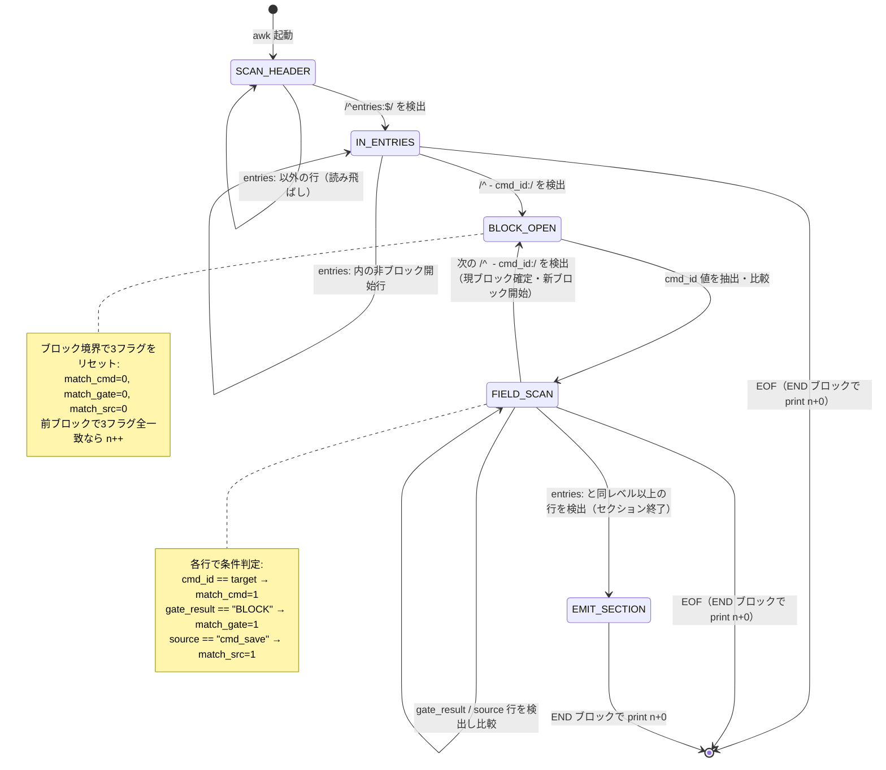
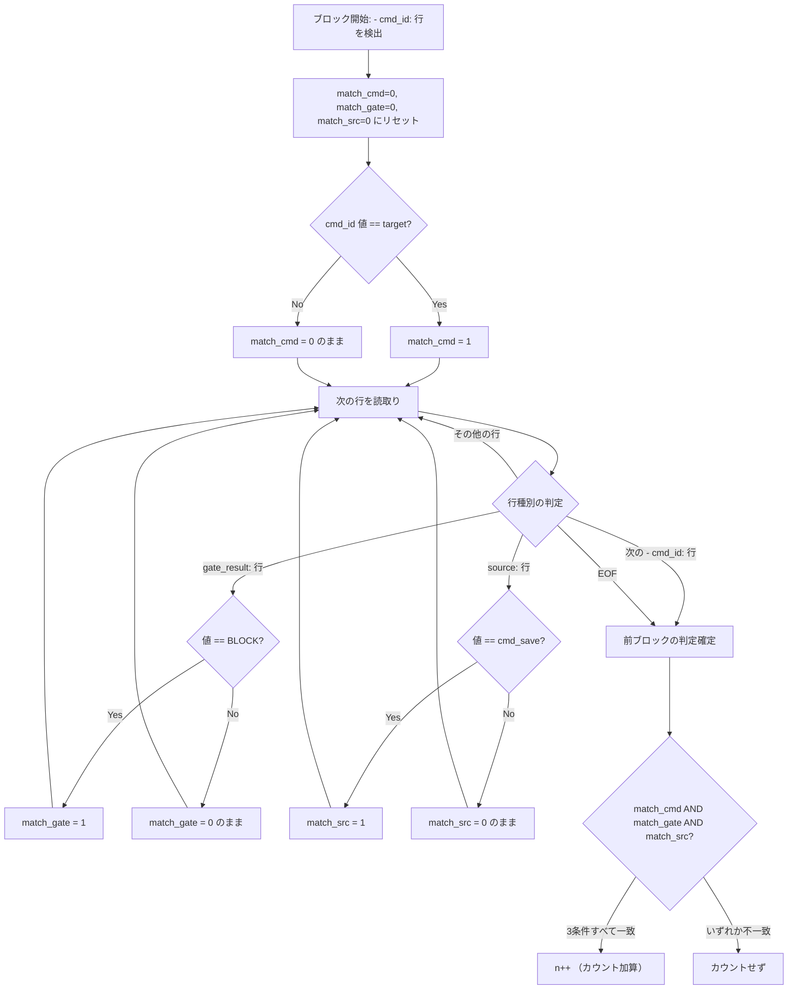
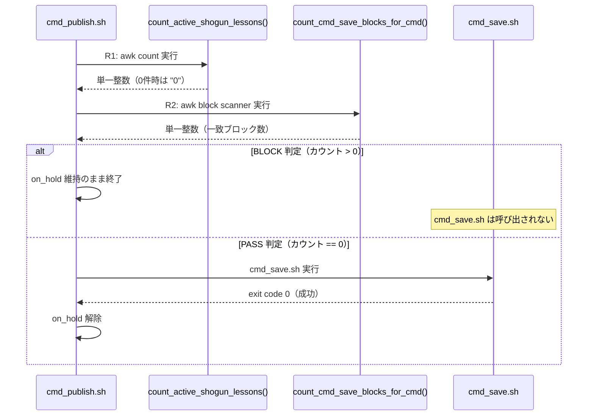

---
codd:
  node_id: detailed_design:awk-block-scanner
  type: design
  depends_on:
  - id: design:system-design
    relation: depends_on
    semantic: technical
  depended_by:
  - id: test:test-strategy
    relation: constrained_by
    semantic: technical
  - id: plan:implementation-plan
    relation: depends_on
    semantic: technical
  conventions:
  - targets:
    - module:cmd_publish
    reason: entries 配下の cmd_id・gate_result・source 3フィールド一致判定が Python 版と同一結果を返すこと。不一致はリリース不可。
  - targets:
    - module:cmd_publish
    reason: 'R1: count_active_shogun_lessons() は 0件時に単一整数 0 を返すこと。grep -c の 0\n0 二重出力パターンの再発禁止。'
  modules:
  - cmd_publish
---

# awk block scanner 状態遷移設計

## 1. Overview

本設計書は `count_cmd_save_blocks_for_cmd()` 関数の Python YAML parse から awk block scanner への置換（R2）における状態遷移モデルを定義する。対象モジュールは `module:cmd_publish`（`scripts/cmd_publish.sh`）であり、読取り対象は `logs/cmd_design_quality.yaml` の `entries:` セクションである。

awk block scanner は行指向の有限状態機械として設計され、以下の3フェーズで YAML エントリのカウントを実行する。

1. **セクション検出:** `entries:` 行の出現まで読み飛ばし、走査開始位置を確定する
2. **ブロック走査:** `- cmd_id:` 行をブロック境界として認識し、ブロック内の3フィールド（`cmd_id`, `gate_result`, `source`）を文字列一致で判定する
3. **集計出力:** `END` ブロックで一致ブロック数を単一整数として出力する（0件時は `0`）

本設計の根拠は ADR D1（governance:adr-awk-replacement）の決定に基づく。Python startup コスト（pre-flight あたり約120–140ms、テスト5ケース累積で600–700ms）の排除が主目的であり、テストスイート全量平均実行時間を 0.694s 未満かつ 200ms 以上短縮することを性能目標とする。

### リリース不可制約の適用

本設計書が遵守するリリース不可制約は以下のとおりである。

| 制約 | 適用内容 |
|---|---|
| **C1 — 外部 I/O 契約の凍結** | awk block scanner の出力は単一整数値（改行1つ）、exit code は常に 0。Python 版と同一の stdout フォーマットおよび exit code を維持する |
| **C2 — pre-flight BLOCK 順序維持** | awk block scanner はフェーズ1（pre-flight チェック）内で実行され、フェーズ3（`cmd_save.sh`）より先に完了する。BLOCK 判定時にフェーズ3 へ遷移しない |
| **C3 — `on_hold` ライフサイクル保全** | awk block scanner の結果が BLOCK を示す場合、`on_hold` 状態は `cmd_save.sh` 成功まで解除されない |
| **C4 — YAML 書込み経路限定** | awk block scanner は読取り専用である。`logs/cmd_design_quality.yaml` への書込みは一切行わない。書込みは既存 `yaml_field_set` の3箇所のみ |

### 非交渉制約の明示的遵守（conventions）

**Convention 1（entries 配下の3フィールド一致判定）:** awk block scanner は `entries:` 配下の各ブロックに対して `cmd_id`・`gate_result`・`source` の3フィールドすべてを文字列一致で判定する。判定結果は Python 版 `import yaml` による辞書アクセスと同一結果を返す。不一致がある場合はリリース不可である。本設計では状態遷移モデルにおいて3フィールドそれぞれに独立したフラグ変数を持ち、ブロック境界でのリセットと `END` ブロックでの集計を通じて Python 版との等価性を保証する。

**Convention 2（R1: `count_active_shogun_lessons()` の 0件出力）:** R1 で置換される `count_active_shogun_lessons()` は 0件時に単一整数 `0` を返す。`grep -c` の `0\n0` 二重出力パターンの再発は禁止される。本 awk block scanner（R2）も同様に、`END{print n+0}` パターンにより0件時に単一整数 `0` を出力し、二重出力を構造的に排除する。

## 2. Mermaid Diagrams

### 2.1 awk block scanner 状態遷移図



この状態遷移図は awk block scanner の全行処理ロジックを表現する。状態は4つ（`SCAN_HEADER`, `IN_ENTRIES`, `BLOCK_OPEN`, `FIELD_SCAN`）と終端状態 `EMIT_SECTION` で構成される。所有権は `module:cmd_publish` 内の `count_cmd_save_blocks_for_cmd()` 関数に限定される。

**所有権境界:** 状態遷移ロジック全体は `count_cmd_save_blocks_for_cmd()` が単独で所有する。他の関数やモジュールがこの状態機械を再実装・複製することは禁止される。

**実装上の帰結:** awk の行指向処理では明示的な状態変数（`state`）を使用してこれらの遷移を表現する。`SCAN_HEADER` → `IN_ENTRIES` 遷移は `entries:` 行のパターンマッチで発火し、`IN_ENTRIES` → `BLOCK_OPEN` 遷移は `- cmd_id:` 行の検出で発火する。ブロック境界での遷移時に前ブロックの3フラグ判定とカウント加算を実行する。

### 2.2 ブロック内フィールド判定フロー



このフローチャートは単一ブロック内のフィールド判定ロジックを詳細に示す。3フィールド（`cmd_id`, `gate_result`, `source`）はそれぞれ独立したフラグ変数で管理され、ブロック開始時にリセット、ブロック終了時に AND 結合で判定される。

**Convention 1 との関係:** Python 版では `yaml.safe_load()` で辞書に変換後、`entry['cmd_id'] == target and entry['gate_result'] == 'BLOCK' and entry['source'] == 'cmd_save'` で判定する。awk block scanner では3つのフラグ変数の AND 結合がこの辞書アクセスと等価である。フィールドの出現順序に依存しない設計とし、ブロック内であれば任意の順序で3フィールドが出現しても正しく判定する。

**制約 C4 との関係:** フローチャート内に書込み操作は一切含まれない。awk は読取り・判定・カウントのみを実行し、入力ファイルへの変更を行わない。

### 2.3 pre-flight チェック内の実行位置



このシーケンス図は `cmd_publish.sh` 内での awk block scanner の実行位置と、制約 C2（pre-flight BLOCK 順序維持）および制約 C3（`on_hold` ライフサイクル保全）の遵守を示す。`count_cmd_save_blocks_for_cmd()`（awk block scanner）はフェーズ1 内で完了し、その結果が BLOCK を示す場合は `cmd_save.sh`（フェーズ3）は実行されない。`on_hold` の解除は `cmd_save.sh` が exit code 0 を返した場合のみ行われる。

## 3. Ownership Boundaries

### 3.1 関数所有権

| 関数 | 所有モジュール | 置換対象 | 書込み権限 |
|---|---|---|---|
| `count_cmd_save_blocks_for_cmd()` | `module:cmd_publish` | R2: Python → awk block scanner | 読取り専用（書込み禁止） |
| `count_active_shogun_lessons()` | `module:cmd_publish` | R1: `grep -c` → awk count | 読取り専用（書込み禁止） |
| `yaml_field_set` | `module:cmd_publish` | 変更なし | `logs/cmd_design_quality.yaml` 等への唯一の書込み手段 |
| `cmd_save.sh` | `module:cmd_save` | 変更なし | 独自の書込み対象を持つ |

`count_cmd_save_blocks_for_cmd()` の awk block scanner ロジックは `module:cmd_publish` が単独で所有する。`module:cmd_save` やその他のモジュールがこのパターンマッチロジックを複製・再実装することは禁止される。awk block scanner のパターン変更が必要な場合は、`module:cmd_publish` 内の同関数のみを修正する。

### 3.2 状態変数の所有権

awk block scanner 内部の状態変数は関数スコープに閉じ込められ、外部から参照されない。

| 変数 | スコープ | 目的 | 初期値 |
|---|---|---|---|
| `state` | awk プロセス内 | 現在の状態遷移位置 | `"SCAN_HEADER"` |
| `match_cmd` | awk プロセス内 | `cmd_id` 一致フラグ | `0` |
| `match_gate` | awk プロセス内 | `gate_result` 一致フラグ | `0` |
| `match_src` | awk プロセス内 | `source` 一致フラグ | `0` |
| `n` | awk プロセス内 | 一致ブロック累積カウント | `0`（暗黙） |
| `target` | awk `-v` 引数 | 比較対象の `cmd_id` 値 | 呼び出し元から注入 |

これらの変数は awk プロセスの生存期間内にのみ存在し、シェル変数空間を汚染しない。`target` は `-v target="$cmd_id"` で awk に渡され、シェルのクォーティングにより特殊文字を含む値にも対応する。

### 3.3 テストヘルパーの所有権

| ヘルパーファイル | 所有者 | 再利用ポリシー |
|---|---|---|
| `tests/e2e/helpers/fixture_setup.bash` | E2E テストスイート共有 | 全 E2E テストが `load` で使用。単一ファイルとして維持し、テストファイルごとの複製を禁止 |
| `tests/e2e/helpers/yaml_fixtures.bash` | E2E テストスイート共有 | `logs/cmd_design_quality.yaml` のフィクスチャ生成を一元管理。0件/1件/複数件/混合条件のパターンをここで定義 |
| `tests/e2e/helpers/assertions.bash` | E2E テストスイート共有 | 単一整数出力検証・exit code 検証・ファイル差分検証・実行時間検証の共通アサーション |
| `tests/e2e/helpers/source_loader.bash` | E2E テストスイート共有 | `cmd_publish.sh` の関数を個別にロードするユーティリティ。`count_cmd_save_blocks_for_cmd()` を単体テスト可能にする |

### 3.4 入出力ファイルの所有権境界

| ファイル | 読取り元 | 書込み元 | 制約 |
|---|---|---|---|
| `logs/cmd_design_quality.yaml` | `count_cmd_save_blocks_for_cmd()`（awk block scanner） | `yaml_field_set`（3箇所のみ） | C4: awk からの書込みは禁止。`grep -c 'yaml_field_set' scripts/cmd_publish.sh` が `3` を返すことで検証 |
| shogun_lessons ファイル | `count_active_shogun_lessons()`（awk count） | 対象外 | 読取り専用 |

## 4. Implementation Implications

### 4.1 awk block scanner の実装パターン

awk block scanner は以下の擬似コードで実装する。状態遷移図（§2.1）の4状態を `state` 変数で管理する。

```bash
count_cmd_save_blocks_for_cmd() {
  local cmd_id="$1"
  local file="logs/cmd_design_quality.yaml"
  
  awk -v target="$cmd_id" '
    /^entries:$/ { state = "IN_ENTRIES"; next }
    state != "IN_ENTRIES" && state != "FIELD_SCAN" { next }
    
    /^  - cmd_id:/ {
      if (state == "FIELD_SCAN" && match_cmd && match_gate && match_src) n++
      match_cmd = 0; match_gate = 0; match_src = 0
      state = "FIELD_SCAN"
      gsub(/^  - cmd_id: */, "")
      if ($0 == target) match_cmd = 1
      next
    }
    
    state == "FIELD_SCAN" && /^    gate_result:/ {
      gsub(/^    gate_result: */, "")
      if ($0 == "BLOCK") match_gate = 1
      next
    }
    
    state == "FIELD_SCAN" && /^    source:/ {
      gsub(/^    source: */, "")
      if ($0 == "cmd_save") match_src = 1
      next
    }
    
    state == "FIELD_SCAN" && /^[^ ]/ {
      if (match_cmd && match_gate && match_src) n++
      state = "DONE"
      next
    }
    
    END {
      if (state == "FIELD_SCAN" && match_cmd && match_gate && match_src) n++
      print n + 0
    }
  ' "$file"
}
```

### 4.2 状態遷移の詳細仕様

| 遷移 | トリガー条件 | アクション | 遷移先 |
|---|---|---|---|
| `SCAN_HEADER` → `IN_ENTRIES` | 行が `/^entries:$/` にマッチ | `state = "IN_ENTRIES"` | `IN_ENTRIES` |
| `IN_ENTRIES` → `FIELD_SCAN` | 行が `/^  - cmd_id:/` にマッチ | 3フラグリセット、`cmd_id` 値を抽出・比較 | `FIELD_SCAN` |
| `FIELD_SCAN` → `FIELD_SCAN`（ブロック境界） | 行が `/^  - cmd_id:/` にマッチ | 前ブロックの3フラグ判定 → 条件合致なら `n++`、3フラグリセット、新ブロックの `cmd_id` 値を抽出・比較 | `FIELD_SCAN` |
| `FIELD_SCAN` → `FIELD_SCAN`（フィールド読取り） | 行が `/^    gate_result:/` または `/^    source:/` にマッチ | 対応するフラグを設定 | `FIELD_SCAN` |
| `FIELD_SCAN` → `DONE` | 行が `/^[^ ]/` にマッチ（インデントなし = セクション終了） | 前ブロックの3フラグ判定 → 条件合致なら `n++` | `DONE` |
| 任意 → 終了 | EOF | `END` ブロックで最終ブロック判定 → `print n+0` | 終了 |

### 4.3 Convention 1 の遵守: 3フィールド一致判定の等価性

Python 版の判定ロジック:

```python
count = sum(1 for e in data['entries']
            if e['cmd_id'] == target
            and e['gate_result'] == 'BLOCK'
            and e['source'] == 'cmd_save')
print(count)
```

awk block scanner の等価性保証:

| Python の動作 | awk block scanner の対応 | 等価性の根拠 |
|---|---|---|
| `data['entries']` で entries セクション内のみ走査 | `state == "IN_ENTRIES"` または `state == "FIELD_SCAN"` の条件でのみ判定 | `entries:` 行検出後にのみ走査が有効化される |
| `e['cmd_id'] == target` | `match_cmd` フラグ: `cmd_id` 値と `target` の文字列完全一致 | `gsub` で前置ラベルを除去後に `$0 == target` で比較 |
| `e['gate_result'] == 'BLOCK'` | `match_gate` フラグ: `gate_result` 値と `"BLOCK"` の文字列完全一致 | 同上 |
| `e['source'] == 'cmd_save'` | `match_src` フラグ: `source` 値と `"cmd_save"` の文字列完全一致 | 同上 |
| `sum(1 for ...)` | `n++` の累積と `END{print n+0}` | ブロック境界と EOF で3フラグの AND 判定を実行し、合致時にカウント加算 |
| 0件時に `0` を出力 | `print n+0` で未初期化の `n` を `0` に強制 | awk の未初期化変数は `0` として扱われ、`+0` で明示的に数値化 |

検証方法: E2E テスト `tests/e2e/awk-block-scanner.spec.bats` で以下のケースを実行し、Python 版と awk 版の出力を比較する。

| テストケース | 入力 | 期待出力 | 検証対象 |
|---|---|---|---|
| 0件マッチ | `entries:` セクションに該当エントリなし | `0` | FC-09: カウント漏れなし |
| 1件マッチ | `cmd_id=target, gate_result=BLOCK, source=cmd_save` が1件 | `1` | FC-09: 正確なカウント |
| 複数件マッチ | 該当エントリが3件 | `3` | FC-09: 複数件の正確なカウント |
| 混合条件 | 3条件合致2件 + `gate_result=PASS` 1件 + `source=other` 1件 + `cmd_id=other` 1件 | `2` | AC-04: 条件外エントリの除外 |
| `entries:` セクション不在 | YAML ファイルに `entries:` キーなし | `0` | エッジケースの安全な処理 |

### 4.4 Convention 2 の遵守: 0件出力パターン

R1（`count_active_shogun_lessons()`）と R2（`count_cmd_save_blocks_for_cmd()`）の両方で `END{print n+0}` パターンを使用する。これにより:

- awk は常に exit code 0 で終了する（`grep -c` の exit code 1 問題を回避）
- `set -e` 環境下で `|| echo 0` のフォールバックが不要になる
- 0件時の出力は単一整数 `0`（改行1つ）のみとなり、`0\n0` 二重出力パターンは構造的に再発しない

検証方法: `wc -l` で出力行数が `1` であること、`grep -xP '[0-9]+'` で単一整数形式であることを確認する（AC-01, AC-02, FC-07）。

### 4.5 YAML フォーマット前提条件

awk block scanner は `logs/cmd_design_quality.yaml` の以下のフォーマット前提に依存する。

| 前提 | パターン | 破壊された場合の影響 |
|---|---|---|
| `entries:` はトップレベルキー | `/^entries:$/`（行頭、末尾改行のみ） | セクション検出失敗 → 常に0を返す |
| エントリはインデント2スペース | `/^  - cmd_id:/`（先頭スペース2つ + `- `） | ブロック境界検出失敗 → カウント不正確 |
| フィールドはインデント4スペース | `/^    gate_result:/`、`/^    source:/` | フィールド検出失敗 → 常に0を返す |
| 値はコロン+スペース後に記述 | `gsub(/^    gate_result: */, "")` | 値の抽出失敗 → 一致判定が常に偽 |

OQ-2（システム設計 §3）に基づき、フォーマット変更者が awk パターンも更新する運用ルールを適用する。

### 4.6 性能への影響

| メトリクス | Python 版（Before） | awk 版（After） | 改善根拠 |
|---|---|---|---|
| 単一呼出しのオーバーヘッド | 120–140ms（Python startup） | 1–3ms（awk startup） | Python インタプリタのロード・`import yaml` の省略 |
| テスト5ケース累積 | 600–700ms | 5–15ms | 5回の Python 起動がすべて awk に置換 |
| `python3` 起動回数 | 1回/テスト | 0回 | FC-02 で検証: `strace -f -e execve` でゼロ確認 |

テストスイート全量平均実行時間の目標は 0.694s 未満かつ 200ms 以上短縮である。5回計測の平均で判定し、計測結果は `docs/research/` に保存する。

### 4.7 制約 C4 の実装上の保証

awk block scanner は以下の実装制約を遵守する。

- awk コマンドは入力ファイルを読取りモード（デフォルト）でのみ開く
- awk 内で `print` の出力先は stdout のみであり、ファイルリダイレクト（`> file`、`>> file`）を使用しない
- `scripts/cmd_publish.sh` 全体で `yaml_field_set` の呼出し回数が3であることを `grep -c 'yaml_field_set' scripts/cmd_publish.sh` で検証する（AC-10）
- `scripts/cmd_publish.sh` 内に `.yaml` ファイルへの直接書込み（`>`, `>>`, `sed -i`, `tee`）が存在しないことをソースコード検査で確認する（FC-06）

### 4.8 エラー処理

| 異常条件 | awk block scanner の挙動 | exit code |
|---|---|---|
| 入力ファイルが存在しない | awk がエラー出力。呼び出し元で事前に存在確認 | 非0（awk のデフォルト） |
| `entries:` セクションが存在しない | `state` が `SCAN_HEADER` のまま EOF → `END{print 0+0}` → `0` を出力 | 0 |
| ブロック内にフィールドが欠損 | 対応するフラグが `0` のまま → 3条件 AND で不一致 → カウントされない | 0 |
| 空ファイル | EOF 即到達 → `END{print 0+0}` → `0` を出力 | 0 |

入力ファイルの存在確認は `count_cmd_save_blocks_for_cmd()` のシェル関数側で awk 呼出し前に実行する。missing queue fast-fail path の実行時間は 0.020s 以下を維持する。

## 5. Open Questions

| # | 質問 | 影響範囲 | 判断期限 | 暫定方針 |
|---|---|---|---|---|
| OQ-R2-1 | `entries:` セクション内でブロックのフィールド順序が `cmd_id` → `gate_result` → `source` 以外になった場合、awk block scanner は正しく動作するか | awk block scanner のフィールド検出ロジック | R2 実装時のテスト完了前 | 現設計では `FIELD_SCAN` 状態内でフィールド順序に依存しない判定を行うため、任意の順序で正しく動作する。ただし `cmd_id` はブロック境界を兼ねるため必ず先頭に出現する前提を維持する。E2E テストでフィールド順序入れ替えケースを追加して検証する |
| OQ-R2-2 | `cmd_id` の値にスペースや特殊文字を含む場合の `gsub` + `$0 == target` 比較の安全性 | 文字列一致判定の正確性 | R2 実装時 | 現行の運用データでは `cmd_id` は英数字とアンダースコアのみで構成される。awk の `-v target="$cmd_id"` でシェルクォーティングにより安全に渡される。特殊文字を含む `cmd_id` が導入される場合は、エスケープ処理の追加を検討する |
| OQ-R2-3 | `_yaml_field_get_in_block`（2箇所）の awk 置換を R2 と同一リリースで実施するか | `module:cmd_publish` の読取り性能と変更範囲 | R2 実装完了・after 計測後 | OQ-1（システム設計 §3）と同一。ADR F2 に従いフォローアップとして分離し、R1・R2 の効果を計測してから判断する |
| OQ-R2-4 | YAML ファイルのサイズが大きくなった場合（entries 1000件超）の awk block scanner の性能特性 | 将来のスケーラビリティ | R2 の after 計測後 | 現行の運用データでは entries は数十件規模であり、awk の行指向処理は線形時間で完了する。1000件超の規模に達した場合はインデックス化等の別アプローチを検討する。現時点では対応不要 |
