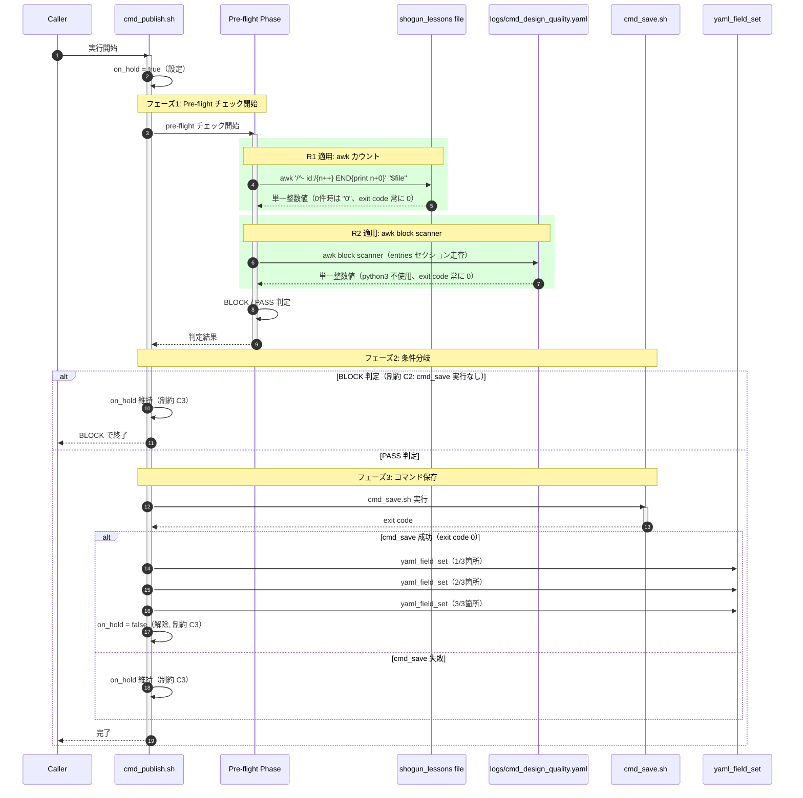
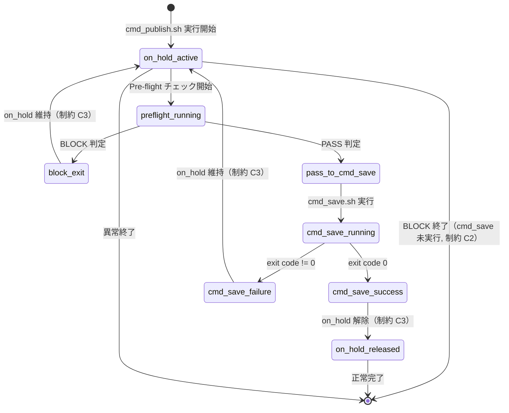
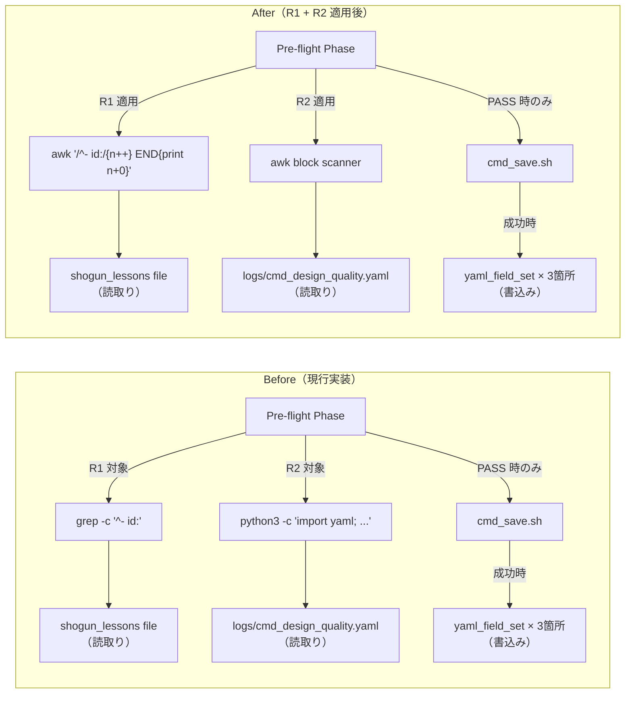

---
codd:
  node_id: detailed_design:preflight-sequence
  type: design
  depends_on:
  - id: design:system-design
    relation: depends_on
    semantic: technical
  depended_by:
  - id: test:test-strategy
    relation: constrained_by
    semantic: technical
  - id: plan:implementation-plan
    relation: depends_on
    semantic: technical
  conventions:
  - targets:
    - module:cmd_publish
    - module:preflight
    reason: pre-flight BLOCK 判定 → cmd_save 実行の呼出し順序制約をシーケンス図で検証可能にすること。R1/R2 置換後も呼出し順序が同一であることが必須。
  modules:
  - cmd_publish
  - preflight
---

# Pre-flight フロー シーケンス図（Before/After）

## 1. Overview

本設計書は `module:cmd_publish`（`scripts/cmd_publish.sh`）における pre-flight チェックフローの Before/After シーケンスを定義する。リファクタリング R1（`count_active_shogun_lessons()` の `grep -c` → `awk` 置換）および R2（`count_cmd_save_blocks_for_cmd()` の Python YAML parse → awk block scanner 置換）の実施前後で、呼出し順序が同一であることをシーケンス図により検証可能にすることが本ドキュメントの主目的である。

対象モジュールは以下の通りである。

| モジュール | ファイル | 本ドキュメントでの役割 |
|---|---|---|
| `module:cmd_publish` | `scripts/cmd_publish.sh` | pre-flight チェックの実行主体。R1・R2 の関数置換が行われる |
| `module:preflight` | （`cmd_publish.sh` 内の pre-flight フェーズ） | BLOCK/PASS 判定ロジック。フェーズ1 を構成する |
| `module:cmd_save` | `scripts/cmd_save.sh` | コマンド保存処理。変更なし。pre-flight PASS 後にのみ呼び出される |

### リリースブロッキング制約の本ドキュメントへの反映

本ドキュメントはシステム設計書で定義された4つのリリースブロッキング制約のうち、特に **制約 C2（pre-flight BLOCK 順序の維持）** および **制約 C3（`on_hold` ライフサイクルの保全）** を中心にシーケンス図で表現する。

| 制約 | 本ドキュメントでの反映方法 |
|---|---|
| C1: 外部 I/O 契約の凍結 | Before/After シーケンスで各関数の入出力（ファイルパス・stdout フォーマット・exit code）が同一であることを図示 |
| C2: pre-flight BLOCK 順序維持 | BLOCK 判定が `cmd_save.sh` 実行より必ず先行することをシーケンス図の呼出し順序で明示。順序逆転パスが存在しないことを図上で確認可能にする |
| C3: `on_hold` ライフサイクル保全 | `on_hold` の設定・維持・解除タイミングをシーケンス図のライフライン上に明示。BLOCK 時に `on_hold` が維持されること、`cmd_save.sh` 成功時にのみ解除されることを図示 |
| C4: YAML 書込み経路限定 | シーケンス図内で `yaml_field_set` の3箇所の書込みを明示し、awk 置換が読取り専用経路に限定されていることを図上で確認可能にする |

**コンベンション遵守（`module:cmd_publish`, `module:preflight` 対象）:** pre-flight BLOCK 判定 → `cmd_save` 実行の呼出し順序制約をシーケンス図で検証可能にすること、および R1/R2 置換後も呼出し順序が同一であることが必須である。本ドキュメントでは Before シーケンスと After シーケンスを並置し、メッセージの順序・参加者・分岐条件が一致していることを目視検証可能な形式で提供する。

---

## 2. Mermaid Diagrams

### 2.1 Before シーケンス（現行実装）

以下は R1・R2 適用前の pre-flight フローである。`count_active_shogun_lessons()` は `grep -c` を使用し、`count_cmd_save_blocks_for_cmd()` は `python3` による YAML パースを使用する。

```mermaid
sequenceDiagram
    autonumber
    participant caller as Caller
    participant publish as cmd_publish.sh
    participant preflight as Pre-flight Phase
    participant shogun_file as shogun_lessons file
    participant yaml_file as logs/cmd_design_quality.yaml
    participant python as python3
    participant cmd_save as cmd_save.sh
    participant yaml_write as yaml_field_set

    caller->>publish: 実行開始
    activate publish
    publish->>publish: on_hold = true（設定）

    Note over publish,preflight: フェーズ1: Pre-flight チェック開始
    publish->>preflight: pre-flight チェック開始
    activate preflight

    rect rgb(255, 240, 240)
        Note over preflight,shogun_file: R1 対象: count_active_shogun_lessons()
        preflight->>shogun_file: grep -c '^- id:' "$file" || echo 0
        shogun_file-->>preflight: 整数値（0件時に 0\n0 バグあり）
    end

    rect rgb(255, 240, 240)
        Note over preflight,python: R2 対象: count_cmd_save_blocks_for_cmd()
        preflight->>python: python3 -c "import yaml; ..."
        python->>yaml_file: YAML 読取り
        yaml_file-->>python: entries データ
        python-->>preflight: 整数値（120–140ms のスタートアップコスト）
    end

    preflight->>preflight: BLOCK / PASS 判定
    preflight-->>publish: 判定結果
    deactivate preflight

    Note over publish,cmd_save: フェーズ2: 条件分岐

    alt BLOCK 判定（制約 C2: cmd_save 実行なし）
        publish->>publish: on_hold 維持（制約 C3）
        publish-->>caller: BLOCK で終了
    else PASS 判定
        Note over publish,cmd_save: フェーズ3: コマンド保存
        publish->>cmd_save: cmd_save.sh 実行
        activate cmd_save
        cmd_save-->>publish: exit code
        deactivate cmd_save

        alt cmd_save 成功（exit code 0）
            publish->>yaml_write: yaml_field_set（1/3箇所）
            publish->>yaml_write: yaml_field_set（2/3箇所）
            publish->>yaml_write: yaml_field_set（3/3箇所）
            publish->>publish: on_hold = false（解除, 制約 C3）
        else cmd_save 失敗
            publish->>publish: on_hold 維持（制約 C3）
        end

        publish-->>caller: 完了
    end
    deactivate publish
```

**Before シーケンスの所有権と制約:**

- `module:preflight` は `grep -c` および `python3` を内部で使用する。`grep -c` は0件マッチ時に終了コード1を返すため、`set -e` 環境下で `|| echo 0` との組合せが `0\n0` 二重出力バグを引き起こす（FC-07 で検出対象）。
- `python3` の起動コストは1回あたり約120–140ms であり、テスト5ケース累積で600–700ms のオーバーヘッドとなる。
- シーケンス上、メッセージ番号で確認できる通り、pre-flight チェック（フェーズ1）の判定結果が `publish` に返却された後にのみ `cmd_save.sh` の呼出しが発生する。BLOCK 判定時には `cmd_save.sh` 呼出しのパスに到達しない。

### 2.2 After シーケンス（R1 + R2 適用後）

以下は R1・R2 適用後の pre-flight フローである。`grep -c` は `awk` カウントに、`python3` YAML パースは awk block scanner にそれぞれ置換される。呼出し順序・参加者構成・分岐条件は Before と同一である。



**After シーケンスの所有権と制約:**

- `python3` 参加者がシーケンスから完全に除去されている。`module:preflight` が `yaml_file` を直接 awk で走査するため、外部プロセス起動のオーバーヘッドが排除される（AC-06, FC-02 で検証）。
- R1 適用により `grep -c` → `awk` 置換で `0\n0` バグが構造的に排除される。`awk` は常に exit code 0 を返し、`END{print n+0}` で0件時も単一 `"0"` を出力する（AC-01, AC-02, FC-07 で検証）。
- **呼出し順序の同一性:** Before/After の両シーケンスにおいて、メッセージの順序は以下の通り同一である:
  1. `on_hold` 設定
  2. `count_active_shogun_lessons()` 実行（内部実装のみ変更）
  3. `count_cmd_save_blocks_for_cmd()` 実行（内部実装のみ変更）
  4. BLOCK/PASS 判定
  5. BLOCK 時: `on_hold` 維持 → 終了 / PASS 時: `cmd_save.sh` 実行 → 成否に応じた `on_hold` 制御

この順序の同一性は制約 C2 の要求を満たし、R1/R2 置換後も呼出し順序が変化していないことをシーケンス図の番号付きメッセージで目視検証可能にしている。

### 2.3 BLOCK/PASS 判定の状態遷移図

pre-flight フェーズにおける `on_hold` 状態のライフサイクルを状態遷移図で表現する。制約 C3 の遵守を可視化する。



**状態遷移の所有権と実装境界:**

- `on_hold` の設定・解除は `module:cmd_publish` が排他的に所有する。`module:cmd_save` は `on_hold` の状態を変更しない。
- `on_hold_released` への遷移は `cmd_save.sh` が exit code 0 を返した場合にのみ発生する。これは制約 C3 の「`cmd_save.sh` 成功前に `on_hold` が解除された場合はリリース不可」を状態遷移レベルで保証している。
- BLOCK 判定時の遷移パスには `cmd_save_running` 状態が存在しない。制約 C2 の「BLOCK 条件成立時には `cmd_save.sh` は呼び出されない」ことを状態遷移の不到達性で表現している。

### 2.4 Before/After 呼出しパターン比較



**比較の実装的意味:**

- Before/After で変化するのは `grep -c` → `awk` カウント（R1）と `python3` → awk block scanner（R2）の2箇所のみであり、いずれも読取り専用経路に限定される。
- `yaml_field_set` × 3箇所の書込み経路は Before/After で完全に同一であり、制約 C4 を満たす。
- `cmd_save.sh` の呼出し条件（PASS 判定後のみ）は Before/After で不変であり、制約 C2 を満たす。
- `python3` ノードが After では完全に除去されており、FC-02（`python3` 起動ゼロ）の達成を図上で確認できる。

---

## 3. Ownership Boundaries

### 3.1 モジュール所有権マトリクス

| 責務 | 所有モジュール | 排他的か | 備考 |
|---|---|---|---|
| pre-flight チェックの実行とBLOCK/PASS 判定 | `module:preflight`（`cmd_publish.sh` 内フェーズ1） | 排他的 | R1・R2 の変更はこのフェーズ内に閉じる |
| `on_hold` 状態の設定・維持・解除 | `module:cmd_publish` | 排他的 | `module:cmd_save` は `on_hold` を変更しない。解除は `cmd_save.sh` 成功時のみ（制約 C3） |
| `cmd_save.sh` の呼出し判断 | `module:cmd_publish`（フェーズ2 の条件分岐） | 排他的 | BLOCK 判定時は呼出しを行わない（制約 C2） |
| コマンド保存処理の実行 | `module:cmd_save` | 排他的 | 内部実装は本リファクタリングの変更対象外 |
| YAML 運用ファイルへの書込み | `module:cmd_publish` 経由の `yaml_field_set` | 排他的 | 3箇所のみ。awk 等による代替書込みは禁止（制約 C4） |
| `count_active_shogun_lessons()` 関数 | `module:preflight` | 排他的 | R1 で内部実装を `awk` に置換。出力契約（単一整数、exit code 0）は不変（制約 C1） |
| `count_cmd_save_blocks_for_cmd()` 関数 | `module:preflight` | 排他的 | R2 で内部実装を awk block scanner に置換。出力契約（単一整数、exit code 0）は不変（制約 C1） |
| `logs/cmd_design_quality.yaml` のスキーマ | 外部（YAML フォーマット管理者） | — | インデント2スペースの固定フォーマットを前提。変更時は awk パターン更新が必要（OQ-2） |

### 3.2 再実装ドリフト防止ルール

以下のルールにより、モジュール間の責務境界が曖昧になることを防止する。

**ルール 1: 読取り/書込みの分離原則**
awk 置換は読取り専用関数（`count_active_shogun_lessons()` および `count_cmd_save_blocks_for_cmd()`）に厳密に限定する。YAML 運用ファイルへの書込みは `yaml_field_set` 関数が単一の所有者である。他モジュールやリファクタリング作業で `yaml_field_set` を迂回する書込み手段（リダイレクト `>`, `>>`、`sed -i`、awk 直接書込み、`tee`）を導入した場合、FC-06 によりリリースブロッキングとなる。

**ルール 2: pre-flight → cmd_save 呼出し順序の不可侵性**
`module:cmd_publish` のフェーズ構成（フェーズ1: pre-flight → フェーズ2: 判定 → フェーズ3: cmd_save）は呼出し順序の正規形であり、いかなるリファクタリングでもこの順序を変更してはならない。BLOCK 判定時にフェーズ3 に到達するパスが存在する場合、FC-04 によりリリースブロッキングとなる。

**ルール 3: `on_hold` 制御の単一所有**
`on_hold` の設定・解除は `module:cmd_publish` のみが行う。`module:cmd_save` は `on_hold` の存在を認識するが変更権限を持たない。`cmd_save.sh` が exit code 0 以外を返した場合、または BLOCK 判定で `cmd_save.sh` が呼び出されなかった場合、`on_hold` は維持される。この制御フローを他モジュールに委譲してはならない。

### 3.3 テスト所有権

| テスト | 所有モジュール | 検証対象の制約 |
|---|---|---|
| `tests/unit/test_cmd_publish_preflight.bats`（5件） | `module:preflight` | 全制約の基本検証。FC-01 で全件 PASS 必須 |
| `tests/e2e/awk-count.spec.bats` | `module:preflight`（R1） | `count_active_shogun_lessons()` の awk 置換正確性 |
| `tests/e2e/awk-block-scanner.spec.bats` | `module:preflight`（R2） | `count_cmd_save_blocks_for_cmd()` の awk block scanner 正確性 |
| `tests/e2e/io-contract.spec.bats` | `module:cmd_publish` | 制約 C1: 外部 I/O 契約の維持 |
| `tests/e2e/preflight-order.spec.bats` | `module:cmd_publish` + `module:preflight` | 制約 C2: BLOCK 順序 + 制約 C3: `on_hold` 保持 |
| `tests/e2e/preflight-order.workflow.spec.bats` | `module:cmd_publish` + `module:cmd_save` | pre-flight → cmd_save 連携の end-to-end ワークフロー |
| `tests/e2e/yaml-write-guard.spec.bats` | `module:cmd_publish` | 制約 C4: YAML 書込み経路制限 |
| `tests/e2e/performance.spec.bats` | `module:preflight` | 実行時間短縮・fast-fail 性能維持 |

共有ヘルパー（`tests/e2e/helpers/` 配下の4ファイル）は `module:preflight` のテストインフラとして所有される。`fixture_setup.bash`、`yaml_fixtures.bash`、`assertions.bash`、`source_loader.bash` の修正は pre-flight テスト全体に影響するため、変更時は全 E2E テストの再実行が必須である。

---

## 4. Implementation Implications

### 4.1 Before/After シーケンス同一性の検証方法

Before/After シーケンス図で示した呼出し順序の同一性は、以下の具体的手段で検証する。

| 検証項目 | 手段 | 合格基準 | 関連する失敗基準 |
|---|---|---|---|
| pre-flight → cmd_save 呼出し順序 | `tests/e2e/preflight-order.spec.bats` で BLOCK 条件時に `cmd_save.sh` のモック/スパイが呼び出されないことを確認 | `cmd_save.sh` 呼出し回数 = 0（BLOCK 時） | FC-04 |
| `on_hold` 遷移タイミング | `tests/e2e/preflight-order.spec.bats` で BLOCK 時に `on_hold` が `true` のまま残ることを確認。PASS → `cmd_save` 成功時に `on_hold` が `false` になることを確認 | BLOCK 時: `on_hold == true`、成功時: `on_hold == false` | FC-05 |
| stdout 出力の同一性 | `tests/e2e/io-contract.spec.bats` で同一フィクスチャに対する Before/After の stdout を diff 比較 | diff 差分なし | FC-03 |
| exit code の同一性 | `tests/e2e/io-contract.spec.bats` で同一条件に対する Before/After の exit code を比較 | 同一条件で同一 exit code | FC-03 |

### 4.2 R1 実装におけるシーケンス上の注意点

R1（`count_active_shogun_lessons()` の awk 置換）により、Before シーケンスの `grep -c '^- id:' "$file" || echo 0` が After シーケンスの `awk '/^- id:/{n++} END{print n+0}' "$file"` に置換される。

**シーケンス上の変化点:**
- Before: `preflight` → `shogun_file` への呼出しが `grep` プロセスを経由し、0件時に `|| echo 0` のフォールバックが発動する（2段階の出力経路）
- After: `preflight` → `shogun_file` への呼出しが単一 `awk` プロセスで完結し、出力経路は常に1段階

**シーケンス上の不変点:**
- `count_active_shogun_lessons()` の呼出し位置（フェーズ1 の最初）は Before/After で同一
- 出力（単一整数値、改行1つ）と exit code（常に 0）は Before/After で同一（制約 C1）
- 後続の `count_cmd_save_blocks_for_cmd()` 呼出しとの順序関係は不変

### 4.3 R2 実装におけるシーケンス上の注意点

R2（`count_cmd_save_blocks_for_cmd()` の awk block scanner 置換）により、Before シーケンスの `python3` 参加者が After シーケンスから除去される。

**シーケンス上の変化点:**
- Before: `preflight` → `python3` → `yaml_file` の3者間通信（`python3` プロセスが YAML ファイルを読取り、パース結果を `preflight` に返却）
- After: `preflight` → `yaml_file` の2者間通信（awk block scanner が直接ファイルを走査）

**シーケンス上の不変点:**
- `count_cmd_save_blocks_for_cmd()` の呼出し位置（フェーズ1 の2番目、`count_active_shogun_lessons()` の後）は Before/After で同一
- 出力（単一整数値、改行1つ）と exit code（常に 0）は Before/After で同一（制約 C1）
- BLOCK/PASS 判定への入力値としての意味は不変

**awk block scanner の走査ロジック:**
1. `entries:` セクション開始を検出
2. `- cmd_id:` 行でブロック境界を識別
3. ブロック内で `cmd_id == target`、`gate_result == BLOCK`、`source == cmd_save` の3条件を文字列一致で判定
4. 3条件すべてを満たすブロック数を `END` ブロックで出力

対象 YAML（`logs/cmd_design_quality.yaml`）はインデント2スペースの固定フォーマットであり、awk block scanner はこの前提に依存する。

### 4.4 性能への影響

シーケンス図上の変化は性能に以下の影響を与える。

| メトリクス | Before | After | 目標 |
|---|---|---|---|
| テストスイート全量平均実行時間 | 0.694s | 0.494s 未満（目標） | 200ms 以上短縮 |
| `python3` 起動回数 | テスト実行あたり5回累積（1回あたり120–140ms） | 0回 | FC-02 で検証 |
| missing queue fast-fail path | 0.015–0.018s | 0.020s 以下 | fast-fail 性能維持 |

R2 による `python3` 除去が性能改善の主因である。テスト5ケース × 120–140ms = 600–700ms の削減が期待され、200ms 以上短縮の目標を十分に達成可能である。

### 4.5 実施順序とシーケンス検証のタイミング

ADR D1 の決定に基づき、R1 と R2 は独立して実施される。各ステップでシーケンスの同一性を段階的に検証する。

| ステップ | 実施内容 | シーケンス検証 |
|---|---|---|
| 1 | R1 実装（`count_active_shogun_lessons()` awk 置換） | `bash -n` 構文チェック通過 |
| 2 | テスト実行 | `bats tests/unit/test_cmd_publish_preflight.bats` 全5テスト PASS。呼出し順序が Before と同一であることを確認 |
| 3 | R2 実装（`count_cmd_save_blocks_for_cmd()` awk block scanner 置換） | `bash -n` 構文チェック通過 |
| 4 | テスト実行 | 全5テスト PASS。`python3` 起動回数 = 0。呼出し順序が Before と同一であることを確認 |
| 5 | before/after 性能比較 | 平均実行時間 < 0.694s、短縮幅 ≥ 200ms |
| 6 | after 計測結果を `docs/research/` に保存 | before/after 比較表を含むドキュメントが存在 |

### 4.6 制約遵守の実装チェックリスト

| 制約 | シーケンス図での反映 | 実装での確認手段 |
|---|---|---|
| C1: 外部 I/O 契約の凍結 | Before/After で各関数の入出力矢印のラベル（ファイルパス、出力形式、exit code）が同一 | AC-07 / FC-03: 同一フィクスチャで Before/After の出力を diff 比較 |
| C2: pre-flight BLOCK 順序維持 | BLOCK 分岐パスに `cmd_save.sh` 呼出しが存在しない | AC-08 / FC-04: BLOCK 条件で `cmd_save.sh` モックの呼出し回数 = 0 |
| C3: `on_hold` ライフサイクル保全 | 状態遷移図で `on_hold_released` への遷移が `cmd_save_success` 経由のみ | AC-09 / FC-05: 各分岐パスで `on_hold` の最終状態を検証 |
| C4: YAML 書込み経路限定 | Before/After の書込み経路が `yaml_field_set × 3箇所` のみで同一 | AC-10 / FC-06: `grep -c 'yaml_field_set' scripts/cmd_publish.sh` = 3、代替書込み手段の不在確認 |

---

## 5. Open Questions

| # | 質問 | シーケンス図への影響 | 影響範囲 | 判断期限 | 暫定方針 |
|---|---|---|---|---|---|
| OQ-1 | `_yaml_field_get_in_block`（2箇所）の awk 置換を R1・R2 と同一リリースで実施するか | 同一リリースの場合、After シーケンスの読取り経路がさらに変化する。フォローアップの場合は本ドキュメントの After シーケンスが最終形となる | `module:cmd_publish` の読取り性能と変更範囲 | R2 実装完了・after 計測後 | ADR F2 に従いフォローアップとして分離。After シーケンスは R1 + R2 のみを反映する |
| OQ-2 | `logs/cmd_design_quality.yaml` のフォーマット変更時の awk block scanner 保守戦略 | YAML スキーマ変更により R2 の After シーケンスにおける awk block scanner の走査ロジックが破綻する可能性がある | awk パターンマッチの脆弱性 | YAML スキーマ変更 PR のマージ前 | ADR F3 に従い、フォーマット変更者が awk パターンも更新する運用ルールを設ける。インデント2スペースの固定フォーマットを前提とする |
| OQ-3 | CI パイプラインでの `test_cmd_publish_preflight.bats` 実行時間監視の閾値とアラート先 | 性能劣化により After シーケンスの優位性が失われた場合、R2 のロールバック判断に影響する | CI 基盤の監視設定 | CI 管理者との合意後 | ADR F4 に従い 0.5s を閾値候補とする。アラート先は CI 管理者が決定する |
| OQ-4 | `grep` 呼出し残存箇所（R1 置換後に2箇所以下）の awk 統合による追加性能改善の余地 | 統合する場合、After シーケンスの読取り経路がさらに簡素化される | テスト実行時間のさらなる短縮 | R1・R2 の after 計測で目標短縮に未達の場合 | ADR F5 に従い、after 計測結果を確認してから着手判断する。200ms 以上短縮を達成していれば優先度を下げる |
