<!-- provenance: DM-signal repo docs/research/cmd_4294_dm-signal-page-data-api-map.md @ 2c15cd4e を全文複製(2026-08-26 将軍doc lane)。原本はrollback 233c2303で本番treeから除去。内容は原本と同一 -->
<!-- gist-master: 4bb22f907b2b6a4d9bb899cf6cc70a41 cmd_4294_dm-signal-page-data-api-map.md -->
# DM-Signal page → API → data → generation map

検証日: 2026-08-11 (source checkout: `/mnt/c/Python_app/DM-Signal`)
任務: `cmd_4294` / `cmd_4294_readonly`

## 1. 抽出方法と母数

FE route の母数と API 呼出しは、生成物ではなく FE コード現物から次で抽出した。

```bash
rg --files frontend/app | rg '/page\\.tsx$' | sort
for f in $(rg --files frontend/app | rg '/page\\.tsx$' | sort); do
  rg -n 'api\\.[A-Za-z][A-Za-z0-9]*|useSignals|useAdminPage|useViewerPermissions|useAdminAuth' "$f"
done
rg -n '^@(router|app)\\.(get|post|put|patch|delete)' backend/app/api
```

- FE route page files: **21**
- route-specific API を直接参照する page files: **16**
- route-specific API 直接参照なしの静的/封鎖 page files: **6** (`/`, `/docs`, `/faq`, `/offline`, `/trades`, `/admin` は `useAdminPage` 経由のため除外せず下表で区別)
- `main.py` の API router 登録: `backend/app/main.py:392-423`

### FE page → endpoint 対応表

`SignalsProvider`・`ViewerPermissionsProvider`・`PageViewTracker` は `frontend/app/layout.tsx:8-24,62-78` で全 route に共通配置される。下表の「共通」はこの間接呼出しを示す。`api.has*Cached` は HTTP endpoint ではなく同じ endpoint の cache 判定なので、endpoint ノードには重複記載しない。

| page route | FE page/component 現物 | route-specific endpoint(s) | 共通/間接 endpoint |
|---|---|---|---|
| `/` | `frontend/app/page.tsx` | なし（休日判定は `holiday_jp` のローカル計算） | pageview |
| `/dashboard` | `frontend/app/dashboard/page.tsx:98-120,353-500` | `/api/mtd/{portfolio_id}`, `/api/performance/{portfolio_id}`, `/api/deterioration` | signals, viewer-permissions, pageview, prefetch |
| `/summary` | `frontend/app/summary/page.tsx:18-56` | `/api/metrics/{portfolio_id}` | signals, viewer-permissions, pageview, prefetch |
| `/metrics` | `frontend/app/metrics/page.tsx:24-104` | `/api/metrics/{portfolio_id}`, `/api/regime-analysis/{portfolio_id}` | signals, viewer-permissions, pageview, prefetch |
| `/compare` | `frontend/app/compare/page.tsx:34-176` | `/api/performance/{portfolio_id}`, `/api/benchmark/{ticker}` | signals, pageview, prefetch |
| `/compare-summary` | `frontend/app/compare-summary/page.tsx:30-221` | `/api/metrics/summary`, `/api/deterioration`, `/api/p-average` | signals, viewer-permissions, pageview, prefetch |
| `/compare-returns` | `frontend/app/compare-returns/page.tsx:24-84` | `/api/compare-returns` | signals, viewer-permissions, pageview, prefetch |
| `/monthly-returns` | `frontend/app/monthly-returns/page.tsx:64-190` | `/api/monthly-returns/{portfolio_id}` | signals, pageview, prefetch (page-specific prefetch intentionally empty) |
| `/annual-returns` | `frontend/app/annual-returns/page.tsx:31-169` | `/api/annual-returns/{portfolio_id}` | signals, pageview, prefetch |
| `/monthly-trade` | `frontend/app/monthly-trade/page.tsx:21-104,161-170` | `/api/monthly-trade/{portfolio_id}` | signals, pageview, prefetch |
| `/drawdowns` | `frontend/app/drawdowns/page.tsx:17-52,110-135` | `/api/drawdowns/{portfolio_id}` | signals, pageview, prefetch |
| `/rolling-returns` | `frontend/app/rolling-returns/page.tsx:21-56` | `/api/rolling-returns/{portfolio_id}` | signals, pageview, prefetch |
| `/deterioration` | `frontend/app/deterioration/page.tsx:38-45,951,1043-1063` | `/api/deterioration`, `/api/deterioration/{portfolio_id}`, `/api/p-average` | signals, pageview, prefetch |
| `/docs` | `frontend/app/docs/page.tsx` | なし | signals, viewer-permissions, pageview |
| `/faq` | `frontend/app/faq/page.tsx` | なし | signals, viewer-permissions, pageview |
| `/offline` | `frontend/app/offline/page.tsx` | なし | signals, viewer-permissions, pageview |
| `/trades` | `frontend/app/trades/page.tsx` | なし（封鎖表示） | signals, viewer-permissions, pageview |
| `/admin` | `frontend/app/admin/page.tsx` → `frontend/hooks/useAdminPage.ts` | `/api/portfolios/get`, `/api/viewer-permissions`, `/admin/db-status`, `/api/portfolios/save`, `/admin/recalculate-sync`, `/admin/sync-prices`, `/admin/sync-tickers`, `/admin/sync-standard`, `/admin/sync-fof` | signals, pageview |
| `/admin/fof` | `frontend/app/admin/fof/page.tsx` | `/api/portfolios/get`, `/api/portfolios/{portfolio_id}`, `/api/portfolios/save`, `/admin/recalculate-sync` | signals, pageview |
| `/admin/folders` | `frontend/app/admin/folders/page.tsx:79-218` | `/api/admin/folders`, `/api/admin/folders/{folder_id}`, `/api/admin/folders/reorder`, `/api/admin/folders/portfolios/{portfolio_id}/move` | signals, pageview |
| `/admin/visibility` | `frontend/app/admin/visibility/page.tsx:130-529` | `/api/admin/tiers`, `/api/admin/tiers/{tier_id}/visibility`, `/api/admin/tiers/visibility/global`, `/api/admin/folders`, `/api/viewer-permissions`, `/api/admin/viewer-permissions` | signals, pageview |

Admin authentication is a shared indirect path for the three admin pages: `frontend/contexts/admin-auth-context.tsx:37-119` calls `/api/admin/login`, `/api/auth/logout`, and `/api/portfolios/get` (legacy credential fallback calls the same login path). Viewer login modal calls `/api/auth/verify-viewer` from `frontend/components/viewer-auth-modal.tsx:102`.

`frontend/hooks/usePrefetch.ts:243-261` adds shared hover/neighbor prefetch endpoints `/api/history/{portfolio_id}`, `/api/performance/{portfolio_id}`, and `/api/metrics/{portfolio_id}`. It is not a page-owned data dependency and is recorded as `prefetch` above.

## 2. Endpoint → handler → tables → generation layer

The handler names and table references below were extracted from `backend/app/api/*.py`; router registration is verified in `backend/app/main.py:400-423`. `L5` means the request payload cache in `backend/app/jobs/precompute_raw.py`, not a new source-of-truth calculation layer.

| endpoint node | BE handler (source) | tables / calculation input | write/generation owner |
|---|---|---|---|
| `/api/signals` | `signals.get_signals_light` (`signals.py:424`) | `portfolios`, `portfolio_folders`, `signals`, `signal_decision_ledger`, optional `precomputed_raw(endpoint=signals)` | L2 standard/L3 FoF signals; L5 snapshot via `precompute_raw.py:206,572-575` |
| `/api/history/{id}` | `history.get_portfolio_history` (`history.py:28`) | `signals`, portfolio config | L2/L3 signal generation; response is direct history formatting |
| `/api/performance/{id}` | `performance.get_portfolio_performance` (`performance.py:127`) | `precomputed_raw(performance)` then `monthly_returns` fallback | L2/L3 `monthly_returns`; L5 performance payload (`precompute_raw.py:194-196,562-564`) |
| `/api/mtd/{id}` | `performance.get_mtd_performance` (`performance.py:196`) | `precomputed_mtd`, `monthly_returns`, prices/ticker return inputs | L2/L3 returns; precomputed MTD batch/cache |
| `/api/benchmark/{ticker}` | `benchmark.get_benchmark_performance` (`benchmark.py:131`) | `ticker_monthly_returns`, fallback `ticker_daily_returns` | L1 `ticker_returns.py:14-18,161-179` |
| `/api/metrics/{id}` | `metrics.get_portfolio_metrics` (`metrics.py:601`) | `portfolio_metrics`, `monthly_returns`, `ticker_monthly_returns`, `prices` | L3 metrics derived from L2; request/L5 bulk cache where populated |
| `/api/metrics/summary` | `metrics.get_metrics_summary` (`metrics.py:454`) | `precomputed_raw(metrics_summary_bulk)`, `portfolio_metrics`, ticker returns/prices | L3 metrics; L5 bulk snapshot (`metrics.py:200-203,285-329`) |
| `/api/metrics/{id}/up-down-market` | `metrics.get_up_down_market_analysis` (`metrics.py:728`) | `monthly_returns` and benchmark series | L3 derived analysis from L2 |
| `/api/regime-analysis/{id}` | `regime_analysis.get_regime_analysis` (`regime_analysis.py:65`) | `monthly_returns` | L3 derived analysis |
| `/api/annual-returns/{id}` | `annual_returns.get_annual_returns` (`annual_returns.py:32`) | `precomputed_raw(annual_returns)`, fallback `MonthlyReturn` via `AnnualReturnsCalculator` | L3 derived from L2; L5 payload (`precompute_raw.py:197-201,562-565`) |
| `/api/monthly-returns/{id}` | `monthly_returns.get_monthly_returns` (`monthly_returns.py:27`) | `precomputed_raw(monthly_returns)`, `monthly_returns`, `signals`, `ticker_monthly_returns`, prices | L2 standard/L3 FoF `monthly_returns`; L5 confirmed-only snapshot (`precompute_raw.py:196,607-676`) |
| `/api/rolling-returns/{id}` | `rolling_returns.get_rolling_returns` (`rolling_returns.py:26`) | `rolling_returns_summary`, `rolling_returns_chart`, fallback `MonthlyReturn` | L3 derived tables; L5 rolling payload (`precompute_raw.py:202,566`) |
| `/api/trades/{id}` | `trades.get_trades` (`trades.py:104`) → `TradesCalculator` | portfolio config, prices/signals/monthly returns through calculator | L3 `trade_performance` generation is owned by `recalculate_fast.py:14,150,565`; API facade computes/serializes trade view |
| `/api/monthly-trade/{id}` | `monthly_trade.get_monthly_trade` (`monthly_trade.py:258`) | `precomputed_raw(monthly_trade)`, `signals`, monthly trade calculator inputs | L3 trade derivation; L5 confirmed-only monthly-trade snapshot (`precompute_raw.py:204,607-676`) |
| `/api/drawdowns/{id}` | `drawdowns.get_drawdowns` (`drawdowns.py:19`) | `precomputed_raw(drawdowns)`, `drawdown_periods`, `monthly_returns` benchmark columns | L3 derived drawdown tables/series; L5 drawdown payload (`precompute_raw.py:189-203,566-568`) |
| `/api/deterioration` | `deterioration.get_deterioration_list` (`deterioration.py:30`) | `deterioration_snapshots`, `benchmark_deterioration_snapshots` | deterioration batch (L3 derived snapshots) |
| `/api/deterioration/{id}` | `deterioration.get_deterioration_history` (`deterioration.py:218`) | same two snapshot tables | deterioration batch |
| `/api/p-average` | `p_average.get_p_average_list` (`p_average.py:25`) | `p_average_results`, `benchmark_p_average_results` | p-average batch (L3 derived results) |
| `/api/compare-returns` | `compare_returns.get_compare_returns` (`compare_returns.py:297`) | `precomputed_raw(compare_returns_bulk/trailing)`, `monthly_returns`, `precomputed_mtd`, `ticker_monthly_returns`, prices | L2/L1 inputs, L5 compare snapshot (`compare_returns.py:113-173,359-388`) |
| `/api/portfolios/get` | `portfolios.get_portfolios` (`portfolios.py:145`) | `portfolios`, folders/config | admin/config read; source is persisted portfolio configuration |
| `/api/portfolios/save` | `portfolios.save_portfolios` (`portfolios.py:205`) | `portfolios`; invalidates L5 and invokes recalc path | admin mutation → L2/L3 recalc and L5 invalidation |
| `/api/portfolios/{id}` | `portfolios.delete_portfolio` (`portfolios.py:167`) | `portfolios` and FoF references | admin mutation; downstream recalc/invalidation contract |
| `/api/admin/folders*` | `folders.py:91-274` | `portfolio_folders`, portfolio.folder_id | admin configuration mutation |
| `/api/admin/tiers*` | `viewer_tiers.py:89-439` | `viewer_tiers`, tier/global visibility tables | admin visibility configuration |
| `/api/viewer-permissions` | `viewer_permissions.get_viewer_permissions` (`viewer_permissions.py:19`) | settings/visibility tables | persisted visibility configuration |
| `/api/admin/viewer-permissions` | `viewer_permissions.update_viewer_permissions` (`viewer_permissions.py:46`) | settings/global visibility | admin visibility mutation |
| `/api/analytics/pageview` | `analytics.track_page_view` (`analytics.py:97`) | `page_views`, viewer tier metadata | analytics write; not a portfolio data path |
| `/api/admin/login`, `/api/auth/logout`, `/api/auth/verify-viewer` | `auth.py:21,79,92` | auth/token/tier tables | auth/session path, no portfolio calculation |
| `/admin/db-status` | `db_admin.get_db_status` (`db_admin.py:197`) | counts/status for signals, monthly_returns, trade_performance, ticker returns | diagnostic read |
| `/admin/recalculate-sync`, `/admin/sync-*` | `etl_trigger.py:97,493,544,592,740` | layer-specific persisted tables | L1/L2/L3 recalculation; `recalculate_fast.py:1563-1566` explicitly defines L1 ticker and L2 portfolio outputs |

Layer evidence: `recalculate_fast.py:10-18` defines the calculation hierarchy, `recalculate_fast.py:1563-1566` identifies L1=`Price/TickerMonthlyReturn` and portfolio layer=`Signal/MonthlyReturn/derived`, `recalculate_fast.py:3032-3065` generates standard `MonthlyReturn`, and `recalculate_fof.py:734-740` states FoF signals are persisted and MonthlyReturn is generated from them. `precompute_raw.py:194-207,562-575` enumerates L5 endpoint payload builders.

## 3. Fine-grained Mermaid dependency graph

Each route is one page node and each endpoint is one endpoint node. Shared provider nodes are explicit so a route with no direct API call is not mistaken for a route with no network dependency.

```mermaid
flowchart LR
  subgraph FE[FE pages]
    P0["/"]; PD["/dashboard"]; PS["/summary"]; PM["/metrics"]; PC["/compare"]; PCS["/compare-summary"]; PCR["/compare-returns"]
    PMR["/monthly-returns"]; PAR["/annual-returns"]; PMT["/monthly-trade"]; PDD["/drawdowns"]; PRR["/rolling-returns"]; PDET["/deterioration"]
    PDocs["/docs"]; PFaq["/faq"]; POff["/offline"]; PTrades["/trades"]; PAdmin["/admin"]; PAF["/admin/fof"]; PFolder["/admin/folders"]; PVis["/admin/visibility"]
  end
  S["/api/signals"]; VP["/api/viewer-permissions"]; PV["/api/analytics/pageview"]
  E1["/api/mtd/:id"]; E2["/api/performance/:id"]; E3["/api/deterioration"]; E4["/api/metrics/:id"]; E5["/api/regime-analysis/:id"]; E6["/api/benchmark/:ticker"]
  E7["/api/metrics/summary"]; E8["/api/p-average"]; E9["/api/compare-returns"]; E10["/api/monthly-returns/:id"]; E11["/api/annual-returns/:id"]
  E12["/api/monthly-trade/:id"]; E13["/api/drawdowns/:id"]; E14["/api/rolling-returns/:id"]; E15["/api/deterioration/:id"]
  E16["/api/portfolios/get+save+delete"]; E17["/api/admin/folders*"]; E18["/api/admin/tiers*"]; E19["/admin/recalculate+sync"]
  T1[(signals)]; T2[(monthly_returns)]; T3[(precomputed_raw)]; T4[(ticker_*_returns)]; T5[(derived tables)]
  L1[[L1 ticker]]; L2[[L2 standard]]; L3[[L3 FoF/derived]]; L5[[L5 precompute_raw]]
  P0-->PV; PDocs-->PV; PFaq-->PV; POff-->PV; PTrades-->PV
  PD-->E1; PD-->E2; PD-->E3; PS-->E4; PM-->E4; PM-->E5; PC-->E2; PC-->E6; PCS-->E7; PCS-->E3; PCS-->E8; PCR-->E9
  PMR-->E10; PAR-->E11; PMT-->E12; PDD-->E13; PRR-->E14; PDET-->E3; PDET-->E15; PDET-->E8
  PAdmin-->E16; PAdmin-->E19; PAF-->E16; PFolder-->E17; PVis-->E18; PVis-->VP
  PD-->S; PS-->S; PM-->S; PC-->S; PCS-->S; PCR-->S; PMR-->S; PAR-->S; PMT-->S; PDD-->S; PRR-->S; PDET-->S; PAdmin-->S; PAF-->S; PFolder-->S; PVis-->S
  S-->T1; E1-->T2; E2-->T2; E3-->T5; E4-->T5; E5-->T2; E6-->T4; E7-->T5; E8-->T5; E9-->T2; E9-->T4; E10-->T2; E10-->T3; E11-->T2; E11-->T3; E12-->T1; E12-->T3; E13-->T2; E13-->T3; E14-->T5; E15-->T5
  L1-->T4; L2-->T1; L2-->T2; L2-->T5; L3-->T1; L3-->T2; L3-->T5; L5-->T3
```



## 4. Known display gaps / cut-point classification

The following is a source-level cut-point classification, not a production UI claim. The current source is explicit about where the dependency exists or stops.

| known item | FE evidence | API/BE evidence | cut point in current source |
|---|---|---|---|
| `monthly_trade` not displayed | `/monthly-trade` calls `/api/monthly-trade/{id}` and passes `tradeData` to `MonthlyTradeTable` (`page.tsx:49-66,153-171`) | handler reads `precomputed_raw(monthly_trade)` then calculator fallback (`monthly_trade.py:258-349`) | **No FE-call gap in current checkout.** If blank, the break is after FE call: API response/cache (`precomputed_raw`) or no `tradeData` response; distinguish by browser/API response status. |
| Drawdowns page SPY drawdown % not displayed | page passes both `benchmark_ticker` and `benchmark_drawdowns` to chart/table (`drawdowns/page.tsx:110-135`); chart reads `benchmark`/`benchmark_open` (`components/drawdowns-chart.tsx:77-184`) | handler/calculator reads `MonthlyReturn.benchmark_cumulative*` and `DrawdownPeriod` (`drawdowns.py:19-61`, `drawdowns_calculator.py:49-176`) | **Not FE-unrequested.** Candidate cut is API payload/table nullness: `monthly_returns.benchmark_cumulative*` or `benchmark_ticker` absent, causing conditional benchmark table/line to be skipped. |
| Benchmark series generally missing | FE pages request benchmark through their portfolio endpoint (`/api/performance`, `/api/monthly-returns`, `/api/annual-returns`, `/api/drawdowns`, `/api/rolling-returns`) and compare page separately calls `/api/benchmark/{ticker}` | benchmark endpoint uses `ticker_monthly_returns` fast path and `ticker_daily_returns` fallback (`benchmark.py:131-169`); portfolio series uses MonthlyReturn benchmark columns | **Endpoint-specific.** Compare page has a standalone API path; portfolio pages depend on benchmark columns in `MonthlyReturn`. A missing series must be classified as API-returned-null vs table-not-calculated by inspecting the response and the referenced table row. |

## 5. Verification receipts

```bash
test -s docs/research/cmd_4294_dm-signal-page-data-api-map.md
```

The artifact is source-only. No production DB/API mutation was performed and no application code was changed.
