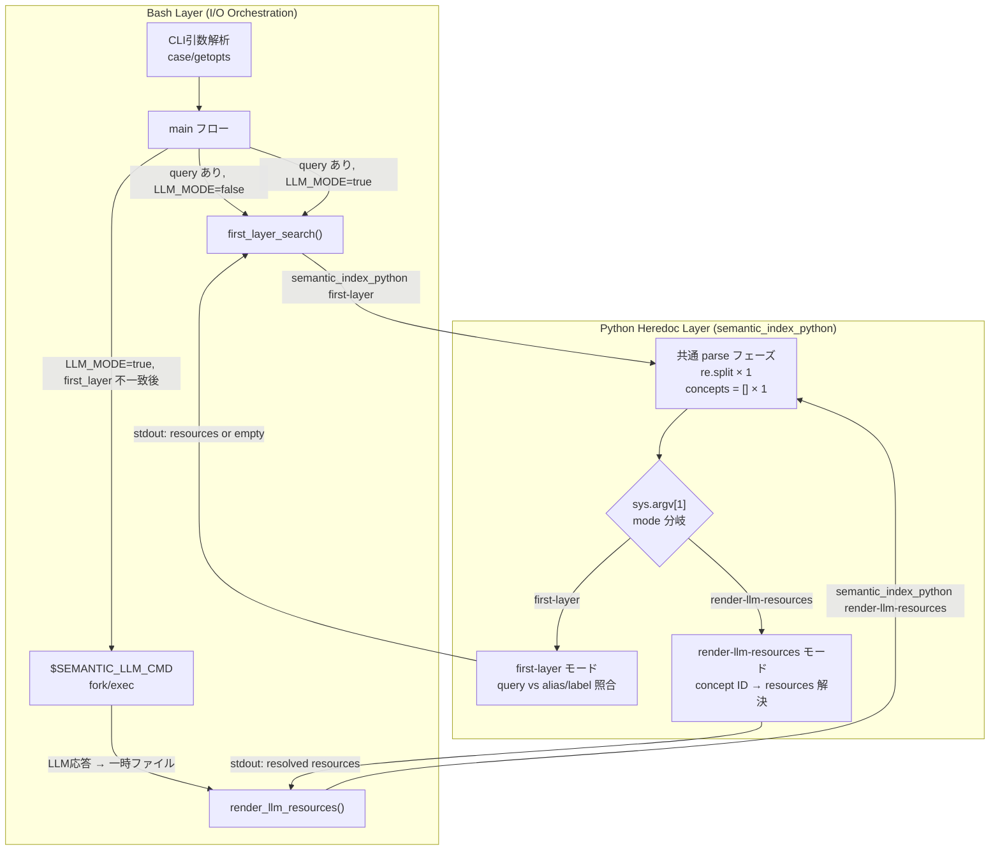
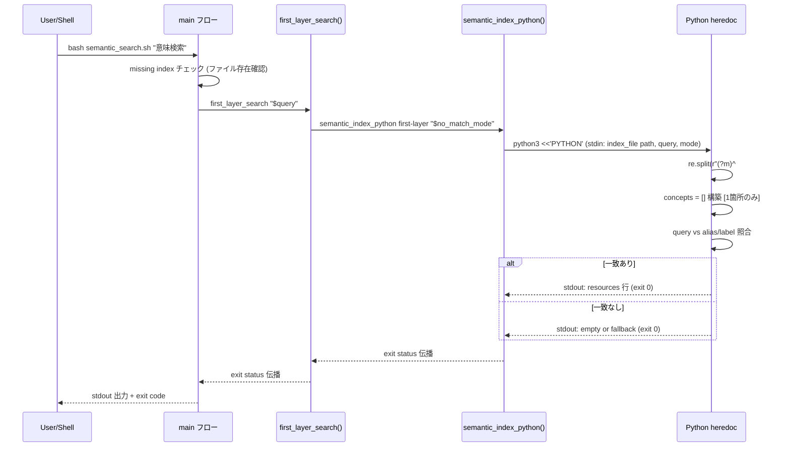
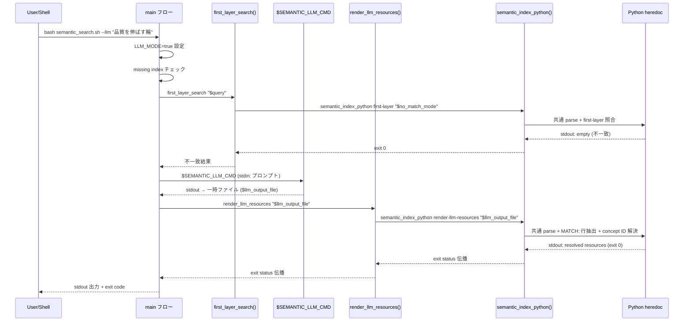
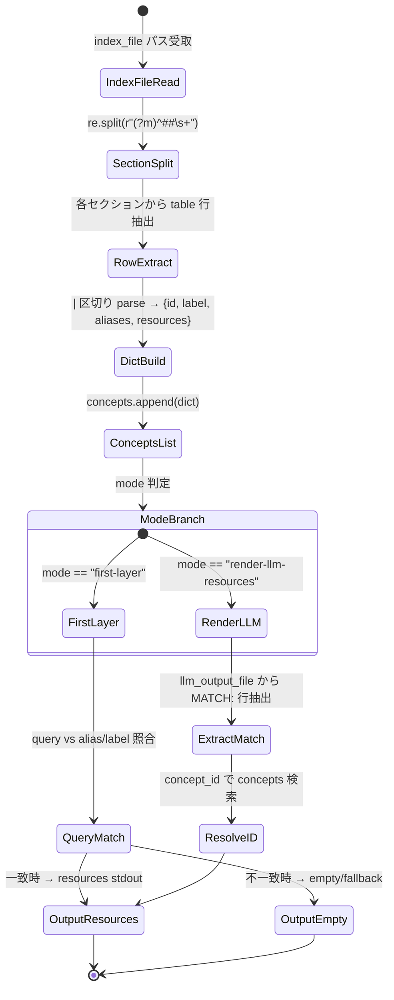

---
codd:
  node_id: detailed_design:mode-dispatch-flow
  type: design
  depends_on:
  - id: design:system-design
    relation: depends_on
    semantic: technical
  depended_by:
  - id: plan:implementation-plan
    relation: depends_on
    semantic: technical
  - id: test:test-strategy
    relation: depends_on
    semantic: technical
  conventions:
  - targets:
    - function:semantic_index_python
    reason: first-layer / render-llm-resources 両モードの入出力フォーマットが既存Bats期待値と完全一致すること。モード追加時は本設計文書の更新が必須。
  - targets:
    - script:semantic_search
    reason: re.split出現箇所1箇所・concepts構築1箇所への削減が本リファクタリングの必達要件。詳細設計で関数境界と責務を確定しコード実装前に検証可能とすること。
  modules:
  - semantic_search
---

# 詳細設計 — semantic_index_python モード分岐・データフロー・シーケンス図

## 1. Overview

本設計書は `scripts/semantic_search.sh` 内に新設される `semantic_index_python()` 関数のモード分岐メカニズム、データフロー、および呼び出しシーケンスを詳細に定義する。上位設計書（design:system-design）で確定した Before/After アーキテクチャに基づき、`first-layer` モードと `render-llm-resources` モードの2つの実行パスがどのように単一 Python heredoc 内で分岐し、各 Bash 関数（`first_layer_search`、`render_llm_resources`）とどのようなインターフェース契約で接続されるかを規定する。

### 本設計書が保証する制約

| 制約ID | 対象 | 内容 | 検証手段 |
|--------|------|------|----------|
| R1 | `function:semantic_index_python` | `re.split` 出現1箇所、`concepts` 構築1箇所への削減 | `grep -c 're.split' scripts/semantic_search.sh` = 1 |
| R2 | `function:first_layer_search`, `function:render_llm_resources` | Markdown table parse ロジックを直接保持しない（I/O orchestration のみ） | 関数本体に `python` / `heredoc` / `re.split` が不在であること |
| R3 | `script:semantic_search` | CLI互換性・出力互換性・exit status 伝播の3制約 | 既存 Bats 4テスト全PASS + E2E 6ドメイン全PASS |

### 非機能要件（性能閾値）

| 指標 | 絶対閾値（リリースゲート） | 調査トリガー（ADR D3） | 測定方法 |
|------|--------------------------|----------------------|----------|
| alias hit 実行時間 | ≤ 53ms（5回平均） | before基準値の ±20% 超過 | `bash scripts/semantic_search.sh 意味検索` 5回計測 |
| LLM fallback(mock) 実行時間 | ≤ 109ms（5回平均） | before基準値の ±20% 超過 | `env SEMANTIC_LLM_CMD="$mock" bash scripts/semantic_search.sh 品質を伸ばす輪` 5回計測 |

絶対閾値を超過した場合は無条件で不合格とする。±20% 超過だが閾値内の場合は原因調査を実施するが、リリースはブロックしない。

### 規約準拠宣言

- **R1制約（`function:semantic_index_python`）**: §2 のシーケンス図およびデータフロー図において、`re.split` と `concepts = []` が単一 Python heredoc 内の共通 parse フェーズにのみ配置される構造を図示する。モード追加時は本設計文書の更新が必須である。
- **R2制約（`function:first_layer_search`, `function:render_llm_resources`）**: §2 のシーケンス図において、両 Bash 関数が `semantic_index_python` への1行呼び出しのみを行い、parse ロジックを保持しないことを明示する。
- **CLI互換性・出力互換性・exit status伝播（`script:semantic_search`）**: §2 のシーケンス図において exit status 伝播チェーンを図示し、§4 において Bats テスト期待値との完全一致を実装条件として規定する。`first-layer` / `render-llm-resources` 両モードの入出力フォーマットが既存 Bats 期待値と完全一致することをリリースブロッキング条件とする。

## 2. Mermaid Diagrams

### 2.1 モード分岐フロー



**所有権と責務境界:** `semantic_index_python()` は Markdown table の parse ロジック（`re.split` によるセクション分割、row parse、dict 構築）の唯一の所有者である。Bash レイヤーの `first_layer_search()` と `render_llm_resources()` は I/O orchestration（引数受け渡し、一時ファイル管理、`$SEMANTIC_LLM_CMD` 起動、exit status 制御）のみを担い、parse 処理を一切保持しない。この境界を越えて parse ロジックが Bash 関数に漏出した場合、R2制約違反として `tests/e2e/refactor-integrity.spec.bats` で検出される。

### 2.2 シーケンス図 — first-layer モード実行パス



**exit status 伝播チェーン:** `set -euo pipefail` により、Python heredoc の exit code は `semantic_index_python()` → `first_layer_search()` → `main` → プロセス exit code へ直接伝播する。中間でのステータス握りつぶしは発生しない。既存 Bats テストの `assert_success` / `assert_failure` 期待値はこの伝播経路に依存しており、リファクタリング後も同一の伝播が維持される。

### 2.3 シーケンス図 — render-llm-resources モード実行パス（LLM fallback）



**LLM コマンド実行経路の不変性:** `$SEMANTIC_LLM_CMD` の fork/exec は Bash レイヤー（main フロー）に残置され、`semantic_index_python` 内部では LLM コマンドを起動しない。`SEMANTIC_LLM_CMD` 環境変数によるコマンド差替え（テスト用 mock 含む）は before 同様に機能する。LLM コマンドが非ゼロで終了した場合、`semantic_search.sh` も非ゼロで終了する。

### 2.4 データフロー状態図 — parse パイプライン



**parse パイプラインの単一所有:** `IndexFileRead` から `ConceptsList` までの5ステップはモード非依存の共通処理であり、`semantic_index_python()` 内の Python heredoc にのみ実装される。この共通パイプラインが2箇所以上に存在する場合、R1制約違反として `grep -c 're.split' scripts/semantic_search.sh` ≠ 1 で静的検出される。`ModeBranch` 以降の分岐ロジックも同一 heredoc 内に存在し、モード追加時は本設計文書の更新とともに `sys.argv[1]` の分岐条件を拡張する。

## 3. Ownership Boundaries

### 3.1 コンポーネント所有権マトリクス

| コンポーネント | 所有者 | 責務 | 禁止事項 |
|---------------|--------|------|----------|
| `semantic_index_python()` | Python heredoc（単一実装点） | Markdown table parse、concepts 構築、mode 分岐、照合/解決ロジック | LLM コマンド起動、一時ファイル作成、CLI 引数解析 |
| `first_layer_search()` | Bash 関数 | `semantic_index_python first-layer` 呼び出し、引数中継、exit status 伝播 | `re.split`、`concepts` 構築、Python heredoc 保持 |
| `render_llm_resources()` | Bash 関数 | `semantic_index_python render-llm-resources` 呼び出し、`$llm_output_file` パス渡し、exit status 伝播 | `re.split`、`concepts` 構築、Python heredoc 保持 |
| CLI引数解析 | main フロー（case/getopts） | `--help`、`--llm`、unknown option、no query の判定と exit | リファクタリングスコープ外（変更禁止） |
| LLM コマンド実行 | main フロー（Bash） | `$SEMANTIC_LLM_CMD` fork/exec、一時ファイルへの stdout リダイレクト | リファクタリングスコープ外（変更禁止） |
| exit status 伝播 | `set -euo pipefail` チェーン | Python → Bash 関数 → main → プロセス exit code | 中間での status 握りつぶし禁止 |

### 3.2 再利用・インポート期待

- **parse ロジックの再利用禁止:** `re.split` によるセクション分割と `concepts` 構築は `semantic_index_python()` 内の Python heredoc にのみ存在し、他の Bash 関数や外部スクリプトからの直接再実装は R1制約違反となる。新規モード追加時は `semantic_index_python` 内に `elif mode == "new-mode":` 分岐を追加する。
- **Bash 関数の薄いラッパー化:** `first_layer_search()` と `render_llm_resources()` は `semantic_index_python` への呼び出しを1行で行う薄いラッパーであり、テスト時は `semantic_index_python` を直接呼び出してモード単位のユニットテストが可能である。
- **テストヘルパーの共有:** `tests/e2e/helpers/` 配下の `setup.bash`、`assertions.bash`、`before_snapshot.bash`、`mock_llm.sh` は E2E テスト6ドメイン間で共有される。所有権は E2E テストスイートに帰属し、ユニットテスト (`tests/unit/`) からは参照しない。

### 3.3 モード追加時のプロトコル

新規モードを `semantic_index_python` に追加する場合、以下の手順を必須とする：

1. 本設計文書（`docs/detailed_design/mode-dispatch-flow.md`）のモード分岐フロー図およびシーケンス図を更新
2. `semantic_index_python` 内 Python heredoc に `elif mode == "<new-mode>":` 分岐を追加
3. 対応する Bash ラッパー関数を新設（I/O orchestration のみ）
4. `tests/e2e/refactor-integrity.spec.bats` に新モードの検証を追加
5. 既存 Bats 4テストが全PASS であることを確認

### 3.4 リファクタリング対象外の不変コンポーネント

以下は変更スコープ外であり、before/after で完全同一を維持する：

- CLI引数解析（case/getopts 分岐）
- `$SEMANTIC_LLM_CMD` 実行経路
- `set -euo pipefail` 宣言
- index ファイルの存在チェック
- ヘルプテキスト出力
- 既存 Bats テストファイル（`tests/unit/test_semantic_search.bats`）

## 4. Implementation Implications

### 4.1 `semantic_index_python()` のインターフェース契約

```bash
semantic_index_python() {
    local mode="$1"
    # mode 固有の追加引数は $2 以降で受け取る
    python3 <<'PYTHON' "$mode" "$@"
    # ... 単一 Python heredoc ...
PYTHON
}
```

**引数渡し規約:**

| モード | $1 | $2 | stdin | stdout |
|--------|----|----|-------|--------|
| `first-layer` | `"first-layer"` | `"$no_match_mode"` | なし（index_file パスは環境変数または固定パス） | resources 行（一致時）または空文字列（不一致時） |
| `render-llm-resources` | `"render-llm-resources"` | `"$llm_output_file"` | なし | resolved resources 行 |

**Python heredoc 内での引数アクセス:**

```python
import sys
mode = sys.argv[1]
# mode固有引数
if mode == "first-layer":
    no_match_mode = sys.argv[2]
elif mode == "render-llm-resources":
    llm_output_file = sys.argv[2]
```

### 4.2 出力フォーマットの完全一致要件

`first-layer` モードと `render-llm-resources` モードの stdout 出力は、before コードの2つの Python heredoc がそれぞれ生成していた文字列と1バイト単位で同一でなければならない。これは `tests/unit/test_semantic_search.bats` の以下の4テストケースで検証される：

1. **alias hit テスト:** `assert_output` で期待される resources 文字列との完全一致
2. **LLM fallback テスト:** mock LLM の `MATCH: <concept_id>` 出力に対する resources 解決結果の完全一致
3. **エラーパス（missing index）テスト:** stderr 出力文字列と exit status の一致
4. **エラーパス（no query）テスト:** stderr 出力文字列と exit status の一致

### 4.3 静的検証によるリリースゲート

実装完了後、以下の `grep -c` コマンドによる静的検証をリリースゲートとして実行する：

```bash
# R1制約: re.split が1箇所のみ
test "$(grep -c 're\.split' scripts/semantic_search.sh)" -eq 1

# R1制約: concepts = [] が1箇所のみ  
test "$(grep -c 'concepts = \[\]' scripts/semantic_search.sh)" -eq 1

# R2制約: semantic_index_python 関数が存在
grep -q 'semantic_index_python()' scripts/semantic_search.sh

# R2制約: first_layer_search 内に python/heredoc/re.split が不在
# (refactor-integrity.spec.bats で関数本体を抽出して検証)

# 構文チェック
bash -n scripts/semantic_search.sh
```

### 4.4 exit status 伝播の実装要件

`set -euo pipefail` が宣言された状態で、Python heredoc 内で `sys.exit(N)` が呼ばれた場合の伝播パス：

```
sys.exit(N)
  → python3 プロセス exit code = N
    → semantic_index_python() 関数 exit code = N
      → first_layer_search() / render_llm_resources() exit code = N
        → main フロー（set -e により即座にスクリプト終了、exit N）
```

`render-llm-resources` モードで `MATCH:` 行が見つからない場合の挙動は before コードの挙動を踏襲し、resources が空の状態で exit 0 を返す（エラーではなく空結果として扱う）。

### 4.5 性能への影響と軽減策

リファクタリングにより、`render-llm-resources` モード呼び出し時にも共通 parse フェーズが実行される。before コードでは `render_llm_resources()` 内で独自に parse していたため、計算量は同等である。ただし以下に注意する：

- Python インタープリタの起動コストは `semantic_index_python` 呼び出しごとに1回発生する（before も同様に呼び出しごとに1回）
- `first-layer` → LLM fallback → `render-llm-resources` の流れでは Python 起動が2回発生する（before も同様に2回）
- index ファイルの読み込みも2回発生する（before と同一の回数）

性能閾値（alias hit ≤ 53ms、LLM mock ≤ 109ms）は before 基準値と同一であり、parse ロジックの統合による追加オーバーヘッドは発生しない設計である。

### 4.6 実施順序と各ステップでの検証

| Step | 実装内容 | 検証コマンド | 失敗時のロールバック |
|------|----------|-------------|-------------------|
| 1 | `semantic_index_python()` 関数追加（呼び出し元なし） | `bash -n scripts/semantic_search.sh` exit 0 | 関数定義を削除 |
| 2 | `first_layer_search()` 本体を呼び出し1行に差替え | `bash -n` + Bats 4/4 pass | before の heredoc を復元 |
| 3 | `render_llm_resources()` 本体を呼び出し1行に差替え | `bash -n` + Bats 4/4 pass | before の heredoc を復元 |
| 4 | 構文チェック最終確認 | `bash -n scripts/semantic_search.sh` | — |
| 5 | 回帰テスト最終確認 | `bats tests/unit/test_semantic_search.bats` 4 tests, 0 failures | Step 2-3 のロールバック |
| 6 | 性能計測 | alias hit ≤ 53ms, LLM mock ≤ 109ms | 原因調査・最適化 |

Step 2 と Step 3 は独立して検証可能であり、一方が失敗した場合でも他方に影響しない。ただし Step 3 は Step 2 の完了後に実施すること（`first_layer_search` の呼び出し経路が `render_llm_resources` の LLM fallback パスに影響するため）。

### 4.7 テスト戦略との対応

| テストドメイン | 検証対象モード | 本設計書との対応 |
|---------------|--------------|----------------|
| `tests/e2e/first-layer.spec.bats` | `first-layer` | §2.2 シーケンス図の alias hit パス |
| `tests/e2e/llm-fallback.spec.bats` | `render-llm-resources` | §2.3 シーケンス図の LLM fallback パス |
| `tests/e2e/refactor-integrity.spec.bats` | 両モード | §3 所有権境界の静的検証 |
| `tests/e2e/cli-options.spec.bats` | モード分岐前 | §3.4 不変コンポーネントの保証 |
| `tests/e2e/index-parsing.spec.bats` | 共通 parse フェーズ | §2.4 データフロー状態図 |
| `tests/e2e/performance.spec.bats` | 両モード | §1 非機能要件の閾値検証 |

## 5. Open Questions

| ID | 質問 | 背景 | 影響範囲 | 現時点の方針 |
|----|------|------|---------|-------------|
| OQ-1 | `semantic_index_python` の Python heredoc が100行を超えた場合に外部 `.py` ファイルへ分離するか | ADR F2 で「100行超過時に判断」と規定。before の2箇所合計は約170行だが共通化により100行前後に削減される見込み | 関数の実装形式、引数受け渡し方式（環境変数 vs コマンドライン vs stdin）、テスト粒度（Python 単体テスト追加の可否） | 初回リリースでは heredoc 内に維持し、実装完了後に `wc -l` で計測。100行超過時に分離 ADR を起票する |
| OQ-2 | `first-layer` モードで不一致時の `no_match_mode` 引数が取りうる値の完全リスト | before コードでは暗黙的にフォールバック処理が行われていたが、明示的な mode 値としてどのバリエーションが存在するか実装レベルで未確定 | `semantic_index_python` の `first-layer` モード内分岐の網羅性、E2E テストケースの設計 | before コードから `no_match_mode` の取りうる値を実装時に抽出し、本設計書の §2.2 を更新する |
| OQ-3 | 共通 parse フェーズでの不正 Markdown（セクション0件、空 table、重複 alias）に対するエラーハンドリング方針 | parse ロジックが `semantic_index_python` に集約された結果、不正入力時の挙動が単一箇所で決定される。ADR F3 で「実装完了後に境界値テスト追加」と規定 | `semantic_index_python` のエラー出力フォーマット、exit status、既存テストとの互換性 | 初回リリースでは before コードと同一の挙動を維持（暗黙的に空結果 or Python traceback）。ADR F3 に従い実装完了後に明示的なエラーハンドリングと境界値テストを追加する |
| OQ-4 | 将来の第3モード追加時に `sys.argv[1]` 分岐が3つ以上になった場合のディスパッチ方式 | 現時点では2モード（`first-layer`、`render-llm-resources`）のみだが、拡張時に `if/elif` チェーンが肥大化する可能性 | Python heredoc 内の制御構造、テストの網羅性、本設計文書の更新頻度 | 3モード以下では `if/elif` を維持。4モード以上になった時点で dict ディスパッチ（`dispatch = {"mode": handler_func}`）への移行を検討し、その際に heredoc 100行制限（OQ-1）と合わせて外部ファイル化を判断する |
