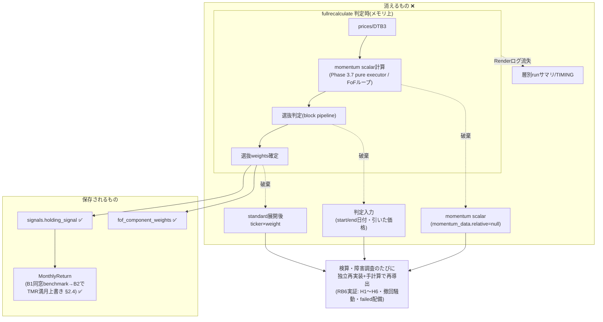
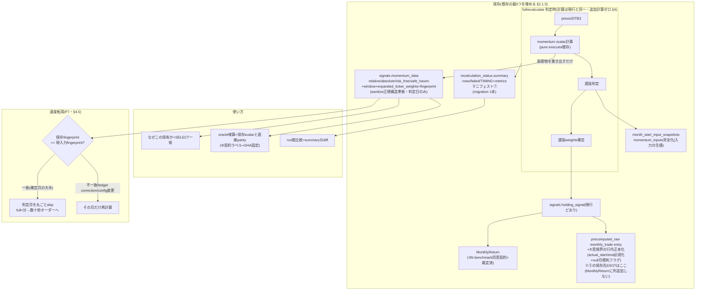

<!-- gist-master: 35d37064b80a2d576eca667db2a655f9 dm-decision-provenance-asis-tobe-5w1h_20260813.md -->
# DM-Signal 判定プロヴェナンス保存 — AsIs/ToBe 5W1H設計書 v1.9

> ★v1.3重要: 家老独立レビュー(2026-08-13 17:55・BLOCK 7件)によりv1.2の3つの事実誤認を訂正済み — (誤1)sanitizerは未知キーを通さない=allowlist方式(`sanitize.py:83-106`) (誤2)`context.momentum_data`は"values"キー構造でなく**ticker直下scalarのflat map** (誤3)`recalculation_status`へのsummary追加は**migration必須**(列はid/start_time/end_time/status/mode/error_messageのみ、`models.py:1200-1205`)。以下本文は訂正済みの正。
<!-- semantic-links: [[recalculate_pipeline]] [[momentum_window]] [[dm-fullrecalculate-cache-reuse-asis_20260813]] -->

> ★前提情報のないLLM/人へ: 本書だけで自己完結する。§1(5W1H)→§2(AsIs)→§3(ToBe)→§4(速度保護)→§5(工程)の順に読め。ToBeは**殿裁定済みの方向**(2026-08-13 17:36「専用の設計書を作ろう。実装にあたって計算速度が低下しない工夫も必要だ」)だが、**実装はRB6収束後**(生成コード変更がoracle突合の安定を乱すため)。★状態更新2026-08-14 03:05: RB6月次=33748/33748 exactでCLEAR確定(殿裁定)。metrics 47指標検算=shard A portfolio側8160/8160・shard B 13056/13056(GATE CLEAR)・shard D union47(重複0欠落0)全てexact。benchmark残差(top-level104+A班1323起点の保存月次50行)は将軍D0逆算検証で全50行がPF同窓値と一致→**殿裁定02:59「同窓比較が正」で仕様クローズ**(knowledge:a58d14f58926acb2、§3.25⑤b)。残=44fa8aad窓境界異常のPF側別件RCAのみで、RB6完全収束=本書P0着手可能が目前(正本=rollback計画書v1.6 §7.2)。

## §1 5W1H(前提)

- **What(何を保存するか)**: fullrecalculate/再計算の各リバランス判定について「保有(結果)」だけでなく**「その保有を選んだ理由」= 判定プロヴェナンス**を保存する。具体: ①各候補アセットのmomentum scalar ②判定に使ったstart/end日付と実際に引いた価格 ③standard PFの展開後ticker×weightスナップショット ④層別run結果サマリの台帳化。⑤月次return窓境界の行内正本化 ⑥FoF初月stub as-of weightスナップショット ⑦metricsマニフェスト ⑧検算契約ラベル+artifact SHA固定(§3.25=RB6月次検算実証からの追加4点)。
- **Why(なぜ)**: 現行は「結果(holding_signal)は残るが理由(数値と入力)が残らない」。2026-08-13のRB6独立oracle構築では、保存値が無いためモメンタム・リターンを一から独立再実装して検算する必要があった(cmd_4296 AC4=momentum scalar保存0件でparity検証不能)。プロヴェナンスがあれば「なぜこのPFが選ばれた」の検証がSQL一発になり、障害調査・oracle検算・殿への説明が全て高速化する。
- **Who**: 設計=将軍(殿裁定を仰ぐ)。実装=家老配備の忍者。検証=軍師レビュー+将軍の本番一次確認。使用者=デバッグを行う全員+殿(調査下問への即答材料)。
- **When**: 設計=2026-08-13。**実装はRB6(prices独立oracle全量)CLEAR後**。理由: 生成コードの変更はoracle突合中の派生データ安定を乱す。
- **Where(一次情報)**: `backend/app/jobs/recalculate_fast.py`(Phase 4判定ループ・`momentum_data`書込み箇所)・`recalculate_fof.py`・`signals`テーブル(`momentum_data` JSONカラム=既存)・`recalculation_status`台帳。仕様正本=`dm-fullrecalculate-cache-reuse-asis_20260813.md`(gist 1b875a44)+`cmd_4296_momentum-window-recon_20260813.md`(gist bf4ac198)。
- **How(完了基準)**: full 1回実行後、(a)全リバランス判定行のmomentum_dataにscalar+入力スナップショットが非nullで存在 (b)保存値から手計算した選抜結果がholding_signalと全数一致 (c)**full実行時間がプロヴェナンスなし比で+5%以内**(§4)を数値で証明。

## §2 AsIs(2026-08-13確定・全て一次証拠あり)

### §2.1 残るもの / 残らないもの

| データ | 現状 | 一次証拠 |
|---|---|---|
| 保有シグナル日次履歴(`signals.holding_signal`) | ✅残る | RB6 FoF oracleの入力に使用 |
| 確定月判定の凍結(ledger) | ✅残る | signal_decision_ledger |
| FoF展開後構成(`fof_component_weights`) | ✅残る | schema現物 |
| run identity(git SHA+fingerprint) | ✅残る | `_resolve_source_identity()` |
| **momentum scalar** | ❌残らない | cmd_4296: `momentum_data.relative=null`・`block_results.momentum_values={}`(standard/leaf/nested 3系統とも0件) |
| **判定入力(start/end日付・実際に引いた価格)** | ❌残らない | 同上 |
| **standardの展開後ticker×weight** | ❌残らない | oracle構築時にholdingトークンから毎回再展開した |
| 非リバランス日の判定痕跡 | `{"skipped":true}`のみ | cmd_4296 §3 |
| 層別run結果(rows/failed/TIMING) | Renderログのみ(流失する) | recalculation_statusには件数サマリなし |

### §2.1.5 重要発見 — 「器」は既に3つ実装済みで中身が空(コード現物読解 2026-08-13 17:45)

ToBeはゼロから作るのではない。**保存の器は既に存在し、埋まっていないだけ**である。

| 既存の器 | 実装現物 | 現状 |
|---|---|---|
| ①momentum_dataの正規スキーマ | `sanitize_momentum_data`(`utils/sanitize.py:51-59`)のfast-pathが期待する構造=`{"relative":[{"symbol","value"}...], "absolute":{...}, "risk_free":{...}, "safe_haven":{...}, "weights":{...}}` — **scalarを入れる形が既に定義済み** | pipeline経路のpm_dataがこの形を埋めず、relative=null/values={}のまま保存(cmd_4296実測) |
| ②pipeline診断(block_results) | `pipeline/engine.py:128-142` — 各blockの`input_tickers/output_tickers/filtered_out/params/momentum_values/execution_ms`と最終`weights`(`:183-190`)を組み立てて返す機構が完備。**軍師突合注記(2026-08-14)**: terminal block(`:170-178`)は`filtered_out/momentum_values`を持たない(結果出力のみゆえ実害なし) | `momentum_values = context.momentum_data.get("values",{})`が**空**(blockがvaluesへscalarを書いていない)。**ただしstandard主経路はpure executor(`engine.py:234-264`, diagnostics常時空 `:261-262`)であり、この診断機構はprovenanceの実装土台にしない**(家老レビュー(1): 本表は「器の存在」の記録であり、実装はpure executor結果からの別dict構築=§3.1に一本化) |
| ③月初入力スナップショット | `recalculate_fast.py:403-471`の`_build_month_start_input_snapshot`+`_upsert_month_start_input_snapshots` — **判定入力を専用表へUPSERTする機構が既に稼働** | **家老レビュー(2)で実態確定**: `momentum_inputs`が空構造の写しである上、(a)価格payloadは**latest 1点のみ**(`:426-440`)でstart/end実価格**対**を持たない (b)呼出はstandard経路のみ(`:2497-2508`/`:2834-2849`)で**FoFのsnapshotは0件**。→ P1b(standard窓payload対)/P2b(FoF snapshot新設)の工程が必要(§5) |

~~速度面の既存資産: `skip_diagnostics`フラグに乗る~~ → **v1.9撤回(家老レビュー(1))**: standard主経路はpure executorで`skip_diagnostics`を通らない。速度保護は「pure executor結果からの別dict構築を判定日のみ行う」こと自体で担保する(§4.1)。

∴ 本設計の実装実体は「新機構の追加」ではなく「**(a)pure executor/FoFループの計算済み結果から判定日のprovenance dictを構築してmomentum_dataへ埋める (b)スナップショット表をstart/end実価格対+FoF対応へ完全化する(P1b/P2b) (c)runサマリ台帳をmigrationで追加する**」である(v1.9で(a)(b)(c)を家老レビュー後の実態へ更新)。

### §2.2 AsIsの帰結(実害の実証)

1. RB6検算(2026-08-13)で独立runnerを一から実装する必要が生じた(保存値とのparityが構造的に不可能)。
2. 「なぜ2026-08-01にTMV/TQQQが選ばれたか」の検証に、コード追跡+DB価格照会+手計算(cmd_4296 §2)を要した — プロヴェナンスがあればSELECT一発。
3. run273事案(cache混線)・run351事案(holding seed欠落)の診断で、判定時点の入力を事後再構成する工数が支配的だった。

### §2.3 計測期間仕様(判定の定義。cmd_4296正本の要約)

- standard: 日次prices closeの営業日窓(月=21営業日)。end=前月末(最終取引日close、ラベルは暦月末)。
- leaf/nested FoF: 子PF `monthly_returns.cumulative_return`(close)の暦月差分。end=前月末、start=n暦月前の月末。深度差なし。
- リターン境界: 当月最初の取引日→翌月最初の取引日(`monthly_boundary.py:81-99`)。

### §2.4 benchmark列の窓機構(2026-08-14 03:05コード現物確定 — ⑤b裁定の実装根拠)

`MonthlyReturn.benchmark_return/_open`の生成は**B1/B2の2段構造**(`generators/monthly_returns.py`):

1. **B1(:560-611)**: benchmarkをPFと**同じ`calc_start_date→calc_end_date`窓**のprice ratioで計算(`price_ratios[benchmark_ticker]`はPF構成銘柄と同一のratio計算バッチ、fallbackも`get_benchmark_ratio_from_cum`/`get_price_ratio_both`とも同窓引数)。**同窓は意図された実装**である。
2. **B2(:613-619)**: `if year_month in benchmark_ticker_returns:` の時だけTMR満月値で上書き(コメント「Single Source of Truth」Task D: 013-benchmark.md)。供給元は`recalculate_fof.py:647-662`のTMR共有キャッシュ(`monthly_return is not None`でfilter、openがNULLならcloseを流用 :662)。

∴ 保存benchmark列は「**B2適用月=TMR満月値**」と「**B2非適用の初月stub行等=B1同窓値**」の**混在**である。RB6実測: 混在の同窓側=50行(初月stub48+44fa8aad expanded_switch境界2)で、全行がPF `actual_start/end`同窓のSPY値と10dp一致(逆算検証済み)。殿裁定02:59により**同窓が正**(比較の公平性)。

**家老レビュー(3)による契約リスクの確定(2026-08-14 03:20)**: B2は`if year_month in benchmark_ticker_returns`の**月keyのみで無条件に満月上書き**する — 「stub/partial月はB1同窓のまま」は現状の偶然の産物であり、コード変更でstub行にB2が適用されると同窓契約が静かに壊れる。実装解禁時(P0.5)に**契約の固定**を行う: (a)canonical境界月のみB2可・partial/stub/switch月はB1固定の条件を明示化 (b)**初月stub48行+44fa8aad 2行のregression fixture必須**(保存値10dp一致を固定)。44fa8aad窓の正体はexpanded_switch契約(`monthly_boundary.py:64-79`)=意図仕様と別件RCAで確定済み(2026-08-14 03:21・欠陥0)。

### §2.5 AsIsフロー図(何が消えるか)



## §3 ToBe

### §3.1 保存内容(判定プロヴェナンス・4点)

**書込み先は既存の`signals.momentum_data`(JSON)を埋める。新テーブルは作らない**(シンプル最優先=殿裁定2026-08-13 03:46の延長。schema migration不要・読み出しAPIも既存)。**スキーマは発明せず、`sanitize_momentum_data`が既に期待する正規構造(§2.1.5①)へ準拠して埋める** — sanitizerのfast-pathをそのまま通り、既存読み出しコードとの互換も保たれる。

リバランス判定日の行に以下を格納(既存キーは既存の意味のまま、追加は`window`/`provenance_version`のみ):

```json
{
  "provenance_version": 1,
  "relative": [
    {"symbol": "TECL", "value": -0.1112306076},
    {"symbol": "TQQQ", "value": "..."}
  ],
  "absolute": {"symbol": "...", "value": "..."},
  "risk_free": {"symbol": "DTB3", "value": "..."},
  "safe_haven": {"symbol": "...", "value": "..."},
  "weights": {"TQQQ": 1.0},
  "window": {"lookback": [{"months": 12, "weight": 1.0}],
              "end_date": "2026-07-31", "end_actual": "2026-07-30",
              "start_actual_by_symbol": {"TECL": "2026-07-02"}}
}
```

- `relative/absolute/risk_free/safe_haven`は§2.1.5①の既存定義。**実装上の訂正(家老レビュー2026-08-13)**: (a)`sanitize_momentum_data`は**allowlist方式で未知キーを落とす**(`sanitize.py:83-106`)ため、`window`/`provenance_version`/`expanded_ticker_weights`をallowlistへ明示追加し、**旧出力が1バイトも変わらないfixture**を先に固定する。 (b)`context.momentum_data`は**ticker直下scalarのflat map**としてblock/executorが使用中 — この構造を"values"入れ子へ変形するのは**禁止**(全blockの読み書きを壊す)。provenance用には**別dictへcopy**して組み立てる。 (c)standardの**主経路はpure executor**(Phase 3.7の事前計算、`engine.py:234-264`のdiagnostics常時空)であり`skip_diagnostics`は非使用 — slow engineへ戻さず、**pure executorの計算結果から月初判定日のprovenanceを構築**する(判定日は月初のみゆえ低コスト)。
- **start/endの実価格**は`momentum_data`へ重複格納せず、**既存の月初入力スナップショット表(§2.1.5③)の`momentum_inputs`を完全化**して持つ(器の役割分担: signals=判定結果と根拠scalar、snapshot表=入力の生値)。
- FoFは`relative`のsymbolが子PF ID、valueが`cumulative_return`月次差分のscalar。
- **展開後ticker×weightは`expanded_ticker_weights`の別キー**(家老レビュー: 既存`weights`はmonthly_trade/monthly_returnsが読む**選抜weight契約**ゆえ意味を上書きしない)。
- 非リバランス日は現行`{"skipped":true}`を維持(容量とhot pathを守る。§4)。
- **後方互換契約(軍師レビュー2026-08-13)**: provenance_versionは**additive-only**(既存キーの意味・型変更禁止、追加のみ)。読み手(sanitize・表示系・oracle)は**未知キーを無視**する契約とし、fixtureで担保する。
- **multi-view FoF**: lookback配列は複数view(例: 3M/6M/12Mの重み付き)をそのまま`window.lookback`へ列挙する(cmd_4296のGSシン追い風-常勝12M view実例の形式)。単一lookbackの例示のみで実装するな。
- **fof_component_weightsのtemporal確認(軍師指摘・P1前の確認事項)**: 同表が判定時点snapshotか最新値上書きかをコード現物で確定する。最新値上書きなら`weights`(provenance)が**唯一の時点記録**となり、保存の必須度が上がる。
- ~~pipeline診断は判定日のみ`skip_diagnostics=False`で残す~~ → **v1.9撤回(家老レビュー(1)・自己矛盾解消)**: standard主経路はpure executorゆえこの案は成立しない。block別診断が必要になった場合は将来の別設計とし、本書のprovenanceはpure executor結果からの構築に**一本化**する。sanitize JSON例の全entryは`{"symbol","value"}`対を必須とする(`sanitize.py:78-81`のentry value必須契約に準拠 — 家老レビュー(6))。

### §3.2 層別runサマリの台帳化

full/portfolio再計算の終端で、`recalculation_status`行へ`summary` JSON 1フィールドを追記: `{"rows":...,"portfolios":...,"failed":...,"timing":{...}}`。**家老レビュー訂正: 現テーブル列は`id/start_time/end_time/status/mode/error_message`のみ(`models.py:1200-1205`)ゆえ`summary`列の追加は`migrations.py`のmigration必須**(ADD COLUMN 1本・nullable・既存行影響なし)。**v1.9追補(家老レビュー(5))**: migrationだけでは足りず、(a)writer関数へsummary引数追加(`recalc_status.py:230-234`は現状summary引数なし) (b)全caller更新 (c)**失敗時二値契約**の明文化 — 現行writerは「DB errors never block」設計ゆえ、summary書込み失敗はrun失敗にせずWARNログ+summary=nullで完了とする(記録欠落は次runで検知可能、runを止める価値はない)。`migrations.py:1062-1081`は現状table不存在時CREATEのみでADD COLUMN分岐がない点も実装対象。Renderログ流失後も前回runと比較可能になる。

### §3.25 RB6月次検算の実証から追加する保存項目(2026-08-14新設・殿指示02:10「事前に存在したら作業効率が上がったもの」)

> ★背景: RB6月次検算(2026-08-13〜14)は最終的に33748/33748 exactでCLEARしたが、収束までに仮説H1〜H6・撤回騒動1回・failed配備複数を要した。躓きは全て「保存されていない判定情報を検算側が再導出する」工程で起きた。以下4点が事前に存在すれば、各躓きはSQL/1比較で即決していた。各項目に「何の苦労を消すか」を対で記す。

| # | 追加保存項目 | 保存先 | 消える苦労(RB6実証) |
|---|---|---|---|
| ⑤ | **月次return窓境界の行内正本化**: 確定月ごとに`return_start_date`/`return_end_date`(実取引日)を必須保存。`price_movement=null`月は「Cash 100%→return=0」の規則を機械可読フラグで保存(暗黙規則にしない)。**保存先SSOT裁定(v1.9・家老レビュー(4))**: 正本は`precomputed_raw` monthly_trade entryのみ。`MonthlyReturn`(`models.py:252-284`に境界列なし)へは**列追加しない** — 二重保存は乖離の温床。検算・表示はprecomputed_raw側の境界を引く | `precomputed_raw` monthly_trade entry(既存`actual_start_date`/`actual_end_date`の必須化+null月規則フラグ) | **FoF残101 timingの真因**=窓規則(`monthly_boundary.py:45-108` §0.6)の検算式への写し漏れ。検算者がコードから窓規則を再導出する必要があり、暦月境界仮定で1093件の偽mismatchも発生。行内に境界日付があれば検算は「保存境界で価格を引く」だけになり、窓規則の知識が不要になる |
| ⑤b | **benchmark同窓契約の明文化**(殿裁定2026-08-14 02:59): `MonthlyReturn.benchmark_return/_open`はPFの`actual_start/end`**同窓**でbenchmark tickerを計算する(初月stub=月末→翌月初窓を含む)。満月TMR値との差は仕様であってバグではない。実装現物=B1同窓計算(`monthly_returns.py:560-611`)/B2 TMR上書き(:613-619)の混在機構は§2.4 | ⑤の境界日付をbenchmark検算にもそのまま適用。加えて表示系との役割分担を明記: compareページのSPY/TQQQは`compare_returns.py:222-225`でTMR**直参照**(満月)、PF行内benchmark列は同窓 — **2系統は役割が違い統一対象ではない** | RB6 benchmark残差50行(初月stub48+境界異常2)を「SSOT違反」と誤診しhotfix配備→将軍D0逆算検証(TMR欠落仮説棄却→初月stub特定→窓逆算で全50行PF同窓一致)で停止(knowledge:a58d14f58926acb2)。契約が明文化されていれば誤診・hotfix・停止の全往復が消えた。なおTQQQ側は将軍検算198/198 exact+metrics経路なし(portfolio_metricsのbenchmark_tickerは全204行SPY)で横展開不要を同時証明 |
| ⑥ | **FoF初月stubのas-of weightスナップショット**: 系列初月(stub)行に`weight_asof_date`+適用weight mapを保存 | `signals.momentum_data`のprovenance(§3.1の`expanded_ticker_weights`+`window`へ`asof_date`を追加) | **none25誤分類の真因**=weight as-of日をstub開始日でなく月初/前日と仮定した検算式の誤り。将軍のbde99d02単点実証(stub開始日as-of weightで10dp完全一致)まで25件が「復元不能」と誤判定された。as-of日付が行内にあれば仮定の余地ゼロ |
| ⑦ | **metricsマニフェスト**: run終端で「metric name全列挙(現物47個)+対象行数(102PF×years{0,10}=204)+入力月次系列のSHA256」を保存 | §3.2の`recalculation_status.summary`へ`metrics_manifest`キーを追加(同一migration内) | **metrics実体の3転**(7指標→35キー→47 name)。検算タスク2本が誤った母集団定義でfailed終端した。マニフェストがあれば検算側は目録を推定せず読むだけ |
| ⑧ | **検算契約ラベル+artifact SHA固定**: 検証artifactに`contract`名(例: `saved-value-reverse-parity` / `config-regeneration`)とsource snapshot SHA256を必須メタ化 | 検証runner出力JSONの必須ヘッダ(oracle側規約。DB変更なし) | **H6撤回騒動**(01:50-01:52): 別契約(config再生成)のmismatch 935+21を保存値検算H6の反証と誤認し、CLEARを一時撤回→殿裁定で逆転。契約ラベルが双方のartifactにあれば「契約が違う数値は反証にならない」が機械判定になる |

適用順の含意: ⑤⑥は判定時保存(P1/P2へ統合)、⑦はP3のmigrationへ同乗、⑧はDB非接触ゆえ即日規約化可能(実装解禁前でも検証側規約として先行採用してよい)。

### §3.3 使い方(完成後のデバッグ手順)

- なぜこの保有か: `SELECT momentum_data FROM signals WHERE portfolio_id=? AND date=?` — 1クエリで判定全根拠。
- oracle検算: 保存scalarと独立再計算の直接parity(cmd_4296 AC4が初めて実行可能になる)。
- run間比較: `recalculation_status.summary`同士のdiff。

### §3.4 ToBeフロー図(3器を埋める+速度転用)



## §4 計算速度を低下させない工夫(殿要件・設計制約)

fullの現行実測=TOTAL 7m45s(L2=2m5s/L3=4m21s/L5=41.3s、2026-08-13 run `2026081304021264BB4C`)。**目標: +5%(≈23s)以内**。

1. **新規計算ゼロの原則**: 保存する値は全てPhase 3.7/Phase 4/FoFループが**既に計算しているメモリ上の値**(vectorized momentum dict・選抜結果・展開weight)。プロヴェナンスは「計算の副産物の書き出し」であり、追加の価格照会・momentum再計算を1回もしない。dictから辞書を組むだけ=CPUコストはO(判定数×候補数)の辞書構築のみ。**速度制御の実装は「pure executor/FoFループの計算済み結果から判定日のみprovenance dictを構築する」ことであり、新フラグもengine経路の変更もしない**(v1.9でskip_diagnostics粒度変更案を撤回・§2.1.5)。sanitize経路も既存fast-path(475K+回実行実績の高速版)をそのまま通る。
2. **書込み回数を増やさない**: `signals`行は現行もUPSERTされている。momentum_dataフィールドの中身が大きくなるだけで、**INSERT/UPDATE文の回数は不変**。JSON構築はDB書込みバッチに同乗。
3. **リバランス判定日のみ**: 非リバランス日(圧倒的多数)は現行の`{"skipped":true}`のまま。書込み増分は約240判定月×102PF規模に限定され、日次行の膨張なし。
4. **同期経路に検証を入れない**: 保存時の整合チェック(scalar→選抜の再導出確認)はhot pathで行わず、事後の検証クエリ(§3.3)に任せる — 厳密さは最終checkpointへ集中(殿裁定2026-07-14)。
5. **計測で証明(軍師レビュー2026-08-13で統計化)**: 単一run比較はrun間ゆらぎと区別できないため、**provenanceあり/なし各3回のfullのmedian比較**でTOTAL増分+5%以内を判定し、事前にcanaryでrun間変動幅のベースラインを計測してから閾値判定する。値の不変(monthly_returns hash一致)はcanary→fullの2段 — TIMING復元(2026-08-13)と同じ検証型を再利用。
6. **容量の見積り**: 1判定≈候補5個×数値3個≈500B。102PF×240月×500B≈12MB — pg上で無視できる規模。必要ならJSONB圧縮はpg任せ。
7. **速度計測の指標(家老レビュー2026-08-13)**: TOTALだけでなく**JSON payloadサイズ・WAL量・TOAST発生・DB flush秒をp50/p95/maxで計測** — UPSERT回数不変でもpayload増がDB書込み側で効く可能性を分位点で捕捉する。

## §4.5 計算速度「向上」への転用(殿指示 2026-08-13 17:41「デバッグ観点だけではなく計算速度向上の面からも」)

プロヴェナンスは守り(デバッグ)だけでなく、**再計算スキップの安全な基盤**として攻め(速度向上)に転用できる。鍵は「判定の入力を記録している=入力が変わっていないことを証明できる」こと。

1. **fingerprint skip(最大の効果見込み)**: 各判定のprovenanceへ**入力fingerprint**を1フィールド追加する。fingerprint構成要素(軍師+家老レビュー統合): 価格系列区間hash+config hash+**source identity hash**+**ledger event/correction watermark**+**rebalance trigger設定**+**DTB3系列hash**+(FoFは)**子PFのprovenance fingerprint(child chain)**。**skip禁止の明示条件**: (a)source identity不一致 (b)**ledger再構築・correction発生時は該当期間以降の全skip無効** (c)config・rebalance trigger変更PFはそのPFの全期間skip無効 (d)**DTB3系列変更**(fingerprint構成要素ゆえhash不一致で自動検出されるが、軍師レビュー2026-08-14により禁止条件としても明示列挙)。次回再計算時、確定月について「保存fingerprint == 現入力のfingerprint」なら**その判定月の再計算を丸ごとskip**し保存済み結果を再利用する。価格の過去分とconfigは通常不変ゆえ、fullの大半(確定済み月×102PF)がskip対象になり、full再計算が「差分だけ計算する増分再計算」へ構造転換する。これは速度レーンの既存標的「fingerprint skip」(60秒化3標的の一つ)へ、従来欠けていた**「skipして良い証明」(何をもって同一入力とみなすかの記録)**を与えるものである。
2. **expanded_weightsの再利用**: standardの展開後ticker×weightが保存されれば、L5生成・trade performance・oracle検算がholdingトークンからの再展開(パース+config参照+再帰)を省略し、保存値を読むだけになる。RB6 oracleでFoF再帰展開が重い工程だった実証に基づく。
3. **skip判定のコストはO(1)を不変量に — ただし「比較」と「生成」を区別せよ(家老レビュー(9))**: fingerprint**比較**はhash文字列一致でO(1)だが、現入力側fingerprintの**生成**は素朴には価格系列の再hash=O(N)であり、全月で生成したらskipの意味が消える。対策: (a)**versioned watermark** — 価格系列・ledger・configに更新watermark(最終更新版数)を持たせ、watermark不変なら系列hashを再計算せず前回値を再利用 (b)入力hashを**precomputed manifest**としてrun単位で1回だけ計算し全PF判定で共有。skip判定のために出力(momentum)を再計算したら本末転倒 — 比較対象は入力のhashであり出力ではない。
4. **速度回帰の恒常監視**: §3.2のrunサマリ台帳化で、TIMING SUMMARYがrun間でSQL比較可能になり、速度劣化検知が「ログを目で追う」から「前回比クエリ」へ変わる。
5. **段階導入**: P1-P6は記録のみ=挙動不変でリスク極小。fingerprint skipの有効化は別工程P7とし、skip有効/無効のA/B fullで**値の完全一致を証明してから**恒久有効化する。**A/B一致判定は`monthly_returns`単表でなくmulti-table hash(signals/signal_decision_ledger/fof_component_weights/monthly_returns/portfolio_metrics/provenance)とする**(家老レビュー(9): skipは判定そのものを飛ばすため、影響面は月次リターンに限らない)。

期待効果の概算(現行実測TOTAL 7m45s): 確定月の判定・生成が支配的なL2/L3(計6m26s)の大半がskip可能領域。入力不変の通常運用ではfullが**分オーダー→数十秒オーダーへ**短縮しうる(速度レーンの60秒目標と整合)。正確な短縮幅はP7のA/B実測で確定する。

**注記(2026-08-13 22:50)**: RB6 CLEARの判定基準は殿裁定(22:40-22:44)で逆算parity方式へ簡素化された(正本=rollback計画書v1.5 §7.1)。本書のWHY(§1)にある「oracleが独立再実装を要した」経緯は歴史的事実として有効だが、以後のRB6検算はselection再実装を要しない。provenance保存の価値(検証のSQL一発化)は不変。

## §5 工程(実装はRB6 CLEAR後)

工程分割はv1.9で家老レビュー(7)の8分割+canary構成へ更新:

| # | 工程 | 二値出口 |
|---|---|---|
| P0 | 本設計書の殿裁定 | §3の保存内容・§4の速度制約が承認される |
| P0.5 | sanitizer/reader/**window契約**の先行固定 | sanitize allowlist拡張+旧出力不変fixture+未知キー無視fixture+**B2条件分岐(canonical月のみ満月上書き)+初月stub48行・44fa8aad2行のregression fixture(§2.4)**がFAIL0/SKIP0 |
| P0.6 | fof_component_weightsのtemporal性質確定 | 判定時点snapshotか最新値上書きかをコード現物で二値確定(§3.1の懸案クローズ) |
| P1a | 書込み実装(standard scalar) | pure executor結果から月初判定日のprovenance構築+momentum_data埋め込み+対象テストFAIL0/SKIP0 |
| P1b | snapshot完全化(standard) | 月初snapshot表へ**start/end実価格対**payload(現状latest1点 `recalculate_fast.py:426-440`の拡張)+fixture PASS |
| P2a | 書込み実装(FoF scalar) | FoFループで同スキーマ+nested深度差なしをfixture確認 |
| P2b | snapshot新設(FoF/nested) | FoF経路のsnapshot呼出追加(現状0件)+depth1/2/4 fixture PASS |
| P3a | runサマリmigration | ADD COLUMN summary(nullable)+`migrations.py`のADD COLUMN分岐追加+writer引数+caller更新+**失敗時二値契約(WARN+null、runは止めない)**+起動互換PASS |
| P3b | metricsマニフェスト(⑦) | summaryへmetrics_manifest(47name+204行+入力SHA256)が非null |
| P4 | canary | **standard2+FoF depth1/2/4の計5PF、stub月/normal月両方含む、親closure固定**(家老構成)。multi-table hash一致5/5+provenance非null+ERROR0 |
| P5 | full+速度検証 | 102/102・failed0・**off/on各3run medianでTOTAL増分+5%以内**・payload=pg_column_size分位・flush=batch分位・WAL=pg_stat_wal run差分median・TOAST=count/rate/bytes(§4-7)・500B見積はcanary p95/max実測後に外挿再検証・保存値から選抜再導出全数一致 |
| P6 | 検証クエリの定型化 | §3.3のSQLをdb-checkスキルへ追記 |
| P7 | fingerprint skip有効化(速度向上・別cmd) | versioned watermark+precomputed manifest実装(§4.5-3)+skip有効/無効A/B fullで**multi-table hash完全一致**+TOTAL短縮幅の実測記録 |

## §6 改訂履歴

- v1.9 (2026-08-14 03:30): 家老独立レビュー(BLOCK・必須9件、blt_20260814_032002)+軍師独立レビュー(6/7一致・注記3件、blt_20260814_032508)を全反映 — (1)skip_diagnostics案の残骸を全文撤回しpure executor構築へ一本化 (2)snapshot実態(価格latest1点・FoF呼出0)を§2.1.5③へ確定しP1b/P2b新設 (3)B2無条件上書きの契約リスク+stub/44fa fixture必須を§2.4へ (4)⑤保存先SSOT=precomputed_rawに裁定(MonthlyReturn列追加禁止)、Mermaid図も分離 (5)summary=migration+writer引数+caller+失敗時WARN契約 (6)safe_haven例へvalue追加 (7)工程をP0.5〜P3bの8分割+canary構成具体化 (8)速度計測をoff/on各3run median+pg_column_size/pg_stat_wal/TOAST分位へ (9)fingerprint生成O(N)対策=versioned watermark+precomputed manifest、A/B hashをmulti-table化。軍師: engine.py terminal block注記+DTB3明示列挙。44fa8aad境界=expanded_switch意図仕様確定(GATE CLEAR)を反映。
- v1.8 (2026-08-14 03:12): 殿指示03:10 — AsIs/ToBeのMermaidフロー図を追加。§2.5=AsIsフロー(計算→保存✅→破棄❌→再導出の苦労)、§3.4=ToBeフロー(3器を埋める→SQL一発検証→fingerprint skip速度転用)。契約変更なし。
- v1.7 (2026-08-14 03:08): 殿指示03:04「最新の知見上で実際のコード元に覚醒してアップデート」— §2.4新設=benchmark列のB1同窓/B2満月上書き混在機構をコード現物(行番号付き)で確定。⑤bへ実装根拠・表示2系統(compare=TMR直参照/行内benchmark=同窓)の役割分担・TQQQ横展開不要の証明を追記。冒頭状態注記をmetrics shard A/B/D CLEAR+benchmark同窓裁定クローズ+RB6完全収束目前へ更新。
- v1.6 (2026-08-14 03:01): §3.25⑤b新設 — 殿裁定02:59「benchmark同窓比較」を明文化(knowledge:a58d14f58926acb2)。
- v1.5 (2026-08-14 02:13): §3.25新設(殿指示02:10) — RB6月次検算の躓き4件(窓規則写し漏れ101件/as-of誤仮定none25/metrics母集団3転/契約混同の撤回騒動)を消す保存項目⑤-⑧を追加。⑧は実装解禁前でも検証側規約として先行採用可。Whatへ⑤-⑧を追記。
- v1.4 (2026-08-14 01:58): 冒頭の自己完結ガイドへRB6状態更新注記を追加(月次CLEAR・残metrics47指標・完全収束で実装解禁)。契約変更なし。
- v1.3 (2026-08-13 17:58): 家老独立レビュー(BLOCK・必須7件、全て行番号付き一次証拠)を全反映 — (a)sanitizer=allowlist方式ゆえ明示拡張+旧出力不変fixture(P0.5新設) (b)momentum_data=flat map維持・provenanceは別dictへcopy (c)standard主経路=pure executorゆえskip_diagnostics方式を撤回しpure結果から構築 (d)summary列はmigration必須 (e)速度計測にpayload/WAL/TOAST/flushのp50/p95/max追加 (f)展開weightはexpanded_ticker_weights別キー(既存weights契約保護) (g)fingerprintへledger watermark/rebalance trigger/DTB3/child chain追加+correction時無効化。冒頭にv1.2の3誤認の訂正注記。
- v1.2 (2026-08-13 17:52): 軍師独立レビュー5指摘を全反映 — fingerprintへsource identity hash追加+skip禁止3条件(コード変更/ledger再構築/config変更)明文化、+5% ACをA/B各3回median+変動幅ベースラインへ統計化、provenance_version=additive-only+未知キー無視契約、multi-view FoFのlookback列挙明記、fof_component_weightsのtemporal性質確認をP1前タスク化。家老独立レビューは実施中(受領次第反映)。
- v1.1 (2026-08-13 17:48): 殿指示「実施のコードを読み解き整合性があるように覚醒してアップデート」を受け実装現物と突合。§2.1.5新設=**器は既に3つ実装済みで中身が空**(sanitize_momentum_data正規スキーマ・pipeline block_results診断機構・month_start_input_snapshots表)を発見。§3.1のJSONスキーマを発明形から**sanitize既存構造準拠**へ全面改訂(relative/absolute/risk_free/safe_haven/weights)、価格生値はsnapshot表側へ役割分担、速度制御は既存skip_diagnosticsフラグの粒度変更で実現へ修正。実装は「新機構追加」から「既存3器の3点埋め」へ縮小。
- v1.0 (2026-08-13 17:40): 殿指示(17:32「どのようなデータがfullrecalculateの時に取得できていると便利だ」→17:36「専用の設計書を作ろう。計算速度が低下しない工夫も必要」)を受け新規作成。AsIsはcmd_4296調査(gist bf4ac198)とRB6 oracle構築の実証に基づく。

origin: `[[殿指示_判定プロヴェナンス設計_20260813]] -> [[cmd_4296_momentum_scalar未保存確定]] -> [[dm-decision-provenance-asis-tobe-5w1h]]`
