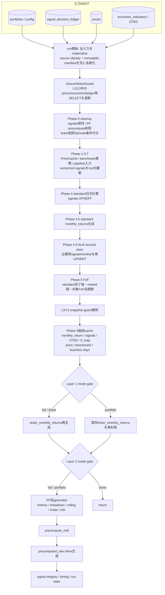

<!-- gist-master: 1b875a44252ab4320408d385bba96ccf dm-fullrecalculate-cache-reuse-asis_20260813.md -->
# DM-Signal fullrecalculate キャッシュ・計算済みデータ再利用 AsIs v3.0
<!-- semantic-links: [[recalculate_pipeline]] [[fullrecalculate_L5_cold再生成]] [[code_rollback]] [[immutable_input_manifest]] [[RB6_prices_oracle]] -->

- 作成: 2026-08-13 04:09 JST（変更禁止の原記録）
- 最終更新: 2026-08-13 19:45 JST
- 対象コード: production `ff290e6079c3400dff6446764eb316d693384348`（fullrecalculate実行経路の最新変更は`a974e7e89c68076866fc5a02c31acf799a5a014d`。`ff290e60`自体は独立RB6 oracleのみ）
- 本番deploy: `ff290e60` Live確認済み。deploy IDとLive時刻は本改訂の一次artifactにないため未記載
- 一次証拠: `backend/app/jobs/recalculate_fast.py`、`recalculate_fof.py`、`input_manifest.py`、`utils/data_loader.py`、`services/metrics_impl.py`
- 位置づけ: **現行AsIsの固定記録**。ToBe・改善提案ではない
- 関連: `dm-production-code-rollback-plan_20260813.md`（gist `0c98ab36`）

## §0. 結論

現行fullrecalculateは、deploy間で計算済み全レイヤーをwarm reuseする方式ではない。実体は次の組合せである。

1. run冒頭で価格・経済指標・PF設定・signal decision ledgerを**不変入力snapshot**へ固定する。
2. `signals`は削除せず、Phase 4/4.1で同一キーへUPSERTする。
3. `monthly_returns`とPF依存precompute群は対象範囲を削除し、同一run内で再生成する。
4. `ticker_monthly_returns`はmode依存である。`full`/`ticker`は削除・再生成、`portfolio`だけ既存DB値を再利用する。
5. Phase 5後段はDBから一括ロードした`monthly_returns`等をrun内メモリcacheに変え、全PF generatorと`precomputed_raw`で共有する。
6. L5は同じプロセス内のinline生成であり、この経路にdeploy跨ぎのdurable warm cache/queue ownershipはない。
7. metrics用のDTB3は完全prefix、benchmark用のSPYは全履歴を同じ不変入力snapshotへ保持する。一方、signal momentumへ渡すDTB3は`load_start_date..logical_date`へ再度bounded view化し、metricsのas-of補助履歴を売買判断へ混入させない。

したがって「fullrecalculateが過去の計算値を丸ごと使い回す」という理解も、「毎回すべてのテーブルを空にする」という理解も、どちらも現行コードとは一致しない。

## §1. mode別の実際

| mode | PF依存precompute cleanup | `signals` | `ticker_monthly_returns` | 後段PF precompute |
|---|---|---|---|---|
| `full` | 対象を削除 | 保持後にUPSERT | 全PF実行時は削除してLayer 1再生成 | 実行 |
| `portfolio` | 対象を削除 | 保持後にUPSERT | 削除せずLayer 1をskipし既存DB値を利用 | 実行 |
| `ticker` | 対象を削除 | 保持後にUPSERT | 全PF実行時は削除してLayer 1再生成 | Layer 1後にreturn |

重要なAsIs: `ticker`のmode判定はLayer 1直後にあり、それより前の入力準備・standard/FoF処理を入口で短絡しない。ログ上の「Ticker-only」は、関数全体がticker処理だけを行ったことを意味しない。

`portfolio_ids`指定時はPF依存テーブルのDELETE対象がそのID群へ狭まる。一方、FoFは状態を途中再開できない設計のため、対象FoFについて開始日を`2000-01-01`へ固定して全期間を計算する。

## §2. 現行フロー

## §3. キャッシュと再利用の分類

| 分類 | 実体 | 生存期間・意味 |
|---|---|---|
| 不変入力snapshot | PF config、ledger、prices、economic、SPY営業日、rebalance trigger | run内。cleanupより先にmanifestを永続化し、L2/L3の入力を固定。SPYはbenchmark全期間、DTB3はas-of解決用の完全prefixを保持 |
| snapshot内の用途別view | `df_dtb3_raw`（完全prefix）、`df_dtb3_signal`（bounded native rows） | 同じimmutable artifactから導出。前者はmetricsのas-of、後者はsignal momentumのrolling行数契約を守る |
| standard計算cache | `PriceCache`、`benchmark_cum_cache`、pipeline precomputed input、vectorized signal dict | run内。日次DB再読込・同一計算の反復を削減 |
| FoF受渡しcache | preload済み`signals`、`signal_cache_opt6`、`fof_shared_signal_cache` | run内。standardの確定出力をFoFと月次生成へ渡す |
| L5共有cache | `monthly_return_cache`、`signal_preload`、`dtb3_cache`、`rf_map_cache`、business days | run内。PF別generatorと`precomputed_raw`が共有 |
| 条件付きrun跨ぎDB再利用 | `ticker_monthly_returns` | `mode=portfolio`のみ。`full/ticker`では再生成 |
| DB残存+再確定 | `signals` | Phase 0では保持するがPhase 4/4.1でUPSERT。無条件warm cache hitではない |
| 再生成対象 | `monthly_returns`、`trade_performance`、`drawdown_periods`、rolling、risk、`portfolio_metrics` | Phase 0で対象範囲をDELETEし、同一run内で再構築 |

### §3.1 入力固定とsource identity

- productionでは`RENDER_GIT_COMMIT`が40桁lowercase SHAでなければ開始しない。
- local write-enabled runではtracked dirtyまたは対象sourceのuntracked fingerprintがあれば開始しない。
- `ImmutableInputManifest`はPF config・ledger・prices・economicのhash、logical date、対象PF集合、source identityをcleanup前に永続化する。
- L2/L3中は`SourceSelectGuard`が`signal_decision_ledger`・`prices`・`economic_indicators`の後読みを遮断する。
- L5 reporting artifactsへ移る明示境界でguardを解除する。従って「run全域でDB sourceを一切再読込しない」という契約ではない。
- `f99fd92d`以降、DTB3は`date.min..logical_date`の完全prefixを1 queryでmaterializeし、最初のSPY日をas-of解決できなければbusiness write前にfail closedする。0埋め・後方補完による捏造はしない。
- `a974e7e8`以降、SPYは他tickerのbounded rangeと同じbulk loaderの1 query内で全履歴をmaterializeする。これにより、PF開始日より古いbenchmark区間を使う`precomputed_raw`もguard後のDB fallbackを必要としない。
- DTB3完全prefixをそのままsignal momentumへ渡すと長い公表gap前後のnative rowが隣接し、rolling(N)の意味が変わる。`a974e7e8`はsnapshot自体を削らず、signal側だけbounded viewを導出して用途契約を分離した。

### §3.2 metricsの確定月契約

- `monthly_returns`には最新価格月のMTD行を保持する。非metrics利用者は従来どおり参照できる。
- `portfolio_metrics`だけは`confirmed_only=True`を使い、`year_month < latest_price_year_month`の確定月に限定する。
- metricsは保存済み生`monthly_return`/`monthly_return_open`を使う。累積列の`pct_change().fillna(0)`で初月を0へ置換しない。
- Maximum Drawdown値と底日はclose/open/benchmark各累積wealthから独立算出し、初期wealth 1をpeak候補へ含める。
- `drawdown_periods`はDrawdown Length・Recovery・Underwater統計には残るが、metricsのMDD値・底日のSSOTではない。

## §4. fail-closed境界と「完了」の意味

run全体のstatusだけで全生成物の成功を判定してはならない。現行には意図的な非fatal境界がある。

| 境界 | 現行動作 | 完了後に見る値 |
|---|---|---|
| source identity / manifest persist | 失敗時はbusiness write前に停止 | `run_id`、`manifest_id`、source identity |
| Phase 4.5 PF別monthly | PF単位例外を収集して継続 | `phase45_failures == 0` |
| ticker Layer 1 | 例外をwarning化し後続へ進みうる | `ticker_layer == refreshed` |
| PF別precompute | PF単位例外を収集して継続 | `precompute_failures == 0` |
| `precompute_mtd` | 非fatal fallback | `mtd_precompute_error`不存在 |
| `precomputed_raw` | 非fatal fallback | `raw_precompute_error`不存在 |
| signal integrity | 非fatal warning | integrity内訳とログ |

kill switchはPhase 4.5、FoF、Layer 1、Layer 2前で確認される。検知時は未commit分をrollbackして`cancelled`を返すが、それ以前にcommit済みの層まで巻き戻す全run transactionではない。

## §5. 2026-08-13 本番実走の観測点

### §5.1 比較基準: run 355

- production `7bd60e96b77a52502fa797453ed7a20a2d20ff41`、API run `20260813060436D60609`、`recalculation_status.id=355`。
- `mode=full`、全102 PF。`status=completed`、status台帳592.87秒、timing台帳591.88秒。
- layer結果はL3 FoF 78 PF / 299.32秒、L1 ticker `refreshed` / 5.07秒、L2 portfolio 102 PF / 183.47秒、L5 raw `completed` / 1,533生成行 / 54.00秒。
- input manifestは`3ced522a…`。固定入力はPF 102、prices 71,802行、economic 5,156行、ledger 0行。

### §5.2 最後に終端確認済み: run 357

- production `f99fd92d16e01330f4775399530fbbbe1d1dd147`、API run `20260813100429B2AE9A`、`recalculation_status.id=357`。
- `status=completed`、全102 PFのall-period `portfolio_metrics`が存在。run 356で欠けたbasicデュアルモメンタムの0年/10年metricsは復元した。
- status所要427.84秒、L3 FoF 250.02秒。run 355比でtotalは165.03秒短いが、入力・commit・実行条件を揃えた速度実験ではないため因果的な高速化値とは扱わない。
- 完全DTB3 prefixによりmetrics先頭月のas-of解決は成功した。一方、そのprefixがsignal momentumにも流れ、standard 2 PF・14月のhistorical monthly returnをrun 356から変えた。これは`a974e7e8`で用途別viewへ分離したが、本番再確認は次のrun 358待ちである。
- `precomputed_raw` benchmark bulk生成は`SPY calendar has no boundary interval for 1993-01-01`で非fatal失敗し、main `portfolio_metrics` 102/102とは別にrawが旧値のまま残った。この入力境界は`a974e7e8`のfull SPY snapshotで修正した。

### §5.3 現行production検証中: run 358

- production HEAD/`origin/main`: `ff290e6079c3400dff6446764eb316d693384348`。実行経路の修正は直前`a974e7e8`、HEAD commitは独立RB6 oracleのFoF readiness修正でproduction計算経路を変更しない。
- API run `2026081310374649C46D`、2026-08-13 19:37 JST起動。
- 本書最終更新19:45 JST時点では監視中で、status・終端時刻・layer件数・DB差分は未確定。完走前の値を「改善済み」「不変」とは判定しない。
- 終端後に確認すべき二値条件は、(1)102/102 PF metrics、(2)raw benchmark error 0、(3)standard 14月が意図した系列へ戻る、(4)signal/current holdings副作用0、(5)独立oracle再採点である。

## §6. RB6独立検証との境界

production cacheが高速であることと、値が独立oracleへ一致することは別問題である。run 357 DB snapshotに、循環入力を除去した`ff290e60` oracleを適用した最終確定artifactは次のとおり。

- source snapshot: `/tmp/rb6_snapshot_post357_full.json`、SHA-256 `7a30240090a0e2fe399e65af986432b598b4def70888f2588d72d476785d855e`。
- result: `/tmp/rb6_result_post357_full.json`、SHA-256 `19ecb98813d45d5c5d4a6402ce9e610049ef88381bd49582fcb3836e06df3679`。
- fixed expected summary: `/tmp/rb6_ff290_expected_fixed_hashes.json`、SHA-256 `57df5064bdcef82b55ea75f16cf12dd7bbb561fa31d92260bdcad8af36dd4d49`。
- monthly全体: exact 15,900 / mismatch 953 / missing_expected 21。内訳はstandard exact 4,699 / mismatch 14、FoF exact 11,201 / mismatch 939 / missing_expected 21。
- metrics: 102 PF・1,428比較でexact 688 / mismatch 740。
- FoF initial partial monthの31件は、production actual keyの存在をreadiness入力に使わず、oracle自身のtopological child historiesとconfigから境界を導出した。これにより旧970 mismatchから939へ減ったが、残939+21は未解消である。
- standard 14 mismatchはrun 357のDTB3 prefix signal混入と対応し、`a974e7e8`修正後run 358での再採点待ち。従って上記はrun 358の予測値ではなく、run 357 snapshotに対する固定結果である。
- RF月次契約は`52e80ce9`で日次DTB3 factorの複利積へ修正し、固定replay上でRF差408→0、全1,428 metrics計算値が一致することを確認した。ただしend-to-endのRB6 CLEARはFoF残差とrun 358終端確認を含む。

従って本書は「現行計算経路とcache契約」のAsIsであり、**RB6 GATEは未CLEAR**である。

**追記(2026-08-13 22:50・殿裁定による検算方式改訂)**: RB6検算は逆算parity方式（保存weight×独立pricesの積和と保存monthlyの10dp比較・単一スクリプト単一パス）へ改訂された。oracleのselection規則独立再実装は目的外として撤回（殿裁定22:40-22:44、正本=rollback計画書v1.5 §7.1）。run359でstandard 4713/4713 exact達成。FoF残935の第一分岐はoracle側weight展開仮定不足と2レーン独立確定（本番欠陥なし）。

## §7. 改訂履歴

- v1.0 (2026-08-13 04:09): rollback後のproduction tree `21e80e30`を記録。
- v2.0 (2026-08-13 15:18): production `7bd60e96`へ再構築。signals保持UPSERT、mode別ticker分岐、immutable input manifest、metrics確定月/MDD契約、非fatal境界、RB6未CLEAR、本番run 355終端実測を反映。
- v3.0 (2026-08-13 19:45): production `ff290e60`へ再構築。DTB3完全prefixとsignal bounded viewの分離、SPY全履歴snapshot、run 357終端実測、run 358監視中、循環を除去したRB6 oracle固定artifact、RF修正済みとFoF残差未CLEARを反映。原作成時刻と既存gist IDは変更せず保持。
