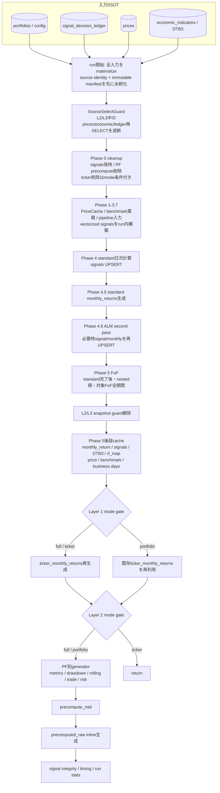

<!-- gist-master: 1b875a44252ab4320408d385bba96ccf dm-fullrecalculate-cache-reuse-asis_20260813.md -->
# DM-Signal fullrecalculate キャッシュ・計算済みデータ再利用 AsIs v2.0
<!-- semantic-links: [[recalculate_pipeline]] [[fullrecalculate_L5_cold再生成]] [[code_rollback]] [[immutable_input_manifest]] [[RB6_prices_oracle]] -->

- 作成: 2026-08-13 04:09 JST（変更禁止の原記録）
- 最終更新: 2026-08-13 15:18 JST
- 対象コード: production `7bd60e96b77a52502fa797453ed7a20a2d20ff41`
- 本番deploy: Render `dep-d9ulqu0ae00c73c9hkv0`、2026-08-13 15:03:12 JST Live
- 一次証拠: `backend/app/jobs/recalculate_fast.py`、`recalculate_fof.py`、`input_manifest.py`、`utils/data_loader.py`、`services/metrics_impl.py`
- 位置づけ: **現行AsIsの固定記録**。ToBe・改善提案ではない
- 関連: `dm-production-code-rollback-plan_20260813.md`（gist `0c98ab36`）

## §0. 結論

現行fullrecalculateは、deploy間で計算済み全レイヤーをwarm reuseする方式ではない。実体は次の組合せである。

1. run冒頭で価格・経済指標・PF設定・signal decision ledgerを**不変入力snapshot**へ固定する。
2. `signals`は削除せず、Phase 4/4.1で同一キーへUPSERTする。
3. `monthly_returns`とPF依存precompute群は対象範囲を削除し、同一run内で再生成する。
4. `ticker_monthly_returns`はmode依存である。`full`/`ticker`は削除・再生成、`portfolio`だけ既存DB値を再利用する。
5. Phase 5後段はDBから一括ロードした`monthly_returns`等をrun内メモリcacheに変え、全PF generatorと`precomputed_raw`で共有する。
6. L5は同じプロセス内のinline生成であり、この経路にdeploy跨ぎのdurable warm cache/queue ownershipはない。

したがって「fullrecalculateが過去の計算値を丸ごと使い回す」という理解も、「毎回すべてのテーブルを空にする」という理解も、どちらも現行コードとは一致しない。

## §1. mode別の実際

| mode | PF依存precompute cleanup | `signals` | `ticker_monthly_returns` | 後段PF precompute |
|---|---|---|---|---|
| `full` | 対象を削除 | 保持後にUPSERT | 全PF実行時は削除してLayer 1再生成 | 実行 |
| `portfolio` | 対象を削除 | 保持後にUPSERT | 削除せずLayer 1をskipし既存DB値を利用 | 実行 |
| `ticker` | 対象を削除 | 保持後にUPSERT | 全PF実行時は削除してLayer 1再生成 | Layer 1後にreturn |

重要なAsIs: `ticker`のmode判定はLayer 1直後にあり、それより前の入力準備・standard/FoF処理を入口で短絡しない。ログ上の「Ticker-only」は、関数全体がticker処理だけを行ったことを意味しない。

`portfolio_ids`指定時はPF依存テーブルのDELETE対象がそのID群へ狭まる。一方、FoFは状態を途中再開できない設計のため、対象FoFについて開始日を`2000-01-01`へ固定して全期間を計算する。

## §2. 現行フロー

## §3. キャッシュと再利用の分類

| 分類 | 実体 | 生存期間・意味 |
|---|---|---|
| 不変入力snapshot | PF config、ledger、prices、economic、SPY営業日、rebalance trigger | run内。cleanupより先にmanifestを永続化し、L2/L3の入力を固定 |
| standard計算cache | `PriceCache`、`benchmark_cum_cache`、pipeline precomputed input、vectorized signal dict | run内。日次DB再読込・同一計算の反復を削減 |
| FoF受渡しcache | preload済み`signals`、`signal_cache_opt6`、`fof_shared_signal_cache` | run内。standardの確定出力をFoFと月次生成へ渡す |
| L5共有cache | `monthly_return_cache`、`signal_preload`、`dtb3_cache`、`rf_map_cache`、business days | run内。PF別generatorと`precomputed_raw`が共有 |
| 条件付きrun跨ぎDB再利用 | `ticker_monthly_returns` | `mode=portfolio`のみ。`full/ticker`では再生成 |
| DB残存+再確定 | `signals` | Phase 0では保持するがPhase 4/4.1でUPSERT。無条件warm cache hitではない |
| 再生成対象 | `monthly_returns`、`trade_performance`、`drawdown_periods`、rolling、risk、`portfolio_metrics` | Phase 0で対象範囲をDELETEし、同一run内で再構築 |

### §3.1 入力固定とsource identity

- productionでは`RENDER_GIT_COMMIT`が40桁lowercase SHAでなければ開始しない。
- local write-enabled runではtracked dirtyまたは対象sourceのuntracked fingerprintがあれば開始しない。
- `ImmutableInputManifest`はPF config・ledger・prices・economicのhash、logical date、対象PF集合、source identityをcleanup前に永続化する。
- L2/L3中は`SourceSelectGuard`が`signal_decision_ledger`・`prices`・`economic_indicators`の後読みを遮断する。
- L5 reporting artifactsへ移る明示境界でguardを解除する。従って「run全域でDB sourceを一切再読込しない」という契約ではない。

### §3.2 metricsの確定月契約

- `monthly_returns`には最新価格月のMTD行を保持する。非metrics利用者は従来どおり参照できる。
- `portfolio_metrics`だけは`confirmed_only=True`を使い、`year_month < latest_price_year_month`の確定月に限定する。
- metricsは保存済み生`monthly_return`/`monthly_return_open`を使う。累積列の`pct_change().fillna(0)`で初月を0へ置換しない。
- Maximum Drawdown値と底日はclose/open/benchmark各累積wealthから独立算出し、初期wealth 1をpeak候補へ含める。
- `drawdown_periods`はDrawdown Length・Recovery・Underwater統計には残るが、metricsのMDD値・底日のSSOTではない。

## §4. fail-closed境界と「完了」の意味

run全体のstatusだけで全生成物の成功を判定してはならない。現行には意図的な非fatal境界がある。

| 境界 | 現行動作 | 完了後に見る値 |
|---|---|---|
| source identity / manifest persist | 失敗時はbusiness write前に停止 | `run_id`、`manifest_id`、source identity |
| Phase 4.5 PF別monthly | PF単位例外を収集して継続 | `phase45_failures == 0` |
| ticker Layer 1 | 例外をwarning化し後続へ進みうる | `ticker_layer == refreshed` |
| PF別precompute | PF単位例外を収集して継続 | `precompute_failures == 0` |
| `precompute_mtd` | 非fatal fallback | `mtd_precompute_error`不存在 |
| `precomputed_raw` | 非fatal fallback | `raw_precompute_error`不存在 |
| signal integrity | 非fatal warning | integrity内訳とログ |

kill switchはPhase 4.5、FoF、Layer 1、Layer 2前で確認される。検知時は未commit分をrollbackして`cancelled`を返すが、それ以前にcommit済みの層まで巻き戻す全run transactionではない。

## §5. 2026-08-13 本番実走の観測点

- deploy: `dep-d9ulqu0ae00c73c9hkv0` / commit `7bd60e96b77a52502fa797453ed7a20a2d20ff41` / Live 15:03:12 JST
- fullrecalculate: API run `20260813060436D60609`、`recalculation_status.id=355`
- request: `start_date=2000-01-01`、`mode=full`、全102 PF、起動15:04:36 JST
- 終端: 15:14:29 JST、`status=completed`、`error_message=NULL`。status台帳の所要は592.87秒、timing台帳は591.88秒。
- input manifest: `3ced522a…`。固定入力はPF 102、prices 71,802行（max 2026-08-12）、economic 5,156行（max 2026-08-11）、ledger 0行。
- layer結果: L3 FoF 78 PF / 299.32秒、L1 ticker `refreshed` / 5.07秒、L2 portfolio 102 PF / 183.47秒、L5 raw `completed` / 1,533生成行 / 54.00秒。
- signal integrity: 384,886行、102 PF、zero-signal 0、matched-weight WARN 0、confirmed signal change alert 0。
- 終端DB件数: `monthly_returns=16,976`、all-period `portfolio_metrics=102`、`ticker_monthly_returns=4,795`、`precomputed_raw=1,650`。
- これは経路の正常終端記録であってRB6 CLEARではない。prices独立oracleの再採点は別判定とする。

## §6. RB6独立検証との境界

production cacheが高速であることと、値が独立oracleへ一致することは別問題である。

- standard 24 PF: prices独立oracleで確定4,713月、close/openとも不一致0。
- FoF実保有所与RCA: 親`display_ticker_weights`と実境界を使えば12,161月のreturn不一致0。ただしdisplayはproduction派生値であり、selectionまで独立した証明ではない。
- config+pricesからselectionも再構成する独立runner: FoF `mismatch=970`、`missing_expected=21`。入力契約差を含むためproduction returnバグ件数として直採用はしないが、RB6 CLEARにも使えない。
- deploy前metrics比較は旧production保存値に対し1,428比較中exact 90 / mismatch 1,338。今回のmetrics修正を反映するにはrun 355終端後の再採点が必要。

従って本書は「現行計算経路とcache契約」のAsIsであり、RB6 GATE CLEAR宣言ではない。

## §7. 改訂履歴

- v1.0 (2026-08-13 04:09): rollback後のproduction tree `21e80e30`を記録。
- v2.0 (2026-08-13 15:18): production `7bd60e96`へ再構築。signals保持UPSERT、mode別ticker分岐、immutable input manifest、metrics確定月/MDD契約、非fatal境界、RB6未CLEAR、本番run 355終端実測を反映。
