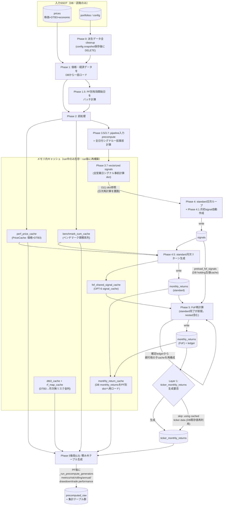

<!-- gist-master: 1b875a44252ab4320408d385bba96ccf dm-fullrecalculate-cache-reuse-asis_20260813.md -->
# DM-Signal fullrecalculate キャッシュ・計算済みデータ再利用 AsIs v1.0
<!-- semantic-links: [[recalculate_pipeline]] [[fullrecalculate_L5_cold再生成]] [[code_rollback]] -->

- 作成: 2026-08-13 04:09 JST
- 対象コード: origin/main = `233c2303`（rollback commit、production tree = `21e80e30957d61f5bdfb9ea04bf99b63dda2cfc9`）
- 一次証拠: `backend/app/jobs/recalculate_fast.py` / `backend/app/jobs/recalculate_fof.py`（git show origin/main で現物確認）
- 位置づけ: **AsIs記録のみ**。ToBe・改善提案を含まない。rollback後の現行本番の再計算フローを固定記録する
- 関連: `dm-production-code-rollback-plan_20260813.md`（gist 0c98ab36）

## §1. フローチャート

## §2. 再利用の3種類（AsIs）

| 種類 | 実体 | 生存期間 | 一次証拠 |
|---|---|---|---|
| DB計算済みデータのrun内再利用 | Phase 4の`signals`→Phase 4.5/FoFが読む。standard/FoFの`monthly_returns`→`monthly_return_cache`としてDB再ロードしL5全generatorが共有 | 同一run内 | `recalculate_fast.py` L3026-3040（monthly_return_cache構築）、L405-492（generator群への注入） |
| run跨ぎのDB再利用（1箇所のみ） | `ticker_monthly_returns`（Layer 1）のみ「⏭️ Skipping Layer 1 (using cached ticker data)」でDB既存値を再利用しうる | run跨ぎ | `recalculate_fast.py` L3087（skipログ）、L3074-3082（生成分岐） |
| メモリ内キャッシュ | perf_price_cache・benchmark_cum_cache・vectorized signals dict・fof_shared_signal_cache・dtb3_cache/rf_map_cache | run内のみ。run開始時にSSOTから構築、終了で消滅 | `recalculate_fast.py` L1802-1803, L1948-1972, L2169, L2816-2825, L3009-3022 |

## §3. AsIsの構造的特徴

1. **Phase 0 = Option A: Complete Cleanup** — `ticker_monthly_returns`を除く全派生テーブルを毎回全消しして積み直す。deploy跨ぎ・run跨ぎのwarm cacheは存在しない。
2. **層間の受け渡しはDB経由のみ** — 前層のDB出力（signals→monthly_returns→…）が次層の入力。メモリキャッシュは各層の高速化手段であり、正の受け渡し経路ではない。
3. **8/8以降のL5 queue/warm機構は含まれない** — `bf4ed6a6`以降のL5自動enqueue・durable ownership・warm invalidation等の新設計はrollbackで全て除外済み。cronは01:10 L2／01:40 L3／02:00 L5 fallbackの従来構成。
4. **source identity管理** — run開始時に`_resolve_source_identity()`がgit SHA+untracked fingerprintを記録し、どのコードが派生値を書いたかを`recalculation_status`系台帳へ残す。

## §4. 改訂履歴

- v1.0 (2026-08-13 04:09): rollback後の現行本番コード（tree=`21e80e30`）の現物確認に基づきAsIs新規作成。ToBe含まず。
