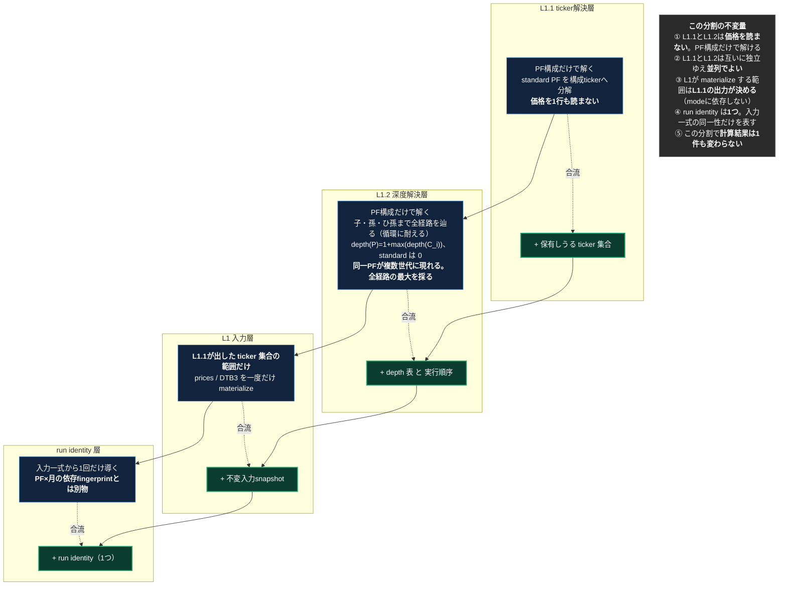

# L1分割設計 — AsIs L1 を ToBe の L1 / L1.1 / L1.2 / run identity へ

## 原則（親文書と同じ。殿裁定 2026-08-15）

- **ToBeは、構造的に不可能でない限り妥協しない。現実の関数名・行番号・今の実測値で理想を縛らない。理想は磨く。**
- **AsIsは現実のコードそのもの。間違いがあれば現実に合わせて直す。**

親文書: `dm-unified-tobe-flow_20260815`（gist 12cb3fc4）。本書はその ToBe の最上段4行だけを対象にする。

---

## AsIs **v1.0** — 2026-08-15T16:00+09:00 / 対象 `origin/main = 5da7f107`

**現状、4つの仕事が1箇所に混ざっている。**

| ToBeでの居場所 | 現状の実体 | 位置 |
|---|---|---|
| L1.1 ticker解決 | `_collect_all_symbols(standard_portfolios)` | `recalculate_fast.py:1978`（定義 :3902） |
| L1.1 ticker解決 | `_collect_standard_price_supply_symbols(price_supply_portfolios)` | `:1979`（定義 :3928） |
| L1 入力materialize | `stock_symbols` 確定 → `load_prices_as_df` ほか | `:1986` 以降 |
| run identity | `ImmutableInputManifest.build` が `input_snapshot_id` と `execution_fingerprint` を算出 | `input_manifest.py:228-258` |
| **L1.2 深度解決** | **存在しない** | — |

**確認できた事実（現物grep・2026-08-15）**

1. ticker解決は既にL1直前で動いているが、**独立した層になっておらず**、価格materializeと同じ関数の流れの中にある。
2. `_collect_all_symbols` が集めるのは **relative / 絶対アセット(:3910) / safe_haven / リスクフリー(:3916) / ベンチマーク(:3921) の5分類**。`relative ∪ safe_haven` ではない。
3. run identity 相当は **2つある**。`input_snapshot_id`（input_snapshot_version / logical_date / target_portfolio_ids / artifacts hashes）と `execution_fingerprint`（source_identity + environment）。
4. 深度解決は**本番経路に無い**。`portfolios` の `nested_depth` カラムは default 0 で本番実測も全29543行が0。`scripts/fof_tree.py` は `用途区分: OPERATOR_TOOL（本番実行経路から呼ばれない）` で、しかも `fof_component_weights` の最新日を読むためconfig-onlyではない。`price_ratio_impl.py:1877` の `resolve_holding(depth,...)` は展開処理内の局所再帰であり、実行順序を決める深度ではない。

---

## ToBe **v1.0** — 2026-08-15T16:00+09:00

**4つを、それぞれ独立した層にする。順序と依存だけを固定し、計算そのものは変えない。**

---

## 差分（AsIs → ToBe）

| # | やること | 種別 |
|---|---|---|
| 1 | ticker解決を独立層へ切り出す。既存2関数の呼び出しを前段へ移すだけ | **移動**（新規ロジックなし） |
| 2 | materializeする銘柄範囲を、L1.1の出力から決める形にする | **接続の付け替え** |
| 3 | 深度解決層を新設する。PF構成だけを入力に depth と実行順序を出す純関数 | **新規** |
| 4 | run identity を1つに整理する | **整理** |

**3だけが新規である。1・2・4は既存物の置き場所と接続の変更にすぎない。**

---

## なぜ単独でできるか

- **計算式に触れない。** momentum も規則1・規則2 も一切変更しない
- **判定に触れない。** holding_signal の決まり方は変わらない
- **保存値を使わない。** cmd_4312の事故（控えを一致証明なしに計算入力へ昇格）とは無関係
- ∴ **業務値は1件も変わらないはず。** それが二値の合否になる

## 二値の合否

| 判定 | 内容 |
|---|---|
| **値** | full 1回で `monthly_returns` / `portfolio_metrics` が基準と完全一致（cmp_rc=0）。1件でも差が出たら不合格 |
| **範囲** | L1.1が出す ticker 集合が、現行 `stock_symbols` と**同一集合**であること |
| **深度** | L1.2が出す depth 表が、本番の樹形図と一致すること。混在深度の親（実測1件）と、同一PFが複数世代に現れる組（実測14件）を正しく扱えること |
| **独立性** | L1.1とL1.2が価格を1行も読まないこと |
| **identity** | run identity が1つになり、PF×月の依存fingerprintと混ざっていないこと |

## この設計が触れないもの

- L2以降の判定・規則・月次集約
- fingerprint skip（速度の本体）
- cacheの一本化そのもの（L2→L3→L5の受渡し）
- 台帳・guard・ALERT

**それらは次の設計書で扱う。ここは最上段4行だけ。**
