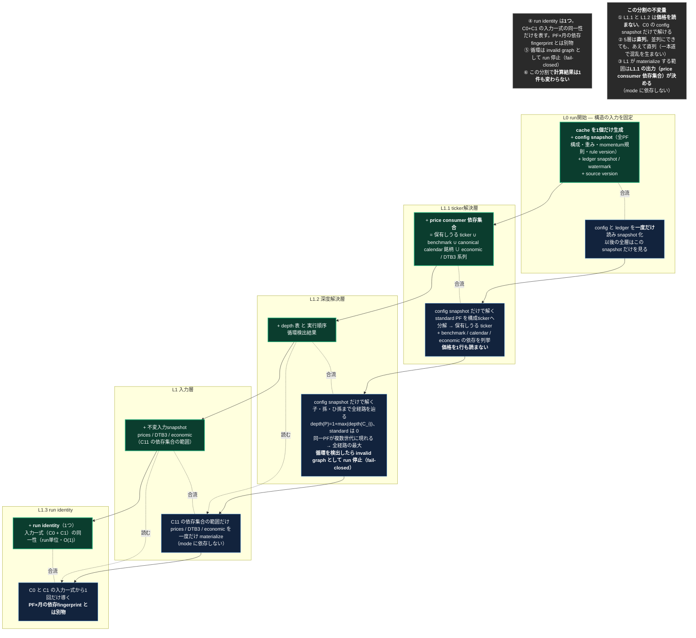

<!-- gist-master: 4e64d25bfbca1b3a33803546cd2145d4 dm-l1-split-design_20260815.md -->
# L1分割設計 — AsIs L1 を ToBe の L1 / L1.1 / L1.2 / run identity へ

## 原則（親文書と同じ。殿裁定 2026-08-15）

- **ToBeは、構造的に不可能でない限り妥協しない。現実の関数名・行番号・今の実測値で理想を縛らない。理想は磨く。**
- **AsIsは現実のコードそのもの。間違いがあれば現実に合わせて直す。**

親文書: `dm-unified-tobe-flow_20260815`（gist 12cb3fc4・ToBe v3.11）。本書はその ToBe の最上段5行（L0 / L1.1 / L1.2 / L1 / L1.3）だけを対象にする。

**スタート**: `origin/main = 5da7f107` の現物（AsIs）。**ゴール**: 5層が独立し直列に並び、業務値が1件も変わらないこと（二値の合否）。この2点から逸脱しない。

---

## AsIs **v1.2** — 2026-08-15T18:45+09:00 / 対象 `origin/main = f0194282`（L0 live: run405/406 業務値突合 monthly 16,976行・metrics 204行 差分0）

**現状、L0 は本番に入った。L1.1 と L1.3 は 1箇所に混ざったまま、L1.2 は存在しない。**

| ToBeでの居場所 | 現状の実体 | 位置 |
|---|---|---|
| **L0 config snapshot** | **存在する**。`snapshot_portfolio_configs(payload.portfolios)` → `db.info["portfolio_config_snapshot"]`、ledger 全行 → `db.info["signal_decision_ledger_snapshot"]`。以後の generator preload は `build_portfolio_config_preload(config_snapshot)` を読む | `recalculate_fast.py:1901`（config）/ `:1922`（ledger）/ `:3197`（preload）。定義 `input_manifest.py:28`（`PortfolioConfigSnapshot`）/ `:62` / `:67` |
| L1.1 ticker解決 | `_collect_all_symbols(standard_portfolios)` | `recalculate_fast.py:2014`（定義 :3903） |
| L1.1 ticker解決 | `_collect_standard_price_supply_symbols(price_supply_portfolios)`（`price_supply_portfolios` は config_snapshot から :2001 で抽出） | 定義 `:3929` |
| L1 入力materialize | `stock_symbols` 確定 → `load_prices_as_df` ほか | `:2022` → `:2031` 以降 |
| L1.3 run identity | `ImmutableInputManifest.build` が `input_snapshot_id` と `execution_fingerprint` を算出 | 呼出 `recalculate_fast.py:2110`、定義 `input_manifest.py:277-305` |
| **L1.2 深度解決** | **存在しない** | — |

**確認できた事実（現物grep・2026-08-15 18:45）**

1. L0: config は run 冒頭で一度だけ detach され、以後の PF 選択・generator preload は snapshot を消費する（`:1895-1925` のコメント「Do not re-read Portfolio rows after L0」）。ledger は全行を1回読み snapshot 化。
2. ticker解決は既に L1 直前で動いているが、**独立した層になっておらず**、価格 materialize と同じ関数の流れの中にある。入力は config_snapshot 由来だが、benchmark / DTB3 の依存は `_collect_all_symbols` の5分類（relative / 絶対アセット / safe_haven / リスクフリー / ベンチマーク）と `:2022` の `| {"SPY"}` に分散している。
3. run identity 相当は **2つある**。`input_snapshot_id`（input_snapshot_version / logical_date / target_portfolio_ids / artifacts hashes）と `execution_fingerprint`（source_identity + environment）。
4. 深度解決は**本番経路に無い**。`portfolios.nested_depth` は default 0（本番実測 全29543行が0）。`scripts/fof_tree.py` は OPERATOR_TOOL で本番経路から呼ばれず、`fof_component_weights` の最新日を読むため config-only ではない。`price_ratio_impl.py` の `resolve_holding(depth,...)` は展開処理内の局所再帰であり、実行順序を決める深度ではない。

---

## ToBe **v1.1** — 2026-08-15T17:20+09:00

**5つを、それぞれ独立した層にし、直列に並べる。順序と依存だけを固定し、計算そのものは変えない。**（親文書 ToBe v3.11 の最上段5行と同一）

（親文書 L1 の「前回確定成果物 snapshot の read-once」は judge/fingerprint の領域なので本書の対象外。次の設計書で扱う）

---

## 差分（AsIs → ToBe）

| # | やること | 種別 |
|---|---|---|
| 0 | ~~L0: config / ledger を run 冒頭で一度だけ読み snapshot 化する~~ **本番 live（f0194282、業務値差分0）** | 完了 |
| 1 | L1.1: ticker解決を独立層へ切り出す。既存2関数の呼び出しを前段へ移し、入力を config snapshot にする。benchmark / calendar / economic の依存も同じ場所で列挙する | **移動+拡張**（既存5分類の集約先を1箇所にする。新規ロジックなし） |
| 2 | L1: materialize する銘柄範囲を、L1.1 の出力から決める形にする | **接続の付け替え** |
| 3 | L1.2: 深度解決層を新設する。config snapshot だけを入力に depth と実行順序を出す純関数。循環は fail-closed | **新規** |
| 4 | L1.3: run identity を1つに整理し、C0+C1 から導く | **整理** |
| 5 | 5層を **直列** に並べる（L0→L1.1→L1.2→L1→L1.3）。並列化しない | **順序固定** |

**0と3が新規である。1・2・4・5は既存物の置き場所・接続・順序の変更にすぎない。**

---

## なぜ単独でできるか

- **計算式に触れない。** momentum も規則1・規則2 も一切変更しない
- **判定に触れない。** holding_signal の決まり方は変わらない
- **保存値を使わない。** cmd_4312の事故（控えを一致証明なしに計算入力へ昇格）とは無関係
- ∴ **業務値は1件も変わらないはず。** それが二値の合否になる

## 二値の合否

| 判定 | 内容 |
|---|---|
| **値** | full 1回で `monthly_returns` / `portfolio_metrics` が基準と完全一致（cmp_rc=0）。1件でも差が出たら不合格 |
| **範囲** | L1.1が出す price consumer 依存集合が、現行 `stock_symbols`（保有＋benchmark＋リスクフリー等の5分類）と**同一集合**であること。1銘柄でも増減したら不合格 |
| **深度** | L1.2が出す depth 表が、本番の樹形図と一致すること。混在深度の親（実測1件）と、同一PFが複数世代に現れる組（実測14件）を正しく扱えること |
| **独立性** | L1.1とL1.2が価格を1行も読まないこと。入力は C0 の config snapshot のみ |
| **順序** | L0→L1.1→L1.2→L1→L1.3 が直列であること（並列枝なし） |
| **identity** | run identity が1つになり、C0+C1 から導かれ、PF×月の依存fingerprintと混ざっていないこと |

## この設計が触れないもの

- L2以降の判定・規則・月次集約
- fingerprint skip（速度の本体）
- cacheの一本化そのもの（L2→L3→L5の受渡し）
- 台帳・guard・ALERT

- 前回確定成果物 snapshot の read-once（judge の復元元）

**それらは次の設計書で扱う。ここは最上段5行だけ。**
