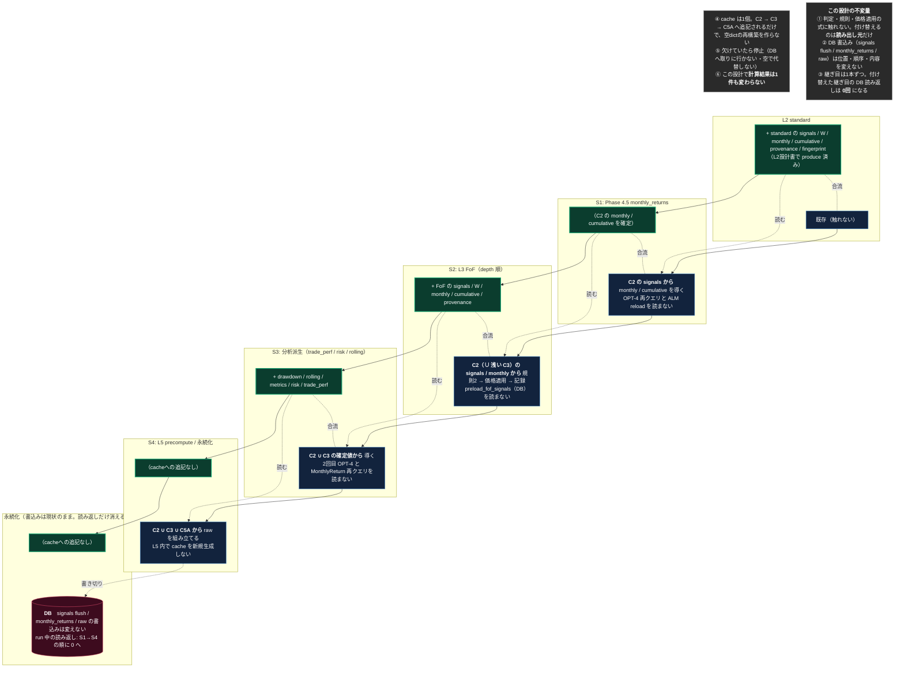

<!-- gist-master: 4735a7fcd4da60120345699baf49ac44 dm-l2-l3-seam-design_20260816.md -->
# 継ぎ目設計 — L2→L3→L5 の受渡しを DB 経由から左列 cache へ（cache 3系統の一本化）

## 原則（親文書と同じ。殿裁定 2026-08-15）

- **ToBeは、構造的に不可能でない限り妥協しない。現実の関数名・行番号・今の実測値で理想を縛らない。理想は磨く。**
- **AsIsは現実のコードそのもの。間違いがあれば現実に合わせて直す。**
- **変更点は文書に書かない。見出しは版番号とタイムスタンプのみ。粒度が足りなければ一番下の注釈にAsIs注釈・ToBe注釈をレイヤー単位で書く。**
- **小さく1手ずつ・儀式なし・パイプライン（殿下知 2026-08-15 18:58-20:59）**: 1手=忍者1体・1タスク・実装(新規テスト/contract test/fixture なし)→push→deploy→full→business parity→次手。full の結果を待つ時間で次手を実装させる。FAIL→積んだ手を全部 revert。

親文書: `dm-unified-tobe-flow_20260815`（gist 12cb3fc4・ToBe v3.12）。前段: `dm-l1-split-design_20260815`（gist 4e64d25b・全6手 live）/ `dm-l2-standard-design_20260815`（gist b4b31391・走行中）。本書は **L2 が C2 を produce している前提**（L2設計書 #4 完了）で、L2→L3→L5 の**受渡し（継ぎ目）だけ**を対象にする。判定・規則・skip・DB最下段（書き切り）は対象外。

**スタート**: L2設計書 #4 完了時点の `origin/main`（AsIs は現行 `430c8950` 時点の継ぎ目の現物で記す。#4 完了時に SHA を更新する）。**ゴール**: run 中に L3・L5 が signals / monthly を **DB から読み返さず**、左列 cache（C2 → C3 → C5A）から読む。**業務値は1件も変わらない**。DB 書込み（flush / monthly_returns / raw）は現状のまま。

---

## AsIs **v1.2** — 2026-08-16T11:25+09:00 / 対象 `origin/main = a71b56fd`（継ぎ目の現物。疾風 readonly 偵察 `cmd_karo_recon2_dm_l2_l3_seam_202608160159` で全行再照合。L2 #4 完了時に SHA を更新）

**現状、L2 が DB へ書いた signals / monthly を、後段が4箇所で DB から読み返している（cache 3系統）。C2 に在るのは L2 #2/#3 の fingerprint / judge 記録のみで、signals / monthly / W / provenance の producer はまだ無い（L2 #4 待ち）。**

| 継ぎ目 | 現状の実体 | 位置 |
|---|---|---|
| S1: L2 → Phase 4.5 monthly_returns | OPT-4 `db.query(Signal)` → `list[Signal]`(:3453-3485)、`db.expunge`(:3465) → `signal_cache_opt6 = dict[pf_id][date] = build_signal_cache_value(...)` を空dictから再構築 → `_generate_monthly_returns(signal_cache=signal_cache_opt6)`(:3502-3510)。ALM 条件内で `_reload_signal_cache_entries`(:1447-1462 の `db.query(Signal)`) を :3570 から呼ぶ | `recalculate_fast.py:3453-3510` / `:1447-1462` / `:3570`（cache系統①） |
| S2: L2 → L3 FoF | :3632-3641 は `_recalculate_fof_history` へ cache を渡さない。`recalculate_fof.py:714-724` が空 `signal_cache` を作り `shared.py:179-196 preload_fof_signals_for_portfolios`(DB) で埋める（`shared.py:165-176` の query 結果を `build_signal_cache_value` で dict 化、expunge 無し）。消費側=`_merge_component_signal_rows`(recalculate_fof.py:588-616、同run cache優先・holding_signal_raw 補完・0件は ValueError) と ticker 抽出(:779-801) | `recalculate_fast.py:3632-3641` / `recalculate_fof.py:588-616, 714-724, 779-801` / `shared.py:160-196`（cache系統②） |
| S3: L2/L3 → 分析派生 | `db.query(MonthlyReturn)` 一括取得(:3708-3723、expunge :3720) と `db.query(Signal)` 再取得(:3725-3742、expunge :3737) → `_run_precompute_generators_for_portfolio`(:783-872) が `monthly_return_cache` を drawdown/rolling/metrics/trade/risk へ、`signal_preload` を trade へ渡す | `recalculate_fast.py:3708-3742` / `:783-872` |
| S4: → L5 precompute | :3938-3956 が S3 の `monthly_return_cache` / `signal_preload` を `PrecomputeRawContext` へ渡す。`precompute_raw.py:51-80 LazySignalArtifactCache` が `signal_preload` から要求時 dict を新規生成(:238-246)、monthly_trade へ共有(:274-283) | `recalculate_fast.py:3938-3956` / `precompute_raw.py:51-80, 238-283`（cache系統③） |

**確認できた事実（現物grep・2026-08-16 02:15。集計=`git grep -n -E "db\.query\((Signal|MonthlyReturn)\)|preload_fof_signals_for_portfolios|LazySignalArtifactCache" origin/main -- backend/app/jobs`）**

1. `recalculate_fast.py` の再クエリ=Signal 4 / MonthlyReturn 2。preload 呼出=1（recalculate_fof.py）/定義=1（shared.py）。Lazy 定義+生成=2（precompute_raw.py）。
2. 消費側の型: S1/S2 は `build_signal_cache_value` の dict（ORM 不要）、S3/S4 は expunge 済み ORM list（`MonthlyReturn` / `Signal`）。S3/S4 を dict 化するには consumer の row shape（holding_signal / weights 等）を全 generator で照合する必要がある。
3. C2 の現物 producer は `current_pf_month_fingerprints`(:2056) と `db.info` 登録(:2234) のみ。signals / monthly / W / provenance の producer は L2 #4 で入る。
4. 欠け停止の分岐は現状どこにも無い（S1: cache 構築直後 or consumer 入口、S2: `_merge_component_signal_rows` 入口、S3/S4: preload 入口）。
5. 関連テスト: `backend/tests/test_monthly_returns_signal_cache_preload.py:442-540`（S2）、`test_precompute_raw.py:267-298`（S4 共有）、`test_recalculate_precompute_savepoint.py:58-74`（context）。S1/S3 の直接テストは無い。

---

## ToBe **v1.0** — 2026-08-16T00:40+09:00

**継ぎ目を1本ずつ cache へ付け替える。書込みは変えない。読み返しだけを消す。**

---

## 差分（AsIs → ToBe）

| # | やること | 種別 |
|---|---|---|
| 1 | ~~S1: Phase 4.5 の `signal_cache` を C2 の signals から組む~~ **本番 live（1c138127、run420 差分0）** | 完了 |
| 2 | S2: `_recalculate_fof_history` の `signal_cache` を C2（∪ 浅い depth の C3）から組む。`preload_fof_signals_for_portfolios`(DB) を読まない。FoF の出力を C3 へも合流 | **付け替え + produce** |
| 3 | S3: trade_perf / risk 系の `signal_preload` / `monthly_return_cache` を C2 ∪ C3 から組む。2回目 OPT-4 と MonthlyReturn 再クエリを読まない | **付け替え** |
| 4 | S4: L5 precompute の入力を C2 ∪ C3 ∪ C5A から渡す。L5 内の `LazySignalArtifactCache` 新規生成を止める | **付け替え** |

**全て「読み出し元の付け替え」。書込みは触れない。∴ 業務値は1件も変わらないはず。**

## 二値の合否

| 判定 | 内容 |
|---|---|
| **値** | 各手 full 1回で `monthly_returns` / `portfolio_metrics` が直前基準と業務値差分0（`scripts/dm_signal_business_parity.py`） |
| **読み返し** | 付け替えた継ぎ目の `db.query(Signal)` / `db.query(MonthlyReturn)` が run 経路で0回（コード上の呼出箇所が消えている） |
| **欠け** | cache に無い PF×日を要求したら停止する（DB フォールバックが無い） |
| **cache** | 空dict からの再構築箇所が消え、C2 → C3 → C5A の一本になっている |

## この設計が触れないもの

- judge 一致時の復元（skip）— L2設計書の record-only 一致率を見てから別設計書
- 規則1/規則2・momentum の式、台帳 guard、ALERT
- DB の書込み位置（最下段への集約は最後の設計書）

---

## 注釈（レイヤー単位。図で足りない粒度はここに書く）— 2026-08-16T13:50+09:00

### AsIs 注釈
- **型の境界（偵察 2026-08-16 02:09）**: S1/S2 は dict 消費で C2 直結が容易。S3/S4 は ORM(expunge済み) 消費が残るため、C2∪C3 を渡すには「ORM互換の row shape を持つ dict」か「consumer側のattr参照を dict 参照へ」のどちらかが要る。S3 は generator 5系統(drawdown/rolling/metrics/trade/risk)の参照属性を先に列挙してから付け替える。
- **import closure**: 新helperは `backend/app/jobs/input_manifest.py`(L0/L1/L2 の snapshot 群と同居・起動時import済み) か `shared.py` に置く。新moduleを切るなら同一commitに含めることを push 前 import 検証で確認する（L2 #2/#1b/#3 の起動失敗の教訓）。
- **S1**: OPT-4 は「trade_performance + monthly_returns 用」の一括ロードとして入った最適化で、L2 が書いた直後の signals を DB から読み直している。`_reload_signal_cache_entries` は ALM second-pass 条件内のみ。
- **S2**: FoF は「常に全期間再計算」（drift 状態を保存していないため）。入力の signal_cache と構成PF価格を FoF 層の中で DB から組み立てる。
- **S2 の旧行依存（本番実測 2026-08-16T10:37+09:00・run421/428/430）**: `preload_fof_signals_for_portfolios`(DB) は**今 run が生成しない旧行**にも依存する（FoF prefix 30,853件=`valid_start_date` 以前、標準PFの週末行 40件）。同 run 生成分だけの cache へ付け替えると、当該 FoF 自身の monthly_returns 生成期間に旧 prefix が混入していた分の**日付 domain が変わり業務値が変わる**（付け替え 2回 FAIL・即 revert・復元 PASS、run427 基準 monthly hash fc198a01）。record-only では **候補=同 run 生成 ∪ C1 read-once の旧行** で DB preload と完全一致（run427）。
- **S2 observer の事故（run430）**: 観測目的で consumer へ渡すオブジェクトを差し替えた結果 holding_signal 8,145 行（39 PF）が変わった。観測は別変数で比較のみ、consumer への引数は不変が条件（修正 c053a4a1 系・db7a6ca3 基底）。
- **S3/S4**: 2回目の OPT-4 と MonthlyReturn 一括ロードが trade_perf・risk・L5 の共通入力。L5 はさらに独自 cache を生成する。S3/S4 の実装は済み（77fd250f / cdd3bd25 系）で S2 完了待ちのため未統合。

### ToBe 注釈
- **S1**: C2 の signals は L2 が flush 直前に持っていたものと同一（ledger freeze 適用後）。Phase 4.5 の値は変わらない。
- **S2**: depth 順（L1.2 の depth 表）で回し、depth k の FoF は C2 ∪ C3(depth<k) だけを読む。無ければ停止。
- **S2 の候補集合（2026-08-16T11:25+09:00）**: C2 ∪ C3 は「同 run 生成分」だけでは DB preload と等価にならない。等価条件は **同 run 生成 ∪ C1 read-once に載っている旧行（valid_start_date 以前の FoF prefix・標準PFの週末行）** で、record-only 全 payload 一致（値・日付 domain とも 0 差分）を確認してから付け替える。observer は consumer へ渡す参照を差し替えない。旧行の要否そのもの（読むべきか捨てるべきか）は本書の対象外＝判定・規則の設計書で扱う。
- **S3/S4**: 分析派生は導出だけ、判定へ戻さない。L5 は受け取るだけで cache を作らない。

### 継ぎ目の進め方（AsIs/ToBe 共通の契約・将軍×家老協議 2026-08-16T13:48+09:00・run421〜435 の実測から）
- **AsIs 側に書くもの＝consumer 入力契約**: 削除する read 1本ごとに、primary payload に加えて同時に形成する companion（例: S2 の `raw_signal_cache`=holding_signal_raw・`portfolio_cache`）、key 集合(PF×date)、日付 domain の決まり方(preload の min/max)、空時挙動(0件 ValueError)、fallback、side effect、後続 consumer と**業務出力の cardinality 予算**（表別 rows・PF別 first/last date）。呼出箇所と行番号だけでは契約にならない（run434 で cache dict 一致・run435 で monthly +1,429 行）。
- **ToBe 側に書くもの**: producer artifact は AsIs 契約の primary+companion+domain を全て満たす。**今 run が生成しない旧行の keep/drop 方針を明示**（判定・規則の設計書の裁定事項）。cache 内部一致ではなく **consumer 入力3軸(companion・domain・merge 行数)＋業務出力 rows/first-last 一致を同 run の shadow で証明した後にのみ付け替える**。
- **計器の規律**: 比較は同一入力(prices_sha・portfolio_config sha 一致)の run 間だけ（run433 の mismatch 8145/7548/26113 は L0 価格同期をまたいだ過渡差分・run434 で clear）。
- **1継ぎ目=3手**: 契約表(10分)→record-only shadow 実装+deploy/full(約31分)→cutover+deploy/full(約21分)。計約62分（full 実測 run435=641.5秒）。
- **環境へ埋め込むもの**: 偵察テンプレに `seam_contract` 必須欄 / production parity 前段に prices_sha+portfolio_config sha guard / observer CLEAR 条件に consumer 入力+表別 rows+PF別 first/last。
