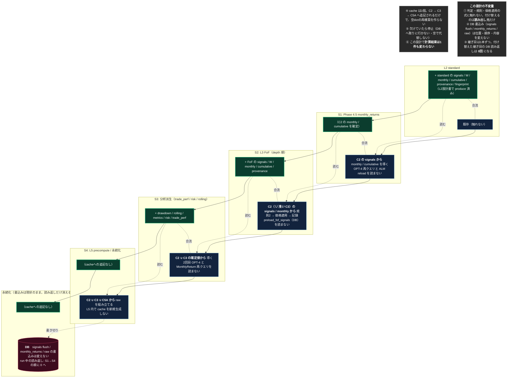

<!-- gist-master: 4735a7fcd4da60120345699baf49ac44 dm-l2-l3-seam-design_20260816.md -->
# 継ぎ目設計 — L2→L3→L5 の受渡しを DB 経由から左列 cache へ（cache 3系統の一本化）

## 原則（親文書と同じ。殿裁定 2026-08-15）

- **ToBeは、構造的に不可能でない限り妥協しない。現実の関数名・行番号・今の実測値で理想を縛らない。理想は磨く。**
- **AsIsは現実のコードそのもの。間違いがあれば現実に合わせて直す。**
- **変更点は文書に書かない。見出しは版番号とタイムスタンプのみ。粒度が足りなければ一番下の注釈にAsIs注釈・ToBe注釈をレイヤー単位で書く。**
- **小さく1手ずつ・儀式なし・パイプライン（殿下知 2026-08-15 18:58-20:59）**: 1手=忍者1体・1タスク・実装(新規テスト/contract test/fixture なし)→push→deploy→full→business parity→次手。full の結果を待つ時間で次手を実装させる。FAIL→積んだ手を全部 revert。

親文書: `dm-unified-tobe-flow_20260815`（gist 12cb3fc4・ToBe v3.12）。前段: `dm-l1-split-design_20260815`（gist 4e64d25b・全6手 live）/ `dm-l2-standard-design_20260815`（gist b4b31391・走行中）。本書は **L2 が C2 を produce している前提**（L2設計書 #4 完了）で、L2→L3→L5 の**受渡し（継ぎ目）だけ**を対象にする。判定・規則・skip・DB最下段（書き切り）は対象外。

**スタート**: L2設計書 #4 完了時点の `origin/main`（AsIs は現行 `430c8950` 時点の継ぎ目の現物で記す。#4 完了時に SHA を更新する）。**ゴール**: run 中に L3・L5 が signals / monthly を **DB から読み返さず**、左列 cache（C2 → C3 → C5A）から読む。**業務値は1件も変わらない**。DB 書込み（flush / monthly_returns / raw）は現状のまま。

---

## AsIs **v1.0** — 2026-08-16T00:40+09:00 / 対象 `origin/main = 430c8950`（継ぎ目の現物。L2 #4 完了時に更新）

**現状、L2 が DB へ書いた signals / monthly を、後段が4箇所で DB から読み返している（cache 3系統）。**

| 継ぎ目 | 現状の実体 | 位置 |
|---|---|---|
| S1: L2 → Phase 4.5 monthly_returns | OPT-4 `db.query(Signal)`(:3412) → `signal_preload` → `signal_cache_opt6` を空dictから再構築(:3434-3438) → `_generate_monthly_returns(signal_cache=signal_cache_opt6)`(:3455 / :3526)。ALM 条件内で `_reload_signal_cache_entries`(:1414、:3523)が再度 `db.query(Signal)`(:1424) | `recalculate_fast.py:3406-3438`（cache系統①） |
| S2: L2 → L3 FoF | `_recalculate_fof_history`(recalculate_fof.py:619) が独自に `signal_cache` を空dictから作り `preload_fof_signals_for_portfolios`(DB) で埋める(:714-723)。構成PFの価格は `ComponentPriceCache`(DB, :727) | `recalculate_fof.py:705-730`。`fof_shared_signal_cache={}`(:3429)は precompute 側へ渡る（cache系統②） |
| S3: L2/L3 → trade_perf / monthly cache | 2回目の OPT-4 `db.query(Signal)`(:3684) と `db.query(MonthlyReturn)`(:3670 付近) → `signal_preload` / `monthly_return_cache` → trade_perf 系 generator(:3789-3791) | `recalculate_fast.py:3660-3695` |
| S4: → L5 precompute | `precompute_raw_for_portfolios(signal_preload=...)`(:3902) が S3 の preload を受け、L5 内で `LazySignalArtifactCache` を新規生成（precompute_raw.py:245、cache系統③） | `recalculate_fast.py:3887-3912` |

**確認できた事実（現物grep・2026-08-16 00:40）**

1. run 中の signals の DB 読み返しは S1・S1(ALM)・S2・S3 の4箇所、monthly の読み返しは S3 の1箇所。
2. 各読み返し先は空 dict から再構築され、互いに共有されない（3系統）。
3. L2設計書の #4 が入ると、同じ内容が左列 C2 に在る（signals / W / monthly / cumulative / provenance）。読み返す必要がなくなる。

---

## ToBe **v1.0** — 2026-08-16T00:40+09:00

**継ぎ目を1本ずつ cache へ付け替える。書込みは変えない。読み返しだけを消す。**

---

## 差分（AsIs → ToBe）

| # | やること | 種別 |
|---|---|---|
| 1 | S1: Phase 4.5 の `signal_cache` を C2 の signals から組む。OPT-4 再クエリ(:3412)と ALM reload(:3523)を読まない | **読み出し元の付け替え** |
| 2 | S2: `_recalculate_fof_history` の `signal_cache` を C2（∪ 浅い depth の C3）から組む。`preload_fof_signals_for_portfolios`(DB) を読まない。FoF の出力を C3 へも合流 | **付け替え + produce** |
| 3 | S3: trade_perf / risk 系の `signal_preload` / `monthly_return_cache` を C2 ∪ C3 から組む。2回目 OPT-4 と MonthlyReturn 再クエリを読まない | **付け替え** |
| 4 | S4: L5 precompute の入力を C2 ∪ C3 ∪ C5A から渡す。L5 内の `LazySignalArtifactCache` 新規生成を止める | **付け替え** |

**全て「読み出し元の付け替え」。書込みは触れない。∴ 業務値は1件も変わらないはず。**

## 二値の合否

| 判定 | 内容 |
|---|---|
| **値** | 各手 full 1回で `monthly_returns` / `portfolio_metrics` が直前基準と業務値差分0（`scripts/dm_signal_business_parity.py`） |
| **読み返し** | 付け替えた継ぎ目の `db.query(Signal)` / `db.query(MonthlyReturn)` が run 経路で0回（コード上の呼出箇所が消えている） |
| **欠け** | cache に無い PF×日を要求したら停止する（DB フォールバックが無い） |
| **cache** | 空dict からの再構築箇所が消え、C2 → C3 → C5A の一本になっている |

## この設計が触れないもの

- judge 一致時の復元（skip）— L2設計書の record-only 一致率を見てから別設計書
- 規則1/規則2・momentum の式、台帳 guard、ALERT
- DB の書込み位置（最下段への集約は最後の設計書）

---

## 注釈（レイヤー単位。図で足りない粒度はここに書く）— 2026-08-16T00:40+09:00

### AsIs 注釈
- **S1**: OPT-4 は「trade_performance + monthly_returns 用」の一括ロードとして入った最適化で、L2 が書いた直後の signals を DB から読み直している。`_reload_signal_cache_entries` は ALM second-pass 条件内のみ。
- **S2**: FoF は「常に全期間再計算」（drift 状態を保存していないため）。入力の signal_cache と構成PF価格を FoF 層の中で DB から組み立てる。
- **S3/S4**: 2回目の OPT-4 と MonthlyReturn 一括ロードが trade_perf・risk・L5 の共通入力。L5 はさらに独自 cache を生成する。

### ToBe 注釈
- **S1**: C2 の signals は L2 が flush 直前に持っていたものと同一（ledger freeze 適用後）。Phase 4.5 の値は変わらない。
- **S2**: depth 順（L1.2 の depth 表）で回し、depth k の FoF は C2 ∪ C3(depth<k) だけを読む。無ければ停止。
- **S3/S4**: 分析派生は導出だけ、判定へ戻さない。L5 は受け取るだけで cache を作らない。
