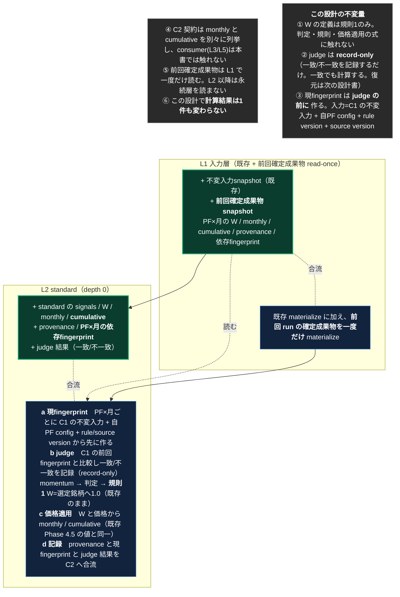

<!-- gist-master: b4b31391ce3782349b60f638e7e405df dm-l2-standard-design_20260815.md -->
# L2分割設計 — AsIs L2 standard を ToBe の L1（前回確定成果物 read-once）+ L2（a fingerprint → b judge → c 価格適用 → d 記録）へ

## 原則（親文書と同じ。殿裁定 2026-08-15）

- **ToBeは、構造的に不可能でない限り妥協しない。現実の関数名・行番号・今の実測値で理想を縛らない。理想は磨く。**
- **AsIsは現実のコードそのもの。間違いがあれば現実に合わせて直す。**
- **変更点は文書に書かない。見出しは版番号とタイムスタンプのみ。粒度が足りなければ一番下の注釈にAsIs注釈・ToBe注釈をレイヤー単位で書く。**
- **小さく1手ずつ・儀式なし・パイプライン（殿下知 2026-08-15 18:58-20:59）**: 1手=忍者1体・1タスク・実装(新規テスト/contract test/fixture なし)→push→deploy→full→business parity→次手。full の結果を待つ時間で次手を実装させる。FAIL→積んだ手を全部 revert。

親文書: `dm-unified-tobe-flow_20260815`（gist 12cb3fc4・ToBe v3.12）。前段: `dm-l1-split-design_20260815`（gist 4e64d25b・全6手 live）。本書は親 ToBe の **L1（前回確定成果物 snapshot の read-once）と L2 standard の内部**だけを対象にする。**L2→L3 の継ぎ目・L3・L5・DB最下段は次の設計書。**

**スタート**: `origin/main = 925b8338` の現物（AsIs）。**ゴール**: L2 の内部が a→b→c→d の順に並び、C2 契約（signals / W / monthly / cumulative / provenance / PF×月 依存fingerprint）が左列 cache へ produce され、L1 が前回確定成果物を read-once している。**業務値は1件も変わらない**（二値の合否）。この2点から逸脱しない。

---

## AsIs **v1.1** — 2026-08-16T03:55+09:00 / 対象 `origin/main = e571b56f`（L2 4手 全て本番 live: #1 0f47de79 / #2 3a5ebd05 / #1b+#3 a71b56fd / #4 1cb7b430+d74e6a79+e571b56f。各手 full→業務値突合 差分0＝**ゴール到達**。run419: C2 signals=99,004(確立前空holding除外426)/monthly=4,737=Phase4.5生成行と一致）

**現状、L1 に前回確定成果物の read-once があり、L2 は a 現fingerprint → b judge(record-only) → 判定 → c 価格適用 → d 記録の順で、C2（`db.info["c2_standard"]`）へ signals / monthly / provenance / fingerprint / judge を produce している。DB flush と Phase 4.5 は不変。誰もまだ C2 を読まない（継ぎ目設計 S1 から）。**

| ToBeでの居場所 | 現状の実体 | 位置（`recalculate_fast.py` / `input_manifest.py`） |
|---|---|---|
| L1 前回確定成果物 snapshot | `_load_previous_confirmed_artifact_snapshot`(:248) → `db.info["previous_confirmed_artifact_snapshot"]`(:2238)、行数を stats へ | `recalculate_fast.py:248 / :2233-2244` |
| L2-a 現fingerprint（PF×月） | `current_pf_month_fingerprints[(pf, year_month)]`(:2061 / :3080) → `db.info["current_pf_month_fingerprints"]`(:2240) | `:2061 / :2240 / :3080` |
| L2-b judge（record-only） | `_judge_pf_month_fingerprint`(:720) を判定より前に呼び `current_fingerprint["judge"]` へ記録(:3074-3080)。判定は judge 結果に関わらず実行(:3073) | `:720 / :3073-3080` |
| L2 判定 / L2 → DB | 既存のまま（日次ループ・pipeline・`_flush_batch` UPSERT・ledger freeze guard） | 変更なし |
| L2-c/d 記録 → C2 | `build_c2_standard_cache`(input_manifest.py:276) で `db.info["c2_standard"]`(:2253) を作り、flush 時に `append_c2_standard_signal_rows`(input_manifest.py:219、`build_signal_cache_value` 形・確立前空holdingは除外)、Phase 4.5 後に `enrich_c2_standard_cache`(input_manifest.py:251) で monthly / fingerprint / judge を合流。読み側helper `_build_c2_standard_signal_cache`(:1448)は S1 用（未接続） | `recalculate_fast.py:2253 / :1448`、`input_manifest.py:206-300` |

**確認できた事実（現物grep・2026-08-16 03:55）**: 上表の全行番号は origin/main=e571b56f の現物。二値の合否=値(run413〜419 差分0) / fingerprint・judge(record-only で記録、決定論と一致率は次runで読む) / 独立性(read-once は L1 のみ) / 契約(monthly と cumulative は C2 の monthly 行(MonthlyReturn)に別列として在る) 全項目PASS。

---

## ToBe **v1.0** — 2026-08-15T22:45+09:00

**L1 に前回確定成果物の read-once を足し、L2 の内部を a→b→c→d に並べ、C2 契約を左列 cache へ produce する。判定・規則・保存値の使い方は変えない（judge は record-only。一致でも計算する）。**

---

## 差分（AsIs → ToBe）

| # | やること | 種別 |
|---|---|---|
| 1 | ~~L1: 前回確定成果物を run 冒頭で一度だけ読み C1 へ置く~~ **本番 live（0f47de79 + 前回fp merge a71b56fd）** | 完了 |
| 2 | ~~L2-a: PF×月の現fingerprint を判定より前に作り C2 へ置く~~ **本番 live（3a5ebd05）** | 完了 |
| 3 | ~~L2-b: judge record-only~~ **本番 live（a71b56fd）** | 完了 |
| 4 | ~~L2-c/d: C2 へ合流~~ **本番 live（1cb7b430 + d74e6a79 + e571b56f、run419 差分0）** | 完了 |

**全4手完了（2026-08-15 22:37 下知 → 2026-08-16 03:50 #4 PASS）。**

## 二値の合否

| 判定 | 内容 |
|---|---|
| **値** | 各手 full 1回で `monthly_returns` / `portfolio_metrics` が直前基準と業務値差分0（`scripts/dm_signal_business_parity.py`）。1件でも差が出たら不合格 |
| **fingerprint** | 同一入力の連続2run で PF×月の現fingerprint が全PF×全月で同値（決定論） |
| **judge** | 連続2run目で一致率が 100%（入力不変ゆえ）。一致でも計算していること（値差分0で兼ねる） |
| **独立性** | L2 以降が永続層を読み返す箇所を増やしていない（読むのは L1 の read-once だけ） |
| **契約** | C2 に monthly と cumulative が別々に在ること |

## この設計が触れないもの

- judge 一致時の**復元（skip）** — 次の設計書（値が変わりうる唯一の点。record-only で一致率100%を確認してから）
- L2→L3 の継ぎ目（OPT-4 再クエリ→C2 受渡し）・L3a / L3b・L5・DB最下段
- 台帳 freeze guard・ALERT・規則1/規則2 の式

**それらは次の設計書で扱う。ここは L1 の read-once と L2 の内部だけ。**

---

## 注釈（レイヤー単位。図で足りない粒度はここに書く）— 2026-08-15T22:45+09:00

### AsIs 注釈
- **L2 判定**: pipeline_engine（precomputed inputs、OPT-E date miss fallback）で `signal` と `pm_data` を出す。月初 rebalance 行だけ P1a の scalar provenance を `pm_data` へ合成。signals は `signals_batch` に溜め、`_flush_batch` で UPSERT。
- **L2 価格適用**: 本書の対象外（継ぎ目側）。DB 再読→`signal_cache_opt6`→`_generate_monthly_returns`。
- **fingerprint**: run単位の `run_identity` のみ。PF×月の依存fingerprint は無い。cmd_4314（fingerprint skip provenance）は 08-15 に revert 済みで本番に無い。

### ToBe 注釈
- **L1 前回確定成果物**: 復元元の候補は「前回 run の確定月」だけ。読むのは run 冒頭一回、以後は C1 にしか無い。判定へは使わない（record-only の比較相手）。
- **L2-a 現fingerprint**: 入力は C1 の不変入力（当該PFの price consumer 依存集合の範囲）+ 自PF config + rule version + source version。run_identity とは別物（不変量⑬）。
- **L2-b judge**: 一致/不一致と理由（入力差/config差/version差）を記録するだけ。復元は次の設計書。
- **L2-c/d**: 既存の値をそのまま C2 へ合流させる。DB flush の位置・順序は変えない。
