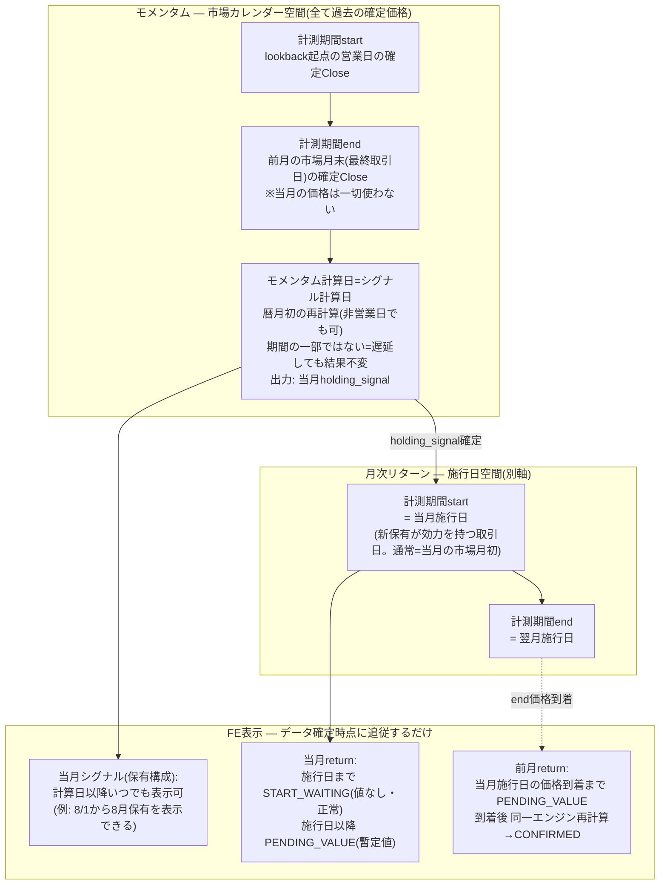

<!-- gist-master: d23c8d202b0e99b0007ef77a2d14d39a dm-monthly-return-design-v6_20260809.md -->
# DM-Signal 月次リターン設計書 v6.2 — 営業日ベース時間軸+6層分離

> **位置づけ**: 殿最優先下知2026-08-09 03:43(原文=`docs/research/dm-monthly-return-first-principles-original_20260809.md`・改変禁止)+殿設計是正指示2026-08-09 09:50(営業日ベース時間軸)に基づく再構築版設計書。**旧v5.22(`docs/research/dm-monthly-trade-bug-asis-tobe-5w1h_20260802.md`)は事故対応・migration・auditの証跡正本として保持し変更しない**。前提知識ゼロのLLMが本書だけで§1-§3の通常モデルを理解できることを設計要件とする。
> **状態**: 設計案(殿裁定待ち論点=§7の2件のみ)。**実装・実装起票・deployは殿の別途下知まで禁止**。
> **形式規約**: スナップショット型。各節は現在の真実のみ。経緯は§6と旧設計書が持つ。
> **検討資料**: 批判レビューR1-R11+Q回答=`dm-monthly-return-first-principles-design-v0_20260809.md`(v0.4)。現物調査=`cmd_4246_monthly_return_principles_recon_20260809.md`。

## §0 最上位原則: 市場計算は営業日ベース+5概念の分離

**営業日 = pricesに市場価格が存在する取引日**(基準symbol=SPY。独自カレンダー禁止)。市場計算の時間軸はこの取引日系列の上にのみ存在する。

| # | 概念 | 定義 | 例(8/1土・8/3月が初回取引日) |
|---|---|---|---|
| 1 | **calendar rollover** | 暦月が変わる瞬間。UI表示・行ラベル(YYYY-MM)・月初再計算バッチ起動の世界 | 8/1に「8月」になる |
| 2 | **market month boundary** | **月初=当月の初回取引日、月末=当月の最終取引日**。momentumやticker系列が住む市場カレンダー。※momentumのデータ終点=前月の市場月末の確定Close(情報カットオフ) | 8月の月初=8/3。8/1・8/2に「8月月初のOpen/Closeが欠損」と考えるのは誤り — **初回取引日がまだ到来していないだけ** |
| 3 | **signal decision date(シグナル計算日)** | 翌月(当月)のholding_signalが**初めて算出される日**。月初再計算の実行日=暦日ベースのシステム処理日であり、**市場時間軸の住人ではない**(非営業日でも計算は走る)。ledger実装対応物=`rebalance_decision_date` | 8/1(土)の月初再計算で8月holdingが算出される |
| 4 | **portfolio execution boundary(リバランス施行日)** | PFの保有構成が**実際に効力を持って切り替わった取引日**。ledger実装対応物=`effective_start_date`(が本来記録すべきもの) | 通常=市場月初と一致(8/3)。2022-04: 月初=4/1、施行=4/4。**4/4を月初と呼んではならない** |
| 5 | **月次リターンの計算期間** | §1で定義(execution boundary間)。上の1-4のどれとも自動同一視しない | 「2022-03」行の期間終端は4/4 |
| 6 | **pending / confirmed** | データ確定状態。時間概念ではない(§3) | 7月末〜8/3の間、7月はend未確定 |

暦日1日を「月初」と呼んで市場計算へ使用してはならない。非取引日(土日祝)に市場価格は存在せず、それで正常である — 存在しない価格を捏造せず、状態(§3)で扱う。**計算日(#3)と施行日(#4)の混同は本事案の歴史データ破損の根因そのもの**である — 歴史backfillは`effective_start_date`を`rebalance_decision_date`の複写で埋め、2022-04型(計算4/1・施行4/4)を全て4/1と誤記録した(§4.1)。

### §0.2 時間軸ワイヤーフレーム

**通常ケース(2026-07→08、暦日1日が休日)**:

```
◄──────── 7月 ────────►│◄──────────── 8月(暦) ────────────
  7/30      7/31       │   8/1        8/2       8/3        8/4…
  木        金         │   土         日        月         火
  取引日     取引日      │   休         休        取引日      取引日
──────────────────────┼──────────────────────────────────────
            ▲市場月末#2 │  ▲calendar rollover#1
            (7月最終取引日)│  ▲シグナル計算日#3(月初再計算=
            ▲momentum   │    8月holding算出。暦日ベース・
             データ終点   │    非営業日でも計算可)
            (7/31確定Close)│                    ▲市場月初#2
                        │                     (8月初回取引日)
                        │                    ▲リバランス施行日#4
                        │                     (通常=市場月初と一致)
月次リターン期間#5(YYYY-MM帰属):
  「7月」= 7月施行日 ══════════════════════════► 8/3(=8月施行日)
  「8月」=                                      8/3 ══════►
状態#6: 8/1-8/2 → 7月=PENDING_VALUE / 8月=START_WAITING
        8/3市場後 → 7月=CONFIRMED / 8月=PENDING_VALUE(進行中)
```

**施行遅延ケース(2022-04実例) — 計算日・月初・施行日が全てズレる**:

```
  3/31        4/1                4/4
  木          金                 月
  ▲市場月末#2  ▲calendar rollover#1  ▲リバランス施行日#4(遅延)
  ▲momentum   ▲シグナル計算日#3      =execution boundary(4月)
   データ終点   ▲市場月初#2(4月初回取引日)
              ※月初は4/1のまま。4/4を月初と呼ばない
  「3月」期間 = 3月施行日 ═══════════► 4/4 (4/1→4/4の騰落は3月へ帰属)
  「4月」期間 =                       4/4 ═══►
```

### §0.3 モメンタム×リターン×FE表示のフローチャート(当月Mの1サイクル)

**核心**: ①momentumの計測期間(start/end)は**全て過去の確定Close**で閉じている(end=前月の市場月末)。②**計算日は期間の一部ではない** — 情報が揃った後の処理日であり、遅らせても結果は変わらない。③returnの計測期間は**施行日空間の別軸**。④FE表示は3つのデータの確定時点に追従するだけ。この4つを混ぜないこと。



読み方(2026-08の例): 7/31(金)市場月末Closeでmomentum入力が閉じる → 8/1(土)計算日に8月holding算出 → **FEは8/1から8月シグナルを表示できる** → 8/3(月)施行日に効力 → 8月returnはそこからPENDING_VALUE、7月returnは8/3価格でCONFIRMEDへ。8/1-8/2に「8月returnがない」のは欠損ではなくSTART_WAITING。

## §0.1 現在地(2026-08-09 スナップショット)

- 本番: run232(full)完走で全履歴復旧済み(102PF・16,976行・2003-09〜2026-08、事前baseline完全一致)。stale ledger修正deploy済み(run224)。PUBLICABLE=YES
- §3のlifecycleは**未実装**(本書が設計する対象)。暫定運用: fullrecalculateは**mode='full'のみ**(殿裁定03:03・知識層ルール)。理由=§4.4(cmd_4245 FAIL-close)
- 旧v5.22の是正残工程(D/E系、全体75%)は本書により無効化されない — §4の台帳として続行

---

## §1 不変の基本原理

1. **Return = EndValue / StartValue − 1**。それ以上の数学はない。複雑なのは計算式ではなく周辺状態(Start/Endがいつ成立するか・どのholdingが効力を持つか・入力がpendingかconfirmedか・壊れた履歴の復元)であり、**この複雑性をreturn engine本体へ押し込まない**。
2. **monthly_returnの意味(一意)**: **当月のexecution boundary→翌月のexecution boundaryの実保有期間成績を、当月ラベルYYYY-MMへ帰属させた値**である(下記「Q12回答」)。市場カレンダー月の成績ではない。
3. **execution boundary**: 全ての暦月に必ず1つ。保有切替がある月=切替が実際に効力を持った取引日。切替がない月=当月の月初(初回取引日。RULE06月次リセットの効力日=殿裁定2026-08-03 02:14、drift変更なし)。**切替なし月はexecution boundaryが月初と一致するが、これは特殊ケースの一致であり定義の同一視ではない。**
4. **系列分離**: Close系列=境界日のclose同士、Open系列=境界日のopen同士。確定returnにおいて混在禁止(RULE09)。
5. **gapゼロ**: 連続する計算期間は**同一の境界時点を共有し、市場時間上のgapを作らない**(2022-04実例: 4/1→4/4の騰落は「2022-03」期間が吸収)。※保証されるのは時点の共有であり、境界でholdingsが変わるため「終点価格=起点価格」という数値同一性ではない。
6. **momentum分離**: Standard PFのmomentum判定は市場カレンダー(概念2)の住人 — 終点=月末(最終取引日)の確定価格、始点=lookback依存の営業日価格。**今回変更しない**(現行実装=裁定と一致)。FoFのsignal差は「momentum algorithm変更」ではなく「子PFのmonthly return系列是正によるinput変化の二次効果」。
7. **一次データ不可侵**: pricesは事実のみ。存在しない営業日・価格の行を作らない。仮計算値と仮の市場価格は別物。
8. **正常な未到着と異常な欠損は別物**: 前者=§3の状態で扱い表示を止めない。後者=ERROR・fail-visible(fallback禁止: holding_signal欠損・weights空を0や代用値で握りつぶさない)。
9. **シグナル遡及原則**(殿裁定2026-08-03 02:34): price遡及由来のsignal差=維持(guard)。計算ルール是正由来=正しいシグナルを受け入れ本番も修正。

### Q12回答: monthly_returnとは何か(実装前に固定すべき一点)

**C: execution boundary間の実保有期間成績をYYYY-MMへ帰属させた値**。根拠: ①殿裁定§0.6(区間=境界日→翌月境界日・空白ゼロ、実例2022-03≈+13.34%は4/4まで延長した値) ②生成コード現物=boundary解決→区間return→year_monthへUPSERT(cmd_4246 §2.2) ③RULE06毎月リセットの効力日が期間起点。**市場カレンダー月の成績(A)はsymbol層のticker_monthly_returnsが担う** — システム内にAとCの2意味論が共存し、PF層=C・ticker層=A・momentum=市場カレンダー(A空間)と住み分ける。この共存の明示こそがv5系の混乱(「月中トレード」誤認・境界と月初の混同)の再発防止である。

### §1.1 前提知識(自己完結)

- **DM-Signal**: 投資PFシグナル配信アプリ。repo=`/mnt/c/Python_app/DM-signal`(FastAPI+PostgreSQL、Render稼働)
- **PFの2型**: `standard`(ticker×weight直接構成) / `fof`(他PF組合せ。holding_signalは子PF UUID。入れ子あり)。下位層が誤れば上位層は必ず誤る
- **主要テーブル**: `signals`(holding_signal=確定保有。生signal代用禁止) / `monthly_returns`(PF×year_month、Close/Open両列) / `trade_performance`(境界イベント記録) / `prices`(配当調整済み。調整=stock data API側の責務) / `signal_decision_ledger`(保有決定のappend-only正本)
- **取引費用=0**(システムに費用概念なし)

---

## §2 通常リアル運用(単一エンジン)

### §2.1 エンジンは一つ

```
calculate_return(start_input, end_input, holdings) = end_value / start_value − 1
  start_input = (取引日, その日の価格系列値)   # 通常は当月execution boundary。PF初月のみ実運用開始日
  end_input   = (取引日, その日の価格系列値)   # 確定時は翌月execution boundary。未確定時はprovisional(§3)
  holdings    = 当該期間に効力を持つ確定保有(signals→再帰展開)
```

- pending用の別計算式を作らない。provisional/MTD/historical calculatorという分岐は禁止。**same engine, different input certainty**。
- 現物根拠(cmd_4246): 現行MTDは既に同一`calculate_monthly_return`で動的再計算しており、実装距離は近い。
- **通常経路の分岐の全量** = 系列(Close/Open)×入力確定度(confirmed/provisional)の直積のみ。これで説明できない分岐は§4/§5からの漏出=削除対象。
- 通常運用の理解に必要な概念は**7つ**まで: 取引日系列・market month start/end・execution boundary・holdings・price series・input certainty・single engine。ledger resolver・anchor・oracle・checkpoint・historical backfillを通常経路の説明へ持ち込まない。

### §2.2 記録レイヤー(エンジン外)

- `monthly_returns`: エンジン出力の保存先(保存契約は§3.4)。
- `trade_performance`: 境界イベントの記録。正規形=境界/trigger eventごと1行・gap/overlap 0・型はrebalance_trigger由来に統一・暫定値/非取引日付の行禁止(殿裁定2026-08-03 02:25)。**月次リターン計算はtrade_performanceを読まない**。
- `signals`/`ledger`: 保有の正本。通常運用は確定holdingsとして消費するのみ(境界導出の複雑性は§4.1)。

---

## §3 pending→confirmed lifecycle(データ確定状態)

### §3.1 4つの意味論(最小設計)

| 意味論 | 条件 | 値 | 性質 |
|---|---|---|---|
| **START_WAITING** | 計算期間が始まっていない(当月execution boundaryが未到来。例: 暦は8月だが8月初回取引日前) | **値なし**(returnはまだ存在しない) | 正常。ERRORでも欠損でもない |
| **PENDING_VALUE** | startは成立、endが未確定(翌月境界未到来=進行月、または月替わり直後) | **暫定評価値**。同一エンジンでprovisional end入力により計算 | 正常。**provisional値≠confirmed monthly return**(入力確定度が違えば値の意味が違う) |
| **CONFIRMED** | start/endとも正式確定 | 確定値 | 保存対象 |
| **ERROR** | 到着済みであるべき入力の欠損(holding_signal欠損・weights空・必須過去価格欠落・config破損) | fail-visible | pendingで握りつぶさない |

START_WAITINGとPENDING_VALUEの分離が本設計の要: 前者は「期間が始まっていない」(値を出せば捏造に近づく)、後者は「始まったが終わっていない」(値を出さなければUIが不当に消える)。v6.0の単一PENDING_EXPECTEDはこの2つを潰していた(§6是正一覧#3)。status名・実装方式は固定しない — 意味論の分離が要件であり、表現は§3.4の最小提案に従う。

### §3.2 実例タイムライン

**例1(暦日1日が休日): 7/31金→8/1土→8/2日→8/3月(8月初回取引日・切替効力日)**
- 8/1・8/2: 暦は8月(calendar rollover済み)だが8月の市場月初=8/3は未到来。**7月=PENDING_VALUE**(start=7月境界で成立済み、end=8月境界未到来。provisional endで暫定評価)。**8月=START_WAITING**(値なし・正常)。
- 8/3市場後: 8月execution boundary成立+価格到着 → 7月のend_inputをprovisional→正式値へ置換し**同一エンジンで再計算**→CONFIRMED。8月=PENDING_VALUE(進行月)開始。
- 再計算は既存の定期再計算サイクルに乗せる(新規自動発火機構は作らない=殿裁定03:01/03:04)。

**例2(月初と切替日のズレ): 4/1=4月月初(初回取引日)、4/4=切替効力日**
- 月初は4/1のまま(市場概念)。execution boundaryは4/4(PF概念)。「2022-03」期間=3月境界→4/4で、4/1→4/4の騰落は3月行へ帰属。gapゼロ。4月期間は4/4開始。

### §3.3 provisional source(設計既定値+裁定論点)

- **Close系列(既定値)**: provisional end=as_of以前の最新利用可能Close。一次データのみ・休日連続でも自明。取得機構は現行`PriceCache`のbackward解決が実装済み(cmd_4246 §5)。
- **Open系列(裁定論点=§7-2)**: 「start=Open、provisional end=最新Close」は系列混在(RULE09)と衝突する。現物(cmd_4246): `/api/mtd`はOpen系列に限り最終確定日のClose/Open比を使う`is_preliminary=true`行を既に持つ(暫定行はmonthly_returnsへ非保存)。設計案2つを§7-2に提示、独断で決めない。
- 必須追跡フィールド(下知■3): value・status・provisional理由(missing_requirement=何が到着すれば確定するか)・使用したstart/end(取引日)・使用したprice type(系列とprovisional種別)・as_of・provisional_source。「とりあえずfallback」の暗黙実装は禁止。

### §3.4 UI/API/DBの最小設計(提案)

- 現状(cmd_4246確定): 価格未到着の新月にMonthly Trade APIは`is_pending=true`を動的生成、Monthly Returns APIは404 — 三者で意味論不一致。schemaにstatus/as_of/provenance列なし。
- **最小提案**: DB保存=**CONFIRMEDのみ**(現行構造に最も近い。confirmed偽装が構造的に不可能)。START_WAITING/PENDING_VALUEは**API層が都度計算しstatusを明示して返す**(既存Monthly Tradeの動的pending機構を全APIへ統一一般化)。DB enumは増やさない。UIはstatusを表示に反映(PENDING_VALUE=暫定表示、START_WAITING=開始待ち表示)。precomputed_raw cacheはconfirmed成分のみ保持。
- 「UIに常に値が必要だからconfirmedを偽装する」方式は禁止(下知■11)。

---

## §4 historical repair(隔離レイヤー — 通常計算に持ち込まない)

今回事故の複雑性は全てここに住む。**正本・全証跡=旧v5.22**(本節は要点のみ)。

### §4.1 historical boundary resolver
歴史データからexecution boundaryを**導出**する機構(§1の定義とは別物): verification付き導出式=`verified(ledger.effective_start_date == expanded実切替日) ? ledger値 : expanded実切替日`。無条件ledger優先・単純COALESCE禁止・root日付不採用(2022-04実証)。理由=**§0概念表#3と#4の混同の歴史**: 歴史backfillが施行日(`effective_start_date`=#4)を計算日(`rebalance_decision_date`=#3)の複写で埋めたため、歴史15,212行のledger値が信頼できない。将来月は施行時に効力日(#4)を直接記録すればresolver不要(cmd_4246: backfill eventを読み側resolverがevent_type区別なく通常候補へ入れる混入も確認→source/provenance分離が必要)。

### §4.2 stale ledger失効(修正済み)
effective_end=NULL無期限適用バグ(異常25PF)は修正deploy済み(run224完走・境界テスト121件PASS)。

### §4.3 修復・検証装置(v5.22正本)
24行anchor・78PF checkpoint・B4a-e段階実験・実行順序7段・backupファースト+PF単位restore・レーンS dual replay(guard1,249/apply72)・是正工程WBS(D/E系残)。本書により無効化されず続行。

### §4.4 confirmed履歴の保全ガード(cmd_4245顛末と配置契約)
初回実装(c469ba6f)はrun231でFAIL確定: mode=portfolio全PF実行時、Phase0一括cleanupがガード到達前に全PF履歴をDELETEするためexisting_min/max=NULLで狭い結果を素通し(16,976→3,248行の退行)。revert 4d81c32+run232 fullで復旧済み。**配置契約**: 保全ガードは履歴を消し得る全操作の上流で効かなければ無意味。真因の設計層表現=「全消し→全再構築(full rebuild semantics)」の通常経路常駐 — ToBe: 通常経路は該当期間の置換のみ、全消し再構築は本レイヤーの明示操作に限定。後継ガードはこの分離とセットで設計(実装は別途下知)。暫定防御=mode='full'のみ運用(§0.1)。

---

## §5 verification / migration(隔離レイヤー)

- **確定仕様オラクル**: primitive入力からの独立再帰計算(入力SSOT=v5.22)。数値意味論: 本番同一float64・独自丸め禁止・比較は保存前round規約(round(x,10)=round-half-even)量子化後のexact一致のみ(殿裁定=v5.22 §0.6-8)。
- **検証者規約4問**: ①実運用開始日以降か ②確定済み月か ③境界をexecution boundary(§1-3)で解決したか(誤り方2種: 暦日1日固定/月初固定) ④リターン期間とモメンタム窓を混同していないか。
- **遡及原則の実装**: recalc invocationへ明示mode(price_retro=guard / rule_correction=適用+ledger再基線 / 未知=fail-closed。v5.22 B2e)。
- **常設監視は最小2つ**: 正規形違反INSERT拒否gate+月次1サイクル自然検証。
- **migration(lifecycle導入時)**: API status追加・cache整合・既存行の扱いは§7裁定後に本節の移行計画として設計(backup+可逆。実装は別途下知)。

---

## §6 incident history(ポインタ)

- 事故の全経緯・棄却済み仮説(5件・再調査禁止)・WBS44工程・改訂履歴約90版=旧v5.22(保持・無変更)+`dm-monthly-trade-bug-genko-chain-archive_20260803.md`+gist 8cbc86a5
- 事故サマリ: 殿指摘2026-08-02「複数PFで極端にCAGR低下」→真因=月次境界仕様未明文+月初固定実装(執行ずれ月の空白脱落)→§0.6裁定→復旧→stale ledger→run231退行→いずれも復旧済み(§0.1)
- 本書の成立: 殿下知03:43(基本原理再整理)→Q回答3/3収束→cmd_4246現物調査→v6.0→**殿レビュー09:50(営業日ベース時間軸)→v6.1**
- 関連: 運用診断則=`context/dm-signal-ops.md` §89-§91

### v6.0からの是正一覧(殿レビュー09:50による)

| # | v6.0の問題 | v6.1の是正 |
|---|---|---|
| 1 | 「月次境界日」1語にcalendar/market/executionの3概念を潰していた(「8月境界価格が存在しない」等の誤表現) | §0の5概念分離。8/1-8/2=「初回取引日未到来」と正名 |
| 2 | execution boundaryを事実上「月初」扱い(4/4を境界=月初と呼ぶ危険) | 月初=初回取引日に固定。4/4は切替日であり月初ではない |
| 3 | PENDING_EXPECTED単一状態に「未開始」と「暫定値あり」を詰め込み | START_WAITING / PENDING_VALUEへ分離(§3.1) |
| 4 | provisional値とconfirmed returnの意味差が未明記 | §3.1に明記(same engine, different input certainty=値の意味も異なる) |
| 5 | 「前月の終点価格=当月の起点価格」は数値同一性を含意し過剰 | 「同一境界時点の共有・市場時間gapゼロ」へ精密化(§1-5) |
| 6 | provisional source案CのOpen系列適用が系列混在と衝突 | 系列別に分離。Close=既定値、Open=裁定論点§7-2 |
| 7 | monthly_returnの意味(A/B/C)が未明示 | Q12回答=C を§1に固定。ticker層=A/momentum=A空間との共存を明示 |

### §0.6全条項の収容対応表(裁定の逸失ゼロ)

| v5.22 §0.6条項 | v6.1の所在 |
|---|---|
| 1 境界日定義+導出優先順位 | 定義=§1-3 / 導出式=§4.1 |
| 2 空白ゼロ | §1-5(表現精密化) |
| 3 系列分離 | §1-4+§3.3 |
| 4 モメンタム窓 | §1-6 |
| 5 月の四分類 | §3.1の4意味論へ簡約(Normal=CONFIRMED/MTD=PENDING_VALUE/Partial=start入力差/未開始=行なし。分類概念は廃止) |
| 6 取引費用0 | §1.1 |
| 7 fallback禁止・fail-visible | §1-8+§3.1 ERROR |
| 8 数値意味論 | §5 |
| trade_performance正規形 | §2.2 |
| シグナル遡及原則 | §1-9+§5 |
| 検証者規約4問 | §5 |

### 因果リンク

`[[殿下知_月次リターン基本原理再整理_20260809]] -> [[殿レビュー_営業日ベース時間軸_20260809]] -> [[dm-monthly-return-design-v6_20260809]] v6.1 -> [[pending_confirmed_lifecycle]] + [[migration_incident_recovery_layer]]分離`

---

## §7 殿裁定が必要な論点(最小2件)

1. **monthly_return意味論の確認**: §1のQ12回答=**C(execution boundary間の実保有期間成績をYYYY-MMへ帰属)**でよいか。既存裁定(§0.6)の再確認であり新裁定ではないが、全設計の土台ゆえ固定の確認を乞う。
2. **Open系列のpending方式**: 案A=系列純度厳守(provisional end=as_of以前の最新利用可能Open。欠点: 当日Closeまでの値動き不反映) / 案B=pending表示は系列別returnでなく「provisional valuation」1本(最新確定価格ベース。Open/Close確定returnとは別ラベル。現行`/api/mtd`のis_preliminary運用に近い)。※その他の旧未決(Close provisional source・DB永続化方式・未開始月表示)は§3.3-§3.4の設計既定値として吸収済み — 既定値の否認があれば申されよ。

## 改訂履歴

- v6.2 (2026-08-09 10:3x): 殿指摘10:30反映 — 概念表へ**signal decision date(シグナル計算日)**を追加し6概念へ(計算日#3と施行日#4の混同=歴史backfill破損の根因であることを明記、ledgerフィールド対応を固定)。§0.2時間軸ワイヤーフレーム新設(通常ケース2026-08+施行遅延ケース2022-04の2図)。§4.1を概念表#3/#4参照へ接続
- v6.1 (2026-08-09 09:5x): 殿設計是正指示09:50反映 — 営業日ベース最上位原則+5概念分離を§0へ新設、§1をexecution boundary用語で書き直し(Q12回答=C意味論を固定)、§3をSTART_WAITING/PENDING_VALUE/CONFIRMED/ERRORの4意味論へ再設計、provisional値≠confirmed明記、gapゼロ表現精密化、Open系列pendingを裁定論点化。v6.0是正一覧を§6へ記録。裁定論点を2件へ最小化
- v6.0 (2026-08-09 09:3x): 新規作成(将軍直轄)。6層構造+§0.6全条項収容対応表。旧v5.22は保持・無変更
