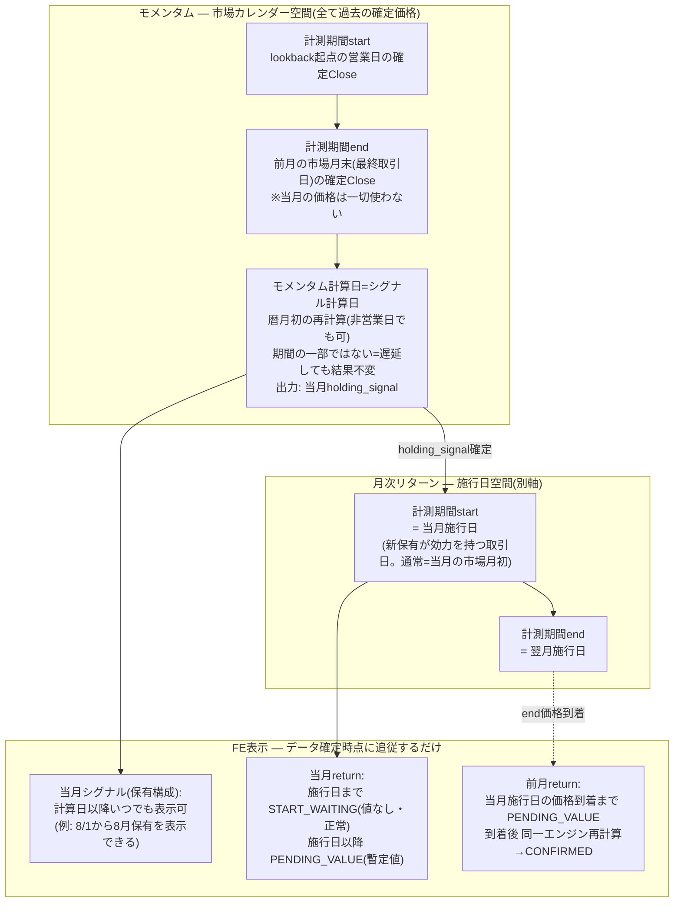

<!-- gist-master: d23c8d202b0e99b0007ef77a2d14d39a dm-monthly-return-design-v6_20260809.md -->
# DM-Signal 月次リターン設計書 v6.9 — 営業日ベース時間軸+6層分離

> **位置づけ**: 殿最優先下知2026-08-09 03:43(原文=`docs/research/dm-monthly-return-first-principles-original_20260809.md`・改変禁止)+殿設計是正指示2026-08-09 09:50(営業日ベース時間軸)に基づく再構築版設計書。**旧v5.22(`docs/research/dm-monthly-trade-bug-asis-tobe-5w1h_20260802.md`)は事故対応・migration・auditの証跡正本として保持し変更しない**。前提知識ゼロのLLMが本書だけで§1-§3の通常モデルを理解できることを設計要件とする。
> **状態**: 設計案。**裁定論点は全て解決済み**(§7。残るのは保留事項1件=バックテスト/ライブ区別のみ)。**実装・実装起票・deployは殿の別途下知まで禁止**。
> **形式規約**: スナップショット型。各節は現在の真実のみ。経緯は§6と旧設計書が持つ。
> **検討資料**: 批判レビューR1-R11+Q回答=`dm-monthly-return-first-principles-design-v0_20260809.md`(v0.4)。現物調査=`cmd_4246_monthly_return_principles_recon_20260809.md`。

> **★冒頭明記(momentum分離・下知■10+殿裁定2026-08-09 11:18で精密化)**: モメンタム計算と月次リターンは**別系統**である。**momentum窓ルール**(終点=前月の市場月末の確定終値、始点=lookback依存の営業日価格、全て営業日ベース)は本書を通じて**一切変更しない** — standard PFの現行実装はこのルールと一致しており変更不要。月次リターン修正のためにmomentum windowを変更してはならない。**ただしFoFのmomentum「入力系列の構成方法」は是正対象**(§2.3) — 現行FoFは子PFの月次擬似価格を入力とし、同一窓ルールを適用できない格子に立っている。是正=入力をstandardと同じ日次・市場カレンダー格子(子PF日次NAV)へ正規化し**同一ルールへ準拠させる**こと。これは窓ルールの変更ではなくルールへの準拠是正であり、それによるFoF signal変化は遡及原則(ルール是正由来=受容、§1-9)で扱う。

### 本書の読み方(前提知識ゼロの読者向け凡例)

本書は他のCLI・他のLLM・人間など、本プロジェクトの経緯を知らない読者も対象とする。以下の内部用語だけ先に押さえれば全文が読める:

| 表記 | 意味 |
|---|---|
| **殿** | プロジェクトオーナー=最終裁定者。「殿裁定YYYY-MM-DD HH:MM」は確定済み仕様決定とその日時 |
| **下知■N** | 殿の指示原文(`dm-monthly-return-first-principles-original_20260809.md`)の節番号N |
| **cmd_XXXX** | 内部作業チケットID。調査証跡は`docs/research/`配下の同名ファイル |
| **run NNN** | 本番の再計算ジョブ実行ID(recalculation_statusテーブルの通し番号) |
| **fullrecalculate** | 全PF・全期間を再計算する本番バッチ。cron(暦月初および日次)の定期実行と手動実行がある。「月初cron」=暦日1日に走る定期再計算 |
| **RULE01-11** | 取引ルール正本`docs/rule/trade-rule.md`(DM-Signal repo)の条番号。RULE06=毎月ウェイトリセット、RULE09=Open/Close系列混在禁止 |
| **状態記号** | **⏳**=開始待ち(値なしが正常) / **◧**=暫定値(未確定) / **✓**=確定。§3.1の意味論に対応(⏳=START_WAITING、◧=PENDING_VALUE、✓=CONFIRMED) |
| **ティッカー例** | 本書のTQQQ・XLU・TMV等の構成は全て**例示**であり実際の推奨・シグナルではない |
| **v5.22** | 本書の前身=事故対応設計書。証跡正本として保持(冒頭「位置づけ」参照) |

## §0 最上位原則: 市場計算は営業日ベース+5概念の分離

**営業日 = pricesに市場価格が存在する取引日**(基準symbol=SPY。独自カレンダー禁止)。市場計算の時間軸はこの取引日系列の上にのみ存在する。

| # | 概念 | 定義 | 例(8/1土・8/3月が初回取引日) |
|---|---|---|---|
| 1 | **calendar rollover** | 暦月が変わる瞬間。UI表示・行ラベル(YYYY-MM)・月初再計算バッチ起動の世界 | 8/1に「8月」になる |
| 2 | **market month boundary** | **月初=当月の初回取引日、月末=当月の最終取引日**。momentumやticker系列が住む市場カレンダー。※momentumのデータ終点=前月の市場月末の確定Close(情報カットオフ) | 8月の月初=8/3。8/1・8/2に「8月月初のOpen/Closeが欠損」と考えるのは誤り — **初回取引日がまだ到来していないだけ** |
| 3 | **signal decision date(シグナル計算日)** | 翌月(当月)のholding_signalが**初めて算出される日**。月初再計算の実行日=暦日ベースのシステム処理日であり、**市場時間軸の住人ではない**(非営業日でも計算は走る)。ledger実装対応物=`rebalance_decision_date` | 8/1(土)の月初再計算で8月holdingが算出される |
| 4 | **portfolio execution boundary(リバランス施行日)** | PFの保有構成が**実際に効力を持って切り替わった取引日**。ledger実装対応物=`effective_start_date`(が本来記録すべきもの) | 通常=市場月初と一致(8/3)。2022-04: 月初=4/1、施行=4/4。**4/4を月初と呼んではならない** |
| 5 | **月次リターンの計算期間** | §1で定義(execution boundary間)。上の1-4のどれとも自動同一視しない | 「2022-03」行の期間終端は4/4 |
| 6 | **pending / confirmed** | データ確定状態。時間概念ではない(§3) | 7月末〜8/3の間、7月はend未確定 |

暦日1日を「月初」と呼んで市場計算へ使用してはならない。非取引日(土日祝)に市場価格は存在せず、それで正常である — 存在しない価格を捏造せず、状態(§3)で扱う。**計算日(#3)と施行日(#4)の混同は本事案の歴史データ破損の根因そのもの**である — 歴史backfillは`effective_start_date`を`rebalance_decision_date`の複写で埋め、2022-04型(計算4/1・施行4/4)を全て4/1と誤記録した(§4.1)。

### §0.2 時間軸ワイヤーフレーム

**通常ケース(2026-07→08、暦日1日が休日)**:

```
◄──────── 7月 ────────►│◄──────────── 8月(暦) ────────────
  7/30      7/31       │   8/1        8/2       8/3        8/4…
  木        金         │   土         日        月         火
  取引日     取引日      │   休         休        取引日      取引日
──────────────────────┼──────────────────────────────────────
            ▲市場月末#2 │  ▲calendar rollover#1
            (7月最終取引日)│  ▲シグナル計算日#3(月初再計算=
            ▲momentum   │    8月holding算出。暦日ベース・
             データ終点   │    非営業日でも計算可)
            (7/31確定Close)│                    ▲市場月初#2
                        │                     (8月初回取引日)
                        │                    ▲リバランス施行日#4
                        │                     (通常=市場月初と一致)
月次リターン期間#5(YYYY-MM帰属):
  「7月」= 7月施行日 ══════════════════════════► 8/3(=8月施行日)
  「8月」=                                      8/3 ══════►
状態#6: 8/1-8/2 → 7月=PENDING_VALUE / 8月=START_WAITING
        8/3市場後 → 7月=CONFIRMED / 8月=PENDING_VALUE(進行中)
```

**施行遅延ケース(2022-04実例) — 計算日・月初・施行日が全てズレる**:

```
  3/31        4/1                4/4
  木          金                 月
  ▲市場月末#2  ▲calendar rollover#1  ▲リバランス施行日#4(遅延)
  ▲momentum   ▲シグナル計算日#3      =execution boundary(4月)
   データ終点   ▲市場月初#2(4月初回取引日)
              ※月初は4/1のまま。4/4を月初と呼ばない
  「3月」期間 = 3月施行日 ═══════════► 4/4 (4/1→4/4の騰落は3月へ帰属)
  「4月」期間 =                       4/4 ═══►
```

### §0.3 モメンタム×リターン×FE表示のフローチャート(当月Mの1サイクル)

**核心**: ①momentumの計測期間(start/end)は**全て過去の確定Close**で閉じている(end=前月の市場月末)。②**計算日は期間の一部ではない** — 情報が揃った後の処理日であり、遅らせても結果は変わらない。③returnの計測期間は**施行日空間の別軸**。④FE表示は3つのデータの確定時点に追従するだけ。この4つを混ぜないこと。



読み方(2026-08の例): 7/31(金)市場月末Closeでmomentum入力が閉じる → 8/1(土)計算日に8月holding算出 → **FEは8/1から8月シグナルを表示できる** → 8/3(月)施行日に効力 → 8月returnはそこからPENDING_VALUE、7月returnは8/3価格でCONFIRMEDへ。8/1-8/2に「8月returnがない」のは欠損ではなくSTART_WAITING。

## §0.1 現在地(2026-08-09 スナップショット)

- 本番: run232(full)完走で全履歴復旧済み(102PF・16,976行・2003-09〜2026-08、事前baseline完全一致)。stale ledger修正deploy済み(run224)。PUBLICABLE=YES
- §3のlifecycleは**未実装**(本書が設計する対象)。暫定運用: fullrecalculateは**mode='full'のみ**(殿裁定03:03・知識層ルール)。理由=§4.4(cmd_4245 FAIL-close)
- 旧v5.22の是正残工程(D/E系、全体75%)は本書により無効化されない — §4の台帳として続行

---

## §1 不変の基本原理

1. **Return = EndValue / StartValue − 1**。それ以上の数学はない。複雑なのは計算式ではなく周辺状態(Start/Endがいつ成立するか・どのholdingが効力を持つか・入力がpendingかconfirmedか・壊れた履歴の復元)であり、**この複雑性をreturn engine本体へ押し込まない**。
2. **monthly_returnの意味(一意)**: **当月のexecution boundary→翌月のexecution boundaryの実保有期間成績を、当月ラベルYYYY-MMへ帰属させた値**である(下記「Q12回答」)。市場カレンダー月の成績ではない。
3. **execution boundary**: 全ての暦月に必ず1つ。保有切替がある月=切替が実際に効力を持った取引日。切替がない月=当月の月初(初回取引日。RULE06月次リセットの効力日=殿裁定2026-08-03 02:14、drift変更なし)。**切替なし月はexecution boundaryが月初と一致するが、これは特殊ケースの一致であり定義の同一視ではない。** **将来の規範(殿裁定2026-08-09 11:07)**: 施行日=**シグナル計算後の最初の取引日に固定**する。遅延施行は正規状態ではなく検知すべき異常(ERROR側)。歴史の遅延実例(2022-04の4/4)は§4の事実として保持し、書き換えない。
4. **両系列の常時提供+分離(DM-signalのidentity — 殿裁定2026-08-09 11:29で昇格)**: **open to openとclose to closeは常に切替可能でなければならない**。これは従来のバックテスト(close-to-close慣行のみ=リアル執行との乖離を隠す)へのアンチテーゼであり、乖離そのものを可視化することがDM-signalの存在理由である。DashboardのMTDリターンはこの思想のリアルタイム実装。**pending状態でも両系列の切替を殺してはならない**(§3.3)。系列内の規約: Close系列=境界日のclose同士、Open系列=境界日のopen同士。確定returnにおいて混在禁止(RULE09)。**主従(殿裁定11:07)**: Open系列=主(体験系列 — 計算日後の初回取引日の寄付きで執行する仮想投資家の実体験)、Close系列=副(慣行・比較用)。**FE表示デフォルト=open to open**へ変更する(migration対象)。
5. **gapゼロ**: 連続する計算期間は**同一の境界時点を共有し、市場時間上のgapを作らない**(2022-04実例: 4/1→4/4の騰落は「2022-03」期間が吸収)。※保証されるのは時点の共有であり、境界でholdingsが変わるため「終点価格=起点価格」という数値同一性ではない。
6. **momentum分離**: momentum判定は市場カレンダー(概念2)の住人 — **窓ルール**(終点=前月市場月末の確定終値、始点=lookback依存の営業日価格)は**不変**。standard PFは現行実装がこのルールに一致(変更不要)。**FoFは入力系列の構成方法を同一ルールへ準拠させる是正を行う**(§2.3。窓ルール自体は変えない — 冒頭明記参照)。是正・月次系列変更によるFoF signal差は「momentum algorithm変更」ではなく「momentum inputの変化による二次効果」であり、§1-9の遡及原則で扱う。
7. **一次データ不可侵**: pricesは事実のみ。存在しない営業日・価格の行を作らない。仮計算値と仮の市場価格は別物。
8. **正常な未到着と異常な欠損は別物**: 前者=§3の状態で扱い表示を止めない。後者=ERROR・fail-visible(fallback禁止: holding_signal欠損・weights空を0や代用値で握りつぶさない)。
9. **シグナル遡及原則**(殿裁定2026-08-03 02:34): price遡及由来のsignal差=維持(guard)。計算ルール是正由来=正しいシグナルを受け入れ本番も修正。

### Q12回答: monthly_returnとは何か(実装前に固定すべき一点)

**C: execution boundary間の「規範執行シミュレーション上の保有期間」の成績を、YYYY-MMへ帰属させた値**。**「実保有」とはバックテストシミュレーションの話であり、ユーザーが実際に売買したかは原理的に観測不能**(殿明確化2026-08-09 11:02) — 本値は「規範(シグナル計算→初回取引日の寄付きで執行)通りに行動する仮想投資家」のシミュレーション成績である。根拠: ①殿裁定§0.6(区間=境界日→翌月境界日・空白ゼロ、実例2022-03≈+13.34%は4/4まで延長した値) ②生成コード現物=boundary解決→区間return→year_monthへUPSERT(cmd_4246 §2.2) ③RULE06毎月リセットの効力日が期間起点。**市場カレンダー月の成績(A)はsymbol層のticker_monthly_returnsが担う** — システム内にAとCの2意味論が共存し、PF層=C・ticker層=A・momentum=市場カレンダー(A空間)と住み分ける。この共存の明示こそがv5系の混乱(「月中トレード」誤認・境界と月初の混同)の再発防止である。

### §1.1 前提知識(自己完結)

- **DM-Signal**: 投資PFシグナル配信アプリ。repo=`/mnt/c/Python_app/DM-signal`(FastAPI+PostgreSQL、Render稼働)
- **PFの2型**: `standard`(ticker×weight直接構成) / `fof`(他PF組合せ。holding_signalは子PF UUID。入れ子あり)。下位層が誤れば上位層は必ず誤る
- **主要テーブル**: `signals`(holding_signal=確定保有。生signal代用禁止) / `monthly_returns`(PF×year_month、Close/Open両列) / `trade_performance`(境界イベント記録) / `prices`(配当調整済み。調整=stock data API側の責務) / `signal_decision_ledger`(保有決定のappend-only正本)
- **取引費用=0**(システムに費用概念なし)

---

## §2 通常リアル運用(単一エンジン)

### §2.1 エンジンは一つ

```
calculate_return(start_input, end_input, holdings) = end_value / start_value − 1
  start_input = (取引日, その日の価格系列値)   # 通常は当月execution boundary。PF初月のみ実運用開始日
  end_input   = (取引日, その日の価格系列値)   # 確定時は翌月execution boundary。未確定時はprovisional(§3)
  holdings    = 当該期間に効力を持つ確定保有(signals→再帰展開)
```

- pending用の別計算式を作らない。provisional/MTD/historical calculatorという分岐は禁止。**same engine, different input certainty**。
- 現物根拠(cmd_4246): 現行MTDは既に同一`calculate_monthly_return`で動的再計算しており、実装距離は近い。
- **FoFの期間合成(概念確定2026-08-09 11:00・家老概念質問への回答)**: 期間境界はPFごとに**自分のexecution boundaryのみ**が決める。子PFは親にとって「価格系列を持つ一つの資産」であり、子の内部切替(子自身の施行日)は子の擬似価格の**値の動き**として親へ届く — **期間としてではない**。子のmonthly_return期間をそのまま親へ合成しない。合成の正しさは恒等式(構成weight×子PF確定値=親月次)が機械検査する(§5)。層分離(L0→L1→L2/L3の順に確定)が必要なのは、子の値が確定しないと親の値が定義できないため。momentum二次効果とも一貫: 子系列の是正は親のmomentum**入力**を変え得るが、親の期間境界・momentum窓の**定義**は不変。
- **通常経路の分岐の全量** = 系列(Close/Open)×入力確定度(confirmed/provisional)の直積のみ。これで説明できない分岐は§4/§5からの漏出=削除対象。
- 通常運用の理解に必要な概念は**7つ**まで: 取引日系列・market month start/end・execution boundary・holdings・price series・input certainty・single engine。ledger resolver・anchor・oracle・checkpoint・historical backfillを通常経路の説明へ持ち込まない。

### §2.2 記録レイヤー(エンジン外)

- `monthly_returns`: エンジン出力の保存先(保存契約は§3.4)。
- `trade_performance`: 境界イベントの記録。正規形=境界/trigger eventごと1行・gap/overlap 0・型はrebalance_trigger由来に統一・暫定値/非取引日付の行禁止(殿裁定2026-08-03 02:25)。**月次リターン計算はtrade_performanceを読まない**。
- `signals`/`ledger`: 保有の正本。通常運用は確定holdingsとして消費するのみ(境界導出の複雑性は§4.1)。

### §2.3 FoF momentum入力の正規化(ToBe — 殿裁定2026-08-09 11:18採用。実装は別途下知)

**原則**: FoF・nested FoFは全てstandard PF(最終的にはticker×weight)に分解される。ゆえにFoFのmomentumも**standardと同一の窓ルールが適用できる入力**の上で計算されるべきである。

**AsIs(現行の3つのズレ — コード証跡: component_price.py:54-80、recalculate_fof.py:333-336/976、multi_view_momentum_filter.py:39-42/202-208)**: 現行FoF選択momentumは子PFのMonthlyReturn.cumulative_returnを擬似価格として使うため、
1. **粒度のズレ**: standardは日次価格系列上の営業日窓、FoFは月次点しかない系列上の窓
2. **時間軸のズレ**: standardの終点=市場月末の終値(A空間)、子の月次点=execution boundary評価(C空間)。§0.6境界是正の本番適用後は「月末の値」という窓要件を満たさない点での判定になる月が生じる
3. **確定性のズレ**: 計算日時点でtickerの前月末closeは確定済みだが、子の直近月cumulativeはend未到来でPENDING_VALUE — 「決定日に何を食うか」が未定義の穴になる

さらにこの構造はmonthly_returnsテーブルへの依存であり、**テーブル破損がsignal破損へ直結する脆弱性**(実証: 2026-08-09のSIGNAL CHANGE ALERT 4波=run231退行→run232復旧がFoFの8月holdingを振動させた)。

**ToBe(正規化)**: 子PFの**日次NAV**(pricesからticker再帰展開で直接構成した日次擬似価格系列)をFoF momentumの入力とし、その上に**standardと完全同一の窓ルール**(終点=前月市場月末の確定終値、始点=lookback営業日、営業日ベース)を適用する。nestedも同一(孫→子→親と日次NAVを再帰構成)。効果:
- 3ズレが全て消える(格子=日次市場カレンダー、点=月末終値、前月末ticker価格が確定していれば子NAVも確定=ズレ3の穴が構造的に発生しない)
- monthly_returnsテーブル依存が切れ、計算結果テーブルの障害がsignalへ伝播しない(一次データpricesのみに依存 — standardが今回の事故で無傷だったのと同じ免疫)
- 「FoFは全てstandardに分解される」の原則がmomentum計算でも成立する

**位置づけの整合**: これは冒頭明記の通り**窓ルールの変更ではない** — 窓ルールを適用できない入力を、適用できる入力へ置換する準拠是正である。これによるFoF signalの変化は遡及原則(ルール是正由来=受容・本番修正、§1-9)で扱い、切替時はS-lane型のdual replay影響評価(§5)を前提とする。

---

## §3 pending→confirmed lifecycle(データ確定状態)

### §3.1 4つの意味論(最小設計)

| 意味論 | 条件 | 値 | 性質 |
|---|---|---|---|
| **START_WAITING** | 計算期間が始まっていない(当月execution boundaryが未到来。例: 暦は8月だが8月初回取引日前) | **値なし**(returnはまだ存在しない) | 正常。ERRORでも欠損でもない |
| **PENDING_VALUE** | startは成立、endが未確定(翌月境界未到来=進行月、または月替わり直後) | **暫定評価値**。同一エンジンでprovisional end入力により計算 | 正常。**provisional値≠confirmed monthly return**(入力確定度が違えば値の意味が違う) |
| **CONFIRMED** | start/endとも正式確定 | 確定値 | 保存対象 |
| **ERROR** | 到着済みであるべき入力の欠損(holding_signal欠損・weights空・必須過去価格欠落・config破損) | fail-visible | pendingで握りつぶさない |

START_WAITINGとPENDING_VALUEの分離が本設計の要: 前者は「期間が始まっていない」(値を出せば捏造に近づく)、後者は「始まったが終わっていない」(値を出さなければUIが不当に消える)。v6.0の単一PENDING_EXPECTEDはこの2つを潰していた(§6是正一覧#3)。status名・実装方式は固定しない — 意味論の分離が要件であり、表現は§3.4の最小提案に従う。

**保有の決定は全域(total)である — holding=Noneは理論上存在しない(殿指摘2026-08-09 11:07)**: 決定関数は毎月必ず「何かを選ぶ」(リスク資産、または防御資産・明示的Cash)。RULE06が同一シグナル月ですらリセットを執行する以上、「決定が無い月」は定義上あり得ない。ledgerはappend-onlyの決定記録であり、決定の不在(None)は「何も持たない決定」ではなく「記録の喪失」しか意味できない:

| 状態 | 実体 | 扱い |
|---|---|---|
| Cash/防御月 | 明示的決定(signalに値がある) | **正規**。return=0%(Cashの場合)または防御資産のreturn |
| holding=None | 決定の不在 | **理論上存在しない。観測=即ERROR・fail-visible・調査対象** |

Noneの出現経路は3つで全てERROR側: ①データ破損(実例: 2026-07-04のSIGNAL CHANGE ALERT洪水「QQQ→None」「GLD,XLU→None」=確定holdingの破壊の症状) ②計算失敗(L5 failed群の家系) ③未開始の誤扱い(実運用開始前は「行が無い」が正しく、None行を作るのは誤り)。この整理はNoneを「退避かもしれない」と好意的解釈で握りつぶす余地を消す — fallback禁止原則の保有版である。

**確定の2段構造(殿整理2026-08-09 11:34)**: 確定は2つの粒度で進む。
1. **日次tier**: 価格は毎営業日確定していく。**月中のMTD表示は前日までの確定日次データによる途中経過**であり、入力に投機は一切ない
2. **月次tier**: monthly returnは翌月施行日の価格到着で確定する。**monthlyは前月までが✓確定**

∴ PENDING_VALUEの暫定性は**入力の品質ではなく期間の未完**によるものである — 「不確かな値」ではなく「**確定データによる途中経過**」。DashboardのMTD(§1-4 identity)が毎日正直に動けるのは、この2段構造ゆえである。

### §3.2 実例タイムライン

**例1(暦日1日が休日): 7/31金→8/1土→8/2日→8/3月(8月初回取引日・切替効力日)**
- 8/1・8/2: 暦は8月(calendar rollover済み)だが8月の市場月初=8/3は未到来。**7月=PENDING_VALUE**(start=7月境界で成立済み、end=8月境界未到来。provisional endで暫定評価)。**8月=START_WAITING**(値なし・正常)。
- 8/3市場後: 8月execution boundary成立+価格到着 → 7月のend_inputをprovisional→正式値へ置換し**同一エンジンで再計算**→CONFIRMED。8月=PENDING_VALUE(進行月)開始。
- 再計算は既存の定期再計算サイクルに乗せる(新規自動発火機構は作らない=殿裁定03:01/03:04)。

**例2(月初と切替日のズレ): 4/1=4月月初(初回取引日)、4/4=切替効力日**
- 月初は4/1のまま(市場概念)。execution boundaryは4/4(PF概念)。「2022-03」期間=3月境界→4/4で、4/1→4/4の騰落は3月行へ帰属。gapゼロ。4月期間は4/4開始。

### §3.3 provisional source(裁定確定2026-08-09 11:29-11:31 — 系列別純度維持)

**決着の論理(殿裁定11:31-11:37・分離最優先の原理)**: 暫定値は**使い捨ての表示層の値であり、歴史に一切混入しない**。**確定値と暫定値のずれの実質窓**: 取引日で言えば常に**1取引日ステップ**(前月最終取引日のデータ点→翌月初回取引日の境界点)であり、暦日では**1日〜週末・祝日を含む3日程度**に限定される(殿確認11:37)。日次再計算でas_ofが毎営業日進むため、進行月のMTDも常に「直近1営業日分の未観測変動」しか暫定でない(§3.1の2段構造 — 前日までは確定日次データ)。10-20年のバックテスト曲線は100% confirmedのみで構成される。※この窓が延びるのは価格供給障害等の異常時のみで、それはERROR領域の話(§3.1)。ゆえに暫定値に求めるのは最適な推定ではなく**確定値との峻別**である。優先順位: **正しく分ける > 両系列を殺さない(identity=§1-4) > 暫定値を賢くする**(3番目はほぼ重要でない — 単純で説明可能なら十分)。

- **Close系列**: provisional end=as_of以前の最新利用可能Close。一次データのみ・休日連続でも自明。取得機構は現行`PriceCache`のbackward解決が実装済み(cmd_4246 §5)。
- **Open系列(確定=系列別純度維持)**: provisional end=as_of以前の**最新利用可能Open**。系列内の同種点同士で暫定→確定が精密化されるだけであり、確定時に値の種類が変わらない。最大1営業日分の遅れは欠点ではなく**open執行視点の正直な表示**(その日の日中の動きはまだopen系列の点として観測されていない事実をそのまま見せる)。as_ofの日付を系列別に明示する。**pending中も両系列のトグルは完全に生きる**(identity)。
- 棄却した代替案(経緯): 「暫定評価1本化(最新close基準・別ラベル)」は鮮度で勝るが、pending中に両系列の切替が死ぬ=identityの侵食であり撤回(殿裁定11:29)。鮮度の優先度自体も11:31裁定で格下げされた。現行`/api/mtd`のOpen系列`is_preliminary`(Close/Open比の借用)は系列純度違反の暫定ハックであり、正規化時の解消候補。
- 必須追跡フィールド(下知■3): value・status・provisional理由(missing_requirement=何が到着すれば確定するか)・使用したstart/end(取引日)・使用したprice type(系列とprovisional種別)・as_of・provisional_source。「とりあえずfallback」の暗黙実装は禁止。

### §3.4 UI/API/DBの最小設計(提案)

- 現状(cmd_4246確定): 価格未到着の新月にMonthly Trade APIは`is_pending=true`を動的生成、Monthly Returns APIは404 — 三者で意味論不一致。schemaにstatus/as_of/provenance列なし。
- **最小提案**: DB保存=**CONFIRMEDのみ**。これは利便の選択ではなく**分離原則の実装**である(殿裁定11:31) — 暫定値を永続化しないことで、歴史への混入とconfirmed偽装が**構造的に不可能**になる。START_WAITING/PENDING_VALUEは**API層が都度計算しstatusを明示して返す**(既存Monthly Tradeの動的pending機構を全APIへ統一一般化。両系列とも)。DB enumは増やさない。UIはstatusを表示に反映(PENDING_VALUE=暫定表示、START_WAITING=開始待ち表示)。precomputed_raw cacheはconfirmed成分のみ保持。
- 「UIに常に値が必要だからconfirmedを偽装する」方式は禁止(下知■11)。

### §3.5 FE表示リファレンス(殿承認2026-08-09 10:47 — 具体2時点のあるべき表示)

前提例: 8/1(土)=calendar rollover+月初cron(シグナル計算日)、8/3(月)=8月初回取引日=施行日。※本節のリターン数値は例示。**表示デフォルト系列=open to open**(殿裁定11:07、§1-4)であり、以下の表のリターン列は既定でOpen系列値を指す(Close系列はトグルで副表示)。

**時点A: 8/1のcron fullrecalculate直後**(8月シグナル=算出済み、施行=未発生、7月=暫定、8月=開始待ち。**どこにも異常なし — エラー・N/A・404を見せたら設計の負け**)

```
┌─ Monthly Trade(8/1) ────────────────────────────────────────────────┐
│ 月       保有(allocation)      開始        終了        リターン   状態      │
│ 2026-08  TQQQ 100%            (8月初回     —          —         ⏳施行待ち │
│          ★8/1計算済みの新シグナル  取引日)                        (シグナル確定)│
│ 2026-07  XLU 56%・TMV 44%     7月施行日    暫定(7/31)  +2.41%◧   ◧暫定     │
│ 2026-06  TQQQ 100%            6月施行日    7月施行日    +3.12%    ✓確定     │
└─────────────────────────────────────────────────────────────────────┘
┌─ Dashboard(8/1) ───────────────────────────────────────────────┐
│ 現在の保有(効力中)=XLU 56%・TMV 44%  │ 次回リバランス→TQQQ 100%   │
│ (7月施行日から効力継続中)             │ 8/1計算済み・施行=8月初回取引日│
│ 今月(8月)リターン: ⏳開始待ち(初回取引日前=正常)                     │
│ 前月(7月)リターン: +2.41% ◧暫定(as_of 7/31)                       │
└────────────────────────────────────────────────────────────────┘
```

規範4点: ①**「2026-08」行は8/1から出す**(シグナルは計算日以降表示可=アプリの中核価値。ユーザーは月曜寄付きの執行準備に土曜のうちに新保有を知りたい)。ただし価格・開始日付は捏造して埋めない ②7月は暫定バッジ+as_of明示で値を出し続ける ③**「現在の保有(効力中)」と「次回リバランス(決定済み・施行待ち)」は別スロット**(混同#6の再発防止) ④⏳(値なしが正常)と◧(値ありだが未確定)は別状態として視覚区別。

**時点B: 8/5**(8/3施行済み・8/3価格到着済み → 遷移は2つだけ)

```
┌─ Monthly Trade(8/5) ────────────────────────────────────────────────┐
│ 2026-08  TQQQ 100%            8/03施行    進行中(as_of 8/4) +1.15%◧ ◧進行中 │
│ 2026-07  XLU 56%・TMV 44%     7月施行日    8/03            +2.38%   ✓確定  │
└─────────────────────────────────────────────────────────────────────┘
┌─ Dashboard(8/5) ───────────────────────────────────────────────┐
│ 現在の保有(効力中)=TQQQ 100%(8/03施行) │ 次回リバランス=未定       │
│                                      │ (次回計算=9/1。空が正常)  │
│ 今月(8月)リターン: +1.15% ◧進行中(8/03→as_of)                     │
│ 前月(7月)リターン: +2.38% ✓確定(8/03施行価格で確定)                │
└────────────────────────────────────────────────────────────────┘
```

遷移の要点: **「⏳→◧」(8月: start=8/3成立)と「◧→✓」(7月: 暫定end 7/31→正式end 8/3へ置換)の2つのみ。トリガーは8/3施行日の価格到着という単一イベント**であり、FEは判断せずデータ確定に追従するだけ。7月の値が+2.41%→+2.38%のように微修正されるのは暫定→確定置換の正しい挙動 — provisional≠confirmedを明示するからこそ「数字が勝手に変わった」という不信ではなく「説明可能な確定」として見せられる。FEが答える3問=「次に何を持つか」「今何を持っているか」「成績はどうか」を1つの欄で混ぜた時に過去の混同事故(§6.1 #5・#6)は起きた。

---

## §4 historical repair(隔離レイヤー — 通常計算に持ち込まない)

今回事故の複雑性は全てここに住む。**正本・全証跡=旧v5.22**(本節は要点のみ)。

### §4.1 historical boundary resolver
歴史データからexecution boundaryを**導出**する機構(§1の定義とは別物): verification付き導出式=`verified(ledger.effective_start_date == expanded実切替日) ? ledger値 : expanded実切替日`。無条件ledger優先・単純COALESCE禁止・root日付不採用(2022-04実証)。理由=**§0概念表#3と#4の混同の歴史**: 歴史backfillが施行日(`effective_start_date`=#4)を計算日(`rebalance_decision_date`=#3)の複写で埋めたため、歴史15,212行のledger値が信頼できない。**本resolverは歴史専用であることが裁定で確定した(殿裁定2026-08-09 11:07: 将来の施行規範=計算後最初の取引日に固定・遅延=異常)** — 将来月には適用せず、施行時に効力日(#4)を直接記録する(cmd_4246: backfill eventを読み側resolverがevent_type区別なく通常候補へ入れる混入も確認→source/provenance分離が必要)。

### §4.2 stale ledger失効(修正済み)
effective_end=NULL無期限適用バグ(異常25PF)は修正deploy済み(run224完走・境界テスト121件PASS)。

### §4.3 修復・検証装置(v5.22正本)
24行anchor・78PF checkpoint・B4a-e段階実験・実行順序7段・backupファースト+PF単位restore・レーンS dual replay(guard1,249/apply72)・是正工程WBS(D/E系残)。本書により無効化されず続行。

### §4.4 confirmed履歴の保全ガード(cmd_4245顛末と配置契約)
初回実装(c469ba6f)はrun231でFAIL確定: mode=portfolio全PF実行時、Phase0一括cleanupがガード到達前に全PF履歴をDELETEするためexisting_min/max=NULLで狭い結果を素通し(16,976→3,248行の退行)。revert 4d81c32+run232 fullで復旧済み。**配置契約**: 保全ガードは履歴を消し得る全操作の上流で効かなければ無意味。真因の設計層表現=「全消し→全再構築(full rebuild semantics)」の通常経路常駐 — ToBe: 通常経路は該当期間の置換のみ、全消し再構築は本レイヤーの明示操作に限定。後継ガードはこの分離とセットで設計(実装は別途下知)。暫定防御=mode='full'のみ運用(§0.1)。

---

## §5 verification / migration(隔離レイヤー)

- **確定仕様オラクル**: primitive入力からの独立再帰計算(入力SSOT=v5.22)。数値意味論: 本番同一float64・独自丸め禁止・比較は保存前round規約(round(x,10)=round-half-even)量子化後のexact一致のみ(殿裁定=v5.22 §0.6-8)。
- **検証者規約4問**: ①実運用開始日以降か ②確定済み月か ③境界をexecution boundary(§1-3)で解決したか(誤り方2種: 暦日1日固定/月初固定) ④リターン期間とモメンタム窓を混同していないか。
- **遡及原則の実装**: recalc invocationへ明示mode(price_retro=guard / rule_correction=適用+ledger再基線 / 未知=fail-closed。v5.22 B2e)。
- **常設監視は最小2つ**: 正規形違反INSERT拒否gate+月次1サイクル自然検証。
- **migration(lifecycle導入時)**: API status追加・cache整合・既存行の扱いは§7裁定後に本節の移行計画として設計(backup+可逆。実装は別途下知)。
- **migration(FoF momentum入力正規化=§2.3)**: 切替はFoF signalを変え得るため、切替前にS-lane型dual replay(旧入力/新入力の2系で全FoF×全判断日を再走し、signal差の全数表を作成)で影響を確定してから、遡及原則に従い適用する。表示デフォルトのopen to open切替(§1-4)も本migrationの一部。

---

## §6 incident history(ポインタ)

- 事故の全経緯・棄却済み仮説(5件・再調査禁止)・WBS44工程・改訂履歴約90版=旧v5.22(保持・無変更)+`dm-monthly-trade-bug-genko-chain-archive_20260803.md`+gist 8cbc86a5
- 事故サマリ: 殿指摘2026-08-02「複数PFで極端にCAGR低下」→真因=月次境界仕様未明文+月初固定実装(執行ずれ月の空白脱落)→§0.6裁定→復旧→stale ledger→run231退行→いずれも復旧済み(§0.1)
- 本書の成立: 殿下知03:43(基本原理再整理)→Q回答3/3収束→cmd_4246現物調査→v6.0→**殿レビュー09:50(営業日ベース時間軸)→v6.1**
- 関連: 運用診断則=`context/dm-signal-ops.md` §89-§91

### §6.1 概念混同→実害の対応表(どこで混乱し、何が起きたか)

| # | 混同ペア | 起きたミス(実事象) | 実害 | 現状 |
|---|---|---|---|---|
| 1 | **暦月初(#1)↔施行日(#4)** | 実装がreturn期間startを「月初のSPY存在日」へ固定(return_calculator.py月初固定) | 執行ずれ月の騰落が**どの月にも算入されない空白**(2022-04: 4/1→4/4の+0.415%消失)。執行ずれ8,847PF月。歴史全体が過小評価されCAGR急落=本事案の本丸 | 修正実装済み(Bレーン)・本番適用はD/E残 |
| 2 | **計算日(#3)↔施行日(#4)** | 歴史backfillがledger effective_start_dateをrebalance_decision_dateの**複写**で記録(15,212行全件) | ledgerが施行日のSSOTにならず(2022-04: ledger 4/1 vs 実切替4/4)、verification付き導出式という修復複雑性が必要化。初回オラクル1,861行誤判定もこの系 | §4.1 resolverで対処。将来月は施行時の直接記録で解消予定 |
| 3 | **暦月(#1)↔施行日(#4)の記録層版** | 同一暦月内の複数Monthly行(1,900PF月)を「月中トレード汚染」と初期誤認。FoF日次展開の暫定weightsがMonthly行として永続化(8/1土曜日付の行すら存在) | 誤った問題定義で調査が迷走。境界誤りオラクルの偽不一致量産(Phase0無効化) | 殿裁定で問題再定義済み。正規形+producer一本化(B2c/B2d) |
| 4 | **START_WAITING↔ERROR(#6)** | 正常な未初期化(first usable lookback以前のholding欠損)をERRORとしてsavepoint全rollback。L5非同期failed群(rolling_returns builder None)蓄積 | standard派生24PF全滅(hotfix 9a27eb4fで修正)。failed在庫78件 | pending概念導入(§3)が根治設計 |
| 5 | **暦rollover(#1)↔市場月初(#2)のFE版** | 月替わり直後の表示意味論が未定義: Monthly Trade=is_pending動的生成、Monthly Returns=404、compare系=N/A(cmd_4244) | 三者(UI/API/DB)不一致。月替わりのたびN/A・404が「異常に見える」 | §3.4のAPI統一が設計対処 |
| 6 | **FE表示日(#1)↔施行日(#4)** | FoF表示候補日に暦月初(8/1週末)のholding展開を使用 | Dashboard表示不一致(2026-08-04にposition_start_date優先へ是正済み) | 修正済み |
| 7 | **施行日(#4)の効力終端未定義** | effective_end=NULLの古いledgerを無期限適用→8月fresh holdingを7月ledgerが上書き | 月初切替消失・異常25PF(run224で修正deploy済み) | 修正済み |
| 8 | **期間(#5)↔状態(#6)** | 月クラス4分類(Normal/MTD/Partial/未開始)+専用オラクルの分岐乱立 | 分類が三転(133行の再分類反復、「境界未形成→未開始候補」の難航)。検証工数の膨張 | §3の4意味論へ簡約(v6.1) |
| 9 | **A空間の月末↔C空間の境界点(FoF momentum入力)** | FoF選択momentumが子PFの月次cumulative(execution boundary評価の点)を「月末の擬似価格」として消費 | 粒度・時間軸・確定性の3ズレ(§2.3)。monthly_returnsテーブル破損がsignalへ直結(実証: 2026-08-09のALERT 4波=run231/232でFoFの8月holdingが振動) | §2.3の入力正規化(子PF日次NAV+standard同一窓ルール)が根治設計 |

**教訓の一行**: momentum計算そのものは一度も壊れていない(§0.6-4で無罪確定)。壊れていたのは常に**時間概念の境界**であり、6概念の分離(§0)はこの8件の再発防止装置である。

### v6.0からの是正一覧(殿レビュー09:50による)

| # | v6.0の問題 | v6.1の是正 |
|---|---|---|
| 1 | 「月次境界日」1語にcalendar/market/executionの3概念を潰していた(「8月境界価格が存在しない」等の誤表現) | §0の5概念分離。8/1-8/2=「初回取引日未到来」と正名 |
| 2 | execution boundaryを事実上「月初」扱い(4/4を境界=月初と呼ぶ危険) | 月初=初回取引日に固定。4/4は切替日であり月初ではない |
| 3 | PENDING_EXPECTED単一状態に「未開始」と「暫定値あり」を詰め込み | START_WAITING / PENDING_VALUEへ分離(§3.1) |
| 4 | provisional値とconfirmed returnの意味差が未明記 | §3.1に明記(same engine, different input certainty=値の意味も異なる) |
| 5 | 「前月の終点価格=当月の起点価格」は数値同一性を含意し過剰 | 「同一境界時点の共有・市場時間gapゼロ」へ精密化(§1-5) |
| 6 | provisional source案CのOpen系列適用が系列混在と衝突 | 系列別に分離。Close=既定値、Open=裁定論点§7-2 |
| 7 | monthly_returnの意味(A/B/C)が未明示 | Q12回答=C を§1に固定。ticker層=A/momentum=A空間との共存を明示 |

### §0.6全条項の収容対応表(裁定の逸失ゼロ)

| v5.22 §0.6条項 | v6.1の所在 |
|---|---|
| 1 境界日定義+導出優先順位 | 定義=§1-3 / 導出式=§4.1 |
| 2 空白ゼロ | §1-5(表現精密化) |
| 3 系列分離 | §1-4+§3.3 |
| 4 モメンタム窓 | §1-6 |
| 5 月の四分類 | §3.1の4意味論へ簡約(Normal=CONFIRMED/MTD=PENDING_VALUE/Partial=start入力差/未開始=行なし。分類概念は廃止) |
| 6 取引費用0 | §1.1 |
| 7 fallback禁止・fail-visible | §1-8+§3.1 ERROR |
| 8 数値意味論 | §5 |
| trade_performance正規形 | §2.2 |
| シグナル遡及原則 | §1-9+§5 |
| 検証者規約4問 | §5 |

### 因果リンク

`[[殿下知_月次リターン基本原理再整理_20260809]] -> [[殿レビュー_営業日ベース時間軸_20260809]] -> [[dm-monthly-return-design-v6_20260809]] v6.1 -> [[pending_confirmed_lifecycle]] + [[migration_incident_recovery_layer]]分離`

---

## §7 裁定状況(裁定論点=全て解決済み)

**解決済み(2026-08-09 11:02-11:31の殿裁定)**:
- ~~monthly_return意味論の確認~~ → **確定**: C=規範執行シミュレーション上の保有期間の成績をYYYY-MMへ帰属(§1 Q12回答)。ユーザー実売買は観測不能=本値はシミュレーション成績
- 施行日の将来規範 → **確定**: シグナル計算後の最初の取引日に固定。遅延=検知すべき異常(§1-3)
- 系列の主従 → **確定**: Open=主(体験系列)・Close=副。**FE表示デフォルト=open to open**(§1-4)
- 退避月 → **確定**: Cash/防御=明示的決定で正規、holding=None=理論上不在・観測即ERROR(§3.1)
- FoF momentum入力の正規化 → **採用**(11:18): 子PF日次NAV+standard同一窓ルール(§2.3)。実装は別途下知・切替はS-lane型影響評価が前提(§5)
- **両系列常時切替=identity** → **確定**(11:29): §1-4へ昇格。pending中も両系列のトグルを殺さない
- **Open系列のpending方式** → **確定**(11:29-11:31): 系列別純度維持(旧案A)。決着の論理=分離最優先の原理(暫定値は歴史に混入しない・確定ジャンプは実質1日分・10-20年バックテストは100% confirmed構成→暫定値に求めるのは峻別であって最適推定ではない)。§3.3に全文

**保留事項(殿指示により継続検討・実装しない)**:
- **バックテスト期間とライブ期間の区別**(殿2026-08-09 11:07): 極めてセンシティブな問題。今後も改修があるため考え直しを要する。provenance分離の実装機構(§4.1のsource分離)は存在するが、区別の意味論・表示方針は殿の継続検討に委ねる

## 改訂履歴

- v6.9 (2026-08-09 11:3x): chat裁定群(11:29-11:37)の焼込みで**裁定論点ゼロ到達** — ①両系列常時切替=DM-signalのidentity(バックテストとリアルの乖離可視化)を§1-4へ昇格、pending中もトグルを殺さない ②Open系列pending方式=系列別純度維持で確定(§3.3。決着の論理=分離最優先: 暫定値は歴史に混入しない・ずれ窓=取引日1ステップ=暦日1〜3日程度・バックテストは100% confirmed構成) ③確定の2段構造を§3.1へ明文化(月中MTD=前日までの確定日次データによる途中経過、monthly=前月まで確定。暫定性=入力品質でなく期間の未完) ④DB=CONFIRMEDのみを「分離原則の実装」として再定義(§3.4) ⑤/api/mtd is_preliminary=純度違反の暫定ハックとして解消候補明記 ⑥§7=解決済み7件・保留1件へ更新+ヘッダ同期
- v6.8 (2026-08-09 11:2x): FoF momentum入力の正規化を設計採用(殿裁定11:18) — §2.3新設(3ズレのAsIs+子PF日次NAV+standard同一窓ルールのToBe+monthly_returns依存切断の免疫効果)。**整合性再構築**: 冒頭明記(momentum分離)がv6.1再構築時に脱落していたのを復元し「窓ルール不変・FoF入力構成は準拠是正」の精密形で再定義、§1-6を同期、ヘッダ「裁定待ち2件」の stale を1件へ是正、§5へFoF切替migration(S-lane型影響評価)追加、§6.1へ混同#9(A空間月末↔C空間境界点)追加、§7解決済みへ採用記録
- v6.7 (2026-08-09 11:1x): 殿とのchat質疑(11:02-11:07)の裁定群を焼込み — ①Q12を「規範執行シミュレーション上の保有期間」へ精密化(実保有=シミュレーション・ユーザー実売買は観測不能) ②施行日の将来規範=計算後最初の取引日に固定・遅延=異常(§1-3、§4.1 resolver歴史専用が裁定確定) ③Open=主系列・Close=副+FE表示デフォルト=open to open(§1-4) ④holding=None理論不在の表とNone出現3経路=全てERROR(§3.1) ⑤FoF期間合成の概念確定(親の期間は親のboundaryのみ・子は価格系列を持つ資産=§2.1) ⑥§7を裁定状況へ再構成(残る裁定論点=Open pending方式1件、保留=バックテスト/ライブ区別)。タイトル版数をv6.7へ是正(v6.3-v6.6は履歴のみ更新でタイトル未更新だった)
- v6.6 (2026-08-09 10:5x): 「本書の読み方」凡例を冒頭へ新設(殿指示10:50「他CLI・他モデル・記憶のないLLM・人間も読む。利他の精神で誤解を生まない形へ」) — 内部用語(殿・下知■N・cmd/run ID・fullrecalculate・RULE番号)+状態記号⏳◧✓の凡例+ティッカー例示注記
- v6.5 (2026-08-09 10:48): §3.5 FE表示リファレンス新設(殿承認済みchat検証10:41-10:47の焼込み) — 8/1 cron直後と8/5の2時点のMonthly Trade+Dashboardワイヤーフレーム、規範4点(シグナル即表示・暫定バッジ・保有2スロット分離・⏳と◧の区別)、遷移2つ(⏳→◧・◧→✓)の単一トリガー=施行日価格到着
- v6.4 (2026-08-09 10:4x): §6.1概念混同→実害の対応表8件を新設(殿下問10:37への回答焼込み)
- v6.3 (2026-08-09 10:3x): §0.3モメンタム×リターン×FE表示のMermaidフローチャート新設(殿指摘10:35)
- v6.2 (2026-08-09 10:3x): 殿指摘10:30反映 — 概念表へ**signal decision date(シグナル計算日)**を追加し6概念へ(計算日#3と施行日#4の混同=歴史backfill破損の根因であることを明記、ledgerフィールド対応を固定)。§0.2時間軸ワイヤーフレーム新設(通常ケース2026-08+施行遅延ケース2022-04の2図)。§4.1を概念表#3/#4参照へ接続
- v6.1 (2026-08-09 09:5x): 殿設計是正指示09:50反映 — 営業日ベース最上位原則+5概念分離を§0へ新設、§1をexecution boundary用語で書き直し(Q12回答=C意味論を固定)、§3をSTART_WAITING/PENDING_VALUE/CONFIRMED/ERRORの4意味論へ再設計、provisional値≠confirmed明記、gapゼロ表現精密化、Open系列pendingを裁定論点化。v6.0是正一覧を§6へ記録。裁定論点を2件へ最小化
- v6.0 (2026-08-09 09:3x): 新規作成(将軍直轄)。6層構造+§0.6全条項収容対応表。旧v5.22は保持・無変更
