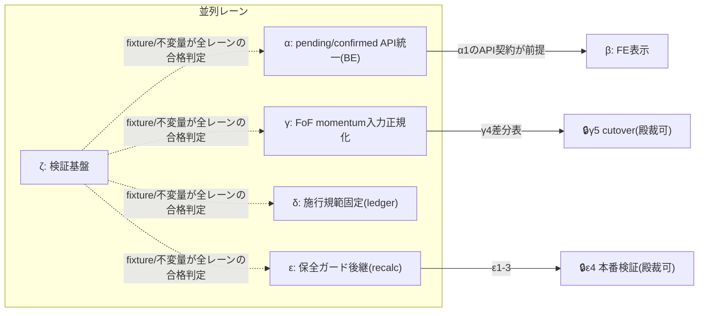

<!-- gist-master: d26e786a4da934eaa2e5863b8d31d7bd dm-monthly-return-v6-tasklist_20260809.md -->
# DM-Signal 月次リターン再設計 実装タスクリスト v2.3

> **正本設計書**: `docs/research/dm-monthly-return-design-v6_20260809.md` v6.13(gist d23c8d20)。本書は設計書の実装分解であり、**仕様の正は常に設計書**。矛盾を見つけたら実装せず報告する。
> **状態**: 準備物。**実装・deployは殿の別途下知まで開始しない**。下知後、本書のStatus列が進捗の正本となる。
> **対象repo**: `/mnt/c/Python_app/DM-signal`(タスク中のパスは全てこのrepo相対)
> **読者**: 前提知識ゼロのコーディングLLM。各タスクはStart(前提)とGoal(二値判定)だけで完結し、設計判断を含まない — 判断が必要になったら実装を止めて報告する。

## 進捗記号

⬜=未着手 / 🔄=作業中 / ✅=Goal達成(検証コマンドPASS) / ⛔=blocked(理由を右端に記す)

## 運用制約(全タスク共通)

1. **1タスク=1commit**。タスク外のファイルに触れない(影響範囲列が契約)
2. 各タスクは**検証コマンドがPASSした時のみ✅**にできる(自己申告禁止)
3. **本番書込み・deployを含むタスクは🔒SEALED** — 個別の殿裁可なしに実行しない(該当: T-γ5・T-ε4)
4. 旧v5.22の是正残工程(D/E系=歴史浄化・三面一致)は**本書の対象外** — 旧WBS(v5.22 §2.5)の台帳のまま続行
5. DB schemaの変更は本リストに**存在しない**(設計: DB=CONFIRMEDのみ保存、status列追加なし)。schema変更を提案したくなったら設計書§3.4を再読して報告せよ
6. **検証コマンド共通前提(cmd_4247偵察§2.6で確定)**: backendのpytestは**必ずrepo rootから** `cd /mnt/c/Python_app/DM-signal && PYTHONPATH=. pytest backend/tests -k <keyword>` で実行する。`backend/`配下から実行するとconftest.py:9-13のroot-qualified plugin importが`No module named 'backend'`で失敗する。FEは `cd frontend && npm test -- --runInBand <対象testファイル>` + `npm run build`。以下の表の検証コマンドは全てこの前提の短縮表記
7. **新keyword(-k指定)のexactテストは現在0件**(cmd_4247実測: return_status等13 keywordでno tests collected)。検証コマンドは「そのタスクで新設するテストの実行方法」であり、既存PASSの意味ではない
8. **配備契約の固定(殿指摘2026-08-09 18:26: AC増殖によるスループット低下の禁止)**: 本書の各行(Start/Goal/影響範囲/検証コマンド)が配備時ACの**正本かつ全量**である。家老は行内容をそのままtask YAMLへ転写し、**AC・binary_check・検証手順の追加を禁止**する(安全底線=SEALED/本番無接触/可逆性のみ例外)。検証コマンドFAIL時は**同一契約のまま同一忍者で再走**し、AC増補付き再配備をしない。厳密さは各タスクの検証コマンド1点と🔒SEALED裁可の2箇所へ集中し、途中工程へ契約を足さない(殿厳命2026-07-14「厳密さは最終checkpointへ集中」の適用)。追加防御が必要と感じたら配備せず本書へ**行の修正として**提案せよ(正本は1つ)

## レーン構成と並列性(mermaid)

- **α・γ・δ・ε・ζは相互依存なし=5レーン同時並列可**。βのみαのAPI契約(T-α1)完了後に本格化(T-β1は独立)
- レーン内は原則直列(各タスクの依存列に従う)

---

## Lane α: pending/confirmed API統一(BE) — 設計書§3.1/§3.3/§3.4

| ID | St | タスク(Start→Goal) | 影響範囲 | 依存 | 検証コマンド |
|---|---|---|---|---|---|
| T-α1 | ✅ | **status契約module新設**。Start: 設計書§3.1の4意味論表。Goal: `backend/app/services/return_status.py`を新設し、定数`START_WAITING/PENDING_VALUE/CONFIRMED/ERROR`+応答用dataclass(`value, status, as_of, provisional_source, missing_requirement, price_type, start_date, end_date`)を定義、serialize往復のunit testが通る | 新規1ファイル+テスト1ファイル | なし | `pytest tests/ -k return_status` FAIL0/SKIP0 |
| T-α2 | ✅ | **系列別provisional評価解決関数(完全性契約=設計書§0/§3.3)**(cmd_4254・commit aca163ab・テスト4件PASS/FAIL0/SKIP0)。Start: `PriceCache`のbackward解決が既存(price_ratio_impl.py:22-91)+殿裁定12:53(**営業日=利用全銘柄の価格が揃っている日。全銘柄が揃わないと計算は構造的に不可能。SPY単独依存禁止。サイレントフォールバック禁止**)。Goal: `resolve_provisional_valuation(symbols, as_of, series)`が**as_of以前で全構成銘柄の当該系列価格が揃っている直近取引日ただ1点**を解決し`(評価日, {symbol: 値})`を返す純関数。単一(date,value)返却は不可。**完全性は系列別に判定する**(設計書§3.3系列別純度維持): Open系列の評価日=全銘柄の**Open**が揃っている日、Close系列=全銘柄の**Close**が揃っている日(同一暦日で両系列の評価日が異なり得るのは正常)。as_ofは系列別に返す。**市場が開いたはずの日(期待グリッド)に揃っていないことを観測したら供給異常ERROR**(fail-visible)として計算しない — 代用・SPYアンカー・サイレント後退の全て禁止。テスト4件: 全銘柄揃い正常系・1銘柄欠損→ERROR(値を返さない)・休日連続・期待グリッド乖離の可視化 | `backend/app/services/return_status.py`追記+テスト | T-α1 | `pytest tests/ -k provisional_valuation` FAIL0/SKIP0 |
| T-α3 | ✅ | **Monthly Returns APIのpending対応**(cmd_4255・commit a926d06c・contract 2 PASS+回帰18 PASS/FAIL0/SKIP0)。Start: 現行は当月row不在でpending生成せず全row不在なら404(api/monthly_returns.py:84-93)。Goal: 当月=PENDING_VALUE行(系列別provisional)・境界未形成月=START_WAITING行を動的生成しstatus付きで返す。**pending値は既存calculate_monthly_returnと同一エンジンにprovisional end入力を渡して計算する(設計書§2.1: provisional専用計算式・別calculatorの新設禁止=same engine, different input certainty)**。404は「PF不存在」のみに限定。既存確定行の値は1バイトも変わらない | `backend/app/api/monthly_returns.py`, `backend/app/services/monthly_returns_calculator.py` | T-α1,T-α2 | `pytest tests/ -k monthly_returns_pending` FAIL0/SKIP0+既存テスト回帰FAIL0 |
| T-α4 | ⬜ | **Monthly Trade APIのstatus統一**。Start: 現行`is_pending=true`動的生成(monthly_trade_impl.py:793-954)。Goal: 既存pending機構の出力をT-α1のstatus契約へ載せ替え(is_pendingは後方互換で残す)。挙動不変+status field追加のみ | `backend/app/services/monthly_trade_impl.py`, `backend/app/api/monthly_trade.py` | T-α1 | `pytest tests/ -k monthly_trade` FAIL0/SKIP0 |
| T-α5 | ⬜ | **/api/mtdの系列純度是正**。Start: Open系列に最終確定日Close/Open比を使う`is_preliminary=true`行が存在(mtd_returns.py:100-208)=設計書が「純度違反の暫定ハック」と認定。**cmd_4247追記: legacy preliminary helperはperformance.py:98-123経由でも到達可能** — 置換時は両到達経路を対象にする。Goal: Open系列のprovisionalをT-α2のopen解決へ置換し、Close/Open比借用コードを削除。**計算は既存エンジンへの入力置換のみ(設計書§2.1: MTD専用calculatorの新設禁止)**。両系列のMTDがそれぞれ純系列で返る | `backend/app/services/mtd_returns.py`+`backend/app/api/performance.py:98-123` | T-α2 | `pytest backend/tests -k mtd` FAIL0/SKIP0(既存test_monthly_returns_mtd.py+test_mtd_preliminary.py回帰含む) |
| T-α6 | ⬜ | **cacheのpending非混入検証**。Start: precomputed_rawはconfirmed成分のみ保持が設計(§3.4)。Goal: cache書込み経路にpending行が入らないことのassertion+テスト(pending行を含む応答を書き込もうとするとエラー) | `backend/app/api/monthly_returns.py`, `backend/app/api/monthly_trade.py`のcache書込み箇所 | T-α3,T-α4 | `pytest tests/ -k cache_no_pending` FAIL0/SKIP0 |
| T-α7 | ⬜ | **Dashboard 2スロットのデータ供給**。Start: 設計書§3.5+**cmd_4247確定: dashboard単一APIは存在しない**。FEは3経路合成=`/api/signals`(signals.py:280-315, payload構築:211-263)+`/api/performance/{pf}`(performance.py:126-192)+`/api/mtd/{pf}`(performance.py:195-240)。FE consumer=signals-context.tsx:280-331+dashboard/page.tsx:95-122(API map),226-249,583-641。Goal: `current_holdings`(効力中)と`next_rebalance`(decision済み未施行。なければnull)の帰属先を**`/api/signals`応答への追加を第一候補**として実装時に確定・報告し、field追加。既存field・visibility masking・3経路のcache(ETag/quick-full request ID guard page.tsx:318-390)は不変 | `backend/app/api/signals.py`+FE型定義(帰属変更時は報告) | T-α1 | `pytest backend/tests -k dashboard_slots` FAIL0/SKIP0 |
| T-α8a | ⬜ | **backend純度違反30箇所の系列別解決置換**。Start: **cmd_4249全数確定(影丸報告=59件中backend純度違反30件)**: metrics.py:361,378・ticker_returns.py:42,208,209・generators/monthly_returns.py:520・recalculate_fof.py:630・annual_returns_calculator.py:144,173,177,247,252・component_price_cache.py:113,115・pipeline/blocks/component_price.py:79・metrics_impl.py:252,263,293,294,338,340,488,489,523・monthly_returns_calculator.py:231,235,657,676,724,729。Goal: 各箇所のOpen欠損→Close代用をT-α2の系列別解決(欠損=ERRORまたは歴史政策境界)へ置換。1箇所ずつ既存テスト回帰FAIL0を維持 | 上記backend 8ファイル | T-α2 | `pytest backend/tests`対象別選択実行 FAIL0/SKIP0+置換箇所数=30の全数一致 |
| T-α8b | ⬜ | **frontend純度違反26箇所の表示層是正**。Start: cmd_4249全数確定(frontend 26件): dashboard/page.tsx:159-175,520-524・annual-returns-table.tsx:236-238,247・monthly-returns-table.tsx:67-74,83-85,492-515・drawdowns-chart/table・rolling系3ファイル・summary-table.tsx:77-83・comparison-chart.tsx:254-255,320-321・total-return-chart.tsx:88-90。Goal: open値null時のclose fallbackを、T-α1のstatus契約(値なし表示または◧)へ置換。系列トグルの純度を表示層でも維持 | 上記frontend 11ファイル | T-α1,T-β2 | FE選択Jest+`npm run build`成功+置換箇所数=26の全数一致 |
| T-α8c | ⬜ | **歴史データ政策3箇所の明文化**。Start: cmd_4249分類(research/oneshot 3件: r2_db_profiling.py:100・cmd_fof_oscillation_phase0_reproduce_and_verify.py:51・cmd_1898_verify_okugi_alm_shin_parity.py:189)。Goal: readonly分析道具の代用は変更せず、歴史データ政策(Open系列の適用開始境界)としてコメント+本リスト台帳へ明文化 | scripts/analysis系3ファイル(コメントのみ) | なし | 3箇所の政策コメント存在をrgで確認 |

## Lane β: FE表示 — 設計書§3.5(T-β1以外はT-α1のAPI契約後)

| ID | St | タスク(Start→Goal) | 影響範囲 | 依存 | 検証コマンド |
|---|---|---|---|---|---|
| T-α9 | ⬜ | **進行月行のDB在庫方針確定と掃除(migration)**。Start: **cmd_4249飛猿の本番実測: monthly_returnsに進行中未確定月(2026-08)の行が既に保存されている**(シン青龍-鉄壁 monthly_return=-0.0169071233、実行時点08-09)=設計書§3.4『DB保存=CONFIRMEDのみ』のAsIs違反在庫。Goal: (1)現行の進行月行生成箇所を特定し、T-α3のAPI動的生成へ移行後に**DB書込みを停止** (2)既存の未確定月行の在庫を全PFで数え、掃除方針(削除またはCONFIRMED昇格待ち)を確定して§5 migration計画へ記録。掃除の本番実行は🔒殿裁可 | monthly_returns書込み経路+§5 migration | T-α3 | 進行月行の新規書込み0をテストで確認+在庫全数の記録 |
| T-β1 | ✅ | **表示デフォルトをopen to openへ**(cmd_4256・commit 16e8a561・FEテスト+build成功)。Start: **cmd_4247確定: デフォルトの所有者は共有context**。**FEテスト基盤はcmd_4249飛猿が実行証跡で確定済み**(jest 30.2.0実PASS 7/7・version非互換疑いは実測で否定・npm test/npm run buildのscripts実在確認済み) `execution-timing-context.tsx:28-47`(初期値CLOSE+localStorage hydration)+`:88-97`(provider外fallbackもCLOSE)。TimingToggle.tsx:5-35は値を反転するだけでデフォルトを持たない。consumerはDashboard/Total Return/MTD/Monthly Returns/Monthly Trade/Annual/Compare/Compare Summary/Drawdowns/Rolling/metrics表の全系(layout.tsx:70-80配下)。Goal: contextの初期値+fallbackをOPENへ変更し、**全consumerの初期表示テストmatrix**を更新。トグル機能・localStorage永続は不変。SSR/CSR mismatchと旧localStorage値の扱いを明記。**注意: monthly-returns-table.tsx:67-85のopen欠損→close fallbackは本タスクで触らない**(T-α8の分類対象=系列純度違反) | `frontend/contexts/execution-timing-context.tsx`+consumer初期値テスト群 | なし(独立) | 既存open-toggleテスト3系(monthly/annual/rolling)+`npm test -- --runInBand`+`npm run build`成功 |
| T-β2 | ✅ | **statusバッジ共通コンポーネント**(cmd_4257・commit 85ef51ec・Jest 6 PASS/SKIP0)。Start: 設計書の⏳◧✓意味論。Goal: `StatusBadge`(status+as_of表示。⏳=開始待ち/◧=暫定/✓=確定)を新設、storybookまたはユニットテストで4状態描画PASS | 新規1コンポーネント | T-α1(契約参照のみ・stub可) | FEユニットテストPASS |
| T-β3 | ⬜ | **Monthly Returnsページのpending表示**。Start: T-α3のstatus付き応答。Goal: PENDING_VALUE行=◧+as_of、START_WAITING行=⏳(値なし)で表示。404時の空白画面が消える | `frontend/app/monthly-returns/page.tsx`, `monthly-returns-table.tsx` | T-α3,T-β2 | FEユニット+手動確認手順書1項 |
| T-β4 | ⬜ | **Monthly Tradeページのstatus統一表示**。Start: T-α4。Goal: 既存Pendingバッジを共通StatusBadgeへ置換。表示情報は不変+as_of追加 | `frontend/components/monthly-trade-table.tsx` | T-α4,T-β2 | FEユニットPASS |
| T-β5 | ⬜ | **Dashboard 2スロット表示**。Start: T-α7の応答field。Goal: 「現在の保有(効力中)」と「次回リバランス(計算済み・施行待ち)」を別カードで表示。次回がnullなら「未定(次回計算=翌月初)」表示 | dashboard系FEコンポーネント | T-α7,T-β2 | FEユニットPASS |

## Lane γ: FoF momentum入力正規化 — 設計書§2.3(切替γ5まで本番影響ゼロ)

| ID | St | タスク(Start→Goal) | 影響範囲 | 依存 | 検証コマンド |
|---|---|---|---|---|---|
| T-γ1 | ⬜ | **子PF日次NAV構成関数**。Start: ticker再帰展開の既存実装は**price_ratio_impl.py:1365-1403**(cmd_4247で行番号確定。1096-1112は誤参照)=point-in-time展開でありNAV評価器ではない。現行FoF入力はcomponent月次リターン行(recalculate_fof.py:624-631、open欠損→close fallback :630)。設計書§2.3のNAV定義(**自己金融型chain-link連続系列**: `NAV(t+1)=NAV(t)×(1+r(t→t+1))`。**施行日のrは2区間の積**=`r_旧構成(前日Close→当日Open)×r_新構成(当日Open→当日Close)`。単一weightの施行日全体適用は禁止。静的バスケット評価は不適格)。Goal: `build_child_daily_nav(pf_id, date_range)`がpricesとexpanded weightsから日次NAV系列を返す純関数(nested再帰対応)。fixture必須3件: (1)小PF(2ticker)の手計算全日一致 (2)**子のexecution boundaryを跨ぐ期間で人工ジャンプなし**(境界日のNAV連続性assert) (3)**施行日の2区間積の手計算一致**(旧構成と新構成が異なるfixture) | 新規1ファイル+テスト | なし | `pytest tests/ -k daily_nav` FAIL0/SKIP0 |
| T-γ2 | ⬜ | **NAV上のmomentum計算adapter**。Start: 再利用可能なstandard窓関数は2実装(cmd_4247で確定): **正=`vectorized_momentum.py:7-72`**(calculate_momentum_vectorized+composite。月→取引日変換+加重平均)、参考=momentum_cache.py:377-426(cache版・index/lookup契約が異なる)。FoF lookback抽出契約はrecalculate_fof.py:291-355(Momentum/Absolute/Reversal/acceleration/multi-view/trend reversal全部)。Goal: T-γ1のNAV系列へ**vectorized関数を呼ぶだけ**のadapter(窓ロジックのコピー実装禁止)。空periods=0とNaN伝播のsemanticsを維持。standard PFに適用すると既存momentumと完全一致するテストPASS | 新規1ファイル+テスト | T-γ1 | `pytest backend/tests -k nav_momentum` FAIL0/SKIP0 |
| T-γ3 | ⬜ | **dual replay道具(readonly)**。Start: S-lane dual replayの先例(v5.22)。Goal: 全FoF×全判断日を旧入力(月次擬似価格)/新入力(日次NAV)の2系で再走し、score/rank/selected/signalの差分全数表CSVを出力するスクリプト。本番write=0。**cmd_4249観点四確定(半蔵readonly実測・軍師LGTM)**: 母集団=歴史config keys(portfolio_id×decision_date)8951 × {old,oracle}2系=**17902行**。FoF=78・判断日=332・nested直接親=53・FoF子参照辺=189・最大深度=4(current config backup=103件: fof78+standard25)。既存PASS成果物(dual_replay.md)のcoverage=old/oracle各8951・missing/duplicate/unclassified=0と独立再集計が一致。**注意: 歴史config CSVにcomponent_portfolios欄なし→nested構成はcurrent config backup時点値として扱う**(dual_replay.py:150-171,231-266・dependency.py:25-38はFoF型IDのみ依存辺収集) | 新規スクリプト1本 | T-γ2 | スクリプト実行で全FoF×全判断日の行数=母集団(歴史keys×2系)一致+write0証明 |
| T-γ4 | ⬜ | **差分分類レポート**。Start: T-γ3のCSV。Goal: 差分を(不変/是正由来変化)に分類し件数・PF別内訳のレポートmd生成。**完了時に殿へ提示(γ5の裁可材料)** | 新規レポートmd | T-γ3 | 分類合計=差分総数の恒等式PASS |
| T-γ5 | 🔒 | **cutover(殿裁可後のみ)**。Start: γ4提示+殿裁可。Goal: FoF momentum入力を新経路へ切替+ledger再基線+S3型報告。backupファースト・可逆 | recalculate_fof.py系+本番 | T-γ4+**殿裁可** | 切替後fullrecalculate+γ3再走で新経路一致 |

## Lane δ: 施行規範固定 — 設計書§1-3/§4.1

| ID | St | タスク(Start→Goal) | 影響範囲 | 依存 | 検証コマンド |
|---|---|---|---|---|---|
| T-δ1a | ✅ | **施行経路の書込み元発見 — cmd_4249才蔵偵察で完了**。確定事項: 標準経路=render.yaml:145-156→etl_trigger.py:184-231→recalculate_fast.py:2832-2850→generators/monthly_returns.py:414-438、FoF=recalculate_fof.py:1373-1395→同generator。**実効日producer=generator境界計算(first_trading_date=month_days[0]+expanded_switch_dateを算出するが日付を返さず件数のみ返却)**。**再計算成功後callerはledgerを一切呼ばない(insert_initial_ledger_eventsの外部caller=0件)**。writer候補配線=成功後のetl_trigger.py:209-223へboundary mapを渡し_insert_planned_events(signal_decision_ledger.py:554-569)へ実効日注入 | (完了・正本=saizo_report_cmd_4249_recon3.yaml) | — | 完了済み |
| T-δ1b | ⬜ | **施行時のeffective_start_date直接記録**。Start: δ1a確定の配線。Goal: (1)generator境界計算(monthly_returns.py:414-438,167-181)がfirst_trading_date/expanded_switch_dateの**boundary mapを返却**するよう拡張 (2)再計算成功後caller(etl_trigger.py:209-223)がboundary mapを_insert_planned_eventsへ渡し、effective_start_dateへ**実効力取引日を記録**(decision日複写の恒久化禁止=才蔵decision_candidate)。施行ズレfixture(decision日≠初回取引日)で新規月のledger値=実効力日となるテストPASS。ledger SSOT+append-only維持、correction経路(:329-340)の意味論不変 | monthly_returns.py:414-438+etl_trigger.py:209-223+signal_decision_ledger.py:554-569 | なし(δ1a完了済み) | `pytest backend/tests -k effective_start_recording` FAIL0/SKIP0 |
| T-δ2 | ⬜ | **遅延施行の検知**。Start: 規範=計算後最初の取引日に施行(殿裁定11:07)。Goal: 施行日≠計算後初回取引日を検知したらERROR系alert(SIGNAL CHANGE ALERT同経路)を発火。正常時は無音。fixture2種(正常/遅延注入)PASS | alert発火箇所1ファイル | T-δ1 | `pytest tests/ -k delayed_execution_alert` FAIL0/SKIP0 |
| T-δ3 | ⬜ | **backfill provenanceの分離**。Start: cmd_4246 §3.1(読み側resolverがevent_type区別なくbackfill eventを通常候補に混入)。Goal: `resolve_ledger_decisions_bulk()`が通常月解決でhistorical_backfill由来eventをsourceタグで区別し、将来月(δ1以降の直接記録)では参照しない。歴史月の挙動は不変(回帰テスト) | `backend/app/services/signal_decision_ledger.py:190-275` | なし(δ1と並列可) | `pytest tests/ -k ledger_provenance` FAIL0/SKIP0+既存resolver回帰FAIL0 |
| T-δ4a | ⬜ | **共通calendar selectorの完全性条件化**。Start: **cmd_4249全数確定(疾風報告=SPY直接アンカー46件中、置換対象22件)**。中核=business_day_utils.py:57,64,70(SPY既定値/直書きの共通selector)。他の本番core: generators/monthly_returns.py:338,361・recalculate_fast.py:1636,1650・recalculate_fof.py:609・monthly_trade_impl.py:448・return_calculator.py:193・rebalance.py:92・build_signal_decision_ledger_historical_backfill.py:58。Goal: **共通selectorを先に**「利用全銘柄の充足日」契約(§0)へ置換し、残り呼出元を順次接続する。SPY単独判定の残存0を全数一致で証明。期待グリッド用途(市場開場日の近似)へのSPY使用は明示コメント化して残す | 上記backend 8ファイル+historical/oneshot 10件 | T-α2 | `pytest backend/tests`のcalendar parity系選択実行 FAIL0/SKIP0+置換対象22件の全数一致 |
| T-δ4b | ⬜ | **期待グリッド24箇所の妥当性台帳化**。Start: cmd_4249分類(analysis/backtest系24件=SPYを意図的な比較軸・評価グリッドとして使用)。Goal: 変更せず、各箇所へ期待グリッド用途である旨の分類台帳を本リストへ記録(誤って完全性置換しないための境界固定) | 変更なし(台帳のみ) | なし | 24件の分類記録存在 |

## Lane ε: 保全ガード後継 — 設計書§4.4(run231の因果を前提)

| ID | St | タスク(Start→Goal) | 影響範囲 | 依存 | 検証コマンド |
|---|---|---|---|---|---|
| T-ε1 | ⬜ | **mode=portfolio経路の全消し除去**。Start: R11因果+**cmd_4247のHEAD現物(45ad390e)**: `_cleanup_before_recalculate()`はSignal削除(:1111-1117, delete_signals=True時)→**7テーブル無条件DELETE(:1121-1135)**=MonthlyReturn/TradePerformance/DrawdownPeriod/RollingReturnsSummary/RollingReturnsChart/RiskManagementMetrics/PortfolioMetrics(portfolio_ids=Noneなら全PF、指定ならscoped)→TickerMonthlyReturnのみmode条件付き(:1137-1143, 全PF FULL/TICKER時のみ)。**7テーブルリストにmode guardは現在存在しない**。さらに**API defaultがmode=portfolio**(etl_trigger.py:76-106,129-165)=危険経路がdefault。Goal: mode='portfolio'時は7テーブル一括DELETEをスキップし、生成側の期間置換UPSERTのみで更新。mode='full'/'ticker'の挙動(TickerMonthlyReturn条件対称性含む)は不変。テストはcleanup helper直接+API default経路の両方を検証 | `backend/app/jobs/recalculate_fast.py`のcleanup分岐 | なし | `pytest backend/tests -k portfolio_no_bulk_delete` FAIL0/SKIP0 |
| T-ε2 | ⬜ | **破壊シナリオテスト**。Start: run231の再現条件(狭い計算結果)。Goal: テストDBで「狭い結果のportfolio再計算」を実行し、既存の広い履歴が1行も減らないことを行数+最古月assertで証明する回帰テスト | テストのみ | T-ε1 | `pytest tests/ -k history_preservation` FAIL0/SKIP0 |
| T-ε3 | ⬜ | **全消し=repair層明示操作へ限定**。Start: 設計書§4.4(full rebuild semanticsはrepair専用)。Goal: 全テーブル一括DELETEはmode='full'(または明示repairフラグ)のみで実行可能というguard assertion+テスト。到達不能でなくコードで強制 | `backend/app/jobs/recalculate_fast.py` | T-ε1 | `pytest tests/ -k full_rebuild_guard` FAIL0/SKIP0 |
| T-ε4 | 🔒 | **本番検証(殿裁可後のみ)**。Start: ε1-3完了+deploy。Goal: 本番でmode='portfolio'再計算を1回実行し、monthly_returnsの行数・最古year_monthが前後で減少しないことをDB前後比較で証明(cmd_4245 AC2の完遂)。PASSでmode='full'限定の暫定運用を解除 | 本番DB(readonly比較+再計算実行) | T-ε1..3+**殿裁可** | 前後比較SQL: 行数・min(year_month)不変 |

## Lane ζ: 検証基盤(早期着手可・全レーンの合格判定を供給)

| ID | St | タスク(Start→Goal) | 影響範囲 | 依存 | 検証コマンド |
|---|---|---|---|---|---|
| T-ζ1 | ⬜ | **境界fixtureセット**。Start: 設計書§0.2の2ケース+§3.1+**cmd_4249飛猿の本番DB全数走査(102PF・2003-08〜2026-08)による期待値ソース確定**: 休日月初型=シン青龍-鉄壁(a3c4e3d3)/basicデュアルモメンタム(e0826b59) 2026-08(signals土日行あり・prices SPY 08-03再開・08-03切替の現物確認済み)、切替なし月=シン青龍-鉄壁2026-06→07、PF開始月=シン玄武-鉄壁(c31251e4) 2012-03/04、進行月=シン青龍-鉄壁2026-08。**2022-04型施行ズレはsignals層LAG全数検出で本番実例ゼロ** — 既存fixture effective_delay_2022_04は合成データと判明。ただし設計書§4.1の4/4実切替はexpand層(ticker weights日次差分)由来でありsignals層で観測できない可能性がある(飛猿はreadonly制約でexpand未実行)。Goal: **既存oracle(monthly_return_oracle_cases.json 18行構造)を拡張**(並行fixture慣行の新設禁止)し、4実例は本番実測値、2022-04型は**合成データのまま維持し『合成・signals層実例なし・expand層由来』の由来注記を必須化**。期待値の値・status・境界日を固定し、fixture ID数と期待field数の自己整合checkを含む。**数値比較規約=設計書§5数値意味論(本番同一float64・独自丸め禁止・round(x,10)=round-half-even量子化後のexact一致のみ)をfixture比較関数に固定** | `backend/tests/fixtures/monthly_return_oracle_cases.json`拡張+自己整合テスト | なし | fixture読込+自己整合テストPASS |
| T-ζ2 | ⬜ | **lifecycle遷移テスト**。Start: §3.2タイムライン(8/1→8/3)。**cmd_4247確定: 既存test_monthly_boundary_contract.py:47-157が境界/MTD/ledgerのfixture慣行を持つ=再利用対象**(純helper単体でなくAPI応答レベルの遷移が対象)。Goal: 時刻を注入して7月=PENDING_VALUE→CONFIRMED、8月=START_WAITING→PENDING_VALUEの遷移をAPI応答レベルで再現するテスト | テストのみ | T-α3,T-α4,T-ζ1 | `pytest backend/tests -k lifecycle_transition` FAIL0/SKIP0 |
| T-ζ3 | ⬜ | **不変量テスト束**。Start: 設計書§1。Goal: (a)連続期間gap/overlap=0 (b)月次積=累積 (c)holding=None検出→ERROR (d)standard momentum出力の実装前後差分=0 — の4不変量を1テストファイルへ。**(b)(d)の数値比較は設計書§5数値意味論(round(x,10)=round-half-even量子化後exact一致)で判定**。**(c)の注意(cmd_4249飛猿実測)**: holding_signal=Noneが本番に実在する(シン玄武-鉄壁 2012-03-19〜30の12行=§3.1のNone出現経路③『未開始の誤扱い』の実例)。不変量(c)は「新規発生の検出」であり、この歴史在庫12行は§4修復レイヤーの掃除対象として別掲(検出テストが歴史在庫で恒常FAILしない設計にする) | テストのみ | T-ζ1 | `pytest tests/ -k invariants` FAIL0/SKIP0 |
| T-ζ4 | ⬜ | **月替わり自然検証手順書**。Start: 全レーン実装後。Goal: 次の実際の月替わり(暦月初〜施行日)で§3.5リファレンス通りの表示になることを確認するチェックリストmd(E2型・人が実行) | 新規md 1本 | T-β3..5 | チェックリスト項目が§3.5の全要素を網羅(突合) |

---

## 依存の要約(これだけ守れば他は全部並列)

1. **T-α1が Lane α残り+Lane βの前提**(β1のみ独立)
2. **γ・δ・ε・ζはレーンごと独立** — 今すぐ5レーン同時に着手可能
3. **🔒2つ(γ5・ε4)だけが本番に触れる** — 個別の殿裁可+backupファースト必須。他の25タスクは全て隔離環境+テストで完結し可逆
4. 推奨初手(並列6席の例): T-α1・T-β1・T-γ1・T-δ1a(またはδ3)・T-ε1・T-ζ1

## 因果リンク

`[[dm-monthly-return-design-v6_20260809]] v6.9 -> [[dm-monthly-return-v6-tasklist_20260809]] -> [[pending_confirmed_lifecycle]]実装 + [[FoF_momentum入力正規化_20260809]]実装`

## 改訂履歴

- v2.3 (2026-08-09 18:30): 殿指摘18:26(家老の過剰防御AC再配備でスループット激減)を受け運用制約8「配備契約の固定」新設 — 本書の行=配備時ACの正本かつ全量、家老のAC/binary_check/検証手順の追加禁止、FAILは同一契約で再走(AC増補付き再配備禁止)、厳密点=検証コマンド1点+SEALED裁可のみ(殿厳命2026-07-14適用)。追加防御は配備でなく本書の行修正として提案
- v2.2 (2026-08-09 15:55): **cmd_4249観点四(replay母集団)焼込みでv2.1の残gap解消** — T-γ3へ半蔵readonly実測(軍師LGTM・正本=queue/reports/hanzo_report_cmd_4249_recon4.yaml)を反映: dual replay母集団=歴史keys 8951×{old,oracle}=17902行、FoF78・判断日332・nested親53/辺189/深度4。既存PASS成果物と独立再集計の一致確認済み。nested構成はcurrent config backup時点値(歴史CSVに構成欄なし)の保留を明記。cmd_4249偵察5観点は全て焼込み完了
- v2.1 (2026-08-09 15:40): **cmd_4249第二次偵察4報告(壱影丸・弐疾風・参才蔵・伍飛猿)の全行焼込み(殿指示15:31覚醒行動)** — (1)T-α8を3サブタスクへ展開: α8a=backend純度違反30箇所(file:line全数)、α8b=frontend26箇所、α8c=歴史政策3箇所の明文化(計59件=偵察全数と一致) (2)T-δ4を2サブタスクへ展開: δ4a=置換対象22件(共通selector=business_day_utils.py:57,64,70先行)、δ4b=期待グリッド24件の台帳化(計46件一致) (3)T-δ1a完了化(才蔵確定: producer=generator境界計算・成功後callerのledger呼出し0件・writer候補配線)+δ1bへ配線焼込み (4)T-ζ1へ本番実測期待値ソース4件+2022-04型=signals層実例ゼロ(合成fixture維持+由来注記必須化。expand層由来の可能性を保留) (5)T-ζ3(c)へholding=None本番在庫12行の折り合い設計 (6)**T-α9新設**: 進行月行のDB保存在庫(§3.4 AsIs違反)の書込み停止+掃除migration (7)T-β1へFE基盤確定(jest 30.2.0実PASS・非互換否定)。タスク数31→35(α8→3分割+α9新設+δ4→2分割、δ1a完了)。残gap=観点四(replay母集団)は配備漏れ疑いで家老へ指示済み、報告受領後に追記
- v2.0.1 (2026-08-09 14:15): 殿指示14:09(設計書との整合覚醒確認)による不整合3件の是正 — (1)T-α2へ系列別完全性判定を明記(Open評価日=全銘柄Open充足日・Close評価日=全銘柄Close充足日・as_of系列別。設計書§3.3系列別純度維持との整合) (2)T-α3/T-α5へ単一エンジン制約を契約化(設計書§2.1: provisional/MTD専用calculator新設禁止=same engine, different input certainty) (3)T-ζ1/T-ζ3へ数値意味論を固定(設計書§5: float64・round(x,10)=round-half-even量子化後exact一致)。第4の検出事項(設計書§2.3 AsIs行番号とcmd_4247実測の別系統疑い)はcmd_4249観点壱で現HEAD突合する
- v2.0 (2026-08-09 13:45): **cmd_4247一斉現物偵察(正本=docs/research/cmd_4247_tasklist_recon_20260809.md)の全行焼込み** — (1)運用制約6/7新設: pytest共通前提(repo root+PYTHONPATH=.、backend/配下実行はplugin import失敗)+新keyword exactテスト0件の明示 (2)T-α7: dashboard単一API不存在→3経路(signals/performance/mtd)確定+帰属第一候補=/api/signals (3)T-β1: デフォルト所有者=execution-timing-context.tsx(初期+fallback両方CLOSE)+全consumer matrix+open欠損fallbackはα8へ分離 (4)T-γ1: 展開実装の行番号是正(1365-1403)+現行FoF入力の現物明記 (5)T-γ2: 正=vectorized_momentum.py:7-72+lookback抽出契約:291-355 (6)T-δ1をδ1a(施行caller発見偵察)/δ1b(記録実装)へ分割 — flush現物にledger書込みなしのため (7)T-δ4: SPY calendar具体箇所(recalculate_fof.py:607-615)追記 (8)T-ε1: 7テーブル無条件DELETE/:1121-1135+Signal:1111-1117+Ticker条件:1137-1143+API default=portfolioの現物確定 (9)T-α5: performance.py:98-123の第二到達経路 (10)T-ζ1/ζ2: 既存oracle fixture+boundary contract再利用(並行fixture慣行の新設禁止)。タスク数28(実行数30)→31(δ1分割)。ヘッダ件数と実行数の不一致(v1.4で28と記載・実体30)も本版で是正
- v1.4 (2026-08-09 12:58): 殿裁定12:53(営業日=全銘柄充足・SPY単独依存禁止・サイレントフォールバック禁止)反映 — T-α2を完全性契約へ確定(全銘柄が揃う直近取引日1点・揃わなければERROR・SPYアンカー禁止)、T-δ4新設(SPY単独依存箇所の全数列挙+完全性条件への置換設計)。タスク数27→28。正本参照をv6.13へ更新
- v1.3 (2026-08-09 12:52): 殿責務指摘12:47反映 — T-α2を1点契約へ書換え(SPY基準直近営業日ただ1点+全銘柄存在検証+欠損=供給異常ERROR。「揃う日への後退探索」=上流欠陥吸収として禁止)。正本参照をv6.12へ更新
- v1.2 (2026-08-09 12:25): 家老先行BLOCKER 3件(blt_121927)反映 — T-α2を共通評価日契約へ書換え(銘柄別独立backward解決の禁止・(共通評価日,銘柄別価格map)返却・欠損=ERROR)、T-γ1へ施行日2区間積定義+fixture追加(旧構成prevClose→Open × 新構成Open→Close)、T-α8新設(Open欠損Close代用の全数sweep。cmd_4247列挙待ち・分類なき一括除去禁止)。タスク数26→27。正本参照をv6.11へ更新
- v1.1 (2026-08-09 12:06): T-γ1へ設計書v6.10のchain-link NAV定義を反映(自己金融連続系列+境界跨ぎ人工ジャンプなしfixture必須化。家老指摘伍→殿裁可12:03)。正本参照をv6.10へ更新
- v1.0 (2026-08-09 11:50): 初版(将軍直轄)。設計書v6.9(裁定論点ゼロ)から26タスク・6レーンへ分解。粒度=1タスク1commit・二値Goal・検証コマンド固定・SEALED2件明示
