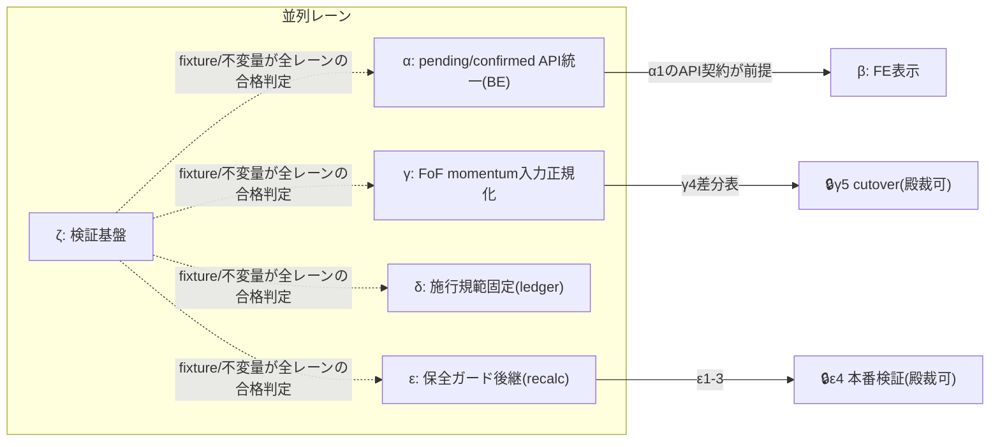

# DM-Signal 月次リターン再設計 実装タスクリスト v1.0

> **正本設計書**: `docs/research/dm-monthly-return-design-v6_20260809.md` v6.9(gist d23c8d20)。本書は設計書の実装分解であり、**仕様の正は常に設計書**。矛盾を見つけたら実装せず報告する。
> **状態**: 準備物。**実装・deployは殿の別途下知まで開始しない**。下知後、本書のStatus列が進捗の正本となる。
> **対象repo**: `/mnt/c/Python_app/DM-signal`(タスク中のパスは全てこのrepo相対)
> **読者**: 前提知識ゼロのコーディングLLM。各タスクはStart(前提)とGoal(二値判定)だけで完結し、設計判断を含まない — 判断が必要になったら実装を止めて報告する。

## 進捗記号

⬜=未着手 / 🔄=作業中 / ✅=Goal達成(検証コマンドPASS) / ⛔=blocked(理由を右端に記す)

## 運用制約(全タスク共通)

1. **1タスク=1commit**。タスク外のファイルに触れない(影響範囲列が契約)
2. 各タスクは**検証コマンドがPASSした時のみ✅**にできる(自己申告禁止)
3. **本番書込み・deployを含むタスクは🔒SEALED** — 個別の殿裁可なしに実行しない(該当: T-γ5・T-ε4)
4. 旧v5.22の是正残工程(D/E系=歴史浄化・三面一致)は**本書の対象外** — 旧WBS(v5.22 §2.5)の台帳のまま続行
5. DB schemaの変更は本リストに**存在しない**(設計: DB=CONFIRMEDのみ保存、status列追加なし)。schema変更を提案したくなったら設計書§3.4を再読して報告せよ

## レーン構成と並列性(mermaid)

- **α・γ・δ・ε・ζは相互依存なし=5レーン同時並列可**。βのみαのAPI契約(T-α1)完了後に本格化(T-β1は独立)
- レーン内は原則直列(各タスクの依存列に従う)

---

## Lane α: pending/confirmed API統一(BE) — 設計書§3.1/§3.3/§3.4

| ID | St | タスク(Start→Goal) | 影響範囲 | 依存 | 検証コマンド |
|---|---|---|---|---|---|
| T-α1 | ⬜ | **status契約module新設**。Start: 設計書§3.1の4意味論表。Goal: `backend/app/services/return_status.py`を新設し、定数`START_WAITING/PENDING_VALUE/CONFIRMED/ERROR`+応答用dataclass(`value, status, as_of, provisional_source, missing_requirement, price_type, start_date, end_date`)を定義、serialize往復のunit testが通る | 新規1ファイル+テスト1ファイル | なし | `pytest tests/ -k return_status` FAIL0/SKIP0 |
| T-α2 | ⬜ | **系列別provisional end解決関数**。Start: `PriceCache`のbackward解決が既存(price_ratio_impl.py:22-91)。Goal: `resolve_provisional_end(symbol_set, as_of, series)`が series='close'なら直近利用可能close、'open'なら直近利用可能openの(取引日,値)を返す純関数+境界テスト(休日連続・当日open未到着)PASS | `backend/app/services/return_status.py`追記+テスト | T-α1 | `pytest tests/ -k provisional_end` FAIL0/SKIP0 |
| T-α3 | ⬜ | **Monthly Returns APIのpending対応**。Start: 現行は当月row不在でpending生成せず全row不在なら404(api/monthly_returns.py:84-93)。Goal: 当月=PENDING_VALUE行(系列別provisional)・境界未形成月=START_WAITING行を動的生成しstatus付きで返す。404は「PF不存在」のみに限定。既存確定行の値は1バイトも変わらない | `backend/app/api/monthly_returns.py`, `backend/app/services/monthly_returns_calculator.py` | T-α1,T-α2 | `pytest tests/ -k monthly_returns_pending` FAIL0/SKIP0+既存テスト回帰FAIL0 |
| T-α4 | ⬜ | **Monthly Trade APIのstatus統一**。Start: 現行`is_pending=true`動的生成(monthly_trade_impl.py:793-954)。Goal: 既存pending機構の出力をT-α1のstatus契約へ載せ替え(is_pendingは後方互換で残す)。挙動不変+status field追加のみ | `backend/app/services/monthly_trade_impl.py`, `backend/app/api/monthly_trade.py` | T-α1 | `pytest tests/ -k monthly_trade` FAIL0/SKIP0 |
| T-α5 | ⬜ | **/api/mtdの系列純度是正**。Start: Open系列に最終確定日Close/Open比を使う`is_preliminary=true`行が存在(mtd_returns.py:100-208)=設計書が「純度違反の暫定ハック」と認定。Goal: Open系列のprovisionalをT-α2のopen解決へ置換し、Close/Open比借用コードを削除。両系列のMTDがそれぞれ純系列で返る | `backend/app/services/mtd_returns.py` | T-α2 | `pytest tests/ -k mtd` FAIL0/SKIP0 |
| T-α6 | ⬜ | **cacheのpending非混入検証**。Start: precomputed_rawはconfirmed成分のみ保持が設計(§3.4)。Goal: cache書込み経路にpending行が入らないことのassertion+テスト(pending行を含む応答を書き込もうとするとエラー) | `backend/app/api/monthly_returns.py`, `backend/app/api/monthly_trade.py`のcache書込み箇所 | T-α3,T-α4 | `pytest tests/ -k cache_no_pending` FAIL0/SKIP0 |
| T-α7 | ⬜ | **Dashboard 2スロットのデータ供給**。Start: 設計書§3.5(現在の保有=効力中構成/次回リバランス=計算済み・施行待ちシグナル)。Goal: 既存dashboard系APIの応答に`current_holdings`(効力中)と`next_rebalance`(decision済み未施行。なければnull)を分離して返すfield追加。既存fieldは不変 | dashboard系API 1ファイル(実装時に特定・報告) | T-α1 | `pytest tests/ -k dashboard_slots` FAIL0/SKIP0 |

## Lane β: FE表示 — 設計書§3.5(T-β1以外はT-α1のAPI契約後)

| ID | St | タスク(Start→Goal) | 影響範囲 | 依存 | 検証コマンド |
|---|---|---|---|---|---|
| T-β1 | ⬜ | **表示デフォルトをopen to openへ**。Start: 現行はOPENトグルで切替(monthly-returns-table.tsx:62-86)。Goal: 全リターン表示ページの初期系列=Open。トグル機能は不変 | `frontend/components/monthly-returns-table.tsx`ほかトグル初期値のみ | なし(独立) | FEユニット+`npm run build`成功+初期表示スナップショット |
| T-β2 | ⬜ | **statusバッジ共通コンポーネント**。Start: 設計書の⏳◧✓意味論。Goal: `StatusBadge`(status+as_of表示。⏳=開始待ち/◧=暫定/✓=確定)を新設、storybookまたはユニットテストで4状態描画PASS | 新規1コンポーネント | T-α1(契約参照のみ・stub可) | FEユニットテストPASS |
| T-β3 | ⬜ | **Monthly Returnsページのpending表示**。Start: T-α3のstatus付き応答。Goal: PENDING_VALUE行=◧+as_of、START_WAITING行=⏳(値なし)で表示。404時の空白画面が消える | `frontend/app/monthly-returns/page.tsx`, `monthly-returns-table.tsx` | T-α3,T-β2 | FEユニット+手動確認手順書1項 |
| T-β4 | ⬜ | **Monthly Tradeページのstatus統一表示**。Start: T-α4。Goal: 既存Pendingバッジを共通StatusBadgeへ置換。表示情報は不変+as_of追加 | `frontend/components/monthly-trade-table.tsx` | T-α4,T-β2 | FEユニットPASS |
| T-β5 | ⬜ | **Dashboard 2スロット表示**。Start: T-α7の応答field。Goal: 「現在の保有(効力中)」と「次回リバランス(計算済み・施行待ち)」を別カードで表示。次回がnullなら「未定(次回計算=翌月初)」表示 | dashboard系FEコンポーネント | T-α7,T-β2 | FEユニットPASS |

## Lane γ: FoF momentum入力正規化 — 設計書§2.3(切替γ5まで本番影響ゼロ)

| ID | St | タスク(Start→Goal) | 影響範囲 | 依存 | 検証コマンド |
|---|---|---|---|---|---|
| T-γ1 | ⬜ | **子PF日次NAV構成関数**。Start: ticker再帰展開の既存実装(price_ratio_impl.py:1096-1112)。Goal: `build_child_daily_nav(pf_id, date_range)`がpricesとexpanded weightsから日次NAV系列を返す純関数(nested再帰対応)。小PF(2ticker)の手計算fixtureと全日一致 | 新規1ファイル+テスト | なし | `pytest tests/ -k daily_nav` FAIL0/SKIP0 |
| T-γ2 | ⬜ | **NAV上のmomentum計算adapter**。Start: standard窓ルール実装(momentum_cache.py:79-93/212-230)。Goal: T-γ1のNAV系列へ**同一の窓関数を呼ぶだけ**のadapter(窓ロジックのコピー実装禁止=既存関数を呼ぶ)。standard PFに適用すると既存momentumと完全一致するテストPASS | 新規1ファイル+テスト | T-γ1 | `pytest tests/ -k nav_momentum` FAIL0/SKIP0 |
| T-γ3 | ⬜ | **dual replay道具(readonly)**。Start: S-lane dual replayの先例(v5.22)。Goal: 全FoF×全判断日を旧入力(月次擬似価格)/新入力(日次NAV)の2系で再走し、score/rank/selected/signalの差分全数表CSVを出力するスクリプト。本番write=0 | 新規スクリプト1本 | T-γ2 | スクリプト実行で全FoF×全判断日の行数=母集団一致+write0証明 |
| T-γ4 | ⬜ | **差分分類レポート**。Start: T-γ3のCSV。Goal: 差分を(不変/是正由来変化)に分類し件数・PF別内訳のレポートmd生成。**完了時に殿へ提示(γ5の裁可材料)** | 新規レポートmd | T-γ3 | 分類合計=差分総数の恒等式PASS |
| T-γ5 | 🔒 | **cutover(殿裁可後のみ)**。Start: γ4提示+殿裁可。Goal: FoF momentum入力を新経路へ切替+ledger再基線+S3型報告。backupファースト・可逆 | recalculate_fof.py系+本番 | T-γ4+**殿裁可** | 切替後fullrecalculate+γ3再走で新経路一致 |

## Lane δ: 施行規範固定 — 設計書§1-3/§4.1

| ID | St | タスク(Start→Goal) | 影響範囲 | 依存 | 検証コマンド |
|---|---|---|---|---|---|
| T-δ1 | ⬜ | **施行時のeffective_start_date直接記録**。Start: §0概念表(#4=施行日)。現行書込みの実態はcmd_4246が「要確認」と残した箇所。Goal: signal_flush/施行経路が効力発生取引日をledgerのeffective_start_dateへ**施行時に**記録する(decision日の複写ではなく)。新規月のledger値=実効力日となるテストPASS | `backend/app/services/signal_decision_ledger.py`+施行経路1箇所 | なし | `pytest tests/ -k effective_start_recording` FAIL0/SKIP0 |
| T-δ2 | ⬜ | **遅延施行の検知**。Start: 規範=計算後最初の取引日に施行(殿裁定11:07)。Goal: 施行日≠計算後初回取引日を検知したらERROR系alert(SIGNAL CHANGE ALERT同経路)を発火。正常時は無音。fixture2種(正常/遅延注入)PASS | alert発火箇所1ファイル | T-δ1 | `pytest tests/ -k delayed_execution_alert` FAIL0/SKIP0 |
| T-δ3 | ⬜ | **backfill provenanceの分離**。Start: cmd_4246 §3.1(読み側resolverがevent_type区別なくbackfill eventを通常候補に混入)。Goal: `resolve_ledger_decisions_bulk()`が通常月解決でhistorical_backfill由来eventをsourceタグで区別し、将来月(δ1以降の直接記録)では参照しない。歴史月の挙動は不変(回帰テスト) | `backend/app/services/signal_decision_ledger.py:190-275` | なし(δ1と並列可) | `pytest tests/ -k ledger_provenance` FAIL0/SKIP0+既存resolver回帰FAIL0 |

## Lane ε: 保全ガード後継 — 設計書§4.4(run231の因果を前提)

| ID | St | タスク(Start→Goal) | 影響範囲 | 依存 | 検証コマンド |
|---|---|---|---|---|---|
| T-ε1 | ⬜ | **mode=portfolio経路の全消し除去**。Start: R11因果(Phase0一括cleanupがrecalculate_fast.py:1121-1135でMonthlyReturn含む全DELETE→ガード無効化)。Goal: mode='portfolio'時はPhase0のMonthlyReturn(+関連精算テーブル)一括DELETEをスキップし、生成側の期間置換UPSERTのみで更新。mode='full'の挙動は不変 | `backend/app/jobs/recalculate_fast.py`のcleanup分岐 | なし | `pytest tests/ -k portfolio_no_bulk_delete` FAIL0/SKIP0 |
| T-ε2 | ⬜ | **破壊シナリオテスト**。Start: run231の再現条件(狭い計算結果)。Goal: テストDBで「狭い結果のportfolio再計算」を実行し、既存の広い履歴が1行も減らないことを行数+最古月assertで証明する回帰テスト | テストのみ | T-ε1 | `pytest tests/ -k history_preservation` FAIL0/SKIP0 |
| T-ε3 | ⬜ | **全消し=repair層明示操作へ限定**。Start: 設計書§4.4(full rebuild semanticsはrepair専用)。Goal: 全テーブル一括DELETEはmode='full'(または明示repairフラグ)のみで実行可能というguard assertion+テスト。到達不能でなくコードで強制 | `backend/app/jobs/recalculate_fast.py` | T-ε1 | `pytest tests/ -k full_rebuild_guard` FAIL0/SKIP0 |
| T-ε4 | 🔒 | **本番検証(殿裁可後のみ)**。Start: ε1-3完了+deploy。Goal: 本番でmode='portfolio'再計算を1回実行し、monthly_returnsの行数・最古year_monthが前後で減少しないことをDB前後比較で証明(cmd_4245 AC2の完遂)。PASSでmode='full'限定の暫定運用を解除 | 本番DB(readonly比較+再計算実行) | T-ε1..3+**殿裁可** | 前後比較SQL: 行数・min(year_month)不変 |

## Lane ζ: 検証基盤(早期着手可・全レーンの合格判定を供給)

| ID | St | タスク(Start→Goal) | 影響範囲 | 依存 | 検証コマンド |
|---|---|---|---|---|---|
| T-ζ1 | ⬜ | **境界fixtureセット**。Start: 設計書§0.2の2ケース+§3.1。Goal: 5 fixture(2022-04型施行ズレ・休日月初型・切替なし月・PF開始月・進行月)の入力+期待値(値・status・境界日)をYAML/JSONで固定。期待値は設計書の実例数値と一致 | 新規fixtureファイル群 | なし | fixture読込+自己整合テストPASS |
| T-ζ2 | ⬜ | **lifecycle遷移テスト**。Start: §3.2タイムライン(8/1→8/3)。Goal: 時刻を注入して7月=PENDING_VALUE→CONFIRMED、8月=START_WAITING→PENDING_VALUEの遷移をAPI応答レベルで再現するテスト | テストのみ | T-α3,T-α4,T-ζ1 | `pytest tests/ -k lifecycle_transition` FAIL0/SKIP0 |
| T-ζ3 | ⬜ | **不変量テスト束**。Start: 設計書§1。Goal: (a)連続期間gap/overlap=0 (b)月次積=累積 (c)holding=None検出→ERROR (d)standard momentum出力の実装前後差分=0 — の4不変量を1テストファイルへ | テストのみ | T-ζ1 | `pytest tests/ -k invariants` FAIL0/SKIP0 |
| T-ζ4 | ⬜ | **月替わり自然検証手順書**。Start: 全レーン実装後。Goal: 次の実際の月替わり(暦月初〜施行日)で§3.5リファレンス通りの表示になることを確認するチェックリストmd(E2型・人が実行) | 新規md 1本 | T-β3..5 | チェックリスト項目が§3.5の全要素を網羅(突合) |

---

## 依存の要約(これだけ守れば他は全部並列)

1. **T-α1が Lane α残り+Lane βの前提**(β1のみ独立)
2. **γ・δ・ε・ζはレーンごと独立** — 今すぐ5レーン同時に着手可能
3. **🔒2つ(γ5・ε4)だけが本番に触れる** — 個別の殿裁可+backupファースト必須。他の25タスクは全て隔離環境+テストで完結し可逆
4. 推奨初手(並列6席の例): T-α1・T-β1・T-γ1・T-δ1(またはδ3)・T-ε1・T-ζ1

## 因果リンク

`[[dm-monthly-return-design-v6_20260809]] v6.9 -> [[dm-monthly-return-v6-tasklist_20260809]] -> [[pending_confirmed_lifecycle]]実装 + [[FoF_momentum入力正規化_20260809]]実装`

## 改訂履歴

- v1.0 (2026-08-09 11:50): 初版(将軍直轄)。設計書v6.9(裁定論点ゼロ)から26タスク・6レーンへ分解。粒度=1タスク1commit・二値Goal・検証コマンド固定・SEALED2件明示
