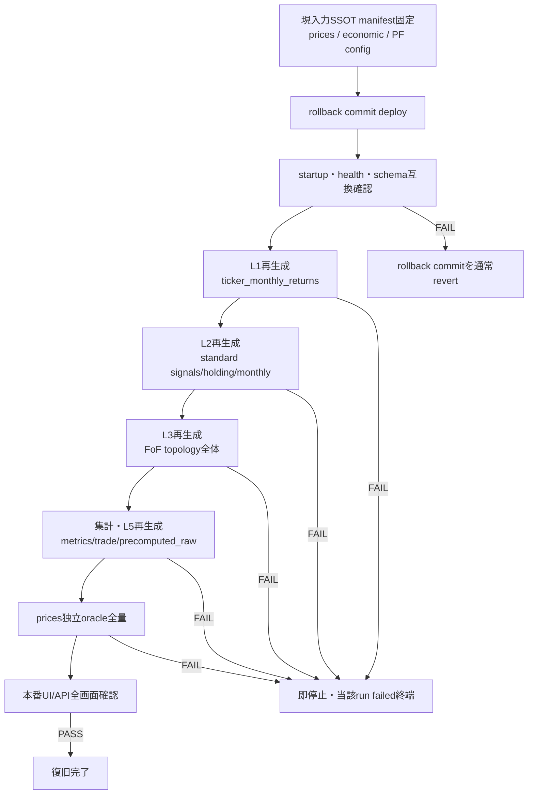

<!-- gist-master: 0c98ab3686bcaff3aa1ddd36e1a53570 dm-production-code-rollback-plan_20260813.md -->
# DM-Signal本番コードロールバック設計 v2.0
<!-- semantic-links: [[recalculate_pipeline]] [[production_parity]] [[code_rollback]] -->

- 作成: 2026-08-13 01:22 JST
- 発端: 殿裁定「新しいロールバック案が出た以上、前提条件が変わった。以前の前提下での判断は全てゼロに戻る」
- 目的: 正常だった時点の**コード**へ本番を戻し、入力SSOTから派生データを全再生成し、ticker `prices`を起点とする独立oracleと本番画面で正常性を証明する
- 旧文書: `dm-production-recovery-v3_20260813.md`は旧L5局所修復laneの歴史記録として凍結する。本書へ旧工程・旧PASS・旧ACを継承しない

## §-1. ★復帰点宣言(RESTORE POINT) — 2026-08-17 09:05 JST（初版 2026-08-14 14:29 RB1〜RB8全完了、2回目の実使用 2026-08-16 21:35〜22:15、**3回目更新 2026-08-17 09:05 殿裁定「ここをロールバックポイントにする」＋FE側を復帰点に追加**）

> **今後、本番に何かあった時に戻るべき場所はここである。** 復帰点＝「入力SSOTから独立検算で全量証明された、既知バグゼロの状態」＋**そこへ戻すための現物の所在と手順**。本節だけ読めば、前提知識のないLLMが本番を戻せる粒度で書く。

### -1.1 復帰点の構成要素（値・証拠・不足時に起きたこと）

| 構成要素 | 値 | 証拠 / 現物の所在 |
|---|---|---|
| **本番runtimeコード（backend）** | commit `3e28b617`（backend/ tree=`60c553c12eab27aa0b2cac21c0fbfee0beef8d6c`）。2026-08-14 09:42 JST初deploy。2026-08-16 21:35 JSTに `131e5dbb`（backend/を3e28b617へ全置換した1 commit）として再びmain tipへ積み、Render BE `srv-d4ja7q15pdvs739a4q1g` live（deploy commit 131e5dbb, finishedAt 2026-08-16 22:06 JST）。**08-17 09:05時点も同一**: `git diff --stat 3e28b617 62f0fba0 -- backend` = 0 | `git diff --stat 3e28b617 <live commit> -- backend` = 0 が判定式 |
| **本番runtimeコード（frontend）★08-17追加** | main tip commit `62f0fba04fcea1badf9ff170f2c1dddfb675f9d8`（2026-08-17 03:32 JST、cmd_4324「simplify Monthly Trade pending display」= frontend/のみ -207/+67）。frontend/ tree=`631e9322edf697e9a94cd19afe86c179d7fc116b`。Render FE `srv-d4ja8pp5pdvs739a5fsg` deploy commit 62f0fba0 **live**（finishedAt 2026-08-17 03:33 JST）。**殿08-17 09:01「FE側も保存しないとだめだとわかった」**＝復帰点はbackend/frontend両方のtreeで宣言する（08-16はbackendのみで宣言し、FEが復帰点外だった） | `git rev-parse <commit>:frontend` = 631e9322 が判定式。Render API `GET /v1/services/srv-d4ja8pp5pdvs739a5fsg/deploys?limit=1` で live commit確認 |
| **DB（入力SSOT＋派生データ）** | 2026-08-16 22:06 JST以降の本番DB（backend＋cron `dm-signal-etl`/`dm-signal-password-rotation` の env も同DBへ切替済み 23:26）= Render Postgres `dm-signal-db-copy`（`dpg-da0qttc9v7es73a0cig0-a`、singapore、basic_1gb、PG18）＝旧DB `dpg-d542chchg0os73979vg0-a` の **PITR restoreTime=2026-08-14T05:35:00Z（14:35 JST）** から作成。旧DBは残置（切戻し用） | Render API `POST /v1/postgres/<id>/recovery`。PITR可用窓は `GET /v1/postgres/<id>/recovery`（旧DB: AVAILABLE, startsAt 2026-08-09T07:54:58Z）。backend env `DATABASE_URL` は Render API `PUT /v1/services/srv-d4ja7q15pdvs739a4q1g/env-vars/DATABASE_URL` で切替、redeployで反映 |
| **DB派生データ世代（08-14時点）** | run360系＋L3 sync-fof cron正規再展開後の世代。orphan `precomputed_raw`=0件 | RB8 AC2機械検証 |
| **DB派生データ世代（08-17 09:05時点）★** | 最終run=**399 completed**（08-16 drop後・full）。殿が08-17 00:17にPF 4体をadmin削除→ **portfolios 98** / monthly_returns 15,977 / signals 333,025 / fof_component_weights 25,086 / portfolio_metrics 196 / **signal_decision_ledger 0**（cmd_3711バックフィルはPITR切替で消失、表示は08-17 cmd_4324でledger非依存化済み・再バックフィルは保留=殿02:41） / signals最新date 2026-08-14（prices最終同期=08-16 22:2x時点の状態）。**同一入力の集合md5**は次回fullで採り直すこと（PF98体化後のbaseline未採取） | readonly SQL 2026-08-17 09:05（db_capability_launcher readonly_query） |
| **全量検算の正基準** | (08-14) 月次33748/33748 exact＋metrics 30192/30192＋stub48/48=30240/30240 exact（独立証拠commit `6cc6b576`）。(08-16 drop後) **4業務表の集合md5＝上記冪等性欄の値が新しい同一性基準**（母集団はFoF valid_start前を含まない）。独立oracle（§7.1逆算parity）での再検算は未実施＝次に価格入力が変わる前に1回回す価値あり | `rb6-v3-full-revalidation-evidence_20260813.md`／`dm-restore-point-baseline-hash_20260816.txt` |
| **fullが再生成しない行（窓外行）の棚卸し** | 殿裁定2026-08-16 20:45＝**drop**、23:14「今消そう」で実施済み: FoF 78体の signals 285,612 / monthly_returns 12,239 / fof_component_weights 29,540 と標準PF週末signals 48 を1トランザクションで削除（bounded capability `bounded_legacy_rows_drop_20260816`、dry-run→drop、証跡 `outputs/analysis/legacy_drop_20260816.json`）→ full run395（23:17-23:24、6分）で窓内を再生成: FoF signals 244,196（2011-04以前 0）/ monthly_fof 11,749（全体16,486）/ weights 26,613 / 標準週末 0 / metrics 204 / 78 FoF全てに行あり。**現在の本番には「fullが再生成しない行」は無い**＝どのfullも同じ集合を作る | readonly SQL 2026-08-16 23:25 |
| **冪等性（full 1回で収束）** | **実証済み 2026-08-16 23:54**: 同一入力で run396 と run398 の4業務表md5が完全一致（monthly 16,486 `73e42944` / signals 343,626 `acb124d8` / fof_component_weights 26,613 `b757c911` / portfolio_metrics 204 `7802372c`）。間に OOM で interrupted した run397（metrics 0 まで書いた状態）を挟んでも1回のfullで同一hashへ収束＝復帰点コードに履歴依存なし。3e28b617以後の変更下では2回要した（run436→437で465件、run440→441で2,365件） | `docs/research/dm-restore-point-baseline-hash_20260816.txt`（=`outputs/analysis/baseline_hash_run39{6,8}_20260816.txt`、集計SQL=biz_hash: portfolio_id\|date\|signal\|holding_signal 等の string_agg md5） |
| **入力SSOT** | L0 prices最終同期日（`GET /admin/sync-status` L0_prices.last_success_date）とrows。08-14 PITR直後=2026-08-14／100,209行 → 22:2x `POST /admin/sync-prices` 後=2026-08-16。比較・parityは **同一 prices 状態のrun同士だけ**（08-16の96分誤診＝価格同期をまたいだ比較） | sync-status / recalculation_status.summary の入力hash |
| **API/画面** | 8画面（Dashboard/Summary/Monthly Returns/Monthly Trade/Metrics/Drawdowns/Compare Chart/Compare Summary）HTTP 2xx 8/8・non-empty 8/8・例外0。Signalsは廃止済み対象外。**08-17: Monthly Tradeは62f0fba0でNEXT SIGNAL帯・過去月バッジ撤去、当月のみ`MTD ⏳`（is_pending点灯）＋列独立薄色**（設計書 `dm-monthly-trade-pending-simplify-asis-tobe_20260817.md` gist c85b0cae） | `cmd_4301_rb8_generation_evidence_20260814.md`（08-14）／08-16復帰後の再確認は本節更新後に実施／08-17 FEはCDP検分せず（殿03:09） |
| **旧DBの扱い** | 旧DB `dpg-d542chchg0os73979vg0-a`（dm-signal-db）は切戻し保険として **2026-08-17 23:00 JST まで残置**、以後は削除（課金とデータ混同の防止）。それまでに新DBで異常があれば env を旧値へ戻して redeploy（`render_env_swap.py revert` 相当＝Render API PUT） | Render dashboard |
| **runtime注意（メモリ）** | 復帰点コードでfullを同一プロセスで連続実行すると5本目（run397）で 4GB OOM → instance再起動・run interrupted。**fullを連続で回す時は間に deploy/restart を挟むか、1〜3本に留める**。full所要=6〜8分（L3 261s/L2 141s/L5 43s/L1 4s） | Render event 2026-08-16 23:41 "Instance failed: 776l6 Ran out of memory (used over 4GB)" |
| **完了cmd / 実施記録** | 08-14: cmd_4301 completed(AC1-AC4 PASS・軍師LGTM)。08-16: 将軍単独実行（家老・忍者停止、殿直命21:30）、§9「2026-08-16 21:00〜22:15」に手順表 | queue/archive＋掲示板 blt_20260814_142907／blt_20260816_213722 |

### -1.2 戻し方（そのまま実行できる順序・新規コード0本）

1. **止める**: 走行中run無しを `GET /admin/recalculate-status` で確認。家老・忍者の配備は止め、実行者を1名にする。
2. **コード（backend＋frontend、両方）**: `git worktree add /tmp/<name> origin/main`（`/mnt/c` 直下はtimeoutする）→ `git checkout 3e28b617 -- backend` ＋ `git checkout 62f0fba0 -- frontend` ＋ それ以後に追加されたファイルをindexから除去 → `git diff --cached --stat 3e28b617 -- backend` が0 **かつ** `git diff --cached --stat 62f0fba0 -- frontend` が0 → 1 commit（本文にcurrent SHA/baseline SHA/scope/revert手順）→ `git push origin HEAD:main` → Render自動deploy live確認（BE `srv-d4ja7q15pdvs739a4q1g`／FE `srv-d4ja8pp5pdvs739a5fsg` の両方、`GET /v1/services/<id>/deploys?limit=1` でcommit一致＋status=live）。**FEはbackendと別サービス・別deployなので片方だけ戻して安心しない。**
3. **DB**: `POST /v1/postgres/dpg-d542chchg0os73979vg0-a/recovery {"restoreTime": <ISO8601Z>}` → 新instance available まで待つ（今回13分）→ 新instanceの `internalConnectionString`（`GET .../connection-info`）を backend env `DATABASE_URL` へ PUT → redeploy → live。旧値は退避して切戻し可能に保つ。**DBは戻ってもコードは戻らない、コードが戻ってもDBは戻らない**。両方やる。
4. **入力更新**: PITR時点以後の価格を `POST /admin/sync-prices` で取り込む（`sync-status` の L0 last_success_date が当日になるまで）。
5. **再計算**: `POST /admin/recalculate-sync?mode=full` を1回 → completed/error0 → **同一入力でもう1回**して confirmed alerts=0 を確認（冪等性の実証。0でなければ復帰点コードに履歴依存が混入している＝復帰点の資格を失う）。
6. **合否**: 正基準（-1.1）との exact 突合、8画面 2xx/non-empty/例外0、orphan 0。PASSで復帰完了。FAILは各層で即停止（§6）。

### -1.3 復帰点を使う時・更新する時の規律

- **バグを直すな、戻せ**（殿裁定2026-08-16 21:00）: バグ無し時点が確定しているならクリーン点へ戻して知見を記録する。戻した後に積み直す各手には「full 1回で収束」「fullが再生成しない行を作らない」を合否として付ける。
- **復旧に新規コードを書くな**（殿直命2026-08-16 21:24）: 削除ツール・writer・観測拡張は書かない。git checkout／Render PITR／Render API／既存admin endpointだけで完了する。
- **タイムスタンプ**: 復帰点の更新は本節見出しの版+時刻だけを更新し、旧値は行内に「（08-14時点）」等で残す。変更履歴を別節に書かない。
- **復帰点はbackend/frontend/DBの3点セットで宣言する**（殿08-17 09:01）: 08-16はbackend treeとDBだけで宣言し、FE deploy（別Renderサービス）が復帰点外だった。FEだけ進んだ状態でBEを戻すと画面契約がずれうる。以後、復帰点更新時は必ずFE tree/live commitも同時に記録する。
- **将来の障害時の使い方**: (1)コードは復帰点SHAとの差分から容疑を絞る (2)派生データは正基準6cc6b576の算術合成との突合で「どこから壊れたか」を特定する (3)検算は§7.1逆算parity方式とprovenance設計書§5.5資産カタログを再利用し独立runnerを再発明しない (4)fullが再生成しない行はPITR以外に戻す手段が無い＝先にPITR可用窓を確認する。

## §0. 前提リセット

1. run316のL2/L3成功、L5 warm-context、R1-R5、旧四点一致、旧canary結果は本計画のPASS証拠に使わない。
2. `21e80e30`は採用済みSHAではなく、一次証拠で選定する候補の一つへ戻す。
3. 現在の派生DB値はバグコードの出力であり、正解・比較baseline・保存対象にしない。
4. ロールバックとはgit履歴の巻戻しではない。現main上へ「選定baselineとruntime treeが一致する復帰commit」を積み、通常push/deployする。force push/resetは使わない。
5. 判定は旧本番値とのparityではなく、入力SSOTから独立導出した期待値と本番UIの機能契約で行う。

## §1. 現在確認済みの事実（判断ではない）

| 事実 | 一次証拠 |
|---|---|
| 現main | `7003cf69b3817841bfb77ea27968a5646ed838c6`（2026-08-12 23:45 JST） |
| 候補A | `9a27eb4fd5a74fa5bfd2bb96422d2557bb3191f0`（2026-08-03 21:25 JST） |
| 候補B | `21e80e30957d61f5bdfb9ea04bf99b63dda2cfc9`（2026-08-04 00:51 JST、fresh Monthly Trade data保持） |
| 候補Bのdeploy事実 | 8/4には未deploy。2026-08-09 00:21 JSTの`10764603`一括deployで初めて本番へ含まれ、2026-08-10 02:39 JSTまで正常表示継続 |
| A→B間 | current month表示、ledger境界、FoF holding date、stale holding拒否、fresh data保持の7 commit |
| B→現main runtime差分 | backend/frontend/API/jobs/services等に多数あり。baseline選定前に全runtime manifestを確定する |
| B以後のDB migration追加 | `migrations.py`差分中の`ADD COLUMN`/`CREATE TABLE`は0件。ただし起動互換は実起動で判定する |
| 現本番Monthly Trade | standardは履歴あり、FoF 78/78は履歴1行・ticker Price Return 0 |
| prices独立検算済み範囲 | standard 24 PF・4,713確定月。不一致4件。FoF 78 PFは未検算 |
| 既知のbaseline内候補バグ | `fda736295`は候補Bのancestor。全期間metrics初月0%化が残る可能性あり |

## §2. SSOT・維持・再生成の境界

### 維持するもの

- 市場入力: `prices`、economic inputsとその取得条件
- ユーザー定義: portfolio本体、構成、parameter/config、公開設定、認証・viewer設定
- 歴史証跡: `recalculation_status`、`recalculation_timings`、deploy/commit/run log。過去行を削除・書換えない

### 正常コードから再生成するもの

- L1派生: `ticker_monthly_returns`
- L2/L3派生: signals、holding/ledger、standard/FoF `monthly_returns`
- 集計派生: metrics、risk、rolling、annual、drawdown、trade performance
- 配信cache: `precomputed_raw`、MTD/cache派生物

### 境界の二値確認

- 維持対象table/column manifestがN/N列挙され、派生tableとの重複0。
- portfolio/config件数・ID・内容hashは再生成前後で不変。
- `prices`の件数、min/max date、ticker別hashは再生成前後で不変。
- 歴史台帳の既存行更新0。新runは新規行のみ。

## §3. rollback先の決定

**決定: `21e80e30957d61f5bdfb9ea04bf99b63dda2cfc9`（2026-08-04 00:51:40 JST）へコードrollbackする。**

理由:

1. `9a27eb4f`後に必要となったMonthly Tradeの当月表示・FoF holding日・stale holding拒否・fresh data保持を全て含む。
2. `21e80e30`は8/4には未deployだったが、2026-08-09 00:21 JSTの`10764603`一括deployで初めて本番へ含まれ、2026-08-10 02:39 JSTまで正常表示が継続した。8/4静穏期のCDP証跡の直接帰属SHAは`28b58ee0`であり、`21e80e30`へ誤帰属させない。
3. 直後から2026-08-08 23:59:08の`bf4ed6a6`直前までproduction runtime変更は0件。次のruntime変更はL5自動queue新設であり、正常期と新パイプライン改変期の境界が明確。
4. `9a27eb4f`へ戻すと、その後に発覚・修正したMonthly Trade不具合を再導入するため早すぎる。

### 前後3 commit（production runtimeを触ったcommitの時系列）

「前後」はdocs/研究のみのcommitを除外し、backend/frontend/renderの本番runtimeを変更したcommitで定義する。時刻はcommit timestamp（JST）。

| 相対 | timestamp (JST) | SHA | 変更内容 |
|---:|---|---|---|
| -3 | 2026-08-03 23:54:43 | `07b1360135b95efe00560de3f581287dc37544b4` | Monthly Trade simple表示でもMonth列を隠さず、当月行を常に識別可能にした。runtime差分=`monthly-trade-table.tsx` +4/-2 |
| -2 | 2026-08-04 00:32:38 | `28b58ee05c4ebc9e9640fd34ce4b2c3c15006cce` | FoF表示holdingの検索順を`position_start_date`優先へ変更し、Dashboardと同じ営業日holdingへ揃えた。`monthly_trade.py` +21/-6 |
| -1 | 2026-08-04 00:42:27 | `9f09b1286cab17937c7d28ec3d70a7803fb0fe89` | Monthly Trade holdingがDashboard signalと不一致ならstale payloadを拒否し、fresh再取得するようにした。`page.tsx` +40/-7 |
| **0** | **2026-08-04 00:51:40** | **`21e80e30957d61f5bdfb9ea04bf99b63dda2cfc9`** | **fresh Monthly Trade data自体は保持し、holding不一致時はSignals側をfresh更新するよう修正。正常復帰点。** `page.tsx`/`signals-context.tsx` +38/-12 |
| +1 | 2026-08-08 23:59:08 | `bf4ed6a61e0e863a3fbed745e78c1a7b96772a10` | cache invalidation後にL5再生成を自動enqueueするsingle-flight queueを新設。API/Session after_commit/新queue workerを導入。+147/-5 |
| +2 | 2026-08-09 00:00:11 | `16b62fca3ac020962dd484181d65162c77e52578` | queue worker `_run_once`の戻り値型を`None`から`bool`へ訂正。+1/-1 |
| +3 | 2026-08-09 00:15:58 | `337e47a1ce79028fb6d04a5beb1c27c2713181b7` | L3完了・admin L5入口・cache invalidationを新queueへ接続する変更を別系統へ再適用。+31/-5 |

境界の意味: `21e80e30`まではMonthly Tradeの表示・holding整合修正。次のruntime commitからL5生成の起動・invalidate・queue所有権を変える新設計へ移行する。よって`21e80e30`が「必要な画面修正を保持し、新L5改変を一切含めない最新点」である。

## §4. rollback commitの構築

1. `origin/main`から専用隔離worktree/branchを作る。
2. production runtime closureを明示manifest化する。対象はbackend runtime、frontend runtime、起動・依存・deploy設定。docs、分析成果、運用台帳は対象外。
3. manifest各pathを選定baselineのblobへ置換する。広域restore/resetを使わず、対象pathを明示する。
4. `git diff --name-status`で変更対象N件=N件、manifest外runtime差分0、削除/追加の意図不明0を確認する。
5. rollback commitは1 commitとし、本文に`current SHA`、`baseline SHA`、runtime manifest hash、revert手順を記録する。
6. rollback前の現main commitは消さない。失敗時はrollback commitを通常revertして復元する。

## §5. deploy前検証

- backend import/startup PASS、migration dry-run PASS、frontend production build PASS、SKIP 0。
- baseline選定実験5項目をrollback commitへ再実行し、候補worktreeとの差分0。
- 現PF/configを読み込む起動互換テストPASS。未知fieldはsilent dropせず0件または明示FAIL。
- DB書込みを伴う試験は本番で行わず、一時DB/隔離schemaで派生再生成順序を1周する。
- deploy対象commit、revert commit手順、Render対象serviceを固定する。

## §6. 本番実行順序

- 層は直列実行し、各層のterminalと成果物を確認してから次へ進む。
- 再生成window中は既存cron（01:10 L2／01:40 L3／02:00 L5 fallback）の発火と混線させない。実行時にcron抑止状態または各runの識別方法を記録する。
- FAIL時に後続層を実行しない。旧派生値へfallbackしない。
- 本番が既に壊れているため、本番実データでの検証を正式工程とする。ただし入力SSOTと歴史台帳は不変に保つ。

## §7. 独立oracle

**RB6の平易な説明（殿説明用・2026-08-13追記）**: RB6「prices独立oracle全量」とは、**アプリの計算コードを一切使わず、生の株価（`prices`=入力SSOT、今回の障害で一度も汚れていない）だけから答えを独立に作り直し、本番の全数値と突き合わせる全量検算**である。「failed 0で完走した」は「エラーが出なかった」の証明にすぎず「数値が正しい」の証明ではない。計算を書いたのと同じコードで検算しても同じバグは同じ間違いを再現するため、独立した採点者（oracle）が要る。全102PF・全確定月で不一致0を確認して初めて数値正当性が証明され、RB7（本番画面確認）へ進める。「全量」=代表サンプルではなく全PF・全月（パラメータ空間縮小禁止）。8/10実績: standard 24PFのみ実施し4,713確定月中4件の不一致を検出（FoF未検算）。今回はstandard+FoF+metricsの全てを対象とする。

### standard

全PF・全確定月について、portfolio構成/実保有と`prices`の実開始・終了価格からopen/close returnを独立計算する。アプリの`monthly_return`、累積値、Price Return payloadをoracle入力に使わない。

### FoF

アプリの被疑`expand_portfolio_to_tickers`結果を使わない。portfolio構成表を直接読み、nested PFを再帰展開して最終ticker weightを独立導出し、`prices`へ結合する。cycle、欠損weight、weight sum不一致はFAILとする。

### metrics

独立月次列からtotal return/CAGR/年率平均/volatility/Sharpe/Sortino/MaxDDを直接算出する。初月を0へ置換しない。候補baseline自体にmetrics不一致があれば、rollback成功とは別にせず、最小修正を積んで再び本節全量を通す。

### §7.1 検算方式の改訂 — 逆算検算（殿裁定 2026-08-13 22:40-22:44・以後の正）

**RCAで判明した事実**: run358/359採点の残差（FoF mismatch 935・親固有601等）の代表分解で、第一分岐は本番コードではなく**oracle側のFoF weight展開仮定の不足**と2レーンが独立確定した（本番実weightを同一価格へ代入するとclose/open双方10dp完全一致）。§7原案の「nested PFを再帰展開して最終ticker weightを独立導出」は、selection規則の再実装を必要とし、**違うコードで同じものを計算する複雑化**へ向かっていた。

**殿裁定（3点・原文準拠）**:
1. 22:19「総当たりではなく原理を理論とコードベースで仮説検証の形で繰り返せ」→ variant総当たり禁止。代表1件の項分解→第一分岐段特定→コード仮説→最小再現の順で回す。
2. 22:40-22:42「本番から逆算してprice×weightに分解したときに一致するかを見ればよい。目的からずれて正確に計算することにとらわれると、単に違うコードで同じものを計算しているだけになる。本番の現在のコードが正しいか検算するだけだ」→ **RB6の目的=本番現行コードの検算**。oracleの完全独立再実装（selection規則のフル再導出）は目的外として撤回。
3. 22:44「極限までシンプルな実装がもっとも正しい」→ 検算は**単一スクリプト・単一パス**: 全PF×全月について保存weight×独立prices（入力SSOT・無汚染）の積和を計算→保存monthlyと10dp比較→出力は「一致N/不一致N/不一致一覧(PF×月×delta)」の3点のみ。depth分類・variant・世代管理等の付帯機構は検算に入れない。

**改訂後のRB6判定基準**: (a)standard全PF全確定月の10dp一致0不一致（達成済み: 4713/4713） (b)FoF全PF全確定月の**逆算parity**（保存weight×独立price returnの積和=保存monthly、10dp）不一致0 (c)metricsは独立月次列からの算出一致。weight自体の選抜規則正当性の検証はRB6の範囲外（検証したければ別工程）。三層記憶: knowledge:c7a5d6a5（逆算検算原理）・knowledge:55af7b46（極限シンプル実装）。

### §7.2 月次検算の決着 — H6でCLEAR確定（2026-08-14 01:52 殿裁定・以後の正）

> ★前提情報のないLLMへ: 本節がRB6**月次**検算の最終結論である。§7.1の方式で仮説H1〜H6を回した顛末と、途中の撤回騒動の教訓を1節で自己完結させる。

**確定結論（2026-08-14 01:52 殿裁定）**: RB6月次検算は**CLEAR**。
`Standard 9426 exact / FoF 24322 exact / total 33748 exact, coverage 33748/33748, duplicate 0, skip 0, mismatch 0`
（1件の定義: 1 timing=1 portfolio_id×1 year_month×close又はopen。33748=16874確定月×2 timing）

**H6最終合成式（何と何を突き合わせたか）**:
- Standard 4713月: 保存weight（等weight 1/N）×raw prices月初/翌月初境界の積和=保存monthly（v4方式・2独立実装で9426/9426一致）。
- FoF 12161月: 保存済み派生（H1 full artifact）を基礎に、旧残差101 timingの真因=**検算式側の窓規則（`monthly_boundary.py:45-108` §0.6）写し漏れ**と**FoF初月stubはstub開始日時点のas-of weightを使う**の2規則で全量解消（本番バグゼロ）。missing 21=display一段式+SPY境界式で42/42一致クローズ済み。
- 両集合は排他的で計16874月、同一の保存weight×raw prices契約で完全被覆。

**撤回騒動の記録（歴史として保持・教訓）**: 01:50に家老が「H6は単一runner実走でなく部分artifactの算術合成だから証拠除外、H7単一runnerで置換」と一旦BLOCKへ差し戻したが、01:52殿裁定で**逆転**: (1)算術合成は排他的部分集合の合算であり正当 (2)疾風freshの`mismatch 935+missing 21`は**configからselectionを再生成する別契約**の数値でありH6（保存値検算）を反証しない (3)「正しいと判明した時点で終わり。きれいな証明は不要」→H7単一runner再実装は**中止**。原因=家老の過剰検証判断。教訓: 検算の反証は**同一契約の数値**でのみ成立する。契約が違う数値の不一致は反証ではない。

**残るRB6未CLEAR範囲=metricsのみ**: 本番`portfolio_metrics`の実体は102PF×years{0,10}=**204行・metric name 47個**（当初「7指標」「35キー」とされた前提は現物確認で2度訂正済み）。H6証明済み月次artifactだけを入力とし（pricesから月次を再発明しない）、47指標を重複なし4 shardで並列検算する: A=return/distribution、B=RF/excess/benchmark、C=drawdown/recovery、D=全204行の型/NULL/文字列/coverage統合。全laneに同一artifact SHA256を強制し、最終unionで47/47・重複0・欠落0を検証してRB6完全CLEARとする。

## §8. 本番復旧AC

1. 選定baseline SHAとruntime manifest hashが一意に記録され、production runtime treeの一致率N/N。
2. 入力SSOT不変: prices/PF/configの件数・ID・内容hash不一致0。歴史台帳の既存行更新0。
3. L1→L2→L3→L5が全対象を処理し、ERROR 0、failed 0、SKIP 0、旧派生fallback 0。
4. Monthly Tradeはstandard/FoF全PFでrequested historyを返し、確定月ticker Price Return欠損0、当月行欠損0。
5. 全102 PF・全確定月でopen/close monthly returnのprices独立oracle不一致0。
6. 全102 PFの全期間metricsが独立月次列からの算出値と不一致0。
7. `precomputed_raw` orphan 0、obsolete hash 0、global duplicate 0、expected key欠損0。
8. 本番API/UIの現行8画面（Dashboard、Summary、Monthly Returns、Monthly Trade、Metrics、Drawdowns、Compare Chart、Compare Summary）で欠損0・例外0。Signalsは廃止済みで対象外。
9. AC1-8を同一deploy/run世代で満たした時だけ復旧完了とする。

## §9. 新工程表

| # | 工程 | 二値出口 | 状態 |
|---|---|---|---|
| RB1 | rollback先決定 | `21e80e30`、前後3 runtime commitと境界を記録 | **完了** |
| RB2 | runtime closure manifest作成 | 対象N/N、manifest外runtime差分0 | **完了** |
| RB3 | rollback commit構築 | tree一致N/N、build/startup PASS、SKIP 0 | **完了**（`233c2303`） |
| RB4 | 本番deploy | live SHA一致、health/schema互換PASS | **完了** |
| RB5 | 入力SSOT固定・派生全再生成 | L1→L5全対象、failed 0 | **完了**（2026-08-13 12:10 JST: `precompute_raw completed: rows=1533 portfolios=102 failed=0 elapsed=436.51s`、API永続status `last_error=null rows_processed=1533`。経路: 先頭NULL両経路修正`9b881979`/`5c0af039`＋valid_start境界holding seed修正`071f2ca4`→L1再生成4,795行→24PF L3再生成→rolling欠損0→L5再走） |
| RB6 | prices独立oracle全量（§7.1逆算検算方式・§7.2で月次決着） | monthly逆算parity/metrics不一致0 | **月次CLEAR**（33748/33748 exact・殿裁定2026-08-14 01:52）。残=metrics 47指標×204行の4 shard検算のみ |
| RB7 | 本番API/UI確認 | 8画面欠損0・例外0 | **完了**（殿自身が2026-08-13 13:33「問題ないことを確認した」と裁定） |
| RB8 | 最終checkpoint | §8 AC1-8全PASS | **完了**（2026-08-14 13:55 JST: AC1/AC2/AC3/AC4統合PASS。旧BLOCK記録は§9.1に保持） |

### §9.1 実行記録と残件（2026-08-13 03:55時点）

**実行記録（一次証拠付き）**:

1. 殿裁可 01:47「では本番をロールバックしよう。ロールバックしたらfullrecalculateしよう」→ 即実行。
2. rollback commit `233c2303`（`rollback(dm-signal): restore production tree to 21e80e30`）をorigin/mainへpush、退避branch `archive/pre-rollback-20260813-0148-7003cf69` を作成（revert経路確保）。
3. 本番deploy後、fullrecalculate実行。走行中に`SIGNAL CHANGE ALERT count=9343 portfolios=50 dates=2011-08-31〜2026-08-11`が発報 → **正当変化と判定**（旧値=バグコード出力への書戻し差分。ALERT機構自体もrollbackで復活した撤去前機構であり異常ではない。03:06殿へ言上済み）。
4. L5終端: `precompute_raw completed: rows=1173 portfolios=102 failed=24 elapsed=624.79s`。failed 24件は全てstandard PF。
5. 原因確定: standard 24 PFの系列先頭行がholding_signal NULLかつmonthly_return=0（本番readonly再集計 `(24, 24, 24)`、将軍が独立確認）。baseline `21e80e30`に含まれる8/3 fail-visible化（`3efd01e0` performance.py全NULL例外化）と「保有確立前leading NULL=正常」（`85a15e50`）の契約不整合。Aug 2 backupにも先頭NULLがあり、rollbackが壊したのではなくbaseline内在の不整合。

**残件**:

1. **L5先頭NULL最小修正**（家老実装中・将軍承認済み・殿裁定03:46「シンプルな対応がベスト」準拠）: 既存raise箇所に「系列先頭からの連続NULL（保有確立前）はスキップ」の最小分岐のみ追加。確立後NULLはraise維持。追加fixtureは境界1本のみ。追加機構（ヘルパー集約・ログ機構等）は作らない。二値AC: L5 102/102・failed 0・Unknown出力0・確立後NULL fixtureはraise。
2. ~~修正deploy→L5再走でRB5のfailed 0を確認~~ **完了**（12:10 JST failed 0）。
3. **TIMING SUMMARY復元完了**（2026-08-13 13:15 JST）: rollback前実績4 commit（`365e1c8f`→`20a26556`→`695933d3`→`88d38b77`）の最終形を忠実復元（復元commit `15e612f9`、計測・ログ・testのみ、業務計算式変更ゼロ）。canary 5PF hash一致5/5・ERROR 0（run `2026081303593369C961`）→full本走（run `2026081304021264BB4C`）completed・failed 0・TIMING SUMMARY出力復活（`L2=2m5s L3=4m21s L5=41.3s unaccounted=38.0s TOTAL=7m45s`）。SIGNAL CHANGE ALERT 5,890件/39PFはFoFのみ・standard 0=holding seed修正の波及書戻しで正当（ALERT機構自体はbaseline残存機構）。
4. 残: RB6（prices独立oracle全量）→RB7（8画面確認）→RB8（§8 AC1-8同一世代PASS）。全数数値正当性の最終GATEはRB6完了まで未CLEAR。
5. **RB6経過（2026-08-13 22:45追記）**: run358採点=standard 14/FoF 939/metrics 740 → 修正`c9a0da8d`（standard stock readinessのDTB3除外+full-prefix/bounded-native分離）の独立レビューAPPROVE→run359でstandard 4713/4713 exact・mismatch 0達成。FoF残935の代表分解2レーンが「第一分岐=oracle側weight展開仮定不足・本番欠陥なし」へ独立収束、missing 21=7PF×2012-04/05/06のproduction不正保存×oracle前史不足の複合と確定。以後§7.1の逆算検算方式で全量再採点中。
6. **RB6月次決着（2026-08-14 01:52追記）**: H6合成式で33748/33748 exact・mismatch 0 → 一時撤回騒動（01:50家老「算術合成は証拠除外」）を経て殿裁定01:52で**月次CLEAR確定**。詳細と教訓は§7.2。残=metrics 47指標×204行の4 shard検算のみ。
7. **RB8実測（2026-08-14 08:47 JST）**: live deploy `216ac4add78d89acd8df01674ca2562029d3d317`、latest full run `202608131108178016A6`/DB id=359 (`completed`, `full`)、run manifest `3d7e7a0e...`, input snapshot `90fc126b...` を固定。runtime closure 159/159一致。DBは102 PF、monthly 16976/102 NULL 0、metrics 204/102、L5 completed rows=1533/PF=102。代表API routeは11/11 HTTP 200。しかし `precomputed_raw` に削除済みPF `5bec6843-a3d3-4d46-8cfc-2a9ec26bd294` の孤児18行が残り、AC7 orphan=0未達。同一世代metrics全数artifactと全PF API sweepも現証跡へ再リンクできず、AC2/AC3/AC4をFAIL。production mutationは0。詳細は `cmd_4301_rb8_generation_evidence_20260814.md`。

### §9.2 修正記録 — 何をどう直したか（知見用・2026-08-13 13:30時点）

**現段階の総括: 主要バグは全て解消。** full本走（run `2026081304021264BB4C`）completed・102/102 PF・failed 0・ERROR 0・TIMING SUMMARY復活。残るは数値正当性の最終GATE（RB6独立oracle）と殿画面確認（RB7）のみ。

rollback後に露出したbaseline内在バグは**3本で、根はすべて1つ** — 「保有確立前の先頭holding NULL=正常」（`85a15e50`の判定）と「holding NULLは全てraise」（`3efd01e0`のfail-visible化）という**同日8/3に入った2つの契約の不整合**。それが3つの経路で別々に発火した。

| # | 現象（発火点） | 真因 | どう直したか（修正commit） | 検証 |
|---|---|---|---|---|
| 1 | L5でstandard 24PF failed（performance系列構築の`performance.py:66` raise） | 系列先頭の保有確立前行はholding NULLが正常なのに、fail-visible契約が全NULLをraise | **先頭からの連続NULL行のみスキップする最小分岐**を既存raise箇所へ追加。確立後NULLはraise維持。境界fixture1本（`9b881979`） | binary_checks 11/11 yes。ただしL5再走でfailed 24残→#2発覚 |
| 2 | 修正#1後もL5 24PF failed（`rolling_returns params={} builder None`）。rolling_summary/chart双方欠損24PF | 同じ先頭NULLが**cache経路**（`iter_cacheable_signals`→`require_holding_signal`）からPhase 4.5を落としrolling生成が止まっていた。#1は直接経路のみの修正だった | cache走査にも**同じ「先頭未確立行のみ除外」契約を適用**（`5c0af039`）。隠蔽sentinel・旧最適化復活なし | before再現FAIL→after PASS、pytest 33/0 skip。ただしL3再生成で#3発覚 |
| 3 | 24PF L3再生成がinterrupted（確立後NULL 8行/2PF、2007-01-26〜31） | 価格欠損ではない（5銘柄×555日欠落0を独立確認）。**PF固有valid_start境界でholding seedが欠落** — 有効開始日直後の再計算で直前の確立済みholdingを継承できず確立後NULLが生成される | **valid_start前の最新非NULL holdingをseedとして継承**する改訂（`071f2ca4`） | 2人目忍者の独立再検証13/0 skip PASS＋本番再計算で実証 |

**修正後の再生成順序（依存を守った復旧手順そのものが知見）**: L1再生成（`ticker_monthly_returns` 0行→4,795行。run318失敗後の未再生成残骸も解消）→24PF L3/portfolio再生成（rolling欠損24→0）→L5一回再走（failed 24→**0**、rows=1533）。L5は既存rolling表を読むだけで再生成しないため、**生成側修正→上流再生成→L5の順serial実行が必須**だった。

**TIMING SUMMARY復元（計測は計算を変えない証明つき）**: rollback前実績4 commit（`365e1c8f`→`20a26556`→`695933d3`→`88d38b77`）の最終形を新規書き直しせず忠実復元（`15e612f9`、diff=計測・ログ・testのみ）。canary 5PFでmonthly_returns before/after **hash一致5/5**・ERROR 0を確認してからfull。fullで`L2=2m5s L3=4m21s L5=41.3s TOTAL=7m45s`が従来粒度・従来位置に出力。

**今後への知見（原則の実証）**:
1. **fail-visibleは正しかった** — 3本とも「エラーを隠さずraiseする設計」が隠れていた欠損・契約不整合を表に出した。2007年のseed欠落はUnknown fallback時代には見えなかった。
2. **同じ契約は全経路に一度に適用せよ** — #1→#2は同一契約の直接経路とcache経路への適用漏れ。契約変更時は`grep`で全消費点を列挙してから直す。
3. **シンプル最小修正で足りた**（殿裁定03:46） — 3本とも既存raise箇所への最小分岐＋fixture1本。ヘルパー新設・ログ機構・sentinelは一切不要だった。
4. **「完走」と「正しい」を分離** — failed 0はエラーなしの証明であり、数値正しさはRB6独立oracleで別途証明する。

### §9.3 現行正常ベースライン（今後のrollback先・2026-08-13 13:35固定）

**今後障害が起きた場合のrollback先はここ**（殿指示13:34「今後何か起こった時にロールバックできるように現在のコミット・デプロイも明確にしておいてくれ」）:

| 項目 | 値 |
|---|---|
| **正常ベースラインcommit（origin/main HEAD）** | **`15e612f9` (restore canonical timing summary measurement schema)** |
| 構成commit列（rollback commit以降） | `233c2303`(tree=21e80e30復帰) → `238e6236`(先頭NULL直接経路) → `5c0af039`(先頭NULLcache経路) → `071f2ca4`(valid_start holding seed) → `15e612f9`(TIMING SUMMARY復元) |
| 正常性の証拠run | full `2026081304021264BB4C` completed（04:02-04:09 UTC）・102/102 PF・failed 0・ERROR 0・TIMING SUMMARY出力あり |
| 殿画面確認 | 2026-08-13 13:33 RB7 PASS |
| Renderデプロイ | backend srv-d4ja7q15pdvs739a4q1g にこのSHAがLive（dep-d9ugdqeq1p3s73bor6pg以降の連続deploy） |
| 旧退避branch | `archive/pre-rollback-20260813-0148-7003cf69`（rollback前main。歴史参照のみ、復帰先にしない） |
| 未CLEAR残 | RB6のmetrics検算（47指標×204行・4 shard）のみ。月次は2026-08-14 01:52殿裁定でCLEAR（§7.2） |

**rollback手順（再発時）**: `15e612f9`との差分commitを通常revertして push→Render自動deploy→必要層のみ再生成（§9.2の順序: 生成側修正→L1→L3→L5 serial）。force push/resetは使わない（§0-4）。

### 2026-08-14 13:34 JST — RB7/API/UI全対象再確認（cmd_4301 AC4）

固定世代は本書§9.1記載のlive deploy `216ac4add78d89acd8df01674ca2562029d3d317` とし、隔離CDPセッション（port 9223、専用profile）で対象8画面を順次実行した。CDP計測器は対象8画面（Dashboard、Summary、Metrics、Compare Chart、Compare Summary、Monthly Returns、Monthly Trade、Drawdowns）まで完走した後、対象外Trades遷移のNetwork.enable応答待ちで停止したため、対象8件の結果だけを採用し、停止後の対象外結果は採用しない。

| 画面 | route | HTTP | body bytes | CDP APIs | API time ms |
|---|---|---:|---:|---:|---:|
| Dashboard | `/dashboard` | 200 | 24798 | 1 | 562 |
| Summary | `/summary` | 200 | 24587 | 3 | 1255 |
| Metrics | `/metrics` | 200 | 24174 | 8 | 2207 |
| Compare Chart | `/compare` | 200 | 22886 | 7 | 1789 |
| Compare Summary | `/compare-summary` | 200 | 38134 | 6 | 2401 |
| Monthly Returns | `/monthly-returns` | 200 | 24101 | 5 | 1531 |
| Monthly Trade | `/monthly-trade` | 200 | 24216 | 8 | 1528 |
| Drawdowns | `/drawdowns` | 200 | 24187 | 5 | 1723 |

二値結果: HTTP 2xx `8/8`、non-empty `8/8`、直接HTTP例外 `0`。CDP画面遷移は対象8件すべて結果行を取得し、対象8件の画面側HTTP/API例外は `0`。このAC4の画面/API確認はPASS。ただしRB8全体は、同一世代metrics全数証跡・precomputed_raw orphan 18件など§9記載の残件があるためBLOCKのまま維持する。production DB write `0`。

一次証跡: `cmd_4301_rb8_generation_evidence_20260814.md`、2026-08-14 13:34 JST direct HTTP sweep、同時刻CDP output。

### 2026-08-14 13:55 JST — RB8終端統合（cmd_4301 AC4最終follow-up）

RB8の終端判定を、同一AC4レビューで確定した現行の正本へ統合した。歴史上の08:47 JST BLOCK記録およびその時点の残件説明は保持し、現行の終端判定のみを更新する。

- **AC1/AC2 PASS**: `queue/archive/reports/hayate_report_cmd_4301_20260814.yaml` の fresh generation record を正本とする。live deploy `3e28b6172889df3d544cc04ae31567252073ac7b`、latest full run DB id `360`、runtime closure `159`、`orphan_missing_pf=0`、`inactive_pf_rows=0`、`duplicate_groups=0`、Monthly Trade 非Cash price欠損 `0`。
- **AC3 PASS**: `queue/reports/hayate_report_cmd_4301.yaml` を正本とする。月次 `33748/33748` exact、metrics `30192/30192` exact、別契約stub `48/48`、不一致・欠損・重複・skip `0`。
- **AC4 PASS**: 現行8画面（Dashboard、Summary、Monthly Returns、Monthly Trade、Metrics、Drawdowns、Compare Chart、Compare Summary）を `8/8` 実行、HTTP/API例外 `0`。Signalsは廃止済み・対象外。証跡は現行reportおよびcommit `97544e7544dd762cfe62df2167cfd014949d38cf`。

以上により、AC1/AC2/AC3/AC4のcoverageは全てPASS、RB8を完了とする。本終端記録の反映は計画書1ファイルのみを更新し、production mutationは `0`。既存Gistは同一IDをupdate同期する。

### 2026-08-16 21:00〜22:15 JST — §-1復帰点への実rollback（2回目の使用・将軍単独実行）

**発端**: 2026-08-15〜16のL1/L2分割・継ぎ目S2の本番実験中に、(a)観測用observerがconsumerへ渡す参照を差し替えてholding_signal 8,145行を変えた(run430) (b)FoF生成窓拡張(c71313d5)がlookback防御を外しalerts 17,302件(run439) (c)**full 1回では前run終端のDB状態に一段依存し、汚染後の復元にfull 2回を要する**(run436→437で465件、run440→441で2,365件の一段残差)、が判明。殿裁定21:00「バグがない時点が確定しているのにバグを直そうとする発想がバグそのもの。クリーンに戻し知見は記録する」／21:24「復旧に不要なコードを増やすな」／21:27「コードとDBをロールバック、その後full 1回だけ」／21:30「将軍自身が一人でやれ」。

**実行(将軍単独・新規コード0本)**:
| 手 | 内容 | 結果 |
|---|---|---|
| code | `/tmp` worktreeで `git checkout 3e28b617 -- backend`(+3e28b617以後の追加4ファイルをindexから除去)→`git diff --cached --stat 3e28b617 -- backend`=0を確認→1 commit `131e5dbb`(本文にcurrent/baseline SHA・scope・revert手順)→`git push origin HEAD:main` 21:35 | Render live 21:4x |
| DB | Render Postgres PITR: `POST /v1/postgres/dpg-d542chchg0os73979vg0-a/recovery {"restoreTime":"2026-08-14T05:35:00Z"}`(=§-1復帰点14:29 JST直後)→新DB `dm-signal-db-copy`(dpg-da0qttc9v7es73a0cig0-a) 21:37起動→available 21:50 | 旧DBは残置=可逆 |
| 切替 | backend env `DATABASE_URL`をRender API PUTで新DBの内部接続文字列へ→redeploy(dep-da0r6em1egvs739d3mm0) 21:54→live 22:06 | 旧値は退避済み |
| full | `POST /admin/recalculate-sync?mode=full` 22:07→completed 22:15、**491秒**(L3 261s/L2 141s/L5 43s/L1 4s)、error 0 | run 202608161307126A9620 |
| 入力 | PITR時点のL0価格最終同期=2026-08-14のため `POST /admin/sync-prices` 22:2x起動→完了後にfullをもう1回(入力更新後の再計算。バグ起因の2回ではない) | 進行中 |

**知見(§-1復帰点の構成要素に加えるべきもの・今回不足していた4点)**:
1. **DB復元原本の所在**: 「run360系の世代」の記述だけでは戻せない。Render PITR(recoveryStatus AVAILABLE・startsAt)の可用範囲、または3業務表snapshotのパスを復帰点に明記する。今回はPITRで救えたが、fullが再生成しない行(FoF valid_start前の旧行30,853/weights 714/週末行)が汚れた時、PITR以外に手段が無かった。
2. **fullが再生成しない行の棚卸し**: 表別・PF別の窓外行件数を復帰点に記録する。これが無く「旧行依存」を本番実験で逆探索した(run421/428/435)。殿裁定20:45=旧行はdrop(現行 `valid_start`=構成PF signal_ready∧lookback充足が既に「計算可能な最長期間」)。
3. **冪等性(full 1回で収束)の実証を復帰点の性質に含める**: 「2回目fullでalerts 0」を二値で残す。今回この性質が崩れたことに気づくのがrun436まで遅れ、混入時期も特定できなかった(調査は殿裁定で中止)。
4. **入力SSOTのhash(prices_sha等)**: 同一入力比較の基準。価格同期をまたいだ比較で96分の誤診(run433/434)を招いた。

**手順上の知見**: (a)rollbackは「バグ修正」ではなく「既知クリーン点へ戻して知見を記録」が第一選択(積み上げ実装のサンクコストで判断を曇らせない) (b)復旧に新規コード(削除ツール・writer capability・観測拡張)を書かない。既存手段=git checkout/PITR/Render API/既存admin endpointだけで完了する (c)PITRは新instanceを作るためDB切替は可逆、旧DBは復旧確認まで残す (d)`/mnt/c`上のgit操作はworktree add等が2分超で timeout するため `/tmp` にworktreeを置く (e)Guard14(DB直接接続禁止)は環境変数名の文字列でも発火するため、Render APIでの接続文字列操作はスクリプトファイルに閉じ込める。

**失ったruntime変更(知見として保持・積み直し対象)**: 3e28b617以後の14ファイル(13M+1A: etl_trigger/migrations/models/monthly_returns/portfolio_metrics/input_manifest/recalculate_fast/recalculate_fof/shared/portfolio_restore/price_ratio_impl/recalc_status/sanitize/+monthly_input_fingerprint)。内容=provenance P0.4〜P7の一部・L1分割6手(dm-l1-split-design)・L2分割4手(dm-l2-standard-design)・継ぎ目S1 cutover・observer群。積み直しは各手に「full 1回で収束(2回目alerts 0)」と「fullが再生成しない行を作らない」を合否に追加して行う。

## §10. 改訂履歴

- v1.8 (2026-08-14 14:50): 殿指示「RB8まで完了した今が、今後何かあった時に戻るべき場所だとわかるようにしよう」— §-1復帰点宣言を新設: RB1〜RB8全完了(cmd_4301 completed 14:29)を宣言し、復帰点の構成要素(runtime SHA 3e28b617/DB世代run360系+orphan0/正基準6cc6b576=月次33748+metrics30240全exact/同窓契約/8画面PASS)を証拠付きで固定。将来障害時の使い方(差分絞り込み・正基準突合・§7.1+資産カタログ再利用)を明文化。v1.7のBLOCK(orphan18)はcmd_karo_hotfix_rb8_precomputed_orphan15_cleanup+再検証で解消済み。ヘッダ版数がv1.7追記時にv1.6のまま残っていた不整合も是正。
- v1.7 (2026-08-14 08:47): RB8最終checkpointを実測。世代固定とDB/API代表確認は実施したが、削除済みPFの`precomputed_raw`孤児18行および同一世代全数証跡不足によりBLOCK。production mutation 0。→ v1.8で解消(orphan18→0・cmd_4301全AC PASS)
- v1.6 (2026-08-14 01:58): §7.2新設 — RB6月次検算をH6合成式でCLEAR確定（殿裁定01:52: 算術合成正当・別契約数値は反証にならず・H7単一runner中止）。工程表RB6行を「月次CLEAR・残=metrics 47指標4 shard」へ更新。metrics実体=47 name×204行を現物確認値として固定（旧7指標/35キー前提を訂正）。
- v1.5 (2026-08-13 22:50): §7.1新設 — RB6検算方式を殿裁定3点（仮説検証22:19/逆算検算22:40-42/極限シンプル22:44）に基づき逆算parity方式へ改訂。selection規則の独立フル再導出は目的外として撤回。§9工程表RB6行と§9.1へrun358/359経過（standard 4713/4713達成・FoF RCA 2レーン収束・missing21確定）を追記。
- v1.4 (2026-08-13 13:35): §9.2修正記録を新設（バグ3本の現象→真因→修正→検証、根は8/3の2契約不整合1つ。再生成順序と知見4点）。RB5完了・TIMING SUMMARY復元完了・RB7完了（殿画面確認13:33）・RB6着手中を反映。§7へRB6平易説明追記。
- v1.3 (2026-08-13 03:55): 実行実績を反映。RB2-RB4完了（rollback commit `233c2303`・退避branch記録）、RB5部分完了（L5 standard 24 PF failed=先頭NULL契約不整合、本番readonly再集計 `(24,24,24)`）、SIGNAL CHANGE ALERT 9343件=正当書戻しの判定、残件（先頭連続NULLスキップの最小修正=殿裁定03:46シンプル対応準拠）を§9.1へ追記。
- v1.2 (2026-08-13 01:40): 将軍レビューを反映。`bf4ed6a6`境界時刻を1秒訂正、full再生成中のcron混線防止を追記。Render deploys API一次結果により、8/4 CDP証跡の直接帰属を`28b58ee0`へ訂正し、`21e80e30`は8/9 00:21一括deployで初live・8/10 02:39まで正常表示継続と記録。
- v1.1 (2026-08-13 01:25): rollback先を`21e80e30`へ決定。production runtime基準の前後3 commitをtimestamp・変更内容付きで固定し、Monthly Trade修正完了点とL5 queue新設開始点の境界を明文化。
- v1.0 (2026-08-13 01:22): 新前提に基づくロールバック専用設計を新規作成。旧L5局所修復laneの全判断を失効し、baseline選定→runtime復帰commit→派生全再生成→prices独立oracle→本番UI確認の新工程へ再構築。
- v2.0 (2026-08-17 09:05): 殿裁定「ここをロールバックポイントにする」。§-1をbackend/frontend/DBの3点セットへ拡張（FE 62f0fba0 tree 631e9322 live、BE 3e28b617/131e5dbb不変、DB PF98/run399/ledger0の09:05実測）。-1.2手順2にfrontend復元とFE deploy確認を追加。
