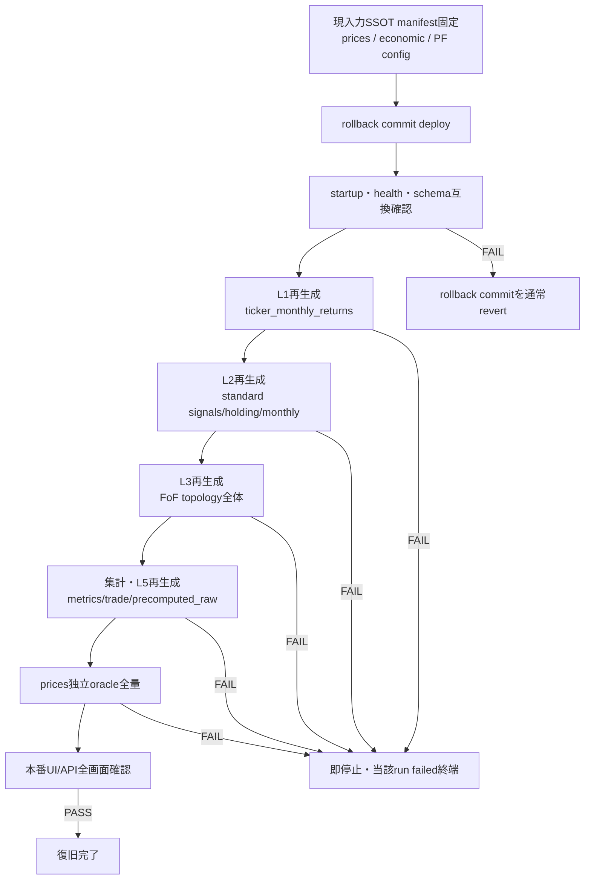

<!-- gist-master: 0c98ab3686bcaff3aa1ddd36e1a53570 dm-production-code-rollback-plan_20260813.md -->
# DM-Signal本番コードロールバック設計 v1.3
<!-- semantic-links: [[recalculate_pipeline]] [[production_parity]] [[code_rollback]] -->

- 作成: 2026-08-13 01:22 JST
- 発端: 殿裁定「新しいロールバック案が出た以上、前提条件が変わった。以前の前提下での判断は全てゼロに戻る」
- 目的: 正常だった時点の**コード**へ本番を戻し、入力SSOTから派生データを全再生成し、ticker `prices`を起点とする独立oracleと本番画面で正常性を証明する
- 旧文書: `dm-production-recovery-v3_20260813.md`は旧L5局所修復laneの歴史記録として凍結する。本書へ旧工程・旧PASS・旧ACを継承しない

## §0. 前提リセット

1. run316のL2/L3成功、L5 warm-context、R1-R5、旧四点一致、旧canary結果は本計画のPASS証拠に使わない。
2. `21e80e30`は採用済みSHAではなく、一次証拠で選定する候補の一つへ戻す。
3. 現在の派生DB値はバグコードの出力であり、正解・比較baseline・保存対象にしない。
4. ロールバックとはgit履歴の巻戻しではない。現main上へ「選定baselineとruntime treeが一致する復帰commit」を積み、通常push/deployする。force push/resetは使わない。
5. 判定は旧本番値とのparityではなく、入力SSOTから独立導出した期待値と本番UIの機能契約で行う。

## §1. 現在確認済みの事実（判断ではない）

| 事実 | 一次証拠 |
|---|---|
| 現main | `7003cf69b3817841bfb77ea27968a5646ed838c6`（2026-08-12 23:45 JST） |
| 候補A | `9a27eb4fd5a74fa5bfd2bb96422d2557bb3191f0`（2026-08-03 21:25 JST） |
| 候補B | `21e80e30957d61f5bdfb9ea04bf99b63dda2cfc9`（2026-08-04 00:51 JST、fresh Monthly Trade data保持） |
| 候補Bのdeploy事実 | 8/4には未deploy。2026-08-09 00:21 JSTの`10764603`一括deployで初めて本番へ含まれ、2026-08-10 02:39 JSTまで正常表示継続 |
| A→B間 | current month表示、ledger境界、FoF holding date、stale holding拒否、fresh data保持の7 commit |
| B→現main runtime差分 | backend/frontend/API/jobs/services等に多数あり。baseline選定前に全runtime manifestを確定する |
| B以後のDB migration追加 | `migrations.py`差分中の`ADD COLUMN`/`CREATE TABLE`は0件。ただし起動互換は実起動で判定する |
| 現本番Monthly Trade | standardは履歴あり、FoF 78/78は履歴1行・ticker Price Return 0 |
| prices独立検算済み範囲 | standard 24 PF・4,713確定月。不一致4件。FoF 78 PFは未検算 |
| 既知のbaseline内候補バグ | `fda736295`は候補Bのancestor。全期間metrics初月0%化が残る可能性あり |

## §2. SSOT・維持・再生成の境界

### 維持するもの

- 市場入力: `prices`、economic inputsとその取得条件
- ユーザー定義: portfolio本体、構成、parameter/config、公開設定、認証・viewer設定
- 歴史証跡: `recalculation_status`、`recalculation_timings`、deploy/commit/run log。過去行を削除・書換えない

### 正常コードから再生成するもの

- L1派生: `ticker_monthly_returns`
- L2/L3派生: signals、holding/ledger、standard/FoF `monthly_returns`
- 集計派生: metrics、risk、rolling、annual、drawdown、trade performance
- 配信cache: `precomputed_raw`、MTD/cache派生物

### 境界の二値確認

- 維持対象table/column manifestがN/N列挙され、派生tableとの重複0。
- portfolio/config件数・ID・内容hashは再生成前後で不変。
- `prices`の件数、min/max date、ticker別hashは再生成前後で不変。
- 歴史台帳の既存行更新0。新runは新規行のみ。

## §3. rollback先の決定

**決定: `21e80e30957d61f5bdfb9ea04bf99b63dda2cfc9`（2026-08-04 00:51:40 JST）へコードrollbackする。**

理由:

1. `9a27eb4f`後に必要となったMonthly Tradeの当月表示・FoF holding日・stale holding拒否・fresh data保持を全て含む。
2. `21e80e30`は8/4には未deployだったが、2026-08-09 00:21 JSTの`10764603`一括deployで初めて本番へ含まれ、2026-08-10 02:39 JSTまで正常表示が継続した。8/4静穏期のCDP証跡の直接帰属SHAは`28b58ee0`であり、`21e80e30`へ誤帰属させない。
3. 直後から2026-08-08 23:59:08の`bf4ed6a6`直前までproduction runtime変更は0件。次のruntime変更はL5自動queue新設であり、正常期と新パイプライン改変期の境界が明確。
4. `9a27eb4f`へ戻すと、その後に発覚・修正したMonthly Trade不具合を再導入するため早すぎる。

### 前後3 commit（production runtime変更commitの時系列）

「前後」はdocs/研究のみのcommitを除外し、backend/frontend/renderの本番runtimeを変更したcommitで定義する。時刻はcommit timestamp（JST）。

| 相対 | timestamp (JST) | SHA | 変更内容 |
|---:|---|---|---|
| -3 | 2026-08-03 23:54:43 | `07b1360135b95efe00560de3f581287dc37544b4` | Monthly Trade simple表示でもMonth列を隠さず、当月行を常に識別可能にした。runtime差分=`monthly-trade-table.tsx` +4/-2 |
| -2 | 2026-08-04 00:32:38 | `28b58ee05c4ebc9e9640fd34ce4b2c3c15006cce` | FoF表示holdingの検索順を`position_start_date`優先へ変更し、Dashboardと同じ営業日holdingへ揃えた。`monthly_trade.py` +21/-6 |
| -1 | 2026-08-04 00:42:27 | `9f09b1286cab17937c7d28ec3d70a7803fb0fe89` | Monthly Trade holdingがDashboard signalと不一致ならstale payloadを拒否し、fresh再取得するようにした。`page.tsx` +40/-7 |
| **0** | **2026-08-04 00:51:40** | **`21e80e30957d61f5bdfb9ea04bf99b63dda2cfc9`** | **fresh Monthly Trade data自体は保持し、holding不一致時はSignals側をfresh更新するよう修正。正常復帰点。** `page.tsx`/`signals-context.tsx` +38/-12 |
| +1 | 2026-08-08 23:59:08 | `bf4ed6a61e0e863a3fbed745e78c1a7b96772a10` | cache invalidation後にL5再生成を自動enqueueするsingle-flight queueを新設。API/Session after_commit/新queue workerを導入。+147/-5 |
| +2 | 2026-08-09 00:00:11 | `16b62fca3ac020962dd484181d65162c77e52578` | queue worker `_run_once`の戻り値型を`None`から`bool`へ訂正。+1/-1 |
| +3 | 2026-08-09 00:15:58 | `337e47a1ce79028fb6d04a5beb1c27c2713181b7` | L3完了・admin L5入口・cache invalidationを新queueへ接続する変更を別系統へ再適用。+31/-5 |

境界の意味: `21e80e30`まではMonthly Tradeの表示・holding整合修正。次のruntime commitからL5生成の起動・invalidate・queue所有権を変える新設計へ移行する。よって`21e80e30`が「必要な画面修正を保持し、新L5改変を一切含めない最新点」である。

## §4. rollback commitの構築

1. `origin/main`から専用隔離worktree/branchを作る。
2. production runtime closureを明示manifest化する。対象はbackend runtime、frontend runtime、起動・依存・deploy設定。docs、分析成果、運用台帳は対象外。
3. manifest各pathを選定baselineのblobへ置換する。広域restore/resetを使わず、対象pathを明示する。
4. `git diff --name-status`で変更対象N件=N件、manifest外runtime差分0、削除/追加の意図不明0を確認する。
5. rollback commitは1 commitとし、本文に`current SHA`、`baseline SHA`、runtime manifest hash、revert手順を記録する。
6. rollback前の現main commitは消さない。失敗時はrollback commitを通常revertして復元する。

## §5. deploy前検証

- backend import/startup PASS、migration dry-run PASS、frontend production build PASS、SKIP 0。
- baseline選定実験5項目をrollback commitへ再実行し、候補worktreeとの差分0。
- 現PF/configを読み込む起動互換テストPASS。未知fieldはsilent dropせず0件または明示FAIL。
- DB書込みを伴う試験は本番で行わず、一時DB/隔離schemaで派生再生成順序を1周する。
- deploy対象commit、revert commit手順、Render対象serviceを固定する。

## §6. 本番実行順序

- 層は直列実行し、各層のterminalと成果物を確認してから次へ進む。
- 再生成window中は既存cron（01:10 L2／01:40 L3／02:00 L5 fallback）の発火と混線させない。実行時にcron抑止状態または各runの識別方法を記録する。
- FAIL時に後続層を実行しない。旧派生値へfallbackしない。
- 本番が既に壊れているため、本番実データでの検証を正式工程とする。ただし入力SSOTと歴史台帳は不変に保つ。

## §7. 独立oracle

**RB6の平易な説明（殿説明用・2026-08-13追記）**: RB6「prices独立oracle全量」とは、**アプリの計算コードを一切使わず、生の株価（`prices`=入力SSOT、今回の障害で一度も汚れていない）だけから答えを独立に作り直し、本番の全数値と突き合わせる全量検算**である。「failed 0で完走した」は「エラーが出なかった」の証明にすぎず「数値が正しい」の証明ではない。計算を書いたのと同じコードで検算しても同じバグは同じ間違いを再現するため、独立した採点者（oracle）が要る。全102PF・全確定月で不一致0を確認して初めて数値正当性が証明され、RB7（本番画面確認）へ進める。「全量」=代表サンプルではなく全PF・全月（パラメータ空間縮小禁止）。8/10実績: standard 24PFのみ実施し4,713確定月中4件の不一致を検出（FoF未検算）。今回はstandard+FoF+metricsの全てを対象とする。

### standard

全PF・全確定月について、portfolio構成/実保有と`prices`の実開始・終了価格からopen/close returnを独立計算する。アプリの`monthly_return`、累積値、Price Return payloadをoracle入力に使わない。

### FoF

アプリの被疑`expand_portfolio_to_tickers`結果を使わない。portfolio構成表を直接読み、nested PFを再帰展開して最終ticker weightを独立導出し、`prices`へ結合する。cycle、欠損weight、weight sum不一致はFAILとする。

### metrics

独立月次列からtotal return/CAGR/年率平均/volatility/Sharpe/Sortino/MaxDDを直接算出する。初月を0へ置換しない。候補baseline自体にmetrics不一致があれば、rollback成功とは別にせず、最小修正を積んで再び本節全量を通す。

## §8. 本番復旧AC

1. 選定baseline SHAとruntime manifest hashが一意に記録され、production runtime treeの一致率N/N。
2. 入力SSOT不変: prices/PF/configの件数・ID・内容hash不一致0。歴史台帳の既存行更新0。
3. L1→L2→L3→L5が全対象を処理し、ERROR 0、failed 0、SKIP 0、旧派生fallback 0。
4. Monthly Tradeはstandard/FoF全PFでrequested historyを返し、確定月ticker Price Return欠損0、当月行欠損0。
5. 全102 PF・全確定月でopen/close monthly returnのprices独立oracle不一致0。
6. 全102 PFの全期間metricsが独立月次列からの算出値と不一致0。
7. `precomputed_raw` orphan 0、obsolete hash 0、global duplicate 0、expected key欠損0。
8. 本番API/UIのDashboard、Signals、Monthly Returns、Monthly Trade、Metrics、Drawdowns、Compareで欠損0・例外0。
9. AC1-8を同一deploy/run世代で満たした時だけ復旧完了とする。

## §9. 新工程表

| # | 工程 | 二値出口 | 状態 |
|---|---|---|---|
| RB1 | rollback先決定 | `21e80e30`、前後3 runtime commitと境界を記録 | **完了** |
| RB2 | runtime closure manifest作成 | 対象N/N、manifest外runtime差分0 | **完了** |
| RB3 | rollback commit構築 | tree一致N/N、build/startup PASS、SKIP 0 | **完了**（`233c2303`） |
| RB4 | 本番deploy | live SHA一致、health/schema互換PASS | **完了** |
| RB5 | 入力SSOT固定・派生全再生成 | L1→L5全対象、failed 0 | **完了**（2026-08-13 12:10 JST: `precompute_raw completed: rows=1533 portfolios=102 failed=0 elapsed=436.51s`、API永続status `last_error=null rows_processed=1533`。経路: 先頭NULL両経路修正`9b881979`/`5c0af039`＋valid_start境界holding seed修正`071f2ca4`→L1再生成4,795行→24PF L3再生成→rolling欠損0→L5再走） |
| RB6 | prices独立oracle全量 | monthly/metrics不一致0 | 未着手 |
| RB7 | 本番API/UI確認 | 8画面欠損0・例外0 | 未着手 |
| RB8 | 最終checkpoint | §8 AC1-8全PASS | 未着手 |

### §9.1 実行記録と残件（2026-08-13 03:55時点）

**実行記録（一次証拠付き）**:

1. 殿裁可 01:47「では本番をロールバックしよう。ロールバックしたらfullrecalculateしよう」→ 即実行。
2. rollback commit `233c2303`（`rollback(dm-signal): restore production tree to 21e80e30`）をorigin/mainへpush、退避branch `archive/pre-rollback-20260813-0148-7003cf69` を作成（revert経路確保）。
3. 本番deploy後、fullrecalculate実行。走行中に`SIGNAL CHANGE ALERT count=9343 portfolios=50 dates=2011-08-31〜2026-08-11`が発報 → **正当変化と判定**（旧値=バグコード出力への書戻し差分。ALERT機構自体もrollbackで復活した撤去前機構であり異常ではない。03:06殿へ言上済み）。
4. L5終端: `precompute_raw completed: rows=1173 portfolios=102 failed=24 elapsed=624.79s`。failed 24件は全てstandard PF。
5. 原因確定: standard 24 PFの系列先頭行がholding_signal NULLかつmonthly_return=0（本番readonly再集計 `(24, 24, 24)`、将軍が独立確認）。baseline `21e80e30`に含まれる8/3 fail-visible化（`3efd01e0` performance.py全NULL例外化）と「保有確立前leading NULL=正常」（`85a15e50`）の契約不整合。Aug 2 backupにも先頭NULLがあり、rollbackが壊したのではなくbaseline内在の不整合。

**残件**:

1. **L5先頭NULL最小修正**（家老実装中・将軍承認済み・殿裁定03:46「シンプルな対応がベスト」準拠）: 既存raise箇所に「系列先頭からの連続NULL（保有確立前）はスキップ」の最小分岐のみ追加。確立後NULLはraise維持。追加fixtureは境界1本のみ。追加機構（ヘルパー集約・ログ機構等）は作らない。二値AC: L5 102/102・failed 0・Unknown出力0・確立後NULL fixtureはraise。
2. ~~修正deploy→L5再走でRB5のfailed 0を確認~~ **完了**（12:10 JST failed 0）。
3. **TIMING SUMMARY復元完了**（2026-08-13 13:15 JST）: rollback前実績4 commit（`365e1c8f`→`20a26556`→`695933d3`→`88d38b77`）の最終形を忠実復元（復元commit `15e612f9`、計測・ログ・testのみ、業務計算式変更ゼロ）。canary 5PF hash一致5/5・ERROR 0（run `2026081303593369C961`）→full本走（run `2026081304021264BB4C`）completed・failed 0・TIMING SUMMARY出力復活（`L2=2m5s L3=4m21s L5=41.3s unaccounted=38.0s TOTAL=7m45s`）。SIGNAL CHANGE ALERT 5,890件/39PFはFoFのみ・standard 0=holding seed修正の波及書戻しで正当（ALERT機構自体はbaseline残存機構）。
4. 残: RB6（prices独立oracle全量）→RB7（8画面確認）→RB8（§8 AC1-8同一世代PASS）。全数数値正当性の最終GATEはRB6完了まで未CLEAR。

## §10. 改訂履歴

- v1.3 (2026-08-13 03:55): 実行実績を反映。RB2-RB4完了（rollback commit `233c2303`・退避branch記録）、RB5部分完了（L5 standard 24 PF failed=先頭NULL契約不整合、本番readonly再集計 `(24,24,24)`）、SIGNAL CHANGE ALERT 9343件=正当書戻しの判定、残件（先頭連続NULLスキップの最小修正=殿裁定03:46シンプル対応準拠）を§9.1へ追記。
- v1.2 (2026-08-13 01:40): 将軍レビューを反映。`bf4ed6a6`境界時刻を1秒訂正、full再生成中のcron混線防止を追記。Render deploys API一次結果により、8/4 CDP証跡の直接帰属を`28b58ee0`へ訂正し、`21e80e30`は8/9 00:21一括deployで初live・8/10 02:39まで正常表示継続と記録。
- v1.1 (2026-08-13 01:25): rollback先を`21e80e30`へ決定。production runtime基準の前後3 commitをtimestamp・変更内容付きで固定し、Monthly Trade修正完了点とL5 queue新設開始点の境界を明文化。
- v1.0 (2026-08-13 01:22): 新前提に基づくロールバック専用設計を新規作成。旧L5局所修復laneの全判断を失効し、baseline選定→runtime復帰commit→派生全再生成→prices独立oracle→本番UI確認の新工程へ再構築。
