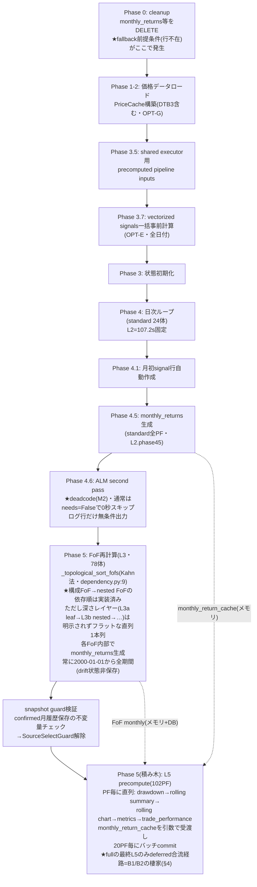
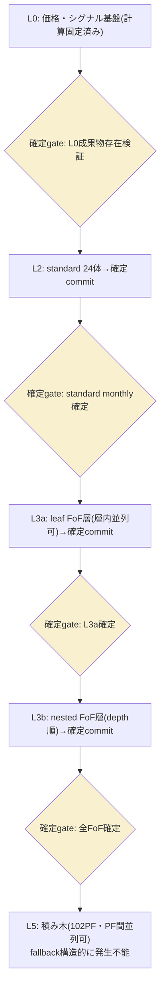
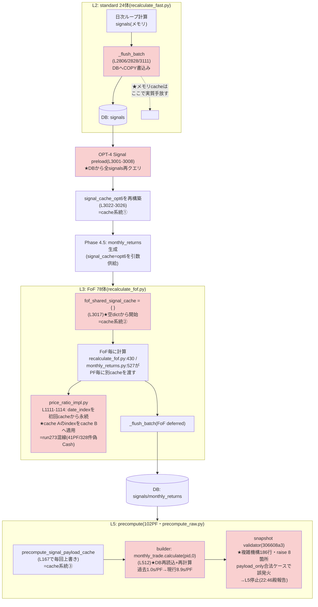
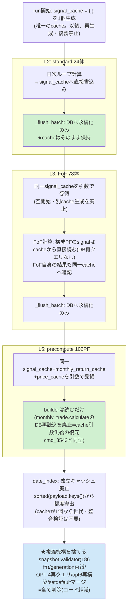

<!-- gist-master: 2d1e7458976b45751cebbffd8c118fa3 dm-production-issues-asis-tobe-5w1h_20260810.md -->
# DM-Signal本番問題群 補填設計書 — AsIs/ToBe/5W1H v2.0

- 作成: 2026-08-10 14:16 JST(将軍直轄) / v2.0再構築: 2026-08-11 15:55(殿指示「覚醒して再構築せよ」)
- 位置づけ: 月次リターン基本原理設計書v6.13の**補填**。v6本文は変更しない。本番問題群の修復レーンの正本
- 再構築方針: **現在有効な工程・裁定・在庫を前面**に置き、完了済み経過は§8歴史へ圧縮(情報は削らず参照で残す=リンク先なき圧縮禁止)

## §1. 現在地(2026-08-12 00:10)

**主戦線=cache一本化(§10.1 T0-T8)。本番普及に向けfullバグなし完走が第一目標(殿下知00:01)。fullは封印中(T7 PASSが解除材料)。**

| レーン | 状態 |
|---|---|
| 本番コード | revert版(dep-d9t9kp9s系)+hotfix便多数Live(KeyError群b3146fc9/f645d92b・snapshot integrity 306608a3=c83e350dでLive) |
| 偽Cash機構 | **3経路特定済み**: ①run273=cache混線(date_index別cache適用) ②run274復元失敗=汚染子depth1-2引継ぎ ③run275=**範囲契約不一致**(部分runの短snapshot 1,535行をL3全期間計算が完全cacheとして再利用→fail-openで500行Cash化。00:06家老二段掘りで確定) |
| canary | run274/275とも**FAIL・停止中**(遮断弁機能)。再発進条件=T0根治Live後、同一5PFでCash差分0+valid_start正常+I1-I5適合 |
| cache一本化 | §10.1タスクリストT0-T8が工程正本。T2-T6は家老が隔離WTで4commit分離実装済み(I1-I5適合検分が持込条件) |
| full封印 | **殿裁定12:41維持**。解除材料=T7 canary PASS+B1/B2再現ゼロ |
| M4-M10(表示欠損) | M10=deploy済み本番API検証PASS(欠落7→0)・M9=実装done・M4/M5/M7=done deploy待ち・M6=B3修正済み+FoF再生成run待ち → §5台帳 |
| SIGNAL CHANGE突合 | 累計2,576件を最終checkpoint台帳へ積載(殿裁定02:48維持) → §7 |
| 依存マップ | cmd_4294完了(gist 4bb22f90+将軍まとめb6a70eb3)。cmd_4295(項目単位SSOT監査)走行中 → §10.1参考資料 |

## §2. 現行有効の殿裁定(上書き済みのものは除外)

| 時刻 | 裁定 | 効力 |
|---|---|---|
| 08-10 21:17-21:29 | **S5.6回転プロトコル**: 計算速度レーンが全レーン先頭。家老がハブ(検証ループを手から離さない)、忍者=非同期修正工場、定刻発車(完成分だけ載せる)、1周ごとに数値1行報告 | 恒久(instructions/karo.md L148-176焼込済) |
| 08-10 21:41/21:43 | ログのリアルタイム監視禁止(完了時1回確認)。1体の数字で全PF線形外挿禁止(キャッシュでPFが増えるほど加速) | 恒久 |
| 08-11 02:48 | **理論ベース**: 改良途中の正否調査は手戻りで無駄。全量突合(102PF vs run232 baseline)は改良完遂後の最終checkpointで一回のみ | 恒久 |
| 08-11 04:59 | **ToBe(層確定カスケード)は保留**。AsIs枠組みでfullrecalculate **300秒切り**が当面目標。ToBe着手は殿の明示下知のみ | 現行 |
| 08-11 12:38-12:43 | 最速は健全SHAへの**即revert**。revertは本番deployまで完遂し一次確認3点(Live SHA一致/health/重複停止)必須 | 実行済み |
| 08-11 12:41 | 工程=①即revert→②1/5/10PF段階再現→③発火条件を絞って根治。**確信が立つまでfullをやらない** | 現行(①②完了・③走行中) |
| 08-11 13:16 | Codex CLI忍者のCTX高使用率は懸念不要(auto compactが早い)。Claude CLIとCodex CLIは違う | 恒久 |
| 08-11 15:30 | **バグの原因は「fullと部分runの経路差分」にある**。検証は部分runでなくfull固有経路(deferred合流)の発火条件で行う | 現行(B1/B2検証の規範) |
| 08-10 19:43/19:57 | **UI統治**: UI/UXは殿専権・忍者判断のUI変更禁止。裁定板artifact(e9e784ab)で殿がfix→裁定原文をACへ引用したtaskのみ実装可 | 恒久 → §6 |
| 08-11 01:18 | benchmark(SPY等)もOtO/CtCトグル追従。benchmark drawdown_open欠落は正常ではなくバグ | 恒久(M5の仕様根拠) |
| 08-11 22:54 | **シンプル・既存再利用・新規コード最小が速さとバグ修正容易さを生む**(validator誤発火への裁定) | 恒久(knowledge:e8ea9347) |
| 08-11 22:55 | **L2/L3をキャッシュ化→L5はそのキャッシュを使う。この流れの齟齬が根源。キャッシュフル利用で複雑コード無しに速度大幅向上** | 恒久(§10の設計根拠・knowledge:4469e4c4) |
| 08-11 22:57 | **複雑なコードは修正するな。シンプルなコードを追加して複雑なコードを捨てろ**(rewrite-and-discard) | 恒久(T6の根拠・knowledge:1ab7ec6e) |
| 08-11 23:19 | **L3カスケード不採用。現状のL3(トポロジカル直列)は当面このまま。cache一本化(§10-ToBe)だけに集中** | 現行(§10.1が工程正本) |
| 08-11 23:21-24 | **不変契約**: UI/UX不変・log出力スタイル不変・速度非退行・完全性(FE全データ充足)。前々回の大修整の再発防止・最短一発クリア | 恒久(§10.1 I1-I5) |
| 08-12 00:01 | **本番普及を目指しfullrecalculateをバグなく計算できるようにする**が第一目標 | 現行(工程=§10.1) |
| 08-12 01:27 | **L2を磨く** — L5はcache効果で既に高速化済み、支配項はL2側。L2磨き便をT3.5後・T4前に挿入(標的=trade_perf 29.2s→standard 27.45s→残余約25s。過去のL2単独最速値を回復目標に特定) | 現行(§10.1 T3.6) |

## §3. 速度: 300秒切りへの現在値

- **確実な実測床**: 552秒(run id=254・JST07:20・静穏条件・現revert版と同一tree)。300秒まで**あと約250秒**。
- 833秒run(id=255)は不採用 — 家老帰属検分(12:22): browser 655リクエスト+cold precompute重複3本の併走環境であり同条件比較不能。全層同時悪化(+49/+143/+45/+35秒)=commit単独回帰と不整合。
- **支配項=L3(FoF 78体・直列・前回実測304秒=55%)**。次点L2=102-151秒(固定)、L5=60秒目標(1/5/10PF実測でwarm時1PF 2.3-9.1秒級・増分逓減3.6秒/PF)。
- 巻き戻したL3改良群(deferred flush 132s短縮等)は、B1/B2根治後に**1commitずつ再適用→10PF検証→次**で積み直す(§4の根治が前提)。
- 1体基準値(08-10深夜実測): L2=10.7s / L3=8.92s(leaf FoF) / L5=1.4-5.65s。

## §4. B1/B2: full固有のL5合流バグ(15:27ログ一次証明済み)

**殿原則(15:30)**: 1/5/10PFで起きずfullでだけ起きる — **差分に原因がある**。差分は特定済み: 部分run=L5をinline実行(バグの通り道なし)、full=最終L5だけがdeferred合流経路を通る。

| # | 症状 | 証明(run 20260811054947D282ED) | 原因分岐 |
|---|---|---|---|
| B1 早期完了 | summaryがTOTAL 9m20sで閉じるがL5はその後も24/102→102/102と15分継続(L5行なしのsummary) | 05:59:08 summary vs 06:14:46 L5_COMPLETE(elapsed 1411s) | 本体最終L5が既存cross-process lockへ合流(raw_precompute_deferred)する際、合流generationを**awaitせずsummary/statusを閉じる** |
| B2 直列重複 | 第一世代完了直後に同一all-scope第二世代の全量L5を開始 | 06:14:46 "request arrived during generation=1; draining next generation" | _drain_queueが完了scope=None(all)で実行中到着要求を**充足済み判定せず**次generationへ残す |

- **B4 失敗握り潰し(00:57 run277で実証・新規在庫)**: standard 0/1失敗(ValueError)でもrecalculation_statusは`completed`/error_message=NULLで閉じる — 層内失敗がrun statusへ伝播しない。B1(summary早期完了)と同族の「完了判定がL5/層の実結果を見ない」構造。修正はT2-T6完了後の別便(検知はSIGNAL CHANGE ALERT+P4_TIMING_ERRORログが暫定カバー)。
- 対照(健全形): 10PF run 20260811045510はinline L5→L5_COMPLETE→L5行付きsummaryの正順。
- **修正**: cmd_karo_hotfix_full_l5_join_await(才蔵)実装done。coalescing+advisory lock+cross-process single-flight(b0e7e85f, bc7a0cc3)も影丸が実装済み。
- **検証規範(殿原則15:30の適用)**: 部分runのPASSは経路を通らないだけで証明にならない(LS-A24)。deferred合流経路が実際に発火する条件(実行中lock保持状態でall-scope要求投入の最小fixture、またはfull)でB1/B2消滅を二値確認。**この再現ゼロ=full解禁の条件**。
- 副次効果: 833秒回帰の「併走負荷」の正体もB2の疑いが強く、根治で計測の静穏条件も安定する。

## §5. M4-M8: 表示欠損・不整合の掃討(進捗正本=本表。更新は将軍)

**共通仮説**: revert後の部分再計算による生成物の欠損・汚染。クローズ条件(各件)=原因特定→修正→deploy→**殿の画面で表示正常確認**の4段。

| # | 症状 | 状態(15:45) | 担当/task | 根因(判明分) |
|---|---|---|---|---|
| M4 | Compare Summary: Up/Down Cap非表示 | **実装done・レビュー/deploy待ち** | 影丸/display_missing_m4_m7_202608111342 | up_capture実装はHEAD現存(8月以降変更0件)→データ/生成系 |
| M5 | Drawdown: SPY(ベンチ)%非表示 | **実装完了・deploy待ち**(AC2=deploy後検証のみ残) | 小太郎/m5_benchmark_drawdown_202608111348 | SPYのOPEN系列0/2欠落→cache key benchmark-open-v1で是正(commit 6dfa8265・tests 6/6) |
| M6 | monthly trade: FoFの8月以前非表示(standardは表示あり) | **未解消(殿再観測17:13)** — B3修正で拒否は止まっても過去に拒否され保存されなかった履歴は**再生成runまで戻らない**。手順: B3 Live確認→FoF代表PFのAPI機械確認→FoFスコープのmonthly_trade再生成で充填→殿画面確認(家老へ指示済みmsg_171419) | 疾風/m6+才蔵/B3+再生成run | **B3(下記)が真因候補**: validatorが正常履歴を誤拒否→保存されず表示欠損。直近30分の拒否ログ0件(17:14将軍実測) |
| (新)B3 validator完全性判定バグ | monthly_trade完全性判定が複数PFのL5 raw更新を誤拒否(IncompletePortfolioRaw) | **hotfix配備済み(16:15)** — 本番full同時検証で発見。builderは長期履歴を返すがvalidatorがtop-level entries数を要求履歴件数と誤比較。fullは継続し横断証拠収集中 | 才蔵(payload形状+limit単位の一次確認→真の欠損だけ拒否する修正) | validator比較単位の誤り(entries数≠履歴件数) |
| M9 dashboard MTD 8/10確定様表示 | 未確定の8/10がpreliminaryマーカー(薄色+⚡+脚注)なしで確定様に表示 | **実装done(17:39 commit b0e13e94)・レビュー/deploy待ち** — 根因確定: M8修正(4db556f7)が同日速報行を捨てる副作用。共通helperで衝突行を速報行へ置換(serial/batch両経路)。fixture実測: rows=2/duplicate 0/8-10 preliminary=true/8-07 confirmed=true。テスト7/7+21/21+14/14。FE変更なし | 飛猿/m9_preliminary_202608111739 | M8修正の副作用+BE判定欠落 |
| M10 monthly return: ticker別8月リターンが一部のみ表示 | 全tickerの8月リターンが表示されるべき | **deploy済み・本番API検証PASS(20:10便)** — Live SHA=9e615606。Ave-X 24ヶ月APIで**CLOSE 10/10・OPEN 10/10、MISSING 0・EXTRA 0**(欠落7→0)。health 200・ERROR窓なし。残=殿画面確認のみ | 影丸round2(done)+deploy便 | partial-artifact修正が本番応答へ届かない境界を根治(round2) |
| (関連)ledger 94件unrecoverable | full後のinitial ledger insertionで全件unrecoverable | **修正deploy済み(bb3d8527・20:10便)** — 本番値の確認は次回fullでunrecoverable=0を二値検証 | 小太郎root(done) | fullとN-PFの差分に起因 |
| M7 | monthly trade: 8月リターン/price movement非表示 | **実装done・レビュー/deploy待ち** | 半蔵/m7_current_mtd_202608111348 | 当月行データ欠損(MTD expansion cache系) |
| M8 | dashboard: MTD Daily Returns 8/10重複表示 | **実装done・レビュー/deploy待ち** | 飛猿/m8_mtd_duplicate_202608111348 | precompute重複起動期間の二重INSERT残骸の疑い(B2と接続) |

### 未着手の改善候補(実装は別途下知待ち)

| # | 件名 | 要点 |
|---|---|---|
| M1 | pending表示の意味論乖離 | pending=当月リターン未確定の意。保有シグナルは確定 — 表示範囲の限定をUI裁定板で殿がfix(02:39) |
| M2 | ALM deadcode残存 | ディスコン後もrecalculate_fast.pyに一式残存。`Phase 4.6: Start ALM second pass`ログは無条件マーカー(実行時のみ`[ALM] Starting…`)。除去はPhase 2候補cache計算も消しL3高速化に寄与(03:37) |
| M3 | SIGNAL CHANGE CRITICALログ冗長 | 同一(pf,date)反復CRITICALは情報量ゼロ。実害実証13:00(ログ窓400行が埋没)。初回のみCRITICAL/サマリ化へ降格。P4ログ契約レーン(03:40) |

## §6. UI統治と裁定済みUI(恒久規範)

- **統治ルール(殿裁定19:43)**: UI/UXは殿専権。無裁可変更は棚卸し→裁定板artifact(https://claude.ai/code/artifact/e9e784ab-f4e7-47a3-96e3-e9174c07ebcc)で殿がfix→裁定原文をACへ直接引用したtaskのみ実装可。
- 裁定6件(19:57): UI-1「✓確定」ラベル削除 / UI-2 保有カード削除 / UI-3 FoF monthly trade非表示=バグ(→M6へ発展) / UI-4 正仕様=8月初回取引日終了後の再計算で全confirmed / UI-5 SPY drawdown=バグ+01:18仕様(benchmarkもOtO/CtCトグル追従)(→M5へ発展) / UI-6 棚卸し続行。
- 08-11 11:57裁定: Monthly Returns当月行の「暫定(as_of)」注記削除+文字色を他行と同一に(小太郎実装済みレーン)。
- 実装規律: 既存を厳密踏襲し指示された最小差分のみ(LS104)。変更前後の表示突合+回帰FAIL0。

## §7. SIGNAL CHANGE突合台帳(最終checkpoint行き)

殿裁定02:48により途中の正否調査は禁止。改良完遂後に全102PF vs backup/run232 baselineの全量突合を一回だけ実施。

| 時刻 | 件数 | 帰属(理論ベース) |
|---|---|---|
| 08-10 13:38 | 562件/32PF | γ4是正由来(P2系) |
| 08-11 02:29 | 86件/7PF | L3/L5改良run由来 |
| 08-11 03:59 | 111件/1PF | 同上 |
| 08-11 10:51 | 4件/2PF | 同上(収束傾向) |
| 08-11 12:53 | 707件/2PF | **revert版による改良期署名の旧値書き戻し(逆流)** |
| 08-11 13:27 | 246件/2PF | 同逆流 |
| 08-11 14:59 | 32件/2PF | 同逆流(707→246→32と逓減=収束末期) |
| 08-11 21:36 | 328件/41PF | **run273 cache混線=当月誤Cash化(帰属確定済み・T8復旧対象)** |
| 08-11 23:31 | 500件/1PF(2014-04〜2016-03) | **帰属確定→根因更新(00:06 blt_000657)**: run275=家老5PF canary。当初「混線型」と推定したが二段掘りで**範囲契約不一致**と確定 — 5FoF指定runはstandard=0のためL2既定252日の短snapshot(1,535行)を作り、L3全期間計算(要25,346行)がそれを完全cacheとして再利用→fail-openで500行Cash化。canary=FAIL・停止済み。根治=T0 |
| 08-12 00:27 | 594件/4PF(2011-07〜2016-03) | **帰属確定(run276終報00:29): T0検証runによる誤Cash復元。594件全てold=Cash→new=実銘柄(new_cash=0/matches_new=594)。run275の500行も解消。DRIFT遮断維持のまま台帳一致方向で成立=正常な復元** |
| **累計** | **3,170件** | 突合は最終checkpoint一回のみ |

## §8. 歴史(完了・上書き済みの経過。詳細は改訂履歴の各版とgit履歴参照)

- **P1速度回帰(51分事案)**: dataframe_prep 730倍回帰特定(cmd_4293)→nav_frame_cache修正(fdbf3022)→S5.6回転プロトコル→S5.7工程(L0/L1確定→L2固定107.2s→L3/L5二正面)→改良多数(fallback根絶198fc455・L5 builder None 3件根治・cache計装・L3a leaf-scope修正)→**08-11昼にL3改良群を含むtreeで回帰疑い→殿裁定で実績SHAへrevert(12:45)**。改良はB1/B2根治後に1commitずつ再適用する(§3)。
- **fallback根絶の経緯**: 病態=monthly行参照のcacheキー(as_of成分)不一致で常時miss→動的再計算157回/11.3s。順序仮説・下層データ不在仮説はコード現物で棄却(monthly生成→trade_perfの順序は元から正、トポロジカル順も実装済み=P6-AsIs図)。キー経路修正で本番n=0実測。
- **P2 γ5 cutover**: 影丸partition確定(562件全てγ4 replay範囲外)→半蔵が頭打ち原因確定(config_max=2026-07-02)→config延伸replay→**cutover・本番write停止維持のまま本レーンは中断中**(高速回転レーン優先の殿裁定)。再開時はbackup4点(manifest実パス/DB同一性/cutoff/restore rehearsal)必須。
- **v6設計書の検討不足知見(K1-K7)**: 過渡期FE表示の契約欠落/alert期待集合の事前契約欠落/速度予算欠落/UI状態表示仕様欠落/表示粒度仕様欠落/検証がバグ経路を実行する保証の欠落/CI性能回帰検知欠落。共通構造=「計算の正しさ」は完備だが**運用面(時間・過渡状態・表示・alert対応)を設計対象から落とした**。次の設計書は「殿がその日どの画面を見て何を確認できるか」を第一級対象にする。還流先=軍師SGレビュー観点(起票は殿下知後)。
- 軍師レビュー10件(v0.3)は全件反映済み。

## §9. P6. fullrecalculate計算順序フロー(現役参照図)

### P6-AsIs: 現行フロー(コード現物・2026-08-11 main)

読み取れた事実: (1)monthly保存→trade_performanceの順序は元から正 (2)構成FoF先行も実装済み (3)fallback真因は順序でなくキー不一致(根治済み) (4)深さレイヤーの明示不在=層内並列・L3a/L3b分割実行の構造化余地 (5)最適化候補: ALM除去(M2)/FoF drift状態保存/L5並列化/FoF層内並列。

### P6-ToBe: 層確定カスケード(殿提案04:47・**保留中=殿裁定04:59**)

各層完了時に成果物を確定commitし、上層は確定済み下層のみ参照(確定gate・fail-fast)。fallbackは発生条件ごと根絶しERROR検知器へ転換。層単位検証・層内並列・部分再計算が同一構造から出る。中間段=「深さ順グルーピング」(結果不変・低リスク)も検討済み。段階着手時の第一歩は最下層でなく**最重量層(L3a層内並列)**から(偽陰性回避)。見込み: N=4並列で約200s、N=8で約150s(vCPU実数が上限・要確認)。

## §10. キャッシュの流れ AsIs/ToBe(殿指示22:59・細粒度。殿裁定22:54-22:57「シンプル・再利用・新規コード最小」「複雑は修正せず、シンプルを追加して複雑を捨てる」の実装設計)

### §10-AsIs: cacheがflush境界で切れ、3系統再構築される(コード現物・行番号は2026-08-11 main)

齟齬の核心: **L2はcacheをDBへflushして手放し、L3/L5がDBから読み戻して別のcacheを作り直す**。同一データのcacheが3系統(opt6版/fof_shared版/L5 payload版)存在し、系統間の橋渡し(setdefaultマージ・date_index永続)がrun273混線と速度損失を生んだ。

赤=齟齬点6箇所。(1)flushでcache手放し (2)DB再クエリ (3)L3空開始 (4)date_index別cache適用=バグの直接機構 (5)L5のDB再読込再計算=速度損失の主因 (6)混線への対症validator=複雑コードがさらにバグを生んだ。

**齟齬(7)範囲契約不一致(00:06確定・run275根因)**: price snapshotの構築範囲がrun構成に依存する — 5FoF指定runではstandard=0のためL2既定252日ぶんの短いsnapshot(1,535行)を構築するが、L3は常に全期間(2000年〜・要25,346行)を計算する契約であり、この短いsnapshotを「完全なcache」として再利用した。履歴不足→`_resolve_fof_valid_start_date`のfail-openでsignal_readyへ落ち全期間Cash化。**cacheの範囲の正が一つでない**ことが原因であり、(1)-(6)と同じ「cacheの正が複数ある」齟齬の入力範囲版。根治=§10.1 T0。

### §10-ToBe: 同一cacheオブジェクト一本受渡し(flushは永続化のみ・再構築ゼロ)

原理1行: **cacheは一度だけ作り、L2→L3→L5が同じオブジェクトを読み書きする。flushはDBへの永続化であって、cacheの破棄・再構築の合図ではない。**

効果(構造から導出): (1)混線=構造的に不可能(cacheが1個なのでA→B適用が存在しない) (2)速度=DB再クエリ3系統+L5 PF毎再計算が消える(L5 monthly_trade 8.9s→過去実績1.0s/PFが目標基準) (3)保守性=validator/generation束縛の削除でコード純減。5W1H: Who=家老レーン(忍者配備)、What=cache一本化+複雑機構削除、When=run274帰属確定後の根治便、Where=recalculate_fast.py/recalculate_fof.py/precompute_raw.py/price_ratio_impl.py、Why=殿裁定22:54-22:57、How=既存signal_cache引数受け口への同一オブジェクト供給(新規機構ゼロ)。注意: DB上の汚染signals(bad 328キー)はcache一本化後も残るため、復旧(子→親depth順)は別途必要(軍師指摘blt_225517)。

### §10.1 cache一本化タスクリスト(進捗正本=本表。更新は将軍。殿裁定23:19「§10-ToBeだけに集中。L3カスケードはやらない」)

前提: 1タスク1cmd・1commitずつ・直列。途中は軽量(1行ログ)、厳密検証はT7最終checkpointのみ。L3の実行順序(トポロジカル直列)は不変更。

**参考資料**: ①ページ→API→テーブル→生成層 依存マップ(cmd_4294・疾風): 一次成果物=`DM-signal/docs/research/cmd_4294_dm-signal-page-data-api-map.md`(gist 4bb22f90)、将軍まとめ=`docs/research/dm-signal-dependency-map-summary_20260811.md`(gist b6a70eb3。全表示系endpointがL5 snapshot+fallback再計算の二重経路=SSOT温床の発見、欠け3系cut point分類)。②表示項目単位SSOT監査マップ=cmd_4295走行中(項目×API×生成元ファイル+関数名+ファイル&フォルダー構造)。

| # | タスク | 対象 | AC(二値) | Status |
|---|--------|------|----------|--------|
| T0 | **範囲統一snapshot(run275根治・将軍承認00:08)**: FoF対象が1件以上あればprice/economic snapshotを2000-01-01から一度だけ構築しL2→L3→L5で共有(新機構なし)。同便でfail-open(`_resolve_fof_valid_start_date`履歴不足→signal_ready)を閉じる(既存signals保持+ERROR可視化) | recalculate_fast.py | N-PF runとfullの入力範囲が同一化し、同一5PF canaryでCash差分0+valid_start正常か | ✅**PASS(run276・00:29終報)**: bars 1,535→25,087・新規Cash差分0・誤Cash594行全復元(new_cash=0/matches_new=594)・ERROR 0・DRIFT遮断維持・TOTAL 3m53s。deploy=e3f4ebe9 |
| T1 | run274/275復元失敗の帰属確定 | DB/render logs | 帰属が一次証跡で確定したか | ✅完了(run274=汚染子引継ぎ・run275=範囲契約不一致=§10-AsIs齟齬(7)) |
| T2 | L2: flush後もcacheを保持し、OPT-4 DB再クエリ+signal_cache_opt6再構築を廃止(L2計算がsignal_cacheへ直接書込み) | recalculate_fast.py | OPT-4/opt6再構築の削除後、Phase4.5が同一cacheで動きbaseline一致か | ✅**PASS(run279・01:18終報)**: 経緯=push 073006bd→canary run277 FAIL(NULL行filter欠落・ValueError)→hotfix 8ad3561d(+14/-2・L2 monthlyのみfiltered view・軍師APPROVE)→Query形式誤りでrun278全量誤発火(殿直接指示の再deployで強制停止・changes=0/newCash=0=無害)→正Query同一5PF canary run279=completed: Phase4.5 1/1・L3 MR 4/4・L5 5/5 failed0・P4_TIMING_ERROR 0・TOTAL 3m1s。教訓還流=recalculate-syncはJSON body無視・Query固定 |
| T3 | L3: fof_shared_signal_cache空開始を廃止し、L2と同一signal_cacheを受渡し。FoF結果も同一cacheへ追記(PF毎の別cache生成を廃止) | recalculate_fast.py / recalculate_fof.py / monthly_returns.py | L3が同一cacheオブジェクトのみ参照しDB signals再クエリ0か | ✅**既達no-op(01:23終報)**: T2 hotfix(8ad3561d)がfof alias代入で先取り実装済み。identity probe: L3 same_identity=1・callsite binding 2/2・空初期化0・SELECT 0・101 PASS/FAIL0/SKIP0・code diff 0(追加コードゼロ)。★保留条件: 殿体感のL2速度退行検証(01:23指示)がクリアであること |
| T3.5 | **Phase4.5退行の局所根治(I4違反・01:25実測)**: 全量scopeでPhase4.5が6.32s→71.54s=11.32倍退行(殿体感01:23が数値で実証)。同一5PFのL2は+0.9%で退行なし=退行源はT2のmonthly filtered payload view/consumer型差分の全量時挙動。T2全revertは不可(run277正しさ修正+SELECT削減を失う)→局所修正。真因1行特定→最小修正 | recalculate_fast.py | 全量相当でPhase4.5がbaseline 6.32sの2倍以内へ復帰+同一5PF canary ERROR 0+新規Cash差分0か | 🔶走行中(家老・T4はこの完了まで停止) |
| T3.6 | **L2磨き便(殿裁定01:27)**: 標的=数値順に (a)trade_perf 29.2s (b)standard計算27.45s (c)残余約25s(run254 L2=102s内訳の未計上区間を先に分解)。攻め方=新規機構なし・cache再利用漏れと重複計算の削除のみ。過去のL2単独最速値をrender logs/git履歴から特定し回復目標に設定 | recalculate_fast.py | L2単独最速値の特定+各標的の前後実測で短縮+canary ERROR 0/Cash差分0か | ⬜(T3.5後に着手) |
| T4 | L5: builderのDB再読込再計算を廃止し、signal/monthly/price cacheを引数供給(cmd_3543と同型の受け口復元) | precompute_raw.py / monthly_trade_impl.py | builder内monthly_trade.calculateのDB再読込0+1PF L5時間が改善したか | ⬜(T3.6後) |
| T5 | date_index独立キャッシュ廃止 — sorted(payload.keys())から導出のみ | price_ratio_impl.py | date_index永続化コードの削除+全参照が導出経由か | ⬜ |
| T6 | 複雑機構削除: snapshot validator(186行)/generation束縛/setdefaultマージの撤去(コード純減) | price_ratio_impl.py ほか | validator/generation関連コードが削除されテストFAIL0か | ⬜ |
| T7 | 最終checkpoint: 5PF canary(nested depth3系譜1本必須)→baseline全量突合+速度実測(TOTAL/L5 per-PF)+FE全画面データ充足(I5) | 本番 | canary四値PASS+Cash差分0+valid_start正常+baseline不一致0+速度前後値記録+欠落endpoint 0か | ⬜ |
| T8 | DB汚染復旧: bad 328キー(run273)+500行(run275)を子→親depth順・closure53PF小batchで復元(遮断弁=batch境界) | 本番DB | current_matches_old全数/bad=0+下流API正常化か | ⬜ |

順序契約: **T0が最優先**(canary再発進とT2-T6検証の前提)。T2→T3→T4は流れ順に直列(各1commit)。T5/T6はT4後(cacheが1個になった時点でvalidatorの存在理由が消える)。T7 PASSまでdeployはstaging的扱い(full封印維持)。T8はT7 PASS後(修正済みコードで復旧しないと再汚染)。T7 PASS+B1/B2再現ゼロ=full解封の材料として殿へ諮る。

**不変契約I1-I4(殿下知23:21「前回はUI/UX不変と速度を忘れていた。前々回の大修整が今の事態を生んだ。最短一発クリア」— T2-T6全taskのACへ必須注入)**:
- **I1 計算結果不変**: 変更前後で同一入力→同一出力(signals/monthly_returns/precomputed_raw全テーブル)。各taskのcommit前にローカル突合、T7で全量突合。
- **I2 UI/UX不変**: API応答スキーマ・フィールド名・値・FE表示に変更ゼロ。FEコードには一切触れない。
- **I3 log出力スタイル不変**: 既存logger行のフォーマット・イベント名([L5_COMPLETE]/[TIMING SUMMARY]/[P4_TIMING_*]/precompute_raw: N/M等)を変更・削除しない。監視・rg集計・render logs突合が依存している。新規log追加も最小(削除した機構のlogだけ消える)。
- **I4 速度非退行**: 各taskでTOTAL/該当層の前後実測を1行記録。退行したらそのcommitはrevert(次taskへ持ち越さない)。
- **I5 完全性(殿追記23:23)**: FEの全UI/UXが必要とするデータが漏れなく計算・保存されること。不変(I1)は「壊さない」、完全性(I5)は「欠けを残さない」— 現況の欠け=monthly_trade未表示(M6系)、SPY/TQQQ等ベンチマーク系列の対応、drawdownページのSPY drawdown%未表示(殿指摘23:24)。T7の合格条件に「FE全画面のデータ充足(欠落endpoint 0)」を含める。
一発クリアの既知知見(失敗の再発防止): (a)cmd_4245=Phase0一括cleanupがガードより先に走る素通し→実行順を現物で確認してからAC化 (b)run273=cache橋渡しの暗黙共有→本改修の対象そのもの (c)validator誤発火=保護追加は不変契約違反として禁止・削除のみ (d)テストPASSはバグ経路実行の証拠必須(LS-A24(3)=候補複数行fixture)。

## 改訂履歴
- v2.4 (2026-08-12 00:13): **覚醒更新(殿指示00:09)** — §1現在地を00:10へ全面更新(偽Cash 3経路確定・canary FAIL停止・M台帳現況)。§2へ殿裁定7件追記(22:54シンプル原則/22:55 cache指針/22:57 rewrite-and-discard/23:19カスケード不採用/23:21-24不変契約/00:01 full第一目標)。§7の23:31行を範囲契約不一致へ根因更新。§10-AsIsへ齟齬(7)範囲契約不一致を追加。§10.1へT0(範囲統一snapshot+fail-open閉鎖)新設・T1完了化・T7基準拡充(Cash差分0+I5充足)・T8へrun275の500行追加。
- v2.3 (2026-08-11 23:21-23:25): §10.1不変契約I1-I5追加+I5へ欠け在庫追記+§7台帳2件追記+参考資料リンク(v2.3/v2.3b/参考資料/台帳の各commit統合)。
- v2.2 (2026-08-11 23:20): §10.1 cache一本化タスクリスト新設(殿裁定23:19「L3カスケードはやらない。cache一本化だけに集中」)。T1-T8・順序契約・Status列=進捗正本。
- v2.1 (2026-08-11 23:01): §10キャッシュ流れAsIs/ToBe細粒度mermaid追加(殿指示22:59)。齟齬6箇所の行番号特定+一本受渡しToBe+複雑機構削除リスト。
- v2.0 (2026-08-11 15:55): **全面再構築(殿指示「覚醒して再構築せよ」)** — 現在地§1/現行裁定§2/300秒現在値§3/B1/B2§4/M4-M8台帳§5/UI統治§6/突合台帳§7を前面化し、完了済み経過(P1の51分事案工程S0-S6・P2 γ5中断・K1-K7知見・fallback経緯)を§8歴史へ圧縮。P6図は現役参照として保持しB1/B2の棲家を追記。上書き済み裁定(S5.7のL2磨き等)は§2から除外し§8とgit履歴に保存。情報の削除なし(圧縮+参照)。
- v1.7 (2026-08-11 13:40): P5棚へM6/M7追加(殿修正指示13:39)+M8追加(13:42)。
- v1.6 (2026-08-11 13:38): P5棚へM4/M5追加+M3実害実証追記。
- v1.5 (2026-08-11 04:52): P6-ToBe mermaid図追加(AsIs/ToBe並置)。
- v1.4 (2026-08-11 04:48): P6-ToBe層確定カスケード追加(殿提案04:47)。
- v1.3 (2026-08-11 04:42): P6計算順序フロー(mermaid)新設(殿指示04:39)。
- v1.2 (2026-08-11 03:43): P5改善候補メモ棚新設(M1-M3)。
- v1.1 (2026-08-11 01:22): UI-5誤読源の訂正(殿裁定01:18)。
- v1.0 (2026-08-11 00:02): S5.7工程確定と改訂。
- v0.9 (2026-08-10 21:35): S5.6回転プロトコル確定。
- v0.8 (2026-08-10 20:26): S5.5運用モデル+殿裁定20:21。
- v0.7 (2026-08-10 20:02): P3全面改訂(UI統治+裁定6件)。
- v0.6 (2026-08-10 17:05): S2.5追加ほか午後の確定事項。
- v0.3 (2026-08-10 14:32): P2二重判定再設計+軍師所見10件反映。
- v0.2 (2026-08-10 14:25): 修正手順(S系)+二値確認(C系)追加。
- v0.1 (2026-08-10 14:16): 初版(P1-P4+K1-K6+進捗台帳)。
