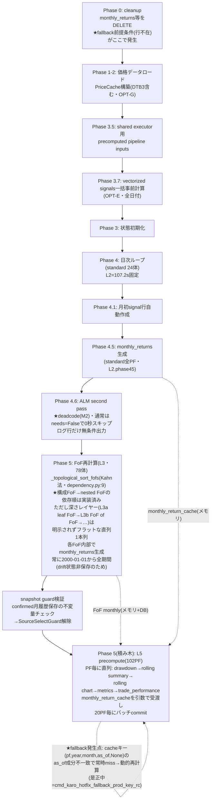
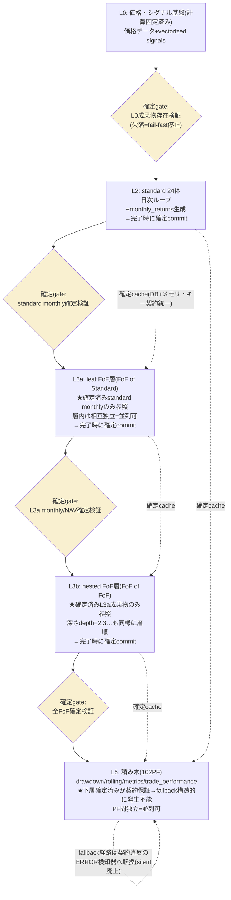

<!-- gist-master: 2d1e7458976b45751cebbffd8c118fa3 dm-production-issues-asis-tobe-5w1h_20260810.md -->
# DM-Signal本番問題群 補填設計書 — AsIs/ToBe/5W1H v1.7

- 作成: 2026-08-10 14:16 JST(将軍直轄)
- 位置づけ: 月次リターン基本原理設計書v6.13の**補填**。v6本文は変更しない。本日殿観測+一次計測で確定した本番問題群のAsIs/ToBeを固定し、修復レーンの正本とする
- 発端: 殿指示14:15「今の問題点は設計書の補填として別設計書を作ろう。asis/tobe」
- 関連: 殿メモ(観察8件)=gist 0a7397f5 / γ4差分分類=DM docs/research/cmd_4273_dual_replay_classification_20260810.md / タスクリストv1.4

## 0. 全体像と修復順序(殿方針14:00)

**律速から直す。** 全問題の検証は「修正→fullrecalculate→確認」を通るため、P1(速度)が最初。次にP2(γ5決着)が本丸、P3(表示群)はγ5決着後に切り分け。

| 優先 | 問題 | 状態 | レーン |
|---|---|---|---|
| P1 | fullrecalculate速度回帰(約51分) | cmd_4293偵察走行中 | 飛猿 |
| P2 | γ5 cutover未決着(cmd_4287 FAIL+alert562件) | 突合基準確定済み・検分中 | 影丸/家老 |
| P3 | FE表示・状態群(5件) | 観察記録のみ | γ5決着後 |
| P4 | ログ可読性 | 観察記録のみ | 未着手 |

## P1. fullrecalculate速度回帰

- **AsIs**: 直近本番run(id=2026081000375024E52B, mode=portfolio)が3052.487秒(約51分)。過去達成値480s(3566s→480s、86.5%削減)から大幅後退。区間別内訳は未計測。cmd_4245ガード未実装のため運用はmode=fullのみ=常に重い経路。
- **ToBe**: 区間別所要が機械計測され、最大回帰一件の原因変更(commit・機構)が特定され、修正後の本番実測が過去達成値近傍へ回復。修正検証1サイクルが実用時間(10分級)で回る。
- **5W1H**: WHY=全修復サイクルの律速(殿指示14:00) / WHAT=区間分解→回帰原因特定→修正→本番実測 / WHO=cmd_4293(飛猿)→修正cmd(次) / WHEN=最優先 / WHERE=Render本番+分析正本gunshi-fullrecalc-speed-analysis.md / HOW=ログ機械分解と過去正本突合。自動fullrecalculate仕込みは禁止(殿戒め2026-08-09)

### P1 修正手順(粒度小・v0.4改訂: mode基準統一+反復前提)
0. **S0 基準統一(家老所見)**: 比較は**同一mode同士のみ**。480s達成値のmodeを分析正本で確認し、現行実測も同modeのrunを採用。相関ID(runの識別)とDB実行IDを分離して記録し、別runの区間を混ぜない。
1. **S1 計測**: 基準runのRenderログをrun識別子でgrepし、区間(価格取得/シグナル/monthly_returns/FoF NAV/検証gate)ごとの開始・終了時刻を抽出→区間別秒数の表を作る(cmd_4293 AC1)。
2. **S2 突合**: 過去達成時の区間構成(同mode)と並べ、区間別増分を降順に並べる。最大増分区間=標的。**現時点の家老実測では NAV用DataFrameのFoF毎再構築が最大回帰**(v0.4時点の一次情報。cmd_4293の計測で確定させる)。
2.5. **S2.5 L5の方針転換(17:00疾風偵察の反証)**: 疾風偵察(cmd_karo_recon_l5_fingerprint_regression)が「run235の本番L5経路に**fingerprint skipのhit/miss機構は存在しない**」ことを一次確認(verdict=FAILは前提の反証として正)。∴L5是正は「実装済み機構の復旧」ではなく、(a)fingerprint skip設計(gunshi_precompute_fingerprint_skip_design_20260711)の本番実装 (b)再生成対象の絞り込み のいずれか。7/27にL5=42.3sだった別因(当日の再生成対象量等)の特定が方式選定の材料。
2.6. **S2.6 L5直接原因の確定(19:35疾風・代表3PF実測)**: DNS障壁解消後の隔離実測で、L5が確定できない直接原因=**FoF monthly_tradeのexpansion cacheにholding_signalが欠落**しPendingPrecomputedRawErrorとなること(生成45行が45/45 rejected・本番write 0)。次の一点=`precompute_raw.py`のconfirmed FoF境界でのholding_signal供給修正→同一3PF再実測(将軍承認済みmsg_193613)。**この欠落はP3のUI-2(旧・UUID表示)やP2のFoF系整合とも同根の可能性があり、速度・表示・整合の三兎が一本の修正で動く筋**。
3. **S3 原因変更特定**: 標的区間の実装ファイルへの変更をgit log -pで走査し、計算量・クエリ回数・直列化を持ち込んだ変更を特定(cmd_4293 AC2)。
4. **S4 修正**: 特定した1変更を、正しさの契約(完全性・恒等式)を変えずに是正。テストは分岐発火fixture付き(K6準拠)。
5. **S5 検証と反復(v0.5改訂・殿指摘15:10「また50分かかったら停滞するぞ」)**: **本番runは最終確認の1回のみに温存する。** 先に隔離/ローカル環境でhotfix適用済みコードの区間別プロファイルを回し(縮小データでも区間比率は取れる)、残余律速を全列挙→上位を同バッチで是正。P4のフェーズ別計時ログも同バッチに実装し、万一本番runが遅くてもその1回で全区間の診断データが取れる状態にする。隔離プロファイルの予測所要が過去達成値近傍を下回ってから本番1回で確定。単一原因の是正で差が残る場合は完了扱いにせずS2へ戻る(複数原因前提)。
5.4. **S5.4 検証単位の正(殿確定20:50・最上位)**: ①代表1体(1PF)でL0-L5を通し「完璧か？速いか？」を層別確認→修正→同一1体で再実行 ②1体が完璧+速になったら3体で同様 ③反復で1周所要を短縮し続ける ④**full recalculate見込み(全PF換算)が5分を切って初めて全PF実行**。全PFまとめて検証するのは高速回転の真逆(将軍が20:36に全102PF runを発火したのは誤り→中止指示済み)。1周ごとに[体数×層別秒数×正誤]を数値記録。
5.5. **S5.5 運用モデルの正(殿明確化20:18)**: L2/L3/L5の速度改善は「改善実装→**実際にdeploy**→**そのLを本番で計測**→次の改善」の反復が正。S5の「本番run温存」は50分fullrecalculateの盲目検証を禁じる趣旨であり、**改善済み修正のdeployと層別計測を止めない**。P4計時ログ導入後は毎runから層別内訳が取れるため、deploy→計測のコストは低い。各L改善のGATE CLEAR→deploy→層別秒数計測→before/after数値記録→次の標的、を標準サイクルとする。
5.6. **S5.6 回転プロトコル確定(殿裁定21:17-21:29・最上位運用則)**: 優先順位裁定=**DM-Signal本番普及が第一目標。ゆえに計算速度レーンが全レーンの先頭**(UI裁定分・確定処理はその後)。因果=速度↑→検証1周短縮→修正サイクル回転数↑→本番品質↑→普及(速度改善はバグ改善の乗数)。運用形:
   - **家老がハブ**: 検証ループ(1体×L5 run 10秒未満→結果観測→deploy→再run)を家老自身が回し続け、手から離さない。「忍者に配備すると必ず回転が止まる」(殿21:27)。
   - **忍者=非同期修正工場**: 発見したバグ・問題点はidle忍者へ並列配備するが、家老は完了を一切待たずに次の周を回す。層別担当割当(L5/L3/L2に1名ずつ)で並列修正の衝突を回避。
   - **定刻発車**: deploy時点で完成済みの修正だけを載せる。遅い忍者の修正は次便へ。タイムボックス超過(目安30分)はRUNTIME実測で検知し別idle忍者へ再配備or次周持ち越し。禁じ手=「全員の完成を待って1回deploy」。
   - **巡回**: L5→L3→L2→L5と層を巡回(S6の層別トライを巡回形に拡張)。代表PFは2-3体ローテーション(1体固定はその体で発現しないバグを見ない=K6と同根)。全層完了後にfull recalculate 1回で締めて本番実稼働の証拠とする。
   - 1周ごとに数値(所要秒・エラー件数)を掲示板1行報告し回転を見える化。
5.7. **S5.7 工程確定と改訂(殿裁定22:14→23:48・現行正)**: 上流から確定させて積む工程を確定後、同日23:48に二正面へ改訂。
   - **確定工程(22:14)**: L0/L1一回確定(第0段=対象PF利用銘柄の充足確認のみ、全銘柄不要) → L2高速化(1体ループ) → L2全PF実行 → L2データ固定 → L3高速化 → L3全PF → 固定 → L5 → 最終full recalculate 1回。「固定」=改善中の上流再実行禁止(計測差分の帰属純化)。上流バグ発覚時の巻戻しは受容。
   - **L3内部分割(22:15)**: standard→通常FoF→nested FoFの依存ゆえ、L3a(leaf-only FoF)→L3b(nested FoF)の2段。実行順は常にトポロジカル順。
   - **改訂(23:48)**: **L2は撤収・固定**(全PF107.2s≈2分で十分、これ以上磨かない)。**L3とL5は独立二正面**で並行高速化 — L3=L2固定を入力にFoF 1体周回、L5=現行DB成果物を入力に1体周回。互いの完了を待たない。条件: L3にデータ形・値を変える正しさ系修正が入った時のみ当該FoFのL5再検証。周回番号はL3-r1/L5-r1と層別採番。
   - **L5目標=全102PF 60秒以内(殿23:50)**: エラーコスト仮説を本番ログで実証済み — failed=0のrun=439s、failed=102のrun=1265〜2257s(5倍遅い)。道筋: ①failed×elapsed相関の機械集計 ②エラー源全根絶でクリーンrunのベース実測 ③warm cache最大化+fingerprint skip(既存設計書gunshi_precompute_fingerprint_skip_design_20260711)+unaccounted分解。
   - **1体基準値(本番実測2026-08-10深夜)**: L2=10.7s(TIMING SUMMARY: L2 2.9s+L5 3.1s+unaccounted 4.7s=43.7%が未帰属)、L3=8.92s(Ave-X leaf-only、sync-fof 200)、L5=1.4〜5.65s(builder None掃討後)。fullrecalculate見込み=約13〜26分(幅の原因=L3のnav_frame_cache修正効果が全78FoF未実測+unaccountedの全PF時挙動)。
   - **POST運用の教訓**: parent展開trueのPOSTは1体指定でも実処理が波及する(60体run・failed59の因果)。以後のPOSTは展開フラグを明示し、周回報告に自POST以外の同時間帯runの有無確認を含める。
6. **S6 層別トライ方式(殿裁定16:22)**: 一つの層(L)の隔離プロファイル見込みが5分を切ったら、全層完成を待たずその層単独の本番実測を実施してよい。先行対象=**L5(precompute単独)のみ** — L2はL1548(mode=portfolioの履歴退行バグ・cmd_4245ガード未実装)のため実装後まで除外、L3(FoF)はγ5決着後。P4計時ログ同梱後に実行し、層試験runからも区間内訳を取得する。

### P1 確認手順(二値)
- C1: 区間別秒数表の合計 ≒ run総所要(誤差5%以内)か(計測の完全性)。
- C2: 修正後の本番run所要が修正前より短縮し、標的区間の秒数が見込み値どおり減ったか(区間別で確認。総所要だけで判定しない)。
- C3: 修正後runでgate_recalculate_completeness.sh PASS(signals 102/102・monthly_returns 102/102・FoF 78/78)+baseline一致か(速度と引換えに正しさを壊していない)。
- C4: /api/signals他の主要APIがsmoke gate(gate_dm_signal_production_smoke.sh)でPASSか。

## P2. γ5 cutover決着(確定月シグナル変化562件)

- **AsIs**: γ5コード(9f2891d2)はlive、cmd_4287はverdict=FAIL(影丸正当停止: backup証跡不足+SIGNAL CHANGE ALERT)。alert=confirmed-month holding_signal changes 562件/32PF/2012-04-24〜2026-08-07。γ4差分分類(裁可材料)は是正由来変化2,068件/53PF(78 FoF中)・恒等式8951 PASS。32⊆53でサンプルPFも整合=想定内の可能性が高いが未確定。
- **ToBe**: alertの(PF,対象月)集合がγ4是正由来変化の(PF,月)集合に**完全包含されることの機械突合**で決着。包含100%→backup証跡を整備してγ5再実行→fullrecalculate+γ3再走で新経路一致→クローズ。包含漏れ≥1件→想定外として停止・健全時点復旧を検討(殿裁定要)。
- **5W1H**: WHY=確定月不変保証と裁可済み是正の切り分けが未決 / WHAT=包含突合1本(判定基準は将軍が家老へ通達済みmsg_141325) / WHO=影丸レーン / WHEN=P1と並走 / WHERE=本番DB readonly+γ4レポート / HOW=(PF,月)集合演算。曖昧調査の発散を禁止し二値判定のみ

### P2 実測経過(v0.3で追記)
- 単純月次正規化での包含突合は**FAIL**(影丸報告2026-08-10 14:29): γ4月次集合2068件/53PF、alert月次集合45件/32PF、**intersection=0**、rate=0%。本番書込み・fullrecalculateは設計どおり停止維持。
- **解釈**: 交差が部分でなく完全ゼロなのは、実データの乖離よりも**結合キーの定義誤り(判断月と保有月の因果対応が未定義)**を強く示唆する。γ4の判断日dの変更は保有シグナルへ[d, 次判断日)の区間で伝播するため、月境界をまたぐと月次等値比較は系統的にずれる。

### P2 修正手順(粒度小・v0.3改訂: 対応関係の確定を先行)
1. **S1 alert集合の抽出**: alert 562件の(portfolio_id, alert date=保有シグナル日)をreadonlyで全件抽出しCSV化(月への丸めをやめ日次のまま保持)。
2. **S2 期待区間の生成**: γ4元CSVから是正由来変化2,068件の(portfolio_id, 判断日d)を取り、PFごとに**有効区間[d, 次判断日)**を生成する。
3. **S3 対応仮説の二重判定**: (a)**区間包含**=各alert(PF, date)がそのPFのいずれかの有効区間に入るか (b)**月シフト**=alert対象月がγ4判断月+1と等値か。両方を機械判定し、containment_rateを各々出力。どちらかが100%なら対応関係が確定=想定内。両方とも100%未満なら真の想定外が存在。
4. **S4a 対応確定(100%)の場合**: backup証跡を家老所見の4点で二値確認 — ①manifest.jsonの実在パス現物(table_count=18・monthly_returns=16976・ledger=15212) ②backup対象DBと本番DBの同一性(接続先識別子一致) ③backup取得cutoff時刻の明記 ④隔離環境でのrestore rehearsal(1テーブル以上の復元実証)。全PASS後にγ5再実行(fullrecalculate)→γ3再走で新経路一致→クローズ。
5. **S4b 両仮説とも100%未満の場合**: 即停止。非包含alertの現物(PF・日付・old/new値)を添えて将軍経由で殿へ裁定。復旧は**コードrevert(9f2891d2)とDB restoreを分離した二段**で設計し、各段に対象限定・parity・smokeの二値確認を付す(家老所見)。

### P2 確認手順(二値・v0.3改訂)
- C1: alert**総行数562**と**一意(PF,月)集合45**を区別して両方記録したか(家老所見: 混同禁止。数値4規律の「何を1件と数えるか」)。
- C2: 区間包含・月シフトのcontainment_rateがそれぞれ機械出力され、100%の仮説が特定されたか(0%のままの再判定は禁止=同じ比較不能を繰り返さない)。
- C3: S4a経路ではγ3再走の新経路一致(mismatch=0)+completeness gate PASSか。
- C4: 再実行後のSIGNAL CHANGE ALERTが**S3で確定した期待集合と完全一致**するか(発火0件要求は誤り — 是正由来変化がある以上、期待どおりの発火が正)。γ4スコープ外のalertが1件でも出れば停止(軍師所見5反映)。

## P3. FE表示・状態群 — 殿裁定済み(v0.7全面改訂)

**統治ルール(殿裁定19:43・恒久)**: UI/UXは殿専権 — 忍者判断のUI変更禁止。無裁可変更は棚卸し→裁定板artifact(https://claude.ai/code/artifact/e9e784ab-f4e7-47a3-96e3-e9174c07ebcc)で殿が逐次fix→裁定原文をACへ直接引用したtaskのみ実装可。

**殿裁定6件(19:57・裁定板v2に反映済み)**:

| ID | 対象 | 殿裁定(原文準拠) | 分類 | 実装状態 |
|---|---|---|---|---|
| UI-1 | Monthly Returns「✓確定」ラベル | 不要。**削除** | デザインfix | 実装解禁(msg_195924) |
| UI-2 | Dashboard「現在の保有(効力中)」「次回リバランス」カード | **カード自体が不要**(上方にticker×weightで表示済み) | デザインfix | 実装解禁 |
| UI-3 | FoF monthly trade非表示 | デザインではなく**バグ。早々に表示を**(API200/entries24実証済み) | バグ | 実装解禁 |
| UI-4 | confirmed/pending混在 | **バグ**。正仕様=**8月の初回取引日の終了後に再計算されたらすべてconfirmedになるべき** | バグ | 実装解禁(P2のledger/status遷移調査と整合) |
| UI-5 | SPY drawdown非表示 | デザインの話ではない=**バグとして修正**(cmd_4278本来目的は維持)。**★殿裁定01:18(2026-08-11)による仕様明確化: ベンチマーク(SPY等)もOpen-to-Open/Close-to-Closeトグルに追従する。「benchmark表のみCLOSE固定」は誤読であり、benchmark drawdown_openの欠落は正常ではなくバグ** | バグ | 仕様訂正注入済み(小太郎task) |
| UI-6 | 新規追加分のUI変化 | **棚卸しを続行** | 棚卸し | 3忍者走行中→裁定板へ追記予定 |

実装規律: UI-1/2=削除のみ(新デザイン判断ゼロ)、UI-3/4/5=バグ修正(表示仕様の新規判断ゼロ)。全taskに変更前後の表示突合+既存テスト回帰FAIL0。deployは5件1便。

### (参考・裁定前の旧記述)
## (旧)P3. FE表示・状態群(殿観測5件)

| # | AsIs(殿観測・スクショ証跡あり) | ToBe | 切り分けの第一問 |
|---|---|---|---|
| 3a | FoF保有シグナルが子PFのUUID生文字列×weight表示(裏Ave-X実証) | 末端ticker×実効weightへ再帰分解表示。実効weight合計=1 | データ層(分解データ有無)かFE表示層か |
| 3b | monthly tradeでFoFのみ「No monthly trade data available」。**CDP実測(15:33 GATE CLEAR)で層確定: 同一セッションでAPI HTTP200・entries=24なのにUI表示0行=FE表示層のバグ**(過渡状態説を棄却) | Standard/FoF同等に表示 | 確定済み: FE表示条件の修正のみ。証跡=outputs/cmd_karo_recon_cdp_asis_p3_202608101438_normal_inspection/(receipt+API body+スクショ) |
| 3c | 8/10時点でmonthly tradeにconfirmed/pending PFが混在 | 混在理由がPFの利用銘柄充足日で説明可能、または確定処理修正 | 同一条件PF間で状態が割れているか(割れ=バグ) |
| 3d | monthly return月表示欄に日本語「✓確定」挿入・デザイン崩れ+Aug=MTDと確定の同時表示 | 月ラベルと状態ラベルの分離表示。状態論理の矛盾解消。UI文言は既存基準(英語)準拠 | どのcommitで混入したか |
| 3e | drawdownページでDrawdowns for SPY非表示 | SPY系列表示回復 | API応答有無(データ層/FE層切り分け)。cmd_4278(OPEN欠損時CLOSE代用除去)前後差分 |

- **共通原則**: 統一系・表示系修正は既存を厳密踏襲し指示された最小差分のみ(LS104)。「機能は正しいが見た目が変わった」はテスト・smokeの空白地帯であり、修正cmdのACに変更前後のスクリーンショット/表示値の突合を含める。
- **証跡**: queue/screenshots/20260810_133745…png(3a)、20260810_133758…png(3d)。

### P3 実行方式(v0.4改訂・家老所見+殿提案14:28)
- **並列化**: cutover後でないと判定できないのは3b・3cの再現確認のみ。**read-onlyの現状偵察(API応答取得・CDPスクショ収集)は全件いま並列実行可能** — 殿提案どおりCDP(正典経路=scripts/cdp/cdp_measure.sh系・隔離プロファイル必須)で対象4画面(dashboard FoF/monthly trade/monthly returns/drawdowns)のAsIsを機械固定する。
- **テスト契約**: 3dなどで永続Jestを追加する場合はdefault-delete契約に従いtest_necessity(守る不変量1つ)を宣言する。宣言できないtestは実装時使用後に削除。
- **3c検証対象**: pending原因をprice coverage(銘柄充足)に先決めせず、ledger/status遷移の欠落も同格の仮説として検証する(家老所見)。

### P3 修正手順(粒度小・各件独立)
- **3a(UUID表示)**: S1=対象APIレスポンス(dashboard保有欄のデータ源)をcurlで取得し、UUIDのまま返るか(データ層)FEで解決漏れか(表示層)を確定 → S2=データ層ならFoF保有の再帰分解関数(component_weights→末端ticker×実効weight)を消費APIに適用、表示層ならticker解決の参照切れを修正 → S3=ネスト2段以上のFoFを含むサンプル3PFで表示確認。
  - 確認(二値): 対象画面の保有欄にUUIDが0件か。実効weight合計が1.0±0.001か。ネステッドFoFのサンプルで末端tickerまで表示されるか。
- **3b(FoF monthly trade非表示)**: S1=γ5決着(P2クローズ)後に同画面を再確認 → 解消していれば過渡状態と記録して閉じる → S2=残存ならFoF向けAPI応答(空配列か非空か)で層を切り分け修正。
  - 確認(二値): FoFサンプル3PFでmonthly tradeデータが表示されるか。Standard PFの表示に変化がない(回帰なし)か。
- **3c(confirmed/pending混在)**: S1=混在PFの利用銘柄と各銘柄の最終価格日をDB readonlyで抽出 → S2=pendingのPFすべてが「利用銘柄の充足不足」で説明できるか判定 → 説明可能=仕様どおり(FEに理由表示の改善候補として記録のみ)、説明不能=確定処理のバグとして該当処理を修正。
  - 確認(二値): pending全PFに充足不足の銘柄が1つ以上存在するか(存在しないpending=バグ)。同一銘柄構成のPF間で状態が一致するか。
- **3d(「✓確定」ラベル崩れ)**: S1=該当コンポーネント(monthly returnsテーブルのMon列セル)をgit logで特定し混入commitを確定 → S2=状態ラベルを月ラベルセルから分離(既存UI基準=英語文言・既存スタイル)し、MTDと確定の同時表示条件を修正 → S3=Jestテストに「月セルに状態文字列が含まれない」「MTD月はconfirmed表示にならない」を追加。
  - 確認(二値): 月セルのテキストが月名のみか。Aug(進行月)がMTD表示のみか。追加テストがFAIL0/SKIP0か。
- **3e(SPY drawdown非表示)**: S1=drawdownページのSPY系列APIをcurlで取得し、データ有無で層を確定 → S2=FE層ならcmd_4278(9b094cff)の前後差分でOPEN欠損時の表示条件変更がSPY系列に及んだ箇所を特定し最小修正、データ層なら系列生成の欠落を修正。
  - 確認(二値): drawdownページにSPY系列が描画されるか。cmd_4278の本来目的(OPEN欠損時CLOSE代用の除去)が維持されているか(該当テスト再実行FAIL0)。**benchmark系列がOtO/CtCトグルの両モードで表示されるか(殿裁定01:18: 「代用除去」はOPEN欠損日にCLOSE値を混ぜない意であり、benchmarkをCLOSE固定にする意ではない。benchmarkのOtOデータは供給して表示する)**。

## P4. ログ可読性

- **AsIs**: 再計算ログに進捗の定型行(フェーズ/処理済みPF数/所要)がなく、WARN/ERRORにgrep可能な固定契約がない。本番500の検知が殿のRenderログ目視だった(cmd_4272事案)。
- **ToBe**: 再計算パイプラインにログ契約(フェーズ名+件数+所要の定型行、固定プレフィックスのERROR行)。deploy後smoke(cmd_4288・commit 024327e3=**local mainのみ、origin未push**。将軍が2026-08-10 14:35にgit branch --containsで実測訂正。push=家老レーン)と合わせ、完了通知=本番正常の鎖を閉じる。
- **相乗り原則(家老所見)**: ログ契約の本番検証は専用fullrecalculateを追加せず、P1/P2の最終確認runへ相乗りする。
- **備考**: P1の区間分解計測(cmd_4293)の成果物がそのままログ契約の設計材料になる。

### P4 修正手順(粒度小)
1. **S1 契約定義**: P1のS1で確定した区間名を正式なフェーズ名とし、ログ契約を固定 — 各フェーズ開始/終了に定型行(固定プレフィックス+フェーズ名+処理件数+所要秒)、異常に固定プレフィックスERROR行。
2. **S2 実装**: 再計算パイプラインの各フェーズ境界に定型行の出力を追加(計算ロジック無変更・出力追加のみ)。
3. **S3 検証**: ローカル再計算1回で定型行を全フェーズ分grep抽出できることを確認→deploy→本番run 1回でRenderログから同じ抽出が成立することを確認。

### P4 確認手順(二値)
- C1: 本番runのRenderログから固定プレフィックスgrep 1回でフェーズ別所要の表が機械生成できるか。
- C2: 定型行の追加前後で再計算の結果データが不変か(completeness gate PASS+所要秒の悪化が誤差内)。
- C3: 意図的なエラー(テスト環境)で固定プレフィックスERROR行が出るか。

## P5. 殿改善候補メモ(今後直す候補・実装は別途下知待ち)

殿観測による改善候補の正本棚。**実装・起票は殿の別途下知まで禁止**。各件は三層記憶にも記録済み。

| # | 件名 | AsIs | ToBe(候補) | 出典 |
|---|---|---|---|---|
| M1 | pending表示の意味論乖離 | pendingは【当月リターン未確定】の意だが、現UIでは保有シグナルまで未確定に見える | pendingラベルの適用範囲を月次リターン欄に限定し、保有シグナル欄は確定表示を維持する等。UI/UXは殿専権ゆえ裁定板で殿がfix | 殿メモ2026-08-11 02:39(knowledge:41353b1a) |
| M2 | ALM deadcode残存 | ALMディスコン裁定(2026-05-10)後もrecalculate_fast.pyにALM実装一式が残存(Phase 4.6 second passブロック+candidate cache構築+momentum_data payload等+Phase 2の候補lookback事前計算)。ログの`[MEMORY] Phase 4.6: Start ALM second pass`は条件分岐外の無条件メモリマーカーでありALM実行の証拠ではない(実行時のみ`[ALM] Starting second pass for N portfolio(s)`が出る) | 本番DBでALM有効config PF=0を確認の上deadcode除去。Phase 2の候補cache事前計算も消えるためL3高速化に寄与 — L3/L5レーンの1 hotfix候補 | 殿指摘2026-08-11 03:35(knowledge:ad48fed2) |
| M3 | SIGNAL DECISION DRIFTのCRITICALログ冗長 | 同一(portfolio,date)の組で繰り返し出るCRITICALログは2回目以降情報量ゼロでログを埋め、Render確認コストを上げる | 初回のみCRITICAL(同一キー抑止)またはサマリ行のみCRITICALで個別行はINFO/DEBUGへ降格。P4ログ契約と同レーンで扱う。★実害実証13:00: ログ窓400行がCRITICALで埋まり--textフィルタなしでprofiling行に到達不能 | 殿指示2026-08-11 03:40(knowledge:dd046ff1) |
| M4 | **[修正指示済み]** Compare SummaryでUp Cap/Down Cap非表示 | up_capture実装はHEAD現存・8月以降変更0件(将軍切り分け13:36)。原因はデータ/生成系 — revert後の部分再計算でportfolio_metrics未再生成/NULLの疑い | 原因層(metrics生成/API/FE)を特定し是正。家老へ調査配備済み(msg_133646) | 殿観測2026-08-11 13:35+修正指示13:37(knowledge:c44d4292) |
| M5 | **[修正指示済み]** DrawdownページでSPY(ベンチマーク)のdrawdown%数値が非表示 | benchmark drawdown系の欠損。殿裁定01:18『benchmarkもOtO/CtCトグル追従、benchmark drawdown_open欠落は正常ではなくバグ』(UI-5系)と同根の可能性 | UI-5小太郎レーンの仕様訂正と合流して是正。修正完遂まで追跡・抜け禁止 | 殿観測+修正指示2026-08-11 13:37(knowledge:c44d4292) |
| M6 | **[修正指示済み]** monthly trade画面: FoF PFで8月以前の表示がない(standard PFは8月以前も表示あり) | FoF系のmonthly_trade履歴欠損。候補: revert後の部分再計算でFoFのmonthly_trade未再生成、またはL5 monthly_trade builder None系(3a0cb44f根治)の残穴 | FoF/standardの生成経路差を特定し是正。修正完遂まで追跡・抜け禁止 | 殿観測+修正指示2026-08-11 13:39(knowledge:fe6a5b25) |
| M7 | **[修正指示済み]** monthly trade画面: 8月(当月)のリターンとprice movementが非表示 | 当月行のデータ欠損。候補: MTD expansion cache系(半蔵根治レーン)またはpending意味論(M1)系 | 当月データの生成/表示経路を特定し是正。修正完遂まで追跡・抜け禁止 | 殿観測+修正指示2026-08-11 13:39(knowledge:fe6a5b25) |

## P6. fullrecalculate計算順序フロー(殿指示2026-08-11 04:39・コード現物より起図)

将軍がrecalculate_fast.py / recalculate_fof.py現物から読み取った実行順。行番号は2026-08-11時点のmain。

### P6-AsIs: 現行フロー

**読み取れた事実(殿の問いへの回答)**:
1. 「monthly保存→trade_performance」の順序は既に正しい(Phase 4.5/5→積み木)。順序入替え改修は不要。
2. 「nested FoFの構成FoF先行」も_topological_sort_fofsで実装済み。
3. fallback残存の真因は順序ではなくcacheキー受渡しの不一致(as_of成分)。
4. **深さレイヤーの明示不在(殿指摘04:43)**: トポロジカルソートはKahn法でフラットな直列1本列を返すのみで、深さ層(L3a=FoF of Standard/leaf → L3b=FoF of FoF → …)がコード上の構造として存在しない。順序の正しさは保証されるが、(i)同一層内のFoFは相互独立なのに並列化・層単位バッチができない (ii)L3a確定→L3b着手という工程管理(殿裁定22:15のトポロジカル運用)がコードと写像しない。層アノテーション(depth算出)を入れれば層内並列とL3a/L3b分割実行が構造化できる。
5. **最適化余地(候補)**: (a)Phase 4.6 ALM deadcode除去=M2 (b)FoF「常に全期間再計算」はdrift状態非保存が理由 — 状態保存を実装すれば部分再計算が可能になる(L3高速化の構造標的) (c)L5積み木はPF間独立のため並列化余地(現在は直列+20PFバッチcommit) (d)FoF層内並列(上記4)。

### P6-ToBe: 層確定カスケード実行モデル(殿提案2026-08-11 04:47)

**原理**: L0を計算固定しているのと同様に、L1→L2→L3を層順で「確定」させながら積み上げる。各層は完了時点で成果物(monthly_returns/NAV)を**確定cacheとしてcommit**し、上層の計算は**確定済み下層のみ**を参照する契約とする。

| 項目 | AsIs | ToBe(層確定カスケード) |
|---|---|---|
| 層の扱い | Phase順は正しいがcache受渡しはメモリ引数+DB行の混在で、キー不一致・行不在でfallbackが起きうる | 各層の完了=下層成果物の確定commit。上層開始時に「下層確定済み」を前提条件として検証(未確定なら開始しない=fail-fast) |
| fallback | 行不在・キー不一致で動的再計算(silent) | **構造的に発生不能**(上層計算時に下層結果の存在が契約保証される)。fallback経路は契約違反の検知器(ERROR)へ転換 |
| 検証 | fullでしか発生条件が成立しない | 層単位で確定→次層のみ再実行が可能になり、1層×少PFの高速検証が標準化 |
| 工程との写像 | 運用(L2固定→L3/L5)はあるがコード構造に層概念なし | 深さレイヤーアノテーション(P6-4)と合わせ、運用工程=コード構造=検証単位が一致 |

- 効果: fallback根絶(症状でなく発生条件の根絶)+層内並列の前提+部分再計算(下層不変なら上層のみ)の三点が同一構造から出る。
- 位置づけ: 現行のkey不一致hotfix(対症)完了後の構造改修候補。実装起票は殿の別途下知。
- **殿裁定(2026-08-11 04:59)**: 本ToBeは保留 — 「AsIsが300秒切るなら慌てなくてもいい。俺がやると言うまでは現状の枠組みで最適化を進めよう」。∴当面の目標=**AsIs枠組みでfullrecalculate 300秒切り**。ToBe着手は殿の明示下知のみ。

### P6-ToBe: 層確定カスケードフロー(mermaid)

**AsIsとの差分(要点)**: (1)各層の間に確定gate — 上層は下層の確定を検証してから開始(現行は暗黙の順序依存のみ) (2)FoFをフラット1本列でなくL3a/L3b…の深さ層に分割し層内並列 (3)cache受渡しをキー契約で統一(メモリ引数+DB行の混在廃止) (4)fallbackはsilent動的再計算からERROR検知器へ転換 (5)層単位の部分再実行(下層不変なら上層のみ)が構造的に可能になり、1層×少PFの高速検証が標準になる。

## v6設計書・タスクリストの検討不足の知見化(殿指示14:17「成長のチャンスだ」)

本日の問題群を生んだのは実装ミスだけではない。設計書v6(dm-monthly-return-design-v6_20260809.md)とタスクリスト(dm-monthly-return-v6-tasklist_20260809.md)の**検討不足**が上流原因である。AsIs/ToBe/5W1Hで固定し、次の設計書起草の知見とする。

| # | 検討不足(AsIs) | 本日の帰結 | ToBe(次の設計書への規範) |
|---|---|---|---|
| K1 | **cutover当日のユーザー可視状態を設計していない** — γ5切替→fullrecalculate完了までの過渡期間にFE(monthly trade/dashboard)がどう見えるべきかの契約がv6にない | 3b(FoF非表示)・3c(confirmed/pending混在)を殿が目視で発見。仕様か過渡かバグか誰も即答できない | 本番切替を含む設計書は「切替中・切替直後のFE表示の期待値」を画面別に明記し、過渡状態の許容時間を定める |
| K2 | **alert発火の想定内判定基準を事前契約していない** — γ4差分レポートは裁可材料として作ったが、γ5実行時にSIGNAL CHANGE ALERTが何件・どのPFで鳴るはずかへの変換をタスクリストが持たない | 影丸がalert562件で正当停止し、レーンが丸ごと停止。判定基準(包含突合)は事後に将軍が定義した | 是正由来の差分を持つ切替タスクは「実行時に発火するalertの期待集合」を事前計算し、突合コマンドをACに書く |
| K3 | **非機能要件(速度予算)の欠落** — v6は正しさの契約(完全性・identity・恒等式)は厚いが、fullrecalculate 1周の時間予算と検証サイクル回転数の設計がない | 1周51分が全レーンの律速になり殿指摘(14:00)まで顕在化しなかった | 設計書に検証サイクルの時間予算(1周N分以内・1日M回転)を非機能要件として明記し、超過をタスクリストの検収条件にする |
| K4 | **UI状態表示の仕様未定義** — pending/confirmed三状態の意味論は裁定したが、FEでの表示文言・配置・言語(英語基準)を設計していない | 3d(日本語「✓確定」が月ラベル欄に混入・MTDと確定の同時表示)。実装者の自由裁量が仕様逸脱を生んだ | 状態意味論を定義する設計書は、状態→表示(文言・位置・言語・スタイル)の対応表まで含める(LS104の設計書版) |
| K5 | **FoF保有の表示粒度仕様の欠落** — FoF momentumのNAV化(データ層)は設計したが、保有シグナルの末端ticker×実効weight分解表示(表示層)を設計対象外とした | 3a(UUID生表示)。データ層の変更が表示層の未設計領域を露出した | データ構造を変える設計書は、その構造を消費する全表示面の期待値を影響範囲表に含める(codd propagate思想の設計書適用) |
| K7 | **CI性能回帰検知が設計対象外**(軍師所見10) — 速度劣化を検知する仕組みがなく殿目視で発覚した | P1(51分回帰の長期未検知) | 本番runの所要秒を記録し、達成基準からの乖離でWARNを出すCI/監視チェックを設計対象に含める |
| K6 | **検証がバグ経路を実行する保証の欠落** — タスクリストの検収は「テストPASS・FAIL0/SKIP0」止まりで、分岐発火fixtureとdeploy後smokeを要求していなかった | cmd_4272の本番500素通し(検知=殿のRenderログ目視)。LS-A24(3)として教訓化・smoke gateは本日実装済み(commit 024327e3) | 検収条件は「PASSした」ではなく「検証がバグ経路を実行した証拠」を要求。deploy随伴タスクはsmoke確認を検収に含める(実装済みgateを標準参照) |

- **共通構造**: v6は「計算の正しさ」の設計書としては完備だったが、**運用面(時間・過渡状態・表示・alert対応)を設計対象から落とした**。次の設計書は「殿がその日どの画面を見て何を確認できるか」を設計の第一級対象にする。
- 還流先: 本表の要点はlesson(LS系)へ登録し、設計書レビュー(軍師SG)の観点にK1-K6を追加する(起票は殿の下知後)。

## 進捗台帳(本設計書のクローズ条件)

| 項目 | 起票cmd/レーン | 状態(2026-08-10 14:37) |
|---|---|---|
| P1偵察 | cmd_4293 | **GATE CLEAR(17:04)**: dataframe_prep 1.87s→1366.43s(約730倍)が最大回帰と確定。成果物=docs/research/cmd_4293_fullrecalc_speed_regression.md(将軍一次検分済み) |
| P1修正第1弾 | 疾風hotfix(家老自走配備) | **実装完了**: nav_frame_cacheをFoF反復外へ移設(commit fdbf3022・隔離実験でcache共有動作確認)。push済み・本番実測はP4計時ログ同梱後 |
| P1 L5方針 | 疾風偵察(fingerprint回帰) | **前提反証で完了(17:00)**: 本番L5経路にskip機構は不存在。是正=skip設計の本番実装 or 再生成対象絞り込み(S2.5)。7/27 L5=42.3sの別因特定が方式選定材料 |
| P1 L5 hotfix(holding_signal欠落) | 疾風(家老配備) | **完了**: test_path是正→再走→deploy済み。以後のbuilder None系掃討へ接続 |
| 回転プロトコル(S5.6) | 家老ハブ | **稼働・実績多数(21:31〜)**: L5バグ3件根治(rolling_returns 3a0cb44f→drawdowns 9a09a00a→monthly_trade才蔵掃討中)、cache計装Live(7d169165: cache_state/warm_state/rss/elapsedが毎POSTログ化)、L3a leaf-scope修正(879b2d14: TQQQ/XLU欠落経路根治) |
| L2全PF実行(S5.7) | 将軍執行(殿直接指示22:41) | **完了**: sync-standard全量POST→約2分で完走。DB照合24/24一致(standard=24体・FoF=78体)。L2固定へ移行 |
| L2 unaccounted分解 | 影丸(cmd_karo_hotfix_l2_unaccounted_timing) | **実装中**: 1体10.7s中4.7s(43.7%)のLayerTimer未登録区間へlayer登録追加、目標=unaccounted10%未満 |
| L3-r1 | 家老ハブ | **完走(23:53)**: Ave-X(leaf-only, components=6)へsync-fof POST 200、8.92s、実処理1/1。後段No MonthlyReturn warningはL5レーンへ接続 |
| L5-r1 | 才蔵 | monthly_trade builder None掃討中。目標=全102PF 60秒以内(S5.7) |
| 60体run事案 | 家老回答済み(23:46) | parent展開trueの波及と判明(故意の1体違反ではない)。POST展開フラグ明示を運用化 |
| ルール恒久化 | 家老 | **完了(23:22)**: 今夜の回転裁定をinstructions/karo.md L148-175へ焼き込み(検証6/6)。軍師第三者検証依頼済み |
| P1 L2/L3知見 | 参照パック送達済み(msg_161111) | trade_perf 7倍回帰(117s→862s)は「適用済み共有cache/N+1除去の失効」を第一仮説に才蔵レーンで調査 |
| P2因果写像再構築 | 影丸partition確定(15:51): **全562件がγ4 replay範囲外**(起点前471+終端後91・inside=0)。半蔵が頭打ち原因を確定(19:22): **道具限界ではなくhistorical-config入力終端(config_max=2026-07-02)**。source_max=2026-08-07との差36-66日(代表3PF実測) | **config延伸replay走行中**(隔離configを08-07へ延伸→同一代表3PFでreplay、将軍承認msg_192238)。inside=562/562なら想定内確定→backup4点→γ5再実行。**cutover・本番write停止維持**。UI-4の正仕様(8月初回取引日終了後の再計算で全confirmed)を確定処理側の契約として整合させる |
| P2 γ5再実行 | (写像確定後) | 未起票・🔒backup4点(manifest実パス/DB同一性/cutoff/restore rehearsal)必須 |
| P3 CDP read-only偵察 | 半蔵・才蔵(殿提案14:28採用・家老へ配備指示14:37) | 配備指示済み: 4画面AsIs機械固定 |
| P3a-3e修正 | (偵察+γ5決着後に採番) | 未起票 |
| P4ログ契約 | (P1成果物後に採番・検証は最終runへ相乗り) | 未起票 |
| 未push155件+SG-PRE9c誤検知 | 家老レーン(push)+小太郎(precheck修正) | 処理中。smoke gateはpush完了までCI未防御 |

- クローズ条件: P1本番実測回復+P2クローズ+P3全件の切り分け完了(修正は各cmdで)+P4契約実装。各行の起票時に実番号を本表へ記録する(LS086)。

## 軍師レビュー反映(v0.3・所見10件全件)

1. P1 S1に比較run同士のmode一致確認を追加(480s達成値のmodeを分析正本から確認し同modeで比較)。
2. P1 S3-S4は累積回帰に備え反復可(1変更修正→C2再計測→残回帰があればS3へ戻る)。
3. P1 C2は標的区間だけでなく全区間の前後比較(他区間の悪化=修正の副作用検知)。
4. P2月丸め未定義→v0.3で対応仮説の二重判定(区間包含/月シフト)へ再設計済み(所見4はFAIL実測でも裏付け)。
5. P2 C4にγ4スコープ外alertの停止条件を追加済み。
6. 3a weight許容誤差±0.001は暫定(データ層の格納精度を切り分けS1で確認し、確定精度に更新する)。
7. 3a-3e各修正後は該当ページ群の全体回帰確認(既存Jest+スクリーンショット突合)を共通手順に追加。
8. P4 C2の誤差内=所要秒+5%以内と明記。
9. K3時間予算の暫定値=fullrecalculate 1周15分以内・検証サイクル1日20回転(P1完了後の実測で確定)。
10. K7(CI性能回帰検知)を検討不足表へ追加済み。

## 改訂履歴
- v1.7 (2026-08-11 13:40): P5棚へM6(monthly trade: FoFの8月以前非表示)・M7(monthly trade: 8月リターン/price movement非表示)を追加(殿修正指示13:39)。修正指示済み在庫はM4-M7の4件。
- v1.6 (2026-08-11 13:38): P5棚へM4(Compare Summary Up/Down Cap非表示)・M5(Drawdown SPY%非表示)を追加 — いずれも殿の修正指示済み(13:37)であり実装解禁・完遂まで追跡。M3へ実害実証(13:00 CRITICAL洪水でログ窓埋没)を追記。
- v1.5 (2026-08-11 04:52): **P6-ToBe層確定カスケードのmermaid図を追加**(殿指示04:50「AsIs/ToBe両方書け」) — 既存図をP6-AsIsと明記し、確定gate4つ+L3a/L3b層分割+並列可否+fallback→ERROR転換を図示。AsIs/ToBe差分5点を要点化。
- v1.4 (2026-08-11 04:48): **P6-ToBe: 層確定カスケード実行モデルを追加**(殿提案04:47「L0を計算固定してるようにL1→L2→L3とやれば常にキャッシュが使える」) — 各層完了時に成果物を確定commitし上層は確定済み下層のみ参照する契約。fallbackを対症でなく発生条件ごと根絶し、層単位検証・層内並列・部分再計算の構造基盤を兼ねる。実装起票は別途下知。
- v1.3 (2026-08-11 04:42): **P6. fullrecalculate計算順序フロー(mermaid)を新設**(殿指示04:39) — Phase 0〜積み木までの実行順+データ受渡し+fallback発生点を1図に固定。殿の2仮説(順序入替え/構成FoF先行)は共に実装済みと現物確認、真因=cacheキー不一致を図中に明記。最適化候補3点(ALM除去/FoF drift状態保存/L5並列化)を付記。
- v1.2 (2026-08-11 03:43): **P5. 殿改善候補メモ棚を新設** — M1 pending表示意味論(02:39)、M2 ALM deadcode残存+ログ行は無条件マーカーの切り分け(03:35)、M3 SIGNAL DECISION DRIFT CRITICALログ冗長(03:40)。いずれも実装は別途下知待ち。ヘッダversionをv1.2へ是正(v1.1改訂時にヘッダ未更新だった点も是正)。
- v1.1 (2026-08-11 01:22): **UI-5誤読源の訂正(殿裁定01:18)** — 「cmd_4278本来目的(OPEN欠損時CLOSE代用の除去)は維持」の記述が「benchmark=CLOSE固定でよい」と誤読され、小太郎がbenchmark drawdown_open 0/10を正常と判定する事故が発生。正仕様を明記: ベンチマーク(SPY等)もOtO/CtCトグルに追従する。「代用除去」はOPEN欠損日にCLOSE値を混ぜない意であり、benchmark全体をCLOSE固定にする意ではない。benchmarkのOtOデータは供給・表示する。UI-5表と3e確認手順の両方へ焼き込み。
- v1.0 (2026-08-11 00:02): **S5.7工程確定と改訂を追加** — 上流確定積上げ工程(22:14)→L2撤収+L3/L5独立二正面(23:48)+L5目標60秒とエラーコスト実証(failed=0で439s vs failed=102で2257s)+1体基準値3層(L2=10.7s/L3=8.92s/L5=1.4-5.65s)+fullrecalculate見込み13〜26分+parent展開波及の教訓。進捗台帳を深夜実績(L5バグ3件根治・cache計装Live・L2全PF24/24完走・L3-r1完走8.92s・instructions焼き込み)へ全面更新。deploy便8本/夜・CI非同期(殿裁定22:55「CI redは無視、デプロイを止めるな」)・周回タスク軽量契約3点(殿裁定22:59)も正本化。
- v0.9 (2026-08-10 21:35): **S5.6回転プロトコル確定を追加**(殿裁定21:17-21:29: 計算速度最優先・家老ハブ・1体×L5 10秒ループ・忍者非同期修正工場・定刻発車・タイムボックス・L5→L3→L2巡回・代表PFローテ+最終full 1回)。進捗台帳へL5 hotfix再配備(21:24)と第1周障害検知(21:32)を追記。v0.8でヘッダ・履歴が未更新だった点も是正。
- v0.8 (2026-08-10 20:26): S5.5運用モデル(deploy→L毎計測→改善反復)+殿裁定20:21(本番復旧最優先・停止解除)。
- v0.1 (2026-08-10 14:16): 初版。P1-P4のAsIs/ToBe/5W1H+v6検討不足K1-K6+進捗台帳。
- v0.2 (2026-08-10 14:25): 殿指示「粒度を小さくし覚醒アップデート」— 各Pに修正手順(S系)と確認手順(二値C系)を追加。3a-3eは件別に独立手順化。レビュー: 軍師・家老の独立忖度なしレビューへ提出。
- v0.3 (2026-08-10 14:32): P2包含突合FAIL(intersection=0)を受け対応仮説の二重判定(区間包含/月シフト)へ再設計。軍師所見10件を全件反映(K7追加含む)。CDPによるP3現状把握(read-onlyスクショ収集)を殿提案で追加(進捗台帳参照)。
- v0.7 (2026-08-10 20:02): **P3全面改訂** — UI統治ルール(殿裁定19:43: UI/UXは殿専権・忍者判断禁止)+殿裁定6件(19:57: UI-1/2削除fix・UI-3/4/5バグ修正解禁・UI-6棚卸し続行)+裁定板artifact運用(e9e784ab)を正本化。UI-4の正仕様=「8月の初回取引日の終了後に再計算されたらすべてconfirmed」を確定処理の契約として明記。L5真因の転換(S2.5→さらにholding_signal欠落=PendingPrecomputedRawErrorが直接原因、19:35疾風実測)とP2 config終端確定(19:22半蔵実測: config_max=2026-07-02が頭打ち原因→config延伸replay走行中)も反映。
- v0.6 (2026-08-10 17:05): 午後の確定事項を反映 — ①S2.5追加: 本番L5経路にfingerprint skip機構は不存在(疾風偵察の反証)。L5是正=skip設計の本番実装 or 対象絞り込みへ方針転換 ②P1第1弾hotfix実装完了(fdbf3022) ③cmd_4293 GATE CLEAR ④L2/L3参照パック・代表PF方式・S6層別トライを運用中 ⑤P2延伸replayはeven系がreplay到達2026-07-02で頭打ち=正式FAIL、頭打ち原因特定を代表PF3個で先行中。
