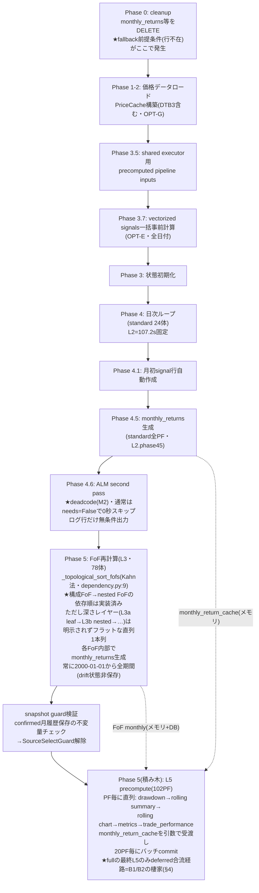
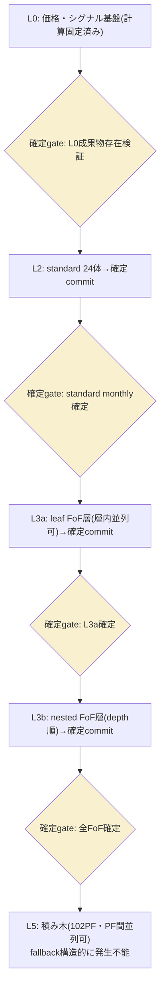
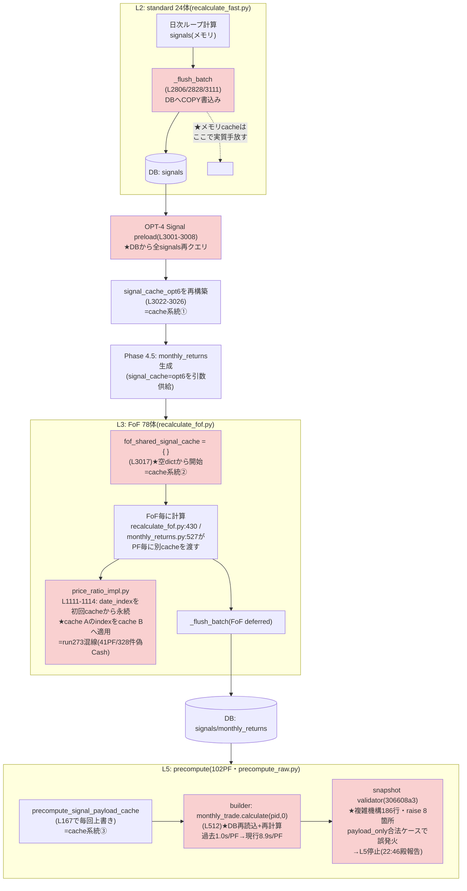
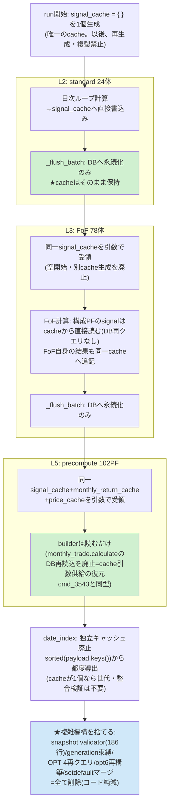

<!-- gist-master: 2d1e7458976b45751cebbffd8c118fa3 dm-production-issues-asis-tobe-5w1h_20260810.md -->
# DM-Signal本番問題群 補填設計書 — AsIs/ToBe/5W1H v2.0

- 作成: 2026-08-10 14:16 JST(将軍直轄) / v2.0再構築: 2026-08-11 15:55(殿指示「覚醒して再構築せよ」)
- 位置づけ: 月次リターン基本原理設計書v6.13の**補填**。v6本文は変更しない。本番問題群の修復レーンの正本
- 再構築方針: **現在有効な工程・裁定・在庫を前面**に置き、完了済み経過は§8歴史へ圧縮(情報は削らず参照で残す=リンク先なき圧縮禁止)

## §0. 不変事項(最初に必ず読む5行。ここ以外の現在地記述は参照情報 — 矛盾したら本欄が正)

1. **full=条件付き解封(殿→家老直接下知 2026-08-12 12:30頃)** — 原文「いまフル計算していないか？確認してくれ。エラーがなければ試しに最後まで計算しよう」。**解錠条件=run301(親展開65FoF canary)completed+ERROR0の確認後のみ発進**。条件未成立中はfull起動禁止。将軍検証済み(家老blt_123607で原文提示・殿直接指示>将軍指示の恒久裁定に基づく)。run296教訓(裁可範囲外full禁止)は引き続き有効
2. **正順序**: run296根因→T3.6(TradePerf FoF展開)→T4→T5→T6→full(T7)→T8
3. **主戦の本質**: 唯一のLazySignalArtifactCacheをL2→L3→L5→trade_perfまでidentity同一で一本受渡し。第二cache新設は逸脱(e84f335a先例)
4. **不変契約I1-I5**は§10.1末尾。例外承認権は殿のみ
5. **進捗の正**=§10.1 Status表のみ。他所の進捗記述を根拠にするな
- 更新: 2026-08-12 12:05 JST(v2.10)

## §1. 現在地(2026-08-12 10:45時点の記録 — 進捗の正は§0/§10.1)

**(stale注意: 以下は10:45時点)** full封印解除(殿裁可10:39)→**11:08殿裁定で順序違反と判明し再封印(§0参照)**。偽Cash 3経路・B1/B2/B4・ledger依存はすべて根治済み。

| レーン | 状態 |
|---|---|
| 本番コード | main 8f938184系Live(夜通しのhotfix便: T0範囲統一e3f4ebe9→T2 cache保持073006bd+8ad3561d→T3.5 O(N²)修正e84f335a→T3.6 trade_perf a0cb97a6→T7.5 ledger分離e487ee73→B4根治59db624d→P0/P1純関数化42ade776→ログ集約e79ffc9c) |
| 偽Cash機構 | **3経路すべて根治済み**: ①run273 cache混線→T2/T3一本化 ②汚染子引継ぎ→T8復旧で解消予定 ③run275範囲契約不一致→T0範囲統一(run276で594行復元実証) |
| canary回転 | **確立・収束済み**: run276/279/289/290/292/293/294すべてPASS。run295(同一5PF再実行)で**changes=0**=収束の二値証明。1周約3分の標準の型(§2 02:11裁定) |
| 計算の純関数化 | **達成(42ade776)**: 計算経路のledger書換えゼロ(monthly_returns.py:699-705/:440-443除去)。repro=ledger有.075/無.1→両方.1。v4 goldenがCI-templateと243,861行exact一致(mismatch 0) |
| full封印 | **解除(殿裁可2026-08-12 10:39・knowledge:81a8d47e)** — T7としてfull実行発進。実行契約=Live SHA確認→Query形式全量→判定3点(I1全量突合102PF/I5全endpoint欠落0/TOTAL・層別・L5 per-PF実測)+status×層ログ突合。異常時=再deploy停止+change_log復元で可逆 |
| M4-M10(表示欠損) | M10=本番API検証PASS・M9/M4/M5/M7=実装done(過去欠損行の充填はT7 fullで一括)・M6=B3修正済み+充填待ち。read-side 4PF可視差はT8 ledger再構築で自然解消 → §5台帳 |
| SIGNAL CHANGE突合 | 累計**11,104件**(大半は根治による正値復元と帰属確定済み)。全量突合は最終checkpoint一回(殿裁定02:48維持) → §7 |
| golden oracle | v2(ledger置換世代)=archive、v3(誤生成)=archive、**v4=現行正**(純関数化コード+CI-template生成・exact一致)。GitHub CIは課金障壁で未実行(ローカルexactで代替済み) |
| 依存マップ/SSOT監査 | cmd_4294完了(gist 4bb22f90+将軍まとめb6a70eb3)。cmd_4295=項目粒度不足で家老BLOCK差し戻し・再作成中 |

## §2. 現行有効の殿裁定(上書き済みのものは除外)

| 時刻 | 裁定 | 効力 |
|---|---|---|
| 08-10 21:17-21:29 | **S5.6回転プロトコル**: 計算速度レーンが全レーン先頭。家老がハブ(検証ループを手から離さない)、忍者=非同期修正工場、定刻発車(完成分だけ載せる)、1周ごとに数値1行報告 | 恒久(instructions/karo.md L148-176焼込済) |
| 08-10 21:41/21:43 | ログのリアルタイム監視禁止(完了時1回確認)。1体の数字で全PF線形外挿禁止(キャッシュでPFが増えるほど加速) | 恒久 |
| 08-11 02:48 | **理論ベース**: 改良途中の正否調査は手戻りで無駄。全量突合(102PF vs run232 baseline)は改良完遂後の最終checkpointで一回のみ | 恒久 |
| 08-11 04:59 | **ToBe(層確定カスケード)は保留**。AsIs枠組みでfullrecalculate **300秒切り**が当面目標。ToBe着手は殿の明示下知のみ | 現行 |
| 08-11 12:38-12:43 | 最速は健全SHAへの**即revert**。revertは本番deployまで完遂し一次確認3点(Live SHA一致/health/重複停止)必須 | 実行済み |
| 08-11 12:41 | 工程=①即revert→②1/5/10PF段階再現→③発火条件を絞って根治。**確信が立つまでfullをやらない** | 現行(①②完了・③走行中) |
| 08-11 13:16 | Codex CLI忍者のCTX高使用率は懸念不要(auto compactが早い)。Claude CLIとCodex CLIは違う | 恒久 |
| 08-11 15:30 | **バグの原因は「fullと部分runの経路差分」にある**。検証は部分runでなくfull固有経路(deferred合流)の発火条件で行う | 現行(B1/B2検証の規範) |
| 08-10 19:43/19:57 | **UI統治**: UI/UXは殿専権・忍者判断のUI変更禁止。裁定板artifact(e9e784ab)で殿がfix→裁定原文をACへ引用したtaskのみ実装可 | 恒久 → §6 |
| 08-11 01:18 | benchmark(SPY等)もOtO/CtCトグル追従。benchmark drawdown_open欠落は正常ではなくバグ | 恒久(M5の仕様根拠) |
| 08-11 22:54 | **シンプル・既存再利用・新規コード最小が速さとバグ修正容易さを生む**(validator誤発火への裁定) | 恒久(knowledge:e8ea9347) |
| 08-11 22:55 | **L2/L3をキャッシュ化→L5はそのキャッシュを使う。この流れの齟齬が根源。キャッシュフル利用で複雑コード無しに速度大幅向上** | 恒久(§10の設計根拠・knowledge:4469e4c4) |
| 08-11 22:57 | **複雑なコードは修正するな。シンプルなコードを追加して複雑なコードを捨てろ**(rewrite-and-discard) | 恒久(T6の根拠・knowledge:1ab7ec6e) |
| 08-11 23:19 | **L3カスケード不採用。現状のL3(トポロジカル直列)は当面このまま。cache一本化(§10-ToBe)だけに集中** | 現行(§10.1が工程正本) |
| 08-11 23:21-24 | **不変契約**: UI/UX不変・log出力スタイル不変・速度非退行・完全性(FE全データ充足)。前々回の大修整の再発防止・最短一発クリア | 恒久(§10.1 I1-I5) |
| 08-12 00:01 | **本番普及を目指しfullrecalculateをバグなく計算できるようにする**が第一目標 | 現行(工程=§10.1) |
| 08-12 01:27 | **L2を磨く** — L5はcache効果で既に高速化済み、支配項はL2側。L2磨き便をT3.5後・T4前に挿入(標的=trade_perf 29.2s→standard 27.45s→残余約25s。過去のL2単独最速値を回復目標に特定) | 現行(§10.1 T3.6) |
| 08-12 01:53 | **ボトルネック追尾**: 速度改善はスループット(full TOTAL)を意識せよ。ボトルネックの位置がずれてもスループットは改善しない — 各便後に全層内訳を再計測し、次便標的を常に最大ボトルネック層へ向ける。成果指標は局所%減ではなくfull相当TOTALの変化 | 恒久(knowledge:08388850) |
| 08-12 02:11 | **5PF canary回転=検証と高速化の標準の型**: 1commit修正(cache再利用・重複削除のみ)→deploy→同一5PF canary(--get固定・約3分・二値: ERROR 0/新規Cash差分0/valid_start正常/各層時間)→数値1行報告→全層再計測で次便を最大ボトルネックへ。1時間10数周。fullはT7最終checkpointの一回のみ | 恒久(家老へ型伝達済みmsg_021254) |
| 08-12 02:02 | **ledgerガード別実行(殿提案)**: 計算(高速再現)と保有シグナル固定(監査)は別問題 — hot path照合を外しpost-run監査へ分離 | **実装完了**(T7.5+P0/P1で達成・knowledge:8dfa02cf) |
| 08-12 02:06 | **現ledgerはバグベースで信頼性が低い** — 工程順序確定: 計算を正す→正しいfull結果からledger再構築(T8)→guardはpost-run監査として復活。過渡期のインライン遮断は検出のみへ降格 | 恒久(knowledge:0bdb8c04)。run286の押さえ込み4,494行復元が実証 |
| 08-12 02:08 | **T7.5は今すぐ** — 計測ノイズ源の除去は速度改善レーンの最初のタスク(計測環境を先に清浄化してから磨く) | 実行済み(knowledge:2c6ca9b7) |
| 08-12 10:39 | **full封印解除を裁可** — T7最終checkpointとしてfull一回を実行 | 現行・実行中(knowledge:81a8d47e) |

## §3. 速度: 300秒切りへの現在値(08-12 10:45更新)

- **24PF相当TOTALの推移(今夜のcanary実測)**: 38.23s→34.39s(T3.6 trade_perf)→23.4s→**22.9s** — 一晩で約40%短縮。旧全量実測552秒(run254)に対する新full実測は**T7 full(実行中)で確定する**。
- **層別現在値(24PF/5PF canary)**: Phase4.5=**2.69s**(退行前baseline 6.32sの57%減・O(N²)根治e84f335a) / L2=14.4s(24PF) / L3=30.4s(5PF) / L5=23.4s(5PF)。
- **L2磨き(T3.6)**: 第一便trade_perf -27.7%済み。回復目標=**過去L2最速54.225s**(102PF full・run 20260803114758)。次便=standard計算27.45s。
- **規範**: ボトルネック追尾(殿裁定01:53) — 各便後に全層内訳を再計測し、次便標的を最大ボトルネック層へ。成果指標はfull相当TOTALの変化。full時の支配項はL3(前回304s)の見込みで、T7実測で再判定。
- 旧記録(552s床・833s不採用・1体基準値)は§8歴史参照。

## §4. B1/B2/B4: full固有バグ群(**全根治済み** — 08-12 07:22解封審査で二値確認)

**根治確認(07:22)**: B1=terminal前publish 0→terminal後publish 1(正順化)。B2=all-scope+subset投入でもL5 body 1回・再周回0。B4=失敗経路fixtureで伝播実証。以下は原因記録。

**殿原則(15:30)**: 1/5/10PFで起きずfullでだけ起きる — **差分に原因がある**。差分は特定済み: 部分run=L5をinline実行(バグの通り道なし)、full=最終L5だけがdeferred合流経路を通る。

| # | 症状 | 証明(run 20260811054947D282ED) | 原因分岐 |
|---|---|---|---|
| B1 早期完了 | summaryがTOTAL 9m20sで閉じるがL5はその後も24/102→102/102と15分継続(L5行なしのsummary) | 05:59:08 summary vs 06:14:46 L5_COMPLETE(elapsed 1411s) | 本体最終L5が既存cross-process lockへ合流(raw_precompute_deferred)する際、合流generationを**awaitせずsummary/statusを閉じる** |
| B2 直列重複 | 第一世代完了直後に同一all-scope第二世代の全量L5を開始 | 06:14:46 "request arrived during generation=1; draining next generation" | _drain_queueが完了scope=None(all)で実行中到着要求を**充足済み判定せず**次generationへ残す |

- **B4 失敗握り潰し(00:57 run277で実証)**: standard 0/1失敗(ValueError)でもrecalculation_statusは`completed`/error_message=NULLで閉じる — 層内失敗がrun statusへ伝播しない。B1と同族。**✅根治完了(04:32・59db624d Live)**: run292本番1PF canary PASS(TOTAL 23.7s・ERROR 0・completed/failed整合)。失敗経路fixture実証=L3 aggregate raise/L5 bulk raiseでfailure summary保存+status伝播を確認。テスト223 PASS/FAIL0/SKIP0。層内失敗の握り潰しは根治済み — T7のcompleted判定が信用可能になった。
- 対照(健全形): 10PF run 20260811045510はinline L5→L5_COMPLETE→L5行付きsummaryの正順。
- **修正**: cmd_karo_hotfix_full_l5_join_await(才蔵)実装done。coalescing+advisory lock+cross-process single-flight(b0e7e85f, bc7a0cc3)も影丸が実装済み。
- **検証規範(殿原則15:30の適用)**: 部分runのPASSは経路を通らないだけで証明にならない(LS-A24)。deferred合流経路が実際に発火する条件(実行中lock保持状態でall-scope要求投入の最小fixture、またはfull)でB1/B2消滅を二値確認。**この再現ゼロ=full解禁の条件**。
- 副次効果: 833秒回帰の「併走負荷」の正体もB2の疑いが強く、根治で計測の静穏条件も安定する。

## §5. M4-M8: 表示欠損・不整合の掃討(進捗正本=本表。更新は将軍)

**共通仮説**: revert後の部分再計算による生成物の欠損・汚染。クローズ条件(各件)=原因特定→修正→deploy→**殿の画面で表示正常確認**の4段。

| # | 症状 | 状態(15:45) | 担当/task | 根因(判明分) |
|---|---|---|---|---|
| M4 | Compare Summary: Up/Down Cap非表示 | **実装done・レビュー/deploy待ち** | 影丸/display_missing_m4_m7_202608111342 | up_capture実装はHEAD現存(8月以降変更0件)→データ/生成系 |
| M5 | Drawdown: SPY(ベンチ)%非表示 | **実装完了・deploy待ち**(AC2=deploy後検証のみ残) | 小太郎/m5_benchmark_drawdown_202608111348 | SPYのOPEN系列0/2欠落→cache key benchmark-open-v1で是正(commit 6dfa8265・tests 6/6) |
| M6 | monthly trade: FoFの8月以前非表示(standardは表示あり) | **未解消(殿再観測17:13)** — B3修正で拒否は止まっても過去に拒否され保存されなかった履歴は**再生成runまで戻らない**。手順: B3 Live確認→FoF代表PFのAPI機械確認→FoFスコープのmonthly_trade再生成で充填→殿画面確認(家老へ指示済みmsg_171419) | 疾風/m6+才蔵/B3+再生成run | **B3(下記)が真因候補**: validatorが正常履歴を誤拒否→保存されず表示欠損。直近30分の拒否ログ0件(17:14将軍実測) |
| (新)B3 validator完全性判定バグ | monthly_trade完全性判定が複数PFのL5 raw更新を誤拒否(IncompletePortfolioRaw) | **hotfix配備済み(16:15)** — 本番full同時検証で発見。builderは長期履歴を返すがvalidatorがtop-level entries数を要求履歴件数と誤比較。fullは継続し横断証拠収集中 | 才蔵(payload形状+limit単位の一次確認→真の欠損だけ拒否する修正) | validator比較単位の誤り(entries数≠履歴件数) |
| M9 dashboard MTD 8/10確定様表示 | 未確定の8/10がpreliminaryマーカー(薄色+⚡+脚注)なしで確定様に表示 | **実装done(17:39 commit b0e13e94)・レビュー/deploy待ち** — 根因確定: M8修正(4db556f7)が同日速報行を捨てる副作用。共通helperで衝突行を速報行へ置換(serial/batch両経路)。fixture実測: rows=2/duplicate 0/8-10 preliminary=true/8-07 confirmed=true。テスト7/7+21/21+14/14。FE変更なし | 飛猿/m9_preliminary_202608111739 | M8修正の副作用+BE判定欠落 |
| M10 monthly return: ticker別8月リターンが一部のみ表示 | 全tickerの8月リターンが表示されるべき | **deploy済み・本番API検証PASS(20:10便)** — Live SHA=9e615606。Ave-X 24ヶ月APIで**CLOSE 10/10・OPEN 10/10、MISSING 0・EXTRA 0**(欠落7→0)。health 200・ERROR窓なし。残=殿画面確認のみ | 影丸round2(done)+deploy便 | partial-artifact修正が本番応答へ届かない境界を根治(round2) |
| (関連)ledger 94件unrecoverable | full後のinitial ledger insertionで全件unrecoverable | **修正deploy済み(bb3d8527・20:10便)** — 本番値の確認は次回fullでunrecoverable=0を二値検証 | 小太郎root(done) | fullとN-PFの差分に起因 |
| M7 | monthly trade: 8月リターン/price movement非表示 | **実装done・レビュー/deploy待ち** | 半蔵/m7_current_mtd_202608111348 | 当月行データ欠損(MTD expansion cache系) |
| M8 | dashboard: MTD Daily Returns 8/10重複表示 | **実装done・レビュー/deploy待ち** | 飛猿/m8_mtd_duplicate_202608111348 | precompute重複起動期間の二重INSERT残骸の疑い(B2と接続) |

### 未着手の改善候補(実装は別途下知待ち)

| # | 件名 | 要点 |
|---|---|---|
| M1 | pending表示の意味論乖離 | pending=当月リターン未確定の意。保有シグナルは確定 — 表示範囲の限定をUI裁定板で殿がfix(02:39) |
| M2 | ALM deadcode残存 | ディスコン後もrecalculate_fast.pyに一式残存。`Phase 4.6: Start ALM second pass`ログは無条件マーカー(実行時のみ`[ALM] Starting…`)。除去はPhase 2候補cache計算も消しL3高速化に寄与(03:37) |
| M3 | SIGNAL CHANGE CRITICALログ冗長 | 同一(pf,date)反復CRITICALは情報量ゼロ。実害実証13:00(ログ窓400行が埋没)。初回のみCRITICAL/サマリ化へ降格。P4ログ契約レーン(03:40) |

## §6. UI統治と裁定済みUI(恒久規範)

- **統治ルール(殿裁定19:43)**: UI/UXは殿専権。無裁可変更は棚卸し→裁定板artifact(https://claude.ai/code/artifact/e9e784ab-f4e7-47a3-96e3-e9174c07ebcc)で殿がfix→裁定原文をACへ直接引用したtaskのみ実装可。
- 裁定6件(19:57): UI-1「✓確定」ラベル削除 / UI-2 保有カード削除 / UI-3 FoF monthly trade非表示=バグ(→M6へ発展) / UI-4 正仕様=8月初回取引日終了後の再計算で全confirmed / UI-5 SPY drawdown=バグ+01:18仕様(benchmarkもOtO/CtCトグル追従)(→M5へ発展) / UI-6 棚卸し続行。
- 08-11 11:57裁定: Monthly Returns当月行の「暫定(as_of)」注記削除+文字色を他行と同一に(小太郎実装済みレーン)。
- 実装規律: 既存を厳密踏襲し指示された最小差分のみ(LS104)。変更前後の表示突合+回帰FAIL0。

## §7. SIGNAL CHANGE突合台帳(最終checkpoint行き)

殿裁定02:48により途中の正否調査は禁止。改良完遂後に全102PF vs backup/run232 baselineの全量突合を一回だけ実施。

| 時刻 | 件数 | 帰属(理論ベース) |
|---|---|---|
| 08-10 13:38 | 562件/32PF | γ4是正由来(P2系) |
| 08-11 02:29 | 86件/7PF | L3/L5改良run由来 |
| 08-11 03:59 | 111件/1PF | 同上 |
| 08-11 10:51 | 4件/2PF | 同上(収束傾向) |
| 08-11 12:53 | 707件/2PF | **revert版による改良期署名の旧値書き戻し(逆流)** |
| 08-11 13:27 | 246件/2PF | 同逆流 |
| 08-11 14:59 | 32件/2PF | 同逆流(707→246→32と逓減=収束末期) |
| 08-11 21:36 | 328件/41PF | **run273 cache混線=当月誤Cash化(帰属確定済み・T8復旧対象)** |
| 08-11 23:31 | 500件/1PF(2014-04〜2016-03) | **帰属確定→根因更新(00:06 blt_000657)**: run275=家老5PF canary。当初「混線型」と推定したが二段掘りで**範囲契約不一致**と確定 — 5FoF指定runはstandard=0のためL2既定252日の短snapshot(1,535行)を作り、L3全期間計算(要25,346行)がそれを完全cacheとして再利用→fail-openで500行Cash化。canary=FAIL・停止済み。根治=T0 |
| 08-12 00:27 | 594件/4PF(2011-07〜2016-03) | **帰属確定(run276終報00:29): T0検証runによる誤Cash復元。594件全てold=Cash→new=実銘柄(new_cash=0/matches_new=594)。run275の500行も解消。DRIFT遮断維持のまま台帳一致方向で成立=正常な復元** |
| 08-12 02:42 | 5,335件/4PF(2011-11〜当月8/10・本日最大規模) | **帰属確定(02:46)**: 全件run286=T7.5 canary。主方向=**旧ledger guard値→再計算正値への復元**(old_eq_ledger=4494/新汚染なし/Cash化0。当月32/32も同方向) — バグベースledgerが正しい計算を拒否していた大規模実証。neither=463は最終checkpoint突合対象。遮断不要 |
| 08-12 07:09 | 2,599件/2PF(2012-10〜当月8/10) | **帰属確定(07:14)**: run294=42ade776(P0/P1純関数化)後の初回5PF canary。深いFoF2件(7a21=1,747件/Cash除去512、cc60=852件/Cash除去8)の旧値→computed復元=**正当変化**。new Cash 0・persisted mismatch 0・completed整合。**最終固定済み(07:19)**: 同一5PF・同一SHAのrun295でchanges=0/new_cash=0/cash_removed=0 — 一度きりの復元と収束を二値証明。run295 TOTAL 2m52s・completed整合 |
| **累計** | **11,104件** | 突合は最終checkpoint一回のみ |

## §8. 歴史(完了・上書き済みの経過。詳細は改訂履歴の各版とgit履歴参照)

- **P1速度回帰(51分事案)**: dataframe_prep 730倍回帰特定(cmd_4293)→nav_frame_cache修正(fdbf3022)→S5.6回転プロトコル→S5.7工程(L0/L1確定→L2固定107.2s→L3/L5二正面)→改良多数(fallback根絶198fc455・L5 builder None 3件根治・cache計装・L3a leaf-scope修正)→**08-11昼にL3改良群を含むtreeで回帰疑い→殿裁定で実績SHAへrevert(12:45)**。改良はB1/B2根治後に1commitずつ再適用する(§3)。
- **fallback根絶の経緯**: 病態=monthly行参照のcacheキー(as_of成分)不一致で常時miss→動的再計算157回/11.3s。順序仮説・下層データ不在仮説はコード現物で棄却(monthly生成→trade_perfの順序は元から正、トポロジカル順も実装済み=P6-AsIs図)。キー経路修正で本番n=0実測。
- **P2 γ5 cutover**: 影丸partition確定(562件全てγ4 replay範囲外)→半蔵が頭打ち原因確定(config_max=2026-07-02)→config延伸replay→**cutover・本番write停止維持のまま本レーンは中断中**(高速回転レーン優先の殿裁定)。再開時はbackup4点(manifest実パス/DB同一性/cutoff/restore rehearsal)必須。
- **v6設計書の検討不足知見(K1-K7)**: 過渡期FE表示の契約欠落/alert期待集合の事前契約欠落/速度予算欠落/UI状態表示仕様欠落/表示粒度仕様欠落/検証がバグ経路を実行する保証の欠落/CI性能回帰検知欠落。共通構造=「計算の正しさ」は完備だが**運用面(時間・過渡状態・表示・alert対応)を設計対象から落とした**。次の設計書は「殿がその日どの画面を見て何を確認できるか」を第一級対象にする。還流先=軍師SGレビュー観点(起票は殿下知後)。
- 軍師レビュー10件(v0.3)は全件反映済み。
- **旧速度記録(08-12 §3更新で移設)**: 実測床552秒(run254・革命前基準)。833秒run(id=255)は併走負荷で不採用。1体基準値(08-10深夜): L2=10.7s/L3=8.92s/L5=1.4-5.65s。
- **golden oracle世代交代の経緯(08-12早朝)**: v2(旧ledger置換世代の値を焼いた基準)がT7.5後の計算と105,433行不一致→field分布でSTOP発火(非holding差検出)→履歴二分でdisplay差=revert混入(復元済み)/signal差=正当変化と切分け→clean c13全量recompute=現DB完全一致でpost-c13回帰0を証明→v3生成もsource世代誤りでFAIL→**残存ledger override(monthly_returns.py:699-705)を発見・除去(P0/P1・42ade776)=計算の純関数化**→v4をCI-templateから生成しexact一致。v2/v3はarchive保持(歴史修正禁止)。教訓: goldenの環境差はledger依存の検出器として機能した。

## §9. P6. fullrecalculate計算順序フロー(現役参照図)

### P6-AsIs: 現行フロー(コード現物・2026-08-11 main)

読み取れた事実: (1)monthly保存→trade_performanceの順序は元から正 (2)構成FoF先行も実装済み (3)fallback真因は順序でなくキー不一致(根治済み) (4)深さレイヤーの明示不在=層内並列・L3a/L3b分割実行の構造化余地 (5)最適化候補: ALM除去(M2)/FoF drift状態保存/L5並列化/FoF層内並列。

### P6-ToBe: 層確定カスケード(殿提案04:47・**保留中=殿裁定04:59**)

各層完了時に成果物を確定commitし、上層は確定済み下層のみ参照(確定gate・fail-fast)。fallbackは発生条件ごと根絶しERROR検知器へ転換。層単位検証・層内並列・部分再計算が同一構造から出る。中間段=「深さ順グルーピング」(結果不変・低リスク)も検討済み。段階着手時の第一歩は最下層でなく**最重量層(L3a層内並列)**から(偽陰性回避)。見込み: N=4並列で約200s、N=8で約150s(vCPU実数が上限・要確認)。

## §10. キャッシュの流れ AsIs/ToBe(殿指示22:59・細粒度。殿裁定22:54-22:57「シンプル・再利用・新規コード最小」「複雑は修正せず、シンプルを追加して複雑を捨てる」の実装設計)

### §10-AsIs: cacheがflush境界で切れ、3系統再構築される(コード現物・行番号は2026-08-11 main)

齟齬の核心: **L2はcacheをDBへflushして手放し、L3/L5がDBから読み戻して別のcacheを作り直す**。同一データのcacheが3系統(opt6版/fof_shared版/L5 payload版)存在し、系統間の橋渡し(setdefaultマージ・date_index永続)がrun273混線と速度損失を生んだ。

赤=齟齬点6箇所。(1)flushでcache手放し (2)DB再クエリ (3)L3空開始 (4)date_index別cache適用=バグの直接機構 (5)L5のDB再読込再計算=速度損失の主因 (6)混線への対症validator=複雑コードがさらにバグを生んだ。

**齟齬(7)範囲契約不一致(00:06確定・run275根因)**: price snapshotの構築範囲がrun構成に依存する — 5FoF指定runではstandard=0のためL2既定252日ぶんの短いsnapshot(1,535行)を構築するが、L3は常に全期間(2000年〜・要25,346行)を計算する契約であり、この短いsnapshotを「完全なcache」として再利用した。履歴不足→`_resolve_fof_valid_start_date`のfail-openでsignal_readyへ落ち全期間Cash化。**cacheの範囲の正が一つでない**ことが原因であり、(1)-(6)と同じ「cacheの正が複数ある」齟齬の入力範囲版。根治=§10.1 T0。

### §10-ToBe: 同一cacheオブジェクト一本受渡し(flushは永続化のみ・再構築ゼロ)

原理1行: **cacheは一度だけ作り、L2→L3→L5が同じオブジェクトを読み書きする。flushはDBへの永続化であって、cacheの破棄・再構築の合図ではない。**

効果(構造から導出): (1)混線=構造的に不可能(cacheが1個なのでA→B適用が存在しない) (2)速度=DB再クエリ3系統+L5 PF毎再計算が消える(L5 monthly_trade 8.9s→過去実績1.0s/PFが目標基準) (3)保守性=validator/generation束縛の削除でコード純減。5W1H: Who=家老レーン(忍者配備)、What=cache一本化+複雑機構削除、When=run274帰属確定後の根治便、Where=recalculate_fast.py/recalculate_fof.py/precompute_raw.py/price_ratio_impl.py、Why=殿裁定22:54-22:57、How=既存signal_cache引数受け口への同一オブジェクト供給(新規機構ゼロ)。注意: DB上の汚染signals(bad 328キー)はcache一本化後も残るため、復旧(子→親depth順)は別途必要(軍師指摘blt_225517)。

### §10.1 cache一本化タスクリスト(進捗正本=本表。更新は将軍。殿裁定23:19「§10-ToBeだけに集中。L3カスケードはやらない」)

前提: 1タスク1cmd・1commitずつ・直列。途中は軽量(1行ログ)、厳密検証はT7最終checkpointのみ。L3の実行順序(トポロジカル直列)は不変更。

**参考資料**: ①ページ→API→テーブル→生成層 依存マップ(cmd_4294・疾風): 一次成果物=`DM-signal/docs/research/cmd_4294_dm-signal-page-data-api-map.md`(gist 4bb22f90)、将軍まとめ=`docs/research/dm-signal-dependency-map-summary_20260811.md`(gist b6a70eb3。全表示系endpointがL5 snapshot+fallback再計算の二重経路=SSOT温床の発見、欠け3系cut point分類)。②表示項目単位SSOT監査マップ=cmd_4295走行中(項目×API×生成元ファイル+関数名+ファイル&フォルダー構造)。

| # | タスク | 対象 | AC(二値) | Status |
|---|--------|------|----------|--------|
| T0 | **範囲統一snapshot(run275根治・将軍承認00:08)**: FoF対象が1件以上あればprice/economic snapshotを2000-01-01から一度だけ構築しL2→L3→L5で共有(新機構なし)。同便でfail-open(`_resolve_fof_valid_start_date`履歴不足→signal_ready)を閉じる(既存signals保持+ERROR可視化) | recalculate_fast.py | N-PF runとfullの入力範囲が同一化し、同一5PF canaryでCash差分0+valid_start正常か | ✅**PASS(run276・00:29終報)**: bars 1,535→25,087・新規Cash差分0・誤Cash594行全復元(new_cash=0/matches_new=594)・ERROR 0・DRIFT遮断維持・TOTAL 3m53s。deploy=e3f4ebe9 |
| T1 | run274/275復元失敗の帰属確定 | DB/render logs | 帰属が一次証跡で確定したか | ✅完了(run274=汚染子引継ぎ・run275=範囲契約不一致=§10-AsIs齟齬(7)) |
| T2 | L2: flush後もcacheを保持し、OPT-4 DB再クエリ+signal_cache_opt6再構築を廃止(L2計算がsignal_cacheへ直接書込み) | recalculate_fast.py | OPT-4/opt6再構築の削除後、Phase4.5が同一cacheで動きbaseline一致か | ✅**PASS(run279・01:18終報)**: 経緯=push 073006bd→canary run277 FAIL(NULL行filter欠落・ValueError)→hotfix 8ad3561d(+14/-2・L2 monthlyのみfiltered view・軍師APPROVE)→Query形式誤りでrun278全量誤発火(殿直接指示の再deployで強制停止・changes=0/newCash=0=無害)→正Query同一5PF canary run279=completed: Phase4.5 1/1・L3 MR 4/4・L5 5/5 failed0・P4_TIMING_ERROR 0・TOTAL 3m1s。教訓還流=recalculate-syncはJSON body無視・Query固定 |
| T3 | L3: fof_shared_signal_cache空開始を廃止し、L2と同一signal_cacheを受渡し。FoF結果も同一cacheへ追記(PF毎の別cache生成を廃止) | recalculate_fast.py / recalculate_fof.py / monthly_returns.py | L3が同一cacheオブジェクトのみ参照しDB signals再クエリ0か | ✅**既達no-op(01:23終報)**: T2 hotfix(8ad3561d)がfof alias代入で先取り実装済み。identity probe: L3 same_identity=1・callsite binding 2/2・空初期化0・SELECT 0・101 PASS/FAIL0/SKIP0・code diff 0(追加コードゼロ)。★保留条件: 殿体感のL2速度退行検証(01:23指示)がクリアであること |
| T3.5 | **Phase4.5退行の局所根治(I4違反・01:25実測)**: 全量scopeでPhase4.5が6.32s→71.54s=11.32倍退行(殿体感01:23が数値で実証)。同一5PFのL2は+0.9%で退行なし=退行源はT2のmonthly filtered payload view/consumer型差分の全量時挙動。T2全revertは不可(run277正しさ修正+SELECT削減を失う)→局所修正。真因1行特定→最小修正 | recalculate_fast.py | 全量相当でPhase4.5がbaseline 6.32sの2倍以内へ復帰+同一5PF canary ERROR 0+新規Cash差分0か | ✅**本番最終PASS(01:47便)**: 真因=complete signal cache lookupのO(N²)(営業日毎に全4035日filter+sort)。修正e84f335a(valid_datesをmonthly実行単位1回cache)Live後の本番実測: 24標準PF Phase4.5=**2.69s**(修正前71.54sから96.2%減・baseline 6.32sより57.4%速い)・**L2=17.6s**・TOTAL=38.2s・ERROR 0・changes 0/newCash 0。同一5PF canaryもPhase4.5 0.21s・ERROR 0・changes 0で全クリア。**★因果訂正(殿指摘11:49→家老確定11:50)**: e84f335aは速度PASSだが**最初の逸脱** — O(N²)局所対策でmonthly_returns内に別signal_valid_dates_cache={}を新設(2files +16/-2)し、正道073006bd(LazySignalArtifactCache 1個共有)から乖離。80455863(1file +20/-1)がこれをL3へ横展開し逸脱拡大。修復=単純revertではなく、valid-date一度導出の速度効果を唯一のLazySignalArtifactCache内部view/indexへ吸収し独立dict/引数/invalidate全削除 |
| T3.6 | **L2磨き便(殿裁定01:27)**: 標的=数値順に (a)trade_perf 29.2s (b)standard計算27.45s (c)残余約25s(run254 L2=102s内訳の未計上区間を先に分解)。攻め方=新規機構なし・cache再利用漏れと重複計算の削除のみ。**回復目標確定(01:37便): 過去L2最速=54.225s**(run 20260803114758・102PF full completed・commit 4c1cac7f) | recalculate_fast.py | 各標的の前後実測で短縮+L2が54.225s近傍へ接近+canary ERROR 0/Cash差分0か | 🔶**第一便PASS(01:54・trade_perf)**: 真因=標準trade2生成のweights欠落で24/24がpartial return→DB再展開。既存helper 3行配管(a0cb97a6・live)でfallback 24→0/SELECT 168→0。24PF実測: trade_perf 9.108→6.583s(-27.7%)・L2 17.566→14.447s(-17.8%)・TOTAL 38.23→34.39s(-10.0%)・ERROR 0/changes 0。**FoF便✅canary PASS(run300=実在2FoF canary・12:26報)**: identity便2commit(0e1cccff+hotfix c9d90c33)でrun300=completed・ERROR 0・changes 0/newCash 0。**TOTAL 173.97→43.4s(-75.1%)・L2 108.08→5.8s(-94.6%)・trade_perf 106.19→5.1s(-95.2%)**・L3 16.9s・L5 13.8s。経緯: run299=failed(FoF MR 2/2)→c9d90c33(date view atomic)で解消。**齟齬決着(12:26第二報)**: requested5→actual2の原因=残り3UUIDが本番portfolios非存在(フィルタ落ち/計算バグではない)。run300を5PF canaryと呼ぶこと禁止=実在2FoF(常勝2da02afe+四つ目常勝7a21f247)。**次便=本番実在3standardを加えた真の5PFでT3.6/T4 ACを再計測**。standard便27.45sはその後 |
| T4 | L5: builderのDB再読込再計算を廃止し、signal/monthly/price cacheを引数供給(cmd_3543と同型の受け口復元)。**本質(殿指摘11:48で明確化)**: §10-ToBe=同一cache object(LazySignalArtifactCache自身のrow/payload/index view)をL2→L3→L5→trade_perfまで**identity同一(Python object is判定)**で一本受渡し。flushは永続化のみ・再構築ゼロ | precompute_raw.py / monthly_trade_impl.py | builder内monthly_trade.calculateのDB再読込0+consumer内SELECT/別dict/date-index再構築0+1PF L5時間が改善したか | 🔶**identity同一+再構築0達成(run300・12:26報)**: identity便でartifact_signal_cache直接渡し・再構築0(軍師diff全行判定PASS blt_122145)。速度実測=L5 13.8s(run300・FoF2/2+L5 2/2)。残=真の5PF(実在3standard追加)再計測でDB再読込0の最終証明を宣言(齟齬は12:26決着=3UUID本番非存在) |
| T5 | date_index独立キャッシュ廃止 — sorted(payload.keys())から導出のみ。**独立signal_valid_dates_cache(origin refs 16)も削除方向** — 同一cache objectのindex viewへ一本化(T4本質と同体)。先例: 忍者第一案3f4117f(+2行・既存signal_valid_dates_cache受渡しでindex build 7200→4回/trade 1.877→0.040s)は速度PASSだが独立cache延命のため家老BLOCK・push0(11:49) | price_ratio_impl.py | date_index永続化コードの削除+全参照が導出経由+独立valid_dates cache参照0か | 🔶**refs 16→0達成(identity便0e1cccff・12:17三者突合: 将軍git grep=家老=軍師)**。残=date_index永続化コード自体の削除確認 |
| T6 | 複雑機構削除: snapshot validator(186行)/generation束縛/setdefaultマージの撤去(コード純減)。**残存2機構(signal_valid_dates_cache 16箇所+setdefaultマージ)の削除はT4/T5のidentity一本受渡しへの置換として実施**(単純削除ではなく同一cache objectのview参照へ差替え) | price_ratio_impl.py ほか | validator/generation関連コードが削除されテストFAIL0か | 🔶**部分完了(検証2026-08-12 11:32 JST・家老origin/main現物grep)**: validate_signal_snapshot=0・precompute_signal_payload_cache=0・precompute_signal_date_index=0(旧validator/payload/date-index state削除済み)。残存=signal_valid_dates_cache 16箇所+signal_cache.setdefaultマージ |
| (T2続便) | single-chunk PostgreSQL signal flush復元 | recalculate_fast.py | flush 1論理=1物理chunkか | ✅113b42c1 Live(11:02 commit棚卸しで設計書へ反映) |
| T4.5 | **P0/P1純関数化(golden環境差で発見・02:02原則の完遂)**: monthly_returns.py:699-705(computed weightsのledger上書き)+:440-443(ledger-only ticker混入)を除去 — 計算経路のledger書換えゼロ | monthly_returns.py | ledger有無で出力同値+canary PASSか | ✅**完了(42ade776・06:49)**: repro=.075/.1→両方.1。run293/294 PASS+run295でchange=0収束。v4 golden exact一致243,861行mismatch 0 |
| T7 | 最終checkpoint: **full一回**(殿裁可10:39で発進)→I1全量突合(102PF vs baseline+正当変化の差分説明)+I5全endpoint欠落0(FE全画面充足)+TOTAL・層別・L5 per-PF実測+status×層ログ突合 | 本番 | 3判定すべてPASSか | 🔴**run296 STOP(10:56便)**: Phase4.5 22/24成功・2PF失敗(45eb/e082=2007-01-26 Missing holding_signal・P4_TIMING_ERROR 2件)。家老が同一SHA redeployで即停止、DB無変更確認(change_log差分0・restore不要)。B4根治によりstatus=interruptedが正直に記録。次=2PFの2007-01-26欠落根因の特定→修正→canary→full再発進 |
| T7.5 | **DRIFT遮断の検出のみ降格(殿裁定02:06→02:08で即時実行へ前倒し)**: バグベースledgerでのインライン遮断は正しい再計算を拒否する(cmd_3827同型)。先に降格すれば以後の全速度計測から遮断分岐コスト+誤遮断ノイズが消えピュアになる。実装形=書込み許可+検出log(既存log形式不変=I3)+SIGNAL CHANGE ALERT事後検知は現行維持。最小・可逆 | signal_decision_ledger関連 | 遮断が検出のみになりcanary ERROR 0+changes想定内か | ✅**完了(03:57終報)**: e487ee73(ledger監査分類をflush pathから除去)+10f74f70(alert分類はsnapshot再利用)で**hot path再SELECT 1→0**。canary run289/290=ERROR 0/WARNING 0/completed。副産物=run286で旧ledger押さえ込み4,494行が正値へ復元(§7)。run285のSOURCE_SELECT衝突も根治 |
| T8 | **DB汚染復旧+ledger再構築(02:06拡張)**: ①bad 328キー(run273)+残存汚染を子→親depth順・closure53PF小batchで復元(遮断弁=batch境界) ②現ledger全件退避→修正済みコードのfull結果から確定月判定を再登録(cmd_3817/3827前例手順・バックアップファースト) ③再構築後、guardを別実行post-run監査(change_log突合+alert+old値自動復元)として復活 | 本番DB | current_matches_old全数/bad=0+下流API正常化+ledger再構築の照合一致+post-run監査の稼働確認+**read-side mismatch 4PF→0の全数検証**(04:08確定: dashboard mismatch fof4/78のみ・signals.py current_holdings/monthly_tradeの旧ledger優先はT8再構築で自然解消・/api/signals個別変更はUI二重変更のため実装しない) | ⬜ |

順序契約(**11:08殿裁定で復帰**): run296は順序違反(T4-T6未完のままfull実行)だった — 将軍の裁可申請不備(未完タスク非明示=洗脳#8)であり教訓登録済み。**正順序へ復帰: run296失敗2PF根因特定(継続)→T3.6完遂(standard便)→T4本体(L5 builder cache供給)→T5(date_index導出化)→T6(validator/generation削除)→full再発進(T7)→T8**。fullはT6完了までやらない。完了済=T0/T1/T2(+続便113b42c1)/T3/T3.5/T4.5/T7.5+B4。裁可申請の恒久ルール: 未完タスク一覧+飛ばすリスク評価を必須セクションとする。

**不変契約I1-I4(殿下知23:21「前回はUI/UX不変と速度を忘れていた。前々回の大修整が今の事態を生んだ。最短一発クリア」— T2-T6全taskのACへ必須注入)**:
- **I1 計算結果不変**: 変更前後で同一入力→同一出力(signals/monthly_returns/precomputed_raw全テーブル)。各taskのcommit前にローカル突合、T7で全量突合。
- **I2 UI/UX不変**: API応答スキーマ・フィールド名・値・FE表示に変更ゼロ。FEコードには一切触れない。
- **I3 log出力スタイル不変**: 既存logger行のフォーマット・イベント名([L5_COMPLETE]/[TIMING SUMMARY]/[P4_TIMING_*]/precompute_raw: N/M等)を変更・削除しない。監視・rg集計・render logs突合が依存している。新規log追加も最小(削除した機構のlogだけ消える)。**運用注記(10:55将軍自省)**: I1-I5契約の例外承認権は殿のみ — 将軍・家老限りでの例外承認禁止。字義検分(10:50 origin/main grep): 主要イベント名は全て現存(L5_COMPLETE 1/TIMING SUMMARY 3/P4_TIMING_* 各1/L5_precompute_raw 13)。契約内の消滅=confirmed decision blocked write(T7.5機構削除に伴うlog消滅)。**殿追認待ちの字義超過2件**=DRIFT集約e79ffc9c(7,293行→2行)+run286 warning降格87b05f69 — revert指示あれば各1commitで可逆。
- **I4 速度非退行**: 各taskでTOTAL/該当層の前後実測を1行記録。退行したらそのcommitはrevert(次taskへ持ち越さない)。
- **I5 完全性(殿追記23:23)**: FEの全UI/UXが必要とするデータが漏れなく計算・保存されること。不変(I1)は「壊さない」、完全性(I5)は「欠けを残さない」— 現況の欠け=monthly_trade未表示(M6系)、SPY/TQQQ等ベンチマーク系列の対応、drawdownページのSPY drawdown%未表示(殿指摘23:24)。T7の合格条件に「FE全画面のデータ充足(欠落endpoint 0)」を含める。
一発クリアの既知知見(失敗の再発防止): (a)cmd_4245=Phase0一括cleanupがガードより先に走る素通し→実行順を現物で確認してからAC化 (b)run273=cache橋渡しの暗黙共有→本改修の対象そのもの (c)validator誤発火=保護追加は不変契約違反として禁止・削除のみ (d)テストPASSはバグ経路実行の証拠必須(LS-A24(3)=候補複数行fixture)。

**正本注記(2026-08-12 11:32 JST)**: 本ファイル(multi-agent-shogun/docs/research/、302行系・gist 2d1e7458)が工程正本。DM-Signal側に同名の旧160行文書が併存しているが旧版であり、進捗参照は本ファイルのみとする(履歴改変はしない)。

## 改訂履歴
- v2.14 (2026-08-12 12:37): §0を「full=条件付き解封」へ更新 — 殿→家老直接下知12:30頃の原文(家老blt_123607提示)を時刻付き記録。解錠条件=run301 completed+ERROR0確認後のみ。将軍のfull保留指示(msg_123517)は原文提示により解除、条件成立時は家老が発進する。
- v2.13 (2026-08-12 12:35, 12:38追記): run301を「5起点(2FoF+3standard)・include_parent_fof=trueで親展開: L3 65FoF/L5実母集団68PFの大規模canary」と記録(家老blt_123428+blt_123741・L5 36/68時点ERROR0・cache hit・RSS 1801.6MB・フリーズなし・完走方針)。完走後にfull条件判定(§0)。**5PF単純比較には使わない**。注意: 家老報の「殿12:30裁可でfull起動」はlord_conversationに一次証跡なし — 将軍が証跡提示までfull起動保留を指示(msg_123517)。§0封印契約(T6完了まで禁止・解封は殿裁可のみ)は不変。
- v2.12 (2026-08-12 12:28): requested5→actual2の原因確定を反映(家老blt_122652) — 残り3UUIDは本番portfolios非存在(バグではない)。run300は「実在2FoF canary」と訂正し5PF表記禁止。次便=本番実在3standardを加えた真の5PFでT3.6/T4 AC再計測。T4/T3.6の未完BLOCK文言を更新。
- v2.11 (2026-08-12 12:27): **run300 canary PASS反映(家老blt_122614)** — T3.6 FoF便✅(TOTAL 173.97→43.4s/-75.1%・L2 -94.6%・trade_perf -95.2%・changes 0)、T4=identity同一+再構築0(軍師目的AC判定PASS)・速度L5 13.8s、T5=refs16→0(三者突合)。未完BLOCK=API requested5 vs log実処理2の齟齬切分けを次便で実施(T3.6完遂判定はその後)。
- v2.10 (2026-08-12 12:05): **§0不変事項ブロック新設(殿指摘12:04「精読が必要だと混乱しやすい。要約やgrepで重要事項を誤解する仕組みは危険」)** — full封印状態・正順序・主戦本質・進捗の正を冒頭5行へ集約し、矛盾時は§0が正と宣言。§1の stale「full封印解除・発進中」を10:45時点記録と明示し再封印を注記(誤読装置の現物実証だった)。
- v2.9 (2026-08-12 11:51): **逸脱commit因果の確定を反映(殿指摘11:49「目的を間違え正しい進行が破壊された地点を戻せ」→家老blt_115041)** — 正道=073006bd(単一LazySignalArtifactCache共有)、最初の逸脱=e84f335a(T3.5局所対策で第二cache新設)、逸脱拡大=80455863(L3横展開)。T3.5へ因果訂正注記。正道AC=signal_valid_dates_cache refs16→0・artifact identity全境界1・flush rebuild0・SELECT0・出力一致(T4/T5/T6のACとして適用)。
- v2.8 (2026-08-12 11:50): **T4/T5/T6を主戦本質へ更新(殿指摘11:48)** — §10-ToBe=同一cache object(LazySignalArtifactCacheのrow/payload/index view)をL2→L3→L5→trade_perfまでidentity同一で一本受渡し、flushは永続化のみ。T5へ独立signal_valid_dates_cache(refs16)削除方向+忍者第一案3f4117f BLOCK経緯(速度PASSだが独立cache延命)を記録。T6残存2機構はT4/T5置換として実施。
- v2.7 (2026-08-12 11:44): T3.6次便標的をTradePerf FoF日次展開へ切替(殿指摘11:41→家老切分けblt_114315: run298 L2 108.08s中TradePerf 106.19s=98.3%、真因=_extract_trades_unifiedの各日expand再実行)。run298 canary終報+650件方向判定継続も反映。
- v2.6 (2026-08-12 11:32): **§10.1進捗齟齬是正(殿下知11:32・家老origin/main=4fdc7483現物grep)** — T4を「未着手」→「実装済み・本番速度AC未証明」(l5_cache_bindings=28)、T6を⬜→部分完了(validator/payload/date-index削除済み・signal_valid_dates_cache 16+setdefault残存)、正本併存注記を追加。順序契約・full封印は不変。
- v2.5 (2026-08-12 10:48): **覚醒更新(殿指示10:43)** — §1現在地を10:45へ全面更新(偽Cash 3経路根治済み・canary回転収束・純関数化達成・full解封発進・golden v4)。§2へ裁定4件追記/更新(02:02実装完了・02:06 ledgerバグベース・02:08 T7.5即時・10:39 full解封裁可)。§3速度を新実測へ全面書換(24PF 38.2→22.9s・Phase4.5 2.69s・L2目標54.225s、旧記録は§8へ)。§4をB1/B2/B4全根治済みへ。§8へgolden oracle世代交代の経緯を追記。§10.1へT4.5(P0/P1純関数化)✅追加・T7実行中・順序契約を現在地へ更新。
- v2.4 (2026-08-12 00:13): **覚醒更新(殿指示00:09)** — §1現在地を00:10へ全面更新(偽Cash 3経路確定・canary FAIL停止・M台帳現況)。§2へ殿裁定7件追記(22:54シンプル原則/22:55 cache指針/22:57 rewrite-and-discard/23:19カスケード不採用/23:21-24不変契約/00:01 full第一目標)。§7の23:31行を範囲契約不一致へ根因更新。§10-AsIsへ齟齬(7)範囲契約不一致を追加。§10.1へT0(範囲統一snapshot+fail-open閉鎖)新設・T1完了化・T7基準拡充(Cash差分0+I5充足)・T8へrun275の500行追加。
- v2.3 (2026-08-11 23:21-23:25): §10.1不変契約I1-I5追加+I5へ欠け在庫追記+§7台帳2件追記+参考資料リンク(v2.3/v2.3b/参考資料/台帳の各commit統合)。
- v2.2 (2026-08-11 23:20): §10.1 cache一本化タスクリスト新設(殿裁定23:19「L3カスケードはやらない。cache一本化だけに集中」)。T1-T8・順序契約・Status列=進捗正本。
- v2.1 (2026-08-11 23:01): §10キャッシュ流れAsIs/ToBe細粒度mermaid追加(殿指示22:59)。齟齬6箇所の行番号特定+一本受渡しToBe+複雑機構削除リスト。
- v2.0 (2026-08-11 15:55): **全面再構築(殿指示「覚醒して再構築せよ」)** — 現在地§1/現行裁定§2/300秒現在値§3/B1/B2§4/M4-M8台帳§5/UI統治§6/突合台帳§7を前面化し、完了済み経過(P1の51分事案工程S0-S6・P2 γ5中断・K1-K7知見・fallback経緯)を§8歴史へ圧縮。P6図は現役参照として保持しB1/B2の棲家を追記。上書き済み裁定(S5.7のL2磨き等)は§2から除外し§8とgit履歴に保存。情報の削除なし(圧縮+参照)。
- v1.7 (2026-08-11 13:40): P5棚へM6/M7追加(殿修正指示13:39)+M8追加(13:42)。
- v1.6 (2026-08-11 13:38): P5棚へM4/M5追加+M3実害実証追記。
- v1.5 (2026-08-11 04:52): P6-ToBe mermaid図追加(AsIs/ToBe並置)。
- v1.4 (2026-08-11 04:48): P6-ToBe層確定カスケード追加(殿提案04:47)。
- v1.3 (2026-08-11 04:42): P6計算順序フロー(mermaid)新設(殿指示04:39)。
- v1.2 (2026-08-11 03:43): P5改善候補メモ棚新設(M1-M3)。
- v1.1 (2026-08-11 01:22): UI-5誤読源の訂正(殿裁定01:18)。
- v1.0 (2026-08-11 00:02): S5.7工程確定と改訂。
- v0.9 (2026-08-10 21:35): S5.6回転プロトコル確定。
- v0.8 (2026-08-10 20:26): S5.5運用モデル+殿裁定20:21。
- v0.7 (2026-08-10 20:02): P3全面改訂(UI統治+裁定6件)。
- v0.6 (2026-08-10 17:05): S2.5追加ほか午後の確定事項。
- v0.3 (2026-08-10 14:32): P2二重判定再設計+軍師所見10件反映。
- v0.2 (2026-08-10 14:25): 修正手順(S系)+二値確認(C系)追加。
- v0.1 (2026-08-10 14:16): 初版(P1-P4+K1-K6+進捗台帳)。
