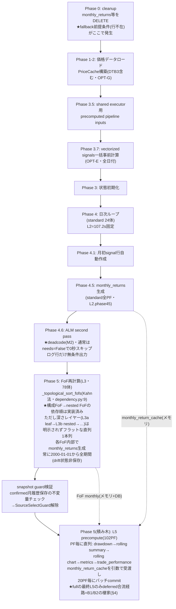
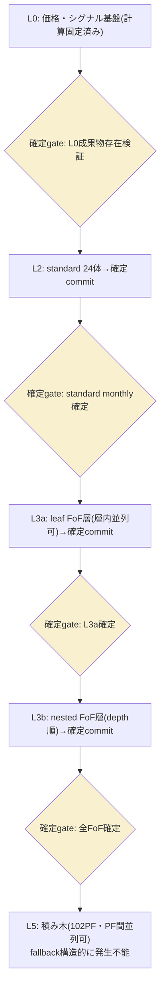

<!-- gist-master: 2d1e7458976b45751cebbffd8c118fa3 dm-production-issues-asis-tobe-5w1h_20260810.md -->
# DM-Signal本番問題群 補填設計書 — AsIs/ToBe/5W1H v2.0

- 作成: 2026-08-10 14:16 JST(将軍直轄) / v2.0再構築: 2026-08-11 15:55(殿指示「覚醒して再構築せよ」)
- 位置づけ: 月次リターン基本原理設計書v6.13の**補填**。v6本文は変更しない。本番問題群の修復レーンの正本
- 再構築方針: **現在有効な工程・裁定・在庫を前面**に置き、完了済み経過は§8歴史へ圧縮(情報は削らず参照で残す=リンク先なき圧縮禁止)

## §1. 現在地(2026-08-11 15:55)

**本番は「確実に計算できた状態」へrevert済み(12:45 Live)。fullは封印中。表示欠損5件(M4-M8)+full固有バグ2件(B1/B2)の掃討が走行中。**

| レーン | 状態 |
|---|---|
| 本番コード | revert deploy済み(dep-d9t9kp9s, commit 03133653)。backend/scripts treeは実績SHA 6908c5c8(552秒run時点)と一致。health 200・重複起動停止を一次確認済み(12:46) |
| fallback(旧病態) | **根絶維持** — n=157/11.3s→n=0を本番実測(12:48試験窓でも再確認。残余はDM-safe n=17等の正当な端数のみ) |
| full封印 | **殿裁定12:41: 確信(再現ゼロ+発火条件の因果説明)が立つまでfullrecalculateはやらない** |
| B1/B2(full固有バグ) | ログ一次証明済み(15:27)+修正実装done(才蔵)・経路検証待ち → §4 |
| M4-M8(表示欠損) | 5レーン並列: 実装done4件+実装中1件 → §5台帳 |
| SIGNAL CHANGE突合 | 累計1,748件を最終checkpoint台帳へ積載(殿裁定02:48: 途中の正否調査禁止) → §7 |

## §2. 現行有効の殿裁定(上書き済みのものは除外)

| 時刻 | 裁定 | 効力 |
|---|---|---|
| 08-10 21:17-21:29 | **S5.6回転プロトコル**: 計算速度レーンが全レーン先頭。家老がハブ(検証ループを手から離さない)、忍者=非同期修正工場、定刻発車(完成分だけ載せる)、1周ごとに数値1行報告 | 恒久(instructions/karo.md L148-176焼込済) |
| 08-10 21:41/21:43 | ログのリアルタイム監視禁止(完了時1回確認)。1体の数字で全PF線形外挿禁止(キャッシュでPFが増えるほど加速) | 恒久 |
| 08-11 02:48 | **理論ベース**: 改良途中の正否調査は手戻りで無駄。全量突合(102PF vs run232 baseline)は改良完遂後の最終checkpointで一回のみ | 恒久 |
| 08-11 04:59 | **ToBe(層確定カスケード)は保留**。AsIs枠組みでfullrecalculate **300秒切り**が当面目標。ToBe着手は殿の明示下知のみ | 現行 |
| 08-11 12:38-12:43 | 最速は健全SHAへの**即revert**。revertは本番deployまで完遂し一次確認3点(Live SHA一致/health/重複停止)必須 | 実行済み |
| 08-11 12:41 | 工程=①即revert→②1/5/10PF段階再現→③発火条件を絞って根治。**確信が立つまでfullをやらない** | 現行(①②完了・③走行中) |
| 08-11 13:16 | Codex CLI忍者のCTX高使用率は懸念不要(auto compactが早い)。Claude CLIとCodex CLIは違う | 恒久 |
| 08-11 15:30 | **バグの原因は「fullと部分runの経路差分」にある**。検証は部分runでなくfull固有経路(deferred合流)の発火条件で行う | 現行(B1/B2検証の規範) |
| 08-10 19:43/19:57 | **UI統治**: UI/UXは殿専権・忍者判断のUI変更禁止。裁定板artifact(e9e784ab)で殿がfix→裁定原文をACへ引用したtaskのみ実装可 | 恒久 → §6 |
| 08-11 01:18 | benchmark(SPY等)もOtO/CtCトグル追従。benchmark drawdown_open欠落は正常ではなくバグ | 恒久(M5の仕様根拠) |

## §3. 速度: 300秒切りへの現在値

- **確実な実測床**: 552秒(run id=254・JST07:20・静穏条件・現revert版と同一tree)。300秒まで**あと約250秒**。
- 833秒run(id=255)は不採用 — 家老帰属検分(12:22): browser 655リクエスト+cold precompute重複3本の併走環境であり同条件比較不能。全層同時悪化(+49/+143/+45/+35秒)=commit単独回帰と不整合。
- **支配項=L3(FoF 78体・直列・前回実測304秒=55%)**。次点L2=102-151秒(固定)、L5=60秒目標(1/5/10PF実測でwarm時1PF 2.3-9.1秒級・増分逓減3.6秒/PF)。
- 巻き戻したL3改良群(deferred flush 132s短縮等)は、B1/B2根治後に**1commitずつ再適用→10PF検証→次**で積み直す(§4の根治が前提)。
- 1体基準値(08-10深夜実測): L2=10.7s / L3=8.92s(leaf FoF) / L5=1.4-5.65s。

## §4. B1/B2: full固有のL5合流バグ(15:27ログ一次証明済み)

**殿原則(15:30)**: 1/5/10PFで起きずfullでだけ起きる — **差分に原因がある**。差分は特定済み: 部分run=L5をinline実行(バグの通り道なし)、full=最終L5だけがdeferred合流経路を通る。

| # | 症状 | 証明(run 20260811054947D282ED) | 原因分岐 |
|---|---|---|---|
| B1 早期完了 | summaryがTOTAL 9m20sで閉じるがL5はその後も24/102→102/102と15分継続(L5行なしのsummary) | 05:59:08 summary vs 06:14:46 L5_COMPLETE(elapsed 1411s) | 本体最終L5が既存cross-process lockへ合流(raw_precompute_deferred)する際、合流generationを**awaitせずsummary/statusを閉じる** |
| B2 直列重複 | 第一世代完了直後に同一all-scope第二世代の全量L5を開始 | 06:14:46 "request arrived during generation=1; draining next generation" | _drain_queueが完了scope=None(all)で実行中到着要求を**充足済み判定せず**次generationへ残す |

- 対照(健全形): 10PF run 20260811045510はinline L5→L5_COMPLETE→L5行付きsummaryの正順。
- **修正**: cmd_karo_hotfix_full_l5_join_await(才蔵)実装done。coalescing+advisory lock+cross-process single-flight(b0e7e85f, bc7a0cc3)も影丸が実装済み。
- **検証規範(殿原則15:30の適用)**: 部分runのPASSは経路を通らないだけで証明にならない(LS-A24)。deferred合流経路が実際に発火する条件(実行中lock保持状態でall-scope要求投入の最小fixture、またはfull)でB1/B2消滅を二値確認。**この再現ゼロ=full解禁の条件**。
- 副次効果: 833秒回帰の「併走負荷」の正体もB2の疑いが強く、根治で計測の静穏条件も安定する。

## §5. M4-M8: 表示欠損・不整合の掃討(進捗正本=本表。更新は将軍)

**共通仮説**: revert後の部分再計算による生成物の欠損・汚染。クローズ条件(各件)=原因特定→修正→deploy→**殿の画面で表示正常確認**の4段。

| # | 症状 | 状態(15:45) | 担当/task | 根因(判明分) |
|---|---|---|---|---|
| M4 | Compare Summary: Up/Down Cap非表示 | **実装done・レビュー/deploy待ち** | 影丸/display_missing_m4_m7_202608111342 | up_capture実装はHEAD現存(8月以降変更0件)→データ/生成系 |
| M5 | Drawdown: SPY(ベンチ)%非表示 | **実装完了・deploy待ち**(AC2=deploy後検証のみ残) | 小太郎/m5_benchmark_drawdown_202608111348 | SPYのOPEN系列0/2欠落→cache key benchmark-open-v1で是正(commit 6dfa8265・tests 6/6) |
| M6 | monthly trade: FoFの8月以前非表示(standardは表示あり) | **未解消(殿再観測17:13)** — B3修正で拒否は止まっても過去に拒否され保存されなかった履歴は**再生成runまで戻らない**。手順: B3 Live確認→FoF代表PFのAPI機械確認→FoFスコープのmonthly_trade再生成で充填→殿画面確認(家老へ指示済みmsg_171419) | 疾風/m6+才蔵/B3+再生成run | **B3(下記)が真因候補**: validatorが正常履歴を誤拒否→保存されず表示欠損。直近30分の拒否ログ0件(17:14将軍実測) |
| (新)B3 validator完全性判定バグ | monthly_trade完全性判定が複数PFのL5 raw更新を誤拒否(IncompletePortfolioRaw) | **hotfix配備済み(16:15)** — 本番full同時検証で発見。builderは長期履歴を返すがvalidatorがtop-level entries数を要求履歴件数と誤比較。fullは継続し横断証拠収集中 | 才蔵(payload形状+limit単位の一次確認→真の欠損だけ拒否する修正) | validator比較単位の誤り(entries数≠履歴件数) |
| M9 dashboard MTD 8/10確定様表示 | 未確定の8/10がpreliminaryマーカー(薄色+⚡+脚注)なしで確定様に表示 | **実装done(17:39 commit b0e13e94)・レビュー/deploy待ち** — 根因確定: M8修正(4db556f7)が同日速報行を捨てる副作用。共通helperで衝突行を速報行へ置換(serial/batch両経路)。fixture実測: rows=2/duplicate 0/8-10 preliminary=true/8-07 confirmed=true。テスト7/7+21/21+14/14。FE変更なし | 飛猿/m9_preliminary_202608111739 | M8修正の副作用+BE判定欠落 |
| M10 monthly return: ticker別8月リターンが一部のみ表示 | 全tickerの8月リターンが表示されるべき | **配備指示済み(18:53 msg_185315)+将軍一次確認で範囲絞り込み(18:54)**: 殿仮説(price取得欠損)を本番DB readonlyで棄却 — prices 8月行数は全13銘柄均一6行・MAX(date)=8/10で欠損ゼロ。∴原因は生成層(ticker別MTD/expansion cache)か表示層に限定。M7レーンと統合可 | M7レーン統合(家老編成) | 供給層は健全(実測済み)。生成/表示層の欠損 |
| M7 | monthly trade: 8月リターン/price movement非表示 | **実装done・レビュー/deploy待ち** | 半蔵/m7_current_mtd_202608111348 | 当月行データ欠損(MTD expansion cache系) |
| M8 | dashboard: MTD Daily Returns 8/10重複表示 | **実装done・レビュー/deploy待ち** | 飛猿/m8_mtd_duplicate_202608111348 | precompute重複起動期間の二重INSERT残骸の疑い(B2と接続) |

### 未着手の改善候補(実装は別途下知待ち)

| # | 件名 | 要点 |
|---|---|---|
| M1 | pending表示の意味論乖離 | pending=当月リターン未確定の意。保有シグナルは確定 — 表示範囲の限定をUI裁定板で殿がfix(02:39) |
| M2 | ALM deadcode残存 | ディスコン後もrecalculate_fast.pyに一式残存。`Phase 4.6: Start ALM second pass`ログは無条件マーカー(実行時のみ`[ALM] Starting…`)。除去はPhase 2候補cache計算も消しL3高速化に寄与(03:37) |
| M3 | SIGNAL CHANGE CRITICALログ冗長 | 同一(pf,date)反復CRITICALは情報量ゼロ。実害実証13:00(ログ窓400行が埋没)。初回のみCRITICAL/サマリ化へ降格。P4ログ契約レーン(03:40) |

## §6. UI統治と裁定済みUI(恒久規範)

- **統治ルール(殿裁定19:43)**: UI/UXは殿専権。無裁可変更は棚卸し→裁定板artifact(https://claude.ai/code/artifact/e9e784ab-f4e7-47a3-96e3-e9174c07ebcc)で殿がfix→裁定原文をACへ直接引用したtaskのみ実装可。
- 裁定6件(19:57): UI-1「✓確定」ラベル削除 / UI-2 保有カード削除 / UI-3 FoF monthly trade非表示=バグ(→M6へ発展) / UI-4 正仕様=8月初回取引日終了後の再計算で全confirmed / UI-5 SPY drawdown=バグ+01:18仕様(benchmarkもOtO/CtCトグル追従)(→M5へ発展) / UI-6 棚卸し続行。
- 08-11 11:57裁定: Monthly Returns当月行の「暫定(as_of)」注記削除+文字色を他行と同一に(小太郎実装済みレーン)。
- 実装規律: 既存を厳密踏襲し指示された最小差分のみ(LS104)。変更前後の表示突合+回帰FAIL0。

## §7. SIGNAL CHANGE突合台帳(最終checkpoint行き)

殿裁定02:48により途中の正否調査は禁止。改良完遂後に全102PF vs backup/run232 baselineの全量突合を一回だけ実施。

| 時刻 | 件数 | 帰属(理論ベース) |
|---|---|---|
| 08-10 13:38 | 562件/32PF | γ4是正由来(P2系) |
| 08-11 02:29 | 86件/7PF | L3/L5改良run由来 |
| 08-11 03:59 | 111件/1PF | 同上 |
| 08-11 10:51 | 4件/2PF | 同上(収束傾向) |
| 08-11 12:53 | 707件/2PF | **revert版による改良期署名の旧値書き戻し(逆流)** |
| 08-11 13:27 | 246件/2PF | 同逆流 |
| 08-11 14:59 | 32件/2PF | 同逆流(707→246→32と逓減=収束末期) |
| **累計** | **1,748件** | 突合は最終checkpoint一回のみ |

## §8. 歴史(完了・上書き済みの経過。詳細は改訂履歴の各版とgit履歴参照)

- **P1速度回帰(51分事案)**: dataframe_prep 730倍回帰特定(cmd_4293)→nav_frame_cache修正(fdbf3022)→S5.6回転プロトコル→S5.7工程(L0/L1確定→L2固定107.2s→L3/L5二正面)→改良多数(fallback根絶198fc455・L5 builder None 3件根治・cache計装・L3a leaf-scope修正)→**08-11昼にL3改良群を含むtreeで回帰疑い→殿裁定で実績SHAへrevert(12:45)**。改良はB1/B2根治後に1commitずつ再適用する(§3)。
- **fallback根絶の経緯**: 病態=monthly行参照のcacheキー(as_of成分)不一致で常時miss→動的再計算157回/11.3s。順序仮説・下層データ不在仮説はコード現物で棄却(monthly生成→trade_perfの順序は元から正、トポロジカル順も実装済み=P6-AsIs図)。キー経路修正で本番n=0実測。
- **P2 γ5 cutover**: 影丸partition確定(562件全てγ4 replay範囲外)→半蔵が頭打ち原因確定(config_max=2026-07-02)→config延伸replay→**cutover・本番write停止維持のまま本レーンは中断中**(高速回転レーン優先の殿裁定)。再開時はbackup4点(manifest実パス/DB同一性/cutoff/restore rehearsal)必須。
- **v6設計書の検討不足知見(K1-K7)**: 過渡期FE表示の契約欠落/alert期待集合の事前契約欠落/速度予算欠落/UI状態表示仕様欠落/表示粒度仕様欠落/検証がバグ経路を実行する保証の欠落/CI性能回帰検知欠落。共通構造=「計算の正しさ」は完備だが**運用面(時間・過渡状態・表示・alert対応)を設計対象から落とした**。次の設計書は「殿がその日どの画面を見て何を確認できるか」を第一級対象にする。還流先=軍師SGレビュー観点(起票は殿下知後)。
- 軍師レビュー10件(v0.3)は全件反映済み。

## §9. P6. fullrecalculate計算順序フロー(現役参照図)

### P6-AsIs: 現行フロー(コード現物・2026-08-11 main)

読み取れた事実: (1)monthly保存→trade_performanceの順序は元から正 (2)構成FoF先行も実装済み (3)fallback真因は順序でなくキー不一致(根治済み) (4)深さレイヤーの明示不在=層内並列・L3a/L3b分割実行の構造化余地 (5)最適化候補: ALM除去(M2)/FoF drift状態保存/L5並列化/FoF層内並列。

### P6-ToBe: 層確定カスケード(殿提案04:47・**保留中=殿裁定04:59**)

各層完了時に成果物を確定commitし、上層は確定済み下層のみ参照(確定gate・fail-fast)。fallbackは発生条件ごと根絶しERROR検知器へ転換。層単位検証・層内並列・部分再計算が同一構造から出る。中間段=「深さ順グルーピング」(結果不変・低リスク)も検討済み。段階着手時の第一歩は最下層でなく**最重量層(L3a層内並列)**から(偽陰性回避)。見込み: N=4並列で約200s、N=8で約150s(vCPU実数が上限・要確認)。

## 改訂履歴
- v2.0 (2026-08-11 15:55): **全面再構築(殿指示「覚醒して再構築せよ」)** — 現在地§1/現行裁定§2/300秒現在値§3/B1/B2§4/M4-M8台帳§5/UI統治§6/突合台帳§7を前面化し、完了済み経過(P1の51分事案工程S0-S6・P2 γ5中断・K1-K7知見・fallback経緯)を§8歴史へ圧縮。P6図は現役参照として保持しB1/B2の棲家を追記。上書き済み裁定(S5.7のL2磨き等)は§2から除外し§8とgit履歴に保存。情報の削除なし(圧縮+参照)。
- v1.7 (2026-08-11 13:40): P5棚へM6/M7追加(殿修正指示13:39)+M8追加(13:42)。
- v1.6 (2026-08-11 13:38): P5棚へM4/M5追加+M3実害実証追記。
- v1.5 (2026-08-11 04:52): P6-ToBe mermaid図追加(AsIs/ToBe並置)。
- v1.4 (2026-08-11 04:48): P6-ToBe層確定カスケード追加(殿提案04:47)。
- v1.3 (2026-08-11 04:42): P6計算順序フロー(mermaid)新設(殿指示04:39)。
- v1.2 (2026-08-11 03:43): P5改善候補メモ棚新設(M1-M3)。
- v1.1 (2026-08-11 01:22): UI-5誤読源の訂正(殿裁定01:18)。
- v1.0 (2026-08-11 00:02): S5.7工程確定と改訂。
- v0.9 (2026-08-10 21:35): S5.6回転プロトコル確定。
- v0.8 (2026-08-10 20:26): S5.5運用モデル+殿裁定20:21。
- v0.7 (2026-08-10 20:02): P3全面改訂(UI統治+裁定6件)。
- v0.6 (2026-08-10 17:05): S2.5追加ほか午後の確定事項。
- v0.3 (2026-08-10 14:32): P2二重判定再設計+軍師所見10件反映。
- v0.2 (2026-08-10 14:25): 修正手順(S系)+二値確認(C系)追加。
- v0.1 (2026-08-10 14:16): 初版(P1-P4+K1-K6+進捗台帳)。
