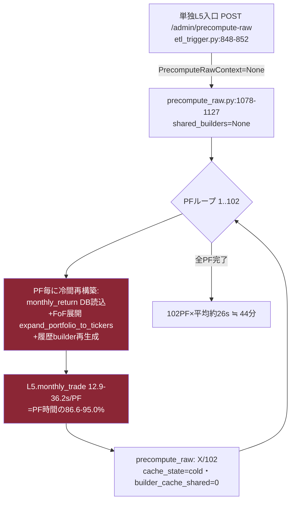
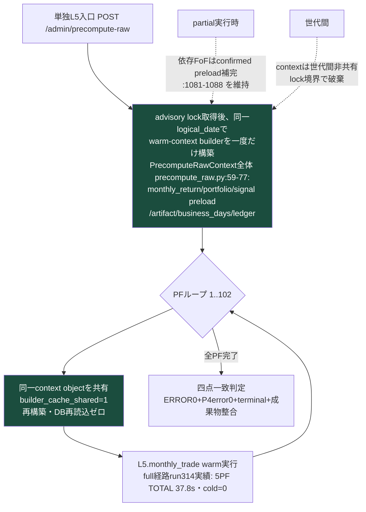
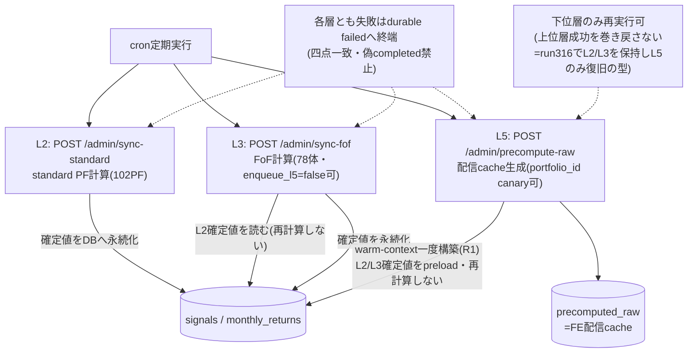
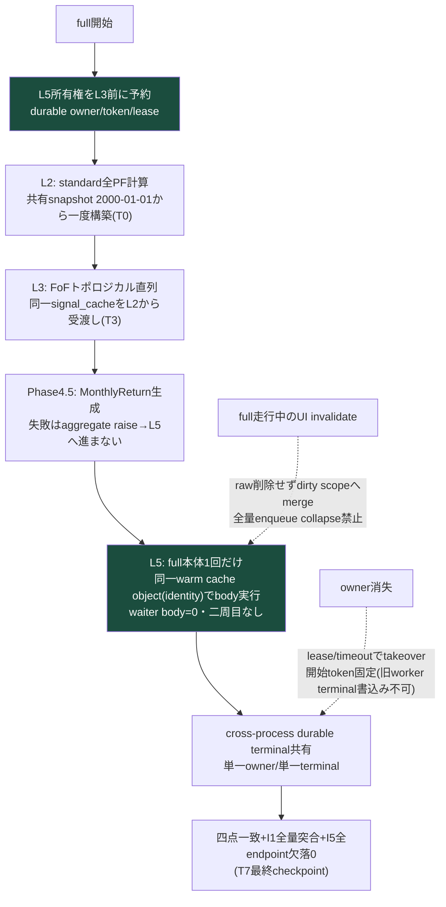

<!-- gist-master: 42d6311b00c806ac9371d6f87df444ee dm-production-recovery-v3_20260813.md -->
# DM-Signal本番復旧 v3.0 — 最新状況フォーカス版
<!-- semantic-links: [[recalculate_pipeline]] [[production_parity]] -->

- 作成: 2026-08-13 00:23 JST(将軍直轄・殿指示「複雑になりすぎた。最新状況にフォーカスしたver3.0を新規作成しよう」)
- 位置づけ: `dm-production-issues-asis-tobe-5w1h_20260810.md`(v2系・gist 2d1e7458)の**後継**。v2系は歴史正本として凍結参照(情報削除なし)。**以後の進捗更新は本書のみ**
- 歴史参照: 経緯・全裁定・As-Is/To-Be図の原本 → v2系§9.0/§10/改訂履歴(v2.0-v2.36)

## §0. 不変事項(ここが正。矛盾したら本欄が勝つ)

1. **優先順位**: 高速化=バグ修正を高速回転する手段。**full全量バグ露出→計算/API/UI/DB完全正常化→正常化後のみ速度改善**(殿18:07)
2. **run成功=四点一致**: DB completed単独判定禁止。ERROR 0+P4_TIMING_ERROR 0+terminal成功(TIMING SUMMARY)+成果物整合(monthly_returns>0・L5はPhase4.5成功後のみ)
3. **parity禁止**: バグを含む現本番値との一致を完了基準にしない(殿19:58)。判定=To-Be不変量+正しいoracle。非対象のみ変更前後不変
4. **修正方式の型**: 実測As-Is=Start/To-Be=Goal固定→差分のみ実装→実装後As-Is図更新→**To-Beとの構造一致=完了**
5. **cache一本原理**: 唯一のLazySignalArtifactCacheをL2→L3→L5→trade_perfまでidentity同一で受渡し。「上流で計算済みのものは再計算しない」(殿15:06)。旧値比較・SIGNAL CHANGE生成はhot pathから撤去(殿12:52-12:55)
6. **L2/L3は再実行しない**。復旧はL5入口(`POST /admin/precompute-raw`)のみ。`recalculate-sync`再実行禁止

## §1. 現在地(2026-08-13 00:23 JST)

**run316(full)でL2/L3は完全復旧、残るのはL5配信cacheのみ。**

| 層 | 状態 | 一次数値 |
|---|---|---|
| L2 | ✅復旧 | 102PF・85.0s・standard 24/24・monthly 24/24・失敗0 |
| L3 | ✅復旧 | 78FoF・204.6s・FoF monthly 78/78・失敗0 |
| L5 | 🔴未復旧 | failed=102・rows=0(Missing holding_signal in expansion cache)。属性伝播修正730f3632=23:39 Live・focused 55/55 PASS |

**L5の遅さの真因(三者一致: 将軍生log分析=家老現物照合=殿00:12)**:
- L5.monthly_tradeがPF時間の86.6-95.0%(実測27-31/102: 12.9-36.2s/PF)
- 単独L5入口(etl_trigger.py:848-852)が**PrecomputeRawContextなし**→precompute_raw.py:1078-1127がshared_builders=NoneでPF毎に履歴+FoF展開を冷間再構築(全PF builder_cache_shared=0)
- full経路(recalculate_fast.py:3605-3621)は配管済み — **単独経路だけ素通り**

## §1.5 As-Is/To-Beフローチャート(R1=L5 warm-context配管。修正方式の型: As-Is=Start/To-Be=Goal)

### As-Is(実測run実証・全PF cold)

### To-Be(R1実装後=Goal・full経路と同じwarm受渡し)

完了判定=実装後にAs-Is図を現コードへ更新し、本To-Be図と構造一致すること(§0(4))。

### 実行形態別To-Be① — cron層別実行ver(各層独立入口・上流確定値を再計算しない)

### 実行形態別To-Be② — fullrecalculate ver(P6根治コードLive・run314で5PF実証済み)

## §2. 走行中タスク(これだけ見る)

| # | タスク | 担当 | AC(二値) | 状態 |
|---|---|---|---|---|
| R1 | **L5 warm-context配管**: 単独L5入口で既存warm-context builder(context全体=monthly_return/portfolio/signal preload/artifact/business_days/ledger、precompute_raw.py:59-77)を呼ぶ。罠3点: ①共有対象=context全体 ②advisory lock後に同一logical_dateで一度構築・世代間非共有 ③partial時の依存FoF confirmed preload補完(:1081-1088)維持 | 家老レーン(GO済みmsg_001531) | builder_cache_shared=1化+同一PF群でmonthly_trade前後実測短縮+出力一致 | 配備中 |
| R2 | 問題PF(015e74dc)のL5単独canary→PASS後にL5全102PF | 家老 | canary四点一致→全件failed 0 | R1後 |
| R3 | pre-history WARNING 28件の全数分類(真正欠損か正当pre-historyか) | 飛猿系 | 全数分類+真正欠損0または修正 | 走行中 |
| R4 | 10PF canary→full再発進(P6根治コードLive済み: durable owner/token/lease/scope/terminal・c9c21acd+dee70369) | 家老 | §9.0二値AC(waiter body 0・偽completed 0・単一owner/単一terminal) | R2/R3後 |
| R5 | T8: ledger再構築+監査の別実行レーン復活(正baseline確立後) | 未着手 | v2系§10.1 T8参照 | full成功後 |

## §3. 完了済み(直近の主要成果のみ・詳細はv2系)

- P6 L5根治=本番Live(full owner予約・cross-process durable terminal・scope merge・MTD欠損failure伝播)。真の5PF run314でL5 body=1・cold=0・shared 5/5・TOTAL 37.8s
- 偽成功三経路根治(Phase4.5握り潰し/monthly_trade WARNING化/L5一般失敗正常return)
- run296根因(基準日不一致の境界NULL)=97c11c91で根治(hole 0/5780・敵対68テスト生存)
- 独立第二cache(signal_valid_dates_cache)削除=refs 16→0

## §4. 検証の型

- canary回転: 1commit→deploy→同一PF群→四点一致判定→数値1行→全層再計測
- 報告数値は受け手が最低1点自分のコマンドで再実行して突合(LS-A09(41))
- 数値4規律: 集計コマンド併記・出力生貼付・1件の定義・網羅範囲明示

## 改訂履歴
- v3.1 (2026-08-13 00:37): §1.5新設(殿指示00:35) — R1のAs-Is/To-Be図+実行形態別To-Be2図(cron層別ver・fullrecalculate ver)。家老レビュー依頼中。
- v3.0 (2026-08-13 00:23): 新規作成。v2系(v2.0-v2.36)の現役情報のみ抽出。歴史はv2系凍結参照。
