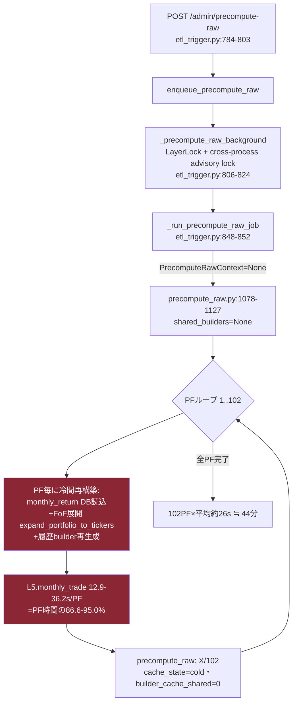
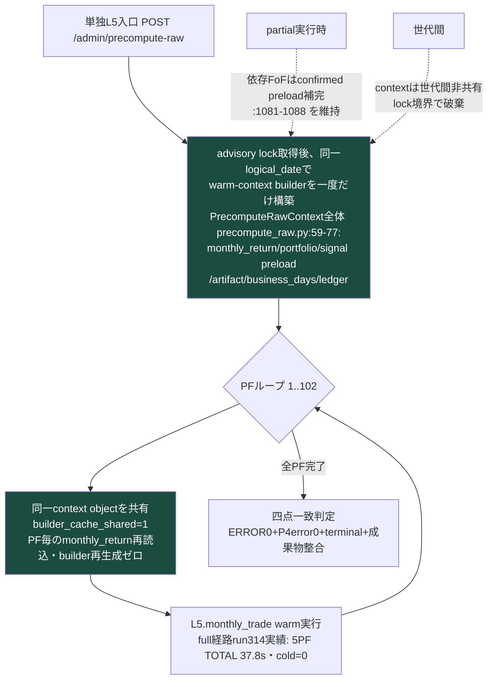
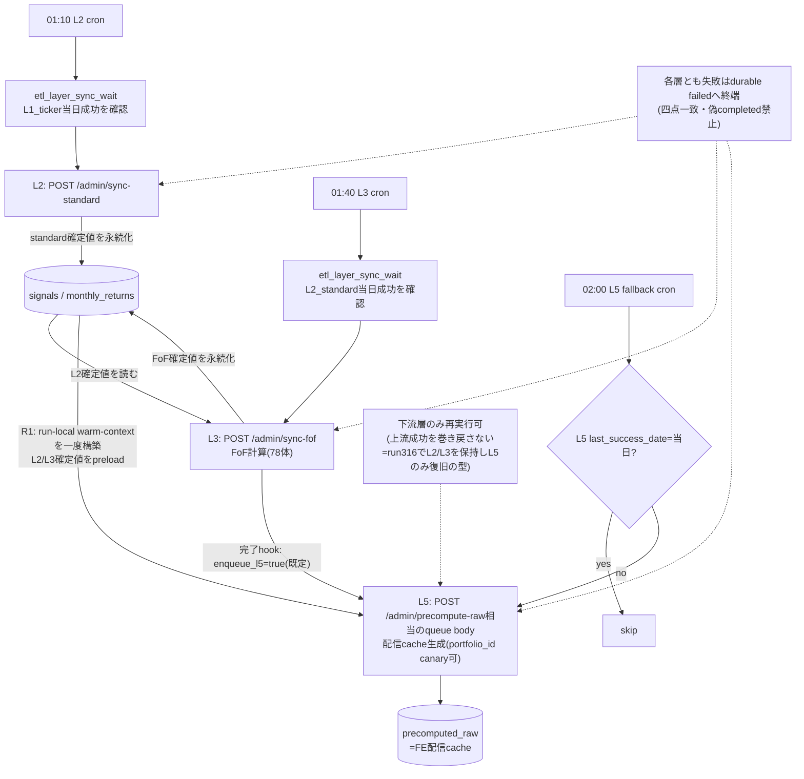
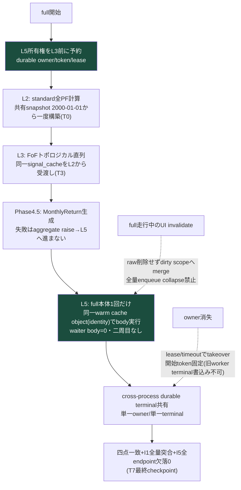

<!-- gist-master: 42d6311b00c806ac9371d6f87df444ee dm-production-recovery-v3_20260813.md -->
# DM-Signal本番復旧 v3.2 — 最新状況フォーカス版
<!-- semantic-links: [[recalculate_pipeline]] [[production_parity]] -->

- 作成: 2026-08-13 00:23 JST(将軍直轄・殿指示「複雑になりすぎた。最新状況にフォーカスしたver3.0を新規作成しよう」)
- 位置づけ: `dm-production-issues-asis-tobe-5w1h_20260810.md`(v2系・gist 2d1e7458)の**後継**。v2系は歴史正本として凍結参照(情報削除なし)。**以後の進捗更新は本書のみ**
- 歴史参照: 経緯・全裁定・As-Is/To-Be図の原本 → v2系§9.0/§10/改訂履歴(v2.0-v2.36)

## §0. 不変事項(ここが正。矛盾したら本欄が勝つ)

1. **優先順位**: 高速化=バグ修正を高速回転する手段。**full全量バグ露出→計算/API/UI/DB完全正常化→正常化後のみ速度改善**(殿18:07)
2. **run成功=四点一致**: DB completed単独判定禁止。ERROR 0+P4_TIMING_ERROR 0+terminal成功(TIMING SUMMARY)+成果物整合(monthly_returns>0・L5はPhase4.5成功後のみ)
3. **parity禁止**: バグを含む現本番値との一致を完了基準にしない(殿19:58)。判定=To-Be不変量+正しいoracle。非対象のみ変更前後不変
4. **修正方式の型**: 実測As-Is=Start/To-Be=Goal固定→差分のみ実装→実装後As-Is図更新→**To-Beとの構造一致=完了**
5. **cache一本原理**: 唯一のLazySignalArtifactCacheをL2→L3→L5→trade_perfまでidentity同一で受渡し。「上流で計算済みのものは再計算しない」(殿15:06)。旧値比較・SIGNAL CHANGE生成はhot pathから撤去(殿12:52-12:55)
6. **L2/L3は再実行しない**。復旧はL5入口(`POST /admin/precompute-raw`)のみ。`recalculate-sync`再実行禁止

## §1. 現在地(2026-08-13 00:40 JST)

**run316(full)でL2/L3は完全復旧、残るのはL5配信cacheのみ。**

| 層 | 状態 | 一次数値 |
|---|---|---|
| L2 | ✅復旧 | 102PF・85.0s・standard 24/24・monthly 24/24・失敗0 |
| L3 | ✅復旧 | 78FoF・204.6s・FoF monthly 78/78・失敗0 |
| L5 | 🔴未復旧 | failed=102・rows=0(Missing holding_signal in expansion cache)。属性伝播修正730f3632=23:39 Live・focused 55/55 PASS |

**L5の遅さの真因(三者一致: 将軍生log分析=家老現物照合=殿00:12)**:
- L5.monthly_tradeがPF時間の86.6-95.0%(実測27-31/102: 12.9-36.2s/PF)
- 単独L5入口(etl_trigger.py:848-852)が**PrecomputeRawContextなし**→precompute_raw.py:1078-1127がshared_builders=NoneでPF毎に履歴+FoF展開を冷間再構築(全PF builder_cache_shared=0)
- full経路(recalculate_fast.py:3605-3621)は配管済み — **単独経路だけ素通り**

## §1.5 As-Is/To-Beフローチャート(R1=L5 warm-context配管。修正方式の型: As-Is=Start/To-Be=Goal)

### As-Is(実測run実証・全PF cold)

### To-Be(R1実装後=Goal・full経路と同じwarm受渡し)

完了判定=実装後にAs-Is図を現コードへ更新し、本To-Be図と構造一致すること(§0(4))。

## §1.6 本番L5完走後の成果物検分（2026-08-13 01:10 JST）

**terminalは成功したが、成果物はFAIL。`completed`を復旧完了として扱わない。**

### L5 terminal一次証跡

| 項目 | 本番DB実測 |
|---|---:|
| `recalculation_timings.id` / `run_id` | `2038` / `20260812_145811` |
| operation / mode / status | `precompute_raw` / `l5` / `completed` |
| 対象 / 書込 / failed | 102 PF / 1533 rows / 0 |
| 時間 | 2396.88秒（39分56秒） |
| started / finished (UTC) | 2026-08-12 14:58:11 / 15:38:08 |

### FAIL-1: Monthly Tradeのticker別Price ReturnがFoF全件で消失

本番`precomputed_raw(endpoint='monthly_trade', limit=0)`を全102 PFで全数集計した。

| PF種別 | PF | `total_count`合計 | materialized entries | Price Returnあり | entry≦1のPF |
|---|---:|---:|---:|---:|---:|
| standard | 24 | 4,737 | 4,737 | 4,713（残24はMTD） | 0 |
| FoF | 78 | 13,668 | **78** | **0** | **78** |

- FoFは全78体で過去履歴が欠落し、当月MTD相当の1行だけ。`price_movement=null`のため、画面からticker単位Price Returnが消え、月次リターンをticker価格SSOTから検算できない。
- 以前の正規状態は、Monthly Trade画面が構成tickerごとのPrice Returnを表示し、`prices`から月次リターンを独立検算できること（殿確認01:01-01:06）。これを復旧ACとする。
- 関連する既存変更: `bbcc27f5`（2026-08-11 16:31 JST）は、旧「`total_count`に対してentriesが不足すればincomplete」を、**entriesが1行あればvalid**へ弱めた。これは疎なFoF成果物をL5成功として受理する直接の穴。producerがFoF履歴を1行へ縮退させる根因は別途確定する。

### FAIL-2: ticker価格SSOT対`monthly_returns`の実値不一致4件

Monthly Tradeにticker価格境界が残るstandard 24 PF・4,713 PF月について、`prices`の開始日/終了日Open・Closeから `Σ(weight × price_return)` を独立再計算した。4,709/4,713一致、**4/4,713不一致**。不一致は全て2026-07。

| PF | ledger保有（表示） | 保存`monthly_return` Close | prices正解 Close | 原因を示す一致先 |
|---|---|---:|---:|---|
| DM2 | XLU 100% | -14.946732% | -0.915791% | 保存値はraw `signal=TECL`の価格収益と完全一致 |
| DM2-test | XLU 100% | -14.946732% | -0.915791% | 同上 |
| DM-safe | GLD 100% | -2.188523% | +0.299510% | 保存値はraw `signal=QQQ,XLU`均等の価格収益と完全一致 |
| DM-safe-2 | GLD 100% | -3.223737% | +0.299510% | 保存値はraw `signal=GDX,QLD`均等の価格収益と完全一致 |

Openも同じ4件が不一致（DM2系: 保存-22.288545% vs XLU正解-2.210433%）。**L2月次計算がraw signalを使用し、Monthly Trade表示はledger holdingを使用している系列分裂**が数値で確定。正解はticker `prices` × 当月実保有（ledger/holding）の積上げ。

### FAIL-3: 全期間metricsの初月リターン欠落

- `load_monthly_as_df()`が`monthly_return`を捨て、累積系列だけを渡す。
- `metrics_impl.py`が`pct_change().fillna(0.0)`で復元するため、初月の実リターンを0%へ置換する。
- 本番全期間metricsは直接月次積と**102/102 PF不一致**。CAGR誤差は低い方向35 PF・高い方向67 PF、平均絶対誤差0.946609ポイント、範囲-3.050541〜+2.860318ポイント。
- 10年窓は102/102一致（誤った初月が窓外に落ちるため）。全期間total return/CAGRと同じ系列を使う幾何平均・算術平均・標準偏差・Sharpe/Sortino等を再生成対象とする。

### FAIL-4: L5 cache衛生（正規key外の残骸）

- 旧drawdowns hash行がactive 102 PF分残存（現versioned hash 102行とは別）。
- 削除済みPF `5bec6843-a3d3-4d46-8cfc-2a9ec26bd294` のraw 15行が残存。
- `portfolio_id IS NULL`のglobal rawはNULL競合が効かず、`compare_returns_bulk` 4行（期待1）、`metrics_summary_bulk` 8行（期待2）へ重複。最新取得規則が曖昧になりうる。

### 復旧AC（本節追加分）

1. FoF 78/78でrequested history（limit=24/0）を満たし、確認済み月の`price_movement`がticker単位で表示される。
2. 全102 PF×全確認済み月で `monthly_return_{open,close} = Σ(actual holding weight × prices return)`、不一致0。
3. 全期間metrics 102/102で直接月次積と一致し、初月非0 fixtureの正負双方を通す。
4. `precomputed_raw`は現行expected key setのみ。orphan 0、obsolete hash 0、global duplicate 0。
5. 上記4項目PASS後にのみL5/runを復旧完了とする。

## §1.7 復帰方針候補 — DB復元ではなくコード復帰（殿訂正 2026-08-13 01:14 JST）

- **戻す単位はコード**。現在の派生DB値はバグコードが生成した汚染データであり、保存・旧値一致・バックアップ復元の対象にしない。
- 維持する入力SSOT: `prices`、economic inputs、portfolio/config、公開・認証設定。正常コードで再生成する派生物: `signals`、`monthly_returns`、metrics/risk/rolling/trade系、`precomputed_raw`。現ledgerも正baselineではないため、正しいfull結果の後に再構築する。
- 第一復帰候補SHA: `21e80e30957d61f5bdfb9ea04bf99b63dda2cfc9`（2026-08-04 00:51 JST）。当時の本番CDP一次証跡=`noData=false`、Monthly Trade `rows=24`、先頭2026-08 XLU。直前の`9a27eb4f`+run223は102/102 PF・monthly_returns 16,874行・API spot 5/5 PASSだったが、その後8月holding異常25 PFが判明したため、コード候補はUI/holding是正後の`21e80e30`を優先する。
- **既知の例外**: 全期間metrics初月欠落の起点`fda736295`（2026-07-11）は復帰候補より古く、`21e80e30`にも含まれる。コード復帰だけではmetricsバグは残るため、復帰後にticker価格oracleで月次系列を0不一致確認してから、初月処理のみを独立した最小差分で直す。
- まだ本番rollbackは未実行。隔離worktreeで`21e80e30`を起動し、現入力SSOTから再生成したcanaryが§1.6 ACを満たすことを確認してから切替える。

### 実行形態別To-Be① — cron層別実行ver(各層独立入口・上流確定値を再計算しない)

### 実行形態別To-Be② — fullrecalculate ver(P6根治コードLive・run314で5PF実証済み)

## §2. 走行中タスク(これだけ見る)

| # | タスク | 担当 | AC(二値) | 状態 |
|---|---|---|---|---|
| R1 | **L5 warm-context配管**: 単独L5入口で既存warm-context builder(context全体=monthly_return/portfolio/signal preload/artifact/business_days/ledger、precompute_raw.py:59-77)を呼ぶ。罠3点: ①共有対象=context全体 ②advisory lock後に同一logical_dateで一度構築・世代間非共有 ③partial時の依存FoF confirmed preload補完(:1081-1088)維持 | 家老レーン(GO済みmsg_001531) | builder_cache_shared=1化+同一PF群でmonthly_trade前後実測短縮+出力一致 | 実装5417194f・focused 30/30 PASS。最新main統合競合2塊を解消中 |
| R2 | 問題PF(015e74dc)のL5単独canary→L5全102PF | 家老 | canary四点一致→全件failed 0→§1.6成果物AC | terminal完走・成果物FAIL（§1.6） |
| R3 | pre-history WARNING 28件の全数分類(真正欠損か正当pre-historyか) | 飛猿系 | 全数分類+真正欠損0または修正 | 走行中 |
| R4 | 10PF canary→full再発進(P6根治コードLive済み: durable owner/token/lease/scope/terminal・c9c21acd+dee70369) | 家老 | §9.0二値AC(waiter body 0・偽completed 0・単一owner/単一terminal) | R2/R3後 |
| R5 | T8: ledger再構築+監査の別実行レーン復活(正baseline確立後) | 未着手 | v2系§10.1 T8参照 | full成功後 |

## §3. 完了済み(直近の主要成果のみ・詳細はv2系)

- P6 L5根治=本番Live(full owner予約・cross-process durable terminal・scope merge・MTD欠損failure伝播)。真の5PF run314でL5 body=1・cold=0・shared 5/5・TOTAL 37.8s
- 偽成功三経路根治(Phase4.5握り潰し/monthly_trade WARNING化/L5一般失敗正常return)
- run296根因(基準日不一致の境界NULL)=97c11c91で根治(hole 0/5780・敵対68テスト生存)
- 独立第二cache(signal_valid_dates_cache)削除=refs 16→0

## §4. 検証の型

- canary回転: 1commit→deploy→同一PF群→四点一致判定→数値1行→全層再計測
- 報告数値は受け手が最低1点自分のコマンドで再実行して突合(LS-A09(41))
- 数値4規律: 集計コマンド併記・出力生貼付・1件の定義・網羅範囲明示

## 改訂履歴
- v3.2 (2026-08-13 01:10-01:14): 本番L5 run `20260812_145811` terminal完走を記録。ただし成果物検分でFoF 78/78のticker別Price Return消失、ticker価格SSOT対monthly return 4/4713不一致、全期間metrics 102/102不一致、raw残骸/重複を確認しFAIL固定。復旧AC5項目を追加。殿訂正により復旧単位をDB snapshotではなくコードへ固定し、派生汚染データは正常コードから全再生成する方針候補§1.7を追加。
- v3.1-review (2026-08-13 00:40): コード現物レビュー。単独L5をAPI→queue→lock→workerの実経路へ訂正、cronを`etl_layer_sync_wait`依存+L3完了hook+02:00 fallbackへ訂正、「全DB再読込ゼロ」をPF毎の対象処理へ限定、R1統合状況を更新。
- v3.1 (2026-08-13 00:37): §1.5新設(殿指示00:35) — R1のAs-Is/To-Be図+実行形態別To-Be2図(cron層別ver・fullrecalculate ver)。家老レビュー依頼中。
- v3.0 (2026-08-13 00:23): 新規作成。v2系(v2.0-v2.36)の現役情報のみ抽出。歴史はv2系凍結参照。
