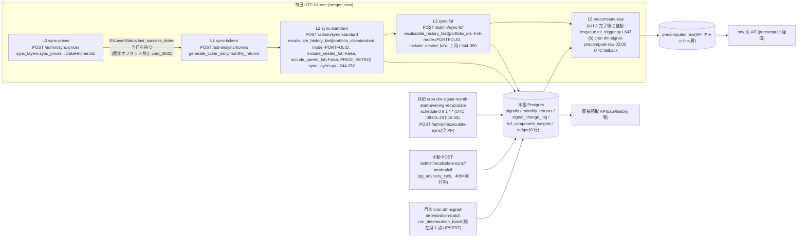
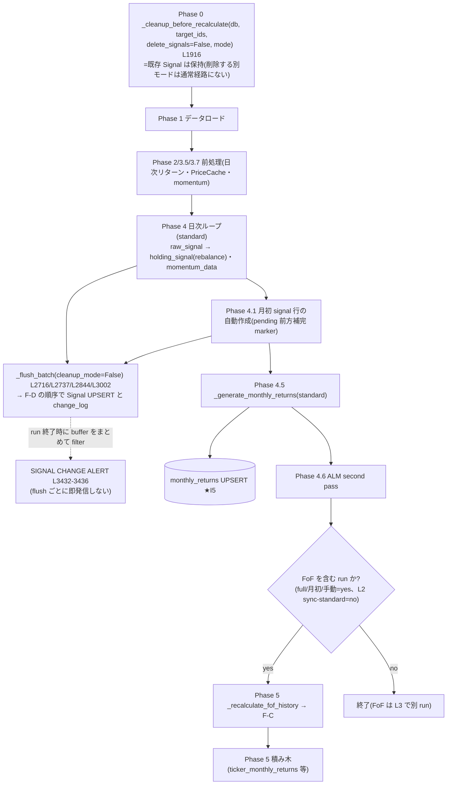
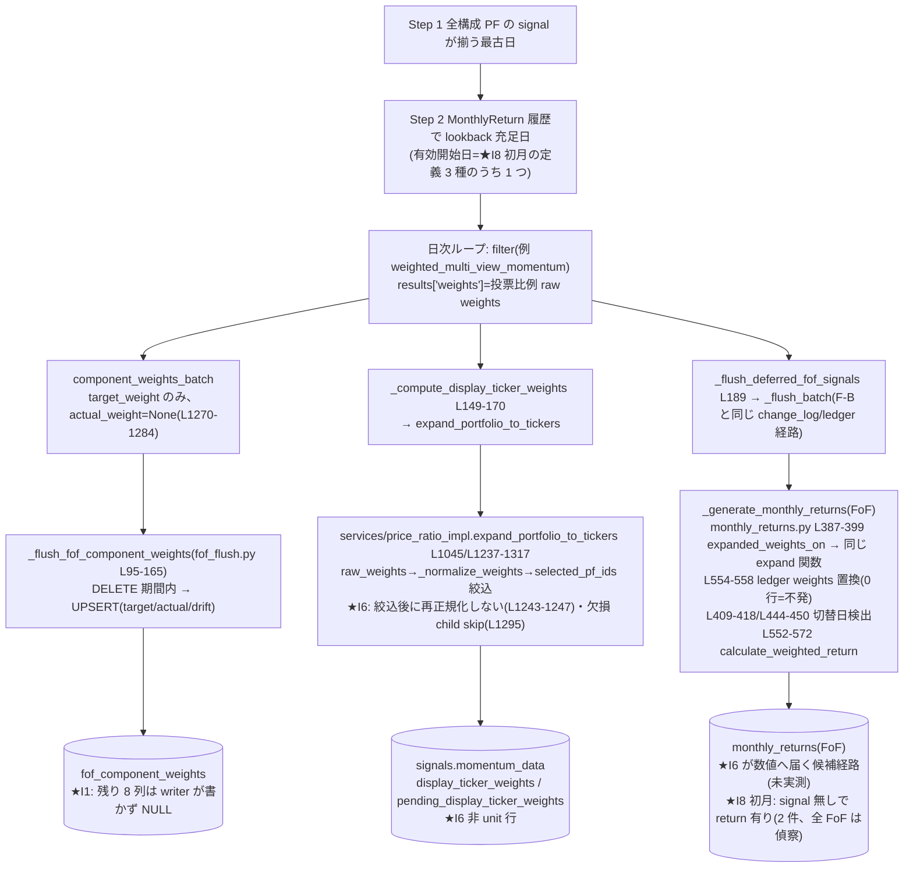
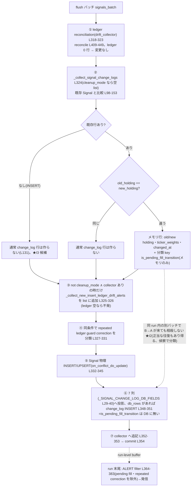
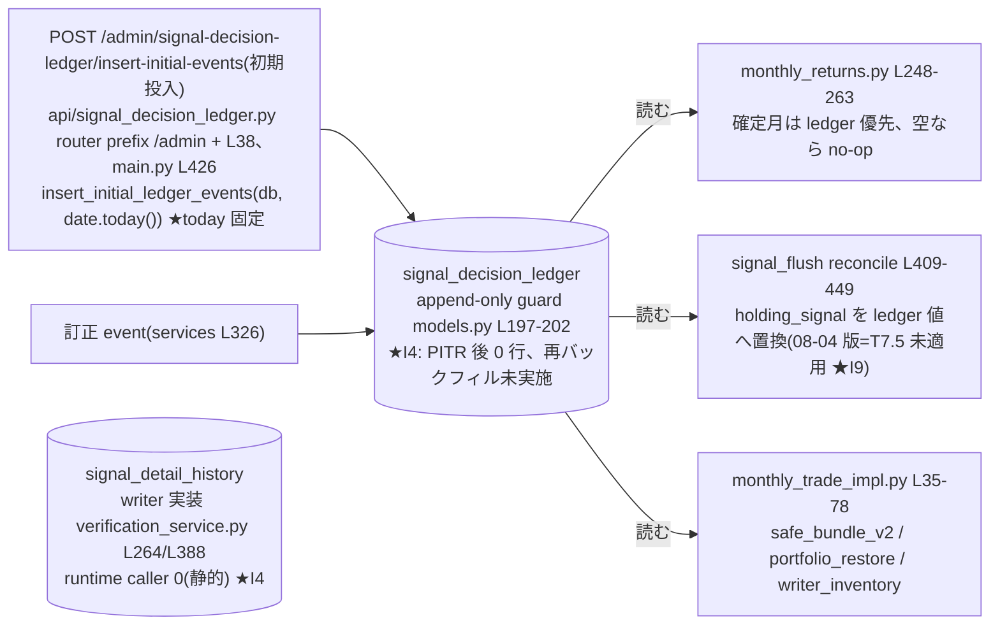
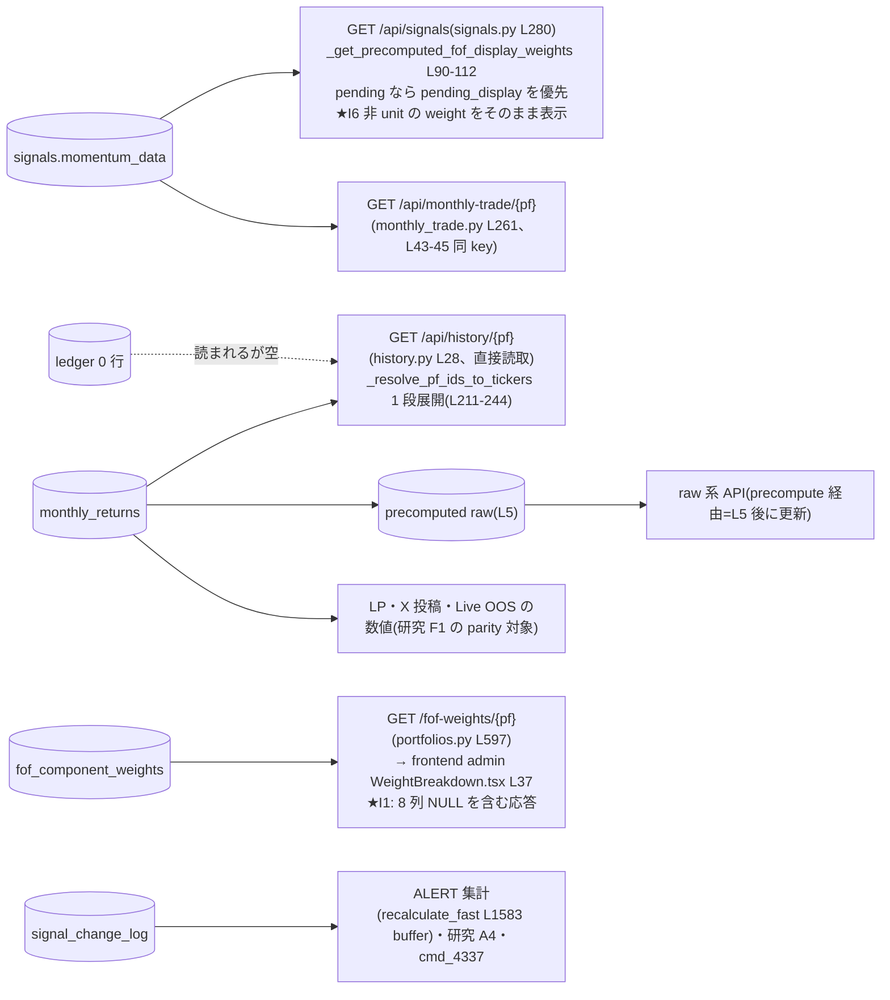

<!-- gist-master: 2f1a3daa07c336c90958b1287245318b dm-signal-production-inconsistency-asis-tobe_20260906.md -->
# DM-Signal 本番不整合 I1〜I9 — 現況・配備カード・データフロー・カタログ・因果・改善影響・ledger 判断 統合設計書 v1.10(2026-09-06 19:32)

- 発端: 殿 2026-09-06 14:11『dm-signal-research-data-backlog_20260905.md を参考に DM-signal の本番の不整合について深く調査しよう。家老と繰り返しレビュー交換をせよ。本番の不整合、それによる影響、改善時にどのような変化が本番に起きるか、改善の影響範囲・依存関係なども明確にせよ』。以後の殿指示: 14:44 データフロー、14:45 ユーザー可視/内部/デッドコード、14:47 設計の因果、14:59 ledger 協議、15:06 時系列、15:15 可視変化の定量化、15:33 3 設計書並列、15:56 配備・進捗運用版(家老)、16:33 単一スタイルへ再構築。
- 読む順: §2(現況)→§3(配備カード)→§5(カタログ)→§9(改善影響)→§10(ledger)。図は §4、根拠は §5〜§7、順序と契約は §8、裁定は §11、往復は §12、版は §13。
- 親: `docs/research/dm-signal-research-data-backlog_20260905.md` v1.5 §B5(I1〜I8)、`dm-signal-research-data-foundation-asis-tobe_20260905.md` v0.10 §2、`analysis_runs/cmd_4480_shin_yotsume_parity/root_cause_summary.md`(DM-Signal origin 07632b14)
- 正本 repo: DM-Signal origin/main 0f2bfbcd(2026-09-06 13:30)。行番号は全て origin/main の現物。

## §0 前提条件と我らのスタイル
- 本書は**調査と設計**であり実装しない。本番 DB への書込・DDL・deploy は殿の明示 OK のみ(殿 09-05 22:25/22:27、CLAUDE.md)。
- シンプル・既存コード・複雑さを足さない・最小変更→実験。改善は「今よりマシか/新しい長期問題を生まないか」の 2 問で判断。
- 数値は一次情報(readonly launcher nonce、cmd 報告、CI 上の verify_*.md)に限る。本書で新規に測っていない数値は「未検証」と明記し、偵察 cmd の対象にする。
- 改善時の本番変化は「誰が何を見る/どの job が何を書く」で書く。抽象語(整合性向上)は禁止。

## §1 読み方(読む人別の入口、状態/コード/データの正本、完了の意味)

| 読む人・目的 | 入口 | 詳細を省略しない受渡し |
|---|---|---|
| 家老: 配備する | §3 のカード ID→依存→許可境界 | カードだけを要約して渡さず、列挙した詳細§・AC・対象パスを task に注入 |
| 忍者: 任務を遂げる | 自分の task YAML→カード→参照§ | 現 task の AC/版/hash が命令正本。本書だけで別カードを自発実装しない |
| 家老・殿: 進捗を見る | §2.1/§2.2→現在段階・阻害要因・次の行動 | 報告完了、レビュー、publish、GATE CLEAR、解放を別々に確認 |
| レビュー: 根拠をたどる | I番号→§5 (a)〜(h)、§6、§9.2、§9.1.4 | 旧観測と新観測を snapshot/時刻で分離。異なる分母を差分比較しない |

- 状態正本は task/report/同一世代の gate receipt、コード正本は固定 SHA、データ正本は snapshot manifest と原行。表は**手動更新の観測記録**であり、自動追随とは称さない。
- 調査完了 ≠ 不整合解消 ≠ 本番変更完了。未再現・仕様どおり・未判定も有効な調査結果だが、修正済みに数えない。
- 本番書込・DDL・再計算・deploy の承認を本改訂は追加しない。既存 cmd の境界を優先し、将来カードを配備済みと見なさない。

### §1.1 各 I の記述項目
各 I について (a) 事象と証拠 (b) 本番での影響(誰が何を見るか) (c) 改善案 (d) 改善時に本番で起きる変化 (e) 影響範囲(table/file/API/UI) (f) 依存関係 (g) 検証方法 (h) 未検証事項 を書く。証拠の行番号は origin/main 0f2bfbcd。

## §2 現在の進捗と次の行動

### §2.1 配備別(家老観測)

最新観測 2026-09-06 19:27 JST（以下の旧時点を保持）: P05/P06は19:05の承認済み全期間入力取得済み。ledger計画/初回/再実行14,450/14,450/0は投入・冪等性のみで、AC2全期間再導出とAC3の5種別差分は未完。19:23家老RCで影丸が再開。P07は成果提出・教訓snapshot検証の不整合待ち（小太郎に修正配備、47.649秒で配備成功）。P09は内容LGTM・LG043偽陽性の正規是正待ち。P08-I7は隔離source `92e85d7c1e43ff3929b46770cc0ae2d6f2bf67b2`、53/53 PASS・skip0・原出力hash一致、家老ACCEPT。本番反映なし、CLEAR未確認。各停止原因・担当・証拠 → `docs/research/dm-signal-production-inconsistency-review-r16_20260906.md`。現在の行動は下表の18時台の取得許可待ちではなく、取得済み入力の全期間計測である。

観測基準: 2026-09-06 15:57 JST。調査 lane は cmd_4484 / cmd_4486。全 I の解消率は未集計（調査の件数と修正の件数を混ぜない）。

追記観測 2026-09-06 16:00 JST: cmd_4484 のゲート結果は15:57:46に `WAIT:report_commit_main_ancestry`。source `aa96ac78133919876e86733106209943b9469cc9` がmain `0f2bfbcd1e34ea2fd5d794ba4da5332a09ba7d69` に未包含のため、CLEARではない。次の担当=家老、行動=安全なsource公開・包含証明後に再ゲート。ログ=`queue/gates/cmd_4484/cmd_complete_gate.trigger.log`。下表の15:57「再実行中」をこの結果で更新する。

| 配備 ID / 担当 | 実行・成果物 | レビュー | 完了ゲート・解放 | 阻害要因 / 次の行動 / 担当 |
|---|---|---|---|---|
| P01〜P03 / cmd_4484 / 影丸 | 世代2解析受入。source `aa96ac78133919876e86733106209943b9469cc9`、公開main `22668f54000829ed37712bf4e9f9d7c68bfc3ffe`へ包含確認 | 軍師LGTM・家老ACCEPT。v2 receipt/原出力hash検証済み | 16:36 GATE CLEAR、16:37 archive.doneとtask idleを実確認 | source未公開WAITは解消。証跡=`queue/gates/cmd_4484/completion_tail.log`・`archive.done`・`queue/tasks/kagemaru.yaml`。次=P05以降の入力確認。調査完了であり本番不整合修正済みとは数えない |
| P04 / cmd_4486 / 半蔵 | 最終`2ece0652387fce4639c6ac4fd754bc7be0fdb925`をmain `694ab6210851126db9462ab2b40cacdb53be15a0`へ公開。84候補(79/3/2)、個別登録対応の除外149、原出力rc5/hash一致。初回172→88→76の過剰除外是正→84 | 軍師LGTM・家老ACCEPT。登録関数単位へ限定、未登録helper保持、60日境界と新版原出力を確認 | 17:11 GATE CLEAR確認、17:12 archive.done/active_reports0/半蔵idleを確認 | 監査artifact8file、DB/本番/application変更0。証跡=`queue/gates/cmd_4486/completion_tail.log`。P06/P07へ監査結果を入力可。静的候補の受入であり撤去承認ではない |
| P05/P06 / cmd_4485 / 影丸（半蔵がAC3比較準備） | 18:04未達報告。復元39.026402秒、候補2経路の部分実験、B ledger258行/2回目追加0。source `82a70df1610b035557cc08f25c7407d195cb2b27` | 18:06家老RC。全期間価格/暦入力とAPI JSON軸が未達。前flight価格取得215行を全期間入力と混同しない | CLEARなし | 不足表/列/期間/ticker集合manifestを影丸が作成、追加readonly取得可否を将軍へ裁定依頼済み。既存保存データ優先、許可前の追加本番取得0。半蔵の比較計画を合流 |
| (18:07 追記) P05 追加取得 / 将軍 | 将軍裁定 18:07: 全期間入力の追加 readonly 1 回を許可(条件は §2.3.1)。家老 18:08 影丸へ伝達、同 task 継続 | — | — | 影丸: 不足 manifest→取得→AC2/AC3 全期間再走 |
| (18:22/18:25 追記) P05 取得停止 / 家老・将軍 | 18:20 観測: 2 回目取得も直近 12 ヶ月のみ(1,020 PF-月、API 1,194 行・error 48)。家老が追加取得を停止 | — | — | 将軍裁定追補 18:25: 12 ヶ月分は許可 1 回に数えない。実全期間の不足 manifest を**家老が事前確認するまで取得停止を維持**。R13 の APPROVE は設計記述に限り、全期間実験完了や追加取得確認済みを意味しない |
| P07 / 飛猿 | 2026-09-06 18:56配備・着手確認。列8件とdetail_historyの利用契約調査 | draft APPROVE | 未実行 | `cmd_karo_recon2_p07_column_contract_20260906`。DB/DDL/deploy0、列別契約をP05待ちにしない |
| P09 / 才蔵 | 18:56配備・着手確認。4文書と固定codeの適用履歴対応 | draft APPROVE | 未実行 | `cmd_karo_recon2_p09_document_alignment_20260906`。時点付き訂正案を作成、共有文書の直接変更0 |
| P08-I7 / 疾風 | 19:00配備。既存verification_service.py/test_verification_tables.py拡張 | draft再通知済み（初回通知lock失敗） | 未実行 | `cmd_karo_hotfix_p08_i7_monitor_20260906`。隔離code/test・commitまで。本番起動/deploy0。I2抑止は別扱い |
| P10 / 未配備 | 裁定と採用対象の確定待ち | 未実行 | 未実行 | 本番変更の許可を上記の調査/実装準備から推定しない |

### §2.2 cmd_4484 世代 2 の新観測(旧観測を消さず併記)

cmd_4484 世代2の**報告値**。オフライン検証出力は確認済みだが、下表は本番再取得や修正効果の実証ではない。

| 対象 | 新観測 / 分母 | 旧記述との扱い / 残る確認 |
|---|---|---|
| 共通入力 | signals 290,538日次行、A=75 PF、B=全FoF77 | 取得は5表個別readonly transaction。開始06:24:33Z〜終了06:28:25Z。単一transactionの同時点性は保証しない |
| I2 | 重複group 81,102 / 対象行235,750 | 「重複」は異常原因の確定ではない。5候補+unknown、原行対応を維持 |
| I3 | 未出現12 PF（A=75） | 旧66/78や除外3体との差はmanifestで照合。単純減算で原因を作らない |
| I5 | 対象11,922行 | 月初日と最初のSignal日を分離。対象行数を不一致数と呼ばない。六分類・照合不能数はA成果物を参照 |
| I6 | display/pending_display各242,659 key、非unit報告0、静的consumer12 | 旧35行/29件は別時点。0を恒久解消や全consumer無影響と解釈しない。旧対象再現性・欠損child・日付/cache/ledger条件をP05へ |
| I8 | B=77、signal無し・return有り報告0 | 旧2件の2014-04は現在signal/returnあり。valid_start_date欠落77/77はunknownとして残す。旧事象の原因解消とは断定しない |

証跡入口: `queue/reports/kagemaru_report_cmd_4484.yaml`、`logs/test_receipts/cmd_4484_offline_validation_v2.json`、同名 `.output`。原出力SHA256=`72ae9e7834100775cd00e0a74654df5fce6277e14af197fdc144b2afa70360f7`。snapshot SHA256=`6ce8e54988654fe99205bd527cb062a422108a0e07751a04cac7aeddeccc2488`。成果物基点=`/home/simokitafresh/shogun-task-worktrees/kagemaru_cmd4484/analysis_runs/cmd_4484_prod_inconsistency_recon`。世代1は保存し、新解析へ混用しない。

### §2.3 不整合 I 別の状態(将軍 loop 更新 2026-09-06 18:10。§2.1/§2.2 と同じ観測を I 単位で並べ直したもの)

**全項目(I1〜I9)** `█░░░░░░░░░ 1/9` ✅完了 🟡走行中 ⏳待ち 🔴要判断
状態集計: ✅ 1 / 🟡 5 / ⏳ 2 / 🔴 1(I1〜I9 の 9 行、分母 9。続報は下の時点付き表、家老 R12-3)
次の一手: 第 0 弾 3 カード並行(P07 飛猿/P09 才蔵/P08-I7 疾風、19:0x 着手)+cmd_4485(影丸 AC1 前 flight 済み: 復元 39.0 秒、隔離 B 系で Σ=0.75/0.833 の非 unit を再現、ledger backfill B 258 行・2 回目 0=冪等。全期間 price/calendar 未取得で AC2/AC3 は部分集合→将軍裁定 18:07 で追加 readonly 1 回を許可、manifest 先行)→全期間再走→§9.1.2 ①を数値付きに→殿裁定(I6、保護要件の有無)。半蔵は AC3 の SQL/API 差分計画を並行準備(17:59)

| # | 不整合 | 状態 | 現在値 |
|---|---|---|---|
| I1 | fof_component_weights の未使用 8 列 | ⏳ | 事象確定(24,348 行 NULL)。admin WeightBreakdown が API を使用中→列ごとの契約表の後に DROP 可否 |
| I2 | signal_change_log 同日往復の二重行 | 🟡 | cmd_4484 世代 2(CLEAR 16:37、将軍+家老 R9 再集計): 重複 group 81,102 / 対象行 235,750=逆向きペアあり 202,053(正当性未判定)+unknown 33,697(43 PF)。抑止候補は分類次第(P02 追補 U3/U9) |
| I3 | signal_change_log 未出現 PF | 🟡 | 世代 2 報告値: 未出現 12 PF(A=75)。manifest で除外 3 体との差を照合 |
| I4 | signal_detail_history 0 行 / signal_decision_ledger 0 行 | 🔴 殿裁定 | 前者=writer 実装あり・caller 0(廃止は契約確認後)、後者=PITR 後の再バックフィル未実施・API は today 固定(復活/廃止) |
| I5 | 月初 signals.holding_signal ≠ monthly_returns.holding_signal | ✅ 保存された比較対象 11,922 で差 0(R9 限定) | 将軍再集計(16:5x)+家老 R9 再現: holding 差 0、raw・holding 差 477 は 477/477 で 2 表の holding が一致。ただし recon.py の月初営業日=保存月内最初の行(独立暦なし)ゆえ、未観測月初・有効日条件は unknown。『改善対象なし』とは断定しない。§9.1.4 |
| I6 | display_ticker_weights 非 unit 35 行・parity 不一致 29/2,096 | 🟡 | 世代 2 報告値: display/pending_display 各 242,659 key で**非 unit 0**、静的 consumer 12。08-06 の 35 行は別時点(その後の full recalc で消えた可能性)。恒久解消と解釈せず、cmd_4485 で候補経路(選択外/欠損 child)の再現条件を確認 |
| I7 | component holding_signal 欠落で展開不能 | ⏳ | 実測 0(cmd_4479/4483)。監視化のみ |
| I8 | 新四つ目 3 体 parity 不一致(102+2) | 🟡 | 世代 2 報告値: B=全 FoF 77、signal 無し・return 有り 0。旧 2 件の 2014-04 は現在 signal/return あり(cmd_4480 時点との差=再計算で埋まった候補)。valid_start_date 欠落 77/77 は unknown |
| I9 | 本番 tree と文書の乖離(ledger/signal_flush は 08-04 版) | 🟡 backlog B2 訂正済み(v1.6)。PI-P06 は規範保持+現在適用状態を別記 | rollback 233c2303 後、ledger file は 21e80e30 と同値・T7.5 未適用。backend 全体の 08-04 版断定はしない(38 files 再変更あり) |

#### §2.3.1 時点付き続報(集計対象外。cmd_4485 前 flight、影丸 18:04 報告、家老 18:06 RC、将軍裁定 18:07)

| 対象 | 時点 | 観測 | 限定(家老 R12-1/2) |
|---|---|---|---|
| I6 | 18:04 | 隔離 B 系で候補経路を**意図的に入力変形**して作ると Σ=0.75 / 0.833 の非 unit weight が発生 | 『候補経路が生きていれば発生し得る』の実証。本番自然発生・08-06 旧 35 行の再現とは別。全期間の再現条件確定ではない(部分集合) |
| I4 | 18:04 | backfill plan を B 系へ投入=258 行、同一 plan の 2 回目投入で追加 0 行 | 同一部分集合・同一 plan での追加行 0 の観測に限定。全 ledger 対象・値不変・訂正 event・他期間の冪等性は未承認。対象 DB/plan hash/対象 PF-月は AC3 再走で添える |
| 追加 readonly | 18:07 | 将軍裁定: 全期間 price/calendar 等の追加 readonly 取得を 1 回許可 | 条件: 不足 manifest 先行、既存 5 表と 215 行 prices は再取得禁止、nonce 付き readonly_query のみ、本番書込 0。§2.1 の『裁定依頼済み(18:06)』はこの裁定で解消、AC1『1 回だけ』は前 flight 用+全期間用の 2 回へ改訂 |
| 追加 readonly(続) | 18:22 | 影丸の 2 回目取得が全期間でなく直近 12 ヶ月(2025-09〜2026-08、1,020 PF-月、API 1,194 行・error 48)に限定されていた=パラメータ空間縮小。家老が追加取得を停止、実全期間の不足 manifest と error 原因を指示 | 将軍 18:25: 12 ヶ月取得は許可 1 回に数えない。再開は manifest を家老が確認してから 1 回。12 ヶ月分は『部分集合 2』として保存 |

## §3 配備カード P01〜P10(本表+参照§ が一組)

「準備可」は起票・入力確認が可能の意であり、実装や本番操作の許可ではない。担当は家老が空きと依存で決め、将来カードで固定しない。

| ID / 対象・段階 | 入力・開始条件 / 並列性 | 変更・調査対象 / 必須成果物 | 二値完了条件 / 詳細参照 |
|---|---|---|---|
| P01 共通snapshot / 配備済み | cmd_4484 AC1。DB取得1系統、世代固定 | 5表全行、A75/B全FoF manifest、nonce/期間/件数/hash、取得限界 | 必須列・全日次・3つの初月定義が記録され欠落を隠さない。§8.2全7項目 |
| P02 I2/I3/I5解析A / 配備済み | P01固定後、P03と解析並列可。DB再取得不可 | signal_change_log / signals / monthly_returns。全行分類CSV・原行参照・再実行手順 | I2の5候補+unknown、I3全75、I5六分類+照合不能を全て計上。§5 I2/I3/I5 の(a)〜(h)、§8.2 |
| P03 I6/I8解析B / 配備済み | P01固定後、P02と並列可。A75にBを縮小しない | 全FoF初月表、旧対象対応表、consumer/境界/欠損分岐manifest | B全件と3初月定義、未確定理由、静的集合と実影響を分離。§5 I6/I8、F-F、§8.2 |
| P04 デッドコード監査 / ✅ CLEAR 17:11(候補 84/除外 149/撤去検討 63、§7) | cmd_4486。固定codeのみ、P01不要で並列可 | backend/app、main/router、models/event、render/cron、facade/Depends。allowlist・候補CSV・反証・導入/除去履歴 | §7の6候補+陰性対照1と全域候補を漏れなく4分類。警告だけで到達不能としない。コード撤去・DB接触0。§6/§7 |
| P05 I6/I8可視影響実験 / **cmd_4485 影丸 走行中**(17:34 着手。AC1 前 flight 済み: 復元 39 秒・I6 再現 Σ=0.75/0.833・ledger 258 行冪等。全期間入力の追加 readonly を将軍裁定 18:07 で許可→AC2‖AC3 全期間再走。半蔵が AC3 の SQL/API 差分計画を並行準備 17:59) | P03受入、cmd_4485詳細・隔離復元前flight確認。I4とは分割可 | 専用local PostgreSQL、price_ratio_impl / monthly_returns / recalculate_fof。現行対候補の全差分 | §9.2全計測量（PF-月/直近12月/weight/return/cumulative/境界日）と復元・計算・比較wallを提出。旧35行が再現しなければその証拠を残し、本番修正へ進まない |
| P06 I4 ledger判断資料 / cmd_4485 AC3(影丸、半蔵準備)で U1 5 種別を取得中 | P02分類・P04役割manifest、保護要件の確認。A実験は§10再導入条件と整合させる | ledger依存15fileの役割、MonthlyTrade置換、歴史builder、代替snapshot、B①無効化②表保持③DROPの段階表 | 保護対象/期間/出典・代替可否・真正性・冪等性・復元を判定可能にする。I5=0だけで廃止しない。今C/B調査第一候補を維持。§5 I4、§9.2、§10全文 |
| P07 I1/detail_history契約調査 / **飛猿 配備 18:56**(cmd_karo_recon2_p07_column_contract_20260906) | P04と同一ファイル調査は分担を先に固定。DDLは別段階 | 8列のDTO/API/admin/外部利用、verification writer/caller/過去入口。列別契約表 | 8/8列とreader/writer/runtime/行数の4軸を区別。外部利用未確認はunknown。将来契約と復元を評価。§5 I1/I4、§7、§9.1 |
| P08 I2抑止・I3/I7監視設計 / **I7 部分=疾風 配備 19:00**(cmd_karo_hotfix_p08_i7_monitor_20260906、既存 verification_service/test_verification_tables の拡張、隔離実装のみ・deploy なし)。I2 抑止は分類待ち、I3 監視は次カード | P02分類確定。I7部分は独立に準備可 | signal_flush/collector/ALERT/A4。変更候補と契約test計画 | 正当往復を消さず、分類確定経路のみ。INSERT監査目的との整合、I7欠落検出の二値条件、過去行保存を明示。§5 I2/I3/I7 |
| P09 I9文書整合 / **才蔵 配備 18:56**(cmd_karo_recon2_p09_document_alignment_20260906) | 固定blob/差分一次証拠、P04と履歴調査を共有可 | backlog B2・PI-P06・ops・本書。適用/撤回/未検証の対応表 | 2file同値とbackend139履歴commitを一般化しない。規範PIと過去実施記録を消さず現行注記を追加。§5 I9、§6、§5 |
| P10 採否・本番実行計画 / 裁定待ち | P05〜P09の該当成果物受入、個別承認・backup/restore証拠 | §4可視差分、採用案、対象集合、実行・復元手順 | 何が何件どれだけ動くか、未確定、許可境界が揃うまで本番実行しない。ledger訂正eventをcoverage無し復元と同一視しない。§8.1/§9.1/§9.2/§10 |

### §3.1 全カード共通の受渡し欄

- `card_id / parent_cmd / task_id / ac_version / source_sha / input_manifest_sha / output_path / owner / dependency / allowed_operations` をtaskへ記録。未確定値を架空の値で埋めない。
- 進捗1行: `観測時刻 | card | AC済数/総数 | 実行状態 | review | publish(不要なら理由) | gate receipt | blocker | 次の行動/担当/開始条件 | 証跡パス`。
- AC完了・BLOCK・再提出・CLEAR・解放時に更新。待機は「何を誰から待つか」を必須とし、同じ待機のナッジだけで最終進捗時刻を更新しない。新しい複雑な監視機構は作らず、既存loopで古い観測を確認する。
- ゲート起動時刻/終了時刻/経過秒/現在段階を残す。長時間実行と論理BLOCKを分け、終了ログと同一世代receiptが無い限りCLEARと表示しない。CLEAR後もarchive/解放確認まで別欄で追う。
- 参照§の省略0、対象漏れ0、未分類の黙示除外0、SKIP0を検証する。途中の軽量実験は一次結果1行を残し、正式な全契約検証は方式採用時の最終checkpointへ集約する。

## §4 データの流れ(殿 14:44『粒度を小さく、分割してよい、cron の日常再計算も意識』。6 枚に分割。★印=不整合 I の発生点。行番号は origin/main 0f2bfbcd)

### F-A 日常の再計算: Render cron(render.yaml L140-176、context/dm-signal-ops.md §cron 表、scripts/etl_layer_sync_wait.sh)


- L2 は standard だけを再計算し FoF へ**波及させない**(include_parent_fof=False)。FoF は L3 の別呼出し。図で L2→L3 は「順序」であって「同一 run 内の Phase 5」ではない(手動 full recalc と月初 cron は 1 run で全 PF)。
- **DB が変わっても画面が変わる時点は API ごとに違う**: precompute raw を経由する API は L5 の後、直接読取 API は即時。改善の「ユーザー可視」はこの境界で判定する(全 API が同じキャッシュ無効化条件かは未証明、家老 R3)。

### F-B 標準 PF の再計算 1 run(jobs/recalculate_fast.py `recalculate_history_fast` L1526〜。通常経路=delete_signals=False)



### F-C FoF の再計算(jobs/recalculate_fof.py `_recalculate_fof_history` L438〜)



### F-D signal_change_log の 1 行ができるまで(signal_flush.py `_flush_batch`、実順序 L318-354、家老 R4)


- 「既存なし」「holding 同じ」の枝も**処理終了ではなく ⑤ の Signal UPSERT へ合流**する(change_log の通常行を作らないだけ)。
- **過去の DB 行から pending fill 由来かは直接読めない**(列が無い)。偵察 A の I2 分類で pending 由来を推定する場合は Signal 側の momentum_data marker との突合で行い、証拠なしに埋めない。

### F-E signal_decision_ledger(0 行)の書き手と読み手



### F-F 読取側(誰が何を見るか)


- F-F の左列が「改善で書き換わる表」、右列が「殿・顧客・研究が見る面」。§9.1 の『変わるもの』はこの対応で決めている。

## §5 不整合カタログ I1〜I9(各 (a)〜(h)。世代 2 の新観測は §2.2 を正とし、本節の数値は当時の観測)

### I1 `fof_component_weights` の未使用列(JSON 4 列を含む 8 列が全 NULL)
- (a) 事象: 24,348 行で `component_type / nested_depth / asset_value / daily_return / component_holding_signal / component_tickers` が NULL、`actual_weight` も NULL(∴ `drift` も NULL)。証拠: 09-05 readonly 実測(基盤書 §2.1)+ writer の現物: `backend/app/jobs/flush/fof_flush.py` L139-152 は `target_weight / actual_weight(None) / drift` しか values に入れない。生成側 `backend/app/jobs/recalculate_fof.py` L1270-1284 も `target_weight` と `actual_weight: None` のみ。fof_flush.py L107 に「モデルには追加カラムがあるが…」と自認コメントあり。models.py L768-781 の定義(cmd_1101)がスキーマだけ先行した。
- (b) 本番影響: 読者=`backend/app/api/portfolios.py` L597 `GET /fof-weights/{portfolio_id}`(L681-690 で component_type/nested_depth/actual_weight/drift/asset_value/daily_return/holding_signal/component_tickers の **8 key** を返す)。frontend の実 caller は `frontend/app/admin/fof/components/WeightBreakdown.tsx` L37(`api.getFoFWeights(portfolioId, 1)`、保存済み PF の accordion 展開時 L68 付近)=**admin 画面で使用中**(家老 R1-2。将軍 v0.2 の『caller 0』は grep 語の取り違え=訂正)。同 UI が表示に使うのは主に component_id/target_weight(L149-150/L192-204)で、NULL 8 列を表示しているかは列ごとに未確認。**runtime 計算(monthly_return・/api/signals)への影響 0**: 計算は `target_weight` のみ使う(cmd_4480 A2: price_ratio_impl.py:1239-1250)。
- (c) 改善案: 廃止候補だが**列ごとの契約表(DTO・admin 表示・外部 API 利用)を作ってから**判断(家老 R1-2)。全 NULL の観測には期間と DB snapshot を添える(未使用の証明ではない)。writer 補完(actual_weight/daily_return/component_tickers を recalc で書く)は列の維持義務が増えるため非推奨のまま。
- (d) 改善時の本番変化: DROP=migration 1 本+`GET /fof-weights` の JSON から最大 8 key が消える+WeightBreakdown.tsx の型/表示を同時修正。データ・リターン・シグナル表示は不変。
- (e) 影響範囲: `backend/app/db/models.py` L768-781、`backend/app/db/migrations.py`(fof_component_weights 10 箇所)、`backend/app/api/portfolios.py` L597-690、`backend/app/jobs/flush/fof_flush.py` L107 コメント、`frontend/app/admin/fof/components/WeightBreakdown.tsx` L37/L68/L149-204、`frontend/lib/api-client.ts` L959-965。
- (f) 依存: 独立。ただし I8 残 2 件(初月 0 行)と A8(drift 観測)は同じ表を見るので、DROP は I8 偵察の後。
- (g) 検証: 隔離 DB で migration up/down 往復、`GET /fof-weights` の契約 test、本番は readonly で NULL 率 100% を再確認してから。
- (h) 未検証: WeightBreakdown が NULL 8 列のどれを表示しているか(列ごと)、外部 API 利用者の有無、全 NULL の期間と snapshot。

### I2 `signal_change_log` 同日往復の二重行
- (a) 事象: 同一 (portfolio, date) で同日に A→B と B→A の 2 行(基盤書 §2.2、09-05 実測)。証拠: 生成側 `backend/app/jobs/flush/signal_flush.py` L98-153 `_collect_signal_change_logs` は**flush バッチごと**に「DB 既存 holding_signal ≠ 今回の holding_signal」を 1 行にする。dedupe は L236-262 の「ledger drift 署名の既出判定」だけで、**同 run 内の往復や、pending fill→確定の 2 段書込(L141-143 `is_pending_fill_transition`)は抑止していない**。
- (b) 本番影響: (1) SIGNAL CHANGE ALERT は `signal_flush.py` L364-383 `_confirmed_signal_change_alerts` が pending fill 遷移と repeated ledger correction を**既に除外**しているため、往復行がそのまま ALERT 過剰になるとは言えない(家老 R1-3、将軍 v0.1 の記述を撤回)。08-23 cmd_4337 は同表を根拠にしたが ALERT 件数と change_log 行数は別物として扱う。(2) 研究側の turnover 計測(A4)は往復分だけ過大になり得る(distinct PF 出現数 I3 は重複行で増えない。家老 R2-2)。(3) `/api/signals` 表示・monthly_return には影響 0(change_log は read されない。読者は recalculate_fast/ledger/writer_inventory のみ)。**(4) 最重要: change_log は保有履歴として再構成不能**。cmd_4479 AC3 `verify_change_log.md`(同日最後の行で前方補完し F1 月初保有と突合)で L0 12 体の一致率は 26〜79%(例: シン朱雀-鉄壁 24/92、シン青龍-常勝 94/188)。原因は設計: L131 で INSERT(初回確定・pending fill の新規行)を除外し UPDATE 差分だけ記録するため、初期状態と月初 fill が欠ける。∴ この表を「いつ何を持っていたか」の根拠に使うと誤る。ALERT 用途に限定するか、F1(cmd_4483)を履歴の正本にする。
- (c) 改善案(2 段): 段 1=**計測と分類**: 同 pf・同 date の複数行を run/job/cache 世代・DB transaction 境界で分類(候補: pending fill 2 段 / 同日 2 run(fast+fof) / 同日複数モードや入力世代差 / ledger correction / 正当な A→B→A)。**近接時刻だけで同 run と断定して相殺しない**(家老 R1-3)。識別不能は unknown として残し raw 履歴は保存。段 2=分類結果で「同 run・同 key・最終状態不変」が確定した経路だけ生成側で抑止(契約 test 付き)。既存行の物理削除はしない。
- (d) 改善時の本番変化: 抑止対象の経路が分類で確定した場合に限り、以後の run で change_log 行数が減る。ALERT 件数の変化は filter(L364-383)の外側の経路だけ=分類結果次第の条件付き。過去行は不変。
- (e) 影響範囲: `signal_flush.py` L98-153、`recalculate_fast.py` L1583/L2717-3073(collector 呼出 5 箇所)、`recalculate_fof.py`(1 箇所)、ALERT 文面、A4 監視。
- (f) 依存: I3 の distinct PF 出現数は重複行で増減しないため、I2 計測と I3 再計上は**同 snapshot で並行可**(家老 R1-3)。往復行を除外した定義を採る場合だけ依存を明記。ledger(I4)復活時は L236-262 の署名 dedupe と同時に見直す。
- (g) 検証: 隔離 DB で pending fill→確定の 2 段 flush を再現し行数 1 を契約 test 化。本番は段 1 の readonly 計測のみ。
- (h) 未検証: 発生経路の分類比率(上記 5 候補+unknown)、件数と時期分布。

### I3 `signal_change_log` に現れる対象 PF が 66/78
- (a) 事象: 09-05 nonce *-ro9 で対象 78 中 66(L0 10/12・L1 17/21・L2 21/24・L3 18/21)。殿裁定 11:46 で母集団は 75(L2 21)へ。
- (b) 本番影響: 未出現 PF の候補: (1) 一度も holding_signal が変わっていない(正常)、(2) 変化検知の前に signals 行が無かった(INSERT は L131 で除外)、(3) cleanup モードで change log を収集しない経路(signal_flush.py L324 `cleanup_mode` 付近)、(4) 観測期間外、(5) 保存履歴の不足。(2) なら **ALERT の死角**(初回 INSERT で確定した保有は通知されない、L155-166 docstring)。二択に固定しない(家老 R2-3)。
- (c) 改善案: 計測のみ。未出現 12 体の signals 行数・初回 date・holding_signal の distinct 数を出し、「変化なし」と「INSERT 由来」を分ける。INSERT 由来が LP/ALERT の期待と矛盾するなら A4 監視に「初回確定」イベントを追加。
- (d) 改善時の本番変化: なし(計測)。監視追加時は ALERT 種別が 1 つ増える。
- (e) 影響範囲: readonly SQL、A4(verification tables)。
- (f) 依存: I2 計測と同 snapshot で並行可(§8.1)。母集団は cmd_4483 の universe_manifest(75)を使う。
- (g) 検証: 75 PF で `signal_change_log` distinct portfolio_id と signals の初回 date を突合。
- (h) 未検証: 未出現 12 体の内訳(9 体は 75 母集団内、3 体は除外新四つ目に含まれるかどうか)。

### I4 `signal_detail_history` 0 行 / `signal_decision_ledger` 0 行
- (a) 事象: 両表 0 行。証拠: `signal_detail_history` は models.py L942-953 に定義。**writer 実装は存在する**: `backend/app/services/verification_service.py` L264-334 `save_signal_detail`(session.add)・L388-445 `flush_signal_details_batch`。しかし **runtime caller は 0**: 他 file からの import は `create_portfolio_config_snapshots` のみ(api/portfolios.py L36、recalculate_fast.py L91、14:38 将軍確認)。∴ 4 軸で書く: writer 実装=あり / 現 tree の runtime caller=0(静的) / 実行回数=**未検証**(過去版・外部 one-shot 実行を 0 と断定しない、家老 R2-5) / 行数=0(09-05 実測)。v0.1 の『writer 不在』は表名 grep で ORM 名を見落とした誤り(R1-1)。`signal_decision_ledger` は writer が `services/signal_decision_ledger.py` L580 `insert_initial_ledger_events`(初期バックフィル)と L326(訂正行)のみで、runtime の recalc は読むだけ(monthly_returns.py L248-263『ledger が空なら no-op』、monthly_trade_impl.py L35-78)。08-16 PITR rollback 以後、再バックフィル(07-07 cmd_3711 相当)が実行されていないため 0 行。
- (b) 本番影響: detail_history=0(誰も読まない)。ledger=**確定月の保護が効いていない**: 設計(cmd_3703 §9.1 target 2)では確定月の holding_signal は ledger の決定値を優先し再計算で上書きされないはずが、0 行なので毎 run の再計算結果がそのまま `monthly_returns.holding_signal` になる。これが I5 の一因候補。また signal_flush.py L155-166 の「ledger-covered INSERT の drift ALERT」も発火しない。
- (c) 改善案: **殿裁定 2 択**(backlog B2 中立を維持): (a) 復活=初期バックフィル。ただし現在の入口 `api/signal_decision_ledger.py` L38-54 は `insert_initial_ledger_events(db, date.today())` で **today 固定**=歴史全期間のバックフィル入口ではない(家老 R1-5)。07-07 cmd_3711 の手順が現 schema で再実行可能かは隔離 DB で dry-run が必要。(b) 廃止=依存撤去。表名+ORM 名で参照する backend/app file は **15**(model/migration 含む。runtime 依存数ではない)→役割別 manifest(writer/reader/guard/API/test)を作ってから。detail_history は「caller 0」だけで DROP と決めず、将来契約・復元・API 利用を確認してから(R1-1)。
- (d) 改善時の本番変化: (a) 復活=バックフィル直後の run から確定月の holding_signal が ledger 値に固定され、差がある月の表示が変わる(件数・日付は I5 で事前に出す)。さらに `decision_ticker_weights` と境界選択(monthly_returns.py L554-558 の ledger weights 置換、L409-418/L444-450 の切替日検出)に波及し、cache 無効化が要る(R1-5)。`signal_decision_ledger.py` L411-449 の reconcile は holding_signal を ledger 値へ**置換する**ため、08-12 T7.5『detect-only 化』は docstring でなく変更履歴と現 caller で確認する。ALERT に ledger drift 種別が復活。(b) 廃止=挙動は現状のまま、コードが減る。**revert の注意**: models.py L197-202 の append-only guard(before_update/before_delete で ValueError)により「ledger 行削除+recalc」は一般的 revert にならない。訂正 event は既存値の訂正には使えるが「coverage なし」へ戻すことを保証しない(家老 R2-6)→append-only を守った復元方法は別 dry-run の検証対象で、v0.4 時点で可逆性は**未確定**。
- (e) 影響範囲: (a) `services/signal_decision_ledger.py`、`jobs/recalculate_fast.py`(6)、`recalculate_fof.py`(3)、`generators/monthly_returns.py`(5)、`api/signal_decision_ledger.py`、`main.py`、`monthly_trade_impl.py`、`safe_bundle_v2.py`、`portfolio_restore.py`、`writer_inventory.py`、`projects/dm-signal.yaml` PI-P06。(b) 同じ file 群の撤去。
- (f) 依存: **I5 の計測が先**(復活で何月の表示が変わるかを事前に知るため)。I2 の署名 dedupe(L236-262)は ledger 前提。
- (g) 検証: 隔離 DB(PITR clone)でバックフィル→full recalc→monthly_returns 差分 0 件/非 0 件の一覧。本番は殿 OK 後、バックアップ+revert 手順付き。
- (h) 未検証: cmd_3711 手順の現 schema dry-run、T7.5 の変更履歴と現 caller、15 file の役割別 manifest、外部 API 利用者。

### I5 月初 `signals.holding_signal` ≠ `monthly_returns.holding_signal`
- (a) 事象: backlog B5 は「F1 で計測」とするが、cmd_4479 の `verify_change_log.md` は change_log 前方補完との突合(I2/I3 側)であり、**signals.holding_signal と monthly_returns.holding_signal の直接突合は未実施**(14:33 将軍確認)。v0.2 では件数を「未検証」に戻し、偵察 cmd の AC にする。生成側: monthly_returns.py L265-283 は standard のみ signals から holding_signal を取り(`require_holding_signal`)、FoF は別経路(L28 ledger 優先→展開)。
- (b) 本番影響: `/api/signals`(当日)と月次リターン表(その月の保有ラベル)で**同じ月の保有が別の名前で見える**可能性。数値(リターン)は影響しないケースと、FoF 展開の月初境界(docs/future/055 FoF MTD entry asymmetry、L240 コメント)で weight が変わるケースがある。
- (c) 改善案: まず分類(強制しない): (1) pending→確定の正常差、(2) ledger 不在で再計算が上書き(I4 候補)、(3) FoF 月初境界差(055)、(4) 入力時点差(snapshot 世代)、(5) raw/holding 差、(6) unknown。ledger 不在との相関だけで原因確定しない(家老 R1-6)。修正は (2) が確定した分のみ I4 と同時に。
- (d) 改善時の本番変化: (2) 分は I4 復活で確定月ラベルが固定される。(1)(3) は変化なし(仕様として文書化)。
- (e) 影響範囲: readonly SQL、I4 の file 群、docs/future/055。
- (f) 依存: I4 裁定の入力。cmd_4483 の F1 CSV(75 PF、origin 0f2bfbcd)を突合材料に使う。
- (g) 検証: 不一致 1 件ずつに (1)〜(6) のラベル(unknown 含む)を付けた表を作り、ラベル別件数を出す。同 PF・同月・同じ有効日・raw/holding・pending 確定条件を記録し、照合できない行を分母から落とさない。
- (h) 未検証: 直接突合の不一致件数(未実施)、六分類の比率。

### I6 `display_ticker_weights` 非 unit 35 行・α=0 parity 不一致 29/2,096
- (a) 事象: 08-06 partial-turnover v1.10 で棄却済み(`docs/research/partial-turnover-experiment-asis-tobe-5w1h_20260805.md` v1.10-v1.12)。根因=`backend/app/services/price_ratio_impl.py` L1237-1250: `raw_weights` を `_normalize_weights` した後、`selected_pf_ids` を weight>0 に絞るが、**絞った後に再正規化しない**(選択外 PF の weight 分だけ合計が 1 を割る)。producer=`recalculate_fof.py` L149-170 `_compute_display_ticker_weights`→`expand_portfolio_to_tickers`(同 L1045)、L1108-1192 で `momentum_data.display_ticker_weights / pending_display_ticker_weights` に格納。
- (b) 本番影響: 読者=`backend/app/api/signals.py` L90-112(`/api/signals` の FoF ticker 表示)と `backend/app/api/monthly_trade.py` L43-45(月次売買表示)。**殿・顧客が見る FoF の ticker×weight が、該当月は合計 <1 のまま表示される**(35 行)。monthly_return の計算は **同じ関数を使う**: `backend/app/jobs/generators/monthly_returns.py` L387-399 `expanded_weights_on(day)` が `expand_portfolio_to_tickers` を呼び、L552-572 の weights と `calculate_weighted_return` に到達(`price_ratio_impl.py` L884-900 は Σweight×return を丸めるだけで再正規化しない)。同じ展開 map は L409-418/L444-450 の**切替日検出**にも使われるため、weight 変更は数値だけでなく計算開始境界にも波及し得る(家老 R1-4)。また `price_ratio_impl.py` L1295 付近の**欠損 child skip** も Σ<1 の候補で、選択外 weight だけを根因と断定しない。1 行再正規化は欠損を隠す恐れがある。∴ 静的には monthly_return も同じ展開値に到達するが、**対象 35 行で実際に Σ<1 のまま計算されているかは未検証**(参照日・cache・L554-558 の ledger weights 置換条件が一致した証明ではない。家老 R2-1)。他の呼出し: api/signals.py L224/L448、trade_performance.py L651、return_calculator.py L210/L254、monthly_trade_impl.py L328、trades_impl.py L1198。A10 一元化がこの関数内で閉じるかも未証明。
- (c) 改善案: **殿裁定**(順序: consumer/境界/欠損分岐の確認→隔離実験→影響集合→裁定): (a) 展開関数内で絞込み後に Σ=1 へ再正規化(欠損 child skip の月は別扱いにして隠さない)+full recalc。(b) A10 一元化。ただし **F1 の均等展開をそのまま本番正本にはできない**(投票比例 FoF の重み供給契約 I8 と衝突)=共通化するなら target_weight 供給契約を保持したまま。
- (d) 改善時の本番変化: (a) 該当 35 行の月で `/api/signals`・monthly_trade の weight 表示が Σ=1 に変わる。monthly_return が同経路なら**その月のリターン数値が変わる**(要事前計測: 変わる PF-月と差の大きさ)。full recalc が必要(所要 ~480s、殿 OK のみ)。
- (e) 影響範囲: `price_ratio_impl.py` L1237-1317、`trades_impl.py` L1167、`monthly_trade_impl.py` L286(同規則の別実装 3 本=A10)、`recalculate_fof.py` L149-192/L1108-1192、`api/signals.py`、`api/monthly_trade.py`、frontend の weight 表示。
- (f) 依存: A10(展開一元化)の第 1 歩。I8 の投票比例 weight とは同じ L1237-1250 を通るため、修正は I8 の理解(cmd_4480 A2)を前提にする。
- (g) 検証: 隔離 DB で 35 行の PF-月を再計算し Σ=1 と monthly_return・切替日の差分表。分母は混ぜない: 旧 78 PF parity=12,372、新 75 PF=11,922、35 行の母集団は別(家老 R1-6)。
- (h) 未検証: 35 行の PF-月で monthly_return と切替日が実際に動くか(反実仮想 recalc)、欠損 child skip 由来の行数。

### I7 component holding_signal 欠落で展開不能な PF-月
- (a) 事象: 実測 0(cmd_4479 i7_unexpandable=0、cmd_4483 で 0 維持)。
- (b) 本番影響: 現状なし。将来 PF 追加・signals 欠落時に F1/表示が黙って落ちる可能性(黙る=Silent Fallback、PI-018 の対象)。
- (c) 改善案: 監視のみ。F1 の i7 出力を A4 の健全性チェックに 1 行追加。
- (d)(e)(f): 変化なし/verification tables/独立。
- (h) 未検証: なし。

### I8 新四つ目 3 体の parity 不一致(explained 102+unexplained 2)
- (a) 事象: cmd_4480 で 102 件=投票比例 FoF weight(`fof_component_weights.target_weight` 非 1/N ↔ F1 の 1/N)、2 件=2014-04 初月に root signal 行・fof_component_weights 0 行。殿裁定 11:46 で 3 体を母集団から除外(cmd_4483 CLEAR)。
- (b) 本番影響: 3 体の本番 monthly_return は本番規則(投票比例)で一貫しており**本番側の不整合ではない**。残 2 件は「初月は signals 生成前に monthly_returns が計算される」仮説=本番の初月処理の順序問題であれば、**新規 PF 登録直後の初月リターンが root signal 無しで計算されている**可能性(一般化すると全 FoF の初月に及ぶ)。
- (c) 改善案: 偵察: 全 FoF(cmd_4479 manifest で fof 66、現件数は再確認)の初月について root signal 行の有無と monthly_returns 行の有無を突合し、「signal 無し・return 有り」の件数を出す。0 でなければ初月処理順序の修正候補(recalculate_fof の初月 handling)。
- (d) 改善時の本番変化: 修正すれば該当 PF の初月 monthly_return が変わる(件数は偵察で)。
- (e) 影響範囲: `recalculate_fof.py` の初月処理、monthly_returns generator。
- (f) 依存: 独立。I1 の DROP より先。
- (h) 未検証: 一般化件数(2 件が新四つ目固有か全 FoF 共通か)。

### I9(v0.3 追加) 本番 tree と設計文書の乖離: 08-13 rollback で 08-05〜08-12 の backend 変更 139 commit が現本番に無い
- (a) 事象: DM-Signal origin/main の `backend/app/services/signal_decision_ledger.py` は 21e80e30(2026-08-04)と**同一**、T7.5 c13a56fe(08-12『downgrade ledger guard to detect-only』)とは**不一致**(14:2x 将軍 `git diff --quiet` 確認)。`233c2303`(08-13『rollback: restore production tree to 21e80e30』)が本番 tree を 08-04 へ戻した。`git rev-list --count 21e80e30..233c2303^ -- backend/app` = **139**(履歴 commit 数)。**限定**(家老 R2 追記 14:39): 同値が確認できたのは `signal_decision_ledger.py`(blob 0d71b153=21e80e30)のみで、backend 全体が 08-04 版・139 commit の効果が全て不存在とは未証明。rollback 後の origin/main は 21e80e30 から `38 files changed, 1794 insertions, 381 deletions`(家老実測)=一部は再適用・新規変更されている。T7.5 の 2 file(ledger/signal_flush)への再適用は 0。
- (b) 本番影響: 挙動としては 08-04 版が本番の正=殿裁定 08-16『バグを直さず復帰点へ戻す』の結果であり、コード自体は不整合ではない。**不整合は文書側**: backlog B2『08-12 T7.5 は guard detect-only 化と alert 撤去』、本書 v0.1 の I2/I4 記述、`projects/dm-signal.yaml` PI-P06 周辺は、現本番に無いコードを前提にしている可能性がある。I2 の『run297 normalize change log insert rows』も現本番に無いため、change_log の重複挙動は 08-04 版のもの。
- (c) 改善案: 本書と backlog・PI の該当記述に「現本番=08-04 版(233c2303)」の注記を付け、T7.5 等は『適用済み』ではなく『rollback で未適用(再適用は別裁定)』へ訂正。139 commit の再適用可否は本書の範囲外(別設計書、殿裁定)。
- (d) 改善時の本番変化: 文書訂正のみ=なし。
- (e) 影響範囲: `docs/research/dm-signal-research-data-backlog_20260905.md` B2、本書 I2/I4、`projects/dm-signal.yaml` PI-P06、`context/dm-signal-ops.md` の該当 §。
- (f) 依存: I2/I4 の記述の前提。偵察 cmd の担当忍者へ「services/signal_decision_ledger.py と jobs/flush/signal_flush.py の 2 file は 21e80e30 版(T7.5 未適用)、backend 全体は断定しない」を明示する(cmd_4484 正本と同文)。
- (h) 未検証: 139 commit のうち docs/PI が『適用済み』として参照しているものの一覧。

## §6 設計の因果(殿 14:47『本番は過去の因果で今の形。明らかなバグ以外は、なぜその設計かをたどる』。origin/main の `git log -S` で導入 commit を特定。判定: 意図あり/バグ/意図が失効)

| # | 現在の形 | 導入 commit と意図 | 判定 |
|---|---|---|---|
| I1 | fof_component_weights に 8 列あるが writer は 3 列 | 表は e8191db7(2025-12-29『PipelineEngine と FoF リバランス決定モデル』)で drift 観測を見据えて 12 列で定義。writer は 2aee8e97(2026-01-10『FoF service helpers』、cmd_1101)で target/actual/drift のみ実装。API b682f21d(2026-03-30 cmd_1573『FoF ウェイト可視化 debug API 正式化+WeightBreakdown』)は admin 用の可視化 | **意図あり(未完の拡張)**。drift 観測(A8)を将来やる前提で列だけ先行。バグではない。DROP は「その将来を捨てる」判断=殿裁定 |
| I2/I3 | change_log は UPDATE 差分のみ、INSERT を記録しない | c7e91634(2026-05-02 cmd_2455『signal change audit logging』)が「確定済み保有が後から書き換わる事故」を監査する目的で導入。INSERT 除外は『persisted old value が無い』ため(05a45d83 2026-07-14 hotfix の docstring)。changed_at 明示は ca170887(07-03 cmd_3679『確定保有の書換えを ALERT』) | **意図あり(監査)**。目的は「確定後の書換え検知」であり「保有履歴の再構成」ではない。∴『履歴として使えない』は用途違いで、用途の明文化(履歴の正本=F1)が筋。往復は「監査設計として正当な A→B→A」と「異常往復」を別軸に置き、全往復をバグ扱いしない(家老 R3) |
| I4 detail_history | writer 実装あり・現 tree の caller 0(静的) | 0acd66f8(2026-01-07『verification 用 DB 拡張+admin visibility page+分析 script』)で検証用に導入。「その後の高速化で caller が外れた」は**仮説**(除去 commit と当時の caller を未提示、家老 R3)。未接続のまま残った機能の可能性もある | **未確定**(意図失効 or 未接続)。DROP 判断は除去履歴と admin visibility page の参照確認後 |
| I4 ledger | 0 行、runtime は読むだけ | 5e9ea355(07-06 cmd_3700『decision ledger dry-run 基盤』)→c449c35d(07-06 cmd_3703『write guard+daily insertion flow』)で「確定月の保有を再計算で上書きしない」ために導入。08-12 T7.5 で detect-only 化・alert 撤去→08-13 rollback で未適用(I9)→08-16 PITR で 0 行 | **意図あり(保護)だが現在は無効**。復活/廃止は「確定月保護を本番で要るか」の裁定=殿 |
| I5 | signals と monthly_returns の holding_signal が別々に持たれる | monthly_returns は generator が Signal から生成(recalculate_fof.py L533/L566 コメント『MonthlyReturn は _generate_monthly_returns() が Signal から生成する』)。二重保持は「月次表示を Signal から都度展開せず materialize する」速度設計(fullrecalculate 高速化 3566s→480s の系譜) | **意図あり(materialize 設計)**。3566→480s の全体改善をこの二重保持に帰属はしない(家老 R3)。差は生成タイミング・ledger・境界の副作用。二重保持を消す案は採らない |
| I6 | display_ticker_weights を momentum_data に事前計算 | 773efb9f(2026-04-25『Precompute FoF display weights for signals API』)=/api/signals の応答速度のため。絞込後の非再正規化は price_ratio_impl の原型(020f4a03 06-12 で facade 分割・移設、原型はそれ以前)にあり、『custom weights が無ければ均等』の分岐に選択外 weight の扱いが未定義 | **display の事前計算=意図あり(速度)。非再正規化=候補原因(未確定)**。意図的な非投資分(cash 相当)・欠損 child・cache/日付差を切り分けるまでバグと断定しない。移設 commit 020f4a03 の移設元へ遡る必要あり |
| I8 | 新四つ目 3 体は投票比例 weight | weighted_multi_view_momentum_filter(cmd_4480 A2)の設計どおり | **意図あり**。除外で決着(殿 11:46) |
| I9 | ledger/signal_flush の 2 file が 08-04 版 blob と同値 | 殿裁定 08-16『バグを直さず復帰点へ戻す』→233c2303。backend 全体の一般化はしない。origin 固定 commit(0f2bfbcd)と稼働 deploy SHA も別物 | **意図あり(復旧方針)**。文書側を合わせる |

- 結論(v0.7): 現時点で**バグと確定したものは無い**。I6 の非再正規化は候補原因(静的に見つけた段階)、I2 の往復は分類待ち。他は「意図ある設計が別用途に流用されて不整合に見える」か「保護機構が停止中」か「未接続のまま残った機能」。改善案は用途の明文化と裁定を先に置き、コード変更は最小にする。

## §7 デッドコード候補(殿 14:45『デッドコードもチェック』。静的確認のみ、削除は別 cmd・別承認。分類は家老 R3: 未到達関数 / 到達するがデータ 0 / 未充足の拡張 schema / 動作中の guard を一括しない)

| 候補 | 分類 | 根拠(origin/main) | 次の確認 |
|---|---|---|---|
| verification_service.save_signal_detail / flush_signal_details_batch | 未到達関数(静的) | 他 file からの import 0。ただし同 file 内 L299/L411 で SignalDetailHistory を query する(reader 0 ではない) | 過去版・one-shot script・admin visibility page(0acd66f8)・cron startCommand からの呼出し |
| SignalDetailHistory 表 | reader/writer 実装あり・runtime 到達未確認・観測行数 0 | 上記 writer 経由でのみ read/write(L299/L411)、09-05 実測 0 行 | 同上 |
| fof_component_weights の 8 列 | 未充足の拡張 schema | writer が書かない。API 応答と WeightBreakdown の契約に残る | 列ごとの契約表(表示利用の有無) |
| _flush_fof_component_weights の actual_weight/drift | 未充足の拡張 schema | 常に None(recalculate_fof.py L1281)。API/schema 契約は残る=値 None だけで削除可にならない | A8 を実装するか列契約を外すか |
| ledger 依存 15 file の runtime 分岐 | 動作中の guard(データ 0) | 実行されるが 0 行で効果 0。将来データが入れば効く=死コードでも失効でもない | I4 裁定 |
| daily_etl.py | 未確認 | ops.md『冗長、廃止予定』 | cron/手順書/startCommand からの参照 |
| (陰性対照) is_pending_fill_transition の消費側 | 使用中 | ALERT filter L364-383 | — |
- 候補 6+陰性対照 1。vulture 等の警告は候補抽出であり到達不能の確定ではない。
- **cmd_4486(P04)結果 09-06 17:11 CLEAR(半蔵、DM-Signal origin 694ab621、source 2ece0652、固定 SHA 0f2bfbcd)**: backend/app 160 file を AST import/name graph+動的入口 allowlist(router decorator・event.listen・render cron・facade re-export・Depends、193 行)で監査。**候補 84=未到達関数 79 / 未充足の拡張 schema 3 / 動作中の guard 2 / 到達するがデータ 0=0(DB 接続禁止ゆえ静的証拠なし)**、allowlist 除外 149。将軍が origin の candidates.csv を再集計し 84/79/3/2/149 一致。上表 6 候補の判定: save_signal_detail/build_signal_detail_record/flush_signal_details_batch=未到達(caller 0)、SignalDetailHistory・fof_component_weights=拡張 schema(DB 件数未観測)、ledger 分岐=動作中の guard(caller 14)、is_pending_fill_transition=guard(陰性対照、caller 1)、daily_etl.py=**固定 tree に存在せず**(候補行にしない)。『次段で撤去検討してよい』行(未到達∧反証 0∧導入 60 日超)= 63 件(folders/monthly_trade/performance/trades/auth の Pydantic Config・Response 型・helper 等、不整合 I とは無関係のものが大半)。撤去承認なし=P06/P07 の入力。artifact: analysis_runs/cmd_4486_dead_code_audit/{candidates.csv,allowlist.yaml,allowlist_excluded.csv,audit_result.md,import_graph.csv}
- 静的監査の偽陽性源(allowlist に入れる): facade/re-export(price_ratio_calculator・monthly_trade_calculator 等)、FastAPI router 登録、SQLAlchemy event.listen、cron startCommand と shell 経由の入口。
- **全 backend の vulture/import graph 監査は別 cmd**(家老 R3): 固定 code/deploy identity・動的入口 allowlist・候補ごとの caller/反証/除去履歴を提出、削除は別承認。走行中の cmd_4484 B は既存の I6 静的範囲で見つかった未到達候補の補足記録のみ(DB 再取得なし)。

## §8 依存関係・順序・偵察契約

### §8.1 順序(v0.3、家老 R1-6 採用)

```
読取フェーズ(親 cmd 1 本、共通 snapshot・同一 as-of、DB 取得は直列→解析は並行):
  成果物 A = I2 分類(5 候補+unknown)・I3 再計上(75 母集団)・I5 分類(6 区分)
  成果物 B = I8 全 FoF 初月(signal 無し・return 有り)・I6 静的影響集合(consumer/切替日/欠損 child)
    ↓
I6: 隔離実験(35 行の反実仮想 recalc)→影響集合→殿裁定→修正+full recalc(殿 OK)
I4: I5 分類+現 schema バックフィル dry-run(別の隔離実験、coverage なし状態へ戻せるかも含めて検証)→殿裁定→実施(復元方法は dry-run で確定、殿 OK)
I1: 列ごとの契約表(DTO/admin 表示/外部 API)→DROP 可否(I8 だけを前提にしない)
I2 段 2: 分類で確定した経路のみ抑止(契約 test)
I7: 監視 1 行(独立)
```

**第 0 弾(v1.9、殿 18:51『先に取り掛かれる点を先延ばししていないか』→家老同意 19:04)**: 上の順序は I4/I6 の隔離実験を軸に書かれていたため、依存のないカードが 15:57〜18:56 の約 3 時間未配備だった。改善のうち**ユーザー可視影響 0 で本番書込を伴わないもの**は隔離実験の結果を待たずに先行する: P07 I1 列契約表(静的)、P09 I9 文書整合、P08-I7 監視の二値条件+契約 test(隔離 worktree に code+test、deploy は殿 OK 後)、P08-I3 監視(同上、次カード)。P05/P06(隔離実験)と並行し、P10 の前に『第 0 弾』として成果を受け入れる。I2 抑止だけは unknown 33,697 行の分類(U3)と**逆向きペア 202,053 行の正当性判定(U9、家老 R16)**が前提で据え置き。第 0 弾の成果(code+test)は DM-Signal の非 main branch に保全し、main 合流と deploy は P10(殿 OK)まで行わない(将軍 19:31: main push は本番 deploy 相当)。gate が main 包含を要求して忍者を解放できない場合は gate 側の欠陥として修正する(迂回しない)。
- 各集合の ID・期間・時刻・分母を先に固定し、成果物は全行と未分類を残す。
- 本番書込を伴うのは I4(a)・I6・I1 DROP・I2 段 2。全て「隔離 DB で差分表→殿 OK→バックアップ→本番→revert 手順(ledger は訂正 event)」。

### §8.2 偵察 cmd の共通契約(家老 R2、cmd_4484 AC へ転記)
1. 同一 DB snapshot: 可能なら同一 readonly transaction で整合取得。難しければ取得開始/終了時刻・更新境界・各 query nonce・row count/hash を記録し同時点性の限界を残す。再生成による入力変更はしない。
2. 母集団: A=75 PF(cmd_4483 universe_manifest)、B=実測した全 FoF を別 manifest で固定。「初月」の定義(最初の monthly_return 月/最初の Signal 日/有効開始日)と signal 検索の日付条件を明示。66 は期待値として強制しない。
3. I2: run/job/cache/transaction 識別子が過去ログに無ければ unknown。近接時刻で ID を捏造しない。
4. I5: 同 PF・同月・同じ有効日・raw/holding・pending 確定条件を記録し、照合不能行を分母から黙って落とさない。
5. 提出物: A/B それぞれ全対象行・分類別件数・欠落/重複/未分類・再実行手順・artifact hash。分類数値から原行へ戻れること。
6. B の I6 は静的な影響候補集合まで。リターン差分・切替日差分は後続の隔離実験へ分け、本偵察から再正規化実装や full recalc へ自動昇格しない。
7. 担当忍者へ「services/signal_decision_ledger.py と jobs/flush/signal_flush.py の 2 file は 21e80e30(08-04)版で T7.5 未適用。backend 全体の 08-04 版・139 commit 全不在は断定しない」を明示(I9、家老 R2 追記 14:39/§13.1)。稼働 deploy SHA は origin 固定 commit と別途確認。

## §9 改善時に本番で起きる変化

### §9.1 3 視点(殿 14:45『ユーザーが見るデータが変わるか / 内部だけか』の 2 視点+デッドコード。v1.1 2026-09-06 16:5x 殿『覚醒アップデート』: 世代 2 の原 CSV を将軍が再集計し、改善ごとに「どの面の何が何件どれだけ」「cron 後も残るか」「前提カード」を付けた。v1.0 の表は §9.1.7 に原文保存)

#### §9.1.1 視点の定義と「件数」の単位

| 視点 | 定義 | 面(F-F の右列) | 件数の単位 |
|---|---|---|---|
| ① ユーザー可視 | 顧客・殿・研究が見る値が変わる | 顧客画面(/api/signals・/api/monthly-trade・/api/history)、LP・X・Live OOS の数値(monthly_return/cumulative)、admin 画面(WeightBreakdown)、API 直叩き | **PF-月**(値が変わる月)。日次行や log 行は PF-月へ換算してから比べる |
| ② 内部のみ | 表・job・ログ・ALERT・研究集計が変わるが上の面は不変 | signal_change_log、fof_component_weights の列、ledger 2 表、ALERT 文面、研究 A4 | 行・列・file |
| ③ デッドコード | 改善で到達しなくなる、または契約から外れるコード | §7 の候補 | file・関数・列 |
| 持続性(追加) | 改善が日常 cron(F-A: L2 sync-standard 日次、L3 sync-fof、月初 `0 9 1 * *`、L5 precompute)を越えて残るか | — | UPSERT 対象(Signal/MonthlyReturn/cache)は**当該 key が当該経路で再計算された時**に再生成される(R9)。全期間が次の日次 cron で必ず戻るわけではない。code 修正も適用版・対象範囲・入口・cache 更新が揃って初めて残る。ledger append-only・既存 change_log 保存・schema migration は別種(再計算で戻らない)。経路ごとに P10 で確認 |

- 「現在値」= cmd_4484 世代 2 snapshot(2026-09-06 06:24〜06:28Z、A=75 PF/B=全 FoF 77)を将軍が原 CSV で再集計した数。「上限」= その改善で動き得る最大の PF-月(母集団)。直近 12 ヶ月= **直近完了 12 ヶ月 2025-09〜2026-08**(R9: 2025-09〜2026-09 は 13 ヶ月。I2/I4/I5 を同じ上下限で再計数済み)。
- 改善の実行は殿の明示 OK のみ。本節は「動くもの」の予測であり実証ではない。実証は §9.2 の隔離実験(cmd_4485)。

#### §9.1.2 改善別の 3 視点(本表)

| 改善 | ① ユーザー可視: 面・何が・何件(現在値 / 上限 / 直近 12 ヶ月) | ② 内部のみ | ③ 消えるデッドコード | 持続性 | 可逆性 | 前提(カード / 裁定) |
|---|---|---|---|---|---|---|
| I1 DROP(8 列) | **顧客 0**。admin WeightBreakdown 1 画面: 8 列のどれかを表示していれば表示項目が減る(列ごとに未確認)。全 24,348 行が NULL なので**表示されていても値は「空」から「無」へ**=数値は動かない | schema 8 列、`GET /fof-weights` の応答 key 最大 8、migrations.py 10 箇所 | fof_flush の actual/drift 組立(常に None)、API の 8 key 組立 | code+migration=残る | migration down+frontend revert | P07 列契約表(8/8 列)→P10 |
| I2 抑止(分類確定経路のみ) | **0**。change_log は API から読まれない(F-F: 読者は recalculate_fast buffer・研究 A4・cmd_4337) | 以後の run の change_log 行数が減る。母集団: 重複 group 81,102(直近 12 ヶ月 5,531)、行 235,750=逆向きペアあり 202,053(**正当性は未判定**: recon.py は同 PF/date 群に old/new の逆向き対があれば『正当な往復』と付けるだけで run/job/transaction を見ていない、R9)+unknown 33,697(43 PF、20,877 group、直近完了 12 ヶ月 2,583 行)。抑止候補は unknown だけに限定しない(ペア側にも異常 run があり得る)。ALERT は filter L364-383 の外側の経路のみ条件付き。研究 A4 turnover の過大分が消える | なし | code=残る。過去行は不変(削除しない) | revert | P02 分類(unknown を run/job 識別子で割る)→P08 |
| I3 監視追加 | **0** | ALERT 種別 +1。現在の未出現 12 PF=変化なし 10(snapshot 内 holding_signal が単一、`GS系`分身 6・玄武除く)+履歴不足 2(シン玄武-常勝/鉄壁: holding_signal 2 種あるのに change_log 0 行=INSERT 除外 or cleanup、断定不可) | なし | code=残る | revert | P08(I7 と同居) |
| I4 復活(A) | **あり得る。件数は unknown(面ごと)**: 世代 2 で 2 表の holding_signal **ラベル**は 11,922/11,922 一致(§9.1.4)だが、それは現在のラベル一致だけ。ledger 投入で動き得る量は ①ラベル(backfill 投入値≠現在値の PF-月) ②decision_ticker_weights による weights/return ③境界日 ④MonthlyTrade 置換(backend L654-705/L768-804)⑤将来再計算 の 5 種それぞれ unknown(U1)。比較母集団=A 75 PF の 11,922 PF-月(直近完了 12 ヶ月 900)であり、ledger 全対象・他 PF・累積波及を含む**上限ではない**(dry-run plan の対象 manifest で確定)。面=/api/history・LP・X・Monthly Trade | ledger 行(0→N)、cache 無効化、ledger ALERT、signal_flush reconcile L409-449 が実効化 | なし(逆に休眠 guard が生きる) | ledger 行=append-only で残る。reconcile は 08-04 版 signal_flush(★I9)が日次 cron で走る。T7.5 の再適用は**別の変更案**であり承認済み前提ではない | 未確定(訂正 event は上書きでなく追記) | P06+保護要件の殿裁定(§11)。I9 は照合のみ、T7.5 は別案 |
| I4 廃止(B)/休眠(C) | C: 0。B: 顧客画面 0 だが **API 契約が変わる**(ledger API 応答消滅=API 直叩き利用者には可視)。detail_history と ledger の廃止は一括しない | B: コード 15 file・表 2 本・API 1 本、C: 変更 0 | B: ledger 依存の runtime 分岐 15 file、detail_history writer(L264/L388)、`insert_initial_ledger_events`。C: なし | code=残る | B: revert(表は段階 ①無効化②保持③DROP) | P06→§10 の 3 案→殿裁定 |
| I5(保存された比較対象で差 0) | **0(比較対象 11,922 に限る)**。477 行の「raw・holding 差」は raw_signal ≠ holding_signal であり、2 表の holding_signal は 477/477 一致=表間の不整合ではない(§9.1.4)。ただし recon.py の月初営業日は保存月内最初の行(独立暦なし、R9)ゆえ未観測月初・有効日条件は unknown(U8) | 六分類の定義を「表間差」と「raw/holding 差」で分ける(P02 成果物の見出し訂正) | なし | — | — | P02 完(将軍再集計)。§5 I5 (a) の事象定義を v1.2 で訂正 |
| I6 再正規化 | **本番現在値 0**(隔離実証は §2.3.1): display/pending_display 各 242,659 key で非 unit 0。旧 35 行(08-06)は本番では再現せず(その後の full recalc で消えた候補)。**隔離 B 系で候補経路を意図的に作ると Σ=0.75/0.833 が発生**(cmd_4485 前 flight 18:04、入力変形、部分集合)=『経路が生きていれば発生し得る』の実証であり本番再現ではない。**発生時の影響スコア**(上限件数ではない)=該当 PF-月 × 面 3(/api/signals の weight、/api/monthly-trade の weight、/api/history と LP・X の monthly_return/cumulative が同関数 price_ratio_impl で動く)。再現条件 2 候補(選択外 weight の非再正規化 / 欠損 child skip、b_i6_rows)は unknown | signals.momentum_data 再生成、full recalc 1 回 | なし | 該当 key が L2/L3 で再計算された時に再生成(全期間が戻るのではない) | revert+full recalc | P05(旧 35 行が再現しなければ**本番修正へ進まない**) |
| I7 監視 | **0**(実測 0、cmd_4479/4483) | ALERT +1 | なし | code=残る | revert | P08 |
| I8 初月修正 | **現在値 0**: 全 FoF 77 × 3 定義で signal 無し・return 有り 0。旧 2 件(2014-04)は現在 signal/return あり。valid_start_date 欠落 77/77 は snapshot config から取得不能=unknown | recalculate_fof の初月処理(変更不要の可能性) | なし | — | — | P03 完。P05 で valid_start_date 定義の取得元を確定してから閉じる |
| I9 文書訂正 | **0** | 文書(backlog B2・PI-P06・ops)。ただし I4 復活を選ぶなら**T7.5 を本番へ再適用するか**が実装項目になる(可視影響は I4 行に含める) | なし | — | — | P09。I4 A を選ぶ場合のみ P10 の前提 |

#### §9.1.3 面 × 改善の対応(誰の画面が動くか)

| 面(スコア用。PF-月×面数は上限件数ではなく影響評価スコア、R9) | I1 | I2 | I3 | I4 A | I4 B/C | I5 | I6 | I7 | I8 | I9 |
|---|---|---|---|---|---|---|---|---|---|---|
| 顧客: /api/signals(FoF weight) | – | – | – | – | – | – | 発生時 | – | – | – |
| 顧客: /api/monthly-trade | – | – | – | 条件付き | – | – | 発生時 | – | – | – |
| 顧客: /api/history(monthly_return/cumulative) | – | – | – | 条件付き | – | – | 発生時 | – | 0 | – |
| LP・X・Live OOS の数値 | – | – | – | 条件付き | – | – | 発生時 | – | 0 | – |
| admin: WeightBreakdown | 表示項目 | – | – | – | – | – | – | – | – | – |
| API 直叩き(/fof-weights・ledger API) | key 減 | – | – | 応答 0→N | 応答消滅(B) | – | – | – | – | – |
- 「条件付き」= ラベル/weights/return/境界日/API 応答の 5 種それぞれ unknown(cmd_4485 A/B で面ごとに確定)。「発生時」= 非 unit 行が再現した場合のみ(現在 0)。「0」= 世代 2 で対象 0。

#### §9.1.4 世代 2 の原 CSV 再集計で確定・崩れた前提(将軍 16:5x、成果物基点 §2.2)

| 対象 | 再集計(原行) | 何が確定したか / 崩れた前提 |
|---|---|---|
| I5 `a_i5_rows.csv` 11,922 行 | 一致 11,445 / raw・holding 差 477(12 PF: シン白虎 3 体 245・シン朱雀 3 体 169・他)。477 行すべてで `signal_holding_signal == monthly_holding_signal`、`raw_signal == monthly_holding_signal` は 0。signal_date = 月初営業日 = 最初の Signal 日が 477/477 | **保存された比較対象 11,922 で 2 表の holding 差 0**(家老 R9 が独立再現)。477 は raw と holding の差=設計上の 2 概念。v1.0 §2.3 の『対象 11,922 行』は不整合数ではなく母集団。限定: recon.py は `signal_row=candidates[0]`、月初営業日=保存月内最初の日付(2013-04 は 04-30)で独立暦を使わない→未観測月初は unknown。**I4 復活の効果を I5 一致から決めない**(ラベル一致は復活効果 5 種のうち 1 種の現在値) |
| I2 `a_i2_rows.csv` 235,750 行 | 正当な往復 202,053 / unknown 33,697。group_count 2=95,094 行、3=53,517、5=24,610、6=17,934、4=16,620、7〜13=28,000 弱。全 63 PF、直近 12 ヶ月 15,290 行 | 202,053 は『逆向きペアあり』であり正当性は未判定(run/job/transaction 識別子なし)。**抑止対象は分類次第**で、unknown 33,697 行(43 PF)だけに限定せず、行数 235,750 を減る件数と呼ばない |
| I3 `a_i3_rows.csv` 12 PF | 変化なし 10 / 履歴不足 2 | 未出現 12 のうち 10 は「変化が無いから出ない」=正常。監視対象は履歴不足 2 の型のみ |
| I6 `b_i6_rows.csv` 14 行 | static consumer **12 参照行**(14 行全体の source_path は 8 種類。monthly_returns.py 4 行等の内訳には原因候補 2 行が混在するため consumer 行だけで再計数、R9)+Σ<1 候補 2(選択外 weight 非再正規化 / 欠損 child skip、return 差の計算なし) | 消費側は 12 参照行(file 数ではない)に静的到達。非 unit 行が 0 のため**可視影響は「発生時」に限る**。旧 35 行の再現条件が P05 の主題 |
| I8 `b_i8_rows.csv` 231 行 | first_monthly_return_month 77 / first_signal_month 77 / valid_start_date_month 77(unknown)。全て その他=signal・component・return がそろう。年月 2011-04〜2017-11 | 初月の欠落は現在 0。valid_start_date の取得元だけ未確定 |

#### §9.1.5 重み順位(件数 × 面の数 × 直近 12 ヶ月の比率。殿 15:15『1000 件と 1 件では重みが違う』)

| 順位 | 改善 | 可視 PF-月(現在値 / 上限) | 面の数 | 直近 12 ヶ月 | 判定 |
|---|---|---|---|---|---|
| 1 | I4 復活(A) | unknown(5 種) / 比較母集団 11,922(上限ではない) | 3〜4 | 900 が比較母集団 | 母集団が最大、件数は 5 種とも unknown=**cmd_4485 A/B で面ごとに出すまで実行不可**。保護要件の殿裁定が前提。T7.5 は別案 |
| 2 | I6 再正規化 | 0 / 発生時の該当 PF-月 | 3 | 0 | 現在 0 だが**発生すれば顧客 3 面が同時に動く**=再現条件の特定(P05)を優先 |
| 3 | I1 DROP | 0(admin 表示項目のみ) / — | 1(admin) | — | 顧客影響 0。列契約表の後に可 |
| 4 | I8 初月修正 | 0 / 0 | — | — | 修正対象なし。valid_start_date 定義の確定で閉じる |
| 5 | I2 抑止 / I3・I7 監視 / I9 文書 / I4 B・C / I5 | 0 | 0 | — | 内部のみ。I2 は unknown 33,697 行の分類が先 |
- ①「あり得る」が残るのは **I4 A と I6 の 2 つだけ**。I6 は現在値 0、I4 A は 5 種 unknown。動くとしたら「backfill 差分(面ごと)」「非 unit 再現」の 2 条件。この 2 条件の件数を隔離実験(§9.2)で出してから殿裁定。
- 1 件でも「取引根拠として提示済みの月」が動くなら別枠で明示(家老 R6 保護要件)。提示履歴と反実仮想は未計測のため該当数は **unknown**(0 ではない、R9)。

#### §9.1.6 未確定(unknown)一覧

| # | 未確定 | 誰が埋めるか |
|---|---|---|
| U1 | I4 backfill script(dry-run plan)投入で動く量を 5 種別に: ①ラベル ②decision_ticker_weights の weights/return ③境界日 ④MonthlyTrade 置換 ⑤API 応答 | cmd_4485 A/B(P06 の入力) |
| U2 | I6 非 unit 行の再現条件(選択外 weight / 欠損 child)と発生時の return 差 | cmd_4485(P05)。前 flight で『候補経路の発生可能性』を実証(意図的入力変形、Σ=0.75/0.833)。本番での自然発生条件と return 差は全期間入力後も unknown のまま数える |
| U3 | I2 unknown 33,697 行の run/job/cache 世代識別(識別子が無い) | P02 追補(snapshot に無い列=本番 log か次世代 snapshot が要る) |
| U4 | I1 の 8 列を WeightBreakdown が表示しているか(列ごと) | P07 静的 grep |
| U5 | I8 valid_start_date の取得元(snapshot config に無い) | P03/P05 |
| U6 | I3 履歴不足 2 PF(シン玄武-常勝/鉄壁)の change_log 0 行の原因(INSERT 除外 / cleanup) | P08 |
| U7 | I4 A を選ぶ場合の T7.5 再適用の要否と可視影響(別変更案として) | P09+P06 |
| U8 | I5 の月初営業日: recon.py は保存月内最初の行を使う。独立営業日暦での月初と有効日条件で比較した場合の差 | P02 追補(暦は既存 code の営業日関数を使う) |
| U9 | I2 逆向きペア 202,053 行の run/job/transaction 正当性(識別子なし) | U3 と同じ入力 |

#### §9.1.7 v1.0 の表(原文保存。v1.1 で置換した前提: I4 復活の①『あり得る』は I5=0 により件数 unknown へ、I6/I8 の①『あり』は現在値 0 へ)

| 改善 | ① ユーザー可視(本番画面・API・LP/X の数値) | ② 内部のみ(表・job・ログ) | ③ 消えるデッドコード | 可逆性 |
|---|---|---|---|---|
| I1 DROP(列) | 条件付き: WeightBreakdown が 8 列のどれかを表示していれば admin 表示項目が減る(未確認、列契約表で確定)。顧客画面は変化なし | schema 8 列、GET /fof-weights の応答 key | fof_flush の actual/drift 計算、API の 8 key 組立 | migration down+frontend revert |
| I2 抑止(分類確定後) | なし | 以後の change_log 行数、ALERT 件数(filter 外側の経路のみ) | なし | revert |
| I3 監視追加 | なし | ALERT 種別 +1 | なし | revert |
| I4 復活 | **あり得る**: 確定月の holding_signal が ledger 値に固定→/api/history・LP の該当月ラベルと、decision_ticker_weights 置換で当月 return が変わる(件数は偵察 A の I5 分類で事前提示) | ledger 行、cache 無効化、ledger ALERT | なし | 未確定(append-only、別 dry-run) |
| I4 廃止 | なし | コード 15 file、表 2 本 | ledger 依存の runtime 分岐、detail_history writer | revert |
| I6 再正規化 | **あり**: 非 unit 行の月の /api/signals・monthly-trade の weight 表示 Σ=1、同月の monthly_return/切替日が動けば /api/history・LP・X の数値 | full recalc 1 回、signals.momentum_data 再生成 | なし | revert+full recalc |
| I8 初月修正 | あり(該当 FoF の初月 return、件数は偵察 B) | recalculate_fof の初月処理 | なし | revert+recalc |
| I9 文書訂正 | なし | 文書 | なし | — |
- ①が「あり」の 3 つ(I4 復活・I6・I8)は、偵察で**変わる PF-月の一覧と差の分布**を先に出し、殿が見てから本番へ。②のみの改善は隔離 DB 検証後に順次。

### §9.2 ユーザー可視変化の定量化契約(殿 15:15『ユーザー可視の変化があり得るなら、具体的にどのような変化かまで調査。1000 件と 1 件では重みが違う』)

§9.1 で ①「あり/あり得る」の改善は、実装や殿裁定の前に**次の表を隔離実験で埋める**。件数だけでなく「どの画面のどの値が、何 PF-月で、どれだけ動くか」まで出す。

| 改善 | 動く面(画面/API/LP・X) | 計測する量 | 出し方 |
|---|---|---|---|
| I6 再正規化 | /api/signals の FoF ticker×weight、/api/monthly-trade の weight、/api/history と LP・X の monthly_return/cumulative(該当月以降) | ①非 unit 行の PF-月数(全期間/直近 12 ヶ月)と PF 数 ②weight の変化量(Σ の不足分の分布 max/p50/p95)③monthly_return の差(絶対・相対、max/p50/p95、符号反転の件数)④cumulative_return の末尾値の差(PF ごと)⑤切替日が動く PF-月数 | 隔離 DB で同一 snapshot に対し「現行」と「再正規化版」を両方 full recalc し、表ごとに key 単位で突合。cmd_4484 B の候補集合を入力に |
| I4 復活(A を比較候補に戻す場合のみ) | /api/history・LP の月次保有ラベル、decision_ticker_weights による monthly_return、Monthly Trade の position/weights(backend 置換 L654-705/L768-804) | ①ledger 投入で値が変わる PF-月数(ラベル/weights/return 別)と直近 12 ヶ月の件数 ②return 差の分布 ③境界日が動く件数 ④DRIFT 件数 ⑤実行時間・冪等性・復元可否 | 家老提案の隔離 A/B: ledger 空 vs backfill script dry-run plan 投入。cmd_4484 A の I5 分類を入力に |
| I8 初月修正 | 該当 FoF の初月 monthly_return と cumulative の起点 | ①signal 無し・return 有りの PF-月数(全 FoF)②修正後の初月 return 差 ③cumulative 末尾への影響 | cmd_4484 B-1 の列挙→隔離 DB で初月処理を変えた recalc |
| I1 DROP(条件付き) | admin WeightBreakdown の表示項目 | 8 列のうち UI が表示する列の数(0 なら可視変化 0) | frontend の列参照 grep(静的) |
| I2 抑止 / I3 監視 / I9 文書 | なし | — | — |

- 重み付けの規則: 件数(PF-月)×利用者に見える面の数×直近 12 ヶ月比率で並べ、**1 件でも「取引根拠として提示済みの月」が動くなら別枠で明示**(家老 R6 の保護要件と対応)。
- 隔離 DB の手法(家老回答 15:22): **第一候補=local PostgreSQL の専用 DB へ、cmd_4484 と同一の readonly snapshot から A/B の 2 系を復元**。cmd_4477 の実績は local embedded PostgreSQL(cmd3819_work)内の専用 schema で migration 往復 4/4 を検証したもので、全量 recalc の性能や本番 clone 往復の実証ではない(所要時間の記録なし)。∴ cmd_4485 の前 flight で「復元・対象 recalc・差分計測」の各 wall を実測してから本走行。証跡は prod readonly nonce+local DB の識別子。本番 DB・本番 deploy には触れない。
- 順序: cmd_4484(静的集合・分類)→cmd_4485(隔離実験・上表の数値)→§9.1 の①を数値付きに書換え→殿裁定。

## §10 signal_decision_ledger: 復活 / 廃止 / 休眠(殿 14:59『家老と協議して推奨・メリット・デメリット・トレードオフ。無理に結論を出さず調査優先でもよい』。殿 15:06『時系列が重要。dm-fof-tiebreak-determinism-asis-tobe_20260817.md と note-fof-tiebreak-determinism.md を参考に』。v0.10=将軍案+家老独立見解(signal-decision-ledger-karo-position_20260906.md)+R5 突合)

### 時系列(一次資料。ledger の目的がどう扱われてきたか)
| 時期 | 出来事 | 出所 |
|---|---|---|
| 07-06 | cmd_3700/3703 で ledger 導入。目的=確定月の holding_signal を再計算で上書きさせない(PI-P06)。cmd_3711 で 2003〜2026 を historical_backfill **15,160 行**(※「今日保存されている holding を過去決定として採用」する builder=真正な過去決定の復元ではない。家老 R5-5) | 5e9ea355 / c449c35d / dm-monthly-trade-pending-simplify §AsIs |
| 07-09/10 | cmd_3771 threshold_band 導入後、ledger が band 前の値で全期間凍結され GS と 20% 乖離(cmd_3803→3805)=**凍結が規則変更の遡及を妨げた前科** | 軍師 blt_20260710_000919 |
| 08-10〜12 | `[SIGNAL DECISION DRIFT] confirmed decision blocked` CRITICAL 連発(殿 08-10 20:44)。08-12 殿裁定=確からしさ未担保の旧値比較を hot path から外す→T7.5(guard detect-only 化・alert hot path 撤去) | 家老 position [MEM 08-12 12:56] / c13a56fe・0e9d158d |
| 08-13 | rollback 233c2303(T7.5 未適用のまま 08-04 版へ) | I9 |
| 08-16 | PITR 復旧→ledger **0 行**。殿原則『バグを直さず復帰点へ戻す』『full が再生成しない行を作らない』 | knowledge ba49c2f6 / tiebreak 設計書 因果連鎖 #4 |
| 08-17 02:06 | Monthly Trade 全期間 Pending(ledger 行なし=⏳)→殿裁定で UI のバッジ・NEXT SIGNAL を撤去(cmd_4324)。**backend の ledger 置換(monthly_trade_impl.py L654-705/L768-804)は残存** | knowledge c028b9c0 / 家老 R5-4 |
| 08-17 12:39 | **殿『以前は ledger を設定したが今回の方向性(同値帯 ε+根拠ある tie-break=関数の決定化)の方が筋が良い』→将軍同意**。設計書の比較表: ledger=症状を止める・full 外の行・PITR で消える・前科あり / 決定化=原因を消す・full 内で完結。『ledger 廃止方向と一致』と記録 | dm-fof-tiebreak-determinism §ledgerとの比較・因果連鎖 #4 |
| 08-17〜18 | 手①〜④(ε・6 段キー・変わり身・oracle)実装→本番 live→run404/409。08-18 13:04『cron 決定性判定』: signals 333,025 行 md5 一致・fof_component_weights 22,937 行 md5 一致・**signal_change_log=0**=選択非決定性の再発 0。価格ノイズは相対 1e-5 未満で受容 | 同 v1.4〜v1.10 |
| 08-23 | 手②c(同点でも N 個で切る)の再適用が確定月 holding_signal **3,554 件/10 PF** を遡及変化→revert 5a5556af+full 復元 parity。将軍判定『確定月凍結+新規月のみ新 tie-break』=**規則変更は新規月から**という運用原則(ledger ではなく規則の適用開始で守る) | knowledge 5281da44 |
| 09-06 | 本書。ledger 0 行・runtime no-op・backfill 入口=`backend/scripts/build_signal_decision_ledger_historical_backfill.py`(既定 dry-run、`--execute` で書込。家老 R5-1。today 固定 API は日次 insertion 用で別入口) | 0f2bfbcd |

- 時系列が示すこと: ledger が守ろうとした「確定月が動く」事象は、**08-17 以降は原因側(関数の決定化)で解決し、08-18 に cron で change_log=0 を実証**した。残る「動く」原因は規則変更と価格訂正で、前者は 08-23 の『新規月のみ』原則、後者は 08-17 #5『価格の遡及変動は受容』で殿が扱いを決めている。∴ ledger を 07-06 の形で戻す動機は、時系列上すでに別の手段で満たされている。

### 3 案(家老 R5 の 6 訂正を反映)
| | A 復活(backfill script --execute+保護 ON) | B 廃止(段階: ①コード無効化→②表保持のまま依存撤去→③物理 DROP) | C 休眠維持(0 行・no-op を正式化し期限を切る) |
|---|---|---|---|
| 得るもの | 決定時点の保有・weights の保護、訂正履歴・決定出典 | 二重の判断元と hot path 比較が消え「再計算=真実」の 1 経路(08-17 裁定の方向)。段ごとに可逆 | 本番変更 0。調査の間、現状を動かさない |
| 失うもの/リスク | 07-09 型(規則変更が遡及しない)・08-10 型(再計算が正しい時も CRITICAL)の再発。現 guard は 0 行なので「値を入れた瞬間に置換 guard が効く」(detect-only ではない、R5-2)。builder は現在の holding を過去決定に採用するだけ(真正性なし)。復元は append-only で未確定。①ユーザー可視: 月次ラベル・weights・境界日・return が変わり得る | 決定出典・訂正情報・将来の復元契約を失う(『阻止だけ』ではない、R5-4)→代替として計算 hot path 外の入出力 snapshot 保存(F1 月次 CSV 等)を設計してから。backend monthly_trade の置換分岐も撤去対象 | 保護不在と文書乖離は残る。期限なしの放置にしない |
| 08-16/08-17 の殿原則との整合 | ✗ 『full が再生成しない行を作らない』と衝突、08-17『関数決定化の方が筋』と逆行 | ○ | ○(暫定) |
| 可逆性 | 低 | 段階ごとに中〜高(③のみ低) | 高 |

### 将軍と家老の一致点・相違点
- 一致: **即復活も即廃止もしない。調査先行**。I5 分類だけでは判断できない(同時に両方が変われば I5=0。R5-3)。凍結範囲を holding だけにする案も静的確認だけで無影響とは言えない。
- 相違(突合前): 将軍 v0.8 は『I5 小→B』の判断規則を置いたが、家老 R5-3 の指摘で撤回。方向性について将軍は 08-17 裁定に沿い「B 廃止方向が本命、C は B に至るまでの安全な待機」と読む。家老は「真正な決定データと保護要件が確認されれば復活を再提案」の余地を残す(閉じない)。

### 推奨(協議後)
- **今: C(休眠維持)。方向: B(段階的廃止)を本命として調査で確定する。A は 08-16/08-17 の殿原則と衝突するため、新たな保護要件が示されない限り推奨しない。**
- 調査(全て readonly/隔離、本番書込 0):
  1. cmd_4484 A の I5 分類(CLEAR 16:37。保存比較対象で 2 表 holding 差 0、R9/R10 限定付き。§9.1.4)。
  2. 隔離 DB で A/B 比較(cmd_4485 走行中、前 flight: 同一部分集合・同一 plan で B 258 行・2 回目追加 0。全対象の冪等性は未承認): ledger 空 vs backfill script の dry-run plan を投入した場合の、保有・weights・境界日・return・Monthly Trade 応答・DRIFT 件数・実行時間・冪等性・復元可否の差分(家老提案)。
  3. 廃止の段階設計: ①コード無効化(feature flag or 依存の no-op 化)→②表保持→③DROP の各段の可逆性と、決定出典/訂正情報の代替(F1 月次 CSV or 入出力 snapshot)の設計。
  4. backend monthly_trade_impl L654-705/L768-804 の置換分岐を含む依存 15 file の役割別 manifest。
- 判断規則(修正): 「I5 が小さいから保護不要」とは言わない。**保護要件(誰が・何を・どの期間・何から守るか)を先に定義**し、それを ledger で満たす必要があるか、08-23 の『新規月のみ』原則+snapshot で満たせるかで A/B を決める。
- **将軍・家老合意(R6、15:13)**: 今 C、B を調査上の第一候補。A を比較候補に戻す条件(家老 1 行)=『当時利用者へ提示して取引根拠となった確定保有を、後日の価格訂正/規則変更から分離し訂正履歴付きで再提示する要件が明示され、規則版+入出力 snapshot では満たせず、真正性/性能/冪等性/復元を隔離実験で保証できる場合』。∴ 殿への問いは「この要件(顧客への再提示義務)があるか」の 1 点。
- 未確認: `note-fof-tiebreak-determinism.md` は shogun repo・DM-Signal repo のいずれにも無い(docs/notes は apartment/clinic の下書きのみ)。殿の手元の note 下書きなら所在を伺う。

## §11 殿裁定を要する点
1. I4: signal_decision_ledger(§10)。将軍・家老一致=今 C 休眠・調査先行。将軍の方向=B 段階的廃止(08-17 殿裁定と整合)、A は非推奨。殿に伺うのは「保護要件の有無」。
2. I6: display の再正規化 1 行修正を先行するか、A10 一元化まで待つか。判断材料=非 unit 35 行の月の monthly_return 影響有無(偵察)。
(I1 DROP・I2 抑止・I7 監視・I8 偵察は裁定不要、順序は §3。本番書込は全て個別に殿 OK を取る)

## §12 家老レビュー往復台帳
| R | 時刻 | 指摘 | 採否 | 反映 |
|---|---|---|---|---|
| R1 | 14:21 | REQUEST_CHANGES 6 点(docs/research/dm-signal-production-inconsistency-review-r1_20260906.md): I4 writer 実装あり caller 0 / I1 admin caller 実在・8 key / I2 ALERT filter 既存・相殺禁止 / I6 切替日・欠損 child・供給契約 / I4 API today 固定・append-only guard・reconcile 置換 / 偵察 親 1+成果物 A/B | 全採用 | v0.3(将軍が R1-1/R1-2/R1-3 を origin/main で再確認: verification_service.py L264/L388、WeightBreakdown.tsx L37、signal_flush.py L364-383、api/signal_decision_ledger.py L38-54、models.py L197-202) |
| R2 | 14:27 | 読取偵察の親 cmd 起票 APPROVE(実装/DDL/本番変更は未承認)。残訂正 6 点+偵察共通契約 6 項目(docs/research/dm-signal-production-inconsistency-review-r2_20260906.md) | 全採用 | v0.4+cmd_4484 AC に共通契約を転記 |
| R3 | 14:56 | 図と因果判定は REQUEST_CHANGES(review-r3 md): F-A に月初 cron/L5 precompute/キャッシュ境界・L2 は FoF へ波及しない、F-B Phase 0 は delete_signals=False、F-D は reconcile→比較→UPSERT→log→commit で pending flag は DB 列に無い、F-E URL、§6 は仮説と確定を分ける・I9 一般化再発、§7 の分類 4 種と偽陽性源、デッドコード全域監査は別 cmd | 全採用 | v0.7 |
| R4 | 15:03 | REQUEST_CHANGES(F-D の実順序と条件のみ): ①reconcile→②既存比較→③新規 INSERT drift(条件付き)→④repeated 分類→⑤Signal UPSERT→⑥7 列投影 INSERT→⑦collector/commit、既存なし/同値の枝も UPSERT へ合流。小訂正 3(§7 detail_history 表現、I9(f) 2 file 限定、§8.1 revert 未確定)。R3 対応は採用 | 全採用 | v0.9 |
| R5 | 15:08 | R4 修正は APPROVE、§10 のみ REQUEST_CHANGES 6 点(backfill script 実在、0 行 no-op≠detect-only、I5 小→保護不要は不可、backend 置換残存、15,160 を目標にしない、廃止の表保持/DROP 段階化)+家老独立見解(判断保留・調査先行) | 全採用 | v0.10 §10 書換え |
| R6 | 15:13 | §10 v0.10 突合: 今 C・B を調査上の第一候補とする方向に同意(実行確定/DROP 承認ではない)。復活余地の保護要件 1 行=『当時利用者へ提示して取引根拠となった確定保有を、後日の価格訂正/規則変更から分離し訂正履歴付きで再提示する要件が明示され、規則版+入出力 snapshot では満たせず、真正性/性能/冪等性/復元を隔離実験で保証できる場合のみ再導入を比較候補へ戻す』。家老 position md に時系列追補(08-17→08-18→08-23) | 採用 | v0.11 §10 推奨に転記 |
| R7 | 16:2x | 家老が殿直接指示 15:56 で運用版 v0.13(運用§A〜D+P01〜P10 カード)へ再構築、旧本文は履歴層。cmd_4484 世代 2 の報告値を §B に併記 | 将軍は履歴層の進捗表を報告値で更新 | v0.13 |
| R8 | 16:4x | 殿 16:33『二つのスタイルが混ざって分かりづらい。粒度と情報量を減らさず再構築』→将軍が運用層(v0.13 §A〜D)と履歴層(v0.12 §0〜§10)を単一構造 §0〜§13 へ統合(全行保全を機械照合) | 反映 | v1.0 |
| R9 | 16:5x | 殿 16:44『§9.1 3 視点を覚醒アップデートせよ。家老にレビューしてもらえ』→将軍が世代 2 原 CSV を再集計し §9.1 を 7 小節へ(定義/本表/面×改善/再集計で崩れた前提/重み順位/unknown/v1.0 原文)。I5 表間不整合 0、I4 A の可視件数は backfill 差分次第=unknown | 家老 review 依頼 | v1.1 |
| R10 | 17:0x | 家老 R9 REQUEST_CHANGES(review-r9_20260906.md): I5 差 0 と 477 概念差は採用、限定 7 点(月初営業日=保存行/13 ヶ月→完了 12 ヶ月/I2 正当性未判定/I4 A 件数と上限は unknown/I6 12 参照行/持続性は key 単位/提示済み月 unknown)+整合 3 点(T7.5 別案/B の API 可視/§1 旧参照)を全採用 | 反映 | v1.2 |
| R11 | 17:02 | 家老 R10 APPROVE(P05 入力固定・隔離準備に限定、本番/DDL/ledger 復活/T7.5 は非承認。完了 12 ヶ月を独立再現: I5 900/差 29、I2 15,290/5,531/2,583、consumer 12 行/7 file)。残表現 5 点(I6 スコア/U1 5 種/I2 ペア側未判定/I4 B API 可視/§13 旧参照)を v1.3 で反映 | 反映→P05 入力固定へ | v1.3 |
| R12 | 18:1x | 殿 18:08『設計書 3 本が 1 時間更新されていない』+18:11『一部だけ直すと整合が崩れる。全体の整合を毎回確認』+18:11『MECE 更新後に家老へ 3 本レビュー』→v1.6 で §2.3/§3 P05・P06/§9.1.2 I6/§9.1.6 U2/§10 調査 1・2 を同じ観測(cmd_4485 前 flight 18:0x、裁定 18:07)へ揃えた | 家老 R12 レビュー依頼(3 本同時) | v1.6 |
| R13 | 18:25 | 家老 R12 REQUEST_CHANGES(three-designs-review-r12_20260906.md、本書 5 点): 『再現』→意図的入力変形の発生可能性、『冪等 yes』→同一部分集合の追加行 0 に限定、続報 2 行を §2.3.1 時点付き表へ(分母 9 維持)、§2.1 と裁定 18:07 の同期、整合指標を『単語 0』から『対象 ID×状態×時刻の矛盾 0』へ | 全採用 | v1.7 |
| R14 | 18:27 | 家老 R13: 本書 v1.7 APPROVE(R12 訂正の設計記述に限定、cmd_4485 完了承認ではない)。18:20 観測・18:25 裁定を §2.1 へ新時点として追記 | 反映 v1.8 | v1.8 |
| R15 | 18:31 | 家老 R14: ninja_block_fail v3.5 / karo_throughput v3.4 とも APPROVE(R13 残訂正の範囲。root 同期・本番操作・cmd_4485 完了の承認ではない)。3 本とも家老 APPROVE 済み(本書 v1.7/v1.8 は R13) | 反映不要 | v1.8 |
| R16 | 19:04 | 殿 18:51『目的は何か。調査に集中しすぎて先延ばししていないか。家老と協議』→将軍点検(P07/P09/P08-I7 が 15:57 から未配備=先延ばし)→家老同意・3 カード配備(飛猿/才蔵/疾風)。影丸 4485 failed 再発の理由=snapshot UUID と manifest の不一致を件数一致で通したため→家老 D0 修正・固定 query 1 回の readonly を家老が明示 OK | §3/§8.1 第 0 弾を v1.9 で反映、家老 R16 レビュー依頼 | v1.9 |
| R17 | 19:28 | 家老 R16: 第 0 弾の配備整合 APPROVE。§8.1 の I2 前提に逆向きペア正当性未判定(U9)を含める。影丸は取得済みで停止していたため全期間計測へ再開、小太郎 F-15 統合段 CLEAR(19:24)、疾風 I7 は隔離実装のみ=main 公開しない。家老から『I7 成果受入 gate が main 包含を要求する場合の完了経路』の協議依頼→将軍 19:31 回答: 非 main branch 保全+gate 側修正(§8.1) | v1.10 | v1.10 |

## §13 版の保全と改訂履歴

### §13.1 v0.13 時点の優先関係(家老、そのまま保存)

- 以下は v0.12 時点の詳細正本をそのまま保存した層。上の新観測は旧数値の上書きではなく時点付き追記。旧「進捗ビジュアル」は15:20の履歴で、現在の配備判断は §2.1/§2.2 と §3 を使う(v0.13 では運用§B/C)。
- 旧§8.2(7)の「backend全体139commit未適用」は一般化不可。配備時は旧I9(f)の限定形（ledger/signal_flushの2fileと固定SHA）を採用し、稼働deploy SHAを別途確認する。
- 旧I4の二択は§10の三案・R6合意で更新済み。旧§6のI6二択も、再現・影響実験前の即修正指示として使わない。旧35行/2件と新観測0は時点・母集団を分離する。
- 保全検証: 追加ブロックを除いた全文が改訂前SHA256 `cdb95c542f5d86be18aa8dc0186a01b0da0ede2a469d74b4cf6c5357a25a3a25` と一致すること。図F-A〜F-F・I1〜I9・詳細§・R1〜R6・年表・因果リンクを削らない。

### §13.2 改訂履歴(v0.1〜v0.13、原文)
- v0.12 までの見出し行: v0.12(2026-09-06 15:22 殿 15:15『ユーザー可視変化は具体的に何が何件動くかまで』→§4.1 定量化契約(I6/I4/I8 の計測量と出し方、隔離実験 cmd_4485 を cmd_4484 の後に) / v0.11(15:17 家老 R6: 今 C・方向 B に合意、A 再導入条件を保護要件 1 行で確定) / v0.10(15:20 殿 15:06『時系列が重要』+家老 R5/独立見解: §6.1 を時系列(07-06→08-23)で書換え、推奨=今 C・方向 B・A 非推奨、判断規則を保護要件先行へ) / v0.9(15:15 家老 R4 全採用: F-D を実順序 ①〜⑦へ、既存なし/同値の枝も UPSERT へ合流、小訂正 3) / v0.8(15:12 殿 14:59 ledger 復活/廃止の協議→§6.1 に 3 案比較(A 復活/B 廃止/C 休眠)・事実年表・トレードオフ・暫定推奨 C+追加調査 3 本、家老見解待ち) / v0.7(15:08 家老 R3 REQUEST_CHANGES 全採用: F-A/F-B/F-D/F-E/F-F 訂正、§2.5 の断定を候補/仮説へ、§2.6 を 4 分類+偽陽性源、I9 限定を再徹底) / v0.6(15:00 殿 14:45/14:47: §4 を『ユーザー可視/内部のみ/デッドコード』の 3 列へ、§2.5 設計の因果(導入 commit と意図、バグ/意図あり/失効の判定)、§2.6 デッドコード候補) / v0.5(14:55 殿 14:44『データの流れのフローチャート、粒度小・分割可・cron の日常再計算も』→§1.5 に F-A〜F-F 6 枚、★で I1〜I9 の発生点を明示) / v0.4(14:32 家老 R2 APPROVE(読取偵察のみ)・残訂正 6 点採用: I6 の Σ<1 断定撤回、I2/I3 の二重計上と直列依存を撤去、I5 六分類へ統一、I4 の実行 0 断定撤回、訂正 event で可逆性確定しない) / v0.3(14:40 家老 R1 REQUEST_CHANGES 6 点を全採用: I4 は writer 実装あり caller 0/ledger API は today 固定・append-only guard/I1 admin caller 実在・8 key/I2 ALERT filter 既存・相殺しない/I6 切替日検出と欠損 child skip も波及/偵察は親 1 本+成果物 A/B) / v0.2(14:35 将軍自己検証 3 点: I1 の frontend 参照あり・I6 は monthly_return 経路と同一関数・change_log 前方補完の一致率 26〜79%=change_log は履歴として再構成不能) / v0.1(14:25 起草、家老 R1 依頼)

- v0.13(2026-09-06 15:57 家老、殿直接指示 15:56『粒度や情報量を減らさず、忍者に配備しやすく進捗を確認しやすいように再構築』): 運用索引・配備カード P01〜P10・§B 新観測を先頭に置き、v0.12 本文を履歴層として原文保存。
- v1.0(2026-09-06 16:4x 将軍、殿 16:33『二つのスタイルが混ざって分かりづらい。覚醒して再構築、粒度と情報量を減らすな』): 運用層と履歴層を単一構造へ統合。
- v1.1(2026-09-06 16:5x 将軍、殿 16:44『§9.1 3 視点を覚醒アップデート、家老レビュー』): §9.1 を再集計付き 7 小節へ。§2.3 I5 を ✅(表間 0)へ。
- v1.2(2026-09-06 17:0x 将軍、家老 R9 全採用): 未知を 0 と書かない・観測母集団を上限と書かない・逆向きペアを正当と書かない。直近完了 12 ヶ月 2025-09〜2026-08 へ統一(I5 900/差 29、I2 15,290 行/5,531 group/unknown 2,583)。U8/U9 追加。
- v1.3(2026-09-06 17:0x 将軍、家老 R10 APPROVE): 残表現 5 点反映。P05(cmd_4485)入力固定へ進む。
- v1.4(2026-09-06 17:1x 将軍): cmd_4486 P04 CLEAR の結果を §7 へ(候補 84=79/3/2、除外 149、撤去検討 63、daily_etl 不在)。
- v1.5(2026-09-06 17:2x 将軍): cmd_4485 起票・配備(P05/P06)。§3 P04/P05/P06 の状態更新。
- v1.6(2026-09-06 18:10 将軍、殿 18:08『設計書三つが 1 時間更新されていない』/18:11『全体の整合を毎回確認』): cmd_4485 前 flight 結果(復元 39 秒、I6 再現 Σ=0.75/0.833、ledger 258 行冪等)と将軍裁定 18:07(追加 readonly 1 回)を §2.3/§3/§9.1.2/§9.1.6/§10/§12 の全該当箇所へ同時反映。整合確認: 対象 ID×状態×観測時刻で矛盾 0(単語の有無ではない、R12-5)。
- v1.7(2026-09-06 18:25 将軍、家老 R12 全採用): §2.3.1 時点付き続報表を新設(分母 9 維持)、『再現』『冪等』を限定形へ、§2.1 に裁定 18:07 追記、U2/§10 調査 2 の限定。
- v1.8(2026-09-06 18:30 将軍、家老 R13 APPROVE): §2.1 に 18:20 観測(12 ヶ月縮小)と 18:25 裁定追補を新時点行として追記。
- v1.9(2026-09-06 19:06 将軍、殿 18:51+家老同意 19:04): §8.1 に第 0 弾(可視影響 0 の先行改善)を追加、§3 P07/P08/P09 を配備済みへ、§2.3 次の一手を更新。
- v1.10(2026-09-06 19:32 将軍、家老 R16): §8.1 第 0 弾に I2 前提 U9 と『非 main branch 保全・gate 側修正』を追記、R17。
## 因果リンク
- ← [[dm-signal-research-data-backlog_20260905]] §B5 I1〜I8 / ← [[dm-signal-research-data-foundation-asis-tobe_20260905]] §2 / ← [[cmd_4480_shin_yotsume_parity]] / ← [[partial-turnover-experiment-asis-tobe-5w1h_20260805]] v1.10-v1.12
- origin: "[[殿指示_本番不整合深掘り_20260906_1411]] -> [[backlog_B5_I1-I8]] -> [[production-inconsistency-asis-tobe]]"
