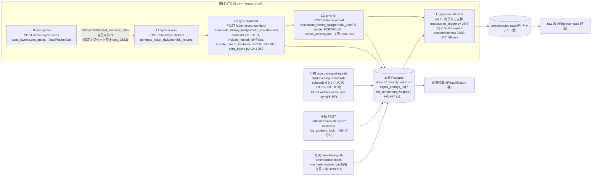
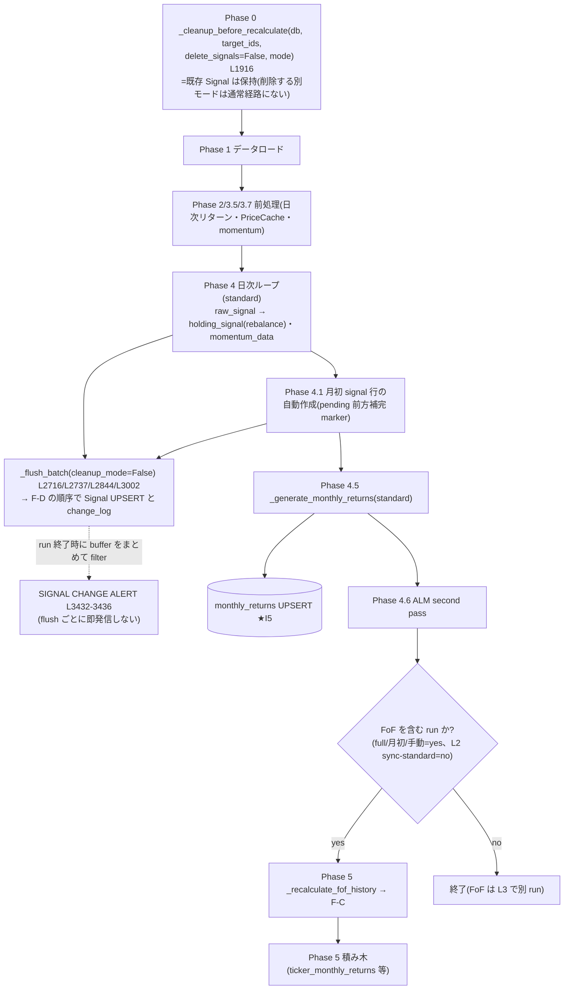
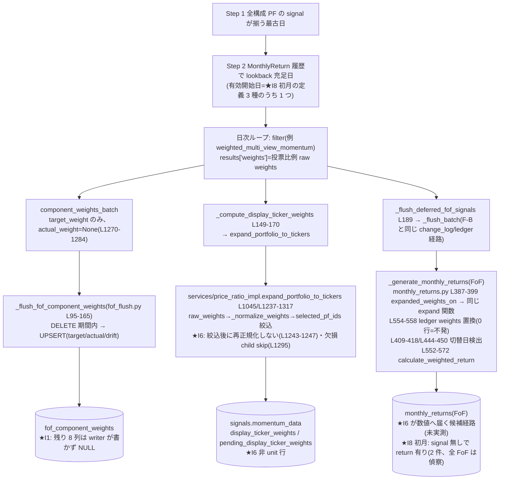
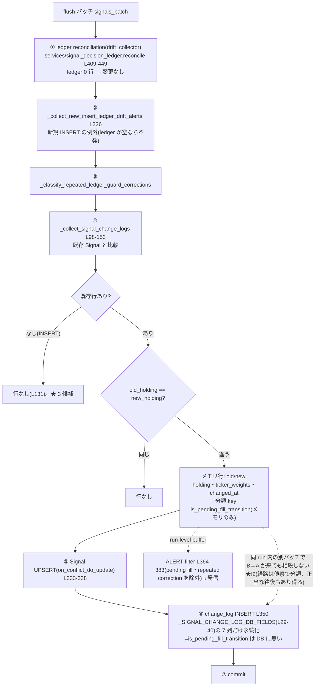
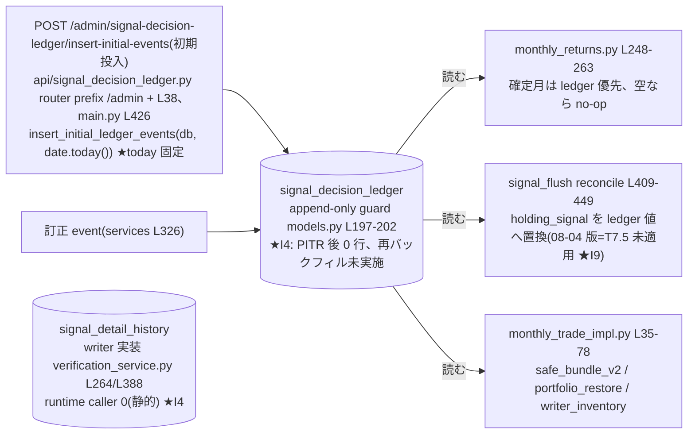
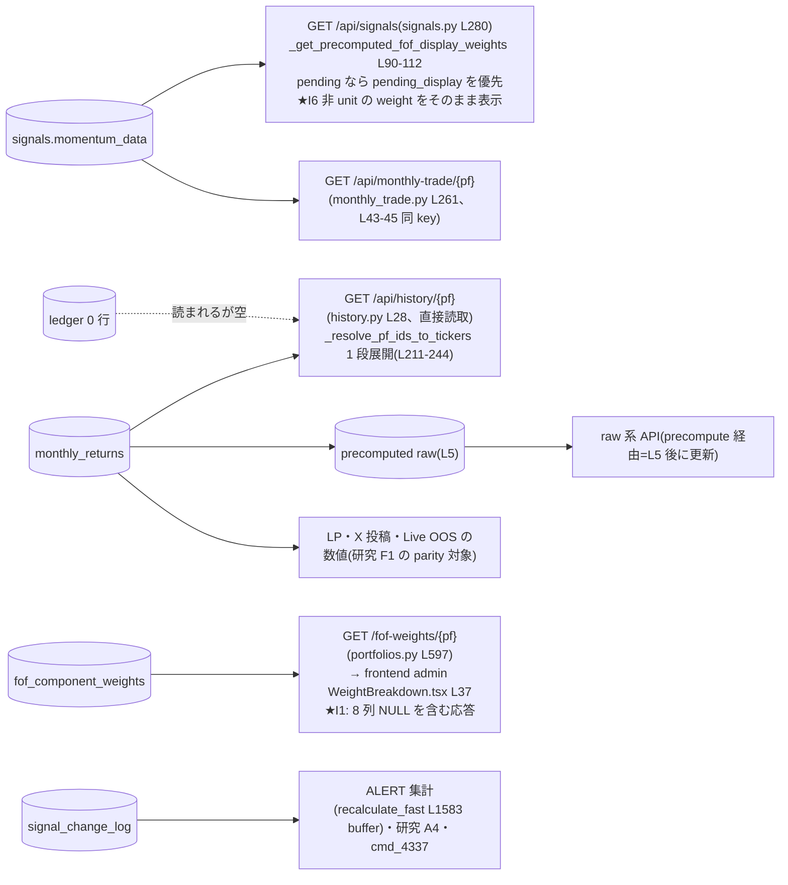

<!-- gist-master: 2f1a3daa07c336c90958b1287245318b dm-signal-production-inconsistency-asis-tobe_20260906.md -->
# DM-Signal 本番の不整合 I1〜I8 — 事象・影響・改善時の本番変化・影響範囲・依存関係 設計書 v0.8(2026-09-06 15:12 殿 14:59 ledger 復活/廃止の協議→§6.1 に 3 案比較(A 復活/B 廃止/C 休眠)・事実年表・トレードオフ・暫定推奨 C+追加調査 3 本、家老見解待ち) / v0.7(15:08 家老 R3 REQUEST_CHANGES 全採用: F-A/F-B/F-D/F-E/F-F 訂正、§2.5 の断定を候補/仮説へ、§2.6 を 4 分類+偽陽性源、I9 限定を再徹底) / v0.6(15:00 殿 14:45/14:47: §4 を『ユーザー可視/内部のみ/デッドコード』の 3 列へ、§2.5 設計の因果(導入 commit と意図、バグ/意図あり/失効の判定)、§2.6 デッドコード候補) / v0.5(14:55 殿 14:44『データの流れのフローチャート、粒度小・分割可・cron の日常再計算も』→§1.5 に F-A〜F-F 6 枚、★で I1〜I9 の発生点を明示) / v0.4(14:32 家老 R2 APPROVE(読取偵察のみ)・残訂正 6 点採用: I6 の Σ<1 断定撤回、I2/I3 の二重計上と直列依存を撤去、I5 六分類へ統一、I4 の実行 0 断定撤回、訂正 event で可逆性確定しない) / v0.3(14:40 家老 R1 REQUEST_CHANGES 6 点を全採用: I4 は writer 実装あり caller 0/ledger API は today 固定・append-only guard/I1 admin caller 実在・8 key/I2 ALERT filter 既存・相殺しない/I6 切替日検出と欠損 child skip も波及/偵察は親 1 本+成果物 A/B) / v0.2(14:35 将軍自己検証 3 点: I1 の frontend 参照あり・I6 は monthly_return 経路と同一関数・change_log 前方補完の一致率 26〜79%=change_log は履歴として再構成不能) / v0.1(14:25 起草、家老 R1 依頼)

- 発端: 殿 2026-09-06 14:11『dm-signal-research-data-backlog_20260905.md を参考に DM-signal の本番の不整合について深く調査しよう。家老と繰り返しレビュー交換をせよ。本番の不整合、それによる影響、改善時にどのような変化が本番に起きるか、改善の影響範囲・依存関係なども明確にせよ』
- 親: `docs/research/dm-signal-research-data-backlog_20260905.md` v1.5 §B5(I1〜I8)、`dm-signal-research-data-foundation-asis-tobe_20260905.md` v0.10 §2、`analysis_runs/cmd_4480_shin_yotsume_parity/root_cause_summary.md`(DM-Signal origin 07632b14)
- 正本 repo: DM-Signal origin/main 0f2bfbcd(2026-09-06 13:30)。行番号は全て origin/main の現物。

## §0.0 前提条件と我らのスタイル
- 本書は**調査と設計**であり実装しない。本番 DB への書込・DDL・deploy は殿の明示 OK のみ(殿 09-05 22:25/22:27、CLAUDE.md)。
- シンプル・既存コード・複雑さを足さない・最小変更→実験。改善は「今よりマシか/新しい長期問題を生まないか」の 2 問で判断。
- 数値は一次情報(readonly launcher nonce、cmd 報告、CI 上の verify_*.md)に限る。本書で新規に測っていない数値は「未検証」と明記し、偵察 cmd の対象にする。
- 改善時の本番変化は「誰が何を見る/どの job が何を書く」で書く。抽象語(整合性向上)は禁止。

## 進捗ビジュアル(将軍 loop 更新 2026-09-06 15:08)

**全項目(I1〜I9)** `░░░░░░░░░░ 0/9` ✅完了 🟡走行中 ⏳待ち 🔴要判断
状態集計: ✅ 0 / 🟡 0 / ⏳ 6 / 🔴 3(表の 9 行)
次の一手: 偵察 親 cmd_4484(readonly、成果物 A/B、共通 snapshot 契約)起票済み→結果で I6 隔離実験・I4 dry-run→殿裁定 2 点。I9 は R3 で backlog B2/PI-P06 訂正

| # | 不整合 | 状態 | 現在値 |
|---|---|---|---|
| I1 | fof_component_weights の未使用 8 列 | ⏳ | 事象確定(24,348 行 NULL)。admin WeightBreakdown が API を使用中→列ごとの契約表の後に DROP 可否 |
| I2 | signal_change_log 同日往復の二重行 | ⏳ | 事象確定、発生経路 2 候補=未検証(偵察) |
| I3 | signal_change_log 未出現 PF | ⏳ | 66/78→75 母集団で再計上要(偵察) |
| I4 | signal_detail_history 0 行 / signal_decision_ledger 0 行 | 🔴 殿裁定 | 前者=writer 実装あり・caller 0(廃止は契約確認後)、後者=PITR 後の再バックフィル未実施・API は today 固定(復活/廃止) |
| I5 | 月初 signals.holding_signal ≠ monthly_returns.holding_signal | ⏳ | 直接突合は未実施(偵察 A で 6 区分に分類) |
| I6 | display_ticker_weights 非 unit 35 行・parity 不一致 29/2,096 | 🔴 殿裁定 | 根因=price_ratio_impl L1237-1250 の選択後再正規化不在。正本を F1 再帰規則にする(A10)か display を直すか |
| I7 | component holding_signal 欠落で展開不能 | ⏳ | 実測 0(cmd_4479/4483)。監視化のみ |
| I8 | 新四つ目 3 体 parity 不一致(102+2) | ⏳ | 母集団除外で決着(殿 11:46)。残 2=2014-04 初月の root signal 不在=偵察 |
| I9 | 本番 tree と文書の乖離(ledger/signal_flush は 08-04 版) | 🟡 backlog B2 訂正済み(v1.6)。PI-P06 は規範保持+現在適用状態を別記 | rollback 233c2303 後、ledger file は 21e80e30 と同値・T7.5 未適用。backend 全体の 08-04 版断定はしない(38 files 再変更あり) |

## §1 読み方
各 I について (a) 事象と証拠 (b) 本番での影響(誰が何を見るか) (c) 改善案 (d) 改善時に本番で起きる変化 (e) 影響範囲(table/file/API/UI) (f) 依存関係 (g) 検証方法 (h) 未検証事項 を書く。証拠の行番号は origin/main 0f2bfbcd。

## §1.5 データの流れ(殿 14:44『粒度を小さく、分割してよい、cron の日常再計算も意識』。6 枚に分割。★印=不整合 I の発生点。行番号は origin/main 0f2bfbcd)

### F-A 日常の再計算: Render cron(render.yaml L140-176、context/dm-signal-ops.md §cron 表、scripts/etl_layer_sync_wait.sh)


- L2 は standard だけを再計算し FoF へ**波及させない**(include_parent_fof=False)。FoF は L3 の別呼出し。図で L2→L3 は「順序」であって「同一 run 内の Phase 5」ではない(手動 full recalc と月初 cron は 1 run で全 PF)。
- **DB が変わっても画面が変わる時点は API ごとに違う**: precompute raw を経由する API は L5 の後、直接読取 API は即時。改善の「ユーザー可視」はこの境界で判定する(全 API が同じキャッシュ無効化条件かは未証明、家老 R3)。

### F-B 標準 PF の再計算 1 run(jobs/recalculate_fast.py `recalculate_history_fast` L1526〜。通常経路=delete_signals=False)



### F-C FoF の再計算(jobs/recalculate_fof.py `_recalculate_fof_history` L438〜)



### F-D signal_change_log の 1 行ができるまで(signal_flush.py、順序は L326-350)


- **過去の DB 行から pending fill 由来かは直接読めない**(列が無い)。偵察 A の I2 分類で pending 由来を推定する場合は Signal 側の momentum_data marker との突合で行い、証拠なしに埋めない(家老 R3)。

### F-E signal_decision_ledger(0 行)の書き手と読み手



### F-F 読取側(誰が何を見るか)


- F-F の左列が「改善で書き換わる表」、右列が「殿・顧客・研究が見る面」。§4 の『変わるもの』はこの対応で決めている。

## §2 不整合カタログ

### I1 `fof_component_weights` の未使用列(JSON 4 列を含む 8 列が全 NULL)
- (a) 事象: 24,348 行で `component_type / nested_depth / asset_value / daily_return / component_holding_signal / component_tickers` が NULL、`actual_weight` も NULL(∴ `drift` も NULL)。証拠: 09-05 readonly 実測(基盤書 §2.1)+ writer の現物: `backend/app/jobs/flush/fof_flush.py` L139-152 は `target_weight / actual_weight(None) / drift` しか values に入れない。生成側 `backend/app/jobs/recalculate_fof.py` L1270-1284 も `target_weight` と `actual_weight: None` のみ。fof_flush.py L107 に「モデルには追加カラムがあるが…」と自認コメントあり。models.py L768-781 の定義(cmd_1101)がスキーマだけ先行した。
- (b) 本番影響: 読者=`backend/app/api/portfolios.py` L597 `GET /fof-weights/{portfolio_id}`(L681-690 で component_type/nested_depth/actual_weight/drift/asset_value/daily_return/holding_signal/component_tickers の **8 key** を返す)。frontend の実 caller は `frontend/app/admin/fof/components/WeightBreakdown.tsx` L37(`api.getFoFWeights(portfolioId, 1)`、保存済み PF の accordion 展開時 L68 付近)=**admin 画面で使用中**(家老 R1-2。将軍 v0.2 の『caller 0』は grep 語の取り違え=訂正)。同 UI が表示に使うのは主に component_id/target_weight(L149-150/L192-204)で、NULL 8 列を表示しているかは列ごとに未確認。**runtime 計算(monthly_return・/api/signals)への影響 0**: 計算は `target_weight` のみ使う(cmd_4480 A2: price_ratio_impl.py:1239-1250)。
- (c) 改善案: 廃止候補だが**列ごとの契約表(DTO・admin 表示・外部 API 利用)を作ってから**判断(家老 R1-2)。全 NULL の観測には期間と DB snapshot を添える(未使用の証明ではない)。writer 補完(actual_weight/daily_return/component_tickers を recalc で書く)は列の維持義務が増えるため非推奨のまま。
- (d) 改善時の本番変化: DROP=migration 1 本+`GET /fof-weights` の JSON から最大 8 key が消える+WeightBreakdown.tsx の型/表示を同時修正。データ・リターン・シグナル表示は不変。
- (e) 影響範囲: `backend/app/db/models.py` L768-781、`backend/app/db/migrations.py`(fof_component_weights 10 箇所)、`backend/app/api/portfolios.py` L597-690、`backend/app/jobs/flush/fof_flush.py` L107 コメント、`frontend/app/admin/fof/components/WeightBreakdown.tsx` L37/L68/L149-204、`frontend/lib/api-client.ts` L959-965。
- (f) 依存: 独立。ただし I8 残 2 件(初月 0 行)と A8(drift 観測)は同じ表を見るので、DROP は I8 偵察の後。
- (g) 検証: 隔離 DB で migration up/down 往復、`GET /fof-weights` の契約 test、本番は readonly で NULL 率 100% を再確認してから。
- (h) 未検証: WeightBreakdown が NULL 8 列のどれを表示しているか(列ごと)、外部 API 利用者の有無、全 NULL の期間と snapshot。

### I2 `signal_change_log` 同日往復の二重行
- (a) 事象: 同一 (portfolio, date) で同日に A→B と B→A の 2 行(基盤書 §2.2、09-05 実測)。証拠: 生成側 `backend/app/jobs/flush/signal_flush.py` L98-153 `_collect_signal_change_logs` は**flush バッチごと**に「DB 既存 holding_signal ≠ 今回の holding_signal」を 1 行にする。dedupe は L236-262 の「ledger drift 署名の既出判定」だけで、**同 run 内の往復や、pending fill→確定の 2 段書込(L141-143 `is_pending_fill_transition`)は抑止していない**。
- (b) 本番影響: (1) SIGNAL CHANGE ALERT は `signal_flush.py` L364-383 `_confirmed_signal_change_alerts` が pending fill 遷移と repeated ledger correction を**既に除外**しているため、往復行がそのまま ALERT 過剰になるとは言えない(家老 R1-3、将軍 v0.1 の記述を撤回)。08-23 cmd_4337 は同表を根拠にしたが ALERT 件数と change_log 行数は別物として扱う。(2) 研究側の turnover 計測(A4)は往復分だけ過大になり得る(distinct PF 出現数 I3 は重複行で増えない。家老 R2-2)。(3) `/api/signals` 表示・monthly_return には影響 0(change_log は read されない。読者は recalculate_fast/ledger/writer_inventory のみ)。**(4) 最重要: change_log は保有履歴として再構成不能**。cmd_4479 AC3 `verify_change_log.md`(同日最後の行で前方補完し F1 月初保有と突合)で L0 12 体の一致率は 26〜79%(例: シン朱雀-鉄壁 24/92、シン青龍-常勝 94/188)。原因は設計: L131 で INSERT(初回確定・pending fill の新規行)を除外し UPDATE 差分だけ記録するため、初期状態と月初 fill が欠ける。∴ この表を「いつ何を持っていたか」の根拠に使うと誤る。ALERT 用途に限定するか、F1(cmd_4483)を履歴の正本にする。
- (c) 改善案(2 段): 段 1=**計測と分類**: 同 pf・同 date の複数行を run/job/cache 世代・DB transaction 境界で分類(候補: pending fill 2 段 / 同日 2 run(fast+fof) / 同日複数モードや入力世代差 / ledger correction / 正当な A→B→A)。**近接時刻だけで同 run と断定して相殺しない**(家老 R1-3)。識別不能は unknown として残し raw 履歴は保存。段 2=分類結果で「同 run・同 key・最終状態不変」が確定した経路だけ生成側で抑止(契約 test 付き)。既存行の物理削除はしない。
- (d) 改善時の本番変化: 抑止対象の経路が分類で確定した場合に限り、以後の run で change_log 行数が減る。ALERT 件数の変化は filter(L364-383)の外側の経路だけ=分類結果次第の条件付き。過去行は不変。
- (e) 影響範囲: `signal_flush.py` L98-153、`recalculate_fast.py` L1583/L2717-3073(collector 呼出 5 箇所)、`recalculate_fof.py`(1 箇所)、ALERT 文面、A4 監視。
- (f) 依存: I3 の distinct PF 出現数は重複行で増減しないため、I2 計測と I3 再計上は**同 snapshot で並行可**(家老 R1-3)。往復行を除外した定義を採る場合だけ依存を明記。ledger(I4)復活時は L236-262 の署名 dedupe と同時に見直す。
- (g) 検証: 隔離 DB で pending fill→確定の 2 段 flush を再現し行数 1 を契約 test 化。本番は段 1 の readonly 計測のみ。
- (h) 未検証: 発生経路の分類比率(上記 5 候補+unknown)、件数と時期分布。

### I3 `signal_change_log` に現れる対象 PF が 66/78
- (a) 事象: 09-05 nonce *-ro9 で対象 78 中 66(L0 10/12・L1 17/21・L2 21/24・L3 18/21)。殿裁定 11:46 で母集団は 75(L2 21)へ。
- (b) 本番影響: 未出現 PF の候補: (1) 一度も holding_signal が変わっていない(正常)、(2) 変化検知の前に signals 行が無かった(INSERT は L131 で除外)、(3) cleanup モードで change log を収集しない経路(signal_flush.py L324 `cleanup_mode` 付近)、(4) 観測期間外、(5) 保存履歴の不足。(2) なら **ALERT の死角**(初回 INSERT で確定した保有は通知されない、L155-166 docstring)。二択に固定しない(家老 R2-3)。
- (c) 改善案: 計測のみ。未出現 12 体の signals 行数・初回 date・holding_signal の distinct 数を出し、「変化なし」と「INSERT 由来」を分ける。INSERT 由来が LP/ALERT の期待と矛盾するなら A4 監視に「初回確定」イベントを追加。
- (d) 改善時の本番変化: なし(計測)。監視追加時は ALERT 種別が 1 つ増える。
- (e) 影響範囲: readonly SQL、A4(verification tables)。
- (f) 依存: I2 計測と同 snapshot で並行可(§3)。母集団は cmd_4483 の universe_manifest(75)を使う。
- (g) 検証: 75 PF で `signal_change_log` distinct portfolio_id と signals の初回 date を突合。
- (h) 未検証: 未出現 12 体の内訳(9 体は 75 母集団内、3 体は除外新四つ目に含まれるかどうか)。

### I4 `signal_detail_history` 0 行 / `signal_decision_ledger` 0 行
- (a) 事象: 両表 0 行。証拠: `signal_detail_history` は models.py L942-953 に定義。**writer 実装は存在する**: `backend/app/services/verification_service.py` L264-334 `save_signal_detail`(session.add)・L388-445 `flush_signal_details_batch`。しかし **runtime caller は 0**: 他 file からの import は `create_portfolio_config_snapshots` のみ(api/portfolios.py L36、recalculate_fast.py L91、14:38 将軍確認)。∴ 4 軸で書く: writer 実装=あり / 現 tree の runtime caller=0(静的) / 実行回数=**未検証**(過去版・外部 one-shot 実行を 0 と断定しない、家老 R2-5) / 行数=0(09-05 実測)。v0.1 の『writer 不在』は表名 grep で ORM 名を見落とした誤り(R1-1)。`signal_decision_ledger` は writer が `services/signal_decision_ledger.py` L580 `insert_initial_ledger_events`(初期バックフィル)と L326(訂正行)のみで、runtime の recalc は読むだけ(monthly_returns.py L248-263『ledger が空なら no-op』、monthly_trade_impl.py L35-78)。08-16 PITR rollback 以後、再バックフィル(07-07 cmd_3711 相当)が実行されていないため 0 行。
- (b) 本番影響: detail_history=0(誰も読まない)。ledger=**確定月の保護が効いていない**: 設計(cmd_3703 §4 target 2)では確定月の holding_signal は ledger の決定値を優先し再計算で上書きされないはずが、0 行なので毎 run の再計算結果がそのまま `monthly_returns.holding_signal` になる。これが I5 の一因候補。また signal_flush.py L155-166 の「ledger-covered INSERT の drift ALERT」も発火しない。
- (c) 改善案: **殿裁定 2 択**(backlog B2 中立を維持): (a) 復活=初期バックフィル。ただし現在の入口 `api/signal_decision_ledger.py` L38-54 は `insert_initial_ledger_events(db, date.today())` で **today 固定**=歴史全期間のバックフィル入口ではない(家老 R1-5)。07-07 cmd_3711 の手順が現 schema で再実行可能かは隔離 DB で dry-run が必要。(b) 廃止=依存撤去。表名+ORM 名で参照する backend/app file は **15**(model/migration 含む。runtime 依存数ではない)→役割別 manifest(writer/reader/guard/API/test)を作ってから。detail_history は「caller 0」だけで DROP と決めず、将来契約・復元・API 利用を確認してから(R1-1)。
- (d) 改善時の本番変化: (a) 復活=バックフィル直後の run から確定月の holding_signal が ledger 値に固定され、差がある月の表示が変わる(件数・日付は I5 で事前に出す)。さらに `decision_ticker_weights` と境界選択(monthly_returns.py L554-558 の ledger weights 置換、L409-418/L444-450 の切替日検出)に波及し、cache 無効化が要る(R1-5)。`signal_decision_ledger.py` L411-449 の reconcile は holding_signal を ledger 値へ**置換する**ため、08-12 T7.5『detect-only 化』は docstring でなく変更履歴と現 caller で確認する。ALERT に ledger drift 種別が復活。(b) 廃止=挙動は現状のまま、コードが減る。**revert の注意**: models.py L197-202 の append-only guard(before_update/before_delete で ValueError)により「ledger 行削除+recalc」は一般的 revert にならない。訂正 event は既存値の訂正には使えるが「coverage なし」へ戻すことを保証しない(家老 R2-6)→append-only を守った復元方法は別 dry-run の検証対象で、v0.4 時点で可逆性は**未確定**。
- (e) 影響範囲: (a) `services/signal_decision_ledger.py`、`jobs/recalculate_fast.py`(6)、`recalculate_fof.py`(3)、`generators/monthly_returns.py`(5)、`api/signal_decision_ledger.py`、`main.py`、`monthly_trade_impl.py`、`safe_bundle_v2.py`、`portfolio_restore.py`、`writer_inventory.py`、`projects/dm-signal.yaml` PI-P06。(b) 同じ file 群の撤去。
- (f) 依存: **I5 の計測が先**(復活で何月の表示が変わるかを事前に知るため)。I2 の署名 dedupe(L236-262)は ledger 前提。
- (g) 検証: 隔離 DB(PITR clone)でバックフィル→full recalc→monthly_returns 差分 0 件/非 0 件の一覧。本番は殿 OK 後、バックアップ+revert 手順付き。
- (h) 未検証: cmd_3711 手順の現 schema dry-run、T7.5 の変更履歴と現 caller、15 file の役割別 manifest、外部 API 利用者。

### I5 月初 `signals.holding_signal` ≠ `monthly_returns.holding_signal`
- (a) 事象: backlog B5 は「F1 で計測」とするが、cmd_4479 の `verify_change_log.md` は change_log 前方補完との突合(I2/I3 側)であり、**signals.holding_signal と monthly_returns.holding_signal の直接突合は未実施**(14:33 将軍確認)。v0.2 では件数を「未検証」に戻し、偵察 cmd の AC にする。生成側: monthly_returns.py L265-283 は standard のみ signals から holding_signal を取り(`require_holding_signal`)、FoF は別経路(L28 ledger 優先→展開)。
- (b) 本番影響: `/api/signals`(当日)と月次リターン表(その月の保有ラベル)で**同じ月の保有が別の名前で見える**可能性。数値(リターン)は影響しないケースと、FoF 展開の月初境界(docs/future/055 FoF MTD entry asymmetry、L240 コメント)で weight が変わるケースがある。
- (c) 改善案: まず分類(強制しない): (1) pending→確定の正常差、(2) ledger 不在で再計算が上書き(I4 候補)、(3) FoF 月初境界差(055)、(4) 入力時点差(snapshot 世代)、(5) raw/holding 差、(6) unknown。ledger 不在との相関だけで原因確定しない(家老 R1-6)。修正は (2) が確定した分のみ I4 と同時に。
- (d) 改善時の本番変化: (2) 分は I4 復活で確定月ラベルが固定される。(1)(3) は変化なし(仕様として文書化)。
- (e) 影響範囲: readonly SQL、I4 の file 群、docs/future/055。
- (f) 依存: I4 裁定の入力。cmd_4483 の F1 CSV(75 PF、origin 0f2bfbcd)を突合材料に使う。
- (g) 検証: 不一致 1 件ずつに (1)〜(6) のラベル(unknown 含む)を付けた表を作り、ラベル別件数を出す。同 PF・同月・同じ有効日・raw/holding・pending 確定条件を記録し、照合できない行を分母から落とさない。
- (h) 未検証: 直接突合の不一致件数(未実施)、六分類の比率。

### I6 `display_ticker_weights` 非 unit 35 行・α=0 parity 不一致 29/2,096
- (a) 事象: 08-06 partial-turnover v1.10 で棄却済み(`docs/research/partial-turnover-experiment-asis-tobe-5w1h_20260805.md` v1.10-v1.12)。根因=`backend/app/services/price_ratio_impl.py` L1237-1250: `raw_weights` を `_normalize_weights` した後、`selected_pf_ids` を weight>0 に絞るが、**絞った後に再正規化しない**(選択外 PF の weight 分だけ合計が 1 を割る)。producer=`recalculate_fof.py` L149-170 `_compute_display_ticker_weights`→`expand_portfolio_to_tickers`(同 L1045)、L1108-1192 で `momentum_data.display_ticker_weights / pending_display_ticker_weights` に格納。
- (b) 本番影響: 読者=`backend/app/api/signals.py` L90-112(`/api/signals` の FoF ticker 表示)と `backend/app/api/monthly_trade.py` L43-45(月次売買表示)。**殿・顧客が見る FoF の ticker×weight が、該当月は合計 <1 のまま表示される**(35 行)。monthly_return の計算は **同じ関数を使う**: `backend/app/jobs/generators/monthly_returns.py` L387-399 `expanded_weights_on(day)` が `expand_portfolio_to_tickers` を呼び、L552-572 の weights と `calculate_weighted_return` に到達(`price_ratio_impl.py` L884-900 は Σweight×return を丸めるだけで再正規化しない)。同じ展開 map は L409-418/L444-450 の**切替日検出**にも使われるため、weight 変更は数値だけでなく計算開始境界にも波及し得る(家老 R1-4)。また `price_ratio_impl.py` L1295 付近の**欠損 child skip** も Σ<1 の候補で、選択外 weight だけを根因と断定しない。1 行再正規化は欠損を隠す恐れがある。∴ 静的には monthly_return も同じ展開値に到達するが、**対象 35 行で実際に Σ<1 のまま計算されているかは未検証**(参照日・cache・L554-558 の ledger weights 置換条件が一致した証明ではない。家老 R2-1)。他の呼出し: api/signals.py L224/L448、trade_performance.py L651、return_calculator.py L210/L254、monthly_trade_impl.py L328、trades_impl.py L1198。A10 一元化がこの関数内で閉じるかも未証明。
- (c) 改善案: **殿裁定**(順序: consumer/境界/欠損分岐の確認→隔離実験→影響集合→裁定): (a) 展開関数内で絞込み後に Σ=1 へ再正規化(欠損 child skip の月は別扱いにして隠さない)+full recalc。(b) A10 一元化。ただし **F1 の均等展開をそのまま本番正本にはできない**(投票比例 FoF の重み供給契約 I8 と衝突)=共通化するなら target_weight 供給契約を保持したまま。
- (d) 改善時の本番変化: (a) 該当 35 行の月で `/api/signals`・monthly_trade の weight 表示が Σ=1 に変わる。monthly_return が同経路なら**その月のリターン数値が変わる**(要事前計測: 変わる PF-月と差の大きさ)。full recalc が必要(所要 ~480s、殿 OK のみ)。
- (e) 影響範囲: `price_ratio_impl.py` L1237-1317、`trades_impl.py` L1167、`monthly_trade_impl.py` L286(同規則の別実装 3 本=A10)、`recalculate_fof.py` L149-192/L1108-1192、`api/signals.py`、`api/monthly_trade.py`、frontend の weight 表示。
- (f) 依存: A10(展開一元化)の第 1 歩。I8 の投票比例 weight とは同じ L1237-1250 を通るため、修正は I8 の理解(cmd_4480 A2)を前提にする。
- (g) 検証: 隔離 DB で 35 行の PF-月を再計算し Σ=1 と monthly_return・切替日の差分表。分母は混ぜない: 旧 78 PF parity=12,372、新 75 PF=11,922、35 行の母集団は別(家老 R1-6)。
- (h) 未検証: 35 行の PF-月で monthly_return と切替日が実際に動くか(反実仮想 recalc)、欠損 child skip 由来の行数。

### I7 component holding_signal 欠落で展開不能な PF-月
- (a) 事象: 実測 0(cmd_4479 i7_unexpandable=0、cmd_4483 で 0 維持)。
- (b) 本番影響: 現状なし。将来 PF 追加・signals 欠落時に F1/表示が黙って落ちる可能性(黙る=Silent Fallback、PI-018 の対象)。
- (c) 改善案: 監視のみ。F1 の i7 出力を A4 の健全性チェックに 1 行追加。
- (d)(e)(f): 変化なし/verification tables/独立。
- (h) 未検証: なし。

### I8 新四つ目 3 体の parity 不一致(explained 102+unexplained 2)
- (a) 事象: cmd_4480 で 102 件=投票比例 FoF weight(`fof_component_weights.target_weight` 非 1/N ↔ F1 の 1/N)、2 件=2014-04 初月に root signal 行・fof_component_weights 0 行。殿裁定 11:46 で 3 体を母集団から除外(cmd_4483 CLEAR)。
- (b) 本番影響: 3 体の本番 monthly_return は本番規則(投票比例)で一貫しており**本番側の不整合ではない**。残 2 件は「初月は signals 生成前に monthly_returns が計算される」仮説=本番の初月処理の順序問題であれば、**新規 PF 登録直後の初月リターンが root signal 無しで計算されている**可能性(一般化すると全 FoF の初月に及ぶ)。
- (c) 改善案: 偵察: 全 FoF(cmd_4479 manifest で fof 66、現件数は再確認)の初月について root signal 行の有無と monthly_returns 行の有無を突合し、「signal 無し・return 有り」の件数を出す。0 でなければ初月処理順序の修正候補(recalculate_fof の初月 handling)。
- (d) 改善時の本番変化: 修正すれば該当 PF の初月 monthly_return が変わる(件数は偵察で)。
- (e) 影響範囲: `recalculate_fof.py` の初月処理、monthly_returns generator。
- (f) 依存: 独立。I1 の DROP より先。
- (h) 未検証: 一般化件数(2 件が新四つ目固有か全 FoF 共通か)。

### I9(v0.3 追加) 本番 tree と設計文書の乖離: 08-13 rollback で 08-05〜08-12 の backend 変更 139 commit が現本番に無い
- (a) 事象: DM-Signal origin/main の `backend/app/services/signal_decision_ledger.py` は 21e80e30(2026-08-04)と**同一**、T7.5 c13a56fe(08-12『downgrade ledger guard to detect-only』)とは**不一致**(14:2x 将軍 `git diff --quiet` 確認)。`233c2303`(08-13『rollback: restore production tree to 21e80e30』)が本番 tree を 08-04 へ戻した。`git rev-list --count 21e80e30..233c2303^ -- backend/app` = **139**(履歴 commit 数)。**限定**(家老 R2 追記 14:39): 同値が確認できたのは `signal_decision_ledger.py`(blob 0d71b153=21e80e30)のみで、backend 全体が 08-04 版・139 commit の効果が全て不存在とは未証明。rollback 後の origin/main は 21e80e30 から `38 files changed, 1794 insertions, 381 deletions`(家老実測)=一部は再適用・新規変更されている。T7.5 の 2 file(ledger/signal_flush)への再適用は 0。
- (b) 本番影響: 挙動としては 08-04 版が本番の正=殿裁定 08-16『バグを直さず復帰点へ戻す』の結果であり、コード自体は不整合ではない。**不整合は文書側**: backlog B2『08-12 T7.5 は guard detect-only 化と alert 撤去』、本書 v0.1 の I2/I4 記述、`projects/dm-signal.yaml` PI-P06 周辺は、現本番に無いコードを前提にしている可能性がある。I2 の『run297 normalize change log insert rows』も現本番に無いため、change_log の重複挙動は 08-04 版のもの。
- (c) 改善案: 本書と backlog・PI の該当記述に「現本番=08-04 版(233c2303)」の注記を付け、T7.5 等は『適用済み』ではなく『rollback で未適用(再適用は別裁定)』へ訂正。139 commit の再適用可否は本書の範囲外(別設計書、殿裁定)。
- (d) 改善時の本番変化: 文書訂正のみ=なし。
- (e) 影響範囲: `docs/research/dm-signal-research-data-backlog_20260905.md` B2、本書 I2/I4、`projects/dm-signal.yaml` PI-P06、`context/dm-signal-ops.md` の該当 §。
- (f) 依存: I2/I4 の全記述の前提。偵察 cmd の担当忍者へ「本番コードは 21e80e30 相当」を明示する。
- (h) 未検証: 139 commit のうち docs/PI が『適用済み』として参照しているものの一覧。

## §2.5 設計の因果(殿 14:47『本番は過去の因果で今の形。明らかなバグ以外は、なぜその設計かをたどる』。origin/main の `git log -S` で導入 commit を特定。判定: 意図あり/バグ/意図が失効)

| # | 現在の形 | 導入 commit と意図 | 判定 |
|---|---|---|---|
| I1 | fof_component_weights に 8 列あるが writer は 3 列 | 表は e8191db7(2025-12-29『PipelineEngine と FoF リバランス決定モデル』)で drift 観測を見据えて 12 列で定義。writer は 2aee8e97(2026-01-10『FoF service helpers』、cmd_1101)で target/actual/drift のみ実装。API b682f21d(2026-03-30 cmd_1573『FoF ウェイト可視化 debug API 正式化+WeightBreakdown』)は admin 用の可視化 | **意図あり(未完の拡張)**。drift 観測(A8)を将来やる前提で列だけ先行。バグではない。DROP は「その将来を捨てる」判断=殿裁定 |
| I2/I3 | change_log は UPDATE 差分のみ、INSERT を記録しない | c7e91634(2026-05-02 cmd_2455『signal change audit logging』)が「確定済み保有が後から書き換わる事故」を監査する目的で導入。INSERT 除外は『persisted old value が無い』ため(05a45d83 2026-07-14 hotfix の docstring)。changed_at 明示は ca170887(07-03 cmd_3679『確定保有の書換えを ALERT』) | **意図あり(監査)**。目的は「確定後の書換え検知」であり「保有履歴の再構成」ではない。∴『履歴として使えない』は用途違いで、用途の明文化(履歴の正本=F1)が筋。往復は「監査設計として正当な A→B→A」と「異常往復」を別軸に置き、全往復をバグ扱いしない(家老 R3) |
| I4 detail_history | writer 実装あり・現 tree の caller 0(静的) | 0acd66f8(2026-01-07『verification 用 DB 拡張+admin visibility page+分析 script』)で検証用に導入。「その後の高速化で caller が外れた」は**仮説**(除去 commit と当時の caller を未提示、家老 R3)。未接続のまま残った機能の可能性もある | **未確定**(意図失効 or 未接続)。DROP 判断は除去履歴と admin visibility page の参照確認後 |
| I4 ledger | 0 行、runtime は読むだけ | 5e9ea355(07-06 cmd_3700『decision ledger dry-run 基盤』)→c449c35d(07-06 cmd_3703『write guard+daily insertion flow』)で「確定月の保有を再計算で上書きしない」ために導入。08-12 T7.5 で detect-only 化・alert 撤去→08-13 rollback で未適用(I9)→08-16 PITR で 0 行 | **意図あり(保護)だが現在は無効**。復活/廃止は「確定月保護を本番で要るか」の裁定=殿 |
| I5 | signals と monthly_returns の holding_signal が別々に持たれる | monthly_returns は generator が Signal から生成(recalculate_fof.py L533/L566 コメント『MonthlyReturn は _generate_monthly_returns() が Signal から生成する』)。二重保持は「月次表示を Signal から都度展開せず materialize する」速度設計(fullrecalculate 高速化 3566s→480s の系譜) | **意図あり(materialize 設計)**。3566→480s の全体改善をこの二重保持に帰属はしない(家老 R3)。差は生成タイミング・ledger・境界の副作用。二重保持を消す案は採らない |
| I6 | display_ticker_weights を momentum_data に事前計算 | 773efb9f(2026-04-25『Precompute FoF display weights for signals API』)=/api/signals の応答速度のため。絞込後の非再正規化は price_ratio_impl の原型(020f4a03 06-12 で facade 分割・移設、原型はそれ以前)にあり、『custom weights が無ければ均等』の分岐に選択外 weight の扱いが未定義 | **display の事前計算=意図あり(速度)。非再正規化=候補原因(未確定)**。意図的な非投資分(cash 相当)・欠損 child・cache/日付差を切り分けるまでバグと断定しない。移設 commit 020f4a03 の移設元へ遡る必要あり |
| I8 | 新四つ目 3 体は投票比例 weight | weighted_multi_view_momentum_filter(cmd_4480 A2)の設計どおり | **意図あり**。除外で決着(殿 11:46) |
| I9 | ledger/signal_flush の 2 file が 08-04 版 blob と同値 | 殿裁定 08-16『バグを直さず復帰点へ戻す』→233c2303。backend 全体の一般化はしない。origin 固定 commit(0f2bfbcd)と稼働 deploy SHA も別物 | **意図あり(復旧方針)**。文書側を合わせる |

- 結論(v0.7): 現時点で**バグと確定したものは無い**。I6 の非再正規化は候補原因(静的に見つけた段階)、I2 の往復は分類待ち。他は「意図ある設計が別用途に流用されて不整合に見える」か「保護機構が停止中」か「未接続のまま残った機能」。改善案は用途の明文化と裁定を先に置き、コード変更は最小にする。

## §2.6 デッドコード候補(殿 14:45『デッドコードもチェック』。静的確認のみ、削除は別 cmd・別承認。分類は家老 R3: 未到達関数 / 到達するがデータ 0 / 未充足の拡張 schema / 動作中の guard を一括しない)

| 候補 | 分類 | 根拠(origin/main) | 次の確認 |
|---|---|---|---|
| verification_service.save_signal_detail / flush_signal_details_batch | 未到達関数(静的) | 他 file からの import 0。ただし同 file 内 L299/L411 で SignalDetailHistory を query する(reader 0 ではない) | 過去版・one-shot script・admin visibility page(0acd66f8)・cron startCommand からの呼出し |
| SignalDetailHistory 表 | 到達するがデータ 0 | 上記 writer 経由でのみ read/write、行数 0 | 同上 |
| fof_component_weights の 8 列 | 未充足の拡張 schema | writer が書かない。API 応答と WeightBreakdown の契約に残る | 列ごとの契約表(表示利用の有無) |
| _flush_fof_component_weights の actual_weight/drift | 未充足の拡張 schema | 常に None(recalculate_fof.py L1281)。API/schema 契約は残る=値 None だけで削除可にならない | A8 を実装するか列契約を外すか |
| ledger 依存 15 file の runtime 分岐 | 動作中の guard(データ 0) | 実行されるが 0 行で効果 0。将来データが入れば効く=死コードでも失効でもない | I4 裁定 |
| daily_etl.py | 未確認 | ops.md『冗長、廃止予定』 | cron/手順書/startCommand からの参照 |
| (陰性対照) is_pending_fill_transition の消費側 | 使用中 | ALERT filter L364-383 | — |
- 候補 6+陰性対照 1。vulture 等の警告は候補抽出であり到達不能の確定ではない。
- 静的監査の偽陽性源(allowlist に入れる): facade/re-export(price_ratio_calculator・monthly_trade_calculator 等)、FastAPI router 登録、SQLAlchemy event.listen、cron startCommand と shell 経由の入口。
- **全 backend の vulture/import graph 監査は別 cmd**(家老 R3): 固定 code/deploy identity・動的入口 allowlist・候補ごとの caller/反証/除去履歴を提出、削除は別承認。走行中の cmd_4484 B は既存の I6 静的範囲で見つかった未到達候補の補足記録のみ(DB 再取得なし)。

## §3 依存関係と順序(v0.3、家老 R1-6 採用)

```
読取フェーズ(親 cmd 1 本、共通 snapshot・同一 as-of、DB 取得は直列→解析は並行):
  成果物 A = I2 分類(5 候補+unknown)・I3 再計上(75 母集団)・I5 分類(6 区分)
  成果物 B = I8 全 FoF 初月(signal 無し・return 有り)・I6 静的影響集合(consumer/切替日/欠損 child)
    ↓
I6: 隔離実験(35 行の反実仮想 recalc)→影響集合→殿裁定→修正+full recalc(殿 OK)
I4: I5 分類+現 schema バックフィル dry-run(別の隔離実験)→殿裁定→実施(訂正 event 型 revert 計画付き、殿 OK)
I1: 列ごとの契約表(DTO/admin 表示/外部 API)→DROP 可否(I8 だけを前提にしない)
I2 段 2: 分類で確定した経路のみ抑止(契約 test)
I7: 監視 1 行(独立)
```
- 各集合の ID・期間・時刻・分母を先に固定し、成果物は全行と未分類を残す。
- 本番書込を伴うのは I4(a)・I6・I1 DROP・I2 段 2。全て「隔離 DB で差分表→殿 OK→バックアップ→本番→revert 手順(ledger は訂正 event)」。

## §3.5 偵察 cmd の共通契約(家老 R2、cmd_4484 AC へ転記)
1. 同一 DB snapshot: 可能なら同一 readonly transaction で整合取得。難しければ取得開始/終了時刻・更新境界・各 query nonce・row count/hash を記録し同時点性の限界を残す。再生成による入力変更はしない。
2. 母集団: A=75 PF(cmd_4483 universe_manifest)、B=実測した全 FoF を別 manifest で固定。「初月」の定義(最初の monthly_return 月/最初の Signal 日/有効開始日)と signal 検索の日付条件を明示。66 は期待値として強制しない。
3. I2: run/job/cache/transaction 識別子が過去ログに無ければ unknown。近接時刻で ID を捏造しない。
4. I5: 同 PF・同月・同じ有効日・raw/holding・pending 確定条件を記録し、照合不能行を分母から黙って落とさない。
5. 提出物: A/B それぞれ全対象行・分類別件数・欠落/重複/未分類・再実行手順・artifact hash。分類数値から原行へ戻れること。
6. B の I6 は静的な影響候補集合まで。リターン差分・切替日差分は後続の隔離実験へ分け、本偵察から再正規化実装や full recalc へ自動昇格しない。
7. 担当忍者へ「本番コードは 21e80e30(08-04)相当、T7.5 等 139 commit は未適用」を明示(I9)。

## §4 改善時に本番で起きる変化(殿 14:45『ユーザーが見るデータが変わるか / 内部だけか』の 2 視点+デッドコード)

| 改善 | ① ユーザー可視(本番画面・API・LP/X の数値) | ② 内部のみ(表・job・ログ) | ③ 消えるデッドコード | 可逆性 |
|---|---|---|---|---|
| I1 DROP(列) | 条件付き: WeightBreakdown が 8 列のどれかを表示していれば admin 表示項目が減る(未確認、列契約表で確定)。顧客画面は変化なし | schema 8 列、GET /fof-weights の応答 key | fof_flush の actual/drift 計算、API の 8 key 組立 | migration down+frontend revert |
| I2 抑止(分類確定後) | なし | 以後の change_log 行数、ALERT 件数(filter 外側の経路のみ) | なし | revert |
| I3 監視追加 | なし | ALERT 種別 +1 | なし | revert |
| I4 復活 | **あり得る**: 確定月の holding_signal が ledger 値に固定→/api/history・LP の該当月ラベルと、decision_ticker_weights 置換で当月 return が変わる(件数は偵察 A の I5 分類で事前提示) | ledger 行、cache 無効化、ledger ALERT | なし | 未確定(append-only、別 dry-run) |
| I4 廃止 | なし | コード 15 file、表 2 本 | ledger 依存の runtime 分岐、detail_history writer | revert |
| I6 再正規化 | **あり**: 非 unit 行の月の /api/signals・monthly-trade の weight 表示 Σ=1、同月の monthly_return/切替日が動けば /api/history・LP・X の数値 | full recalc 1 回、signals.momentum_data 再生成 | なし | revert+full recalc |
| I8 初月修正 | あり(該当 FoF の初月 return、件数は偵察 B) | recalculate_fof の初月処理 | なし | revert+recalc |
| I9 文書訂正 | なし | 文書 | なし | — |
- ①が「あり」の 3 つ(I4 復活・I6・I8)は、偵察で**変わる PF-月の一覧と差の分布**を先に出し、殿が見てから本番へ。②のみの改善は隔離 DB 検証後に順次。

## §5 家老レビュー往復台帳
| R | 時刻 | 指摘 | 採否 | 反映 |
|---|---|---|---|---|
| R1 | 14:21 | REQUEST_CHANGES 6 点(docs/research/dm-signal-production-inconsistency-review-r1_20260906.md): I4 writer 実装あり caller 0 / I1 admin caller 実在・8 key / I2 ALERT filter 既存・相殺禁止 / I6 切替日・欠損 child・供給契約 / I4 API today 固定・append-only guard・reconcile 置換 / 偵察 親 1+成果物 A/B | 全採用 | v0.3(将軍が R1-1/R1-2/R1-3 を origin/main で再確認: verification_service.py L264/L388、WeightBreakdown.tsx L37、signal_flush.py L364-383、api/signal_decision_ledger.py L38-54、models.py L197-202) |
| R2 | 14:27 | 読取偵察の親 cmd 起票 APPROVE(実装/DDL/本番変更は未承認)。残訂正 6 点+偵察共通契約 6 項目(docs/research/dm-signal-production-inconsistency-review-r2_20260906.md) | 全採用 | v0.4+cmd_4484 AC に共通契約を転記 |
| R3 | 14:56 | 図と因果判定は REQUEST_CHANGES(review-r3 md): F-A に月初 cron/L5 precompute/キャッシュ境界・L2 は FoF へ波及しない、F-B Phase 0 は delete_signals=False、F-D は reconcile→比較→UPSERT→log→commit で pending flag は DB 列に無い、F-E URL、§2.5 は仮説と確定を分ける・I9 一般化再発、§2.6 の分類 4 種と偽陽性源、デッドコード全域監査は別 cmd | 全採用 | v0.7 |
| R4 | (家老待ち) | | | |

## §6.1 signal_decision_ledger: 復活 / 廃止 / 休眠の比較(殿 14:59『家老と協議して推奨・メリット・デメリット・トレードオフ。無理に結論を出さず調査優先でもよい』。将軍案 v0.8、家老見解は §5 R4 で突合)

### 事実(一次)
| 時期 | 事実 | 出所 |
|---|---|---|
| 07-06 | cmd_3700/3703 で導入。目的=確定月の holding_signal を再計算で上書きさせない(PI-P06『確定月 ledger 優先』)。write guard+daily insertion flow | 5e9ea355 / c449c35d |
| 07-06 | cmd_3711 historical_backfill 2003〜2026 **15,160 行** | dm-monthly-trade-pending-simplify §AsIs |
| 07-09/10 | cmd_3771 threshold_band 導入後、**ledger が band 前の値で全期間凍結**され GS と 20% 乖離(cmd_3803→3805 根因確定)。PI-P06 の意図的仕様と band の遡及が衝突 | 軍師 blt_20260710_000919 |
| 07-03/07-14 | 確定保有の書換え ALERT(cmd_3679)、新規 INSERT の ledger drift ALERT(hotfix 05a45d83) | signal_flush.py L364-383/L155-166 |
| 08-10〜12 | `[SIGNAL DECISION DRIFT] confirmed decision blocked` の CRITICAL 連発(殿 08-10 20:44『ずっと critical が出ているが問題ではないか』)→T7.5 で guard detect-only 化+alert hot path 撤去(08-12) | semantic 08-10 20:44 / c13a56fe・0e9d158d |
| 08-13/16 | rollback 233c2303(T7.5 未適用)→PITR 復旧で **ledger 0 行**(バックフィル未再実行) | I9 / knowledge c028b9c0 |
| 08-17 | Monthly Trade が全期間 Pending 表示(ledger 行なし=⏳)→殿裁定で **UI から decision_source バッジと NEXT SIGNAL を撤去**(cmd_4324)=UI の ledger 依存を縮小 | knowledge dc7afec9 |
| 現在 | runtime は読むだけ・0 行で no-op。writer は初期投入 API(today 固定)と訂正 event のみ。append-only guard 有効。読者は monthly_returns 生成・reconcile・monthly_trade・safe_bundle・restore 等 15 file | §2 I4、F-E |

### 3 案の比較
| | A 復活(再バックフィル+保護 ON) | B 廃止(依存 15 file を撤去) | C 休眠維持(現状を正式化: 0 行・検知のみ・F1 を確定 snapshot の正本に) |
|---|---|---|---|
| 得るもの | 確定月の holding_signal と decision_ticker_weights が再計算で**黙って変わらない**(cmd_3703 の目的)。ledger drift ALERT 復活 | コード 15 file・表 2 本・append-only guard・today 固定 API の保守負債が消える。再計算=真実の 1 経路に単純化 | 本番変更 0。change_log+ALERT(既存、ledger 不要)で書換えは**検知**できる。F1(cmd_4483、月次 CSV)が外部の確定 snapshot として機能し、差分は研究側で追える |
| 失うもの/リスク | ①cmd_3805 型の再発: バグ修正や規則変更(band 等)が凍結値に遡及しない→GS/研究との乖離が固定化 ②08-10 型: 再計算が確定値を変えようとするたび CRITICAL(原因は「再計算の方が正しい」場合も多い) ③I5 の差がそのまま凍結される ④復元は append-only で困難(R2-6) ⑤バックフィル入口が today 固定=cmd_3711 手順の現 schema 再実行と dry-run が必要 ⑥①ユーザー可視: 差がある月の表示・return が変わる | ①保護が無い状態が恒久化: 価格訂正・コード変更で過去の確定保有が黙って変わり得る(現状と同じだが「仕様」になる) ②撤去の変更量が大きい(15 file+UI 型) ③将来「確定値の証跡」が要る時に作り直し | ①保護は無い(B と同じ、現状と同じ) ②休眠コードが残る(0 行 no-op、§2.6 分類「動作中の guard」) ③「いつまで休眠か」を決めないと B/A の判断が先送りになる |
| 本番変化(ユーザー可視) | あり(I5 分類で件数提示後) | なし | なし |
| 可逆性 | 低(append-only、別 dry-run) | 中(revert 可、表は残す) | 高 |
| 前提となる未検証 | I5 分類(何月が変わるか)、cmd_3711 手順の dry-run、T7.5 相当の再適用要否 | 15 file の役割 manifest、safe_bundle/restore の ledger 前提 | F1 を確定 snapshot として運用する手順(月次 CSV の保管先と突合頻度) |

### トレードオフの本体
- 「**確定値を凍結する**(ledger)」と「**再計算を常に真実とする**(現行の日次 cron 設計)」は両立しない。07-09 の threshold_band 乖離と 08-10 の CRITICAL 連発は、この二つが同居した結果。復活するなら「凍結するのは holding_signal だけで数値は再計算に従う」等の**凍結範囲の再定義**が要る(cmd_3703 の設計をそのまま戻すのは同じ衝突を戻す)。
- 廃止しても「黙って変わる」問題は残る。ただし検知(change_log+ALERT)は ledger 無しで動いており、cmd_4324 で UI の依存も外れているため、**失うのは「阻止」だけ**。

### 将軍の暫定推奨(家老見解と突合前)
- **今は C(休眠維持)。A/B は cmd_4484 の I5 分類と追加調査 2 本の後に決める。**
- 理由: (1) 本番変更 0 で殿の時間を奪わない (2) A の価値は「確定月が実際に黙って変わっているか」(I5 分類の (2) の件数)で決まり、まだ測っていない (3) B は変更量が大きく、A の可能性を潰す不可逆性がある。
- 追加調査(cmd_4484 の後、readonly/隔離): ①I5 分類で「ledger 不在で再計算上書き」と判定された PF-月の件数と、そのうちユーザー可視の月(直近 12 ヶ月)の件数 ②cmd_3711 手順の隔離 DB dry-run(現 schema で 15,160 行相当が再現できるか、所要時間、today 固定 API の回避法) ③凍結範囲を holding_signal のみに限定した場合に cmd_3805 型の乖離が起きないかの静的確認。
- 判断規則(提案): ①が 0 か極小なら B(保護は不要だった)。①が無視できず②が可能なら A を凍結範囲再定義付きで。②が不可能なら B+F1 snapshot 運用。

## §6 殿裁定を要する点(v0.1 時点)
1. I4: signal_decision_ledger を復活/廃止/休眠(§6.1)。将軍暫定=C 休眠、判断材料=I5 分類+dry-run+凍結範囲の静的確認。家老見解を §5 R4 で突合。
2. I6: display の再正規化 1 行修正を先行するか、A10 一元化まで待つか。判断材料=非 unit 35 行の月の monthly_return 影響有無(偵察)。
(I1 DROP・I2 抑止・I7 監視・I8 偵察は裁定不要、順序は §3。本番書込は全て個別に殿 OK を取る)

## 因果リンク
- ← [[dm-signal-research-data-backlog_20260905]] §B5 I1〜I8 / ← [[dm-signal-research-data-foundation-asis-tobe_20260905]] §2 / ← [[cmd_4480_shin_yotsume_parity]] / ← [[partial-turnover-experiment-asis-tobe-5w1h_20260805]] v1.10-v1.12
- origin: "[[殿指示_本番不整合深掘り_20260906_1411]] -> [[backlog_B5_I1-I8]] -> [[production-inconsistency-asis-tobe]]"
