<!-- gist-master: 12cb3fc496e1ce991b1b70480a7b43ce dm-unified-tobe-flow_20260815.md -->
# DM-Signal 統合ToBeフロー（キャッシュ一本化 × provenance）

統合元: `dm-fullrecalculate-cache-reuse-asis_20260813` / `cmd_4296_momentum-window-recon_20260813` / `dm-decision-provenance-asis-tobe-5w1h_20260813` / `dm-weight-expansion-first-principles-asis-tobe_20260815`

## AsIs（確認日 2026-08-15 / 対象 `origin/main = 5da7f107`。全ノードは現物grepの行番号）

```mermaid
flowchart TB
  classDef cache fill:#0b3d2e,stroke:#19a974,color:#ffffff,stroke-width:2px
  classDef skip fill:#3d2b0b,stroke:#f5a623,color:#ffffff
  classDef calc fill:#12233d,stroke:#4a90d9,color:#ffffff
  classDef sink fill:#3d0b1e,stroke:#d94a6a,color:#ffffff
  classDef rule fill:#2a2a2a,stroke:#888888,color:#ffffff

  subgraph AL1["L1 入力層 — run冒頭に materialize"]
    APR[("prices")] --> ASNAP
    AEC[("economic / DTB3")] --> ASNAP
    ACF[("PF config")] --> ASNAP
    ASNAP["ImmutableInputManifest<br/>input_manifest.py:228<br/>+ 用途別view（df_dtb3_raw / df_dtb3_signal）<br/>recalculate_fast.py:1989-2012"]:::cache
  end

  subgraph AL2["L2 standard（recalculate_fast.py）"]
    ASNAP --> A1["日次ループ計算 → signals（メモリ）"]:::calc
    A1 --> A2["_flush_batch<br/>:2999 / :3020<br/><b>ここでメモリcacheを手放す</b>"]:::calc
  end

  A2 --> ADB[("DB: signals")]:::sink

  ADB --> A3["<b>OPT-4: db.query(Signal)...all()</b><br/>:3176（同型が :1236 / :3452 にも存在）<br/>全signalsをDBから再クエリ"]:::calc
  A3 --> A4["signal_cache_opt6 を空dictから再構築<br/>:3202-3206<br/><b>cache系統①</b>"]:::cache

  subgraph AL3["L3 FoF（recalculate_fast.py / recalculate_fof.py）"]
    A5["fof_shared_signal_cache = {}<br/>:3197<br/><b>cache系統② — 空dictから開始</b>"]:::cache
    A4 --> A6["Phase 4.5 monthly_returns 生成<br/>signal_cache=opt6 を引数供給<br/>:3228 / :3299"]:::calc
    A5 --> A6
    A6 --> A7["_reload_signal_cache_entries<br/>:3291<br/>DBから再ロード"]:::calc
    A7 --> A8["FoF deferred flush"]:::calc
  end

  A8 --> ADB2[("DB: signals / monthly_returns")]:::sink

  subgraph AL5["L5 precompute（precompute_raw.py）"]
    ADB2 --> A9["signal_preload（DBロード）"]:::calc
    A9 --> A10["LazySignalArtifactCache を <b>L5内で新規生成</b><br/>:245<br/><b>cache系統③ — L2/L3からの受渡しではない</b>"]:::cache
    A10 --> A11["artifact_signal_cache を builder へ引数供給<br/>:246 / :281"]:::calc
    A11 --> A12["MonthlyTradeCalculator.calculate<br/>:321"]:::calc
    A12 --> A13["precompute_signal_payload_cache 経路<br/>price_ratio_impl.py:1116-1120"]:::cache
  end

  A2 -.->|"確定月の書換えを事後検知して発報"| ALERT["SIGNAL CHANGE ALERT / signal_change_log<br/>backend/app/jobs/flush/signal_flush.py:431 / :565<br/>2026-08-12撤去裁定 → 08-13 rollback 233c2303 で復活し現存"]:::skip

  ADB2 -.->|"確定月は素通り"| LEDG["ledger guard = detect-only（c13a56fe）<br/>台帳値ではなく計算値を返す<br/>signal_decision_ledger = 0行"]:::skip

  ANOTE["<b>AsIsの帰結</b><br/>① cacheが3系統に分裂し、層の受渡しがDB経由（赤ノードが流れの途中にある）<br/>② 入力fingerprintが無く、確定月をskipする判断ができない<br/>③ 規則1/規則2の合成結果を保存する器はあるが、一致証明なしには使えない<br/>現物grep: opt6=6件 / fof_shared=4件 / payload_cache=2件<br/>signal_valid_dates_cache=0件 / validate_signal_snapshot=0件（T5/T6の削除は生存）"]:::rule
```

## ToBe

```mermaid
flowchart TB
  classDef cache fill:#0b3d2e,stroke:#19a974,color:#ffffff,stroke-width:2px
  classDef skip fill:#3d2b0b,stroke:#f5a623,color:#ffffff
  classDef calc fill:#12233d,stroke:#4a90d9,color:#ffffff
  classDef sink fill:#3d0b1e,stroke:#d94a6a,color:#ffffff
  classDef rule fill:#2a2a2a,stroke:#888888,color:#ffffff

  subgraph L1["L1 入力層 — run冒頭に一度だけ materialize"]
    PR[("prices")] --> SNAP
    EC[("economic / DTB3")] --> SNAP
    CF[("PF config")] --> SNAP
    LG[("ledger watermark")] --> SNAP
    SNAP["<b>唯一のcache object</b><br/>不変入力snapshot<br/>+ 用途別view（DTB3完全prefix / signal bounded）"]:::cache
  end

  subgraph L11["L1.1 ticker解決層 — <b>PF構成だけで解ける。価格も判定も要らない</b>"]
    CF -.->|"standard PFのconfigのみ"| TK["<b>standard PF を構成tickerへ分解</b><br/>= 保有する可能性のある ticker の抽出<br/>基礎ツール: _collect_all_symbols（recalculate_fast.py:3902）<br/>定義=全standard PFの relative_assets ∪ safe_haven_asset（Cash除外）"]:::calc
    TK --> TKOUT["<b>出力はこれだけ</b><br/>保有しうる ticker 集合<br/>本番実測=9銘柄 GDX GLD QLD QQQ SPY TECL TMV TQQQ XLU<br/>→ L1のprice materialize範囲を決める"]:::cache
  end

  subgraph L12["L1.2 深度解決層 — <b>PF構成だけで解ける。価格も判定も要らない</b>"]
    CF -.->|"FoF構成のみ"| TREE["<b>FoFを全分解して樹形図を確定</b><br/>基礎ツール: scripts/fof_tree.py（循環防御つき）<br/>子・孫・ひ孫まで全経路を辿る"]:::calc
    TREE --> DAGN["<b>同一PFが複数世代に現れる（DAG合流）</b><br/>本番実測: 同一rootの下で世代が割れる (root,node) 組=<b>14件</b><br/>例: New Fund of Funds 配下の GSシン加速R-激攻 は <b>gen 2 と gen 3</b> の両方<br/>シン朱雀-常勝(standard) は <b>gen 3 と gen 4</b> の両方<br/><b>最初に出会った世代で確定させるな。全経路の最大を採る</b>"]:::rule
    DAGN --> DEPTH["<b>出力はこれだけ</b><br/>各PFの depth = 1 + max( depth(C_i) )、standard は 0<br/>= <b>構成PFの一番深い世代の深度</b><br/>+ それに基づく <b>実行順序（depth昇順）</b>"]:::cache
  end

  TKOUT -.->|"materializeすべき銘柄を先に決める"| SNAP

  SNAP --> FPG
  DEPTH --> FPG["<b>入力fingerprint</b>（run単位で1回生成 O(1)）<br/>prices区間hash + config hash + source identity<br/>+ ledger watermark + rebalance trigger + DTB3系列hash"]:::cache

  subgraph L2["L2 standard 24PF — <b>tickerへの分解は済んでいる。ここは判定だけ</b>"]
    FPG --> Q2{"確定月 かつ<br/>保存fingerprint == 現fingerprint ?"}
    Q2 -- "一致（skip）" --> S2["保存済み判定 と W を cache へ復元<br/><b>計算しない</b>"]:::skip
    Q2 -- "不一致 / 未確定月" --> M2["momentum<br/>入力=日次 close<br/>窓=months × 21営業日<br/>target非取引日は on-or-before"]:::calc
    M2 --> D2["判定 → holding"]:::calc
    D2 --> W2["<b>規則1</b>　W(P,d) = 選定銘柄 → 1.0"]:::rule
    S2 --> W2
  end

  W2 --> MR2["<b>月次集約</b>　W と価格から monthly_return / cumulative_return を生成<br/>_generate_monthly_returns（recalculate_fast.py:134 import・Phase 4.5）<br/><b>これが L3a の入力になる</b>"]:::calc

  MR2 -->|"追記"| CACHE["<b>唯一のcache object（run開始時に1個だけ生成）</b><br/>L1.1のticker集合 / L1.2のdepth表と実行順序 / 不変入力snapshot<br/>+ 各層が書き足す signals / W / monthly / provenance / fingerprint<br/><b>再生成・複製・空初期化は禁止。identityは最後まで不変</b>"]:::cache

  subgraph L3A["L3a leaf FoF（depth 1 — 子が全て standard）"]
    CACHE --> Q3A{"確定月 かつ<br/>保存fingerprint == 現fingerprint ?<br/>（構成要素に <b>子standardのfingerprint</b> を含む）"}
    Q3A -- "一致（skip）" --> S3A["保存済み判定 と W を cache へ復元<br/><b>計算しない</b>"]:::skip
    Q3A -- "不一致 / 未確定月" --> M3A["momentum<br/>入力=<b>cacheから読む</b>子standardの monthly cumulative_return<br/>（close=cumulative_return, open=cumulative_return_open）<br/>窓=月数の行差分"]:::calc
    M3A --> D3A["判定 → 構成PFと目標比率 w_i"]:::calc
    D3A --> W3A["<b>規則2</b>　W(P,d) = Σ w_i × W(C_i,d)<br/>C_i は standard ゆえ右辺は規則1で即終端"]:::rule
    S3A --> W3A
  end

  W3A --> MR3A["<b>月次集約</b>　leaf FoF の monthly_return / cumulative_return を生成<br/><b>これが L3b の入力になる</b>"]:::calc

  MR3A -->|"追記（signals / W / monthly / provenance）"| CACHE

  subgraph L3B["L3b nested FoF（depth 2 → 3 → 4 を浅い順に直列。本番最深=4）"]
    CACHE --> DEF["<b>深度は構造解決層で確定済み。ここでは求めない</b><br/>受け取るのは depth 表と実行順序だけ<br/>∴ P を計算するのは <b>最も深い構成PFが確定した後</b>"]:::rule
    DEF --> PAT{"構成PFの深度は<br/>同一か 混在か"}
    PAT -- "<b>同一深度</b>（本番77件）" --> PRE
    PAT -- "<b>混在深度</b>（本番1件: New Fund of Funds 親depth=4 / 子depth={2,3}）<br/>standard(0)と2と3の混在も同じ扱い" --> WAIT["<b>最も深い構成PFの確定を待つ</b><br/>浅い子（standard含む）は既に cache 済み<br/>そのまま使う。再計算も再読込もしない"]:::skip
    WAIT --> PRE
    PRE{"<b>実行前提（fail-closed）</b><br/>全構成PFの W と monthly が<br/><b>cache に存在するか</b>"}
    PRE -- "1つでも欠落" --> STOP["<b>計算を開始せず停止</b><br/>欠落は順序違反の証拠<br/>DBへ取りに行かない・空dictで代替しない<br/>（ここを埋めるとAsIsの崩壊が再発する）"]:::sink
    PRE -- "全て存在" --> Q3B
    Q3B{"確定月 かつ<br/>保存fingerprint == 現fingerprint ?<br/>（構成要素に <b>全構成PFのfingerprint</b> を含む）"}
    Q3B -- "一致（skip）" --> S3B["保存済み判定 と W を cache へ復元<br/><b>計算しない</b>"]:::skip
    Q3B -- "不一致 / 未確定月" --> M3B["momentum<br/>入力=<b>cacheから読む</b>各構成PFの monthly cumulative_return<br/>系列の定義は leaf と同一。<b>違うのは依存順序だけ</b>"]:::calc
    M3B --> D3B["判定 → 構成PFと目標比率 w_i"]:::calc
    D3B --> W3B["<b>規則2</b>（同じ規則の再適用）<br/>W(P,d) = Σ w_i × W(C_i,d)<br/>C_i は <b>全て自分より浅い深度で確定済み</b>"]:::rule
    S3B --> W3B
    W3B -.->|"次の深度へ（depth+1）<br/>浅い順に直列。飛び越えない"| DEF
  end

  W3B --> MR3B["<b>月次集約</b>　nested FoF の monthly_return / cumulative_return を生成<br/><b>これが一段深い depth の入力になる</b>"]:::calc

  MR3B -->|"追記（signals / W / monthly / provenance）"| CACHE

  subgraph L5["L5 表示・成果物層"]
    CACHE --> B5["builder / precomputed_raw / trade_perf<br/><b>引数で cache を受け取る</b>"]:::calc
    B5 --> OUT["表示成果物"]:::calc
  end

  CACHE -.->|"永続化のみ（書き切り）"| DB[("DB<br/>signals / monthly_returns<br/>portfolio_metrics / provenance")]:::sink
  OUT -.->|"永続化のみ（書き切り）"| DB

  DB x--x|"<b>禁止</b>：下流が書いた値を読み返す<br/>（flush→再読込・再構築）"| L3A
  DB x--x|"<b>禁止</b>：一段浅い深度の結果をDBから読み戻す"| L3B

  INV["<b>不変量</b><br/>① W(P,d) の定義は 規則1 と 規則2 のみ<br/>② 保存値は控え。使うのは fingerprint 一致を示せた時だけ<br/>③ Σ W = 1.0 を各段で検算<br/>④ 確定した過去は 入力か規則が変わらない限り変わらない<br/>⑤ <b>深度は浅い順に直列。</b>depth(P)=1+max(depth(C_i))、standardは0<br/>⑥ <b>構成PFの深度が混在してもよい（standard と 2 と 3 の同居を含む）。</b>親は最も深い構成PFの確定後に計算する<br/>⑦ <b>計算開始の前提は「全構成PFがcacheに在ること」。1つでも欠けたら停止する。</b>DBへ取りに行かない・空dictで代替しない<br/>⑧ <b>PF構成だけで解けるものは、計算に入る前の独立レイヤーで解く。</b>L1.1=保有しうるticker、L1.2=最大深度。価格も判定も要らない<br/>⑨ 同一PFが複数世代に現れるため、<b>最初に出会った世代で確定させず全経路の最大を採る</b><br/>⑩ L1.1とL1.2は互いに独立ゆえ<b>並列でよい</b>。両方が揃って初めてL2以降が動く"]:::rule
```

