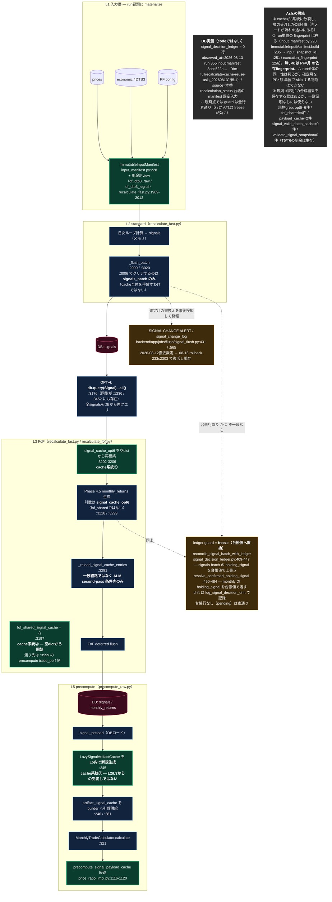

<!-- gist-master: 12cb3fc496e1ce991b1b70480a7b43ce dm-unified-tobe-flow_20260815.md -->
# DM-Signal 統合ToBeフロー（キャッシュ一本化 × provenance）

## 原則（この文書の読み書きを支配する。殿裁定 2026-08-15）

- **ToBeは、構造的に不可能でない限り妥協しない。現実の関数名・行番号・今の実測値で理想を縛らない。理想は磨く。**
- **AsIsは現実のコードそのもの。間違いがあれば現実に合わせて直す。**

---

統合元: `dm-fullrecalculate-cache-reuse-asis_20260813` / `cmd_4296_momentum-window-recon_20260813` / `dm-decision-provenance-asis-tobe-5w1h_20260813` / `dm-weight-expansion-first-principles-asis-tobe_20260815`

## AsIs **v1.3** — 2026-08-15T16:35+09:00 / 対象 `origin/main = 5da7f107`（code固定AsIs。DB実測は observed_at 付きで別記）

変更: v1.0=初版(15:05) → v1.1=軍師指摘3件反映(15:10) → v1.2=家老指摘 code_mismatch 5件反映(15:20) → **v1.3=軍師独立レビュー第2回 A1〜A3 反映(16:35)**: ledger guardはdetect-onlyではなく台帳値へ置換するfreeze guard / fingerprintは存在する（無いのはPF×月依存fingerprint）/ DB実測はcodeと分離しobserved_at付記。全ノードは現物grepの行番号。

## ToBe **v3.3** — 2026-08-15T16:40+09:00

変更: v2.0=縦二本へ再構成+家老指摘反映 → v3.0=左右二軸へ再構成（殿裁定15:20） → v3.1=順序是正で折り返し解消（殿指摘15:58） → v3.2=DBを最下段の独立行にした（殿指摘16:01） → **v3.3=軍師独立レビュー第2回 T1〜T9 反映（16:40）**: config/ledger snapshot を構造解決より前へ（T1）/ ticker集合を全price consumer依存集合へ拡張（T2）/ 前回確定成果物snapshotをL1で read-once し復元元を明示（T3）/ 現fingerprintは judge の前に作る・rule/source version を比較入力に含む（T4）/ cache契約に cumulative を明記（T5）/ 循環=invalid graph で停止（T6）/ C1→X13 読み出しedge（T7）/ L1.1‖L1.2 を同一行の並列枝に（T8）/ nested FoF を depth 2・3・4 の別行へ unroll（T9）。原則: ToBeは妥協せず理想を磨いた。行番号・関数名は持ち込まない。

**左がcache、右が計算。同じ行が同じL。各Lの中で「計算→合流」と「cache→読み出し」が閉じる。cacheは左を縦に、計算は右を縦に流れる。上から下へ一度も戻らない。**

```mermaid
flowchart TB
  classDef cache fill:#0b3d2e,stroke:#19a974,color:#ffffff,stroke-width:2px
  classDef skip fill:#3d2b0b,stroke:#f5a623,color:#ffffff
  classDef calc fill:#12233d,stroke:#4a90d9,color:#ffffff
  classDef sink fill:#3d0b1e,stroke:#d94a6a,color:#ffffff
  classDef rule fill:#2a2a2a,stroke:#888888,color:#ffffff

  subgraph R0["L0 run開始 — 構造の入力を固定"]
    direction LR
    C0["<b>cache を1個だけ生成</b><br/>再生成・複製・空初期化は禁止。identity は最後まで不変<br/>+ <b>config snapshot</b>（全PF構成・重み・momentum規則・rule version）<br/>+ <b>ledger snapshot / watermark</b><br/>+ <b>source version</b>（規則実装の版）"]:::cache
    X0["config と ledger を<b>一度だけ</b>読み snapshot 化<br/>以後の全層はこの snapshot だけを見る"]:::calc
    X0 -.->|"合流"| C0
  end

  subgraph R1S["L1.1 ‖ L1.2 構造解決層（並列。どちらも C0 だけで解ける）"]
    direction LR
    C11["+ <b>price consumer 依存集合</b><br/>= 保有しうる ticker ∪ benchmark ∪ canonical calendar 銘柄 ∪ economic / DTB3 系列<br/>（価格・系列を読む全consumerの和集合）"]:::cache
    C12["+ depth 表 と 実行順序<br/>循環検出結果"]:::cache
    X11["config snapshot だけで解く<br/>standard PF を構成tickerへ分解 → 保有しうる ticker<br/>+ benchmark / calendar / economic の依存を列挙"]:::calc
    X12["config snapshot だけで解く<br/>子・孫・ひ孫まで全経路を辿る<br/>depth(P)=1+max(depth(C_i))、standard は 0<br/>同一PFが複数世代に現れる → 全経路の最大<br/><b>循環を検出したら invalid graph として run 停止（fail-closed）</b><br/>depth と topological 実行順序は停止しない場合のみ確定"]:::calc
    X11 -.->|"合流"| C11
    X12 -.->|"合流"| C12
  end

  subgraph R1["L1 入力層 — 不変入力と前回確定成果物を read-once"]
    direction LR
    C1["+ 不変入力snapshot<br/>prices / DTB3 / economic（C11 の依存集合の範囲）<br/>+ <b>前回確定成果物snapshot</b>（PF×月の W / monthly / cumulative / provenance / 依存fingerprint）<br/>= judge 一致時の<b>復元元</b>。ここで一度だけ読み、以後は左列にしか無い"]:::cache
    X1["C11 の依存集合の範囲だけ prices / DTB3 / economic を一度だけ materialize（modeに依存しない）<br/>+ 前回確定成果物を一度だけ materialize<br/>（永続層を読むのは run 全体でここ一回）"]:::calc
    C11 -.->|"読む"| X1
    C12 -.->|"読む"| X1
    X1 -.->|"合流"| C1
  end

  subgraph R13["L1.3 run identity"]
    direction LR
    C13["+ <b>run identity</b><br/>入力一式（C0 + C1）の同一性（run単位・O(1)）"]:::cache
    X13["C0 と C1 の入力一式から1回だけ導く"]:::calc
    C1 -.->|"読む"| X13
    X13 -.->|"合流"| C13
  end

  subgraph R2["L2 standard（depth 0）"]
    direction LR
    C2["+ standard の signals / W / monthly / <b>cumulative</b><br/>+ provenance / <b>PF×月の依存fingerprint</b>"]:::cache
    X2["<b>a 現fingerprint</b>　PF×月ごとに 入力(C1) + rule version + source version(C0) から<b>先に</b>作る<br/><b>b judge</b>　現fingerprint と C1 の前回fingerprint が一致 → C1 の前回成果物を<b>復元</b>（計算しない）<br/>不一致 → momentum（日次close・months×21営業日・on-or-before）→ 判定 → <b>規則1</b> W=選定銘柄へ1.0<br/><b>c 価格適用</b>　W と価格から monthly / cumulative<br/><b>d 記録</b>　provenance と現fingerprint を合流"]:::calc
    C13 -.->|"読む"| X2
    X2 -.->|"合流"| C2
  end

  subgraph R3A["L3a leaf FoF（depth 1）"]
    direction LR
    C3A["+ leaf FoF の signals / W / monthly / cumulative<br/>+ provenance / 依存fingerprint"]:::cache
    X3A["a 現fingerprint（子standardの fingerprint ∪ 自PF config ∪ rule/source version）→ b judge（一致=C1から復元）<br/>→ 不一致: momentum（入力=子standardの monthly cumulative・窓=月数の行差分）→ 判定 → <b>規則2</b> W=Σ w_i × W(C_i)<br/>→ c 価格適用 → d 記録"]:::calc
    C2 -.->|"読む"| X3A
    X3A -.->|"合流"| C3A
  end

  subgraph R3B2["L3b-2 nested FoF（depth 2）"]
    direction LR
    C3B2["+ depth 2 FoF の同上"]:::cache
    X3B2["<b>前提</b>: 全構成PFの W / monthly / cumulative が C2 ∪ C3A に在ること。欠けたら停止（永続層へ取りに行かない・空で代替しない）<br/>a 現fingerprint → b judge → 不一致: momentum → 判定 → <b>規則2</b> → c 価格適用 → d 記録"]:::calc
    C3A -.->|"読む"| X3B2
    X3B2 -.->|"合流"| C3B2
  end

  subgraph R3B3["L3b-3 nested FoF（depth 3）"]
    direction LR
    C3B3["+ depth 3 FoF の同上"]:::cache
    X3B3["前提: 全構成PFが C2 ∪ C3A ∪ C3B2 に在ること。欠けたら停止<br/>同じ規則2の再適用（a→b→c→d）"]:::calc
    C3B2 -.->|"読む"| X3B3
    X3B3 -.->|"合流"| C3B3
  end

  subgraph R3B4["L3b-4 nested FoF（depth 4 = 現最大。深度が増えれば行を1つ足す）"]
    direction LR
    C3B4["+ depth 4 FoF の同上"]:::cache
    X3B4["前提: 全構成PFが C2 ∪ C3A ∪ C3B2 ∪ C3B3 に在ること。欠けたら停止<br/>同じ規則2の再適用（a→b→c→d）"]:::calc
    C3B3 -.->|"読む"| X3B4
    X3B4 -.->|"合流"| C3B4
  end

  subgraph R5A["L5a 分析派生層"]
    direction LR
    C5A["+ drawdown / rolling / metrics / risk / trade_perf"]:::cache
    X5A["cache の確定値（monthly / cumulative / W）から導く<br/><b>導出だけ。判定へ戻さない</b>"]:::calc
    C3B4 -.->|"読む"| X5A
    X5A -.->|"合流"| C5A
  end

  subgraph R5B["L5b 表示投影・永続化層"]
    direction LR
    C5B["（cacheへの追記なし）"]:::cache
    X5B["cache から表示成果物を組み立てる<br/><b>永続層を読まない</b>"]:::calc
    C5A -.->|"読む"| X5B
  end

  C0 --> C11
  C0 --> C12
  C11 --> C1
  C12 --> C1
  C1 --> C13 --> C2 --> C3A --> C3B2 --> C3B3 --> C3B4 --> C5A --> C5B
  X0 --> X11
  X0 --> X12
  X11 --> X1
  X12 --> X1
  X1 --> X13 --> X2 --> X3A --> X3B2 --> X3B3 --> X3B4 --> X5A --> X5B

  subgraph RDB["永続化（最下段）"]
    direction LR
    CDB["（cacheへの追記なし）"]:::cache
    DB[("<b>DB</b>　書き切り。run の途中で誰も読み返さない<br/><b>禁止</b>: L2 以降のどの層も永続層を読まない。必要な値は必ず左列の cache に在る<br/>永続層を読むのは L0（config/ledger）と L1（prices/前回確定成果物）の read-once だけ")]:::sink
  end

  C5B --> CDB
  X5B -.->|"書き切り（永続化はここだけ）"| DB

  INV["<b>不変量</b><br/>① W の定義は 規則1 と 規則2 のみ<br/>② 控え（前回確定成果物）を使うのは fingerprint 一致を示せた時だけ。復元元は L1 で read-once した snapshot<br/>③ Σ W = 1.0 を各段で検算<br/>④ 確定した過去は 入力・規則・規則実装の版 が変わらない限り変わらない（fingerprint の入力に rule/source version を含む）<br/>⑤ 深度は浅い順に直列。depth ごとに1行。graph は topological fold を一方向に unroll した形で書く<br/>⑥ 構成PFの深度は混在してよい（standard との同居を含む）<br/>⑦ 計算開始の前提は全構成PFが上段の cache に在ること。欠けたら停止<br/>⑧ config だけで解けるものは計算前の構造解決層で解く。構造解決の入力（config/ledger snapshot）は L0 で先に固定する<br/>⑨ 全経路の最大を採る。循環は invalid graph として run 停止（fail-closed）<br/>⑩ L1.1 と L1.2 は並列（同一行の枝。どちらも C0 だけを読む）<br/>⑪ 分析派生・表示投影・永続化は別責務。分析結果は判定へ戻さない<br/>⑫ 左=cache は縦に一本、右=計算は縦に一本（L1.1‖L1.2 の同一行内の並列枝を除く）。交わるのは各L内の合流と読み出しだけ<br/>⑬ run identity と PF×月の依存fingerprint は別物。混ぜない<br/>⑭ <b>上から下へ一度も戻らない。</b>後段が必要とするものは必ず前段で確定している<br/>⑮ price consumer の依存集合は L1.1 が全消費者分を列挙する（保有ticker だけではない）<br/>⑯ cache 契約は producer の出力と consumer の入力が同じ語で一致する（monthly と cumulative は別々に列挙）"]:::rule
```

## レビュー反映履歴

### v3.3 レビュー反映表（軍師独立レビュー第2回 blt_20260815_161252 → 12件）

| # | 側 | 指摘 | 反映 |
|---|---|---|---|
| A1 | AsIs | ledger guard は detect-only ではなく台帳値へ置換 | AsIs v1.3 LEDG ノードを freeze guard へ訂正（:409-447 / :450-484） |
| A2 | AsIs | fingerprint 無しは偽 | AsIs v1.3 帰結②を「run単位は在る・PF×月が無い」へ訂正（input_manifest.py:228/235/251/256） |
| A3 | AsIs | ledger=0行はDB実測 | LEDGDB ノードへ分離し observed_at / source を付記 |
| T1 | ToBe | config/ledger の producer が無い | L0 に X0（config/ledger read-once）を新設。L1.1/L1.2 は C0 だけを読む |
| T2 | ToBe | benchmark 等の依存が欠落 | C11 を price consumer 依存集合（保有∪benchmark∪calendar∪economic）へ拡張。不変量⑮ |
| T3 | ToBe | judge 一致時の復元元が無い | C1 に前回確定成果物snapshot（read-once）を追加。不変量②へ復元元を明記 |
| T4 | ToBe | 現fingerprint を judge 前に作る責務が無い | X2/X3 を a fingerprint → b judge → c 価格適用 → d 記録 へ。rule/source version を入力に含む（不変量④） |
| T5 | ToBe | C2/C3 に cumulative が無い | 全 cache 契約に cumulative を明記。不変量⑯ |
| T6 | ToBe | 循環時の出力契約不明 | 循環=invalid graph で run 停止（fail-closed）。不変量⑨ |
| T7 | ToBe | C1→X13 edge 無し | 追加。X13 は C0+C1 を読む |
| T8 | ToBe | 並列主張と直列edgeの矛盾 | L1.1‖L1.2 を同一行の並列枝へ（C0→C11/C12、両方→C1）。不変量⑩⑫ |
| T9 | ToBe | X3B の隠れfeedback | depth 2/3/4 を別行へ unroll。不変量⑤ |
