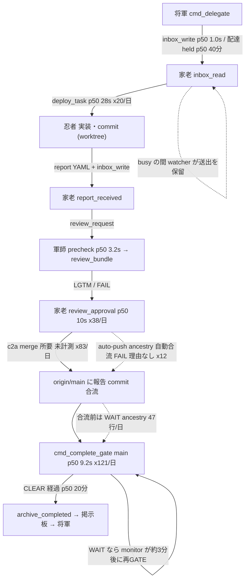

<!-- gist-master: aeaadf72f858a63ab8a1259d43d6aade karo_throughput_asis_20260905.md -->
# 家老スループット AsIs/ToBe — 家老が実行・待機する script/hook/gate の速度台帳と計測修復設計 v2(2026-09-05 15:10 再構築 / v1 14:45→§7 訂正 14:55→§8 セルフレビュー 15:05→家老 REJECT 9 点・軍師 APPROVE 5 所見 15:04 を本文へ統合。殿 15:06『追記でなく再構築、粒度を小さく、情報量を減らすな』 / v2.1 16:55 cmd_4478 着地+修復後 80 分の初回実測を §4.1・§6.7 に統合、§7 を実測順位で書き直し) / v2.2 17:55 殿『穴はないか』→待ち理由別 GATE 時間(§4.2)で §7 を再順位、穴 5 つを §8 へ / v2.4 20:50 loop 更新: §9 20:15〜20:35(cmd_4477/4478/X 台帳/fixture D0 終端、kotaro honest FAIL close 8 分、CI GREEN 14/14)、§6.6 日次表 09-05 再実行 / v2.3 19:00 loop 更新: 前提 0(a) root 収束、publish 道具根治(合流待ち順位 1 への直接効果)、§9 18:22〜18:57

## §0.0 前提条件と我らのスタイル(別の LLM が読む前に)
- 対象: multi-agent-shogun の家老(Codex gpt-5.6-sol、pane shogun:2.1)。家老の仕事=cmd 受領→分解→配備(deploy_task)→報告受領→review 受理(review_approval)→合流(publisher c2a)→GATE(cmd_complete_gate)→archive。忍者 6 名の直列の受け口。
- 殿の問い(14:35): 家老律速は構造的。解決は家老が触る script の圧倒的な拘束か。script/hook/gate を列挙し速度をまとめ、枠外も調べよ。追補(14:50): gate clear 関連も家老の script。家老が待たされる原因は全て家老に関係する。裁定(14:49): まずは計測修復。
- 目的: 家老の 1 動作の時間と、家老の手を止める待ちを数値で分け、拘束すべき対象を決める。機能追加ではない。
- スタイル: シンプルに解決/既存の計測(defense_overhead、function_timing、watcher log)を使う/新規の複雑さを足さない/測ってから直す/壊さない(追加 key のみ、schema 名不変)/可逆に 1 cmd ずつ/推測は「(未計測)」と明記。
- 決定権: 殿。実装は殿 go の後、cmd 単位。本書の v1 の誤り(§7 相当)は履歴として §9 に残す(歴史修正禁止)。
- 数値の出所: 2026-09-05 00:00〜14:40 JST の `logs/defense_overhead.jsonl`(26,066 行)、`logs/cmd_complete_gate_function_timing.jsonl`(231,797 行)、`logs/deploy_task_function_timing.jsonl`(151,032 行)、`logs/gate_metrics.log`、`logs/publisher_daemon.log`、`logs/inbox_watcher_karo.log`(+.1、今日 3,143 行)、将軍の hook 実測(14:41)。

## §1.0 家老を介する便の流れ(フローチャート。数値は §1〜§3 の今日の実測)

- 家老の手が入る箱: B(読む)・C の配備・F(受理)・G(c2a)。それ以外は待ち。
- 待ちが発生する辺: A→B(配達 held)、G(合流)、H(再 GATE)。順位は §4。

## §1 家老が自分の手で回す経路(1 日実測)
| 経路 | 役割 | 回数 | p50 | p95 | 合計/日 | 備考 |
|---|---|---|---|---|---|---|
| `scripts/deploy_task.sh`(/karo-direct 含む) | 忍者へ配備 | 20 | 28.3 s | 50.0 s | 608 s | 内訳: prepare_remote_tip_worktree p50 5.0 s(38 回)、run_python_logged 5.8 s、generate_report_template 4.1 s、inject_semantic_concepts 3.6 s、maybe_notify_draft_review 2.5 s、yaml_field_set_batch 2.0 s |
| `scripts/review_approval.sh` | 軍師 LGTM→家老 accept | 38 | 10.0 s | 21.0 s | 409 s | 内訳 check_id(gunshi_lgtm/karo_accept)は **0 ms 固定**(L821/L826)=10 秒の正体が未計測 |
| `scripts/cmd_complete_gate.sh`(手動起動分) | GATE 判定 | 121 回中の一部(大半は monitor) | 9.2 s | — | 42.7 分(全起動) | §2 |
| publisher c2a merge(`scripts/publisher_c2a_merge.sh` 74 行) | 報告 commit の origin 合流 | 83 行 | (未計測) | (未計測) | — | 所要の計測なし。失敗試行も未記録 |
| `scripts/inbox_read.sh` / `inbox_mark_read.sh` | inbox 処理 | mark_read 3,615(全 agent) | 64 ms | 306 ms | 1,124 s(全 agent) | agent 按分不可(agent 列なし) |
| `scripts/inbox_write.sh` | 送信 | 705(全 agent) | 1,004 ms | 6,774 ms | 1,611 s(全 agent) | 分解済み: persist 74 ms/delivery_verify 2 ms/pre_send_capture 15 ms。**残 900 ms〜6.7 s は nudge(send-keys timeout 5 s+確認ガード capture)** |
| `scripts/bulletin_write.sh` | 将軍宛報告 | 6 | 121 ms | 138 ms | 1 s | memory_db_live_insert 経由で §3.3 の health refresh(p95 24 s)を踏む |
| `karo_workaround_log.sh` / `lesson_write_karo.sh` / `insight_write.sh` | 台帳 | 8 | 335 ms | 498 ms | 6 s | 同上 |
| `scripts/semantic_search.sh` | 概念検索 | 1,347(全 agent) | 366 ms | 2,041 ms | 832 s | 按分不可 |
| `scripts/gates/gate_karo_startup.sh` | /clear 復帰 | 3 | — | — | 53 s | +deepdive replay 2 本(Phase 10+7、所要未計測) |
| `scripts/archive_completed.sh` | 完了 archive | GATE CLEAR 時 | — | — | — | — |

**家老の手の合計: 1 日 20〜30 分**(deploy 10 分+review 7 分+hook §1.1 3〜9 分+送信・台帳 数分)。

### §1.1 家老の 1 tool 呼出しごとの hook(`.codex/hooks.json`、将軍が `echo hi` payload で 14:41 実測、無負荷)
| hook | 実測 | 本番 p50 | 役割 |
|---|---|---|---|
| `codex_inbox_priority_guard.sh` | 93 ms | (未計測) | 将軍指示 180 秒放置で BLOCK(11:3x に出口自己遮断の循環→713d83ed4 根治) |
| `codex_skill_execution_guard.sh` | 136 ms | 258 ms(n=2,832、Codex 7 名合算) | skill 実行証跡 |
| `pre-write-read-tracker.sh` | 5 ms | — | Read 追跡 |
| `pre-bash-combined.sh` | 139 ms | (未計測) | Bash ガード束 |
| `pre-write-edit-combined.sh` | 6 ms | — | Edit ガード |
| `post-bash-combined.sh` | 14 ms | — | 後処理 |
| 合計 | **約 0.39 s/呼出し**(負荷時 0.6〜0.9 s) | | 家老の呼出し数は按分不可(agent 列なし)。400〜600 回なら 3〜9 分/日 |
| prompt ごと | `codex_user_prompt_submit.sh` 462 ms p50(n=495)、`three_layer_preflight` 95 ms p50(n=7,844 全 agent) | | |

## §2 家老が待つ経路(gate clear 側。殿追補 14:50: 全て家老 lane)
| script | 起動者 | 家老との関係 | 今日の実測 |
|---|---|---|---|
| `scripts/cmd_complete_gate.sh` main | monitor(約 3 分ごと再 GATE)+家老 | CLEAR/WAIT/BLOCK 判定 | **121 回、p50 9.2 s、合計 42.7 分**。結果: CLEAR 31/WAIT 66/BLOCK 10。CLEAR までの経過 p50 1,212 s/p95 5,017 s(n=30) |
| 同 `check_report_commit_main_ancestry` | 同 | 報告 commit が origin/main の祖先か | 69 回、p50 2.9 s |
| 同 `check_self_grade_commit_file_coverage` | 同 | | 72 回、p50 5.1 s |
| 同 `cmd_complete_gate_auto_push_ancestry_wait` | monitor | 報告 commit を自動で合流させる経路。**FAIL 時に理由を書かない**(`auto_push_ancestry_retry.log` は日時/cmd_id/PASS|FAIL の 3 列) | index_lock hotfix で 13:58〜14:38 に 12 回連続 FAIL |
| WAIT 理由(gate_metrics 66 行) | | | `report_commit_main_ancestry` **47**、`ci_readiness: ci_evaluation_absent` 7、`ci_push_state BLOCK` 8、`post_deploy_evidence_pending` 2、`review_two_phase_pending` 1 |
| `scripts/publisher_c2a_merge.sh` | 家老 / publisher daemon / publish_direct_commit の fallback | 合流本体 | 83 行/日、所要・失敗ともに未計測 |
| `scripts/safe_shared_main_ff.sh` | c2a/auto-push から | root ff の安全判定 | index mode 100644(CI test #330 の対象) |
| publisher daemon `root sync` | daemon | root を origin に追随 | `postsync_verify_mismatch` 14:05〜14:13 に 7 回連続(origin が台帳 batch で 1 分毎に進む) |
| `scripts/gates/gate_gunshi_report_precheck.sh` / `review_bundle.py` | 軍師 | LGTM の前提 | precheck 118 回、p50 3.2 s、p95 12.6 s |
| `scripts/ninja_monitor.sh` 再 GATE loop | daemon | WAIT cmd を約 3 分ごとに再 GATE | 上記 121 回の大半 |

## §3 枠外(家老の「作業」に数えられないが家老の時間を食うもの)
### §3.1 配達遅延(watcher busy gating)— 最大の枠外
- `logs/inbox_watcher_karo.log`(+.1)。日付形式は `[Sat Sep  5 …]`。
- 今日: Wake-up 送出 **357 回**、うち `DELIVERY-LATENCY-WARN` **178 回**。**held p50 2,423 s(40 分)/p95 6,609 s(110 分)/max 7,175 s**。比較: 疾風 held p50 209 s(n=11)。
- 定義(軍師所見 (1) で確定): 起点=watcher が当該 agent の未読を最初に検知した時刻(`first_unread_seen`)、終点=nudge の send-keys が成功した時刻。lease 更新回数×間隔ではなく実時刻差。
- 意味: 家老宛メッセージの半分は家老が busy のため 40 分〜2 時間遅れて届く。将軍の下知も忍者の報告も同じ列。家老の手(20〜30 分/日)の 100 倍の規模。
- watcher プロセスは agent ごとに親 1+子 1(pgrep 18 本は親子。重複起動ではない=ppid で確認)。

### §3.2 CTX と /clear
- 家老 CTX 11:21 14% → 14:1x 83% → /clear 後 16%。3 時間で 1 周、今日 3 回。復帰=startup gate 約 18 s+deepdive replay 2 本(Phase 10+7、所要未計測)+陣形図/inbox 再読。
- CTX を食う主因(推定、未計測): bulletin_notify が掲示板本文を丸ごと同梱(将軍宛 doc-lane alert 6 本/日も家老 inbox へ)、capture-pane 出力、gate の長い stderr。

### §3.3 memory_db_live_insert の health refresh(全 agent 共通)
- `three_layer_health` 合計 **3,398 s/日**(refresh_window 1,738 s、refresh_verify 939 s、refresh_copy 784 s)。p50 0 ms、**p95 24 s**。非同期経路(refresh_incremental_event 1,630 回 0 ms)は存在し、同期経路に落ちる条件が未特定。
- 呼出し元=bulletin_write / insight_write / karo_workaround_log / lesson_write_karo / cmd_delegate / cmd_quality_log。家老が掲示板 1 本書くたびに最悪 24 秒。

### §3.4 nudge と再読
- monitor の `KARO-PENDING-INBOX`/`RENUDGE-TRANSITION` が 1 分刻みで家老を起こす(14:37、14:38)。作業中でも UserPromptSubmit hook(462 ms)と inbox_read(receipt)が走る。

### §3.5 inbox_write の 1 秒
- p50 1,004 ms/p95 6,774 ms(n=705)。分解済み 3 phase の合計約 90 ms。残りは nudge(send-keys timeout 5 s+確認プロンプトガード)。p95 側は「相手が busy で 5 秒待った」時間。

## §4 律速順位(数値で)
| 順位 | 項目 | 実測 | 種別 |
|---|---|---|---|
| 1 | 家老宛配達の held(busy gating) | p50 40 分、p95 110 分、178 回/日 | 待ち(枠外) |
| 2 | 報告 commit の合流待ち(ancestry WAIT)+auto-push FAIL 理由不明 | WAIT 47 行、CLEAR 経過 p50 20 分、1 cmd 30〜40 分 | 待ち(家老の c2a が直列) |
| 3 | 再 GATE の CPU | cmd_complete_gate main 9.2 s×121=42.7 分/日 | 待ち(daemon) |
| 4 | health refresh 同期経路 | 3,398 s/日、p95 24 s | 枠外 |
| 5 | 家老の手(deploy/review/hook/送信) | 20〜30 分/日 | 家老の手 |
| 6 | /clear 復帰 | 3 回×(18 s+replay 未計測) | 枠外 |

### §4.1 修復後の順位(16:45、§6.7 の 80 分実測。§4 は 14:40 の推定で歴史として残す)
| 順位 | 項目 | 実測(80 分) | 1 日換算 | 種別 |
|---|---|---|---|---|
| 1 | 将軍 cmd_save の三層検索(three_layer_memory_ruling_overhead) | 13 回×p50 121 s=29 分 | 起票 1 本 2 分。cmd_save save_total p50 10 s のうち三層が 9 割 | 将軍の手 |
| 2 | three_layer_health refresh(daemon、全 agent 共通) | 33 分 | 6 時間超 | 枠外(CPU 競合で全員を遅くする) |
| 3 | 家老 deploy_task | 7 回×p50 73 s=7.6 分 | 45 回×44 s=33 分(日次表) | 家老の手 |
| 4 | 配達 held WARN | 5 件、65〜139 s | 未確定(3 日分待ち) | 待ち |
| 5 | 家老 hook(three_layer_preflight 532 回 3 分+skill guard) | 3〜4 分 | 日次表: codex_skill_execution_guard 6,508 回×469 ms=76 分(全 Codex agent 合算) | 家老の手 |
| 6 | 合流 c2a | 6 回 39 s | — | 家老の手(速い) |

### §4.2 便の「待ち」を理由別に積む(17:49、gate_metrics 今日 CLEAR 41 cmd。§4.1 は「手」、本表は「待ち」。両者は足せない)
| 理由 | 待ち合計 | 比率 | 該当 cmd |
|---|---|---|---|
| report_commit_main_ancestry WAIT(report commit が origin に未合流) | 418 分 | 39% | 33/41 cmd で発生 |
| report_commit_main_ancestry BLOCK(同上、BLOCK 判定) | 286 分 | 27% | 同上 |
| parent_cmd_contract BLOCK | 220 分 | 21% | 4476 ほか |
| dm_signal_production_smoke_failed BLOCK | 93 分 | 9% | 4475 |
| post_deploy_evidence_pending WAIT | 36 分 | 3% | |
| ci_readiness / ci_push_state / review_two_phase | 15 分 | 1% | |

- 41 cmd の first gate→CLEAR は p50 3.6 分だが、30 分超が 8 cmd あり、その 8 cmd の待ちはほぼ全て ancestry(例: release_ci_clean_repro_level5_v2 165 分中 164 分、deploy_external_worktree_timeout 106/106、ninja_monitor_index_lock 91/89、ga580_prepush_case8 67/67)。
- **判断**: 便の時間の 66% は「忍者の report commit が origin へ合流するまで」。家老の手(80 分で 20 分)でも hook の ms でもない。v2.1 §7 が三層検索・health refresh を先に置いたのは「手の p50」で並べた誤り(§9 17:49 行)。

## §5 殿の仮説「script の圧倒的な拘束」への回答(事実→判断)
- 事実: 家老が手で回す script は実質 7 本(deploy_task / review_approval / cmd_complete_gate / c2a / inbox_read+mark_read / inbox_write / bulletin_write)で既に拘束に近い。1 本最大 30 秒、合計 20〜30 分/日。
- 事実: 遅く見える時間の大半は待ち(順位 1〜3)と枠外(4, 6)。script の中身を速くしても順位 1〜2 は消えない。
- 判断: 拘束は正しいが対象は **script の本数ではなく「家老の手を要する合流の回数」と「家老が busy の間に止まる配達」**。忍者報告→軍師 LGTM→publisher が自動で合流→GATE として家老は例外のみ触れば順位 2 が消える(単一 publisher 設計 U3 の auto-push ancestry 経路そのもの。今日 12 回 FAIL したまま理由が記録されていない)。順位 1 は配達の busy gating の設計見直し。いずれも **計測が先**(§6)。軍師所見: この判断は正しい(15:04)。

## §6 計測修復 ToBe(cmd_4478。殿 go 14:49。家老 REJECT 9 点・軍師 5 所見を織込済)
### §6.1 計測の穴 6 つと修正箇所 8 箇所(家老①: 件数を分けて二値化)
| 穴 | 修正箇所 | file | 何を書く | event_id / 定義 | 後方互換 |
|---|---|---|---|---|---|
| A. function_timing に時刻がない | 1. cmd_complete_gate.sh の printf | `scripts/cmd_complete_gate.sh` L961 付近 | 既存 function_coverage.v1 と同名の `observed_date`/`observed_at` key を追加。**schema 名は v1 のまま**(家老⑥: 「旧行」「observed 列付き v1 行」と呼ぶ) | `observed_at` は **execution 開始時に UTC を 1 回取得し全 rank 行で再利用**(家老⑦: 日跨ぎ分裂防止)。書式は function_coverage.v1 と同じ `date -u +%F`/`%FT%TZ`(軍師 (2)) | 読み手(`scripts/lib/function_coverage.sh`、ninja_monitor、cmd_complete_gate、deploy_task)は key 参照→無影響。集計側は key 不在なら execution_id 末尾 epoch(μs)→UTC ISO へ変換 |
| A | 2. deploy_task.sh の printf | `scripts/deploy_task.sh` | 同上 | 同上 | 同上 |
| A | 3. ninja_monitor.sh の printf | `scripts/ninja_monitor.sh` L1793 付近 | 同上 | 同上 | 同上 |
| B. defense_overhead に agent がない | 4. writer | `scripts/lib/defense_overhead_writer.sh` | top-level `agent` key を自動付与。**agent=実行者に固定**(家老②)。解決順 `SHOGUN_AGENT_ID`→(`TMUX_PANE` が有効な時だけ)`tmux display-message -t "$TMUX_PANE" -p '#{@agent_id}'`→`'-'`(家老 v2-③: target 無指定は multi-client で別 pane に誤帰属)。値は `[a-z0-9_-]{1,32}` か '-'(家老⑧)。reserved key 集合へ `agent` 追加 | 配達先など別の主体は `metadata_json.target_agent` に持つ | 読み手 12 file は全て書き手側。純粋な読み手=ninja_monitor の pre_push metrics(source を grep)、`lib/defense_overhead_event_index.py`(event_id のみ)→追加 key は無害。`scripts/deploy_task/state.sh` L485 の生 JSON 追記は agent **key 自体が無い**→集計側で「key 不在」も '-' と同一視(軍師 (2))。tmux 無し環境では '-' で **書く**(fail-open) |
| C. review_approval の内訳が 0 固定 | 5. 2 箇所 | `scripts/review_approval.sh` L821/L826 | 既存 `REVIEW_APPROVAL_TOTAL_T0_US` と同じ `date +%s%N` 差分で gunshi_lgtm/karo_accept の実測 wall_ms | 既存 event_id 規約のまま | なし |
| D. auto-push FAIL に理由がない | 6. retry_log の FAIL 行 | `scripts/cmd_complete_gate.sh` gate_run_auto_push_ancestry_retry | 関数 stdout 全体を capture し **最後の** `AUTO_PUSH_WAIT` 行から result/reason を抽出、非空でなければ `reason=unknown`(家老⑨)。**PASS/FAIL 全行**に tab 区切り 4 列目=`result=<PASS|SKIP|FAIL> reason=<…>`、5 列目=outer rc を付ける(家老 v2-④: helper_missing / remote_tip_unresolved は現コードで rc 0 かつ result=SKIP。semantic result と outer rc は別列) | — | 既存読み手は同 script のみ、3 列目まで参照 |
| E. c2a の所要・失敗が見えない | 7. c2a 本体 | `scripts/publisher_c2a_merge.sh` | 先頭 `T0`。**既存の `trap 'rm -rf -- "$WORK"' EXIT`(L20)を上書きしない**: 単一 `on_exit` にまとめ、元 rc 保存→既存 cleanup→PASS/FAIL を同期記録(fail-open、telemetry 失敗でも本処理 rc 不変)→元 rc を返す(家老 v2-①)。`defense_overhead(source=publisher_c2a, check_id=c2a_merge_total, wall_ms)`(家老③、軍師 (1)) | `event_id=c2a:<task>:<commit>:<attempt>`(家老③④。既存 writer の UNIQUE event_id で 2 件目以降が抑止されないよう attempt を含む) | stdout の既存行(`publisher_c2a_merge: pushed …`)は不変(publish_direct_commit が grep) |
| F. 配達 held が人間向けログのみ | 8. watcher | `scripts/inbox_watcher.sh` L1591 直後 | watcher は長寿命 daemon なので `defense_overhead_write_async`(PID 配列へ追記し caller が drain する契約、`DEFENSE_OVERHEAD_ASYNC_PIDS`)を**そのまま使わない**(家老 v2-②: drain なしで +600〜800/日 無期限増加)。代替=同期 `defense_overhead_write` を **配達 send-keys の後**に呼ぶ(配達を待たせない位置)か、完了子を非 blocking(`kill -0`/`wait -n`)で回収して配列を bounded 化する。`metadata_json={"target_agent":"<agent>","unread":N}` | `event_id=held:<agent>:<first_unread_seen>:<fingerprint>`(家老④) | stderr の人間向け行は残す。watcher は全 agent で動くため増分は全体で +600〜800 行/日(karo 178 含む)、c2a +83〜166 行/日=現状 26,066 行/日の約 3%(軍師 (3) で訂正)。rotation(max_bytes 64 MB/keep 50,000 行)は既存のまま |

### §6.2 日次表 `scripts/karo_throughput_report.sh <YYYY-MM-DD> [--as-of <ISO>]`
- 入力(読むだけ): `logs/defense_overhead.jsonl`(agent 別と全体、`source×target_agent` で家老 lane)、function_timing 2 本(observed 列付き行と旧行の両方)、`logs/gate_metrics.log`、`logs/inbox_watcher_karo.log`(+.1、`[Sat Sep  5` 形式)、各 cmd の `auto_push_ancestry_retry.log`。
- 出力: `--as-of` 指定時は `docs/research/karo_throughput_daily/<date>_<asof>.md`(履歴を上書きしない。家老 v2-⑤)、`<date>.md` は終日確定(翌日以降の無指定実行)の 1 回だけ生成。列は §1/§2/§3.1/§4 と同じ(経路・回数・p50・p95・合計、WAIT 理由別、配達 held 分位、agent 別按分)。
- 完了の二値(家老⑤): **固定 fixture で 2 回実行して exact 一致**+本番ログは `--as-of <cutoff>` を固定した時のみ一致(live log は増えるため無指定の再実行一致は要求しない)。
- 既存 `throughput_scan.sh`/`throughput_growth_loop.sh` は S1/S2 insight 用で名称・出力先・用途が分離(軍師 (4))。cron 登録は別 cmd(まず手動で 3 日分を見る。軍師 (5): 日次表は 3 日蓄積後に意味を持つが §6.3 の並行可により同 cmd に残す)。

### §6.3 依存関係(順序)
1. 修正箇所 4(agent 自動付与)が先。7(c2a)・8(watcher)・5(review)は 4 の後に書くと agent が付く。
2. 修正箇所 1〜3(function_timing)と 6(auto-push 理由)は単独。
3. §6.2 の集計は新 key を任意として読む(無ければ '-'/epoch fallback)→ 修正箇所と並行して書ける。
4. 外部依存なし(bash/python3 のみ、新パッケージ 0)。

### §6.4 test(隔離 fixture、test_necessity 付き)
| test | 不変量 |
|---|---|
| writer: agent 付与 | `SHOGUN_AGENT_ID=x` で agent=x、tmux 無しで '-'、不正値は '-' に落ちる |
| writer: 既存 key 不変 | 変更前の 6 引数呼出しが同じ行(+agent)を書く |
| function_timing: observed 列 | 同一 execution の全 rank 行で observed_at が同一 |
| 集計: 3 fixture | 「agent key 不在行」「agent='-' 行」「observed 列なし旧行(epoch μs→UTC ISO)」を読んで表が出る |
| c2a: PASS/FAIL | 成功・失敗の両方で 1 行、event_id が attempt で異なる |
| watcher: held | 同一 first_unread_seen で 1 event、target_agent が metadata に入る |
| auto-push: reason | source_publication_failed / helper_missing の敵対 fixture で reason が入り、AUTO_PUSH_WAIT 行なしで reason=unknown |
| 日次表: 冪等 | 固定 fixture 2 回 exact 一致。`--as-of` 別値が別 file に出て既存 file を上書きしない |
| c2a: 既存 trap | telemetry を失敗させても本処理 rc と `$WORK` cleanup が変わらない(敵対 fixture) |
| watcher: 資源 | 1,000 event 後も子プロセス数と PID 配列長が bounded、配達の send-keys 時刻が telemetry の有無で変わらない |
| agent: multi-client | 2 pane fixture で `TMUX_PANE` の pane にだけ帰属、`TMUX_PANE` 無しは '-' |
| auto-push: 全行 | PASS/SKIP(rc 0)/FAIL の 3 種で 4 列目 result/reason と 5 列目 rc が期待どおり |
| 既存読み手 | `defense_overhead_event_index.py` と gate_karo_startup が変更前と同じ結果 |

### §6.6 実装状態(修正箇所 8 の着地。殿 15:19『D0 で直せるところは将軍自身で』)
| 修正箇所 | 状態 | 証跡 |
|---|---|---|
| 1-3 function_timing observed 列 | 将軍 D0 着地 7d947ac33 | cmd_complete_gate/deploy_task/ninja_monitor の 3 printf、execution 開始時 1 回取得 |
| 4 writer agent 列 | 着地 7d947ac33。本番で agent=shogun 行を確認(15:38、tail 200 行中 164 行に agent) | test_defense_overhead_writer.bats 19/19(agent 4 fixture+reserved 拒否 rc 3) |
| 5 review_approval 実測 | 着地 7d947ac33 | test_review_approval.bats 20/20 |
| 6 auto-push result/reason/rc | 着地 7d947ac33(関数戻り値は既存契約どおり 0、結果は retry_log 4〜5 列目) | test_cmd_complete_gate_source_publish.bats 23/23、test_cmd_complete_gate.bats 338/338 |
| 7 c2a 単一 on_exit | 着地 7d947ac33 | 敵対 test(telemetry 失敗で rc 不変)は cmd_4478 に残す |
| 8 watcher held event | 着地 7d947ac33。**既存 watcher は起動時に script を読むため次の respawn から有効**(kill しない。monitor の hot-reload/次回 /clear 起動で切替) | test_inbox_watcher.bats 7/7、test_ninja_monitor_stall.bats 176/176。**16:45 実測で delivery_held 36 event が本番に出ている=有効**。watcher 全 instance は 16:49 に再起動済み |
| §6.2 日次表 script | 着地 ee4fc25ad(疾風、cmd_4478 16:3x 完了、軍師 LGTM 16:4x)。将軍が 16:45 に初回実行→`docs/research/karo_throughput_daily/2026-09-05.md` 生成 | 家老 accept/push 待ち。footer の `held=0` が表の 36 行と不一致(footer は watcher log 由来の別集計)=次 hotfix 候補 |
| §6.4 の敵対 test(c2a rc 不変/watcher bounded/agent 2 pane/auto-push 3 種) | 着地 ee4fc25ad(実装 diff 0、test のみ) | run_tests receipt 21/21・23/23(疾風報告 AC1) |

### §6.7 修復後の初回実測(15:25〜16:45 JST の 80 分、`defense_overhead.jsonl` 6,975 行。§6.1 の穴が塞がった直後に何が見えたか)
| 見えたもの | 実測 | 14:40 時点(修復前)の推定との差 |
|---|---|---|
| agent 列 | 6,975 行中 karo 1,032 / shogun 695 / hayate 680 / kagemaru 489 / gunshi 305、無帰属 1,556(three_layer_health 等の daemon)、`-` 992(tmux 外) | 按分不可→可 |
| **agent 別の合計時間** | **shogun 59 分 / 無帰属 33 分 / karo 20 分 / hayate 11 分 / watcher 8 分 / kagemaru 8 分 / gunshi 7 分** | 「家老の手 20〜30 分/日」は正しかった。**最大消費者は将軍**(下記) |
| 将軍 cmd_save の three_layer_memory_ruling_overhead | 13 回、p50 121 s、合計 29 分(80 分のうち) | 修復前は q11 に埋もれて不可視。将軍の起票 1 本=2 分が三層検索 |
| 家老 deploy_task deploy_total | 7 回、p50 73 s、合計 7.6 分 | §1 の 30 s 推定より重い(外部 repo 配備を含む) |
| 家老 three_layer_preflight | 532 回、p50 220 ms、合計 3 分 | 家老の全 tool 呼出しに乗る hook の実コスト |
| 配達 held(watcher event) | 34 event、p50 1 s、WARN 5(shogun 131/139/91 s、kotaro 65/69 s)。宛先: shogun 9 / karo 8 / kagemaru 5 / hayate 4 | §3.1 の p50 2,423 s は watcher stderr 行(first_unread_seen→send 成功)の 00:00〜14:40 集計。event は 15:25 以降の別定義(watcher 再起動後)なので**同列比較不可**。3 日分の event を待って再判定 |
| c2a 合流 | 6 回、PASS 5 / FAIL 1、p50 5.7 s、最大 12 s | 合流 1 回は速い。遅いのは合流が起きるまでの待ち(順位 2 のまま) |
| review_approval 内訳 | gunshi_lgtm 33 / karo_accept 31 / total FAIL 9、p50 0 s、最大 39 s | 10 秒の正体は receipt 待ちでなく稀な最大値 |
| health refresh(全 agent 共通) | refresh_window 164 回 16.6 分+verify 10 分+copy 6 分=**33 分/80 分** | §3.3 の 3,398 s/日を上回る速度で増えている(1 日換算 6 時間超の CPU) |

- **§6.7 の判断**: 修復前の順位 1〜2(held、合流待ち)は「待ち」で、修復後の agent 列は「手」を測る。両者は足せない。手の順位は **将軍 cmd_save の三層検索 > health refresh(daemon) > 家老 deploy_task > 家老 hook**。殿の下問「家老律速は script の拘束か」への追補回答: 家老の手は 80 分で 20 分、将軍の手は 59 分。**家老より先に将軍の cmd_save と daemon の health refresh を速くする方が便全体の速度に効く。**

### §6.5 やらないこと(複雑化禁止)
schema 名変更(v2)/新台帳 file/cron 登録/watcher の held 解消/合流自動化/health refresh 非同期化/速度最適化。全て計測後の別 cmd。

## §7 次の一手(順序。v2.2 で §4.2 の「待ち」比率に再順位。v2.1 の順位は §9 16:48 行の履歴)
0. **前提(事前にやること。これなしで速度 cmd を起票しない)**
   - (a) 共有 root の分岐を収束(17:48 家老へ名指し msg_174648)。c2a 合流後に root ref を origin へ同期する 1 行を publisher に足す(穴 2 の再発防止)。**18:52 将軍が無損失収束**(root 固有内容 0 を一次確認: 将軍 8 commit=cherry-pick 済み、軍師 2 commit=499eb209、dirty∩変更=karo_workarounds.yaml 1 file で worktree 固有行 0 → tag root-pre-converge-20260905-1855、変更 24 path checkout、update-ref。ahead 0/behind 0)。一般修正(変更 path 限定 materialize+equivalent-source+有界 index-lock retry)は家老 D0 で敵対 35/35・58/58 PASS、root 実再走 2 回 PASS(家老 18:57)。publisher.sh postsync の tip 文字列比較=偽 BLOCK も家老 D0 中。
   - (b) 日次表に 2 表追加: 「待ち理由別 GATE 時間」(§4.2 を毎日出す)と「負荷 proxy」(three_layer_preflight_total の時間帯別 p50。load average の直接記録は無いため proxy と明記、穴 4)。判定軸を手の p50 から便の待ち分へ移す。**将軍 D0 着地 17:57**(karo_throughput_report.sh、bats 22/22)。本日全量: ancestry BLOCK 782 分+WAIT 391 分=58%、cdp_production_check 17%、parent_cmd_contract 11%。
   - (c) 帰属不能 42% を埋める: daemon 行は agent=daemon 名(three_layer_health 等)、tmux 外の inbox_mark_read は「<owner>-inbox」(穴 3)。**将軍 D0 着地 17:57**(gate_three_layer_health.sh / inbox_mark_read.sh に SHOGUN_AGENT_ID fallback、pane 内は writer の tmux 解決を優先。bats 22/22・8/8・29/29・1/1)。効果は明日の日次表の agent 按分で判定。
   - (d) held の定義を watcher event 側に統一し footer を直す(**将軍 D0 着地 17:57**: 日次表は event 行を正本、stderr 行を legacy と明記、footer held_event/held_legacy に分離。本日 event 71 件 p50 1 s p95 189 s WARN 9)。defense_overhead.jsonl(1 日 25 MB/11 万行)の日次 rotation は writer に archive 機構が既にある(defense_overhead_writer.sh L103)ため発火条件を確認してから。
   - (e) baseline 3 日(9/6〜9/8)を (b) の表で取る。
1. **合流待ち(66%)**: 忍者 report commit→origin 合流を家老の手を介さず自動化(単一 publisher U3 auto-push ancestry の完成)。判定=§4.2 の ancestry 行が 704 分→100 分未満/日。**18:22〜18:33 将軍 publish_direct_commit 根治**(殿『コミットをまとめるメリットは？』): root 分岐でも commit→c2a、c2a が他者の未合流 commit と衝突すれば isolated cherry-pick で自分の 1 commit のみ origin へ、--republish <sha>。将軍 commit は家老の手も root 収束も待たなくなった(7 commit を 10 分で origin へ)。忍者 report commit にも同経路を適用すれば順位 1 の本体が消える=次 cmd の候補。
2. **parent_cmd_contract BLOCK(21%)**: 4476 型(task YAML 重複 field で 2 gate 矛盾)の真因を日次表の cmd 列で追い、契約検証を deploy 時に前倒し。判定=同行 220 分→0。
3. **配達 held**: (d) 統一後の event で 3 日見て閾値/lease を判断。判定=WARN 件数。
4. 家老 deploy_task p50 40 s の内訳(inject_* と外部 repo clone)を observed_at で出し重い 1 関数だけ直す。
5. health refresh の同期経路(1 日 118 分 CPU)を非同期化。便の時間ではなく全員の hook を軽くする。
6. 将軍 cmd_save の三層検索は平常 p50 2.8 s(§9 17:47 行: 121 s は孤児負荷 77 下の異常値)。負荷対策(孤児 guard は半蔵 b57e576ee で着地)で足り、専用 cmd は起票しない。
- 判定の型: 各項目は日次表の同じ行の before/after で二値判定。表に出ない改善は改善と数えない。

## §8 計測が壊れている/無い箇所の一覧(本書で発見。§6 で全て塞ぐ)
| 箇所 | 状態 | 影響 |
|---|---|---|
| function_timing の時刻 | execution_id 末尾 epoch のみ | 日付集計に epoch parse が要る |
| defense_overhead の agent | 列なし | 家老按分不可(1,928 行/日の inbox_write、3,615 行の mark_read、2,832 行の skill guard が誰のものか不明) |
| review_approval 内訳 | 0 固定 | 10 秒の正体が不明 |
| auto_push_ancestry_retry.log | PASS/FAIL のみ | 12 回連続 FAIL の真因が追えない |
| publisher_c2a_merge | 計測なし | 合流 1 回の所要・失敗率が不明 |
| watcher held | stderr の人間向け行のみ | 順位 1 が日次で追えない |
| (穴 1, 17:49) §7 の順位軸 | 「手」の p50 で並べ「待ち」を見ていなかった | 便の 66% を占める合流待ちが 6 番目に置かれた→§4.2 で再順位 |
| (穴 2) root 分岐の構造 | 忍者 commit を root に置き c2a が別 commit で合流→root 永久分岐。drain は dirty で先に止まり分岐通知が誰にも届かない | 16:3x〜 publish・掲示板 yaml・drain 全停止(本日実証) |
| (穴 3) 帰属不能 42% | daemon(three_layer_health 2,707 行)と tmux 外 mark_read(1,544 行)が agent 無し | §6.7 の agent 別合計が過小 |
| (穴 4) 負荷列なし | load average・孤児数が日次表にない | 三層検索 2.8 s→121 s の振れを負荷で正規化できず、3 日比較の前提欠落 |
| (穴 5) held 定義と footer、rotation | 修復前 stderr(p50 40 分)と修復後 event(p50 1 s)が同名で別物、footer 件数が表と不一致、jsonl 25 MB/日で rotation 無し | 同じ名前で違う物を数える |

## §9 殿裁定とレビュー判定の記録(時刻付き。歴史修正禁止)
| 時刻 | 何が起きたか |
|---|---|
| 14:35 | 殿下問。 |
| 14:45 | v1 公開(gist aeaadf72)。§1〜§5。**誤り 2 つ**: (i) function timing を「今日 0 行」と書いた=timestamp 文字列で filter した集計誤り。実在し epoch で集計できた (ii) watcher nudge を「0 件」と書いた=日付形式 `[Sat Sep  5` を `2026-09-05` で grep した誤り。 |
| 14:49 | 殿『まずは計測修復』。 |
| 14:50 | 殿『gate clear 関連も家老の script。待たされる原因は全て家老に関係する』→§2 として統合。 |
| 14:55 | §7 訂正(function timing 実測、gate main 9.2 s×121、配達 held p50 2,423 s)、律速順位を更新。 |
| 14:57 | 殿『影響範囲・依存関係を深くセルフレビュー、更新後に家老と軍師へ忖度なしレビュー』。 |
| 15:05 | §8 セルフレビュー(読み手・呼び手の rg 全数、削ったもの)。家老・軍師へ依頼(msg_150100/150102)。 |
| 15:04 | 家老 REJECT 9 点(件数二値化/agent 意味混在/c2a 成功のみ/event_id 契約/同日 2 回一致は不可/v1・v2 矛盾/observed_at 日跨ぎ/reserved 集合・値検証・tmux 無し fixture/auto-push 理由の抽出法)。全て §6 へ採用。 |
| 15:04 | 軍師 APPROVE+5 所見(c2a FAIL 不可視と held 定義/agent key 不在 fixture と μs→ISO/増分は全 agent 合算/throughput_scan と混同なし/(g) 分離は任意)。全て §6 へ採用。 |
| 15:06 | 殿『追記でなく再構築、粒度を小さく、情報量を減らすな』→本 v2。v1 全文は git 履歴(9aa586607 まで)。 |
| 15:07 | 殿『家老を介する流れはフローチャートが必要』→§1.0。 |
| 15:14 | 軍師 v2 確認: 追加所見なし、配備可。 |
| 16:25 | 配達 held の忍者側実例(家老 GA-582 報告): 小太郎への scope 承認 16:16 が配達遅延で未読のまま、16:24 に旧 scope で FAIL 報告=8 分の held が 1 FAIL ループを生んだ。§3.1 の順位 1 は家老宛だけでなく忍者宛にも効く。 |
| 16:14 | cmd_4478 を残スコープ(敵対 test 5 群+日次表)へ書き直し、疾風へ配備。 |
| 16:3x | 疾風 cmd_4478 完了報告(ee4fc25ad、実装 diff 0、receipt 21/21・23/23)。16:4x 軍師 LGTM。 |
| 16:45 | 将軍が日次表を初回実行(`karo_throughput_report.sh 2026-09-05`)。§6.7 の 80 分実測を得る。最大消費者は将軍 cmd_save の三層検索(29 分/80 分)、次に health refresh daemon(33 分)。 |
| 16:48 | 殿『設計書を覚醒して更新せよ』→v2.1(§4.1・§6.7 新設、§7 を実測順位で書き直し)。 |
| 17:28 | cmd_4478 GATE CLEAR(publisher fe58c137a で合流。root は ee4fc25ad で分岐=穴 2 の実証)。 |
| 17:47 | 殿『どこまで進んだ？速度で示せ』→速度改善実装 0 本、計測修復のみ着地と回答。修復前/後/直近の p50 比較で三層検索 2.8 s→121 s→計測なし=孤児負荷の異常値と判明。 |
| 17:49 | 殿『穴はないか？事前にやるべきことは？』→一次で穴 5 つ確定(§8)。最大は §7 の順位軸の誤り(待ち 66%=合流)。 |
| 17:50 | 殿『覚醒してアップデートせよ』→v2.2(§4.2 新設、§7 を「前提 0→合流待ち→parent_cmd_contract→held」へ再順位、§8 に穴 5 つ)。 |
| 17:53 | 殿『将軍が D0 で覚醒して根治できることは先にしよう』→§7 前提 0 の (b)(c)(d) を将軍 D0(日次表 2 表+held 定義統一、帰属 fallback 2 源)。(a) root 収束は家老が影丸へ ci_fix safe_ff_dirty_overlap(update-ref+dirty blob 保持+c2a 後同期)配備済み。 |
| 18:01 | 殿『ガードのバグは迂回せず根治』→三層 preflight guard 根治(agent_id の tmux 不応答→pane cache、verify 失敗理由 log)、bats 66/66、家老確認依頼。 |
| 18:22 | 殿『コミットをまとめるメリットは？』→無し。publish_direct_commit の rc=8 停止(root 分岐)を待機で迂回していた=洗脳 #5/#3/#6/#2(殿 18:35『洗脳では？』で自己検出)。道具を 2 段根治し 7+1 commit を即 publish。 |
| 18:37 | 軍師バグ#5(files_modified 空の honest FAIL が approval 不能)を将軍 D0(review_approval 構造 no-code 判定、50/50、f4dbf1f46)。軍師検証 PASS 18:45。 |
| 18:49 | 殿『家老は順調か？利他で協調』→家老は safe_ff tool 単独 D0・6 忍者 idle・root behind 84。将軍が root を無損失収束 18:52(§7 前提 0(a))。家老は tool 一般修正を D0 完了(35/35・58/58)、影丸配備は殿の D0 裁定で不採用。 |
| 15:15 | 家老 v2 差分レビュー REJECT 継続 5 点(c2a の既存 EXIT trap 上書き/watcher の async PID 無 drain/tmux target 無指定の誤帰属/helper_missing は rc 0・SKIP で test と矛盾/--as-of 別値が同 file を上書き)。将軍が現物で 5 点とも確認(trap L20=1、ASYNC_PIDS 追記=1・watcher の drain=0、display-message target=0、SKIP rc 0=2)→§6.1 行 4/6/7/8・§6.2・§6.4 へ採用。 |

| 20:15 | 便の終端 4 本(cmd_4477 FAIL_CLOSE・cmd_4478 CLEAR・X 台帳 D0・CI fixture D0 208df246d)を家老報告→将軍独立再現(50/50 SKIP0、production 差分 0)で承認。root ahead 0/behind 0。 |
| 20:23 | startup gate WARN『failed task 残置 kotaro 2h』=バグ#5 発現時点で approval 記録不能のまま止まった案件。将軍が順序付き 1 通→家老が approved_honest_fail→generation 3c35a616 archive→idle まで 8 分で終端(20:31)。元 run の failure は後続 run 33962661843 で出現 0。軍師 Q6 検証: #5 先送り+#3 他者依存(『家老 lane』分類)。 |
| 20:35 | CI GREEN run 33963211348 job 14/14(head 75fdfcc05 on main)。日次表 09-05 再実行: gate_clear 42、held_event 122、retry 6、deploy_total p50 40.8s/p95 247s、cmd_save save_total p50 9.9s/p95 446s(quality_gate p95 349s・q11_semantic p95 346s が尾)。 |

## §10 因果リンク
- ← [[殿下問_家老律速の拘束_20260905_1435]] / ← [[単一publisher_asis_tobe_5w1h_20260902]] U3 auto-push ancestry / ← [[cmd_4393_karo-waste]](08-24 の workaround/配備反復集計)
- → [[karo_throughput_計測修復]](cmd_4478 CLEAR 17:28) → [[root分岐_c2a後ref同期]](穴 2) → [[合流待ち_auto_push_ancestry]](66%) → [[parent_cmd_contract_前倒し]] → [[配達held_解消]] → [[health_refresh_非同期化]] → [[合流の自動化]] → [[health_refresh_非同期化]]
