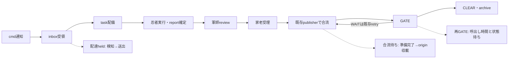
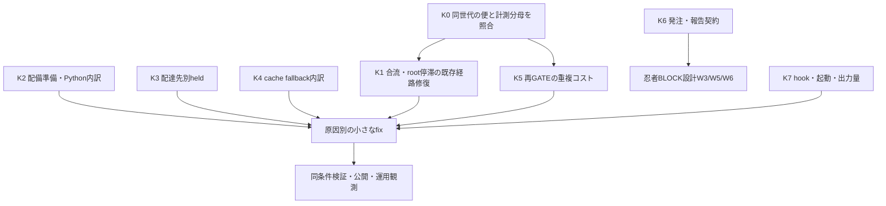

<!-- gist-master: aeaadf72f858a63ab8a1259d43d6aade karo_throughput_asis_20260905.md -->
# 家老スループット — 配備・合流・待機のAsIs/ToBe設計 v3.1(2026-09-06 12:15 日次表更新、K3 候補=root 合流の自動化(F-15 で 18 path 手動監査が発生)) / v3.0

一次確認: 2026-09-05 23:26:06 JST。殿「同様にアップデートせよ」に基づく配備設計。
旧v2.5全文は `docs/research/karo-throughput-v2-5-evidence-20260905.md` に保存。既存gist IDと過去の観測時刻を保持する。

## 進捗ビジュアル(将軍 loop 更新 2026-09-06 16:25)

**全項目(K+日次表)** `██░░░░░░░░ 1/4` ✅完了 🟡走行中 ⏳待ち 🔴要判断
状態集計: ✅ 1 / 🟡 1 / ⏳ 1 / 🔴 1(表の 4 行)
次の一手: K3(root 合流自動化)を家老が起票、日次表は毎 tick 更新

| 項目 | 状態 | 現在値 |
|---|---|---|
| K2 deploy 準備・Python wrapper | ✅ 結論+fix CLEAR 09:54 | wrapper noop p50 5ms=律速でない。external worktree 準備が約 2 倍→preflight.sh の v9fs materialize で **p50 4553→1579ms(65% 短縮)** |
| K0/K1/K4〜K7 | ⏳ 未配備 | **並列利用の実測(殿 15:30)**: 本日 配備成功 35/BLOCK 31(試行の 47%)、09〜13 時は毎時 1〜2 配備で 6 名に対し容量余剰、家老見解=十分でない(解放遅延 P4 193 分/F14 117 分/半蔵 idle 122 分)。15:42 から 3 lane 並行で 6 名全員稼働 |
| 日次表 karo_throughput_daily/2026-09-06.md | 🟡 毎 tick 更新 | 15:15: 日次表を再生成(数値は同 md)。root drain 待ちの retry 増が継続 |
| K3 root 合流(Equivalent-Source marker の自動 account) | 🟡 疾風 走行中(15:41 配備、軍師 RC=AC2 参照 bats 全列挙不足→再検証、才蔵の root 差分 artifact を入力に採否) | 本日 F-15 で 18 path を家老が手動監査(12:01〜)。合流待ちが便の壁になる構造は §4.2 と同型 |

## §0 家老が最初に見る結論

| 判断 | 現在の結論 |
|---|---|
| 目的 | 家老を介する便の完了時間を短縮する。計測値、実作業、手待ち、ログ欠落を分け、実際に止まっている境界を直す |
| 既に終えたこと | cmd_4478の計測8箇所と日次表、その後のD0集計4件を実装・検証。詳細は§5/§6.8 |
| 今回の範囲 | 設計書を配備カードへ再構成。新しい速度改善コードは未実装。追加下知23:30により、別書W5の調査をK6連携案件として配備済み |
| 次の一手 | K0: 同世代のreport→review→合流→CLEARを接続し、末尾待機推定と実際の停滞を分ける |
| 同時に進められる調査 | K2配備準備、K3配達held、K4cache fallback、K5再GATE。原因が確認できた境界だけ個別fixへ移す |
| 新設しないもの | publisher/root同期/async cache/monitor loopを存在確認なしに作り直さない。既存経路を修復する |
| 暫定の優先 | 証拠整備→便の停滞原因→配備処理の重い境界。旧「合流66%」「将軍が最大」は現在の確定順位ではない |
| 授権 | 前回の4件D0修正は実施済み。本ターンは設計更新。新規実装配備・DM-Signal本番変更の承認を文書から捏造しない |

対象は家老の配備・受理・合流・GATE・通知と、その前後で家老を待たせる経路全て。CLI/model/paneは配備時の実態を使い、本書に固定しない。
既存機構・既存ログを使う。新gate/hook/常駐loopの追加は既定0。計測修復と速度改善は異なる成果として報告する。

## §1 便の流れと計測境界



| 軸 | 測る量 | 足してはいけないもの |
|---|---|---|
| 呼出しwall time | script開始→終了。ロック・I/O待ちを含む | 親totalと子phase、CPU時間との同一視 |
| 便の経過時間 | 同じtask/report世代の起点→終点 | 複数cmdの重なる区間を1日の拘束時間と呼ぶこと |
| 状態待ち推定 | 連続GATE行の前stateが続いたと仮定する区間 | 後続ログなしの末尾推定を確定遅延と呼ぶこと |
| 配達held | watcherの未読検知→送出成功 | メッセージ作成→処理完了、ACK待ち、旧stderr定義との混在 |
| CPU/負荷 | CPU計測は未実施。preflight時間帯別p50はproxy | proxyをload averageやCPU使用時間と呼ぶこと |

p50×件数は実測合計ではない。関数行のp50はscript全体1回のp50でもない。agentは実行者、target_agentは配達先であり混ぜない。

## §2 現在参照できる固定実測

### §2.1 出所と再現条件

固定締切: `2026-09-05T23:03:21+09:00`。日付はJST。現在時刻の実態ではなく、D0修復後に保存したsnapshot値。
成果物: `docs/research/karo_throughput_daily/2026-09-05_2026-09-05T23:03:21+09:00.md`、commit `1a9f9f3a9`。
集計コマンド:
```bash
bash scripts/karo_throughput_report.sh 2026-09-05 --as-of 2026-09-05T23:03:21+09:00
```
生出力: `defense=76555 timing=15501 gate_clear=39 held_event=138 held_legacy=0 retry=6`。
1件の定義: defense=日付/締切内のevent_id一意行、timing=関数計測行、deploy関数表の実行数=execution_id一意数、held=送出event、retry=retryログ行。
`gate_clear=39`は数値durationを持つCLEAR行数。全CLEAR数ではない。別の23:13観測でstate=CLEARは43行だったため、両者を矛盾や未完了数へ読み替えない。

### §2.2 scriptの手と内訳（全agent合算。家老のみと断定しない）

| 指標 | n | p50 ms | p95 ms | 合計 ms |
|---|---:|---:|---:|---:|
| deploy_task / deploy_total | 48 | 40,790 | 247,070 | 3,089,228 |
| publisher_c2a / c2a_merge_total | 41 | 5,286 | 22,373 | 292,466 |
| deploy関数: worktree準備 | 46 | 4,020.927 | 27,215.823 | 437,342.155 |
| deploy関数: run_python_logged | 51 | 6,014.319 | 21,787.764 | 386,143.152 |
| deploy関数: maybe_notify_draft_review | 51 | 3,282.191 | 17,426.457 | 258,714.379 |
| deploy関数: generate_report_template | 51 | 4,099.684 | 12,103.951 | 243,320.830 |
| health完了refresh_window | 982 | 584 | 63,574 | 10,790,828 |
| health内訳refresh_copy | 982 | 583 | 23,347 | 4,286,837 |
| health内訳refresh_verify | 982 | 0 | 41,178 | 6,431,286 |

- 全51配備・227関数を集計済み。deploy_total48件と関数51executionは別writerの母集団であり、差3件の理由は未確認(K0)。
- worktree準備が関数合計の最大、Python wrapperが次点。旧UTC集計37配備では逆順だった。全関数を測った後に対象を選び、探索対象を恣意的に減らさない。
- Python呼出し元別fieldは実装済み、固定snapshotには運用行なし。8/8は隔離fixtureの8呼出し元であり、現行module全体の実call site数を証明した値ではない。
- copy/verifyはwindowに内包される。親子加算21,508,951msを完了window10,790,828msへ分離した結果であり、処理時間半減の成果ではない。
- c2a本体の速さだけでは、起動待ちが解消したとは判定できない。

### §2.3 待ちと配達

| 指標 | 固定snapshot | 判定の限界 |
|---|---|---|
| GATE全理由の待ち | 6,581.517分 | 複数cmdの区間合計 |
| うち後続ログ未観測の末尾 | 3,849.183分 | 終端記録欠落でも増える推定値 |
| 残りの連続ログ間 | 2,732.334分 | 前state継続の仮定。実作業時間ではない |
| ancestry WAIT / BLOCK | 3,133分 / 506分 | 末尾を含む。旧704分→100分目標へ直結しない |
| held event | 138、WARN16、p50 1,000ms、p95 190,000ms | 全配達先合算。家老宛だけの値ではない |
| held legacy stderr | 0行 | 当該readerで一致0。過去の遅延0の証拠ではない |

旧14:40のheld p50約40分と新event p50 1秒は定義/観測窓が異なる。速度改善比を計算しない。
「合流待ち66%」「家老の手20〜30分/日」「将軍59分/80分」「health CPU118分」は旧解釈として保存版へ移した。現在の配備根拠は上表とK0以降の同条件比較に限る。

## §3 既存経路の地図

| 境界 | 正本/caller | 配備時の注意 |
|---|---|---|
| 配備 | `scripts/deploy_task.sh`と`scripts/deploy_task/`のmodule群 | source後の有効関数を確認。巨大fileの旧定義だけを直さない |
| Python wrapper | `scripts/deploy_task/delivery.sh::run_python_logged` | modifiers/context_injection/gates等から呼ばれる。全callerを列挙 |
| 合流retry | `scripts/cmd_complete_gate.sh::gate_run_auto_push_ancestry_retry/cmd_complete_gate_queue_auto_push_ancestry_retry` | single-flight/reservationと結果reasonは既存。新retry loopを作らない |
| report commit合流 | `scripts/publisher_c2a_merge.sh`、`scripts/publish_direct_commit.sh` | 通知やreview承認を経ず任意commitを自動採用しない |
| c2a後のroot追随 | c2a→`scripts/safe_shared_main_ff.sh` | 既に呼出しあり。「同期1行を追加」を未着手に戻さない |
| publisher root sync | `scripts/publisher.sh::sync_root` | postsync HEAD比較が現存。origin移動だけで偽BLOCKと断定せずlock内のHEAD変化を再現 |
| 配達 | `scripts/inbox_watcher.sh`、`scripts/inbox_write.sh`、`scripts/ninja_monitor.sh` | confirmation guard/receipt/ACK/lease/fingerprintを保つ |
| cache更新 | `scripts/memory_db_live_insert.py::_try_incremental_cache_update`等 | incremental-in-place/full fallbackとreason計測が既存。全て同期だと仮定しない |
| 起動時health | `scripts/gates/gate_three_layer_health.sh` | async refreshの呼出しが既存 |
| 集計/保存 | `scripts/karo_throughput_report.sh`、`scripts/lib/defense_overhead_writer.sh` | writerは64MiBでarchive+最近50,000行保持。日次rotation新設は不要 |

## §4 配備順と作業分割



- K番号は本書内ID。cmd_id/task_idは未採番。家老がidle/round-robin/対象worktreeを確認して配備する。
- K0を先行し、K2/K3/K4の読取・隔離試行は並行可。3日観測を理由に独立調査を停止しない。
- 日次表はK0が所有。K2/K3/K4は必要な指標案と生値を返し、集計fileへの同時編集を避ける。publisher周辺K1とgate周辺K5も共有file変更は直列化。
- 調査で既存bugが確定したら原因単位のfixへ進む。enhanceとfixを同一cmdへ混在させない。AC3以上は自然境界と人数規則に従い分割。
- 全カードにbase SHA、対象repo/worktree絶対path、scope、既存tests、判定者を配備時に埋める。報告は家老へ、記録だけで修復完了にしない。

### K0 — 計測の分母と同世代の便を接続（調査→必要な集計修復）
- 目的: 末尾推定の大きさを実際の停滞と誤認せず、次に直す境界を確定する。
- 入力: 固定日次表、gate_metrics、report/review/approval/terminal/archive receipt、publisherログ、対象commit。保存された入力世代/時刻/hashを揃える。
- 成果: cmd/task/report fingerprintごとのreport確定→review→家老受理→合流→CLEAR/FAIL_CLOSE表。missingはunknownとして未分類行へ残す。
- AC: (1)対象全行を同一世代へ接続またはunknown理由付きに分類。(2)末尾推定/連続ログ間/終端確認を別計上、既知の終端で待機が止まる。(3)deploy48/51・CLEAR39/43の分母差を説明し、重複と欠測を件数で示す。
- 修復候補: 日次表のreason内の縦棒エスケープ、家老target別held、完了分母、同時rotation時のsnapshot契約。現在のarchiveはstream読取だが全入力の原子的snapshotではない。再現で必要性を確定してから採用。
- 非scope: taskを強制完了すること、state文字列の書換え、未知を0として集計すること。
- test起点: `tests/unit/test_karo_throughput_accounting.py`。原文ログ不変、再送/日跨ぎ/旧世代/ログ欠落を契約にする。

### K1 — report合流とroot追随の停滞（調査→既存機構のfix）
- 入力: K0の停滞event、auto_push retryのresult/reason/outer rc、source SHA・origin SHA、同世代のreview/承認。
- 対象: publisher_c2a_merge/publish_direct_commit/safe_shared_main_ff/publisher sync_rootとgateの既存auto-push caller。
- AC: (1)合流可能なのに起動しない/合流失敗/root追随失敗/既合流を分ける。(2)同世代二重retry・HEAD移動・dirty overlap・index lock競合を隔離再現し、業務差分消失0。(3)修正後に既存承認契約を満たす対象だけ1回合流し、rc/commit内容/root dirty保持を確認。
- 評価: 同条件の準備完了→合流時間と成功数/適格試行数。旧「704→100分/日」は異定義baselineのため採用しない。
- test起点: `tests/unit/test_cmd_complete_gate_source_publish.bats`、`tests/unit/test_safe_shared_main_ff.bats`、`tests/unit/test_publisher.bats`。
- 禁止: raw pushによるqueue迂回、他者dirtyの消去、時間経過による承認代行。

### K2 — 配備準備とPython呼出し元（調査→原因別fix）
- 入力: 全51execution/227関数と導入後call_site_timing。worktree準備437,342.155ms、Python386,143.152msを調査起点とする。
- 対象: deploy moduleのworktree準備経路、delivery::run_python_loggedと全caller。shellの親/subshellで計測がどこへ戻るかも確認する。
- AC: (1)全実callerを列挙し、正本module・CLI/repo種別へ対応。(2)local/external repo、既存/新規worktree、正常/失敗、cache hit/missを同条件で比較。(3)改善後に配備内容・baseline SHA・rc・secret扱いが一致し、対象時間のbefore/afterと計測自身の負荷を示す。
- 最適化対象は計測で決める。Python起動削減・cache・clone最適化を先に解決策へ固定しない。8fixture PASSを実caller全数PASSに読み替えない。
- test起点: deploy既存fixtureとaccounting contract。速度のため前提注入を省略しない。

### K3 — 配達heldとnudge（調査→必要な配達fix）
- 入力: target_agent=karoのheld event、未読検知時刻、送出成功、ACK/receipt、busy/confirmation/lease/fingerprint。全138eventのp50を家老値にしない。
- 対象: inbox_watcher/inbox_write/ninja_monitorの既存送出境界。
- AC: (1)正当な保留と欠落/重複/誤busyを分け、全対象eventの起終点を提示。(2)確認プロンプト中送出0、同じ未読世代の二重送出0、処理前既読化0。(3)修正後の適格送出成功数/対象数と同条件p50/p95を比較。
- 旧stderrと新eventは別列のまま。daemon再読が必要な変更は適用時刻を記録し、設定変更だけで完了としない。
- test起点: `tests/unit/test_inbox_watcher_confirmation_guard.bats`、`tests/unit/test_inbox_watcher_busy_queue_singleflight.bats`。安全guardやACKを外して速度を作らない。

### K4 — health refreshのfallbackと待ち（調査→既存更新経路のfix）
- 入力: 完了window982件、同じgrpのcopy/verify/fallback reason、cache/source watermark、呼出し元と同期/非同期の境界。
- 対象: memory_db_live_insertと既存health gate。新daemon/独自cacheの追加を前提にしない。
- AC: (1)windowをincremental/full/fallback/unknownへ一意分類し計982件を説明。(2)親子加算0、読取元の鮮度/内容一致/原子的公開/失敗後復元を保持。(3)同じ差分量・cache規模で呼出しwallとwindow wallを別計測しbefore/afterを示す。
- fallback event数3,807はrefresh回数ではない。grp/eventの粒度を守る。0ms eventはCPU負荷0の証拠ではない。
- 非同期化が必要なら既存asyncの未使用/失敗理由を確定してから修復。非同期投入時点を同期完了と同じ成功にしない。

### K5 — 再GATEの計算重複（調査→既存phaseのfix）
- 入力: K0の同世代GATE試行、function_timing、phase receiptと実際の再利用条件。
- 対象: cmd_complete_gateと既存monitor呼出し。周期短縮や新cacheで解決すると決めつけない。
- AC: (1)変化がない再実行と、report/commit/review/設定の世代変化に必要な再実行を分ける。(2)最終判定・必要検証を省略せず、古いreceiptを新世代へ流用しない。(3)同世代反復fixtureでwallと実行回数を比較し、busyをCLEARに誤変換しない。
- 評価単位は1回のmain/phase時間と適格再試行数。function行全体p50をGATE main p50と呼ばない。

### K6 — 発注契約による停滞（別書と統合、重複配備なし）
- 対象: parent_cmd_contract、ci_push_state、SG7世代/失敗close。
- 正本: `docs/research/ninja_block_fail_root_cause_asis_tobe_20260905.md` W3/W5/W6。
- AC: (1)本書の対象cmdが別書の同じ根因カードへ接続。(2)1根因1担当で同じfileを二重修正しない。(3)正当なFAILと偽陽性を分けて再現結果で閉じる。
- 旧「parent契約220分→0」だけを完了条件にしない。実行0回の見かけの改善を除く。

### K7 — hook・起動・出力量（基準収集、順位は未確定）
- 入力: 家老のtool呼出し、各CLI hookのwall、prompt注入bytes、復帰の開始/終了と受信遅延。
- 対象: 現在のCLI固有hook/起動script。将軍cmd_saveも別の実行者として比較する。
- AC: (1)家老と将軍、同期と非同期、親と子、出力bytesを分離。(2)必須の復帰/記憶/安全確認を維持。(3)同じpayload・負荷条件で改善前後を計測し、未計測部分を明示。
- 旧「負荷77だから121秒」「対策済みだから専用cmd不要」は因果確認前の判断。再現なしに確定しない。既存役割を別CLI方式に統一しない。

## §5 進捗台帳

状態: 未着手 / 調査中 / 実装中 / 検証済み / 公開確認済み / 運用観測中 / 保留。
origin収載と検証を確認して公開確認済みへ、分母付きbefore/afterを確認して速度改善済みへ進める。

| ID | 対象 | 状態 | 証拠と残り |
|---|---|---|---|
| M1 | observed日時3writer、agent、review時間、retry理由、c2a、heldの計測8箇所 | 旧版に公開・検証記録、現行経路あり | 7d947ac33。元rc・trap・schema維持の契約は保存版§6.1/§6.4 |
| M2 | cmd_4478日次表・敵対試験 | 旧版にCLEAR記録 | ee4fc25ad、17:28 CLEAR、旧receipt21/21・23/23。今回のCI結果ではない |
| M3 | 日次待ち表/proxy/agent fallback/held定義 | 実装あり | 17:57の旧記録。現在の母集団・target別解釈はK0/K3 |
| M4 | D0親子/rotation/JST/呼出し元 | 検証・gist同期済み | 1a9f9f3a9、accounting8/8 PASS/SKIP0、固定snapshot再実行一致 |
| M5 | call_site運用行 | 運用観測待ち | 計測実装と隔離8caller検証済み。固定snapshotの運用行は0 |
| P1 | c2a後root同期 | 実装あり、旧版に実走記録 | safe_shared_main_ff callerあり。現在のroot収束/一般化効果はK1 |
| P2 | publisher postsync偽BLOCK説 | 原因未確定 | HEAD比較は現存、lock/HEAD変化の再現なしに未修正断定しない |
| K0〜K5/K7 | 配備カード | K2 は疾風が CI ci_fix 2 本(33978418361/受入)へ転用され 03:04 時点で K2 報告未着(疾風 task=ci_fix acknowledged)。他は未配備 | 03:04 日次: gate_clear=13 held_event=118 retry=14 defense=14605(karo_throughput_daily/2026-09-06.md)。K2 再配備は ci_fix 完了後(将軍追記 03:10)。**03:23 再配備**(疾風 cmd_karo_recon_k2_deploy_python_callers_20260906、P-4 と非衝突並行、03:45 in_progress、04:20 done 報告→**04:25 偽 CLEAR(F-10)→05:06 truthful_redo CLEAR**)。**K2 結果**: Python wrapper 実 callsite=module 正本 8(context_injection 2/modifiers 4/gates 2、legacy monolith 8 は物理コピー)、wrapper noop p50 5ms/p95 12ms=律速ではない。16 組合せ: local 正常 2.0〜2.9s、external 正常 4.2〜4.9s(約 2 倍)、失敗系 0.6〜1.5s fail-closed、secret 0/16。**fix 境界=external repo の worktree 準備側**。次カード=**疾風 cmd_karo_hotfix_k2_external_worktree_speed_20260906 → origin e17f8077d(09:2x)**: deploy_task/preflight.sh が external repo(WSL v9fs mount)の checkout で per-file コストを払っていた→remote-tip/linked-worktree 契約は不変のまま宣言 source path だけを checkout 前に materialize。**external new/normal p50 4553ms→1579.5ms(65.3% 短縮)**、secret 0/16、bats 更新。GATE は家老 RC 3 回目(09:17)|
| K6→別書W5 | 世代不一致/ci_push_state根因調査 | 調査完了・追加fix不要 | 世代不一致は`7671bdb99`で既修復。ci_push_state WAIT10=6+3+1は9行CLEAR、残る1行も3秒後にpurpose不一致の正式BLOCK、5秒後archive。10/10終端接続済み。影丸/半蔵報告23:58、家老一次再確認 |
| O1 | 9/6〜9/8の運用baseline | 未観測 | 当該日到来後に取得。これを待って独立調査を止めない |

ローカルorigin/main参照は1a9f9f3a9(記録commit日時23:09:52 JST)でM4を含む。fetch未実施のため最新remoteとは断定しない。
旧§7対応: 0(a)/1→K1、0(b〜e)→M3/M4/K0/O1、2→K6、3→K3、4→K2、5→K4、6→K7。旧作業を消さず状態を引き継ぐ。

## §6 検証と完了の契約

| 段階 | 判定 |
|---|---|
| 調査 | 全対象eventに根因またはunknown理由。コマンド・生出力・1件の定義を揃える |
| 修正 | 担当AC全yes、既存contract PASS/SKIP0、scope外混入0。途中の一時testは完了時に残さず、永続contractには具体的不変量を宣言 |
| 公開 | commitと検証内容が一致、origin収載、daemonなら新コードの実動作確認 |
| 効果 | 同じ入力/規模/観測窓/分母で対象wallまたは便経過が改善し、失敗率・欠測率・内容一致が悪化しない |
| 不足時 | 未観測n/必要n、unknown件数を明示。対象0をPASSとせず、観測待ちと実装未完了を区別 |

時間だけを短くしても必要な処理・配達・承認が消えたらFAIL。戻し方は原因別commit単位で用意する。
旧704→100分/日、parent220→0、WARN件数だけの目標は分母・定義が未固定なので参考履歴。K0後に同条件のbeforeと閾値を実装cmdへ記載する。

### §6.8 家老D0計測修復の参照境界（旧リンク互換）

- commit `1a9f9f3a9`: `scripts/karo_throughput_report.sh`と`scripts/deploy_task.sh`、`tests/unit/test_karo_throughput_accounting.py`。8/8 PASS、SKIP0、bash構文PASS、commit後再検証済み。
- 旧HEAD→同締切修正版: defense76,555→76,555、timing11,430→15,501、配備37→51、227関数。archive当該日増分0。JST日付修復の結果であり速度向上ではない。
- 完了window=endのみ、copy/verifyを加算しない。archive+現行をevent_idで一意化、ID無し旧行は全field一致で排除。既存writerのrotationを流用。
- GATEは前日stateを含めJST日境界でclip、末尾WAIT/BLOCKは締切まで継続推定として別記。timezone無しgate/retryはJST。
- 既存function_timing.v1を保持し同ログへcall_site_timing.v1の内訳を追加。8fixtureのrc0〜7保存・内訳和=親計測を確認。実caller全数・運用速度はK2の対象。
- 固定fixtureで再実行一致。live入力は同時rotation/遅延追記で世代が変わりうるため、as-of一致だけで再現性を保証しない。保存snapshotを比較基準にする。
- 全証跡と元の8箇所仕様/敵対test一覧は保存版§6に保持。本節は忍者BLOCK設計などからの参照先として維持する。

## §7 実装cmdのレビュー基準

(1)全母集団と除外理由、(2)主因と相関の区別、(3)既存callerへの配線、(4)承認/receipt/世代の維持、(5)並行編集の所有境界、(6)同条件before/after、(7)戻し方を確認する。
M1/M2の旧レビューを新しい速度改善の承認へ流用しない。旧版の詳しい役割・hook表・失敗例・殿裁定・レビュー所見は保存版を参照する。

## §8 因果リンク

- 旧全量証拠 → `docs/research/karo-throughput-v2-5-evidence-20260905.md`
- 発注/報告側 → `docs/research/ninja_block_fail_root_cause_asis_tobe_20260905.md`
- 運用判断 → `context/karo-operations.md` §0.1/§1、`context/growth-loop.md`
- origin: [[殿下問_家老律速の拘束_20260905_1435]] -> [[親子計測重複と日境界欠測]] -> [[karo_throughput_D0計測契約修復_20260905]] -> [[同世代便の照合と配備境界K0-K7]]
- [[単一publisher_asis_tobe_5w1h_20260902]] / [[cmd_4393_karo-waste]] / [[配達held_解消]] / [[health_refresh_非同期化]]
