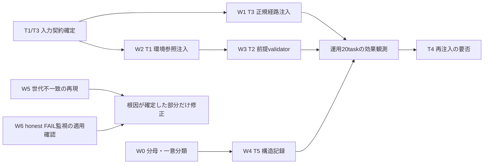

<!-- gist-master: 70b946c022cd5f6f81195ab837b7a7eb ninja_block_fail_root_cause_asis_tobe_20260905.md -->
# 忍者BLOCK/FAILの根因対策 — 家老配備設計 v3.8(2026-09-06 20:31 F-20 殿事後承認・経路=旧 gate 自動公開。v3.7=20:32 F-20 重大: DM main push が本番 deploy。v3.6=19:32 F-15 統合段 CLEAR・衝突 118 が残壁。v3.5=18:30 家老 R13: 別 task 証跡の転記誤り訂正・C3 後続 COMPLETE。v3.4=18:25 家老 R12 全採用: 一意 ID 表・時点付き経緯・failed=実体未達+形式不備・CI は run ID で別記。v3.3=18:10 F-13 golden CLEAR・F-15 疾風保全統合案・W6 4 例目・F-18 候補=報告契約の型不足。v3.2=12:15 F-15 root drain 追加: origin 収載済み hotfix が共有 root runtime に載らない構造、家老 18 path 監査 queue/notes/root_convergence_audit_20260906_1206.md) / v3.1

更新: 2026-09-05 23:21:40 JST(家老 v3.1)。将軍追記 2026-09-06 00:40: §5 台帳に W0/W1 CLEAR、F-6 APPROVE、K2 走行、W5 閉を反映。一次確認の観測時点は23:13:50 JST。殿「読み込み覚醒してアップデート。家老が忍者を配備しやすい形式にしてよい」に基づく設計更新。
正本は本書。既存gist IDを維持。旧v3.0の全数値・分類・レビュー履歴は `docs/research/ninja-block-fail-root-cause-v3-evidence-20260905.md` に保存した。過去の観測日時は変更しない。

## 進捗ビジュアル(将軍 loop 更新 2026-09-06 19:32。観測時刻を揃えた現在欄。1 行=一意案件 ID、履歴は同行の「経緯」欄に時点付きで残す)

**一意案件 14 件** `███████░░░ 11/15` ✅完了 🟡走行中 ⏳待ち 🔴要判断
状態集計: ✅ 11 / 🟡 3 / ⏳ 0 / 🔴 1(表の物理行 15=一意 ID 15、20:31 機械計数。F-20=🟡 承認済み・防止残。「続」行は廃止し経緯欄へ統合。家老 R12-1)
次の一手: **F-20(DM main push→本番 deploy の禁則違反)の経路特定と構造防止を最優先**。F-15(疾風 保全統合案。18:01 failed は finding 欄欠落**と**target 保全統合案未達の両方=家老 18:06 RC)→root drain 実行→root runtime へ F-14 反映。F-18 は観測案件として採番のみ(新根因・新契約と確定しない、W0/W1 との対応を先に置く)

| ID | 状態(18:25) | 現在値 | 経緯(時点付き) |
|---|---|---|---|
| W0/W1 契約・W1 core・W4・W5 | ✅ | 一意根拠表・routine_refs 注入・canonical 記録・バグ#6 CLEAR | 09-05〜06 午前 |
| W2/T1・W3/T2 | ✅ | W2 疾風 CLEAR、K3 へ再配備で解放 | await_clear 14:29→解放 15:41 |
| W6 解放遅延(monitor の honest FAIL 通知適用確認) | 🟡 観測継続 | 実測 4 例: P-4 約 193 分 / F-14 約 117 分 / 半蔵 未配備 約 122 分 / 小太郎 done 16:06→CLEAR 17:32=86 分。**ナッジ 17:27 の後 5 分で CLEAR を観測**(ナッジが短縮したという因果は未測定、家老 R12) | 殿 15:35 指摘→loop ナッジ 3 判定 15:50〜 |
| F-6〜F-12 | ✅ | gate 偽 BLOCK/recon-dual 契約/K2 偽 CLEAR/insight 自動消火/hotfix 契約回帰 2 件=根治、CI 層 B 0 | 09-06 午前 |
| F-13 CI RED(shogun deploy_task 系 8+FP flaky 1 / DM golden 1) | ✅ | shogun: deploy 8 解消、FP flaky は再発計数 2/日(才蔵 ci_fix は FAIL_CLOSE 11:30)。DM: golden 全帰属再生成(飛猿、rb6 5,535+決定性 26,175=31,710、dup 0、243,293 行 exact)→DM main 36420100→**run 34023047561 success(ca5dbbc5、09:01Z 取得)**。CLEAR と CI GREEN は別証跡(家老 R12-5) | DM RED 07:xx〜18:01 CLEAR |
| P-4 recon_dual 投影・fixed base | ✅ CLEAR 13:40 | 本体 3d2b6c4d9 収載。F-14 gate は origin c4b0989d3 収載済み。**root runtime 未反映は F-15 の軸**(source 公開/CLEAR と runtime 適用を分ける、家老 R12-2) | WAIT 13:18(external_wait)→CLEAR 13:40 |
| F-15 root drain(F-14 の runtime 未反映、共有 root mismatch) | 🟡 小太郎 統合段 CLEAR 19:24、残=同 ID 衝突 118 | mismatch 24(19:24 dry-run)。共有 root 適用 0。小太郎 cmd_karo_recon2_f15_integration_stage: 旧 target 3dffee714→新 HEAD 28f7eeb92 の移動を検出し 44 path を再検証、append-only 6 file の safe union merge(151 行追加)を隔離コピーで apply --check PASS・byte 一致・YAML 妥当。**同 ID 衝突 118 件(insights.yaml 115+LG052/LK-A13/P9-S-2)を具体 diff 付き BLOCK として分離**=残壁。次=教訓 snapshot 境界修正(家老配備 19:28)→衝突 118 の正本判定→root 適用。疾風の前段 18:01/18:16 failed=実体未達+報告 finding 欄欠落。18:20 家老確認: 疾風の 2 文書実統合 patch 5,173 byte は実在、残 path 未統合。K3 採否は runtime no/root no(18:20)=同じ壁 | 家老手動 18 path 12:01→才蔵 root_drain_recon 15:40(artifact 完成、preflight 字段名不一致で FAIL→FAIL_CLOSE 17:35)→疾風 17:34 |
| F-16 将軍 D0 の参照 bats 未走行 | ✅ | publisher_c2a_merge D0 が test_safe_shared_main_ff 契約を破り CI shard1 not ok 13→13:5x 修正、3 file 65 PASS | 13:28 発生 |
| F-17 cmd_save check_ac_file_paths 偽 WARN 累計昇格 | ✅ 将軍 D0 | PATHS lookbehind(日本語句読点直後の絶対パス)+planned_paths awk 即 exit の 2 バグ、547deff1b、参照 bats 15/16 PASS | 15:5x |
| F-18(観測案件) failed 2 件の報告契約不備 | 🔴 採番のみ・根因未確定 | 18:01 疾風=finding 欄(observation_target/result/evidence_path)欠落、18:04 影丸=commit_hash 非 40-hex+binary_checks result 空。**両者とも AC 実体未達が併存**(影丸: 全期間 price/calendar・API JSON 未達)。既存 W0 原因分類/W1 報告契約/report_field_set・テンプレ placeholder の有無を調べてから対応を決める(再実装しない、家老 R12-4) | 18:01/18:04 |
| C1/C2 insight 実害 | ✅ | CLEAR、pending 38→22 | 午前 |
| C3 publisher-deploy-ledger | ✅ 後続 COMPLETE | 旧 cmd は coverage 0.95 未達・未命名 span 欠落で FAIL_CLOSE。後続 cmd_karo_hotfix_c3_completion_span_20260906(source 1fb456f8、47 file 1,851 test)が CLEAR/COMPLETE(queue/gates/…/completion_tail.log、家老 R13-2) | 旧 FAIL_CLOSE→後続 COMPLETE |
| E-1 Codex 上限 | ✅ | 解除 09:14 | 停止 07:5x〜09:14 |
| 恒久契約『変更 script を参照する既存 bats 全列挙』 | ✅ 導入済み 17:32 | 小太郎 cmd_karo_hotfix_reference_test_contract CLEAR 17:32(最終 be8b2ce30、38 file 538 test 相当、timeout 1 file は単独 7 PASS で解消、公開 f0ae04578)。※『5 file 567』は才蔵 readonly_probe_contract(80+487)の別 task 証跡=転記誤り(家老 R13-1)。F-16 で将軍 D0 にも適用 | 未導入 13:5x→CLEAR 17:32 |
| F-20(重大) DM-Signal main への push が本番 deploy になった | 🟡 殿 事後承認 20:29、構造防止は継続 | 疾風 P08-I7 の code f3d20d3c(verification_service.py +184/test +74)が DM-Signal main へ push→Render backend autoDeploy(branch=main)が dep-daek0gks728c738385j0 を 19:28 JST に live 化=殿の明示 OK なしの本番 deploy。code は新規関数 check_i7_* のみで runtime 呼出 0(将軍 grep)=挙動不変だが禁則違反。golden 36420100 も 17:53 に自動 deploy されていた。家老 19:31 の『非 main 保全完了』は branch 92e85d7c を指し main 混入を見落とし。20:30 家老へ: 経路特定・main push 即停止・構造防止(main push は殿 OK marker 必須の pre-push/commit_contract)・revert は殿裁定まで禁止 | 経路(家老 20:28): 手動 push でなく家老 ACCEPT 起点の旧 gate auto_push_ancestry_retry→push_task_repositories の source-only cherry-pick。publisher_single flag 作成で旧経路停止。殿 20:29 事後承認(挙動不変)。残=F-20 構造防止 hotfix(DM main push は殿 OK marker 必須)。一次: git merge-base=yes、Render API、CI run 34027511358 |


CI(取得 18:19 JST): shogun run 34024048028(6ea0c115f)in_progress、直前 34023932054 cancelled(6d936fd47、連続 push による自動 cancel) / DM-Signal run 34023047561 success(ca5dbbc5)。

§0 の結論表は 09-05 版の AsIs(新契約未着手)を保存した履歴であり、現況は本節を正とする。

## §0 家老が最初に見る結論

| 判断 | 現在の結論 |
|---|---|
| 何を解決するか | 忍者へ届く前提・正規経路・判定基準の不足と、報告の世代不一致による手戻り。知り得た情報を使わない品質問題は別に扱う |
| 今回何を行ったか | 現物再集計、旧版の矛盾訂正、配備カード化。T1/T2/T3/T5の実装・忍者配備は行っていない |
| 本体の実装状態 | 下記4識別子はscripts/templates/tests/unitで一致0。新契約の実装は未着手。類似機能は既存であり「前提注入が一切ない」とは言わない |
| 次の配備 | W0で原因分類の根拠を整備。W1とW2は入力契約確定後に並行実装できる。W3はW2のschema確定後。W4はW0の分類契約確定後に並行 |
| 別に扱うもの | W5は調査完了・追加fix不要。W6=既存monitorのhonest FAIL通知適用確認。原因確認前のhotfix配備は禁止 |
| 授権 | 本ターンの指示は設計更新。実装配備の指示は未受領。DM-Signal本番書込は禁止のまま。22:25/22:27の研究基盤向け裁定を全infra変更の承認待ち根拠へ拡張しない |
| 設計の承認状態 | v2.1のレビュー承認は旧契約に対する履歴。v3.1の変更点をその承認で代替せず、実装cmdのレビュー対象にする |

対象は忍者6名のtask受領→作業→報告→レビュー→受理。CLI/modelは配備時の実態を使い、本書で固定編成を断定しない。
原則: 既存機構を拡張、新gate/hook 0、秘密値の複製0、本番変更0、途中は隔離試行、最終checkpointで契約検証。完了を急いで不明情報を埋めない。

## §1 現状の事実と訂正

### §1.1 再計測した値

観測T2=2026-09-05 23:13:50 JST。reviewはtimestampの2026-09-05行、gateは第1列の同日行。レビュー1件=ログの1エントリ、gate1件=TSVの1行。同じcmdの再試行も別件であり、cmd数・根因数とは足し合わせない。

| 指標 | T2実数 | v3.0との相違 |
|---|---:|---|
| 軍師review | 79 | LGTM53 / FAIL22 / APPROVE4、旧T1と一致 |
| gate state=WAIT | 96 | reason文字列にBLOCKを含むWAITもここ |
| gate state=CLEAR | 43 | all_gates_passedをBLOCKとして拾わない |
| gate state=BLOCK | 18 | 旧「BLOCK文字列70行−all_gates_passed42=28」はstate集計ではなかった |
| BLOCK: report_commit_main_ancestry | 8 | 維持 |
| BLOCK: no_task_parent_report | 3 | それだけで世代hash不一致の真因とは断定しない |
| BLOCK: parent_cmd_contract | 2 | 維持 |
| BLOCK: dm_signal_production_smoke_failed | 2 | 偽陽性かどうかは各発火の証跡で判断 |
| BLOCK: sg7_bundle_missing_or_invalid | 2 | 欠落・旧世代・不正形式を再現で分ける |
| BLOCK: kotaro:* | 1 | purpose_validation_fit_false |
| WAIT: ci_push_state:* | 10 | BLOCK18件への加算禁止。invalid/unresolvable6、remote境界欠落3、commit_contract不一致1 |

再現コマンド（読取のみ。実行時のsnapshot日時と併記する）:
```bash
python3 - <<'PY'
from pathlib import Path
from collections import Counter
import yaml
rows=yaml.safe_load(Path("logs/gunshi_review_log.yaml").read_text())
selected=[r for r in rows if isinstance(r,dict) and str(r.get("timestamp","")).startswith("2026-09-05")]
print("review",len(selected),Counter(r.get("verdict") for r in selected))
states=Counter(); reasons=Counter(); ci=Counter()
for line in Path("logs/gate_metrics.log").read_text().splitlines():
    f=line.split("\t")
    if len(f)<4 or not f[0].startswith("2026-09-05"): continue
    states[f[2]]+=1
    if f[2]=="BLOCK": reasons[f[3].split(":")[0]]+=1
    if f[3].startswith("ci_push_state:"): ci[f[3]]+=1
print("gate_states",states); print("BLOCK_reason",reasons); print("ci_push_state",ci)
PY
rg -n 'environment_refs|routine_refs|preconditions_validate|failure_origin_code|failure_origin:' scripts templates tests/unit
```
生出力: `review 79 Counter({'LGTM': 53, 'FAIL': 22, 'APPROVE': 4})` / `gate_states Counter({'WAIT': 96, 'CLEAR': 43, 'BLOCK': 18})`。rg一致0はexit1であり検索失敗ではない。

### §1.2 未確定値を確定と呼ばない

| 旧結論 | 現在の扱い | 解消する配備 |
|---|---|---|
| 「20/22は忍者側で防げない、E=2」 | 仮説。旧primary表のFAIL小計はA3+B9+C3+D6+E2=23で、22件と不一致。event別一意分類がないため比率を確定扱いしない | W0 |
| 「FAIL1回で時間が2倍、+45分」 | T0のp50=94分/49分、n=4/17という関連。難易度・規模等の交絡未補正、因果効果ではない | W0の根拠表。改善評価は同じ定義・窓で比較 |
| 「今日直した5件は全てC/D」 | 旧F-5は分類「—」の家老計測更新で矛盾。F-1〜F-4を個別修復履歴、F-5を関連計測として分離 | §5 |
| 「入力はtask YAMLだけ、誰も前提を書かない」 | taskは入口。既にcontext_files/credential_files/reports_to_read等を注入している。不足は名前の追加ではなく、必要な実体・鮮度・正規経路がtaskまで届く契約 | W1/W2 |
| 「合流待ち66%」「healthはCPU118分」 | 旧時点の解釈。家老throughput v2.5で親子重複・JST・待ち末尾を訂正済み。現順位へ転用しない | 別書§6.8 |
| mtime本日=本日報告数88 | 旧T1の観測。mtimeは再編集で変わるので発生件数ではない。report identity/世代/発生日時の分母を定義してから再集計 | W0 |
| P-3「進行中」なのに本文「未着手」 | 未着手へ訂正。既存監視経路があるため新設を前提にしない | W6 |

旧T0報告74本/T1報告88本、hook failures、FAILループの6実例、前提不足8例、既存レビューの全内容は保存版§2〜§7を参照。観測窓が異なる数値は同表の現在値へ混ぜない。

## §2 使う既存経路と所有境界

| 境界 | 現物で確認した正本 | 実装時の注意 |
|---|---|---|
| cmd→task assumptions | `scripts/deploy_task/task_contract.sh::inject_cmd_assumptions`、`scripts/deploy_task/resolve.sh::resolve_cmd_to_task` | giant deploy_task.shだけを直さず、source後に有効な定義とcallerを確認 |
| direct --yamlと再利用task | `scripts/deploy_task/resolve.sh`、`scripts/deploy_task/gates.sh` | 通常/direct/preinjected/再配備の入口を揃え、旧taskのrefsを残さない |
| 既存文脈の複製 | `scripts/lib/inject_task_modifiers.py`、`scripts/deploy_task/modifiers.sh` | context_files/credential_files/reports_to_readと重複させず参照を流用 |
| report template | `scripts/deploy_task/report.sh::generate_report_template` | schema変更時はtemplate generation cacheの入力fingerprintにも反映 |
| 報告の書込・通知 | `scripts/report_field_set.sh` | terminal atomic write→precheck→inbox/lifecycle既存経路。hash手書き禁止 |
| review canonical保存 | `scripts/review_bundle.py::batch/single`→`scripts/gunshi_log_append.sh` | review_entryを正規appendへ渡す。共有YAML全体を書き換えない |
| 日次計測 | `scripts/karo_throughput_report.sh` | v2.5のarchive重複排除/JST/親子分離を維持。別の集計台帳を増やさない |
| failed/通知監視 | `scripts/ninja_monitor.sh`のfailed保全・completion_notify_gap・review-pending・terminal outbox repair | 時間でACCEPTを代行する経路は撤去済み。通知の補修と承認代行を混同しない |

`projects/infra.yaml`は家老管理。忍者には変更案/差分を成果物にさせ、家老が反映する。registryの秘密は値を配らず既存の権限付き参照先へ接続する。CLIの実行手段は各CLI固有、共有するのはIDと成果契約のみ。

## §3 配備順と分割



- W番号は設計内work package。cmd_id/task_idは未採番。家老が実際のscope・idle・round-robinを確認して採番する。特定忍者を恒久指定しない。
- W1/W2/W4は設計・fixture準備を並行可。ただしresolve/gates/report/日次表など同じfileを触る公開は直列化し、後続は先行SHAへrebaseして確認する。
- 1cmdへenhanceと既存bugfixを混在させない。W1〜W4は新しい契約の追加、W5/W6は既存欠陥の調査→根因別fix。
- 各Wは成果境界で分ける。ACが3以上なら人数規則と自然境界を満たす子taskへ分割する。同じfileを無理に並行編集させない。
- 前Wの運用20taskを待って次Wを止めない。schema/contractが確定した時点で依存を解除し、運用観測は後段で並行する。

## §4 忍者へ渡す配備カード

共通入力: 本書の担当W、対象repo/worktree絶対path、base SHA、変更許可scope、既存関連tests、期待する成果と判定者。家老は配備前に実体を埋める。
共通成果: 実装差分または再現証拠、binary_checks、未解決事項、lesson_candidateのorigin。未実装・未観測をPASSへ丸めない。

### W0 — 22 FAILの一意根拠表（調査、最初の一手）
- 目的: A〜Eの数字を足して実数と一致する状態にする。原因を文言だけで推測しない。
- 入力: review79行中FAIL22行、対応する当時のreport世代/task/WA/修正commit。保存版§2.3/§2.4は検索の入口。
- 成果: 各eventのidentity、timestamp、cmd、report fingerprint、原文span、taskに事前にあった情報、primary/secondary、証拠path、確度。証拠欠落はunclassified、Eへ自動分類しない。
- 分類: D→B→A→C→Eは原因が裏付けられた候補間の優先順。正当なWAITや正当な拒否はD(偽陽性)へ入れず、その状態と改善対象を別列にする。
- AC: (1)一意event22/22を掲載しprimary+unclassified=22。(2)E候補2件とDへ移した保留語2件の原文spanを個別照合。(3)二重分類/欠落0、反復event数と根因数を別々に集計。
- 非scope: 実装修正、過去reviewのverdictやtimestampの変更、FAIL件数を減らすための分類変更。

### W1 — T3 正規経路IDをtaskへ届ける（追加）
- 目的: hookに止められて初めて正規経路を知る手戻りをなくす。
- 変更候補: deploy_taskの既存注入module/resolve・gates、既存skills/operationsの参照registry。registry本文をtaskごとに全文複製しない。
- 入力契約: routine ID `tests_run/db_readonly/report_status/inbox/commit`と適用task_type/CLI。選択は明示refs+task_type×CLIの表。DB操作を含まないtaskへdb_readonlyを強制しない。
- 出力契約: task.routine_refsへ重複のないIDと正本path/該当節を届ける。存在しないID/参照先は忍者へ通知する前に発注側へ返す。適用外は空集合と理由で表現。
- AC: (1)全対応task_type×CLI組合せで必要IDだけ解決。(2)通常/direct/preinjected/再配備の同一入力で同じ結果。(3)未定義ID・参照先不在・前task残留を検出し、秘密値/他CLIの実行方式混入0。
- 既存test起点: `tests/unit/test_deploy_task_yaml_injection.bats`、`tests/unit/test_deploy_task_lifecycle.bats`。全体復帰文の肥大化はしない。

### W2 — T1 環境参照IDをtaskへ届ける（追加）
- 目的: 隔離DB・clone・artifact・recipeの実体と鮮度を、必要なtaskへ配備前に供給する。
- 変更候補: `scripts/deploy_task/task_contract.sh`、resolve/gates、家老管理の`projects/infra.yaml`。W1と共通入口を同時編集しない。
- 入力契約: cmd.environment_refs=明示ID列。cardにはcanonical_path/probe_id/verified_at/ttl_seconds/source_shaを持たせ、localpg等は採用候補ID。実在を確認して登録し架空のpathは埋めない。
- probe契約: 追跡済みallowlist IDと引数schemaのみ。cardの文字列をshell評価しない。注入自体は既存検証receiptを読むだけ。再probeは事前に承認された読取・隔離対象に限り、timeout/rc/検証時刻を記録。
- 出力契約: task.environmentへ必要cardだけ複製。ID不在/期限切れ/未来時刻/source不一致は通知前に発注側へ返す。無関係taskや旧形式taskは適用条件がなければ従来どおり。
- AC: (1)有効/期限境界/期限切れ/未知ID/不正引数/秘密値を検証。(2)全入口で一致し旧refs残留0。(3)registry原文とcardの出所SHA・時刻を追跡でき、read-only注入中のprobe実行0。
- 既存test起点: assumptions/時間契約とyaml injectionの既存fixture。registryは家老反映、忍者は提案差分まで。

### W3 — T2 前提条件を両入口で検証（追加、W2 schema確定後）
- 目的: 不可能なACや曖昧な語を忍者が受領する前に発注側へ返す。
- 変更候補: `scripts/cmd_save.sh`、deployの通常/direct入口、共有validator候補`scripts/lib/cmd_preconditions_validate.sh`(現時点で未実在)。
- schema: preconditions.baseline={command,source_sha,executed_at,pass,fail,skip}、definitions={AC内の語:判定式}。必要ACとの対応を明示し、「lint不要」等を単純語彙一致でBLOCKしない。
- 判定: baselineはshell実行しない。対象SHAと鮮度/型/必要keyを確認。実装完了の基準はfail0/skip0。赤baseline調査taskでは赤を入力事実として許容し、完了証跡と混同しない。必要なTTLはregistry/task契約から取得し隠れた定数にしない。
- AC: (1)両入口で同じfixture結果。(2)否定文/適用外/古いSHA/未来時刻/期限切れ/欠落を区別。(3)検証中のcommand実行0、新gate/hook0、同一fixture群でvalidator単独の計測を行い旧目標1秒未満の充足を報告。
- 互換: 新契約を適用するtaskから導入。無関係の既存cmdを一括で止めない。正当な不充足をwarning化して通さない。

### W4 — T5 failure originを発生時に構造保存（追加、W0分類契約確定後）
- 目的: 毎日同じ22件を手で再分類せず、候補とcanonicalの不一致を追えるようにする。
- 変更候補: `scripts/deploy_task/report.sh`のtemplate経路、`scripts/review_bundle.py`、`scripts/gunshi_log_append.sh`の既存検証、日次表。
- 契約: report.failure_origin={primary,secondary}は候補。review.failure_origin_code={primary,secondary,ninja_candidate_agreed,correction}は軍師canonical。候補を無検証でcanonicalへ写さない。
- identity: report identity+fingerprint+review event identityで束縛。1回の再送は重複計上0、新しい実質reviewは別event。過去行のtimestampや分類を遡及上書きしない。旧行・調査中はunclassifiedとして別計上。
- AC: (1)候補保持/軍師訂正/旧field無しを読める。(2)同世代再送・新世代訂正・archive後も誤結合0。(3)日次表のcanonical+unclassified=全FAIL、template cache更新前後でfield欠落0。
- 既存test起点: review_bundle/report template/報告世代の既存tests。新規testは具体的不変量をtest_necessityに宣言する。

### W5 — バグ#6とci_push_stateの根因を確定（調査→原因別fix）
- **調査結果(2026-09-05 23:58)**: 世代不一致はcommit `7671bdb99`で既修復。隔離成功rc=0、tamper後の再書込rc=1、関連contract 183件+138件ではなく、重複を除く各suite 3/3・138/138・1/1・41/41がPASS/SKIP0。追加コードfixは行わない。
- ci_push_state WAIT 10行はinvalid/unresolvable 6、remote境界3、contract不一致1で一致。9行は後続CLEAR。残る行925は20:26:59 WAITの3秒後に`purpose_validation_fit_false`で正式BLOCK、20:27:04に`archive.done`。honest FAILの終端であり、CLEAR欠落やpublication未修復とは分類しない。従って10/10が後続終端へ接続済み。
- 入力: P-1旧報告、terminal reportの書込前後、deploy_generationとlifecycle receipt、SG7 bundleとapprovalのfingerprint。現行report_field_setは既にterminal precheck→inbox経路を持つ。
- 変更候補(原因確定後のみ): report_field_set/inbox/lifecycle/reviewの実際に破れている境界。deploy_generationを手で書き換える案は採らない。
- AC: (1)同じreport世代の最小隔離再現が成功/失敗とも保存される。(2)origin側の該当差分と修正前後の同一再現結果が対応する。(3)ci_push_state10行をinvalid6/remote3/contract1の各cmdへ結び、既修復と未修復を判別。
- 「翌日のBLOCK0」は完了ACにしない。対象処理0回でも0になるため、再現/正規経路通過を実装完了、再発率を運用効果に分ける。

### W6 — honest FAILの受理停滞を既存monitorで扱う（調査→必要ならfix）
- 入力: kotaro旧2h24m滞留、approved_honest_fail、failed保全/terminal outbox/review-pending/completion_notify_gapの現行callerとfixture。
- AC: (1)正式review前/後・同世代/旧世代・archive有無・既存通知有無を区別。(2)未受理の該当世代だけ家老へ起床通知し、情報typeへの逃避/重複通知0。(3)時間経過による自動ACCEPT0、正常な再配備/失敗closeは既存経路で通る。
- 新監視loopは作らない。既存経路で条件が満たされれば「変更不要・適用確認済み」として閉じる。

## §5 進捗台帳（状態と証拠を同じ行に）

状態: 未着手 / 調査中 / 実装中 / 検証済み / 公開確認済み / 運用観測中 / 保留。主張だけで次状態へ進めない。
公開確認には対象commitのorigin ancestryと検証receipt、運用完了には分母付き観測が必要。コード存在だけでCLEARとは言わない。

| ID | 対象 | 現在状態 | 証拠/次の遷移条件 |
|---|---|---|---|
| F-1 | report revision_requested→completed | 旧版で公開・検証報告あり | 499eb2099。今回は履歴参照、運用再検証はしていない |
| F-2 | review_bundle allow_archived | 旧版で公開・検証報告あり | 同commit。今回git logでも存在確認 |
| F-3 | honest FAIL approval | 実装存在確認、旧版に運用適用記録 | f69288720/d6842c066、review_approvalのapproved_honest_fail実装。新規未着手扱いに戻さない |
| F-4 | fixture陳腐化 | 旧版で公開・CI検証報告あり | 208df246d、旧run33963211348。現在CI結果とは呼ばない |
| F-5 | 家老計測 | v2.5修正・検証・gist同期済み | 1a9f9f3a9、contract8/8、別書§6.8。C/D根因修復の件数には入れない |
| F-6 | CI gate 偽 BLOCK『reviewed_at datetime parse failed』(二段レビュー未完で reviewed_at 空文字が評価器へ) | 公開確認済み(278e93d06 origin)・**家老 APPROVE blt_001113** | 将軍 D0: 評価器で空 reviewed_at=WAIT review_boundary_pending、contract test +1(31/31)。分類 D。家老レビュー中(msg_001003) |
| F-7 | recon-dual 独立性契約が受け手スキル(skills/recon-dual)の散文キーワード照合にしか無く、起票側が知らずに配備停止→追記→再配備の往復(00:41 cmd_4480) | 公開確認済み(将軍 D0、家老レビュー依頼中) | 分類 C(正規経路の案内なし)。根治: `recon_dual:` 構造フィールド+`scripts/lib/recon_dual_contract.py` を cmd_save Check 19.7 で fail-closed(散文のみ WARN/無し BLOCK)、cmd_skeleton テンプレ、SKILL Step1 はフィールド正本、bats 6/6。semantic alias 追加。[[cmd_4480_recon_dual往復]] -> [[契約が受け手スキルにのみ存在]] -> [[recon_dual構造フィールド]] |
| P-4 | 家老 blt_011411: cmd_4480 A1 通常配備で command field が task へ非投影→[INDEPENDENT_RECON] 自動注入なし(setter で手当)、A2 direct は自動 worktree base 8af986 が DM-Signal 正本 e7d187 と不一致(stale repo-cache)→専用 worktree へ切替 | 小太郎 report 94/94→**GATE BLOCK FAIL_VERDICT**(未達 AC=no-code-change 自動投影)→影丸 hotfix cmd_karo_hotfix_p4_nocode_commit_projection(2e520719: report.sh typed no-code identity 即時投影、bats +54)**CLEAR 06:44**(kotaro P-4 done) | 分類 D/C。deploy_task 側の 2 欠陥+recon_dual task 投影/consumer field 直読/fixed base≠worktree HEAD の配備前 BLOCK。家老 lane |
| F-8 | ninja_monitor gate-stall 再駆動の item timeout 180s が receipt テスト付き gate(cmd_4480 CLEAR duration_sec=515、cmd_4481 86)より短く、01:58〜02:32 に ITEM-TIMEOUT ×7(rc=124)を反復。家老手動 gate は完走したため実害は再実行コストのみ | 観測のみ(03:45)。現 log に再発 0 | 分類 D(偽陽性 timeout)。fix 候補: item_timeout_sec を receipt test 有無で可変、または手動 gate 走行中(gate.lock)は skip。1 データ点ゆえ再発時に D0 |
| F-9 | cmd_complete_gate auto_resolve_cmd_related_insights が report/task 本文の INS-id 全文スキャンを『declared remediation』とみなし、readonly triage(才蔵)の CLEAR 04:08 で pending 113 件を全件 resolved(うち未解決実害 37 件)=自動消火 | 家老 CAS 37 件を再 pending(履歴保持 37/37、all_pending 38)04:20。gate hotfix=才蔵 cmd_karo_hotfix_insight_explicit_remediation_20260906 **CLEAR 05:05**(e5d2e9e6、明示 remediated_insight_ids 限定・recon/readonly 除外。ただし F-11 の CI RED を誘発) | 分類 D(偽陽性)。将軍検出 04:11(cmd_complete_gate.sh:8340-8430)。[[insight_triage_CLEAR]] -> [[本文INS-id全文スキャン]] -> [[明示フィールド限定]] |
| F-10 | K2 report identity mismatch: 疾風 K2 report の result/causal_verification が前 task(ci_fix cache A/B 40 run)の本文で、purpose_validation.fit=true の自己申告を gate が素通し→04:25 偽 CLEAR(caller 成果 0) | 将軍検出 04:28、家老が旧 report を archive 保持し truthful_redo を配備→**CLEAR 05:06**(caller 8/16 組合せ生表/secret 0)。gate 側の機械照合(fit 自己申告→本文と AC の語彙照合)は才蔵 lane へ追加下知 | 分類 C/D。才蔵 triage の C1/C2 実例。[[K2偽CLEAR]] -> [[fit自己申告素通し]] -> [[report本文とAC機械照合]] |
| F-11 | 才蔵 insight explicit remediation hotfix(e5d2e9e6)が既存契約 test(test_cmd_complete_insight_consumption.bats L65/L87: declared origin resolve/missing id fail-closed)を更新せず CI RED(run 33989012045 shard 6) | 検出 05:30→ci_fix fc8bf0b2(契約 test 3 行を remediated_insight_ids 単一路へ)**CLEAR 05:45、CI GREEN 389eee7 06:0x** | 分類 B(前提=既存契約 test の未参照)。hotfix の task に『関連 contract test 全列挙』が無い |
| C1/C2/C3 | 才蔵 triage の未解決実害 37 件(C1 配達 exactly-once 11 件/C2 gate-report-skill 契約整合/C3 publisher-deploy-ledger) | C1=疾風 hotfix a27ea00d0 **CLEAR 06:47**。C2=才蔵 hotfix 1aa87a20(purpose-detail 契約 単一 SSOT)**CLEAR 07:07** ただし F-12 の CI RED。C3=影丸 in_progress 07:06。insight pending 38→21(明示 resolve 経由) | 分類 A/C。insight pending 38 は C1-C3 の CLEAR で remediated_insight_ids 経由の明示 resolve へ |
| F-12 | 才蔵 insight C2 hotfix(1aa87a20、report_field_set.sh +71)が report_field_set の verdict→status 自動完了と review_approval の RC 契約 test 9 件を壊し CI RED(run 33995101543 shard 1/6/7/compat)。GATE は 07:07 CLEAR 済み=F-11 と同型 | 検出 07:20、家老へ ci_fix 下知+hotfix 契約に『変更 script を参照する既存 bats 全列挙』必須化を提案 | 分類 B(前提=既存契約 test の未参照)。2 連発ゆえ task 契約側の根治対象 |
| E-1 | Codex 利用上限到達 07:5x(家老 gpt-5.6-sol + 忍者 4 名 gpt-5.6-luna、『try again at Sep 9th 12:41』)→Codex 側便停止、家老 inbox7 未処理 | 殿判断待ち(A Claude 切替/B Codex アカウント切替/C 待機)。将軍は CLI 切替を独断しない(殿裁定 2026-03-09) | 分類 E(外部)。ntfy 08:00 送信 |
| F-13 | deploy_task 変更(P-4 本体 3d2b6c4d9 / K2 speed e17f8077d)後に test_deploy_task_yaml_injection 系 3 件が CI RED(run 34001119559: source assumptions 注入 2 件+LK-A22 depends_on 表示) | 検出 09:35、家老へ ci_fix 下知 | 分類 B。F-11/F-12 と同型の 3 連発=hotfix 契約『変更 script を参照する既存 bats 全列挙』の未導入が真因 |
| E-1 解除 | Codex 上限 09:14 解除(殿 09:14)。家老 inbox 7 件を将軍の再開順序 1 通で消化開始、便再開 09:17 | 完了 | 停止 07:5x〜09:14 の約 80 分 |
| F-14 | cmd_complete_gate の report_commit_main_ancestry が sha 祖先のみを見て content-equivalent(publisher の squash/再構成で sha・patch-id が変わるが tree は一致)を認めず、P-4/K2/C1 が WAIT を反復(P-4 は 10:00 以降 5 回) | 検出 10:22(家老訂正 blt_102217)。疾風 hotfix: 参照 bats 36 file 1392 PASS、軍師 LGTM、家老 ACCEPT、origin c4b0989d3 収載(11:4x)。**残壁=共有 root への同期**(root_sync_skipped not_descendant、root gate 旧版)→F-15 として root drain へ帰属 | 分類 D(偽 WAIT)。将軍の誤前提『git cherry + = 未収載』も同時に訂正。教訓=hotfix が origin に載っても runtime(root)に載るまで効かない |
| F-15 | 共有 root が origin へ収束できず(171 behind/23 ahead、safe_shared_main_ff mismatch 18=root 側 HEAD の台帳/doc effect が origin blob と不一致)、origin 収載済み hotfix(F-14)が root runtime に載らない。P-4 WAIT 継続、deploy 8 件 CI 再判定も待ち | 12:00 将軍一次確認(root gate に content_equivalent 0 件)。家老へ順序付き 1 通 12:01 | 分類 C(合流待ち)。才蔵 FP vocabulary は診断 run 34005978406 で PASS=flaky 確定、正式 FAIL_CLOSE(11:30) |
| F-15 続 | 才蔵 root_drain_recon(15:40)は artifact 完成も preflight 字段名不一致で FAIL→17:35 FAIL_CLOSE。疾風 cmd_karo_recon2_root_drain_plan(17:34)が保全統合案を継続、18:01 failed=実体未達(dirty 複製のみ、target 保全統合案なし、家老 18:06 RC)+報告 finding 欄欠落→18:07 再走行→18:16 再 failed。mismatch 23。共有 root 適用 0 | 🟡 | task yaml hayate.yaml、blt_173515 |
| F-13 golden | DM-Signal CI RED(cmd_3854 golden regression)を飛猿が全帰属再生成で解消: rb6 5,535+決定性 26,175=31,710、dup 0、243,293 行 exact。DM main 36420100、CI success ca5dbbc5。context/dm-signal-core.md GA-590 | ✅ 18:01 | blt_180258、gh run |
| F-18(観測案件) | 本日の failed 2 件(疾風 finding 欄欠落、影丸 commit_hash 非 40-hex+binary_checks result 空)は**報告 YAML の形式不備と AC 実体未達が併存**(家老 R12-3)。形式不備だけを直しても実体未達は残る。新根因・新契約とは確定せず、既存 W0 原因分類/W1 報告契約/report_field_set/テンプレ placeholder の有無と再現証拠を先に置く | 🔴 採番のみ | task yaml kagemaru.yaml last_block_reason、hayate.yaml block_reason |
| P-1→W5 | バグ#6 | 調査完了・既修復 | `7671bdb99`、隔離success/tamper fail-close、追加fix不要 |
| P-2→W5 | ci_push_state | 調査完了・10/10終端接続 | WAIT10=6+3+1。9行CLEAR、1行はpurpose不一致の正式BLOCK+archive。修復対象0 |
| P-3→W6 | honest FAIL停滞 | 未着手、既存監視あり(cmd_4479 は軍師再 review→approved_honest_fail が 15 分で回った=停滞なし 00:3x) | 既存caller/条件/fixtureを確認して変更要否を決める |
| W0 | 一意根拠表 | **GATE CLEAR 00:12**(小太郎) | queue/reports/kotaro_report_cmd_karo_recon_w0_failure_events_20260905.yaml |
| W1/T3 | routine_refs 契約確定 | **GATE CLEAR 00:19**(飛猿)。W1 実装(注入)は契約確定を受けて起票可 | queue/reports/tobisaru_report_cmd_karo_recon_w1_routine_contract_20260905.yaml。W2/T1 は W1 契約確定後 |
| W1 core | routine_refs 注入 実装 | **done 報告済み**(飛猿 cmd_karo_impl_w1_routine_refs_core_20260906、家老 blt_030157『W1 ancestry 解消し CLEAR』) | 次=W2/T1 |
| W2/T1 | environment_refs 注入 | 未着手(W1 core CLEAR で前提解放) | W1 実装と共通入口 |
| W3/T2 | validator | 未着手 | W2 schema確定 |
| W4/T5 | canonical構造記録 | 未着手(W0 CLEAR で前提解放) | W0 の一意根拠表を分類契約として採用後に着手可 |
| T4 | review_feedback再注入 | 保留 | 現行inject_task_modifiers経路と反復FAILの残存を観測後に判断 |
| T6 | 個別偽陽性修復 | 継続方針 | 本書W5/W6または別throughput書へ紐付け、空の進行中taskを作らない |

旧N-1→W1/W2、N-2→W3、N-3→W4、N-4→W5、N-5→T4。旧IDを消して未処理案件を迷子にしない。
今回のorigin/main参照はローカル追跡ref2967af3135bcd3765fc9bfe537ca665ed39a456e(記録commit日時23:04:35 JST)。fetch未実施のため最新remoteと断定しない。

## §6 完了と運用効果の判定

| 境界 | 二値の条件 | 分母が足りない時 |
|---|---|---|
| 実装完了 | 担当WのAC全yes、関連契約検証PASS/SKIP0、変更scope外混入0、既存入口の互換維持 | FAILなら原因を直して同条件で再検証 |
| 公開確認 | 対象SHAがoriginに含まれ、公開された内容と検証対象が一致 | 未確認と明記 |
| T1/T3効果 | 導入後の適用対象20taskで全refs解決、missing-premise起因RC0、軍師の対象5件監査で未検出不足0 | 取得済みn/20と記す。20件を待つため実装完了を止めない |
| T2効果 | 前提が必要なACのkey充足数/該当AC数=100%、否定/適用外の誤BLOCK0 | 対象0ならN/A、PASSにしない |
| T5効果 | 導入後の20 FAIL eventにcanonical分類、分類済み+unclassified=全FAIL | FAIL発生を待って作業を止めず運用観測中 |
| T4採否 | 同一根因による2回目以降のFAIL数/全再review数を測り、再注入で防げる情報欠落か確認 | 未観測のまま実装しない |

時間比較は同じJST窓・同じevent定義で行う。日次表の全event加算値や末尾待機推定をCPU/拘束時間へ読み替えない。
巻戻しは該当Wの変更を単独revertできる単位で保つ。legacy readerを先に対応し、writer→適用対象への導入の順に進める。途中の全taskへの必須化はしない。

## §7 実装cmdのレビュー基準

既存レビューで確認したE根拠/A-B一意化/probe allowlist/T5 canonicalを引き継ぎ、件数・授権範囲・正本module・依存順・適用条件・観測分母の充足を判定する。
実装cmdレビューでは、(1)W0の未分類扱い (2)W1/W2の全入口とregistry所有者 (3)W3の語彙偽陽性/赤baseline (4)W4の世代/再送 (5)W5/W6の既存機構再利用を確認する。
旧「設計閉」を未実装/未確定事項の隠蔽に使わない。追加のgoを本書が自動で発行することもない。

## §8 因果リンク

- 根拠履歴 → `docs/research/ninja-block-fail-root-cause-v3-evidence-20260905.md`
- 計測契約 → `docs/research/karo_throughput_asis_20260905.md` §6.8
- 既存運用 → `context/karo-operations.md` §0.1/§1、`context/growth-loop.md` §11
- origin: [[殿下問_忍者BLOCK_FAILはインフラバグか_20260905_1603]] -> [[分類分母と実行stateの混同]] -> [[一意根拠表と配備境界W0-W6]]
- [[Level5_事前コンテキスト提供]] -> [[environment_refs_injection]] / [[routine_refs_injection]] / [[preconditions_validator]] / [[failure_origin_code]]
