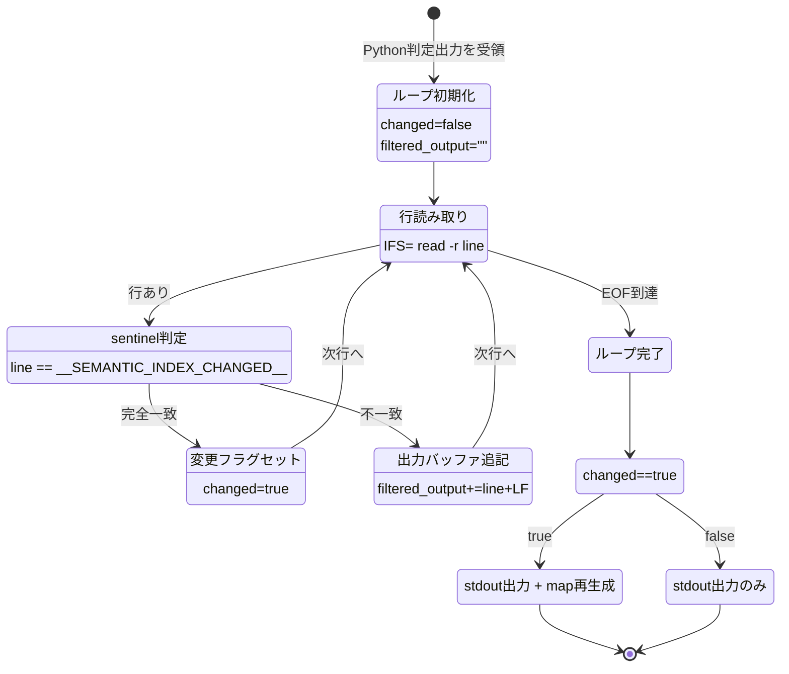
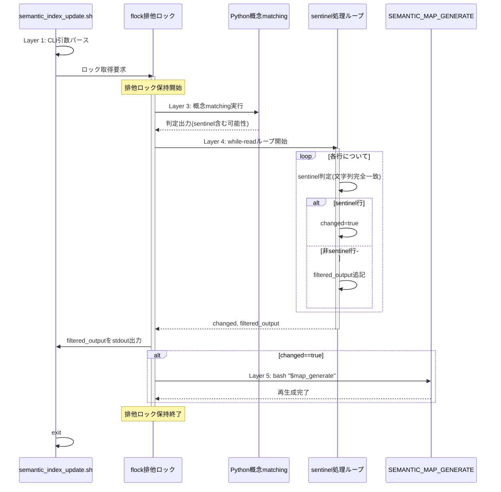
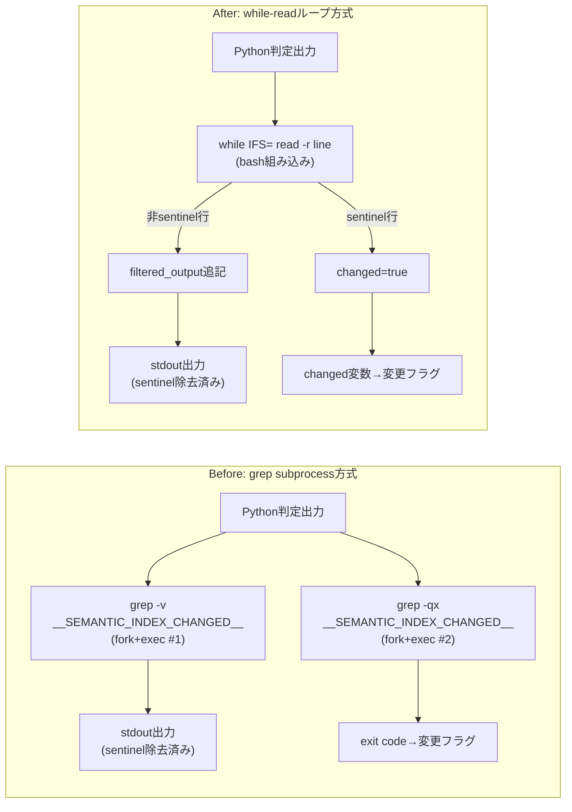

---
codd:
  node_id: detailed_design:sentinel-processing-flow
  type: design
  depends_on:
  - id: design:system-design
    relation: depends_on
    semantic: technical
  depended_by:
  - id: plan:implementation-plan
    relation: depends_on
    semantic: technical
  - id: test:test-strategy
    relation: depends_on
    semantic: technical
  conventions:
  - targets:
    - script:semantic_index_update
    reason: __SEMANTIC_INDEX_CHANGED__ sentinel の除去・検出を grep-v/grep-qx から while-read
      へ置換する際、出力内容・終了ステータスの等価性はリリース必須条件。
  - targets:
    - script:semantic_index_update
    reason: flock排他範囲内での sentinel 処理順序維持はリリース必須条件。
  modules:
  - semantic_index_update
---

# Sentinel 処理フロー詳細設計

## 1. Overview

本設計書は `scripts/semantic_index_update.sh` における sentinel 文字列 `__SEMANTIC_INDEX_CHANGED__` の除去・検出処理を、`grep -v` / `grep -qx` の2回の subprocess 起動から bash 組み込みの `while IFS= read -r line` ループへ置換する詳細設計を定義する。この変更は R1 リファクタリングの中核であり、Layer 4（sentinel 処理レイヤー）のみに限定される。

### 対象スコープ

Python 概念 matching ロジックが出力するテキストストリームには、変更検出を示す sentinel 行 `__SEMANTIC_INDEX_CHANGED__` が含まれる場合がある。sentinel 処理レイヤーの責務は以下の2つである。

1. **sentinel 除去**: sentinel 行を最終 stdout 出力から除外する
2. **sentinel 検出**: sentinel 行の有無を判定し、変更あり/なしのフロー分岐を駆動する

現行実装は `grep -v '__SEMANTIC_INDEX_CHANGED__'`（除去）と `grep -qx '__SEMANTIC_INDEX_CHANGED__'`（検出）の2つの subprocess で実現しているが、sentinel 文字列は固定値であり正規表現エンジンは不要であるため、bash の文字列完全一致比較（`[[ "$line" == "__SEMANTIC_INDEX_CHANGED__" ]]`）で十分に処理できる。subprocess 起動数は2回から0回に削減される。

### リリースブロッキング制約への準拠

本詳細設計書は以下のリリース必須条件を明示的に反映する。

| 制約 | 準拠内容 | 本設計書での反映箇所 |
|------|---------|---------------------|
| `__SEMANTIC_INDEX_CHANGED__` sentinel の除去・検出を `grep -v`/`grep -qx` から `while-read` へ置換する際の出力内容・終了ステータスの等価性 | sentinel 除去後の stdout 出力は1バイト単位で同一、exit code は全実行パスで同一値を保証する | §2 フロー図の各ノード出力定義、§4 等価性検証マトリクス |
| `flock` 排他範囲内での sentinel 処理順序維持 | sentinel 処理ループ全体が `flock` 排他ロック保持中に実行され、ロック外への処理漏出がないことを保証する | §2 シーケンス図の `flock` 境界、§3 排他制御オーナーシップ |

### パフォーマンス閾値

| 計測対象 | 閾値 | 計測方法 |
|---------|------|---------|
| `bats tests/unit/test_semantic_index_update.bats` 5回実測中央値 | ≤ 0.98s | `bats` × 5回の中央値 |
| `bash scripts/semantic_index_update.sh --help` 5回実測中央値 | ≤ 0.01s | 直接実行 × 5回の中央値 |
| sentinel 処理中の subprocess 起動数 | 0回 | `strace -f -e trace=execve` で `grep` 不在を確認 |

## 2. Mermaid Diagrams

### 2.1 sentinel 処理フロー状態遷移図

以下の状態遷移図は、`while IFS= read -r line` ループにおける sentinel 処理の全状態遷移を示す。各状態はループの進行に伴い遷移し、ループ終了後に `changed` フラグの値でフロー分岐が確定する。

**オーナーシップ:** この状態遷移全体は Layer 4（sentinel 処理レイヤー）が単独で所有する。`LoopInit` での変数初期化から `LoopEnd` での分岐判定まで、すべてのコードパスは `scripts/semantic_index_update.sh` 内の sentinel 処理ブロックに閉じる。Layer 3（Python 判定レイヤー）からの入力は `<<<` ヒアストリング経由で受け取り、Layer 5（map 再生成レイヤー）への分岐は `changed` フラグの値のみで接続される。状態遷移内で `grep` や他の外部コマンドを呼び出すことは禁止であり、subprocess 起動数0回の保証はこの閉じた状態遷移によって担保される。

**実装上の留意点:** `ReadLine` から `LoopEnd` への遷移（EOF到達）は `while IFS= read -r line || [[ -n "$line" ]]` パターンで実装し、末尾改行なしの入力にも対応する。これにより Python 判定出力が POSIX 非準拠テキスト（末尾改行なし）であっても最終行が読み飛ばされない。

### 2.2 flock 排他範囲と sentinel 処理の関係シーケンス図

以下のシーケンス図は、`flock` 排他ロック保持中に sentinel 処理が実行される順序を示す。sentinel 処理がロック境界内に完全に包含されることをリリース必須条件として保証する。

**オーナーシップ:** `flock` 排他ロックの取得・解放は Layer 2（排他制御レイヤー）が所有し、R1 では一切変更しない。重要なのは sentinel 処理ループ（Layer 4）の全実行が `flock` ロック保持区間内に包含されることである。ロック取得前やロック解放後に sentinel 処理が実行されるパスは存在しない。

**順序維持の保証:** `flock` 排他範囲内で Layer 3 → Layer 4 → Layer 5 の処理順序が厳密に維持される。同一スクリプトの並行インスタンスが起動された場合、2番目のインスタンスはロック取得待機またはエラー終了となり、sentinel 処理が並行実行されることはない。この順序はリファクタリング前後で同一であり、`while-read` ループへの置換によってロック保持区間内の処理順序が変化することはない。

### 2.3 Before/After 処理フロー比較図

**実装境界:** Before と After の差異は sentinel 行の除去・検出メカニズムのみに限定される。Python 判定出力の取得方法（Layer 3 からの stdout キャプチャ）、stdout への最終出力内容、および変更フラグに基づく後続フロー分岐（Layer 5 呼び出し判定）は完全に同一である。Before では入力ストリームを2回走査（`grep -v` で1回、`grep -qx` で1回）するが、After では1パスで除去と検出を同時に完了する。

## 3. Ownership Boundaries

### 3.1 レイヤー別オーナーシップマトリクス

| レイヤー | オーナー | R1 変更可否 | sentinel 処理との関係 |
|---------|---------|------------|---------------------|
| Layer 1: CLI 互換レイヤー | `scripts/semantic_index_update.sh` エントリポイント | 変更禁止 | sentinel 処理の前段。引数パースと exit code マッピングを所有 |
| Layer 2: 排他制御レイヤー | `flock` 呼び出しブロック | 変更禁止 | sentinel 処理を排他区間内に包含する境界を所有 |
| Layer 3: Python 判定レイヤー | Python 概念 matching モジュール（`*.py`） | 変更禁止（diff 0行） | sentinel 文字列 `__SEMANTIC_INDEX_CHANGED__` を出力に埋め込む責務を所有 |
| Layer 4: sentinel 処理レイヤー | `while IFS= read -r line` ループブロック | **R1 変更対象** | sentinel 除去・検出ロジックの単一オーナー |
| Layer 5: map 再生成レイヤー | `bash "$map_generate"` 呼び出しブロック | 変更禁止 | sentinel 検出結果（`changed` フラグ）の消費者 |

### 3.2 sentinel 文字列の所有権

sentinel 文字列 `__SEMANTIC_INDEX_CHANGED__` は Layer 3（Python 側）と Layer 4（bash 側）の両方で参照される。現時点では Python モジュール内にハードコードされた文字列リテラルと bash スクリプト内の文字列リテラルの2箇所に定義が存在する。

**単一オーナーシップの方針:** sentinel 文字列の正規の定義は Python 概念 matching モジュールが所有する。bash スクリプト側では変数 `SENTINEL="__SEMANTIC_INDEX_CHANGED__"` としてスクリプト冒頭で定義し、ループ内では `[[ "$line" == "$SENTINEL" ]]` で参照する。将来的に CI で Python 側定義との突合チェックを追加し、定義の乖離を検出する（OQ-2 対応）。

### 3.3 再実装ドリフト防止

sentinel 処理ロジックは Layer 4 のみに実装される。以下の行為を明示的に禁止する。

- Layer 1 や Layer 5 内に sentinel 文字列のフィルタリングロジックを追加すること
- Layer 4 以外のレイヤーで `__SEMANTIC_INDEX_CHANGED__` の文字列比較を行うこと
- `grep`、`sed`、`awk` などの外部コマンドで sentinel 処理を補完すること

これらの禁止事項は `tests/e2e/sentinel-processing.spec.bats` の `strace` ベーステスト（sentinel 処理中に `grep` が `execve` されないことの検証）で機械的に強制される。

### 3.4 テストファイル所有権

| テストファイル | 検証対象レイヤー | オーナーシップ |
|--------------|----------------|--------------|
| `tests/e2e/cli-compat.spec.bats` | Layer 1 | CLI 互換性の回帰テスト。ゴールデンファイルとの `diff` 比較 |
| `tests/e2e/flock-exclusion.spec.bats` | Layer 2 | 排他制御の二重実行テスト（AC-04, AC-05） |
| `tests/e2e/sentinel-processing.spec.bats` | Layer 4 | sentinel 除去・検出の等価性テスト。subprocess 不在検証 |
| `tests/e2e/map-generate-contract.spec.bats` | Layer 5 | `bash "$map_generate"` 契約の検証 |
| `tests/e2e/python-integrity.spec.bats` | Layer 3 | Python ファイルの非変更検証（`git diff` で `*.py` 変更なし） |
| `tests/e2e/performance.spec.bats` | 全体 | パフォーマンスベースライン準拠の検証 |

## 4. Implementation Implications

### 4.1 stdout 出力の1バイト等価性

`while IFS= read -r line` ループの実装において、stdout 出力がリファクタリング前と1バイト単位で同一であることを保証するために以下の実装制約を課す。

| 制約 | 理由 | 実装手段 |
|------|------|---------|
| `IFS=` 指定で先頭・末尾空白を保持 | `read` のデフォルト `IFS` は空白文字をトリムする | `while IFS= read -r line` |
| `-r` フラグでバックスラッシュエスケープを無効化 | `\n` 等のエスケープシーケンスを含む行がある場合に元の文字列を保持する | `read -r` |
| 改行文字 `$'\n'` の明示的付加 | `read` は改行を除去して行を返すため、出力再構成時に改行を復元する | `filtered_output+="$line"$'\n'` |
| 末尾改行なし入力への対応 | `read` は EOF で改行なしの場合に非ゼロを返し、最終行を読み飛ばす | `while IFS= read -r line \|\| [[ -n "$line" ]]` |

検証はゴールデンファイル（`tests/e2e/golden/changed-stdout.txt`, `tests/e2e/golden/unchanged-stdout.txt`）との `diff` で行い、差分が1バイトでもあればテスト FAIL とする。

### 4.2 exit code の等価性

sentinel 処理自体は exit code を直接決定しない。`changed` フラグの値に基づく後続処理（Layer 5 の map 再生成実行またはスキップ）が最終 exit code を決定する。この後続処理は R1 で一切変更しないため、exit code の等価性は構造的に保証される。

| 実行パス | Before での exit code 決定 | After での exit code 決定 | 等価性根拠 |
|---------|--------------------------|-------------------------|-----------|
| 変更あり → map 再生成成功 | `grep -qx` exit 0 → 再生成 → exit code | `changed=true` → 再生成 → exit code | 後続処理同一 |
| 変更あり → map 再生成失敗 | `grep -qx` exit 0 → 再生成失敗 → exit code | `changed=true` → 再生成失敗 → exit code | 後続処理同一 |
| 変更なし | `grep -qx` exit 1 → 変更なし終了 → exit code | `changed=false` → 変更なし終了 → exit code | 後続処理同一 |

### 4.3 flock 排他範囲内での処理順序維持

`while IFS= read -r line` ループは `flock` 排他ロック保持中に実行される。以下の処理順序がロック保持区間内で厳密に維持されることを保証する。

1. Python 概念 matching 実行（Layer 3）→ 出力を変数にキャプチャ
2. sentinel 処理ループ実行（Layer 4）→ `changed` フラグと `filtered_output` を確定
3. `filtered_output` を stdout に出力
4. `changed==true` の場合のみ `bash "$map_generate"` 実行（Layer 5）

この順序はリファクタリング前と同一であり、`while-read` ループ置換によって順序が入れ替わるパスは存在しない。`flock` 呼び出し行自体は R1 の差分に含まれず、排他ロックの取得タイミング・対象ファイル・保持範囲は不変である。

並行インスタンスのシナリオにおいて、Instance A がロック保持中に sentinel 処理を実行している間、Instance B はロック取得で待機する。Instance A の sentinel 処理 → map 再生成が完了しロックが解放された後にのみ Instance B が実行を開始する。この挙動は AC-04（二重実行テスト）および AC-05（ロック排他検証）で検証される。

### 4.4 エッジケース実装詳細

| エッジケース | 実装上の処理 | テストカバレッジ |
|------------|------------|----------------|
| Python 出力が空文字列 | `<<<` ヒアストリングは空文字列に対して空行1行を供給する。`read` はこの空行を読み取り、sentinel と一致しないため `filtered_output` に追記。`changed=false` で変更なしフローへ。出力は空行1行（ベースラインと同一） | AC-03 相当のテストケース |
| sentinel 行が複数回出現 | 全 sentinel 行が除去され、`changed=true` が複数回セットされるが冪等（`true` の上書きは `true`）。最終結果は単一出現と同一 | sentinel-processing テストの複数 sentinel ケース |
| sentinel 行の前後に空行がある | 空行は `__SEMANTIC_INDEX_CHANGED__` と一致しないため `filtered_output` に保持。sentinel 行のみが除去される | sentinel-processing テストの空行混在ケース |
| sentinel 文字列を部分的に含む行（例: `prefix__SEMANTIC_INDEX_CHANGED__suffix`） | `[[ "$line" == "$SENTINEL" ]]` は完全一致であるため、部分一致行は sentinel として検出されず `filtered_output` に保持される。これは `grep -qx` の動作と等価（`-x` は行全体一致） | sentinel-processing テストの部分一致ケース |
| Python 判定出力が末尾改行なし | `while IFS= read -r line \|\| [[ -n "$line" ]]` パターンにより最終行も処理される | sentinel-processing テストの末尾改行なしケース |

### 4.5 SEMANTIC_MAP_GENERATE 実行契約の不変性

Layer 5 において `SEMANTIC_MAP_GENERATE` 環境変数で指定されたスクリプトは `bash "$map_generate"` の形式で呼び出される。この契約は R1 で一切変更しない。

- 実行権限（`+x`）不要: `bash` コマンドの引数として渡されるため、ファイルの実行パーミッションは参照されない
- 呼び出し条件: sentinel 処理ループで `changed=true` が確定した場合のみ
- Layer 5 のコードパスは R1 の差分に含まれてはならない

### 4.6 Python ファイル非変更の検証

Layer 3（Python 概念 matching ロジック）は R1 のリファクタリング境界外であり、`*.py` ファイルへの差分は0行でなければならない。これは `git diff --name-only` で `*.py` ファイルが出力されないことを CI で自動検証する（AC-08 相当）。

### 4.7 品質ゲート

リリース判定には以下の品質ゲートをすべて PASS する必要がある。

| ゲート | 基準 | ツール |
|-------|------|-------|
| 構文チェック | `bash -n scripts/semantic_index_update.sh` がエラーなし | bash |
| 受入基準テスト | AC-01〜AC-13 の全テストシナリオ PASS | bats |
| 失敗基準テスト | FC-01〜FC-13 の全ネガティブテスト PASS | bats |
| テスト網羅性 | SKIP 0件、FAIL 0件 | bats |
| パフォーマンス | bats テストスイート5回中央値 ≤ 0.98s、`--help` 5回中央値 ≤ 0.01s | time + bats |
| subprocess 不在 | sentinel 処理中に `grep` の `execve` が発生しない | strace |
| Python 非変更 | `git diff` で `*.py` 変更0行 | git |

## 5. Open Questions

| # | 質問 | 影響範囲 | 暫定方針 |
|---|------|---------|---------|
| OQ-1 | `while IFS= read -r line` は入力末尾に改行がない場合（POSIX 非準拠テキスト）に最終行を読み飛ばす。Python 概念 matching の出力が必ず末尾改行を含む保証が未確認である | Layer 4 sentinel 処理。sentinel が最終行かつ末尾改行なしの場合、変更検出を見逃す可能性がある | `while IFS= read -r line \|\| [[ -n "$line" ]]` パターンで末尾改行なしケースに安全側で対応する。パフォーマンスへの影響はゼロであり、条件分岐の追加のみで完結する |
| OQ-2 | sentinel 文字列 `__SEMANTIC_INDEX_CHANGED__` は Python モジュールと bash スクリプトの2箇所にハードコードされており、将来 Python 側で変更された場合の同期メカニズムが存在しない | Layer 3–4 間の契約。一方のみ変更された場合、sentinel 検出が恒久的に失敗する | bash スクリプト冒頭で `SENTINEL="__SEMANTIC_INDEX_CHANGED__"` として変数定義し、CI パイプラインで Python 側の定義（`grep` 抽出）と突合するチェックを追加する。R1 マージ後に ADR Follow-up #2 として実装する |
| OQ-3 | `shellcheck` を CI パイプラインに組み込んで `while read` ループの POSIX 互換性警告を常時監視すべきか | CI 構成。bash 固有構文（`[[ ]]`、`$'\n'` 等）が将来 POSIX sh 移行時に問題となる可能性 | R1 マージ後の CI パイプライン更新時に `shellcheck scripts/semantic_index_update.sh` を追加する。ADR Follow-up #3 として追跡中。R1 のスコープには含めない |
| OQ-4 | `filtered_output` 変数に大量行が格納された場合の bash メモリ消費が問題にならないか | Layer 4 パフォーマンス。理論上 bash 変数は数 MB まで保持可能だが、異常出力時の挙動は未検証 | Python 概念 matching の出力は通常数十行規模（数 KB）であり、bash 変数の実用上限に対して十分小さい。プロファイルで問題が検出された場合はプロセス置換（`> >(cat)`）またはテンポラリファイル書き出しに切り替える。R1 時点では変数バッファ方式を採用する |
