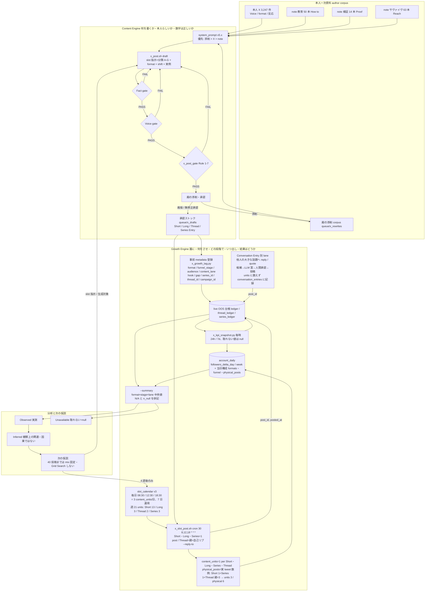
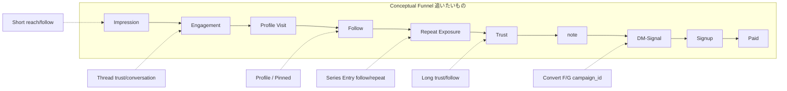
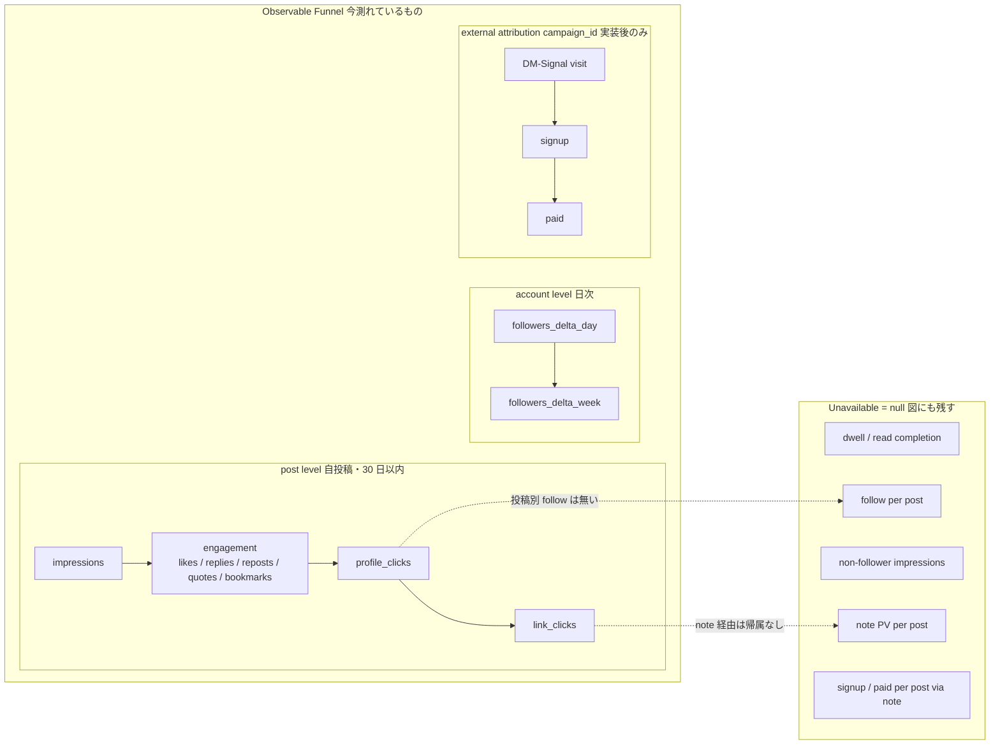
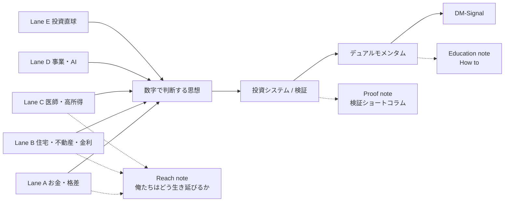
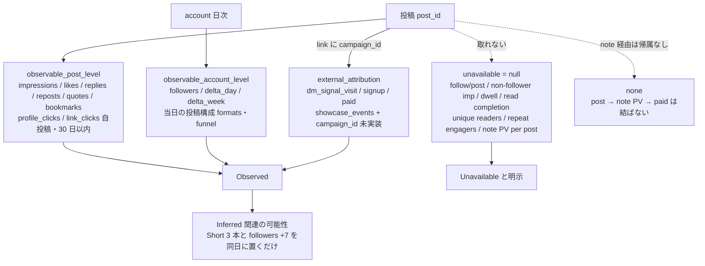
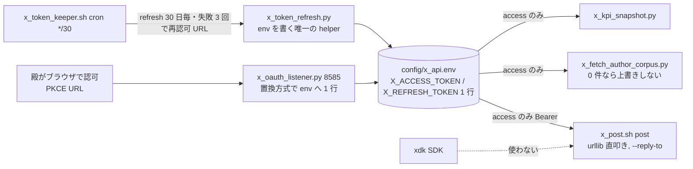

<!-- gist-master: da5adc2c7ff639d4b83e10355d46176b x_growth_engine_asis_tobe_5w1h_20260904.md -->
# X Growth Engine 設計書 v1.0 — AsIs/ToBe 5W1H(2026-09-04 14:51 殿指示)

- 発端: 殿 2026-09-04 14:51『Content Engine はかなり完成した。次は「その投稿でフォロワーが増えるか・note/DM-Signal へ流入するか・登録/有料化へつながるか」。Content Engine を再設計せず、上位に Growth Engine を設計・実装せよ』
- 上流正本: 方針 `docs/research/x_editorial_doctrine_20260904.md`(12:42 + 14:38 conversation gap)→ Content 設計 `docs/research/x_account_ops_automation_asis_tobe_5w1h_20260903.md` §16/§17 → 分析 `docs/research/x_author_corpus_analysis_20260904.md` → 本書
- 実装正本: `skills/x-post-pipeline/growth_schema.yaml`(定義)/`slot_calendar.yaml`(Growth 列)/`queue/x_rewrites/R4-*.yaml`(growth: ブロック)/`queue/x_live_oos/ledger.yaml`(live OOS 台帳)/`scripts/x_ops/{x_growth_tag.py,x_kpi_snapshot.py,x_slot_post.sh}`
- 不変: A〜G 分類、author corpus、human rewrite corpus、system_prompt_v5.x、承認済み 13 本は維持(殿)。本書は「良い文章を獲得につなげる仕組み」の追加のみ。

## §0 AsIs / ToBe(1 表)

| 項目 | AsIs(09-04 14:50) | ToBe(v1.0) |
|---|---|---|
| 最適化対象 | 投稿品質(Fact/Voice 6 軸) | ファネル全体。1 投稿の仕事は 1〜2 段階 |
| 軸 | content_category A-G のみ | + audience / funnel_stage / desired_action / hook_type / conversation_gap / link_type / series / external_context / topic_level |
| 配分 | 分類比 A-E 80/F 15/G 5 | + format 比 Short 13/Long 3/Thread 2/Series 3 per 週(v1.4)+ 段階比(42 slot: reach 9/follow 11/trust 18/convert 4。Long/Thread を trust に置くため reach は format で稼ぐ)。4 週固定 |
| 投稿 | 手動 post | cron 定時投稿 `x_slot_post.sh`(**v1.4: 7 日運用・毎日 08:30/12:30/18:30=3 content_units/日、週 21**。Thread は親+自己リプで units 1・physical_posts 1+n)+ 台帳へ post_id。Conversation Entry は別 lane で units に数えない |
| 計測 | public_metrics 手動 | `x_kpi_snapshot.py` 毎時: 24h/7d snapshot(observable_post_level 8 種、取れない値は null)+ account 日次(followers_delta_day/week+当日構成)。可否正本=kpi_availability.yaml(v1.3) |
| 会話 | なし(自分の島) | Conversation Entry lane(半自動、承認必須) |
| プロフィール | 未監査 | §11/§12 監査済み、改善案提示(変更は殿) |
| note | 販売リンク | Trust Amplifier(X=Hook、note=Proof、DM-Signal=Product) |

## §1 最終目的とファネル

Impression → Engagement/Dwell → Profile Visit → Follow → 再接触 → Trust → note → DM-Signal → Signup → Paid。
**規則**: 全投稿に全段階を担当させない。1 投稿=1〜2 段階(`growth.funnel_stage` + `desired_action`)。

## §2 Content Category × Funnel Role の分離

| funnel_stage | 目的 | desired_action | 既定 link |
|---|---|---|---|
| reach | 非フォロワーを止める。DM を知らなくても分かる | dwell/reply/quote/profile | none |
| follow | 「次も読みたい」=未来価値(series) | profile/follow | none |
| trust | 「ちゃんと調べている」。bookmark が主 proxy | bookmark/follow/note | none or note |
| convert | 信頼済みの人を note/DM-Signal へ | note/dm_signal/signup/paid | note or dm_signal |

category→既定 stage: A/D=reach、B=follow、C/E=trust、F/G=convert(C の series 1 本は follow、F の 2 本目以降は trust)。既定は `growth_schema.yaml category_defaults`。投稿単位の上書きは `x_growth_tag.py OVERRIDES`。

## §3 Audience 階段

general → investor → systematic → dual_momentum → dm_signal。入口ほど広く。13 本の現状: general 6 / systematic 5 / investor 1 / dual_momentum 1(dm_signal 0)。calendar 20 slot: general 4 / investor 3 / systematic 9 / dual_momentum 3 / dm_signal 1。**systematic 偏重が見える。Reach 素材(§5)の追加生成で general/investor を増やす。**

## §4 Topic ladder

1 お金・格差・複利・確率 → 2 投資の数学 → 3 投資システム → 4 検証 → 5 モメンタム → 6 デュアルモメンタム → 7 DM-Signal。
`growth.topic_level` を各投稿に持つ。stock_ledger への `topic_level/possible_previous_topic/possible_next_topic` は **v1 では追加しない**(64 entry の手作業になり複雑化。まず投稿側の topic_level で分布を見る)。

## §5 Reach 素材一覧

`growth_schema.yaml reach_materials` R01〜R10(殿例 7 + 暴落/−80%/医者年収 3)。うち承認済み 13 本で既に持つもの: R01(D-1)、R04(A-3)、R05(A-4)、R06(A-1)、R07(C-1)、R09(D-1)。**未生成 = R02 勝率、R03 長期、R08 暴落、R10 医者年収**。次の生成 round(Round5)はこの 4 本+E/G を対象にする。
根拠(§18): 本アカウントで math_prob テーマは like 中央値 7・bookmark 平均 15.8 と全テーマ最高、medical×お金は imp 平均 13,737 と最大。**Reach の主力は「お金の数学」と「医者のお金」**。

## §6 Follow Engine(series)

series `trust_system`「僕が投資システムを信用するまで」9 本(βを引く/OOS/WF/パラメータ全振り/計算日ずらし/執行日ずらし/二次元ずらし/論文再検証/不採用結果)。規則: 各投稿単独で意味が通る、末尾 (n/9) 可。R4-C-1(β調整後リターンを WF で分析しろ)を 1/9 に割当済み。残 8 本は Round5 で生成し、slot C(follow)へ順次。

## §7 Conversation Engine(別 lane)

対象: インデックス論/FIRE/暴落/積立/高配当/レバレッジ/モメンタム/バックテスト/有名論文/投資系の大きな投稿。
流れ: 候補検出(v1 は殿または将軍が URL を渡す。API 検索は Basic tier の recent search 制限を確認してから)→ LLM 案(v5.x + 「相手に同意できる部分を先に認めてから本人の視点を 1 つ接続」)→ 要操作 ntfy で承認 → reply/quote(`x_post.sh` に `--reply-to`/`--quote` を追加する。v1.1)。**自動 reply spam 禁止。**
根拠: 本人 X の reply like 上位 172/137/87/81 は全て他人の大きな話題(医療×経営)への接続。quote の imp 中央値 1,152 は single の 1.85 倍。

## §8 conversation gap の統合

`growth.conversation_gap` low/medium/high。13 本の付与: high 3(A-1/A-4/C-1)、medium 8、low 2(B-3/F-3 数字の投稿)。forward test の問い: gap=high は reply/quote が多いか(t24h reply_count, quote_count)。gap は Fact gate 通過が前提(悪い gap=誤り・隠蔽は Fact gate で落とす)。

## §9 note の役割 = Trust Amplifier

X(疑問・違和感・結論・数字 1 組)→ note(検証設計・方法・全データ・図・反証・失敗)→「本当に計算しているんだな」→ DM-Signal(その思想の実装)。X=Discovery/Hook、note=Proof、DM-Signal=Product。
実装: trust 投稿の link は「必要な時だけ note」。note 側で `?utm_source=x` 等は note が UTM を保持しないため **note PV の投稿別帰属は取得不能**(note ダッシュボードの日次 PV と投稿日を突合する手作業のみ)。

## §10 DM-Signal への導線

毎回貼らない。convert 段階(F の 1 本目 + G)のみ。順序は「検証結果 → この検証思想で作っている → DM-Signal」。**dm-signal.com へは `?utm_source=x&utm_content=<draft_id>` を付ける**(LP は静的で UTM を捨てないため、Render のアクセスログまたは Cloudflare Analytics で投稿別訪問を取れる。設定は v1.1)。

## §11 Profile 監査(実物 2026-09-04 14:52、API users/me)

| 項目 | 現状 | 所見 |
|---|---|---|
| display name | バム | 何者か分からない。X Voice は維持するとして「バム｜耳鼻科医×デュアルモメンタム」等の副題は候補 |
| bio | 東京の耳鼻科医｜診療と資産形成｜再現性と自由を追求 デュアルモメンタム×配当｜医師や忙しい人向け｜開業医の DX｜インカム×キャピタルの両立｜noteで戦略共有中 ▶ bit.ly/note-dm | 「何者か」は分かる。「フォローすると何が得られるか」「DM-Signal との関係」が無い。『配当』『開業医の DX』『インカム×キャピタル』は現在の発信軸(数学・確率・検証)とずれる |
| url | note.com/tokyojibika | note 直。DM-Signal へは bio の bit.ly のみ |
| pinned | 1534035934660132864(2022-06-07、画像 4 枚の投稿) | 4 年前。現在の思想・DM-Signal と無関係 |
| followers/following | 4,428 / 981 | listed 47、tweet 24,418 |
| profile image / header | 2021-07 の画像(URL のみ確認、内容は未確認) | 実物目視は殿 |

改善案(勝手に変えない): bio 案「東京の耳鼻科医。投資を数学・確率・検証で考える。デュアルモメンタムを自分で検証して運用、その実装が DM-Signal。noteで検証を全部出す ▶ note.com/tokyojibika」。**殿の裁定待ち。**

## §12 Pinned Post 監査

現 pinned は 2022-06 の画像投稿で、初見の「何者か・なぜフォローするか」に答えない。候補比較:

| 案 | 内容 | 担当段階 | 長所 | 短所 |
|---|---|---|---|---|
| P1 | デュアルモメンタム完全ガイド(n171daa7f92a1) | trust→convert | 本人最大の資産、5700 倍投稿(bm 650)と同系 | 商品寄り。初見に重い |
| P2 | 「僕が投資システムを信用するまで」series の 1/9 | follow | フォロー理由=未来価値を直接示す | 単発では弱い(series が揃ってから) |
| P3 | 自己紹介+思想(3 原則を本人 Voice で) | follow | 何者かに即答 | 数字が無い |
| P4 | DM-Signal 長期検証(公開成績+MaxDD+ベンチ) | trust | 本人 09-03 投稿(1,227 imp/4 bm)が実証 | 商品説明に見える危険 |

推奨: **P3 を本文、P1 を返信 1 段目に付けた 2 段構成**(本人の型: root+リプ二段目)。series が揃ったら P2 へ差替え比較。裁定は殿。

## §13 外部リンク戦略

reach/follow=X 内完結、trust=必要時 note、convert=note/DM-Signal。観測(§18): 投資系 single で URL あり imp 中央値 786(n=395) vs なし 636(n=174)。**このアカウントでは URL ありの方が中央値が高かった**。因果ではない(記事告知投稿が混在)。forward test で link_type 別に比較する。

## §14 投稿頻度

~~平日 2 投稿(cron `30 8,18 * * 1-5`)~~ → **v1.4(2026-09-04 16:23 殿レビュー裁定): 7 日運用・3 content_units/日(cron `30 8,12,18 * * *`)を初期 Live OOS 候補**。Conversation Entry は別 lane。投稿量比較は §50(followers_delta/day・week、total impressions/day)。

## §15 metadata schema

`growth_schema.yaml metadata_schema`。13 本へ `growth:` ブロック付与済み(`x_growth_tag.py`、既存フィールド不変)。slot_calendar に `funnel_stage/audience`(+series_id)を追加済み(最小変更)。

## §16 初期配分仮説(固定)

20 slot 実値: reach 7 / follow 4 / trust 7 / convert 2(A4 D4 → 1 本の A が投資家向け trust 寄りのため計算上 reach 7)。殿候補 40/25/25/10 との差は follow −1・trust +2。**4 週(40 投稿)固定。最適化禁止。**

## §17 KPI 体系

| 層 | 指標 | 取得 |
|---|---|---|
| Impressions | impression_count | 可(public) |
| Engagement | like/reply/repost/quote/bookmark | 可 |
| Profile | user_profile_clicks | 可(non_public、自投稿のみ。実証: 第 1 弾で 0/40imp) |
| Acquisition | followers_count 日次差分、follow/impression(日次近似)、follow/profile_visit | 日次のみ。**投稿別 follow は取得不能** |
| Trust | bookmark、repeat engagement(同一 user の再反応=取得不能)、url_link_clicks | bookmark・link_clicks は可 |
| Conversion | dm-signal visits(UTM 導入後)、signup/paid(DM-Signal DB 日次) | 投稿別は UTM 後。signup/paid は日次数のみ |

推測値は書かない。取得不能は台帳に書かない(空のまま)。

## §18 本人 X Growth 分析(3,247 件、観察データ。因果断定しない)

| 切り口 | n | like 中央値 | bookmark 平均 | imp 中央値 |
|---|---|---|---|---|
| 単独 全体 | 1,511 | 3 | 2.96 | 623 |
| 単独 投資系+ | 569 | 5 | 2.14 | 728 |
| URL あり / なし | 395 / 174 | 5 / 4.5 | 2.74 / 0.79 | 786 / 636 |
| 数字あり / なし | 452 / 117 | 5 / 4 | 2.61 / 0.35 | 774 / 613 |
| 疑問形 / なし | 52 / 517 | 5.5 / 5 | 1.73 / 2.19 | 913 / 712 |
| DM-Signal 言及 / なし | 37 / 532 | 6 / 5 | 0.38 / 2.27 | 731 / 728 |
| 長さ ≤80 / 81-140 / >140 | 96 / 266 / 207 | 4 / 5 / 6 | 0.36 / 1.07 / 4.35 | 609 / 718 / 791 |
| テーマ math_prob | 44 | 7 | 15.84 | 965 |
| テーマ investing | 385 | 5 | 2.79 | 739 |
| テーマ dm_signal | 180 | 5.5 | 0.48 | 722 |
| テーマ verification | 73 | 4 | 0.71 | 681 |
| テーマ medical | 75 | 5 | 7.28 | 1,002 |
| reply | 1,226 | 1 | 0.25 | 323 |
| quote | 359 | 3 | 0.54 | 1,152 |

読み(このアカウントでは、の範囲): (1) 数字ありは bookmark 平均 7 倍。(2) 140 字超は bookmark 平均 4 倍・reply 中央値 1。(3) math_prob は全テーマ最高(like 7、bm 15.8)。(4) DM-Signal 言及・verification は bookmark が低い=**商品名・検証語は保存されない。数字と数学は保存される**。(5) quote は imp が single の 1.85 倍。(6) 疑問形は imp 中央値が高く bookmark は低い=reach 向き。

## §19 bookmark 分析

bookmark≥2 の単独 144 件: 数字あり 128(89%)、URL あり 113(78%)、長さ中央値 133.5。上位: 年収⇄手取り計算(2,499)、5700 倍 DM(650)、町医者データ(368)、iDeCo(24)、専従者給与(19)。**共通点=「読者が自分の数字に当てはめて使える計算・表・具体額」**。DM の bookmark 上位は「5700 倍」「DM×3 倍レバ/ノンレバの使い分け(36)」。09-03 の DM 解説+検証数字(4 bm)はこの型。Trust proxy として bookmark を採用し、trust 投稿には「当てはめて使える数字 1 組」を必須にする(Content 側 v5.x に追記しない。slot 指示で渡す)。

## §20 Live OOS

台帳 `queue/x_live_oos/ledger.yaml`: 事前 metadata(13 本+第 1 弾 baseline)→ `x_slot_post.sh` が投稿し post_id/posted_at 記入 → `x_kpi_snapshot.py`(cron 毎時 15 分)が 24h/7d 到達時に snapshot → followers 日次 `account_daily.jsonl`。
API コスト: /2/tweets ids≤100 を毎時 1 回、/users/me 毎時 1 回。Basic tier で十分。
開始: 本日 2026-09-04(金)18:30 slot A(cron 登録済み)から。次は 09-07(月)08:30。在庫 13 本(A3 B3 C3 D3 F1、E/G 0)。E/G slot は在庫が無いと繰り下げになるため Round5 で E 4 本・G 1 本を先に生成する。

## §21 Content / Growth の分離

Content Engine=何を書くか・本人らしいか・数字は正しいか(v5.x + Fact/Voice gate)。Growth Engine=誰向けか・何をさせるか・どの段階か・いつ出すか・結果はどうか(growth_schema + calendar + ledger + snapshot)。Growth 側は本文を書き換えない。Content 側は metadata を読まない(slot 指示で「担当段階・audience・topic_level」だけ渡す)。

## §22 最適化を急がない

40 投稿(4 週)まで比率・型の変更禁止。比較は中央値で、「このアカウントでは」の範囲で書く。IS で良かった設定を即採用しない。

## §23 成果物と実装進捗台帳

| # | 成果物 | 状態 | 実体 |
|---|---|---|---|
| 1 | Growth Engine 設計書 | 済 | 本書 |
| 2-4 | funnel/audience/funnel_stage 定義 | 済 | growth_schema.yaml |
| 5 | topic ladder | 済(投稿側 topic_level。ledger 側は v1 見送り) | 同上 |
| 6 | Reach 素材一覧 | 済(R01-R10、未生成 4) | 同上 |
| 7 | series 設計 | 済(trust_system 9、1/9 割当) | 同上 |
| 8 | Conversation Entry 設計 | 済(実装 v1.1: reply/quote オプション) | §7 |
| 9 | Profile 監査 | 済(改善案は殿裁定待ち) | §11 |
| 10 | Pinned Post 監査 | 済(P3+P1 推奨、殿裁定待ち) | §12 |
| 11 | note Trust Amplifier | 済 | §9 |
| 12 | DM-Signal 導線 | 済(UTM は v1.1) | §10 |
| 13 | KPI schema | 済(取得可否を明示) | §17 |
| 14 | metadata schema | 済+13 本付与 | x_growth_tag.py |
| 15 | X Growth 分析 | 済(3,247 件) | §18/§19 |
| 16 | live OOS ledger | 済(14 entries) | queue/x_live_oos/ledger.yaml |
| 17 | 24h/7d 計測 | 済(cron 毎時、書式実証済み) | x_kpi_snapshot.py |
| 18 | slot_calendar Growth 列 | 済 | slot_calendar.yaml |
| 19 | スクリプト | 済 3 本(+cron 2 本) | x_growth_tag / x_kpi_snapshot / x_slot_post |
| 20 | AsIs/ToBe | 済 | §0 |
| 次 | Round5 生成(Reach 4・E 4・G 1・series 8)、reply/quote 実装、UTM、bio/pinned 裁定 | 未 | — |

### 実装進捗台帳(loop ごとに更新)
- 2026-09-04 15:00 v1.0: schema/tag/ledger/snapshot/slot_post/cron/calendar/分析/監査 完了。live OOS 開始=本日 18:30 slot A。

---

# v1.1 追補(2026-09-04 15:01 殿指示『第 3 マガジンで Reach を広げ、上位ブランドを置く』)

不変: Content Engine・author corpus・human rewrite corpus・承認 13 本は壊さない。追加=「Reach を広げる本人一次資料」と「アカウント全体の上位ブランド」。定義の正本は `growth_schema.yaml` v1.1 追加節。

## §24 第 3 マガジン corpus(成果物 1)

`docs/research/x_corpus/note/m8357970d6430/`(63 記事、`_index.json`)。取得 2026-09-04 15:03、note API v1 layout/magazine → v3 notes。無料 49 本は全文、有料 14 本は導入のみ(文字数 120〜1,251)。**3 系統は混ぜない**:

| 系統 | マガジン | 記事数 | 文字数中央値 | です/ます 中央値 | 数字/記事 | 役割 |
|---|---|---|---|---|---|---|
| DM 教育 | mb4377418b422 | 50 | 3,866 | 40.5 | 143.5 | Education(How to) |
| 検証・数学 | m6557263f0241 | 14 | 519 | 3 | 58.5 | Proof |
| サヴァイヴ/社会・経済 | m8357970d6430 | 63 | 2,738 | 7 | 30 | Reach |

第 3 マガジンの題名分類(63): 医療経済 15(給与 800 万/二重累進/社会保険/開業規制/診療報酬)、不動産・住宅・金利 6(タワマン/表面利回り/フルレバ大家/相続アパート/繰り上げ返済/iDeCo)、事業・キャッシュ 8(真水のキャッシュ/法人成り/副業/レアリティ)、AI・戦国列伝 18、その他(思考法/イベント) 16。**Reach 向き=約 30 本。**

## §25 第 3 マガジン文体分析(成果物 2・8)

3 つの Voice を実測:
1. **Story Voice**(2026-08〜09 の 4 本+2024 の勤務医/ニワトリ): 一人称「僕」または「A 氏」、1 行 1 文の短文改行、数字を列挙して開く(年収/価格/金利/利回り)、定型句**「これは金利のある世界の話。」**で前提転換を宣言、金利を段階的に上げて(0.8→2.5→3.5→4.5→5%)再計算、説教せず**皮肉の一句で終える**(「表面利回りは、8% だった。」「『不動産は長期目線が大事。』すぐに 87 件のいいねが付いた。」「パソコンを開いた。久しぶりに求人サイトを見た。」)。
2. **バム persona Voice**(2025-10〜2026-07 の 3 本): 「ヤーマン、今日も生きてるか？俺はバムだ」、ゾンビ/荒野/ラムコーク/「アディオスアミーゴ」、俺・お前。**X 3,247 件に「ヤーマン」0 件=note 専用。X には持ち込まない。**
3. **論説 Voice**(医療経済 15 本): です/ます、制度名と数字、結論は均衡点(年収 800 万、like 46)。

X 圧縮の型(§story_hook_pattern): 1 投稿=構造の 1 段、数字 2 組(前提前/後)+皮肉の一句。root に前提、リプに転換(本人の二段目型)。note 本文の要約はしない。

## §26 Reach topic map(成果物 3)+ X 突合(成果物 9)

本人 X 単独投稿のテーマ別反応(観察。因果断定しない):

| テーマ | n | imp 中央値 | imp 平均 | like 中央値 | bookmark 平均 |
|---|---|---|---|---|---|
| 高所得/年収 | 36 | 1,669 | **39,942** | 6 | **74.6**(年収⇄手取り 916k imp 含む) |
| 医師/医者 | 75 | 1,279 | 11,619 | 5 | 7.5 |
| インデックス | 37 | 1,060 | 9,126 | 7 | 20.7 |
| 不動産 | 22 | 1,032 | 6,179 | 6 | 4.4 |
| 住宅ローン | 10 | 1,288 | 5,004 | **9** | 4.9 |
| 数学/確率 | 42 | 992 | 3,188 | 6 | 16.5 |
| 開業 | 16 | 1,890 | 3,215 | 4 | 1.8 |
| 相続/税 | 18 | 1,113 | 2,690 | 5 | 2.9 |
| DM | 227 | 773 | 2,589 | 6 | 3.9 |
| 事業/経営 | 58 | 764 | 1,750 | 4 | 1.6 |
| 金利 | 23 | 826 | 1,650 | 3 | 1.1 |
| AI | 104 | 618 | 1,061 | 3 | 0.5 |
| FIRE | 1 | 756 | 756 | 10 | 0 |

読み: 高所得・医師・インデックス・不動産・住宅ローンは imp 平均が DM 単独の 2〜15 倍。AI は本数 104 で最も反応が薄い(Reach ではなく Follow/Story 素材)。**Reach topic map の優先順=①高所得/年収≠資産 ②医師のお金 ③住宅ローン・不動産・金利 ④インデックス/格差 ⑤投資数学。**

## §27 content_lane(成果物 4)

9 lane(schema `content_lane`): investing / dm / math_probability / money_inequality / real_estate_mortgage / business_cash / medical_economics / ai_automation / survival_story。3 軸管理=content_category(何を話すか)×funnel_stage(どこを担当)×content_lane(何のレーン)。13 本に付与済み(dm 4、math_probability 5、investing 3、money_inequality 1)。**real_estate/business/medical は 0=Round5 で生成。**

## §28 multi-entry funnel map(成果物 5)

Lane A お金・格差 / B 住宅・不動産・金利 / C 医師・高所得 / D 事業・AI / E 投資直球(schema `entry_lanes`)。全て「数字で判断する思想→投資システム→DM→DM-Signal」へ収束。**Reach 投稿単体で DM-Signal へつなげない。橋は profile と次の投稿。**

## §29 cross-topic bridge map(成果物 6)

6 本(schema `cross_topic_bridges`、全て本人記事に source あり): 住宅ローン→キャッシュフロー→MaxDD→DM / 表面利回り→手残り→バックテスト年率も同じ→β・OOS / 利益とキャッシュ→経路→幾何平均・DD / 高年収→フローとストック→資本格差→DM / 相続アパート→金利が次の買い手の値段を下げる→前提が変わったら降りる(絶対モメンタム) / 給与均衡点 800 万→平均や肩書きではなく構造→A-1。

## §30 Reach シリーズ候補(成果物 7)

本人の題名・定型句から 5 本のみ(想像で増やさない): 「金利のある世界」(定型句 4 記事+X 投稿)、「俺たちはどう生き延びるか」(マガジン名、X imp 145,944)、「年収と資産は別物」、「見かけの数字と真水」、「医師のお金の罠」。hook_type に story / scenario / irony を追加。

## §31 ブランド仮説の検証(成果物 11・12)

仮説「数字を見て、どう生き延びるかを考える人。投資は DM を深くやり、実装が DM-Signal」。整合確認: 第 3 マガジン題名にサヴァイブ/詰む/ﾀﾋぬ 8、数字・年収・キャッシュ・利回り・金利 19、医療経済 15。X の imp 上位テーマは高所得・医師・不動産・住宅ローン。**整合する。** ただし AI・戦国列伝 18 本は「生き延びる」より「作る」の話で、ブランド thread では「検証・再現性」に接続する(Lane D)。
Profile 再評価: 現 bio「デュアルモメンタム×配当｜開業医の DX｜インカム×キャピタル」は **DM 専門垢にも雑多垢にも見える両方の欠点**を持つ。上位概念を先頭に置き、DM-Signal は実績(Proof of Work)として後段に置く案: 「東京の耳鼻科医。数字を見て生き延びる方法を考える。投資・不動産・事業・医療をキャッシュフローと確率で見る。投資はデュアルモメンタムを自分で検証して運用、その実装が DM-Signal ▶ note」。**殿裁定待ち(変更しない)。**

## §32 note 三層(成果物 10)

Reach note=m8357970d6430「俺たちはどう生き延びるか」← Reach 投稿 / Education note=How to ← B / Proof note=検証ショートコラム ← C・E / DM-Signal ← Trust 十分な convert のみ。link_type に `note_reach / note_howto / note_proof` を区別して記録する(台帳 v1.2)。

## §33 Reach mix 初期仮説(§12)

Reach 内: money/social/survival 40 / investment math 30 / investment common sense 20 / DM intro 10。根拠は §26 の反応と素材数(Reach 向き 30 本、投資数学 12 本)。固定せず 40 投稿後に見直す。現在の在庫 13 本は全て投資・数学 lane のため、**Round5 で real_estate_mortgage 3・medical_economics 3・business_cash 2・money_inequality 2 を story/irony hook で生成**し、殿の添削を受ける。

## §34 発信力 KPI(§13)

取得可: profile_visits(np_user_profile_clicks)、follows(日次差分)、replies/quotes/bookmarks、topic_breadth(台帳 content_lane 分布)。**API で取得不能: non-follower impressions(X Analytics 画面のみ)、repeat engagers、cross-topic migration(user 単位)。** 代理設計 v1.2: 投稿ごとの reply/quote user id を conversation search で取り、lane を跨いで同じ user が現れる件数を migration の代理指標にする。

## §35 禁止(§17)

DM-Signal へ無理につなげる / 全投稿を投資へ着地 / 住宅・医療・不動産投稿を商品広告に / 雑多垢化 / 恐怖だけで釣る / 煽りを本人実績以上に / Reach のために Voice を壊す / 数字の正確性を落とす。gate 実装: x_post_gate Rule 7 を lane 別に拡張(real_estate/medical/business lane に DM-Signal 名が入ったら FAIL)は v1.2。

### 実装進捗台帳(v1.1)
- 2026-09-04 15:10 v1.1: 第 3 マガジン 63 本 corpus 化、3 系統統計、Story/persona/論説 Voice 実測、X テーマ突合 13 分類、content_lane 9+13 本付与、entry lane 5、bridge 6、series 5、note 三層、ブランド仮説検証(整合)、bio 案 v2(殿裁定待ち)。未: Round5 生成(lane 別 10 本)、gate lane 拡張、link_type 細分、migration 代理指標。

---

# v1.2 追補(2026-09-04 15:11 殿裁定『投稿フォーマット × 投稿量』)

殿裁定(要旨): X 投稿には Short / Long / Thread / Series Entry の 4 format があり、文字数違いではなく別の商品。Short=発見される、Long=信頼される、Thread=深く読まれ会話される、Series=次を期待されフォローされる。投稿量は content_units と physical_posts に分け、Volume×Format×Funnel×Topic で管理する。最初から多次元最適化せず、自然な初期 mix を固定して Live OOS。事前分類が正本、事後の付け替え禁止。定義の正本=`growth_schema.yaml` v1.2 追加節(format / format_metadata / volume / format_x_funnel_hypothesis / initial_format_mix_4w / x_format_analysis_20260904)。

## §36 format 定義(成果物 1〜5)

| format | 定義 | 役割 | 主 KPI(取得可のみ) | 実装 |
|---|---|---|---|---|
| Short | 違和感・数字・主張を 1 つ。全部説明しない。gap 可 | reach / follow | np_impression, profile_clicks, follows(日次), replies, quotes | 現行 x_post.sh |
| Long | X 内で疑い→検証→数字→解釈→次の疑い。note より浅く Short より深い | trust / follow | bookmarks, profile_clicks, follows, replies, link_clicks | note_tweet(長文 slot) |
| Thread | 親+自己リプ。一段ごとに新しい疑問/数字/検証。各段単独でも意味 | trust / conversation / follow | parent imp, continuation(リプ imp 平均/親 imp), replies, bookmarks, total | `x_post.sh post <draft> --reply-to <parent_id>`(実装済み) |
| Series Entry | 複数日の独立投稿。各回単独成立、続きがあると分かる | follow / repeat / trust | follows, later_entry_impressions, series_continuation, bookmarks | series_id/order/total、`series_ledger.yaml` |

dwell/read、repeat engagers、non-follower impressions は API で取得不能。推測しない。

## §37 content_units / physical_posts(成果物 6)

content_units=Short 1、Long 1、Series Entry 1、Thread(親+全リプ) 1。physical_posts=実 tweet 数。例: Short 1+Series 1+Thread(親+3)=units 3 / physical 6。台帳 meta `volume_rule` と各 entry `physical_posts` に記録。現行は平日 2 units/日。

## §38 Format × Funnel / Format × Lane(成果物 7・8)

仮説: Short→reach、Long→trust、Thread→trust+conversation、Series→follow+repeat。台帳は format×funnel_stage×content_lane を保存するだけ(`x_kpi_snapshot.py --summary` が中央値を format/stage/lane/window 別に出す)。Grid Search はしない。

## §39 初期 4 週 Format Mix(成果物 9・15)

slot_calendar v1.2: 08:30=Short(10)、月 18:30=Short(2)、火木 18:30=Long(4)、水 18:30=Thread(2)、金 18:30=Series Entry(2)。週 10 content_units は不変、physical_posts は Thread 分だけ増える。**現在の在庫 13 本は全て Short**(104〜147 字)なので、Long/Thread/Series slot は在庫ができるまで Short で埋め、`x_slot_post.sh` が `format_fallback=short` をログに残す(事前登録は short のまま。事後に long と呼ばない)。

## §40 Thread / Series ledger(成果物 10・11)

`queue/x_live_oos/thread_ledger.yaml`(親+リプ、continuation)、`queue/x_live_oos/series_ledger.yaml`(trust_system 9 回=1/9 割当済み、金利のある世界=候補)。

## §41 本人 X の format 分析(成果物 12)

conversation_id で自己リプ Thread を復元(親 506・自己リプ 1,002、親≥2 リプは 210):

| format | n | imp 中央値 | imp 平均 | like 中央値 | bookmark 平均 | reply 平均 |
|---|---|---|---|---|---|---|
| Short(≤140、非 Thread) | 926 | 566 | 1,314 | 3 | 0.38 | 0.11 |
| Long(>140、非 Thread) | 194 | 734 | 1,136 | 4 | 0.74 | 0.07 |
| Thread 親 | 506 | **893** | **5,189** | **5** | **8.08** | **1.16** |
| Thread 自己リプ | 1,002 | 344 | 989 | 1 | 0.27 | 0.52 |
| Series-like(番号付き) | 5 | 1,043 | 983 | 4 | 0.60 | 0.40 |

continuation(自己リプ imp 平均/親 imp)の中央値 0.42。上位 2 Thread(年収⇄手取り 916k、町医者データ 397k)は親+リプ 9〜15 本で後続も 5〜7 万 imp。**このアカウントでは Thread 親が全 format 中で最も反応が高かった**(因果ではない。本人が力を入れた話題ほど Thread にしている可能性)。Series は本人 X に運用実績が無く、新規試行。

## §42 Live OOS schema 更新(成果物 14)

台帳 entry に `format` / `physical_posts` を追加(14 entries 反映)。事前登録の format/funnel_stage/audience/content_lane/conversation_gap が正本。`x_growth_tag.py` は format=short を既定にし、Long/Thread/Series は生成時に明示する。

### 実装進捗台帳(v1.2)
- 2026-09-04 15:20 v1.2: format 定義・units/physical・Format×Funnel/Lane・4 週 mix・calendar format 列・thread/series ledger・X format 分析・`--reply-to` 実装・`--summary` 集計・台帳 14 entries 更新。未: Long/Thread/Series の在庫生成(Round5)、Thread 投稿 runner(親→リプ連投の 1 コマンド化)、repeat engagers 代理指標。

---

# v1.3 追補(2026-09-04 16:07 殿裁定『KPI は実際に取得可能な情報だけ』)

殿裁定(要旨): 取得不能な KPI を要求しない。取れないものを 0 にしない。推測値で埋めない。取れる/アカウント単位/外部接続/不能を分ける。相関を因果と言わない。投稿単位に帰属できないものを投稿に割り振らない。取れないと明示すること自体を正しい実装とする。可否の正本=`skills/x-post-pipeline/kpi_availability.yaml`。v1.0 §17・v1.2 §36 の KPI 記述はこの §43-§50 で上書きする。

## §43 KPI 取得可否監査(成果物 1・5・19)

実測(16:10、自投稿 2095751048963240444 を GET /2/tweets、users/me):

| 項目 | 実レスポンス | 判定 |
|---|---|---|
| public_metrics 6 種 | impression 314 / like 4 / reply 0 / retweet 0 / quote 0 / bookmark 1 | observable_post_level |
| non_public_metrics | user_profile_clicks 2 / url_link_clicks 7 / engagements 15 / impression 312 | observable_post_level。**自投稿かつ 30 日以内のみ**(2022 年の投稿は「older than 30 days」で拒否) |
| organic_metrics | 同上の内訳 | 同上(冗長。保存しない) |
| promoted_metrics | 「promoted されていない投稿では取れない」 | 対象外 |
| users/me public_metrics | followers 4,428 / following 981 / tweet 24,418 | observable_account_level |
| non-follower impressions | tweet.fields に存在しない | **unavailable** |
| dwell / read completion | 存在しない | **unavailable** |
| 投稿別 follow | 存在しない | **unavailable** |

`x_kpi_snapshot.py` 監査: v1.2 までは non_public が返らない時にキーごと欠落し、集計で 0 扱いになり得た→v1.3 で **null を明示的に書き、np_null_reason(older_than_30d / api_unavailable)を併記**。`--summary` は null を除外して中央値を出し n_null を併記(N/A を 0 にしない)。

## §44 KPI availability matrix(成果物 2・3)

4 状態 observable_post_level / observable_account_level / external_attribution / unavailable と attribution(direct / account_level / indirect / none)を全 KPI に持たせた。post: impressions・likes・replies・reposts・quotes・bookmarks・profile_clicks・link_clicks・engagements=post_level(direct)。account: followers・followers_delta_day・followers_delta_week・day_composition=account_level。external: dm_signal_visit・signup・paid=external_attribution(campaign_id 実装後のみ direct)。unavailable: follows/post・non_follower_impressions・dwell・read_completion・unique_readers・repeat_engagers・note_pv/post。

## §45 NULL / 0 規則(成果物 4)

0=計測してゼロ。null=取得不能・失敗・未接続・帰属不能。台帳(snapshot の値)、account_daily(delta の前日行なし)、集計(`--summary` の N/A)、dashboard(§49)の全てで区別。null を平均に混ぜない。

## §46 account daily schema(成果物 6)

`queue/x_live_oos/account_daily.jsonl` 1 日 1 行(当日行は最終観測で置換、過去日は不変): date / ts / followers_count / following_count / tweet_count / **followers_delta_day**(前日行なし→null)/ **followers_delta_week**(7 日前なし→null)/ status / **organic_posts・physical_posts・conversation_entries・formats{short,long,thread,series_entry}・funnel{reach,follow,trust,convert}**(台帳の事前登録から当日分を集計)。投稿構成と delta は同じ行に並ぶが、分解・断定はしない(§50)。

## §47 live OOS ledger schema(成果物 7)

entry: draft_id / draft_file / growth{format, physical_posts, content_lane, content_category, funnel_stage, audience, hook_type, topic_level, desired_action, conversation_gap, link_type, external_context, series_*, thread_*, **campaign_id(convert のみ、作成時発行)**} / post_id / posted_at / snapshots{t24h,t7d: 6 public + np_* 4(null 可)+ np_null_reason + api_errors}。meta に null_rule・campaign_rule。Thread は thread_ledger で親+リプの延べ合計(unique を捏造しない)、Series は series_ledger で entry 合計。

## §48 DM-Signal campaign attribution 実装可能性(成果物 10・11)

現物確認: DM-Signal backend に `showcase_events` テーブルと `POST /api/public/showcase/event`(step enum 9+Free 系 3 語、source∈{lp,login,direct,rebalancer})が live(設計 v3 §2.6、context/dm-signal-core.md source_commit 172b6d35)。backend/frontend に `utm` 実装は **0 件**(grep 実測)。LP(`lp/`)は本 clone に無く別 repo の可能性(dm-signal-lp サービス)。
判定: **external_attribution として実装可能(未実装)**。案: (1) X 側で campaign_id `x_<YYYYMMDD>_<slot>_<nnn>` を作成時発行、link に `?utm_source=x&utm_medium=organic&utm_campaign=<campaign_id>&utm_content=<draft_id>` (2) LP が query を読み event POST に `campaign_id` を同送(静的 export でも client JS で可) (3) showcase_events に `campaign_id` 列追加、signup_google→ok まで持ち回り (4) 週報で campaign_id 別 visit/signup。paid は DM-Signal 内課金のみ追跡し、note 経由は帰属しない。起票は X lane 落着後(別 cmd)。

## §49 dashboard N/A(成果物 8)

X Growth の dashboard は未作成(現状は `--summary` の表)。作る時の規則: 0 と N/A を分け、N/A の理由(api_unavailable / not_measured / no_attribution / older_than_30d)を注記に出す。`--summary` は既に `N/A,n_null` 形式。

## §50 分析原則と投稿量 OOS(成果物 9・20-24)

Observed / Inferred / Unavailable を必ず分ける。例: Observed「9/4 followers +7」「9/4 Short 3 本」→ Inferred「投稿量と followers 増に関連の可能性」。禁止「Short を 3 本出したので 7 人増えた」。投稿量比較(2/3/4 posts/day)は total_impressions/day・total_profile_clicks/day・total_link_clicks/day・followers_delta/day・week で行い、follow/post は作らない。取得不能 KPI 一覧と将来案は kpi_availability.yaml の unavailable 節(status / reason / possible_future_solution)。status を差し替えるだけで schema を壊さない(value/status/reason の 3 つ組)。

### 実装進捗台帳(v1.4)
- 2026-09-04 16:30 v1.4(殿レビュー): §0/§14 を 7 日運用・3 units/日へ同期、slot_calendar v3(42 slot、cron 30 8,12,18 * * *)、§51.1 に 4 format+units/physical+Conversation Entry lane、§51.2 を Conceptual/Observable/Unavailable に分離、DM-Signal attribution は可・未実装のまま(conversion KPI を埋めない)。在庫 Short 13 は 3/日で 4 日強→Round5 を急ぐ

### 実装進捗台帳(v1.3)
- 2026-09-04 16:15 v1.3: kpi_availability.yaml 新設、x_kpi_snapshot.py を null 明示+delta+日次構成へ改修(実走: 16:13 行に delta null_no_prev_day を記録)、ledger meta に null_rule/campaign_rule、DM-Signal attribution 可能性=可(未実装、showcase_events 拡張)。未: campaign_id 発行の x_growth_tag 対応(convert 投稿生成時)、LP→event の campaign_id 同送 cmd、dashboard。

---

# §51 フローチャート(2026-09-04 16:18 殿指示。v1.0〜v1.3 の全体像)

## 51.1 全体パイプライン(v1.4: 4 format × content_units / physical_posts、Conversation Entry は別 lane)

## 51.2 Conceptual Funnel と Observable Funnel の分離(殿レビュー 16:23)

## 51.3 入口レーンの収束(v1.1 §28)と note 三層

## 51.4 KPI の取得可否と attribution(v1.3 §44。0 と null を混ぜない)

## 51.5 X token と投稿経路(T3-S-65/67/68 の教訓を構造にした形)

